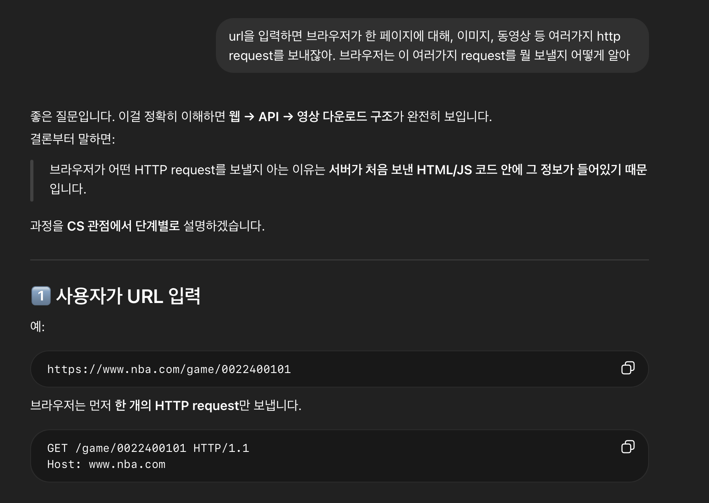
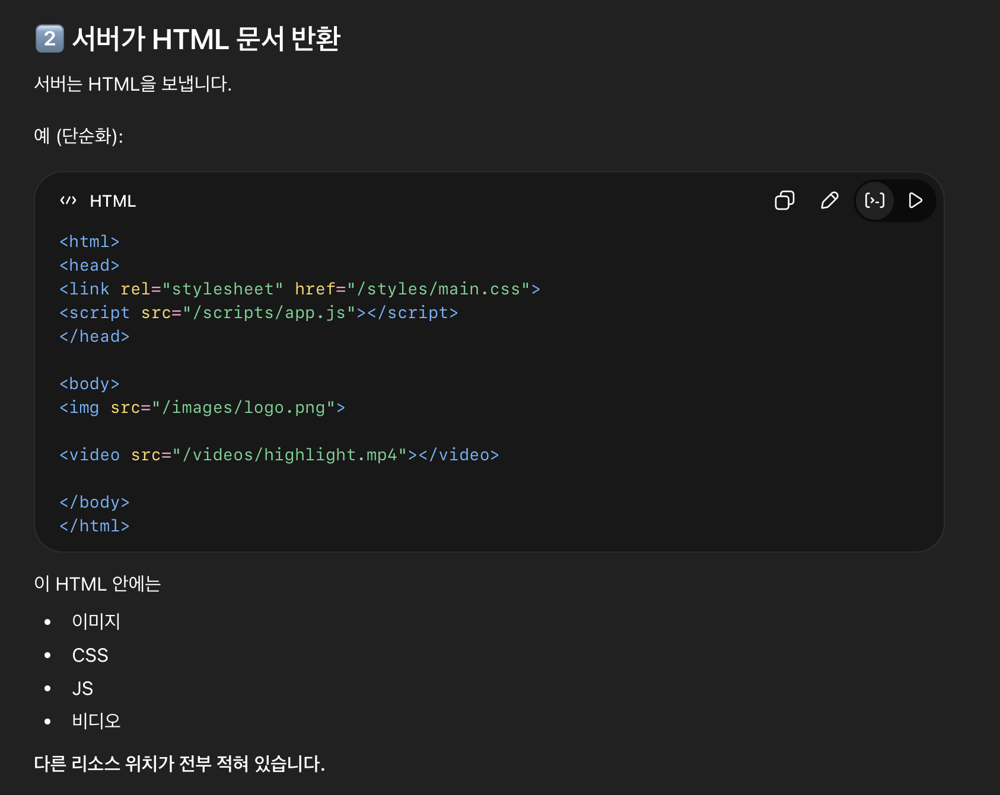
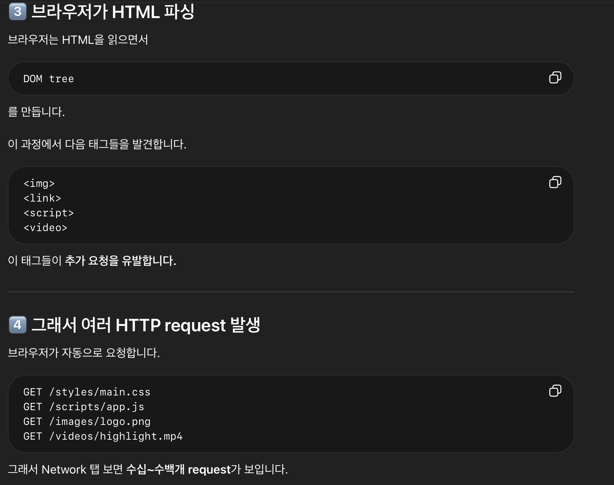
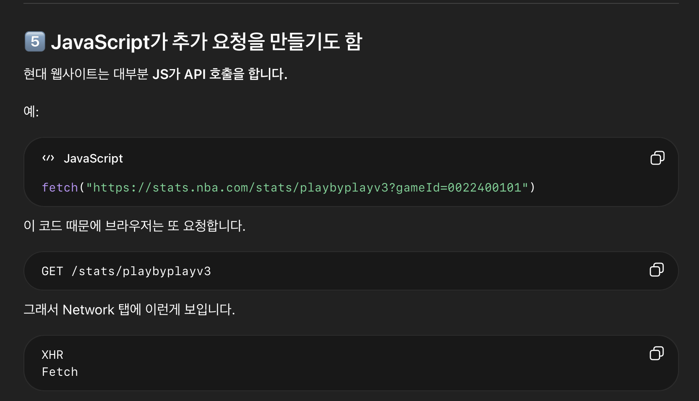

In this post, a brief overview of NBA Vision Project is shown.

# Project Overview Feedback

Project 계획에 대해 대학원생으로부터 다음의 피드백을 받았다. 

1. pose estimation하여 관절 정보를 이용하는 것 불필요할 것 같다. 그런 정보가 필요하다면 vision model에서 이며 학습될 것이다. 그리고, 관절 정보를 transformer에 이용하기 위해 벡터 차원 늘리는 과정에서 오히려 부정확해질 것이다.
2. (정확히 슈팅 직전까지만 crop 되지 않거나, crop 구간이 부정확할 수 있는 문제에 대해) 데이터 수를 늘리면 그 중에 슈팅 직전에 정확히 끊기는 영상도 많아질 것이므로 모델이 잘 학습할 것이므로 괜찮을 것이다.
3. (한 선수 데이터만으로 테스트하고 여러 선수로 일반화하려는 전략에 대해) 그것보다 차라리 애초에 많은 선수들의 데이터로 학습하는 게 좋을 것 같다. (그렇게 하게 되면 같은 자세라도 어떤 선수들에게는 좋은 자세이고 어떤 선수들에게는 나쁜 자세일텐데 문제가 되지 않냐는 질문에 대해) 모델이 선수들의 신장, 윙스팬 등의 정보를 알아서 학습할 것이므로, 괜찮다. 
4. 앞쪽을 tight하게 (슛 직전 다른 선수들 패스 등) 자르는 걸 추천한다. (가능하다면) 다른 선수들이 고려되지 않도록 슈터만 확대하여 crop하는 걸 추천한다. 이를 위해서 또 다른 딥러닝 모델을 사용하거나 잘 안된다면 학습할 필요성이 있는데 작업이 너무 복잡해질 수 있다.
5. google colab은 추천하지 않고, vast.ai를 추천한다. 


교수님으로부터 다음의 피드백을 받았다.

1. Classification 자체는 challenging 한 프로젝트가 아니다. 연구 novelty가 더 필요하다.
2. 연구 목적(감독 전술 평가, 중계 활용, 선수 피로도)이 classification 이라는 단순 작업을 하고 뒤이어 목적을 갖다 붙이는 느낌이다.
3. 위와 관련해서 vlm 모델을 만들어보면 어떨까. 즉, 예측한 확률을 바탕으로 그 확률이 나온 이유와 현재 상황을 설명해주는 vlm 모델을 만들어 해석력을 높이자.
4. 3차원 정보를 못잡고 pose 정보 유의미하지 않을 것이다.
5. 어떤 feature 들을 탐지할거 같은가? (윙스팬, 신장차이, 거리 등등) 그렇게 해서 예측을 어느 정도 하겠지만 그렇게 잘할거 같진 않다.
6. 주요 학회에서도 이런 농구 관련 application 연구들 많다. 선행연구 찾아보자.


**1. Data Pipeline**

- **Data Collection** : nba_api 이용하여 Stephen Curry 24/25 시즌 모든 슛 시도 PBP 영상 확보
  - 1K, 10GB (10MB per video) 
    - ❓로컬에서 수집?
    - ❓1K 이면 충분?
- **Data Labeling** 
  - game_id, event_id, shot_result 등 저장

    - ❓dataframe 저장, csv 저장, SQL 저장 성능 차이
    - ❓메타데이터를 얼마나 labeling 할 것인지
- **Event-based temporal alignment**
  - cv2 (이미지와 영상을 처리하는 라이브러리), pytesseract (이미지에서 문자를 인식(OCR) 하는 라이브러리) 이용 
  - Data Collection 단계에서 `extract_player_shots_all_games` 함수가 반환한 특정 선수의 모든 슛 시도 기록 dataframe에 저장된 슛 시도 시각과 event_id를 이용하여 해당 event_id 이름의 PBP 영상에서 스코어보드의 시간대가 슛 시도 시각과 일치하는 부분 영상 crop
    - ❓frame 기준 정해야 함. (PBP 영상은 60fps, 앞 뒤 60fps 총 2초)
    - ❓정확히 슛 모션 지점 포착이 어려운데 해결법. 이를 위한 또 다른 model 학습?
    - ❓7.8MB 영상 기준 로컬에서 2분 40초 소요. 시간 단축법.
- **Pose Estimation**
  - 각 video마다, `pose_seq` $\in \mathbb R^{T \times J \times D}$ 정보 저장. 
    - $T$ : frame 수, $J$ : 추적하는 관절 개수, $D$ : 각 관절마다 D차원 벡터로 표현 ($D=3$ 인 경우, ($x, y, conf$) 로 구성. $conf$는 모델이 keypoint를 얼마나 확신하는 정도)
    - `pose_seq[t, j] = [x, y, conf]`  
    - ❓특정 슈터만 추적 방법, 영상에서 가려진 관절 결측치 처리, 정규화

  - 구체적 방법 To Do


**2. Visual Appearance-Based Shot Success Prediction**

- pose 없이 순수 영상 정보로 성공 확률 예측 : $P(make \mid video)$ model 학습

  - Model : CNN(ResNet), ViT, video encoder model → temporal pooling → MLP

    - ```scss
      video clip
         ↓
      frame encoder (ResNet)
         ↓
      frame features (T x D)
         ↓
      temporal pooling
         ↓
      video feature (D)
         ↓
      MLP
         ↓
      sigmoid
         ↓
      P(make)
      ```

    - fame encoder : 각 프레임 이미지를 feature vector로 바꾸는 모델. 각 이미지 프레임에 대해 $feature_t \in R^D$ ($D=$ 512 또는 768). 모든 프레임을 encoder에 넣으면 $T \times D$ matrix가 나옴.

    - temporal pooling : MLP는 하나의 벡터만 입력받으므로, 위에서 얻은 matrix의 시간축을 하나로 압축하여 벡터화함. 가장 단순한 방법은 mean pooing. 그 결과 $video\_feature \in R^D$ 가 됨.

    - MLP와, sigmoid를 거쳐 최종 확률 계산.

  - Loss : Binary Cross Entropy, $L=−ylogp−(1−y)log(1−p)$ 

    - BCE가 이론적으로 타당한 이유 아래 정리.

  - Evaluation : accuracy, AUC, calibration, F1-Score, Brier Score, ECE (Expected Calibration Error)

**3. . Vision-Language Explanation of Shot Outcome**

- (video) → (p, explanation) model 구축

  - Ex. (21%, 수비 압박이 강하고 슈터가 이동 후 균형을 충분히 회복하지 못한 상태에서 슛을 시도하여 성공 확률이 낮게 예측되었다.)

  - Model 

    - ```scss
      video clip (B, T, 3, H, W)
      ↓
      video encoder
      ↓
      video feature z_v ∈ R^D
      ↓
      projection layer
      ↓
      language decoder 입력 embedding으로 변환 (언어모델 입력 차원에 맞게 선형변환)
      ↓
      text decoder autoregressive generation
      ↓
      explanation sentence
      ```

    - `B`: batch size, `T`: frame 수, `3` : RGB, `H, W`: 해상도(픽셀 수)

    - Option A. Video Encoder + T5

      - video encoder: Video Swin / TimeSformer
      - projector: linear layer
      - text decoder: T5-small / T5-base

    - Option B. Video Encoder + LLaMA 계열

      - video encoder: CLIP ViT 또는 Video encoder
      - projector: MLP
      - decoder: LLaMA / instruction-tuned small LLM

  - 이 단계의 핵심 문제는 학습을 위한 “정답 설명 문장”이 원래 없다는 점이다. 따라서 아래 중 하나를 사용한다. 

    - **Template-based pseudo labels** 

      - metadata와 예측 결과를 조합해 규칙 기반 설명 생성

      - ```scss
        if shot_distance is long and result is miss:
            "비교적 먼 거리에서 시도한 슛으로 난도가 높았다."
        ```

    - **LLM-based pseudo labels***

      - metadata + sampled visual cues + result를 바탕으로 LLM이 설명 초안 생성

      - ```scss
        거리, 슛 종류, 성공/실패 정보가 주어졌을 때, 농구 해설 스타일로 간단한 설명 문장을 생성하라.
        ```

  - Loss : Text generation loss (token-level cross entropy) $L_text = -\sum_{t}logP(w_t\mid w<t, z_v)$ 

    


**5. Cross-Player Generalization of Shot Form Models**


- 커리 24/25 데이터 80%로 학습 20%%로 테스트
- 

# Basic Settings

- conda env 생성 및 패키지 설치
  - 주요 패키지 : nba_api
- 

📝 **URL, HTTP Request, EndPoint, nba_api**

연구에서는 python을 통해 nba 데이터를 얻는다. 이 때 data의 흐름을 나타내면 다음과 같다.

```shell
[Python 코드]
     ↓
[nba_api Wrapper]
     ↓
[HTTP Request]
     ↓
[NBA Stats Server]
     ↓
[JSON Response]
     ↓
[DataFrame 변환]
     ↓
[우리 분석 파이프라인]
```

일반적으로 api를 제공하는 서버의 경우, 유저가 서버에 HTTP Request를 보내면, 서버가 응답(JSON, HTML 등)을 보낸다. HTTP Request를 보내는 방법은 유저가 직접 코딩을 통해 보내거나, 브라우저에 URL을 입력하는 방법이 있다. 

URL은 브라우저가 서버에 HTTP Request를 보내는데 필요한 정보를 담고 있는 인간이 입력하는 텍스트이다. 우리가 브라우저에 URL을 입력하면, DNS가 서버 IP 찾음 → 브라우저가 HTTP Request 보냄 → 서버가 응답(JSON, HTML 등) 보냄 → 브라우저가 화면에 보여줌 순으로 일이 진행된다. 

EndPoint란, 특정 데이터를 요청할 수 있는 API의 URL 경로이다. 

- URL : `https://stats.nba.com/stats/shotchartdetail`
- EndPoint : `/stats/shotchartdetail` 

우리가 nba 웹사이트에 방문하여 각종 기록을 클릭하여 보는 것도 내부적으로 위 일이 일어난다. 예를 들어 NBA 사이트에서 Stephen Curry → Shot Chart 클릭한다고 해보자. 그러면 내부적으로 다음 일들이 일어난다. 이 중 우리는 6 ~ 7 단계에 대해 알아본 것이다. 

① 사용자가 URL 입력 or 클릭

```
https://www.nba.com/player/201939
```

브라우저가 서버에 요청 보냄.

② 브라우저가 HTML 요청

```
GET /player/201939 HTTP/1.1
Host: www.nba.com
```

서버는 기본 HTML 파일을 반환.

이 HTML에는:

- `<script src="...js">`
- `<link href="...css">`

같은 정적 파일 링크가 포함됨.

③ 브라우저가 JS, CSS 파일 다운로드

```
GET /static/js/main.js
GET /static/css/style.css
```

이건 **API 요청이 아니라 정적 파일 요청**.

④ 브라우저가 JS 실행

다운로드한 JS 코드가 실행됨. NBA 사이트는 SPA 구조이기 때문에 JS가 실제 화면을 구성하는 핵심 역할을 함.

⑤ 사용자가 “Shot Chart” 같은 기록 클릭

이 클릭 이벤트는 JS가 감지함.

⑥ JS가 데이터 API 호출

JS 내부에서 이런 코드 실행:

```
fetch("https://stats.nba.com/stats/shotchartdetail?PlayerID=201939")
```

이때 비로소 **API 요청 발생**.

⑦ NBA stats 서버가 JSON 반환

```
{
  "resultSets": [...]
}
```

이건 순수 데이터.

⑧ 브라우저가 JSON을 JS로 전달

JS 코드가 이 데이터를 받아서 처리함.

⑨ JS가 화면 렌더링

- 표 만들기
- 그래프 그리기
- 코트 위에 점 찍기











nba_api는 NBA 공식 stats.nba.com API를 Python에서 쉽게 호출할 수 있도록 만든 Wrapper Library 이다.

- NBA가 공식 문서화된 공개 API를 제공하는 것은 아님
- nba_api는 내부적으로 HTTP 요청을 보내고 JSON을 받아옴
- 우리가 URL을 직접 다루지 않아도 되게 해줌

nba_api는 NBA 공식 통계 서버의 REST API endpoint를 Python에서 쉽게 호출할 수 있게 해주는 wrapper library이며, 내부적으로 HTTP 요청을 통해 JSON 데이터를 받아 이를 분석 가능한 DataFrame 형태로 변환한다.

- <a href = "https://github.com/swar/nba_api/tree/master"> nba_api 공식 github  </a>
- <a href = "https://nba-api.readthedocs.io/en/latest/index.html"> nba_api 공식문서 </a>

