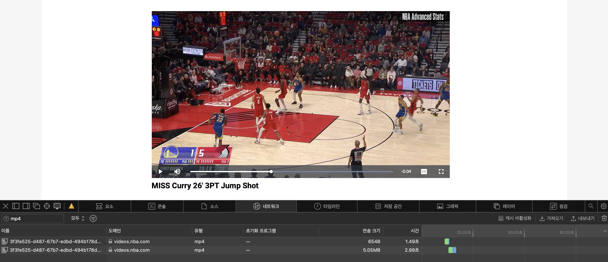
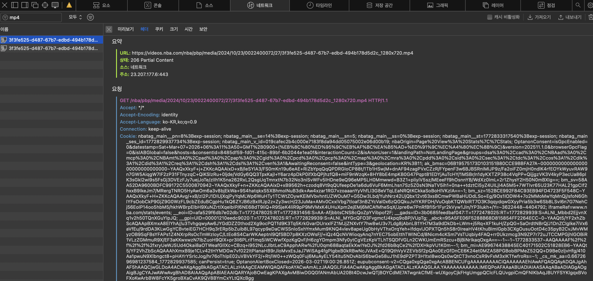
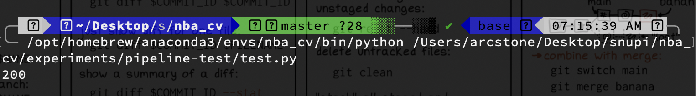
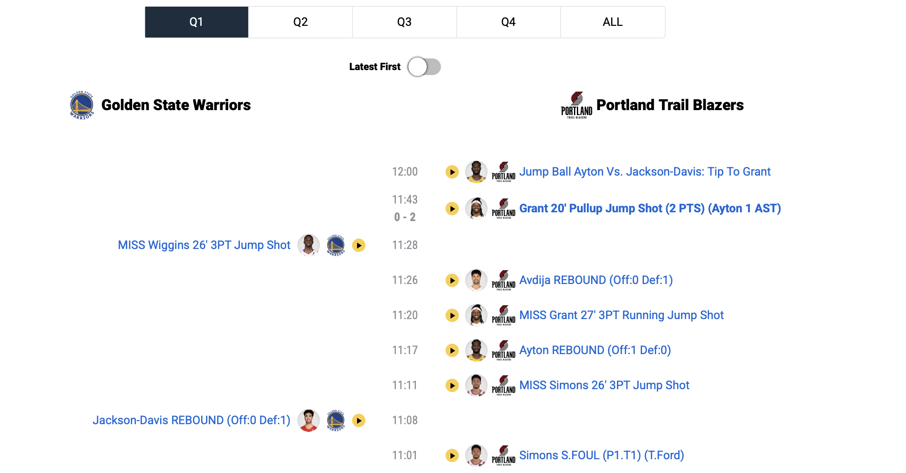
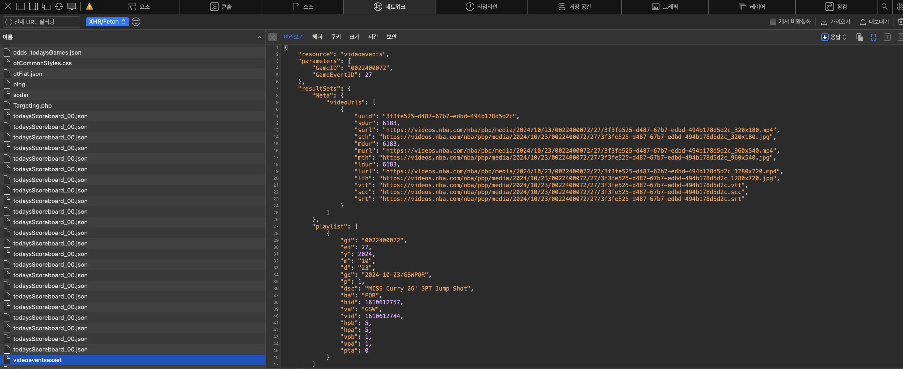
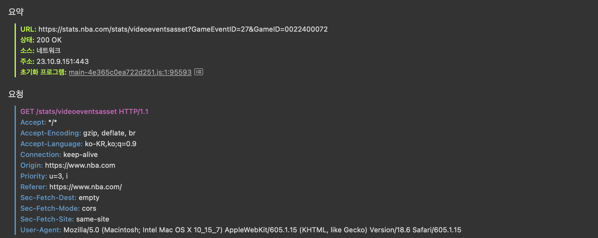
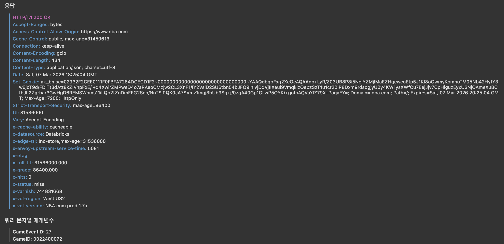
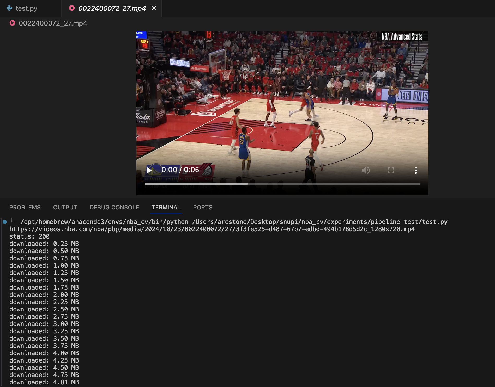

In this post, data pipeline of NBA Vision Project is shown.


# Data Pipeline

우선, 특정 선수 한 명에 대해 모델을 학습시켜 잘 동작하는지를 알아볼 것이다. 이를 위해 다음의 task를 수행하는 data pipeline을 구축한다.

- Stephen Curry가 24-25 시즌 동안 시도한 모든 슛의 PBP 영상의 릴리즈 시점 영상 프레임

위 task를 위해 nba_api를 사용하며 다음의 흐름으로 이루어진다.

- Stephen Curry 의 24-25 시즌 전체 경기에 대한 data frame 확보

  - nba_api 이용

- Stephen Curry의 24-25 시즌 모든 슛 시도 정보에 대한 (game_id, 성공 여부 등) data frame 확보

  - nba_api 이용

- 모든 슛 시도에 대한 PBP 영상 확보

  

모든 슛 시도에 대한 PBP 영상 확보 과정을 알아보자. nba.stat.com 에서 “우클릭 → 다운로드”가 된다는 건 브라우저가 결국 어떤 ‘실제 미디어 URL(mp4 또는 m3u8)’에 접근하고 있다는 뜻이다. 핵심은 그 URL을 **(1) 안정적으로 찾아내고 (2) 코드로 반복 다운로드**하는 파이프라인을 만드는 것이다. 

우선, nba.stat.com 에서 pbp 영상 하나를 재생하는 순간, 개발자도구의 네트워크 탭에서 mp4를 필터링한다. 



네트워크-헤더 탭을 통해 HTTP Request의 URL 정보와 헤더 정보를 알 수 있다. 



주요 정보는 다음과 같다.

- URL : `https://videos.nba.com/nba/pbp/media/2024/10/23/0022400072/27/3f3fe525-d487-67b7-edbd-494b178d5d2c_1280x720.mp4`
- UUID : `3f3fe525-d487-67b7-edbd-494b178d5d2c`
  - `4549dfbf-fde2-4dcc-8065-afade5ada267`

URL을 보니 `https://videos.nba.com/nba/pbp/media/[YYYY]/[MM]/[DD]/[GameID]/[GameEventID]/[file_uuid]_1280x720.mp4` 형태로 요청을 보내면 된다는 것을 알 수 있다. 즉 우리는 uuid를 알아내야 한다. 

UUID는 각 영상의 고유 식별 변호이다. 이제 브라우저가 보냈던 HTTP Request 요청을 분석하여, 영상 UUID가 주어졌을 때 HTTP Request를 보내는 python code를 작성해야 한다. 그에 앞서, 파이썬 requests로 똑같이 접근하면 서버가 200 응답을 주는지 먼저 확인해야 한다. 

```python
import requests

if __name__ == "__main__": 
    url = "https://videos.nba.com/nba/pbp/media/2024/10/23/0022400072/27/3f3fe525-d487-67b7-edbd-494b178d5d2c_1280x720.mp4"

    headers = {
        "User-Agent" : "Mozilla/5.0 (Macintosh; Intel Mac OS X 10_15_7) AppleWebKit/605.1.15 (KHTML, like Gecko) Version/18.6 Safari/605.1.15",
        "Referer" : "https://www.nba.com/",
    }

    r = requests.get(url, headers=headers, stream=True)

    print(r.status_code)
```

개발자도구에서 확인한 HTTP Request에서 URL과 더불어, Request 헤더에서 User-Agent, Referer, Origin, Cookie 엔트리를 확인한다. 각 헤더 엔트리는 다음의 정보를 담는다. 

- User-Agent : 어떤 프로그램이 요청하는지

- Referer : 어떤 페이지에서 요청했는지

- Origin : 요청이 어디서 시작됐는지
- Cookie : 로그인/세션 정보

Python으로 요청을 보낼 때 이런 헤더 정보를 담지 않으면, NBA 서버가 봇을 막기 위해 특정 헤더가 없으면 403을 반환할 수 있다. 다행히 videos.nba.com mp4는 대부분 cookie 없이도 다운로드 된다.

`requests.get()` 의 동작 흐름은 다음과 같다. 

```shell
서버 → 영상 데이터 전송
↓
requests가 모든 데이터를 RAM에 저장
↓
r.content 로 반환
```

즉, local에서 전체 파일을 한 번에 메모리에 올린다. 대신 `stream=True` 옵션을 사용하면 다음과 같이 동작한다.

```shell
서버 → 데이터 조금씩 전송
↓
파이썬이 chunk 단위로 읽음
↓
바로 파일에 씀
```

(참고로, 현재 chunk를 저장하기 전에 서버가 다음 chunk를 보내도 데이터는 OS 네트워크 버퍼에 잠시 저장되므로 문제가 없다. OS network buffer가 꽉 차면 TCP Control Flow가 동작하여 서버가 전송을 잠시 멈춘다). 따라서, RAM 사용량을 낮게 유지할 수 있다. 요청 결과, 아래와 같이 200 응답이 온다는 것을 확인했다. 



이제 DevTools를 이용해 HTTP Request에서 확인한 UUID와 python nba_api의 VideoEvents를 이용해 얻은 UUID가 같은지 확인해야 한다. 

```python
import requests
from nba_api.stats.endpoints import videoevents
if __name__ == "__main__": 
    

    game_id = "0022400072"
    event_id = "27"

    v = videoevents.VideoEvents(
        game_id=game_id,
        game_event_id=event_id
    )

    data = v.get_dict()
    print(data)
```

확인 결과, UUID가 달랐다. 이유는 다음과 같다. 

NBA stat 서버에서 영상 파일은 보통 이렇게 저장된다. **CDN (Content Delivery Network)** 은 전 세계에 있는 **캐시 서버 네트워크**이다. 브라우저는 NBA 서버가 아니라 CDN에서 영상 파일을 받는다. 그래서 URL도 videos.nba.com 이다. 만약 CDN이 없으면 미국 서버 → 한국 사용자  처럼 영상 요청이 다 미국으로 간다. 하지만 CDN이 있으면 한국 CDN → 한국 사용자로 바로 제공한다. 그래서 latency 감소, 서버 부하 감소의 이점이 있다. 

```shell
origin storage
(AWS S3 같은 곳)
        │
        ▼
CDN edge server
(Cloudflare / Akamai 등)
        │
        ▼
user browser
```

브라우저가 PBP 영상을 요청하는 과정은 다음과 같다.

페이지 처음 열 때 (UUID 없음)

1. 사용자가 경기 페이지 open

- 요청 : `https://www.nba.com/game/gsw-vs-lal-0022400004` 
- 응답 : 브라우저는 먼저 HTML + JS를 받는다.

2. PlayByPlay API 요청

- 요청 : 1에서 받은 JS 코드에 의해 브라우저 JS가 PBP 데이터를 요청한다. 

  - ```shell
    GET https://stats.nba.com/stats/playbyplayv3
    ?GameID=0022400004
    ```

- 응답 : 브라우저는 서버/API에서 한 경기에 대한 PBP 전체 JSON을 받는다. 

  - ```json
    [
      {
        "actionNumber": 72,
        "description": "Green Rebound",
        "videoAvailable": false
      },
      {
        "actionNumber": 73,
        "description": "Curry 25' 3PT Jump Shot Made",
        "videoAvailable": true
      }
    ]
    ```

- 그 다음 JS가 이걸 화면에 렌더링한다. 

  - ```javascript
    pbpData.forEach(action => {
      renderRow(action.description, action)
    })
    ```

  - 즉 화면에 줄 하나를 만들 때, 그 줄과 원본 `action` 객체를 연결해 둔다.




3. 사용자가 특정 줄(PBP) 클릭

- JS는 그 줄에 연결된 데이터를 읽는다.

- 요청 : 브라우저는 해당 줄의 gameId와 eventId를 알고 있으므로 요청을 보냄.

  - ```javascript
    row.onclick = () => {
      const eventId = action.actionNumber
      const gameId = currentGameId
      openVideo(gameId, eventId)
    }
    ```

  - ```shell
    https://stats.nba.com/stats/videoevents
    ?GameID=0022400004
    &GameEventID=73
    ```

- 응답 : videoevents api 요청의 응답으로 오는 uuid가 video asset id(NBA 영상 데이터베이스 ID이다. 이 uuid가 python nba_api를 이용했을 때 얻은 uuid이다. 

  - ```json
    {
     "videoUrls":[
       {
         "uuid":"549dfbf-fde2-4dcc-8065-afade5ada267"
       }
     ]
    }
    ```

4. 플레이어 JS가 playback 요청

- 이제 JS 플레이어가 실제 영상 파일을 요청

- 요청 : `playback?asset_uuid=549dfbf-fde2-4dcc-8065-afade5ada267`

- 응답 : video asset id를 요청으로 보내면 file uuid (영상 파일 자체의 ID)가 응답으로 온다. 이 uuid가 DevTools에서 얻은 uuid이다. 

  - ```json
    {
     "files":[
       {
         "uuid":"3f3fe525-d487-67b7-edbd-494b178d5d2c",
         "resolution":"1280x720"
       }
     ]
    }
    ```

5. CDN 영상 요청

- 브라우저가 실제 영상을 요청
- 요청 : 여기서의 uuid는 file uuid.
- `https://videos.nba.com/nba/pbp/media/2024/10/05/0012400004/32/3f3fe525-d487-67b7-edbd-494b178d5d2c_1280x720.mp4` 

우리는 DevTools에서 4번 과정(asset uuid → file uuid)의 HTTP Request를 찾아야 한다. 위 4번 과정이 실제할 거라 생각했지만 어쩌면 nba_api에서 받아오는 uuid가 그냥 부정확한 uuid 일 수도 있다. DevTools에서 요청으로 보낸 GameID와 ㅎGameEventID를 바탕으로 영상의 uuid와 lurl 등을 주는 HTTP Request/Response를 찾았다. 







위 요청의 url을 통해 python으로 요청을 보내고 받은 응답의 영상 lurl을 통해 다시 요청을 보내면 특정 GameID, GameEventID에 해당하는 PBP 영상을 다운 받을 수 있다. 

```python
import requests

url = "https://stats.nba.com/stats/videoeventsasset"

params = {
    "GameID": "0022400072",
    "GameEventID": 27
}

headers = {
    "Accept": "*/*",
    "Accept-Encoding": "gzip, deflate, br",
    "Accept-Language": "ko-KR,ko;q=0.9",
    "Connection": "keep-alive",
    "Origin": "https://www.nba.com",
    "Priority": "u=3, i",
    "Referer": "https://www.nba.com/",
    "Sec-Fetch-Dest": "empty",
    "Sec-Fetch-Mode": "cors",
    "Sec-Fetch-Site": "same-site",
    "User-Agent": "Mozilla/5.0 (Macintosh; Intel Mac OS X 10_15_7) AppleWebKit/605.1.15 (KHTML, like Gecko) Version/18.6 Safari/605.1.15"

}

r = requests.get(url, params=params, headers=headers)

data = r.json()

video_url = data["resultSets"]["Meta"]["videoUrls"][0]["lurl"]

filename = "0022400072_27.mp4"

with requests.get(video_url, stream=True, headers=headers, timeout=(10, 60)) as r:
    print("status:", r.status_code)
    r.raise_for_status()

    total = 0
    with open(filename, "wb") as f:
        for chunk in r.iter_content(chunk_size=1024 * 256):  # 256KB
            if chunk:
                f.write(chunk)
                total += len(chunk)
                print(f"downloaded: {total / 1024 / 1024:.2f} MB")
```



다음 코드는 Stephen Curry의 24-25 Regularseason 모든 슛 시도에 대한 PBP 영상을 다운받는 코드이다. 총 1256개의 mp4 파일을 받았다. 시간은 새벽 4시 55분 ~ . 00시간 소요. (125개 10% 다운 시각 새벽 5시19분) 용량 00GB 소요되었다. 

```python
from nba_api.stats.static import players
from nba_api.stats.endpoints import playergamelog, playbyplayv3, videoevents
import pandas as pd
import time
from datetime import datetime
import random
import os
from pathlib import Path
from typing import List, Optional, Dict, Tuple
import requests
from requests.adapters import HTTPAdapter
from urllib3.util.retry import Retry

BASE_DIR = Path(__file__).resolve().parents[2]
RAW_DATA_DIR = BASE_DIR / "data" / "raw_data"
RAW_DATA_DIR.mkdir(parents=True, exist_ok=True)

API_HEADERS = {
    "Accept": "*/*",
    "Accept-Encoding": "gzip, deflate, br",
    "Accept-Language": "ko-KR,ko;q=0.9",
    "Connection": "keep-alive",
    "Origin": "https://www.nba.com",
    "Priority": "u=3, i",
    "Referer": "https://www.nba.com/",
    "Sec-Fetch-Dest": "empty",
    "Sec-Fetch-Mode": "cors",
    "Sec-Fetch-Site": "same-site",
    "User-Agent": "Mozilla/5.0 (Macintosh; Intel Mac OS X 10_15_7) AppleWebKit/605.1.15 (KHTML, like Gecko) Version/18.6 Safari/605.1.15",
}

VIDEO_HEADERS = {
    "User-Agent": "Mozilla/5.0 (Macintosh; Intel Mac OS X 10_15_7) AppleWebKit/605.1.15 (KHTML, like Gecko) Version/18.6 Safari/605.1.15",
    "Referer": "https://www.nba.com/",
    "Range": "bytes=0-",
    "Connection": "keep-alive",
}

FAILED_DOWNLOADS_CSV = RAW_DATA_DIR / "failed_downloads.csv"


def build_session(default_headers: dict) -> requests.Session:
    session = requests.Session()
    session.headers.update(default_headers)

    retry = Retry(
        total=3,
        connect=3,
        read=3,
        backoff_factor=1.2,
        status_forcelist=[429, 500, 502, 503, 504],
        allowed_methods=frozenset(["GET"]),
        raise_on_status=False,
    )
    adapter = HTTPAdapter(max_retries=retry, pool_connections=20, pool_maxsize=20)
    session.mount("https://", adapter)
    session.mount("http://", adapter)
    return session


API_SESSION = build_session(API_HEADERS)
VIDEO_SESSION = build_session(VIDEO_HEADERS)

# 1. 전체 경기 목록 수집
## 1.1 Stephen Curry player_id 찾기
def get_player_id(full_name: str) -> int:
    candidates = players.find_players_by_full_name(full_name)
    if not candidates:
        raise ValueError(f"No player found for name={full_name}")
    return candidates[0]["id"]

## 1.2 PlayerGameLog 호출
def fetch_player_gamelog(player_id: int, season: str, season_type: str = "Regular Season",
                         max_retry: int = 5, sleep_sec: float = 1.2) -> pd.DataFrame:
    last_err = None
    for attempt in range(1, max_retry + 1):
        try:
            gl = playergamelog.PlayerGameLog(
                player_id=player_id,
                season=season,
                season_type_all_star=season_type
            )
            df = gl.get_data_frames()[0]
            return df
        except Exception as e:
            last_err = e
            # 레이트리밋/일시 오류 대비
            time.sleep(sleep_sec * attempt)
    raise RuntimeError(f"Failed to fetch PlayerGameLog after {max_retry} retries: {last_err}")

# 2. 경기별 PBP에서 슛 시도 이벤트 전부 뽑기
## 2.1 PlayByPlayV2fh 이벤트 테이블 가져오기

def fetch_pbp(game_id: str, max_retry=5, timeout=60):
    last_err = None
    for attempt in range(1, max_retry + 1):
        try:
            pbp = playbyplayv3.PlayByPlayV3(
                game_id=game_id,
                start_period=1,
                end_period=10,  # OT 대비
                timeout=timeout,
            )
            # V3도 get_data_frames() 지원: 첫 DF가 PlayByPlay인 경우가 보통
            dfs = pbp.get_data_frames()
            if not dfs or dfs[0].empty:
                raise RuntimeError("empty response dataframe")
            return dfs[0]
        except Exception as e:
            last_err = e
            time.sleep(1.5 * attempt + random.uniform(0.0, 0.4))
    raise RuntimeError(f"PBP(V3) fetch failed for {game_id}: {last_err}")

## 2.2 Curry 슛 이벤트 필터링
def extract_player_shots_from_game(game_id, player_id):
    df = fetch_pbp(game_id)

    # 슛 이벤트: 1 = Made Shot, 2 = Missed Shot
    shot_df = df[
        (df["personId"] == player_id) &
        (df["isFieldGoal"] == 1) &
        (df["shotResult"].notna())
    ].copy()

    if shot_df.empty:
        return pd.DataFrame()

    # 필요한 컬럼만 정리
    result = pd.DataFrame({
        "GAME_ID": shot_df["gameId"],
        "EVENTNUM": shot_df["actionNumber"],      # V2 스타일로 이름만 맞춤
        "PERIOD": shot_df["period"],
        "PCTIMESTRING": shot_df["clock"],         # 예: "PT11M32.00S" 형태일 수 있음
        "EVENTMSGTYPE": shot_df["shotResult"].map({"Made": 1, "Missed": 2}).fillna(-1).astype(int),
        "VIDEO_AVAILABLE_FLAG": shot_df["videoAvailable"],
        "DESCRIPTION": shot_df["description"],
    })

    return result

## 2.3 여러 경기 처리
def extract_player_shots_all_games(game_ids, player_id):
    all_shots = []

    for i, game_id in enumerate(game_ids):
        print(f"[{i+1}/{len(game_ids)}] Processing {game_id}")

        try:
            game_shots = extract_player_shots_from_game(game_id, player_id)
        except Exception as e:
            print(f"[FAIL] extract shots from {game_id}: {e}")
            game_shots = pd.DataFrame()

        if not game_shots.empty:
            all_shots.append(game_shots)

        # 서버 차단 방지
        time.sleep(random.uniform(1.5, 3.0))

    if not all_shots:
        return pd.DataFrame()

    return pd.concat(all_shots, ignore_index=True)

# 3. PBP 영상 다운
# 3.1 GameID, GameEventID가 주어졌을 때 해당 PBP 이벤트 영상 다운
def download_pbp(game_id: str, event_id: int, max_retry: int = 4):
    url = "https://stats.nba.com/stats/videoeventsasset"

    params = {
        "GameID": game_id,
        "GameEventID": event_id
    }

    headers = API_HEADERS

    filename = RAW_DATA_DIR / f"{game_id}_{event_id}.mp4"

    if filename.exists() and filename.stat().st_size > 0:
        print(f"skip existing: {filename.name}")
        return str(filename)

    last_err = None

    for attempt in range(1, max_retry + 1):
        try:
            r = API_SESSION.get(url, params=params, headers=headers, timeout=(10, 60))
            r.raise_for_status()

            data = r.json()

            meta = data.get("resultSets", {}).get("Meta", {})
            video_urls = meta.get("videoUrls", [])

            if not video_urls:
                raise RuntimeError(f"No video URL found in response for {game_id}_{event_id}")

            preferred = None
            for item in video_urls:
                if item.get("lurl"):
                    preferred = item["lurl"]
                    break
            if preferred is None:
                for item in video_urls:
                    if item.get("murl"):
                        preferred = item["murl"]
                        break
            if preferred is None:
                for item in video_urls:
                    if item.get("surl"):
                        preferred = item["surl"]
                        break
            if preferred is None:
                raise RuntimeError(f"No downloadable mp4 URL found for {game_id}_{event_id}")

            video_url = preferred

            temp_filename = filename.with_suffix(".part")

            with VIDEO_SESSION.get(video_url, stream=True, headers=VIDEO_HEADERS, timeout=(10, 180)) as r:
                print("status:", r.status_code)
                r.raise_for_status()

                total = 0
                with open(temp_filename, "wb") as f:
                    for chunk in r.iter_content(chunk_size=1024 * 256):  # 256KB
                        if chunk:
                            f.write(chunk)
                            total += len(chunk)
                            #print(f"downloaded: {total / 1024 / 1024:.2f} MB")

            if temp_filename.stat().st_size == 0:
                temp_filename.unlink(missing_ok=True)
                raise RuntimeError(f"Downloaded file is empty for {game_id}_{event_id}")

            temp_filename.replace(filename)
            return str(filename)

        except Exception as e:
            last_err = e
            if filename.with_suffix(".part").exists():
                filename.with_suffix(".part").unlink(missing_ok=True)
            sleep_sec = min(3.0 * attempt + random.uniform(0.5, 1.5), 15.0)
            print(f"[retry {attempt}/{max_retry}] {game_id}_{event_id}: {e}")
            time.sleep(sleep_sec)

    raise RuntimeError(f"download_pbp failed for {game_id}_{event_id}: {last_err}")

# 3.2 GameID, GameEventID가 주어졌을 때 해당 PBP 이벤트 영상 다운
def download_pbps_by_shots_df(player_shots_df: pd.DataFrame):
    if player_shots_df is None or player_shots_df.empty:
        print("No shot events to download.")
        return

    required_cols = {"GAME_ID", "EVENTNUM"}
    missing = required_cols - set(player_shots_df.columns)
    if missing:
        raise ValueError(f"Missing required columns: {missing}")

    work_df = player_shots_df.copy()

    if "VIDEO_AVAILABLE_FLAG" in work_df.columns:
        work_df = work_df[work_df["VIDEO_AVAILABLE_FLAG"] == 1].copy()

    work_df = work_df.drop_duplicates(subset=["GAME_ID", "EVENTNUM"]).reset_index(drop=True)

    total = len(work_df)
    failed_rows = []

    for i, row in enumerate(work_df.itertuples(index=False), start=1):
        game_id = str(row.GAME_ID)
        event_id = int(row.EVENTNUM)

        print(f"[{i}/{total}] downloading {game_id}_{event_id}.mp4")

        try:
            download_pbp(game_id, event_id)
        except Exception as e:
            print(f"[FAIL] {game_id}_{event_id}: {e}")
            failed_rows.append({
                "GAME_ID": game_id,
                "EVENTNUM": event_id,
                "ERROR": str(e),
            })

        # 서버 부담/차단 방지
        time.sleep(random.uniform(2.0, 4.0))

    if failed_rows:
        failed_df = pd.DataFrame(failed_rows)
        failed_df.to_csv(FAILED_DOWNLOADS_CSV, index=False, encoding="utf-8-sig")
        print(f"Saved failed download log to: {FAILED_DOWNLOADS_CSV}")

# 4. 중계화면 시각 vs PBP 기록 시각 비교로, 슛 릴리즈 프레임 찾기
    
## 전체 실행 
if __name__ == "__main__":
    # 1. 전체 경기 목록 수집
    player_name = "Stephen Curry"
    curry_id = get_player_id(player_name)
    print("Curry player_id =", curry_id)  # 보통 201939

    seasons = ["2024-25"]
    season_type = "Regular Season"  # 필요하면 "Playoffs"도 별도 호출

    all_logs = []
    for s in seasons:
        df = fetch_player_gamelog(curry_id, season=s, season_type=season_type)
        df["SEASON"] = s
        all_logs.append(df)
        time.sleep(1.0)  # 서버 부담 줄이기

    logs = pd.concat(all_logs, ignore_index=True)
    logs = logs.sort_values("GAME_DATE")


    # Game_ID 리스트
    game_ids_2025 = logs["Game_ID"].unique().tolist()

    # 2. 경기별 PBP에서 슛 시도 이벤트 전부 뽑기
    game_ids = game_ids_2025

    curry_shots_df = extract_player_shots_all_games(game_ids, curry_id)

    #curry_shots_df.to_csv("curry_2024_25_all_shots.csv", index=False, encoding="utf-8-sig")

    # 3. PBP 영상 다운
    download_pbps_by_shots_df(curry_shots_df)
```


