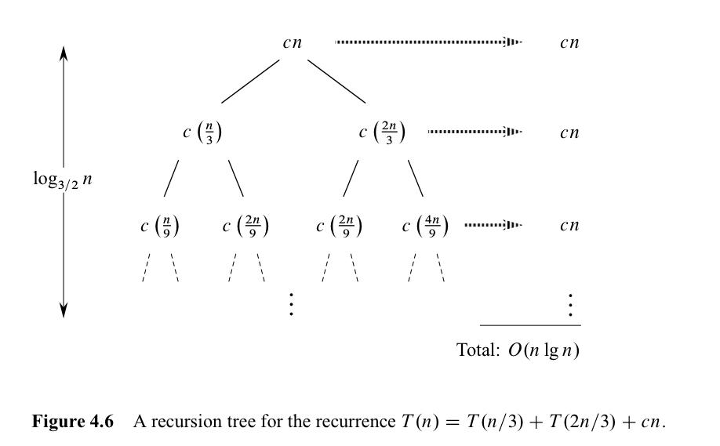

In this post, 04 Algorithm lecture is introuduced. 

CLRS chater 4.3 ~ 4.5 의 내용을 다룬다.

# 4.3 The substitution method for solving recurrences

3rd edtion 원문의 전개가 4th edition 번역본의 전개보다 자연스러워 이를 기준으로 설명한다.

알고리즘의 수행시간에 대한 다음 식이 있다.

$T(n) = 2T(\lfloor n/2 \rfloor) + n$ 

이 때 우리는 $T(n) = O(nlgn)$ 임을 strong mathematical induction 을 이용하여 증명하고 싶다. 

strong mathmatical induction 이므로 기본적으로 $m < n$ 의 모든  자연수 $m$ 에 대해 $T(m) = O(mlgm)$ 임을 가정하고, 이 가정 하에  $m = n$ 일 때도 성립함을 보여야 한다. 그런데, $O$ 의 정의에 의해, 상수 $n_0,\ c > 0$ 를 정해야 하고, 가정 시에도  $n_0 \leq m < n$ 일 때 성립을 가정한다.

- **Assumption** : $n_0 \leq m < n$ 일 때, $T(m) \leq c(mlgm)$

  (Inductive step을 고려하면 엄밀하게는)  $n_0 \leq m < n$ 일 때, $T(m)\leq c(mlgm)$ 단,  $2n_0 \leq n$

- **Inductive step**

  가정에서 $m = \lfloor n/2 \rfloor$ 이라 하자. $n_0 \leq m = \lfloor n/2 \rfloor$ 이 성립하는 지 의문이 들 수 있다. 하지만 Assumption 에서 $n$ 에 대해서도 $n \geq 2n_0$ 라는 가정을 추가하면 된다. 

  그러면, Assumption 에 의해, $T(\lfloor n/2 \rfloor) \leq c(\lfloor n/2 \rfloor lg\lfloor n/2 \rfloor) $ 이다. 이제 우리가 $T(n)$ 에 관해 원래 아는 정보를 바탕으로 이를 치환할 것이다.
  $$
  \begin{align*}
  T(n) &= 2T(\lfloor n/2 \rfloor) + n \\
       &\leq 2c(\lfloor n/2 \rfloor \lg \lfloor n/2 \rfloor) + n \\
       &\leq 2c(n/2)\lg(n/2) + n \\
       &= cn\lg n - cn\lg 2 + n \\
       &= cn\lg n - cn + n \\
       &\leq cn\lg n
  \end{align*}
  $$
  

  마지막 부등식은 이 부등식이 성립하도록 $c$ 값을 잘 선택해야 함을 알려준다. 경우에 따라선, $n_0$ 값의 선택에도 영향을 줄 수 있다. 이렇게 되면, $m = n$ 일 때도 가정의 부등식이 성립함을 보였고 또, 추가적인 가정도 $2n_0 \leq n+1$ 이 성립하므로 inductive step 의 증명이 끝났다.

- **Base case**

  $n_0$ 은 우리가 증명이 올바르도록 정해야 하는 상수이고 $n_0 \leq m < n$ 에서 base case는 시작이 되는 $n$ 을 정하는 것이다. 예를들어, $n_0 = 1$ 이라고 하고 $n = 3$ 이라고 한다면, 우리는 base case 로써,  $T(1), T(2)$ 가 가정을 성립하는지 체크해야 한다. 그러나, $T(1) \leq 1lg1 = 0$ 인데, $T(1) > 0$ 여야 하므로 이는 모순이다. 따라서, 우리는 다른 상수 $n_0$ 를 정해야 한다. 

  $n_0=2$ 라고 하고, $2n_0 \leq n$ 라는 조건에 따라 $n=4$ 라고 하자. 그러면 우리는 base case 로써, $T(2), T(3)$ 가 가정을 성립하는지 체크해야 한다. 즉, $T(2) = 2T(1) + 2 \leq 2clg2 = 2c$ , $T(3) = 2T(1) + 3 \leq 3clg3$ 가 성립함을 보이면 된다. 이것이 만족되게 하기 위해선, 우리는 상수 $c$를 $T(1) + 1$ 이상의 값으로 설정하면 됨을 알 수 있다. 

## Trick : subtracting lower-order term

다음 점화식을 생각해보자.

$T(n) = T(\lfloor n/2 \rfloor) + T(\lceil n/2 \rceil) + 1$ 

우리는 $T(n) = O(n)$ 이라고 추측하고 (실제로 그렇다) 이를 위 방법대로 보이고 싶다. 위 방식 그대로 inductive step 을 쓰면

$$
\begin{align*}
T(n) &= T(\lfloor n/2 \rfloor) + T(\lceil n/2 \rceil) + 1 \\
     &\leq c(\lfloor n/2 \rfloor + \lceil n/2 \rceil) + 1 \\
     &= cn+1 
\end{align*}
$$
여기서 어떤 $c$ 를 쓰더라도 $T(n) \leq cn$ 을 유도할 수 없다. 

이를 해결하기 위해 우리의 추측식을 $T(n) \leq cn -d$ 라고 해보자. 단, $d \geq 0$ 이다.

$$
\begin{align*}
T(n) &= T(\lfloor n/2 \rfloor) + T(\lceil n/2 \rceil) + 1 \\
     &\leq c(\lfloor n/2 \rfloor + \lceil n/2 \rceil) -2d+ 1 \\
     &= cn-d -(d-1) \\ &\leq cn-d
\end{align*}
$$
마지막 부등식이 성립하게 하는 적절한 $d$ 를 설정해야 한다. 이렇게 저차항을 빼게 되면 오히려 더 빡빡한 증명을 하게 되는 것 같지만, $T(n/2)$ 의 계수가 2이므로, 상수 $d$ 를 두 번 빼게 되어 원하는 결과를 유도할 수 있다.

## Avoiding pitfalls

귀납적 가설을 펼치는 과정에서, 사용하는 상수가 증명 전체에서 동일하지 않은 실수를 저지를 수 있다. 

예를 들어, $T(n) = 2T(\lfloor n/2 \rfloor) + n$ 를 $T(n) = O(n)$ 즉, $T(n) \leq cn$ 이라고 잘못 추측했다고 해보자.

$$
\begin{align*}
T(n) &= 2T(\lfloor n/2 \rfloor) + n \\
     &\leq 2c(\lfloor n/2 \rfloor) +n \\
     &\leq cn+n \\ &=O(n)
\end{align*}
$$

이 경우, 상수 값이 $c$ 에서 $c+1$ 로 바뀐 셈이므로 옳지 않다. 

## Changing variables

다음 점화식은 해결하기 꽤나 어려워보인다.

 $T(n) = 2T(\lfloor \sqrt n \rfloor) + lgn$

하지만, 다음과 같은 변수 변환으로 쉽게 해결할 수 있다.

$n=2^m$ 

$T(2^m) = 2T(\lfloor 2^{m/2} \rfloor) + m$

$S(m) = 2T(\lfloor m/2 \rfloor) + m$

이는 지금까지 봐았던 점화식의 형태와 동일하다. 따라서, $S(m) = O(mlgm)$

$T(n) = S(m) = O(mlgm) = O(lgn \ lglgn)$ 이다.

# 4.4 Recursion-tree method

Recursion-tree 를 이용하면 머릿속에 간단히 이를 적용해 점화식의 추측식을 만드는데 유용하게 사용할 숭 있다. 또한, 이를 엄밀히 적용하면 별도의 증명 없이 Recursion-tree 만으로도 증명이 가능하다.

여기에선 Recursion-tree method를 점화식의 추측식을 만드는 도구로써 알아보고 정확한 증명은 위에서 알아본 치환법을 이용하는 것으로 한다.

다음과 같은 식이 있다. 편의를 위해 ceiling과 floor 표현을 생략한다. 

$T(n) = T(n/3)+T(2n/3)+O(n)$ 

이에 대한 recursion-tree 를 그리면 다음과 같이 나타날 것이다.

각 level 에서의 합이 $cn$ 이고, $(2/3)^kn=1$ 을 만족하는 $k$ 에 대해서, tree의 height는 $k+1$ 이다. $k=lg_{3/2}n$ 이므로, 우리는 시간복잡도가 $O(cnlg_{3/2}n + cn) = O(nlgn)$ 으로 예측할 수 있다. 물론, 이는 다음의 지점들에 대해 엄밀하지 않다.

- 모든 level 에서의 합이 $cn$ 이 아니다. tree 를 진행함에 따라 왼쪽의 tree 들이 더 빨리 $T(1)$ 에 도달할 것이고, level 이 아래로 갈수록 점점 internal node가 줄어들어 합이 $cn$ 보다 줄어든다.
- Complete binary (완전 이진 트리) 를 가정해도 모든 level 에서의 합이 $cn$ 이 아니다. 완전 이진 트리일 경우, 가장 마지막 level에 $2^k = 2^{lg_{3/2}n}=n^{lg_{3/2}2}$ 개의 leaf node가 존재한다. 

그러나, 이런 엄밀성을 포기하더라도 우리는 $ O(nlgn)$ 이라는 합리적인 예측을 할 수 있고, 이를 귀납적으로 증명할 수 있다.

$$
\begin{align*}
T(n) &= T(n/3) + T(2n/3) + cn \\
     &\leq d(n/3)lg(n/3) + d(2n/3)lg(2n/3)+cn \\
     &=dnlgn-dn(lg3-2/3)+cn \\ &\leq dnlgn
\end{align*}
$$

마지막 부등식이 성립하기 위해선 $d \geq c/(lg3-(2/3))$ 인 상수 $d$ 를 잡아야 한다.

# 4.5 Master Theorem

마스터 정리는 다음 형태의 점화식을 푸는 데 도움을 준다.

$T(n) = aT(n/b) + f(n)\ where \ a \geq1, b>1, f(n) : asymptotically \ positive$

여기서 $n/b$ 는 $\lfloor n/b \rfloor$, 또는 $\lceil n/b \rceil$ 을 의미한다. 이 때, 마스터 정리는

1. $f(n)=O(n^{log_ba-\epsilon})$ for some constant $\epsilon>0$ 이면, $T(n)=\theta(n^{log_ba})$
2. $f(n)=\theta(n^{log_ba})$ 이면, $T(n)=\theta(n^{log_ba}lgn)$
3. $f(n)=\Omega(n^{log_ba+\epsilon})$ for some constant $\epsilon>0$ 이고, $af(n/b)\leq cf(n)$ for some constant $c<1$ 이면,  $T(n)=\theta(f(n))$

마스터 정리를 직관적으로 해석하면 $f(n)=0$ 일 경우, $T(n)=aT(n/b)$ 의 결과는 $T(n)=\theta(n^{log_ba})$ 일 것이고, $a=0$ 일 경우, $T(n)=f(n)$ 일 것이다. 즉, $aT(n/b)$와 $f(n)$ 중, 누구의 영향력이 더 강한지를 비교해야 한다. case 1에서는 $f(n)$ 의 영향력이 작은 경우, case 3 에선, 더 큰 경우이고, case 2는 비슷한 경우이다.

이 세가지 case 가 $f(n)$ 에 관한 모든 경우를 담고 있지 않음에 유의해야 한다. 예를 들어, case 1에서는 구동함수 $f(n)$ 이 기준함수보다 polynomially smaller 해야 하는데 (즉, 명확한 상수 $\epsilon$ 을 잡을 수 있어야 함) 기준 함수보다는 작지만 polynomially smaller 하지 않은 경우, case 1, 2 어디에도 속하지 않게 된다. Case 2, 3 사이에도 마찬가지 논리가 성립한다. 

이렇게 마스터 정리를 사용할 수 없는 예시를 살펴보자.

$T(n)=2T(n/2)+nlgn$

이 때, $nlgn \geq n$ 이다. 하지만 어떤 $\epsilon$ 을 가져와도 언젠가는 $n^{1+\epsilon}$ 이 $nlgn$ 보다 더 커지기 때문에 case 3을 만족할 수 없다. 
