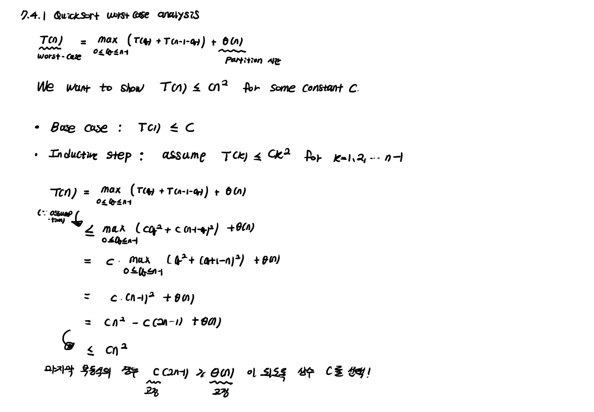

In this post, 06 Algorithm lecture is introuduced. 


CLRS chater 7.1 ~ 7.4, 8.1 ~ 8.3 의 내용을 다룬다.

# 7.1 Description of quick sort

Quick sort는 Divide-and-conquer 알고리즘으로 아래와 같다.

```pseudocode
QUICKSORT(A, p, r)
if p < r
	q = PARTITION(A, p, r)
	QUICKSORT(A, p, q - 1)
	QUICKSORT(A, q + 1, r)
```

PARTITION 함수는 기준 원소를 정하여 기준 원소 보다 왼쪽에는 더 작은 element 들이 위치하고, 오른쪽에는 더 큰 element들이 위치하게 한 후, 기준 원소가 들어갈 Index를 return 한다. 

```pseudocode 
PARTITION(A, p, r)
1 x = A[r] // 기준원소
2 i = p - 1 // 작은 쪽의 가장 높은 인덱스
3 for j = p to r - 1
4 	if A[j] <= x
5 		i = i + 1
6 		exchange A[i] with A[j]
7 exchange A[i+1] with A[r]
8 return i + 1
```

❗**PARTITION의 시간복잡도는 $\theta (n)$** 이다. (연습문제 7.1-3)

❗Quicksort의 correctness를 Loop invariant를 이용하여 증명할 수 있다. 

i가 pivot 보다 작은 쪽의 가장 높은 인덱스를 저장하고 있다는 사실에 착안하여, 매 iteration이 시작할때마다

1. $p \leq k \leq i$ 이면 $A[k] \leq x$
2. $i+1 \leq k \leq j-1$ 이면 $A[k] > x$
3. $k=r$ 이면 $A[k]=x$

을 만족한다. 

**Initialization** : (시간 나면 보기)

**Maintenance** : (시간 나면 보기)

**Termination** : (시간 나면 보기)

# 7.2 Performance of quicksort

**Worst-case partitioning**

quicksort에서 최악의 경우는 분할 과정에서 원래의 문제를 n-1개 짜리와 0개 짜리 부분 문제로 나누는 때다. 

$T(n)=T(n-1)+T(0)+\theta (n) = T(n-1)+\theta (n) = \theta (n^2)$

**Best-case partitioning**

균등하게 매 단계 나눌 때가 최적의 경우이다.

$T(n) = 2T(n/2) + \theta (n) = \theta (nlogn)$

참고로 배열이 일정하게 99:1 로 나누어져도 $\theta (nlogn)$ 이다. 따라서, Worst-case 는 실제로 거의 일어나지 않으며 실용적인 관점에서 고려하는 것이 쓸모가 없음을 알 수 있다. 

# 7.3 A randomized version of quicksort

quicksort의 average-case를 생각할 때, 우리는 모든 input permutations 들이 동일한 확률로 들어올 것이라 가정한다. 하지만 실제로 그렇지 않을 수 있기 때문에 우리는 randomization 과정을 알고리즘 내에 추가한다. 앞서 5장에서 배운 input array 전체를 permute 하는 방법을 사용할수도 있지만 여기서는 **random sampling** 기법을 이용한다. Pivot 으로 항상 A[r] 을 뽑지 않고, A[p:r] 에서 랜덤하게 선택된 하나의 element와 A[r]을 exchange 한 후, A[r]을 pivot으로 삼는다. 이렇게 되면 각 원소들이 pivot으로 선정될 확률이 항상 동일해지고 따라서 Input array가 이 pivot에 의해 평균적으로 균형있게 쪼개질 것임을 알 수 있다.

```pseudocode
RANDOMIZED-PARTITION(A, p, r)
i = RANDOM(p, r)
exchange A[r] with A[i]
return PARTITION(A, p, r)
```


# 7.4 Analysis of quicksort

**Worst-case analysis**

4장의 substitution method를 이용하여 증명한 worst-case의 complexity는 $O(n^2)$ 이다. Worst-case 이므로 아래 증명은 Quicksort, Randomized-Quicksort에서 모두 성립하는 증명이다. 



**Expected running time**

Indicator random variable의 힘을 이용해 **Randomized-Quicksort** 에서 Expected running time이 $O(nlgn)$ 임을 보이자. **Randomized-Quicksort**는 pivot을 선정하는 과정에서 무조건 맨 마지막 원소가 아니라 랜덤하게 정한다는 차이만 존재한다. 

element들이 모두 distinct한 상황을 가정한다.


# 8.1 Lower bounds for sorting

지금까지 우리가 다룬 모든 sorting은 element간의 비교 과정을 포함하는 **comparison sorting** 이다. 모든 **comparison sorting** 알고리즘은 다음과 같이 **decision-tree model** 로 표현된다.


decision-tree는 ful-binaray tree이다. sorting 알고리즘은 수행은 desion-tree의 root 부터 하나의 leaf 노드까지 path를 따라 가는 것에 대응하고, leaf 노드의 개수는 $n!$ 개 이상으로, 가능한 모든 input permutation의 경우($n!$)를 담고 있어애 한다. 

desion-tree model을 이용하면 임의의 comparison sort 알곡리즘은 worst-case에 $\Omega(nlgn)$ 의 수행 시간을 가짐을 보일 수 있다. 수행 시간은 루트에서 leaf 노드까지의 height로 생각할 수 있는데, leaf 노드의 개수를 $l$, tree의 height를 $h$ 라 하면, binaray tree의 height와 leaf 노드 개수의 관계에 의해 $n! \leq l \leq 2^h$ 이 성립하고, 스털링 근사를 이용하면 $\Omega(nlgn) = lg(n!) \leq h$ 이다. 

Heapsort 와 mergesort의 running time의 upper bound가 $O(nlgn)$ 인데, 이는 comparison-sort wortst-case의 lower bound $\Omega(nlgn)$ 가 매치하므로 asymptotically optimal comparison sort 알고리즘임을 알 수 있다.

# 8.2 Counting sort

**counting sort**는 n개의 input이, 어떤 정수 k에 대하여 0~k 사이 값만을 가지는 상황을 가정한다. 이렇게 input에 대한 추가적인 가정을 하면 linear time에 sorting을 할 수 있고, counting sort의 시간 복잡도는 $\theta(n+k)$ 이다. 실제로는 k가 $O(n)$ 인 상황에서 counting sort를 많이 사용하기 때문에 이 경우 시간복잡도는  $\theta(n)$ 이 된다.

❗input에 대한 추가적인 가정을 하면, comparion sort의 $nlgn$ 보다 빨라지는 이유가 뭘까. 일반적인 array input [1, 8, 10000, 7 ... ] 도 비슷한 방법을 이용하면, 가장 큰 input을 n이라고 할 때$O(n)$ 에 정렬 가능하다. 그러나 n에 대한 제한 조건이 counting sort 처럼 0~k로 주어져 있지 않으면 사실상 무한대로 커질 수 있고 그렇게 되면 $O(\inf)$ 가 되버린다.

```pseudocode
COUNTING-SORT(A, B, k)
let C[0..k] be a new array
for i = 0 to k
	C[i] = 0
for j = 1 to A.length
	C[A[j]] = C[A[j]] + 1
for j = 1 to k
	C[i] = C[i] + C[i-1] // C[i] contains the # of elements leq to i
for j = A.elngth down to 1
	B[C[A[j]]] = A[j]
	C[A[j]] = C[A[j]] - 1 // 같은 수가 나오면 한 칸 앞에 저장하도록
```

counting sort의 중요한 특성은 **stable** 하다는 것이다. output array에서 같은 value를 가진 element의 순서는 input array의 순서와 동일할 경우 **stable** 하다고 한다. 이 특성은 이후 counting sort를 이용하여 radix sort를 구현할 때 중요하게 사용된다. 

# 8.3 Radix sort

Radix sort에서는 input 숫자들을 **LSB** 부터 순차적으로 stable sort한다. 즉 LSB를 기준으로 sorting을 한 다음, 그 다음 자리를 기준으로 다시 sorting 한다. 이 때, 2개의 input에 대하여 다음 자리에 해당하는 값이 같다면 stable sort 이므로 둘의 상대적인 순서가 유지되고, 다르다면 LSB에서의 sorting 결과의 순서가 바뀔 수도 있다. 

```pseudocode
RADIX-SORT(A, d)
for i = 1 to d
	use a stable sort to sort array A on digit i
```

**n** 개의 **d** digits input 이 있는데 각 digit은 **k** 개의 가능한 값을 가질 때, Radix sort의 시간복잡도는 $\theta(d(n+k))$ 이다.(각 digit 단계에서 stable sort의 과정이 $\theta(n+k))$ 인 가정 하에). count sort에 d번 수행한다고 생각하면 자명하다. 

d가 상수이고, k가 $O(n)$ 이라면, radix sort의 복잡도는 $\theta(n)$ 이 된다. 

❗radix sort에서 각 digit에 따라 sorting하는 알고리즘은 반드시 **stable** 해야 한다. 예를 들어, 14, 17을 sorting 한다고 생각해보자. 4와 7을 비교하여 (14, 17)의 순서로 두 번째 자리를 비교하는 단계로 넘어가게 되는데 두 번째 자리를 기준으로 sorting 하는 알고리즘이 stable 하지 않다면, 두 번째 자리가 1로 같으므로 무작위로 순서를 배치할 수 있고 (17, 14) 처럼 sorting이 될 수 있다. 

❗컴퓨터는 숫자를 0,1로 표현하므로 Radix sort의 정의에서 k=2 만을 사용해야 하는 것일까? 그렇지 않다. 예를 들어, k=4로 정한다면 2개의 bit를 묶어 하나의 digit으로 보고 counting sort를 수행하면 되는 것이다. 즉, digit의 수 = bit의 수로 정할 필요가 없는 것이다. 이것이 가능한 이유는 Counting sort는 비교 기반이 아니라, **key 값을 인덱스로 사용해서 직접 접근**하는 알고리즘이기 때문이다. 즉, 2개의 bit를 묶어 각 digit이 (00, 01, 10, 11) 의 값을 가질 수 있다면, counting 배열(C)을 크기 4로 만들고, 해당 digit 값을 그대로 인덱스로 사용한다.

그렇다면, 어떻게 최적의 k를 정할 수 있을까? 우선, 다음의 정리를 확인하자.

$n$ 개의 $b$-bit 숫자들이 있을 때, 임의의 양의 정수 $r\leq b$ 에 대하여 Radix sort는 숫자들을 $\theta((b/r)(n+2^r))$ 시간으로 정렬한다. (단, 이 과정에서 사용하는 stable sort의 시간복잡도는 $\theta(n+k))$.

$pf)$ $r$ 개의 bits를 묶어서 하나의 digit으로 생각하여 Radix sort를 진행하는 상황을 가정하자. 그러면 radix sort의 정의에서 $d=\lceil b/r \rceil$ 이 된다. $k=2^r$ 이 된다. 따라서 $\theta(d(n+k)) = \theta(\lceil (b/r) \rceil (n+2^r))= \theta((b/r)(n+2^r))$ 이 된다.  

$n, b$ 가 주어진 상황에서 $\theta((b/r)(n+2^r)$ 를 최소화할 수 있는 $r\leq b$ 을 찾아보자. 

- $b<\lfloor lgn \rfloor$ 일 때, $2^r \leq 2^b < 2^(lgn)=n$ 이므로 시간복잡도는 $\theta(n)$ 이다. 
- $b\geq\lfloor lgn \rfloor$ 일 때, $r=\lfloor lgn \rfloor$ 으로 정하면(이 경우가 최적이다), 시간복잡도는 $\theta(bn/lgn)$ 이다.
  - $r>\lfloor lgn \rfloor$ 로 정하면 $\Omega(bn/lgn)$ 이다.
  - $r<\lfloor lgn \rfloor$ 로 정하면 $\theta(n)$ 이다.

그렇다면, Radix sort가 Quick sort 보다 효율적일까? 다음 두 가지 이유에서 그렇지 못하다.

1. Radix sort는 linear time이고 Quick sort는 nlgn time이지만 시간복잡도에 숨겨져 있는 constant term의 크기가 radix sort가 훨씬 크다. 
2. Radix sort에서 사용하는 counting sort등의 stable algorithm은 in-place algorithm이 아니기 때문에 page fault가 일어날 확률이 높아져 실제 수행 시간이 더 느리다. 

 

