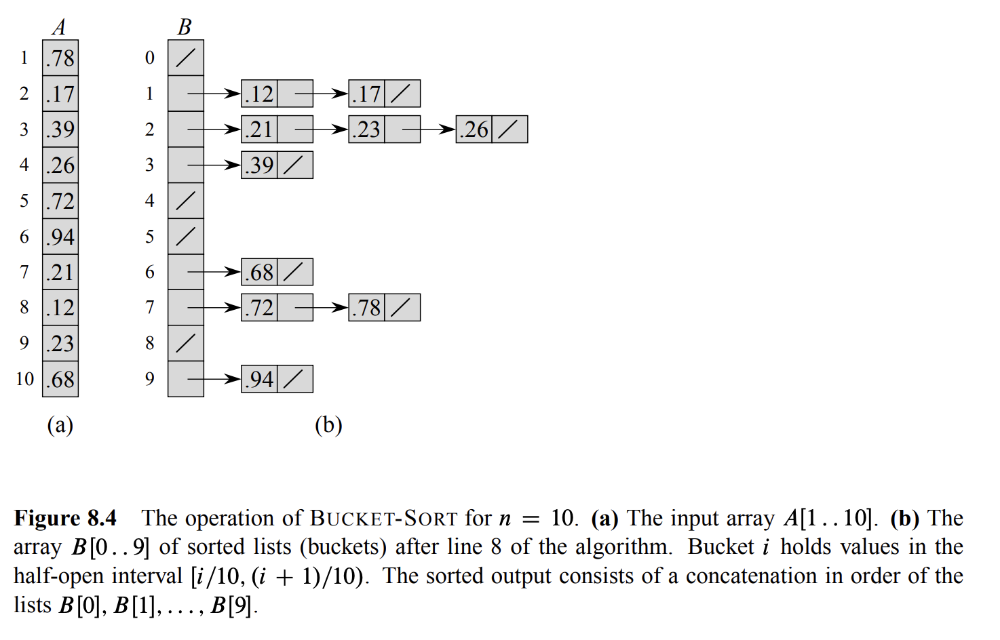
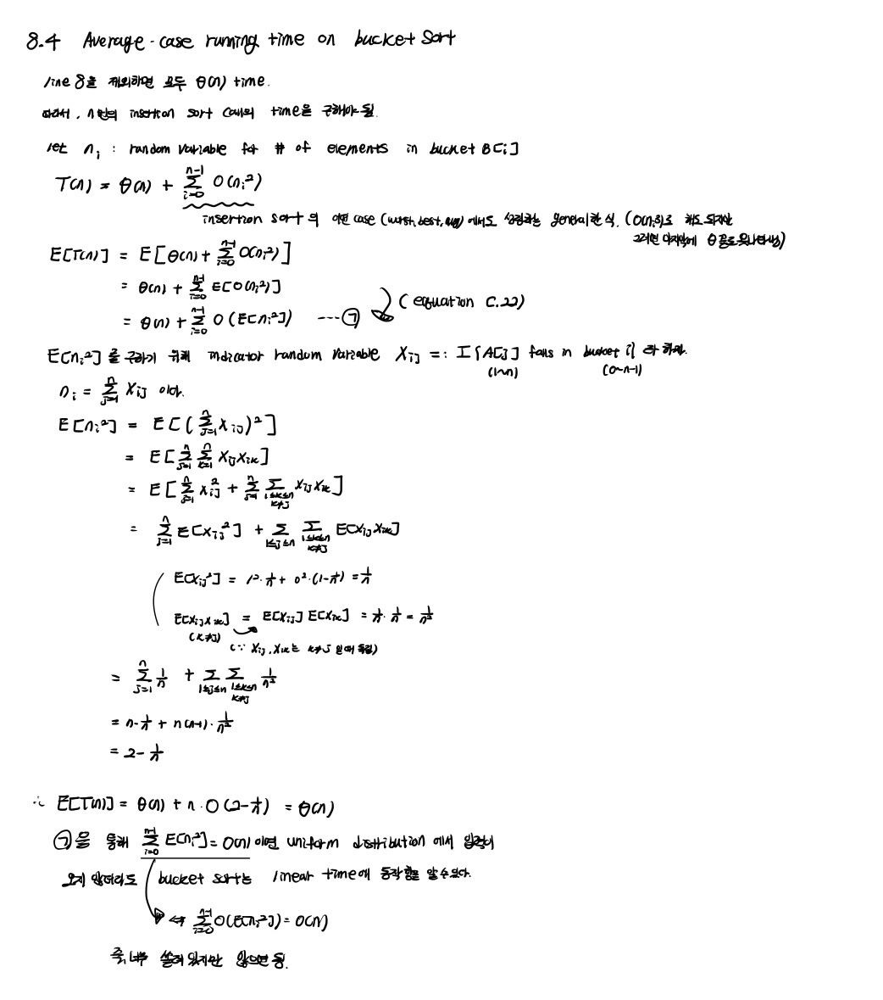
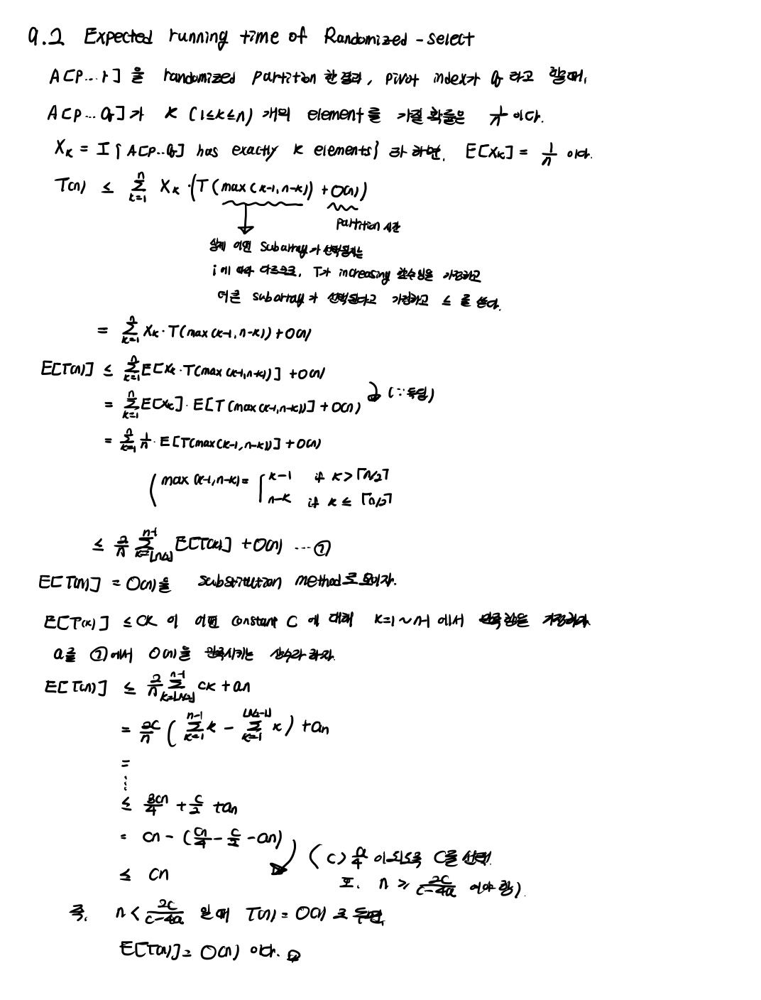
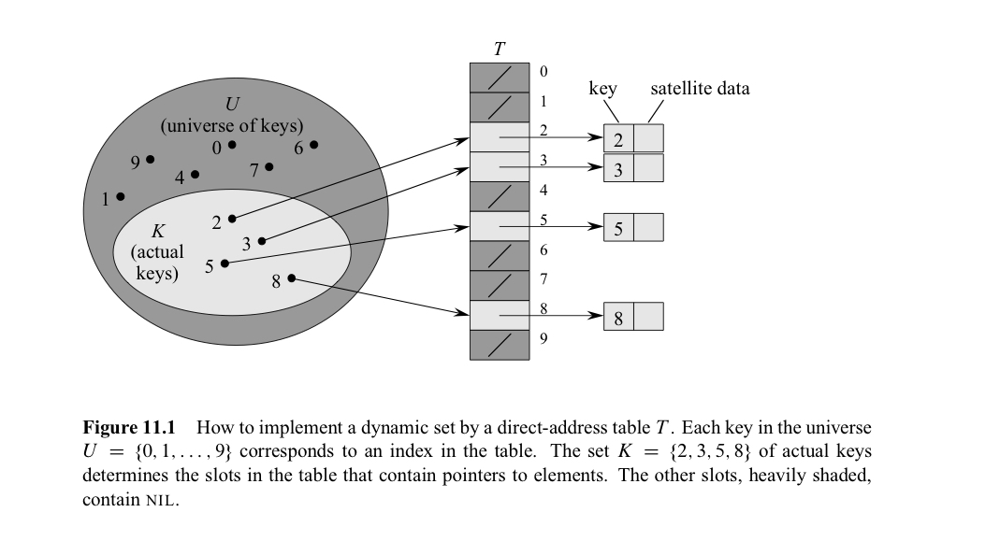
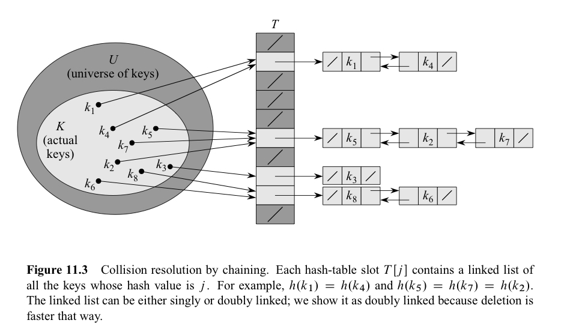
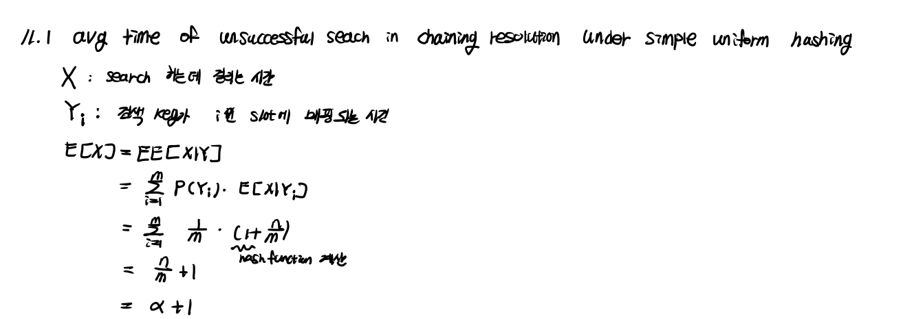
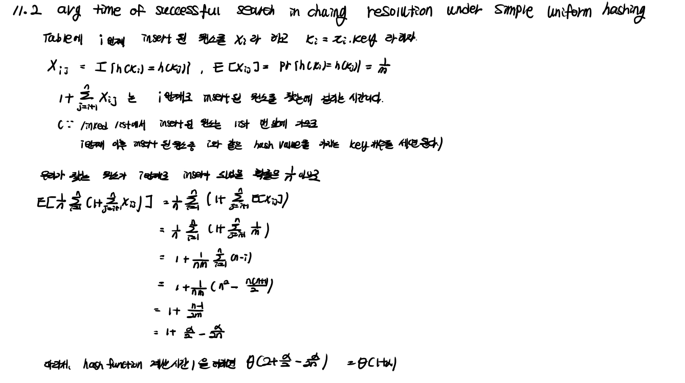

In this post, 07 Algorithm lecture is introuduced. 


CLRS chater 8.4, 9.1 ~ 9.3, 10, 11.1 ~ 11.2 의 내용을 다룬다.

# 8.4 Bucket sort

Bucket sort는 0~1 범위의 n개의 input이 들어올 때, 0~1/n, 1/n~2/n, ... n-1/n ~ n/n 범위의 숫자들을 저장하는 크기 n의 array를 만들고, array의 원소는 해당 범위의 숫자들을 저장하는 linked list를 저장한다. 

```pseudocode
BUCKET-SORT(A)
1 n = A.length
2 let B[0..n-1] be a new array
3 for i = 0 to n - 1
4 	make B[i] an empty list
5 for i = 1 to n
6 	insert A[i] into list B[floor(nA[i])]
7 for i = 0 to n - 1
8 	sort list B[i] with insertion sort
9 concatenate the lists B[0], B[1], ... B[n - 1] together in order
```



Bucket sort에서 값들이 0~1 사이에서 uniformly distrubed 하게 들어온다고 가정하에, average case running time을 구해보자. 



위 증명과정에서 식 (ㄱ)을 통해, 입력이 반드시 uniform distribution에서 오지 않더라도 너무 쏠려 있지만 않다면 시간 복잡도가 $\theta(n)$ 이 됨을 알 수 있다. 위 증명과정에서 맨 초기에 insertion sort에 대해서 $O(n^2)$ 를  적었는데 average-case에도 해당되는 이야기인지 헷갈릴 수 있다. 그러나, $E[O(f(n))] = O([E(f(n))])$ 을 이용해 expectation 을 이용해 결국 평균적인 경우를 보게 됨을 알 수 있다. 

Q : insertion-sort 대신, worst-case와 average-case의 시간복잡도가 다른 경우에는 식을 어떻게 적어야 하는가? EE 를 적용해야 하는 문제 같은데..


# 9.1 Minimum and maximum

9장에서는 n개의 distinct 한 숫자들이 들어왔을 때 그 중 i번째로 큰 숫자인 $i_{th} $ **order statistic** 을 구하는 문제를 다룬다. sorting 알고리즘을 생각해보면 $\theta(nlgn)$ 으로 정렬한 후, 해당 인덱스로 접근하면 되지만, 이 문제를 linear time에 풀 수 있는 방법을 알아본다. 우선 min/max를 구하는 문제를 살펴보자. 

```pseudocode
MINIMUM(A)
min = A[1]
for i = 2 to A.length
	if min > A[i]
		min = A[i]
return min
```

위 알고리즘은 (n-1)번의 비교를 하므로 $\theta(n)$ 임은 자명하다. 만약 min/max를 동시에 구해야 한다면, 위 알고리즘을 같은 방식으로 (min/max 버전으로) 2번 적용하여 2(n-1)번의 비교로 문제를 해결할 수 있다. 하지만 더 효율적이게는, $3\lfloor n/2 \rfloor$ 만의 비교로 문제를 해결할 수 있다. n개의 input을 한 번에 하나씩이 아니라 2개씩 본다. 이 둘을 비교하여 큰 element는 max와 비교하고, 작은 element는 min가 비교하여 update 하는 식으로 비교 횟수를 줄일 수 있다. 

❗비교 연산이 줄었다고 해도 어짜피 $\theta(n)$ 임은 동일한데 simultanesou 한 방법을 사용해야 하는 이유는 무엇일까? 이는 아키텍처, I/O 관점에서 이해해야 한다. 빅데이터의 경우, 한 번에 메모리에 모든 데이터가 올라오지 않으므로, 데이터를 알고리즘에서 한 번 스캔하냐, 두 번 스캔하냐의 차이는 크다. 

# 9.2 Selection in expected linear time

이제 임의의 i번째로 큰 원소를 선택하는 상황을 생각해보자. RANDOMIZED-SELECT는 Randomized quick sort처럼 randomized 알고리즘이며, 7.3에서 사용한 RANDOMIZED-PARTITION을 그대로 사용한다. 

```pseudocode
RANDOMIZED-SELECT(A, p, r, i)
if p == r
	return A[p]
q = RANDOMIZED-PARTITION(A, p, r) // pivot보다 작은 원소는 왼쪽, 큰 원소는 오른쪽에 위치하게 됨
k = q - p + 1
if i == k
 return A[q]
elseif i < k
	return RANDOMIZED-SELECT(A, p, q - 1, i)
else return RANDOMIZED-SELECT(A, q + 1, r, i - k)
```

RANDOMIZED-SELECT 알고리즘의 expected running time이 $\theta(n)$ 임을 증명해보자.



# 9.3 Selection in worst-case linear time

(시간 나면 보기. 220-223 pg)

(0922 35:00~ , 페이지폴트 질문:42:00~45:45)


# 10.1 ~ 10.4 Elementary Data Structures

(시간 나면 보기. 232~248 pg)

(0922 45:45~50:37)


# 11.1 Direct-address tables

**Direct addressing** 은 key들의 집합 $U$ 가 작을 때 잘 동작하며, 아래 그림으로 설명을 대체한다. $T$가 **direct-address table** 이다. 데이터를 worst-case에도 $O(1)$ time에 search 할 수 있다. 



# 11.2 Hash tables

Direct addressing의 단점은 $U$ 가 너무 크면, 컴퓨터의 메모리에 크기가 $\left\vert (U) \right\vert$ 인 table $T$ 를 저장하는 것이 불가능하다. 또, 실제 사용되는 key들이 일부이면, 메모리가 낭비된다.

direct addressing에서 key가 k인 element는 $T$ 의 slot k 에 저장되는 반면, hashing에서는 slot $h(k)$ 에 저장된다. 즉, $\left\vert (U) \right\vert$ 보다 훨씬 작은 $m$ 에 대하여 **hash function** $h : U \rightarrow {0, 1, ..., m-1}$  를 정의한다.

표현은 "element with key k hashes to slot h(k)", "h(k) is hash value of key k" 라고 표현한다.  



위 그림에서 알 수 있듯, direct addressing에서는 key가 다르면 (다른 element는 다른 key를 가진다고 가정) slot의 위치가 다르지만, hashing에서는 key가 달라도 같은 slot으로 배정될 수 있고 이를 **collision** 이라고 한다. 

무작위처럼 보이는 hash function을 이용하면 collision을 최소화할 수 있겠지만 $m < \left\vert (U) \right\vert$  이므로 collision은 반드시 발생하고 이를 완전히 없앨 수는 없다. 따라서, collision이 발생했을 때 이를 해결하는 **collision resolution** 이 필요하다. 

❗hash table과 관련해서 hash function이 uniformly distributed 하게 만드는 것과, hash collision을 다루는 것이 중요하다. 우선, hash collision을 다루는 법 부터 알아보자. 

**chaining collision resolution** 에서는 위 그림처럼 같은 위치에 해시되는 모든 원소를 연결 리스트에 넣는다. 단방향 연결 리스트를 사용할 경우, worst-case에 삽입 $O(1)$, 삭제 $O(n)$ 의 시간이 걸리며 양방향 연결 리스트를 사용할 경우, 각각 $O(1)$ 시간이 걸린다. 

임의의 element가 $m$ 개의 slot으로 hashing 될 확률이 다른 element들이 어디로 hasing되었는지와 무관하게 동일할 때 이를 **simple uniform hasing** 이라고 한다. m 개의 slot과 n 개의 input이 있을 때, **load factor** $\alpha = n/m$  이라고 정의하면 이는 slot에 들어있는 원소의 개수의 평균을 나타낸다. 이 때, 우리는 simple uniform hasing이라는 가정하에, unsuccessful search의 average-case 시간 복잡도가 $\theta(1+\alpha)$ 임을 증명하자. 



이번에는 같은 조건에서 successful search의 average-case 시간 복잡도 역시 $\theta(1+\alpha)$ 임을 증명하자. 



이것이 의미하는 바가 무엇일까. 만약 table의 slot의 개수가 input 개수 n에 비례한다면 $n=O(m)$ 이 되고 $\alpha = O(m)/m = O(1)$ 이 된다. 즉, average-case에 search 시간은 $O(1)$ 이 되는 것이다. 
