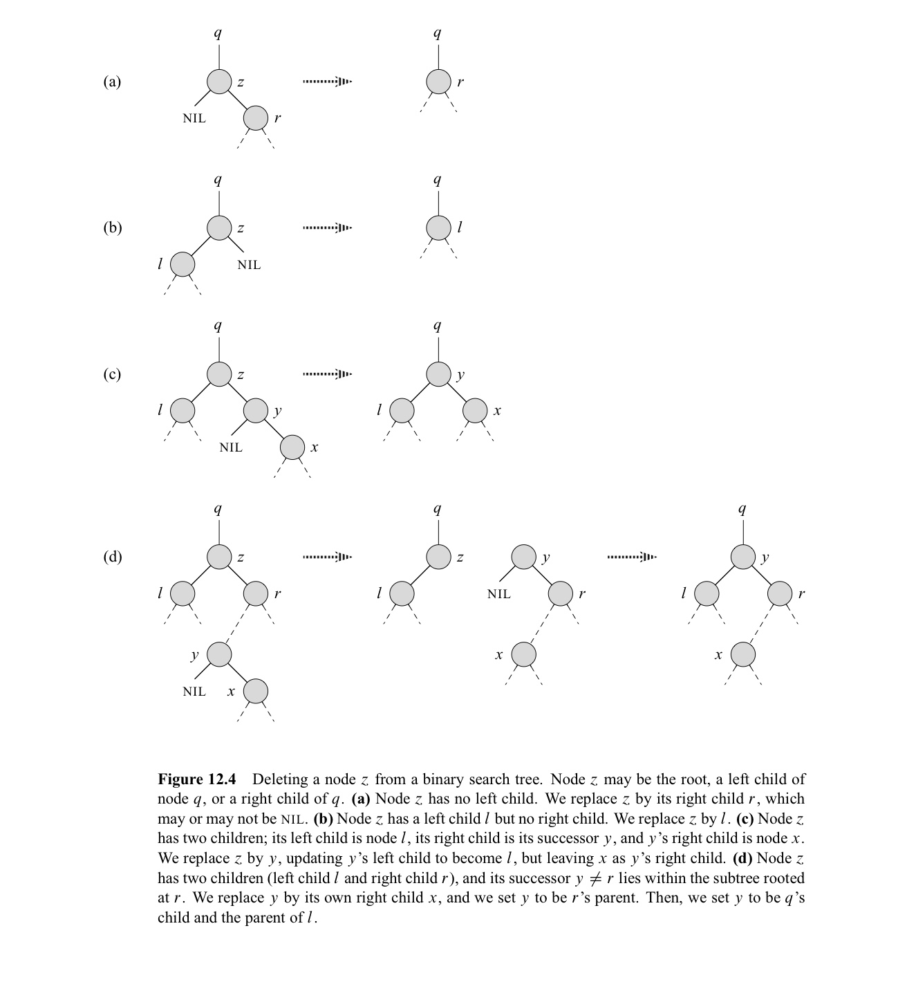

In this post, 10 Algorithm lecture is introuduced. 


CLRS chater 12의 내용을 다룬다.


# 12.1 What is BST?

BST는 BST property를 만족하는 binary tree이다. 

- BST property : node $x, y, z$ 에 대해 $y$가 $x$ 의 left-subtree, $z$가 $x$의 right-subtree에 있을 때, $y.key \leq x.key \leq z.key$ 를 만족한다.

BST에서는 search, insert, deletion이 가능하고 각 연산은 모두 tree의 height에 비례하는 시간 복잡도를 가진다. 따러서, worst-case에는 $\theta(n)$의 시간 복잡도를 가진다. 12.4에서는 randomly-built된 BST의 expected height가 $O(lgn)$ 이 됨을 보인다. 따라서, 평균적으로 search, insert, deletion은 $\theta(lgn)$ 의 시간이 걸린다.

Insertion, deletion이 dynamic하게 자주 일어나는 상황인 경우, Hash table보다 BST를 이용하는 것이 좋다.

BST의 root에 대해 inorder-traversal을 하면 node들이 key 값을 기준으로 sorting 된다.

```pseudocode
INORDER-TREE-WALK(x)
if x != NIL
	INORDER-TREE-WALK(x.left)
	print x.key
	INORDER-TREE-WALK(x.right)
```

위 알고리즘의 시간복잡도가 $\theta(n)$임을 증명하자.

모든 node를 방문하므로 $T(n)=\Omega(n)$ 이다.

$T(0)=c>0$ 이고 $n>0$ 일때, $T(n) \leq T(k) + T(n-k-1)+d$ 이다. 이 때, $k$는 left-subtree의 node 수이다.  substitution method를 이용하여 $T(n) \leq (c+d)n +c$ 임을 보이자. 

$T(n) \leq T(k)+T(n-k-1)+d = (c+d)n+c$ 따라서, $T(n)=O(n)$


# 12.2 Querying BST

아래 코드는 BST에서 search를 하는 코드의 recursive, iterative 버전이다.

```pseudocode
TREE-SEARCH(x, k)
if x == NIL or k == x.key
	return x
if k < x.key
	return TREE-SEARCH(x.left, k)
else
	return TREE-SEARCH(x.right, k)

ITERATIVE-TREE-SEARCH(x, k)
while x != NIL and k != x.key
	if k < x.key
		x = x.left
	else
		x = x.right
return x
```

시간복잡도는 $O(h)$이다. recursive하게 부르면 call stack이 계속 쌓이므로 비효율적이다. 그러나 call stack이 (balance tree일 경우) tree height $h=log(n)$ 만큼 내려가므로 $n$이 커지면 거의 constant라 recursive도 그런대로 쓸만하다.

```pseudocode
TREE-MINIMUM(x)
while x.left != NIL
	x = x.left
return x

TREE-MAXIMUM(x)
while x.right != NIL
	x = x.right
return x
```

BST에서 어떤 노드의 succssor란 해당 노드보다 큰 key의 노드 중 최소값의 노드를 의미한다. predessor란, 해당 노드보다 작은 key의 노드 중 최대값의 노드를 의미한다. x의 right-subtree가 있다면 x의 successor는 right-subtree에서 최솟값의 노드가 된다. x의 right-subtree가 없다면, x의 successor는 x의 ancestor 중, 그것이 left-child 역시 x의 ancestor인 노드 중 가장 낮은(즉, 가장 x와 가까운)  노드가 된다. 

```pseudocode
TREE-SUCCESSOR(x)
if x.right != NIL
	return TREE-MINIMUM(x.right)
y = x.p
while y != NIL and x == y.right
	x = y
	y = y.p
return y
```

지금까지 본 모든 operation들은 $O(h)$의 시간 복잡도를 가진다.  

//ToDo

TREE-PREDESSOR를 구현하고 correctness를 보이고, time-complexity를 구하시오.

# 12.3 Insertion and Deletion

Insertion operation은 다음과 같이 구현 가능하다.

```r
TREE-INSERT(T, z)
y = NIL
x = T.root
while x != NIL
	y = x
	if x.key >= z.key
		x = x.left
	else
    x = x.right
z.p = y	
// T가 empty인 경우
if y == NIL
	T.root = z
else if y.key <= z.key
	y.right = z
else
  y.left = z
```

Deletion operation은 다음과 4개의 case로 나누어 구현 가능하다. $z$를 삭제하고자 할 때,

- $z$가 left-child가 없다면, $z$를 right-child(존재하거나 NIL)로 대체한다.
- $z$가 left-child만 가진다면, $z$를 left-child로 대체한다.
- $z$가 left/right-child 모두 가진다면, $z$의 successor $y$($z$의 right-subtree의 가장 왼편에 위치)에 대해
  - $y$가 $z$의 right-child이면, $z$를 $y$로 대체한다.
  - $y$가 $z$의 right-child가 아니면, $y$의 right-child가 $y$를 대체하게 한 다음(즉, $y$의 parent가 $y$가 아닌 $y$의 right-child를 가리키게 함), $z$를 $y$로 대체한다. 




이를 구현하기 위해 TRANSPLANT 라는 보조 함수를 이용한다. 이 함수는 노드 $u$를 root로 하는 subtree를 없애고, $v$를 root로 하는 subtree를 그 자리에 붙인다. 이 때, v.left와 v.right는 TRASPLANT에서 따로 update하지 않는다. 

```pseudocode
TRANSPLANT(T, u, v)
if u.p == NIL
	T.root = v
else if u == u.p.left
	u.p.left = v
else
	u.p.right = v
if v != NIL
	v.p = u.p
```

이를 이용하여 deletion을 구현하면 아래와 같다.

```pseudocode
TREE-DELETE(T, z)
if z.left == NIL
	TRANSPLANT(T, z, z.right)
else if z.right == NIL
	TRANSPLANT(T, z, z.left)
else
	y = TREE-MINIMUM(z.right) // y = TREE-SUCCESSOR(z)와 동일
	if y.p != z // TREE-SUCCESSOR(z) != z.right 와 동일
		TRANSPLANT(T, y, y.right)
		y.right = z.right
		y.right.p = y
	TRANSPLANT(T, z, y)
	y.left = z.left // TRANSPLANT에서 업데이트 안했으므로!
	y.left.p = y // TRANSPLANT에서 업데이트 안했으므로!
```

지금까지 본 모든 operation들은 $O(h)$의 시간 복잡도를 가진다.  

