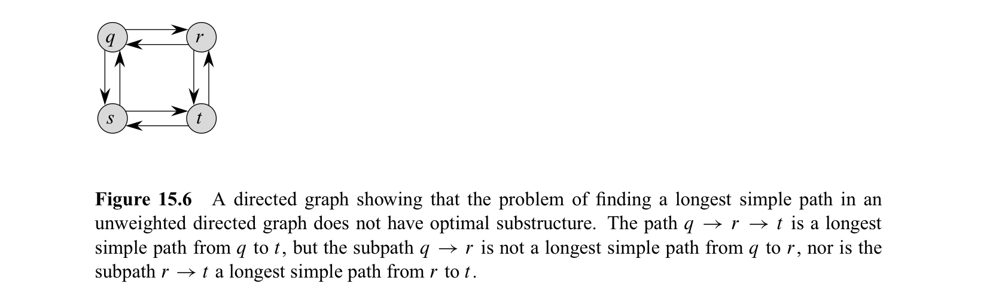
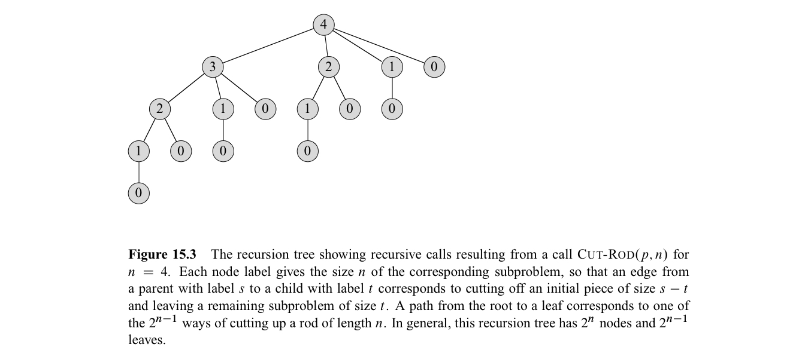
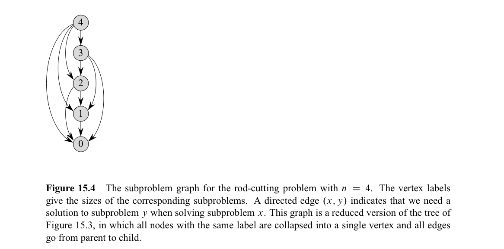
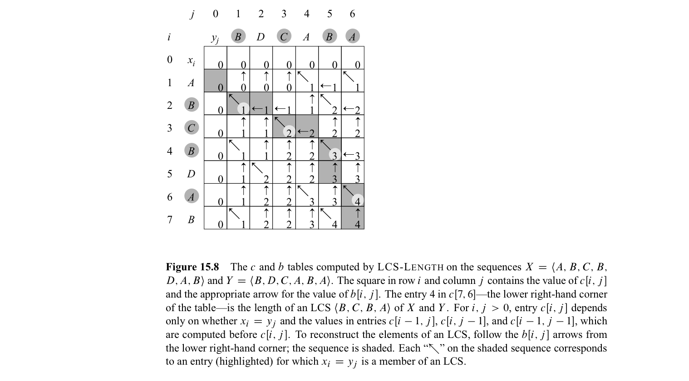
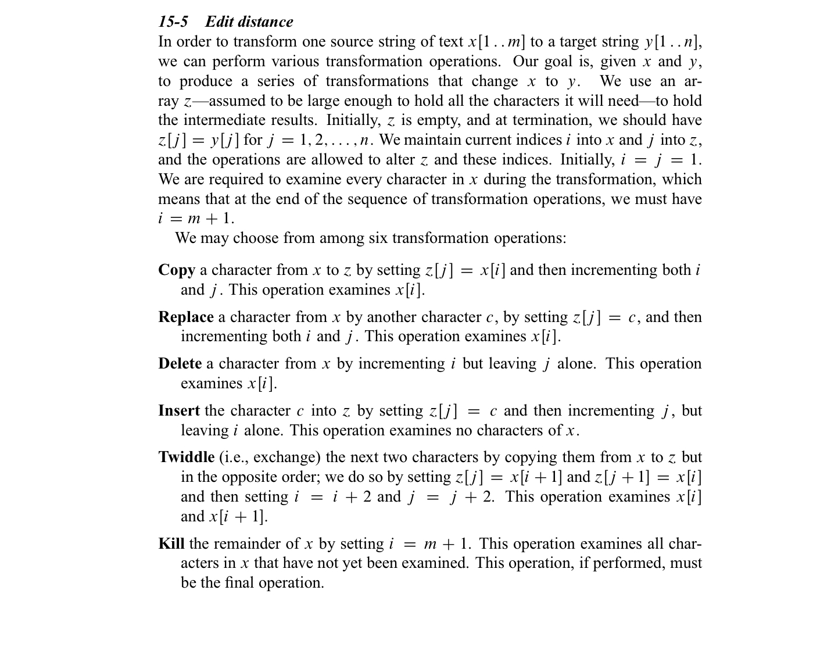
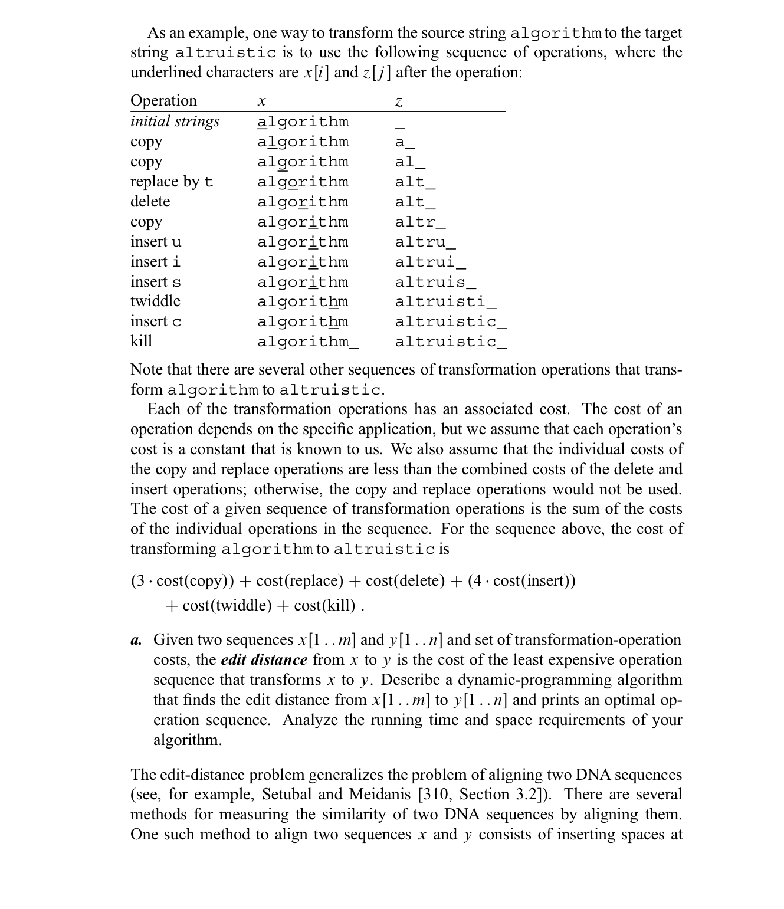

In this post, 12, 13 Algorithm lecture is introuduced. 


CLRS chater 15의 내용을 다룬다.


# 15. Dynamic Programming

Dynamic Programming (DP)에서는 Divide-and-conquer와 마찬가지로 문제를 구성하는 subproblems를 해결하여 전체 문제를 해결한다. Divide-and-conquer는 문제를 disjoint한 subproblems들로 나누어 각 subproblem을 해결하는 재귀적 구조로 이루어져 있다면(Mergesort를 생각하면 된다) DP는 subproblems간에 overlap이 존재할 때(subproblems들이 같은 subsubproblems들을 공유할 때) 적용된다. DP에서는 table을 이용하여 각 subproblems들의 결과를 단 한 번만 계산하여 시간복잡도를 줄인다. 

DP는 **optimization problem** 을 해결하는 데에 이용된다. 이때 어떤 문제가 DP를 이용하여 풀 수 있는 문제인지 여부는 문제가 **Optimal substructure** 와 **Overlapping subproblems** 를 갖는지 확인하면 된다. 

우선, 개념을 설명하는데에 이용될 다음 두 DP 문제를 먼저 소개한다. 

- Rod-cutting problem : 길이 $n$의 rod가 주어지고, $i=1,2,...n$ 에 대하여 길이가 $i$인 rod의 가격 $p_i$ 가 주어질 때, maximum revenue $r_n$ 이 최대가 되도록 rod를 자르는 방법과 그 때의 revenue.
- Matrix-chain multiplication : $A_i$의 크기가 $p_{i-1} \times p_i$ 로 주어진 행렬의 나열 $<A_1, A_2, ..., A_n>$ 에 대해, scalar multiplication의 횟수가 최소가 되도록 행렬들을 fully parenthesize 하는 방법과 그 때의 scalar multiplication 횟수.
  - $A, B, C$ 의 크기가 각각 $1 \times 2$, $2 \times 3$, $3 \times 4$ 일 때, $((AB)C)$ 의 순서로 계산하면, $(1 \times 2 \times 3) + (1 \times 3 \times 4) = 18$번의 scalar multiplication이 필요한 반면, $(A(BC))$ 의 순서로 계산하면, $(2 \times 3 \times 4) + (1 \times 2 \times 4) = 36$번의 scalar multiplication이 필요하다. 
  - 이렇게 연산의 순서가 유일하게 결정되도록 괄호를 치는 것을 fully parenthesize한다고 한다.
  - $n$ 개의 행렬에 대해서 가능한 모든 경우의 수는 catalan number가 되어 $\Omega(4^n/n^{3/2}) \in \Omega(2^n)$ 이 되어 brute-force를 이용할 수 없음을 알 수 있다. 

## Optimal substructure & Step 1. Characterize the structure of an optimal solution

어떤 문제가 optimal substrucure (최적부분구조)를 가진다는 것의 의미는 그 문제의 optimal solution (최적해)가 그 안에 subproblems들의 optimal solution을 포함하고 있는 것을 의미한다. 문제가 optimal substucture를 가지면 DP를 적용할 수 있는 문제일 가능성이 있다는 힌트가 된다. (혹은 16장에서 다룰 Greedy algorithm에 대한 힌트가 되기도 한다) DP를 적용하게 되면 subproblems들의 optimal solution으로 부터 problem의 optimal solution을 구한다. 따라서, problem의 optimal solution을 구하기 위한 subproblems들이 모두 계산되는지 확인하는 것이 필요하다. 

DP를 적용하는 4단계 중 1단계는 최적해의 구조를 구체적으로 기술하는 것 (Characterize the strucure of an optimal solution) 이다. 이 과정은 즉, 위에서 기술한 optimal substructure임을 보이는 것인데 이 과정은 다시 다음의 3단계로 이루어진다. 

1. 문제의 solution이 어떤 '선택'을 하는 과정으로 구성됨을 보인다. 그리고 이 선택의 결과로 해결되어야 할 subproblems들이 생김을 설명한다.
   - Rod-cutting problem에서, 이 선택은 더 이상 쪼개지 않을 크기 가장 왼쪽 rod의 크기 $i$ ($1 \leq i \leq n$) 을 구하는 것이다. 이 선택의 결과로 다시 쪼개야할 길이 $n-i$의 rod가 남고 이것이 subproblem이 된다. 
   - Matrix-chain multiplication에서, 가장 바깥 수준에서 행렬이 두 그룹으로 나뉘는 위치 $k$ ($1 \leq k < n$) 을 구하는 것이다. 이 선택의 결과로 $A_{1..k}, A_{k+1, n}$ 의 subproblems가 생긴다. 
2. 주어진 문제에 대해서 optimal solution을 만드는 선택을 했다고 가정하자 (어떤 선택지를 골라야하는지는 고려하지 않는다). 그로 인해 subproblem들이 발생하는지 파악하고, 그 subproblem들이 이루는 전체 구조(공간)를 어떻게 정의·설명하는 것이 가장 적절한지를 결정한다.
   - Rod-cutting problem에서, optimal solution에 해당하는 $i$를 골랐을 때 크기 $n-i$ 의 subproblem이 발생한다.
   - Matrix-chain multiplication에서, optimal solution에 해당하는 $k$를 골랐을 때  $A_{1..k}, A_{k+1, n}$ 의 subproblems가 생긴다. 이 때, $A_{k+1, n}$ 는 인덱스가 1부터 시작하지 않기 때문에 이 또한 subproblem space에 포함되도록 하기 위하여 subproblems들은 양쪽 끝 모두를 변수로 가질 수 있는 것으로 정의한다. 
3. Cut-and-paste 기법을 사용하여 2에서 optimal solution을 위해 만들어진 subproblmes들의 solution도 optimal 해야 함을 보인다. 구체적으로, 각 subproblem의 solution이 optimal 하지 않다고 가정하여 problem의 solution이 optimal 하다는 것에 모순을 보인다. 
   - Rod-cutting problem에서, 2에 의해 $r_n = r_i + r_{n-i}$ 가 되는데 이때, $r_{n-i}$ 의 값이 optimal solution이 아니라고 가정하자. 그러면 $r^{'}_{n-i} \geq r_{n-i}$ 가 존재하게 되고 이 경우로 rod를  cutting하면 $r^{'}_{n} \geq r_{n}$ 이 존재하게 되어 $r_{n}$이 optimal solution 이라는 것에 모순이 발생한다. 
   - Matrix-chain multiplication에서, 2에 의해 $A_{i..j}$ 의 optimal solution을 위한 $k$를 골랐을 때, $A_{i..k}, A_{k+1..j}$ 중 optimal solution이 아닌 것이 있다고 가정하자. 일반성을 잃지 않고 $A_{i..k}$이 optimal solution이 아니라고 하자. 그러면 $A_{i..k}$를 계산할 수 있는 더 최적의 parenthesization 방법이 존재하고 이 방법을 적용하면 $A_{i..j}$ 의 값이 더 작아지며 이는 $A_{i..j}$ 이 optimal solution임에 모순된다. 

❗️Optimal substructure 임을 보이는 과정에서 반드시 기술해야할 사항은 아니지만 optimal substructure 구조는 다음 2가지 기준에 따라 다양하게 나뉠 수 있다. 

1. Original problem에 대한 optimal solution에서 한 번에 몇 개의 subproblems를 이용하는가?
   - Rod-cutting problem에서, size $n$인 original problem의 optimal solution을 구하는 과정에서 size $n-i$ 인 하나의 subproblem을 이용한다.
   - Matrix-chain multiplication에서, 2개의 subproblems를 이용한다. 
2. Optimal solution을 구하는 과정에서 어떤 subproblem을 이용할지에 정하는 과정에서 몇 개의 선택지가 존재하는가?
   - Rod-cutting problem에서, $i$를 정하기 위해 $n$ 가지의 choice가 존재한다.
   - Matrix-chain multiplication에서, problem $A_{i..j}$ 에서 $k$를 정하기 위해 $j - i$ 가지의 choice가 존재한다.

❗️Rough하게 DP 알고리즘의 시간 복잡도를 구하기 위해서는 사용되는 전체 subproblem의 개수와 각 subproblem에서 할 수 있는 선택의 개수를 곱하면 된다. 

- Rod-cutting problem에서, $\theta(n)$ 개의 subproblem이 있고, 각 subproblem마다 최대 $n$개의 선택지가 있으므로 시간복잡도는 $O(n^2)$ 이 된다. 
  - 밑에서 볼 subproblem graph를 이용하면 $n$ 개의 vertices가 있고 하나의 vertex는 최대 $n$개의 outgoing edge가 있으므로 $O(n^2)$ 의 running time을 가지게 됨을 알 수 있다. 밑에서는 이것이 $O(V+E)$ 이기도 함을 설명한다.
- Matrix-chain multiplication에서, $\theta(n^2)$ 의 subproblem이 있고, 각 subproblem마다 최대 $n-1$개의 선택지가 있으므로 시간복잡도는 $O(n^3)$ 이다. 

❗️DP에서는 subproblems에 대한 optimal solution을 먼저 찾고 이 정보가 있는 상태에서 problem의 optimal solution을 구하는 반면, greedy 알고리즘에서는 해당 시점의 최적으로 보이는 greedy choice를 한 다음, 남은 subproblem을 해결하는 식으로 진행한다.

❗️Optimal substructure를 가지는 예시와 가지지 않는 예시를 하나씩 살펴보자. Directed graph $G=(V, E)$와 vertices $u, v \in V$ 에 대하여

- Unweighted shortest path : $u$에서 $v$ 로 가는 최소 edge의 path를 구하는 문제이다. 자명하게 simple path 중에 해가 있을 것이다. 이 문제는 optimal substructure를 가진다.

- Unweighted longest simple path : $u$에서 $v$로 가는 최대 edge의 simple path를 구하는 문제이다. 이 문제는 optimal substructure를 가지지 않음을 쉽게 보일 수 있다. 

  

  - 위 예시는 longest simple path 문제는 optimal substructure를 가지지 않을 뿐더러, subproblem의 optimal solution을 합침으로서 valid한 solution(optimal일 필요 없음)을 반드시 얻게 되지 않을 수 있음을 보여준다. 예를 들어, $q$에서 $r$로의 longest simple path $q - s - t - r$과 $r$에서 $t$로의 longest simple path $r - q - s -t$ 를 합치면 $q-s-t-r-q-s-t$를 얻게 되는데 이는 simple path가 아니게 된다.
  - 이 문제는 효율적인 DP 알고리즘이 발견되지 않았으며, NP-complete (polynomial time에 해결하지 못할 것으로 추정되는) 문제에 속한다.
  - shortest path와 longest simple path 문제 모두 2개의 subproblems를 이용하게 되는데 shortest path는 2개의 subproblem이 independent한 반면, longest simple path에서는 2개의 subproblem이 independent 하지 않아(하나의 subproblem에서 사용한 vertex를 다른 subproblem에서 이용할 수 없음) 차이가 발생하게 되는 것이다. Rod-cutting, Matrix-chain multiplication 문제에서 subproblem들이 independent함을 알 수 있다.


## Step2. Recurrence relation

Overlapping subproblem 조건에 대해 설명하기 앞서, DP를 적용하는 4단계 중 두 번째 단계에 대해 알아보자. 두 번째 단계는 optimal solution의 값을 재귀적으로 정의하는 것이다. 즉 recurrence relation을 세우는 것이다. 이는 Step1에서 문제가 optimal substructure 구조를 가짐을 보였다면 쉽게 세울 수 있다. 

- Rod-cutting problem에서 $r_n = max_{1 \leq i \leq n}(p_i + r_{n-i})$ 
- Matrix-chian multiplication에서 $m[i, j]$를 행렬 $A_{i..j}$ 의 최소 연산 횟수라고 하면
  - $m[i, j] = 0 \ (i=j)$ 
  - $m[i, j] =min_{i \leq k < j} \ m[i, k]+m[k, j] + p_{i-1}p_kp_j \ (i<j)$ 

 

## Overlappng subproblems & Step3. Compute the value of an optimal solution

DP가 적용되기 위한 문제의 또 다른 조건은 subproblem들의 공간(개수)이 작은 것이다. 이 때 작다라는 의미는 재귀적 알고리즘이 적용되는 과정에서 같은 subproblem들을 반복적으로 만나게 되는 상황을 의미한다. 일반적으로 distinct한 subproblem의 개수는 input size에 대해 polynomial해야 한다. 반면 Divide-and-conquer 알고리즘을 적용하는 문제들은 재귀의 각 단계에서 항상 새로운 subproblem을 만들게 된다.

위 Step2의 rod-cutting problem의 recurrence relation을 naive한 top-down 방식의 recursive 코드로 적는다고 해보자.

```pseudocode
CUT-ROD(p, n)
if n == 0
	return 0
q = -INFINITE
for i = 1 to n
	q = max(q, p[i] + CUT-ROD(p, n - i))
return q
```

이 코드를 수행하면 문제를 해결할 수 있지만 문제는 $n$이 커짐에 따라 수행시간이 급격하게 늘어난다는 것이다. $T(n)$ 을 호출하는 subproblems의 수라고 할 때, $T(n) = 1 + \sum_{j=0}^{n-1}T(j)$ 가 되고 이를 풀면 $T(n) = 2^n $ 이 된다. Running-time도 같은 식을 만족하므로 수행시간이 $n$에 대해 지수적으로 증가하는 매우 느린 알고리즘이 된다.

이 때, $n=4$일 때, 함수 호출 관계를 recursive tree로 나타내면 아래 그림과 같다. 



그림을 보면 많은 subproblem들이 반복적으로 계산되는 구조임을 확인할 수 있고, 따라서 DP를 이용하여 호율적으로 해결할 수 있는 문제라는 것을 알 수 있다. DP는 추가적인 메모리 공간을 이용하여 subproblem들의 결과를 저장하여 각 subproblem들이 정확히 한 번만 계산되게 하는 것이다. 크게 top-down with memoization 방법과 bottom-up method가 있다. 아래는 Rod-cutting problem을 top-down with memoization 방법으로 해결한 코드이다.

```pseudocode
MEMOIZED-CUT-ROD(p, n)
let r[0..n] be a new array
for i = 0 to n
	r[i] = -INFINITE
return MEMOIZED-CUT_ROD-AUX(p, n, r)

MEMOIZED-CUT-ROD-AUX(p, n, r)
if r[n] >= 0
	return r[n]
if n == 0
	q = 0
else
	q = -INFINITE
	for i = 1 to n # i=n이면 uncut case. 
		q = max(q, p[i] + MEMOIZED-CUT-ROD-AUX(p, n - i, r))
r[n] = q
return q
```

다음은 rod-cutting problem을 bottom-up method로 해결한 코드이다.

```pseudocode
BOTTOM-UP-CUT_ROD(p, n)
let r[0..n] be a new array
r[0] = 0
for j = 1 to n # r[1]부터 r[n]까지 순차적으로 구해나감.
	q = -INFINITE
	for i = 1 to j
		q = max(q, p[i] + r[j - i])
	r[j] = q
return r[n]
```

위 에서의 결과로 우리는 optimal solution의 value는 알 수 있게 되었지만(rod-cutting problem에서 $r_4$의 값) 구체적인 optimal solution은 (rod-cutting problem에서 $n=4$ 일 때 자르는 방법) 구하지 못했다. Rod-cutting problem의 경우, 아래와 같이 위의 코드에서 각 rod-size $j$ 마다, $r_j$와 더불어  더 이상 쪼개지 않을 크기 가장 왼쪽 rod의 크기 $i$를 무엇으로 정했는지를 $s_j$ 로 저장해둔다.

```pseudocode
EXTENDED-BOTTOM-UP-CUT-ROD(p, n)
let r[0..n] and s[0..n] be new arrays
r[0] = 0
for j = 1 to n
	q = -INFINITE
	for i = 1 to j
		if q < p[i] + r[j - i]
			 q = p[i] + r[j - i]
			 s[j] = i
	r[j] = q
return r and s
```


Matrix-chain multiplication에서도, naive한 recursive 알고리즘을 적용하면 exponential time이 걸린다. 행렬의 개수가 $n$개 일 때, subproblem의 개수는 $1 \leq i \leq j \leq n$ 을 만족하는 i, j의 개수로 $\theta(n^2)$ 개로 그 개수가 적고, 반복적으로 나타나므로 DP를 적용할 수 있다. 아래는 bottom-up 코드이다.

```pseudocode
MATRIX-CHAIN-ORDER(p)
n = p.length - 1
let m[1..n, 1..n] and s[1..n-1, 2..n] be new tables
for i = 1 to n
	m[i, i] = 0
for l = 2 to n
	for i = 1 to n - l + 1
		j = i + l - 1
		m[i, j] = INFINITE
		for k = i to j - 1
			q = m[i, k] + m[k + 1, j] + p_(i-1)p_kp_j
			if q < m[i, j]
				m[i, j] = q
				s[i, j] = k
return m and s
```

아래는 top-down with memoization 코드이다.

```pseudocode
MEMOIZED-MATRIX-CHAIN(p)
n = p.length - 1
let m[1..n, 1..n] be a new table
for i = 1 to n
	for j = i to n
		m[i, j] = INFINITE
return LOOKUP-CHAIN(m, p, 1, n)

LOOKUP-CHAIN(m, p, i, j)
if m[i, j] < INFINITE
	return m[i, j]
if i == j
	m[i, j] = 0
else
	for k = i to j - 1
		q = LOOKUP-CHAIN(m, p, i, k) + LOOKUP-CHAIN(m, p, k + 1, j) + p_(i-1)p_kpj
		if q < m[i, j]
			m[i, j] = q
return m[i, j]
```


**Subproblem graph** 는 각 subproblem을 하나의 vertex에 대응시킨 directed graph로, subproblem $x$의 optimal solution을 찾는 과정에서 subproblem $y$의 optimal solution을 이용하게 되면 $x$에서 $y$로의 directed edge가 존재하는 graph이다. 아래 그림은 Rod-cutting problem에서 $n=4$ 일 때의 subproblem graph이다. 



전체 subproblem의 개수는 subprblem graph의 vertex 개수와 같다. 하나의 subproblem을 해결하는 데 걸리는 시간은 그 subproblem에서 다른 subproblem으로 향하는 outgoing edges의 개수 (degree)에 비례한다. 따라서, DP의 수행시간은 $O(V+E)$ 가 된다. 모든 하위 문제를 한 번씩은 풀어야 하므로 $O(V)$ 의 시간이 들고, 이 과정에서 subproblem을 호출하는 총 개수가 $|E|$ 개 이므로 하위 문제들의 결과를 look-up 하는 시간의 합이 $O(E)$ 가 되어 총 수행시간은 $O(V+E)$ 가 된다.

❗️모든 subproblems이 한 번 이상 해결되어야 하는 경우에, bottom-up 방식이 top-down memoized 방식보다 constant factor가 작다. bottom-up 방식에서는 recursion이 일어나지 않고, table을 유지하는 오버헤드가 더 작기 때문이다. 반면, 모든 subproblem을 해결할 필요가 없는 경우에는 top-down memoized 방식을 활용하면 필요한 subproblem만 계산하게 되어 더 빠를 수 있다. 

## Step4. Construct an optimal solution from computed information

Step3에서의 결과를 바탕으로 구체적인 optimal solution을 얻는 단계이다. 아래는 rod-cutting problem에서의 solution을 얻는 코드이다. 

```pseudocode
PRINT-CUT-ROD-SOLUTION(p, n)
(r, s) = EXTENDED-BOTTOM-UP-CUT-ROD(p, n)
while n > 0
	print s[n]
	n = n - s[n]
```

아래는 matrix-chain multiplication에서 solution을 얻는 코드이다.

```pseudocode
PRINT-OPTIMAL-PARENS(s, i, j)
if i == j
	print "A_i"
else
	print "("
	PRINT-OPTIMAL-PARENS(s, i, s[i, j])
	PRINT-OPTIMAL-PARENS(s, s[i, j]+1, j)
	print ")"
```


## Longest common subsequence

위에서 알아본 step에 따라 longest common subsequence 문제를 DP로 해결하여 보자. 

LCS problem은 sequence $X = <x_1, ... x_m>, Y = <y_1, ...y_n>$ 이 주어졌을 때, 이들의 lcs를 찾는 것이다. 이 때 subsequence는 해석학에서 부분 수열을 의미한다.(ACD는 ABCDE의 부분 수열). 

**Step1. Characterize the structure of an optimal solution**

$Z=<z_1, ... z_k>$ 가 LCS라고 하면 다음이 성립한다. 

- $x_m = y_n$ 이면, $z_k = x_m = y_n$ 이고, $Z_{k-1}$은 $X_{m-1}$과 $Y_{n-1}$ 의 LCS이다.
- $x_m \not= y_n$,  $z_k \not= x_m$ 이면, $Z$는 $X_{m-1}$과 $Y_{n}$ 의 LCS이다.
- $x_m \not= y_n$,  $z_k \not= y_n$ 이면, $Z$는 $X_m$과 $Y_{n-1}$ 의 LCS이다.

위 사실을 이용하면 LCS 문제가 optimal substructure를 가짐을 쉽게 보일 수 있다. 

**Step2. Recurrence relation**

$c[i, j]$를 $X_i$와 $y_j$의 LCS의 길이라고 정의하면 다음 recucurrence relation이 성립한다.

- $c[i, j] = 0, \ (ij=0)$
- $c[i, j] = c[i-1, j-1]+1, \ (i,j>0, x_i=y_j)$
- $c[i, j] = max(c[i, j-1], c[i-1, j]) \ (i,j>0, x_i \not=y_j)$ 

이를 통해 LCS는 모든 subproblem을 고려하지 않는 문제임을 알 수 있다. 

**Step3. Compute the value of an optimal solution**

Bottom-up 방식의 코드이다. $b[i, j]$는 $c[i, j]$ 를 계산할 때 이용한 optimal subproblem에 대응하는 $c$ table entry를 가리키는 화살표가 저장된다. 예를 들어,  $c[i, j]$ 를 구하기 위해  $c[i-1, j-1]$가 이용된 경우, $b[i, j]$에는 ↖️ 가 저장된다. 

```pseudocode
LCS-LENGTH(X, Y)
m = X.Length
n = Y.Length
let b[1..m, 1..n] and c[0..m, 0..n] be new tables
for i = 1 to m
 c[i,0] = 0
for j = 0 to n
	c[0, j] = 0
for i = 1 to m
	for j = 1 to n
		if xi == yj
			c[i, j] = c[i-1, j-1]+1
			b[i, j] = ↖️
		elseif c[i-1, j] >= c[i, j-1]
			c[i, j] = c[i-1, j]
			b[i, j] = ⬆️
		else 
			c[i, j] = c[i, j-1]
			b[i, j] = ⬅️
return c and b
```

위 코드의 시간복잡도는 $O(mn)$ 이다. 

**Step4. Construct an optimal solution from computed information**

현재 Step3의 결과로 아래 그림과 같이 c, b table이 존재하는 상황이다. 




```pseudocode
PRINT-LCS(b, X, i, j)
if i == 0 or j == 0
 return
if b[i, j] == ↖️
	PRINT-LCS(b, X, i-1, j-1)
	print x_i
elseif b[i, j] == ⬆️
	PRINT-LCS(b, X, i-1, j)
else
 PRINT-LCS(b, X, i, j-1)
```

위 코드의 시간복잡도는 $O(m+n)$ 이다. 


## Optimal BST

위에서 알아본 step에 따라 optimal BST 문제를 DP로 해결하여 보자. 

단어를 search하기 위하여 단어를 key값으로 하여 lexical order로 정렬된 BST가 있다고 해보자. 단어들의 정렬 순서는 유일하지만 이 key값들의 대소 관계를 바탕으로 만들 수 있는 BST의 모양은 여러가지이다. 이 때, 자주 search되는 단어를 root 와 가깝게 두고 드물게 search되는 단어를 root와 멀리두면 평균 탐색 시간을 최소화할 수 있다. Optimal BST problem은 $n$개의 정렬된 distinct key $K=<k_1, ... k_n>$ 과 각 $k_i$가 검색되는 확률(빈도) $p_i$, 그리고, 사전(트리)에 없는 단어인데 존재한다면 트리 구조상, $k_{i} < d_{i} < k_{i+1}$에 존재할 $d_i$ 에 대해 ($0 \leq i \leq n$) $d_i$ 가 검색되는 확률 $q_i$ 가 주어질 때, search 시간이 최소화 되는 BST 구조를 구하는 문제이다.  

문제의 정의로부터 다음 2가지가 성립함을 알 수 있다.

- $\sum_{i=1}^{n}p_i+\sum_{i=0}^{n}q_i=1$
- $E[search cost in T] = \sum_{i=1}^{n}(depth_T(k_i)+1)p_i+\sum_{i=0}^{n}(depth_T(d_i)+1)q_i$

Optimal BST는 height가 최소가 되는 BST도 아니며, $p_i$가 최대인 $k_i$를 root로 하는 BST도 아니다. 

**Step1. Characterize the structure of an optimal solution**

$k_i, ... k_j, d_{i-1}, ...d_j$가 있을 때, 우리는 루트가 될 노드 $i \leq r \leq j$를 고르는 선택을 해야한다. BST의 (최종 문제는 $i=1, j=n$ 인 경우이다.) 이 선택의 결과로, 2개의 subproblem $k_i, ... k_{r-1}, d_{i-1}, ...d_{r-1}$, $k_{r+1}, ... k_{j}, d_{r}, ...d_{j}$가 생긴다.  위 사실을 이용하면 optimal BST 문제가 optimal substructure를 가짐을 쉽게 보일 수 있다. 

**Step2. Recurrence relation**

$e[i, j]$를 $k_i, ...k_j$로 이루어진 optimal BST의 expected cost of searching이라고 정의하고, $w(i,j)=\sum_{l=i}^{j}p_l+\sum_{l=i-1}^{j}q_l$ 즉, 해당 BST에 존재하는 노드들이 확률의 합이라고 정의하면 다음 recucurrence relation이 성립한다. 이 때, $i \geq 1, j \leq n, j \geq i-1$을 만족한다. $j=i-1$ 일 때는, 실제 key는 존재하지 않고, dummy key $d_{i-1}$만 존재하는 경우를 의미한다.

- $e[i, j]=p_r+(e[i, r-1]+w(i, r-1))+(e[r+1, j]+w(r+1,j))$
  - subtree $e[i, r-1]$ 에 대해서, 모든 노드들의 depth가 1씩 커지므로 $w(i, r-1)$ 항을 더해주어야 함을 알 수 있다.

- $w(i, j)=w(i, r-1)+p_r+w(r+1, j)$
- $e[i, j] = e[i, r-1]+e[r+1, j]+w(i,j)$ 
  - 위 두 식으로부터 유도된다. 


이를 최종적인 아래의 recuurence relation을 얻을 수 있다.

- $e[i, j] = q_{i-1} \ \ (j=i-1)$
- $e[i,j] = min_{i \leq r \leq j}e[i, r-1]+e[r+1, j]+w(i,j) \ \ i \leq j$ 

**Step3. Compute the value of an optimal solution**

Bottom-up 방식의 코드이다. $r[i, j]$는 $e[i, j]$ 의 optimal solution에서 선택된 $r$이 저장된다. 

```pseudocode
OPTIMAL-BST(p, q, n)
let e[1..n+1, 0..n], w[1..n+1, 0..n], root[1..n, 1..n] be new tables
for i = 1 to n+1
	e[i, i-1]=q_(i-1)
	w[i, i-1]=q_(i-1)
for l = 1 to n
	for i = 1 to n - l + 1
		j = i + l - 1
		e[i, j] = INFINITE
		w[i, j] = w[i, j-1] + p_j + q_j
		for r = i to j
			t = e[i, r-1] + e[r+1, j] + w[i,j]
			if t < e[i, j]
				e[i, j] = t
				root[i, j] = r
return e and root
```

위 코드의 시간복잡도는 $\theta(n^3)$ 이다. 

**Step4. Construct an optimal solution from computed information**

ToDo.

```pseudocode
construct(i, j):
    if j < i:
        return "dummy"  // 실패 노드 d_(i-1)
    else:
        r = root[i][j]
        print("k_r is root of keys i..j")
        construct(i, r-1)
        construct(r+1, j)
```


## Edit distance

CLRS 연습문제 15-5의 내용이다. 






