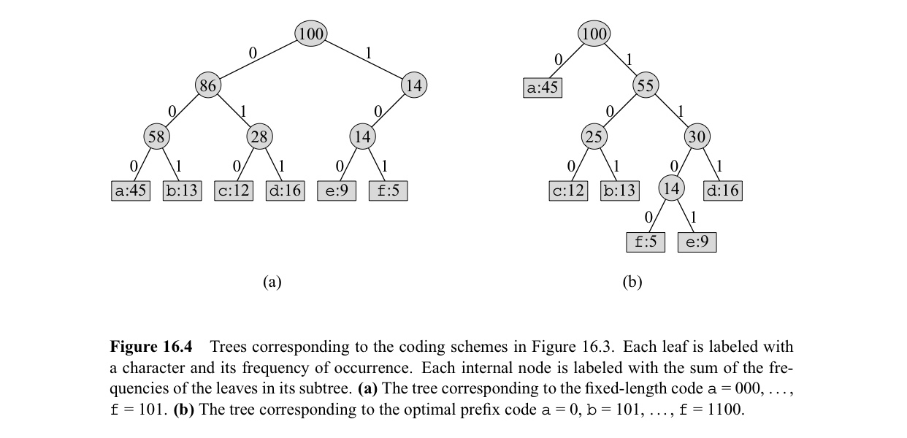

In this post, 14, 15 Algorithm lecture is introuduced. 


CLRS chater 16의 내용을 다룬다.


# 16. Greedy Algorithms

Greedy algorithm에서는 현재 시점에 locally optimal 한 선택을 하는 과정을 반복하여 globally optimal solution을 얻는다. Minimum-Spanning-Tree(Chap 23), Dijkstra(Chap 24), Chvatal's greedy set-covering heuristic(Chap 35) 등이 greedy 알고리즘에 해당한다.  

어떤 문제가 greedy 알고리즘을 이용하여 풀 수 있는 문제인지 여부는 문제가 **Greedy-choice property** 와 **Optimal substructure** 를 갖는지 확인하면 된다. 

우선, 개념을 설명하는데에 이용될 greedy 문제를 먼저 소개한다. 

- Activity-selection problem : $n$개의 activity set $S=\set{a_1, ...a_n}$ 이 주어지고, 각 $a_i$ 에 대하여 start-time $s_i$와, finish-time $f_i$가 주어질 때($0 \leq s_i < f_i < \infty)$ compatible activities로 이루어진 $S$의 subset중 maximum-size 인 것을 찾고 싶다. 편의를 위해 $a_i$의 순서는 $f_i$의 increasing-order로 주어진다고 가정하자.

Activity-selection problem에 대한 greedy 알고리즘은 여러가지가 존재할 수 있는데, 그 중 하나의 방법을 소개하면 다음과 같다. $S_k = \set{a_i \in S : s_i \geq f_k}$ (Start-time이 $a_k$의 finish-time 이후인 activity들의 집합) 을 정의하자. 우리는 $S_0$ ($f_0=0$ 이라고 하자.) 에 대해 문제를 해결하고 싶다. 

- $f_i$가 가장 빠른 (sorting되어 있으므로 $a_1$) activity를 solution set에 포함한다. 이후 같은 방식으로 $S_1$에 대한 문제(subproblem)를 해결한다. 

위 방법으로 optimal solution을 얻을 수 있는지 보이려면 다음 두 가지를 확인하여야 한다. 

- $f_i$가 가장 빠른 activity를 solution set에 포함했을 때, optimal solution을 얻을 수 있는가? 
- 이후 같은 방식으로 $S_1$에 대한 문제를 해결하면 optimal solution을 얻을 수 있는가? 즉, optimal solution은 그 안에 subproblmes의 optimal solution을 포함하는가?

첫 번째 질문은 주어진 문제가 **Greedy-choice property**를 갖는지를 묻는 질문이고, 두 번째 질문은 주어진 문제가 **Optimal substructure**를 갖는지를 묻는 질문이다. 

## Greedy-choice property

공집합이 아닌 subproblem $S_k$에 대하여 $a_m$이 $S_k$의 원소 중, finish-time이 가장 빠른 activity라고 하자. 그러면 $a_m$을 포함하는 $S_k$의 optimal solution이 반드시 존재한다. 이는 매우 간단하게 증명 가능하다. (CLRS 418pg 참고.) 즉, greedy-choice property는 알고리즘의 첫 번째 선택의 정당성에 대한 property이다.

## Optimal Substructure

Activity-selection problem을 DP 문제의 관점으로 바라보고 optimal substructure 를 가짐을 아래와 같이 보일 수 있다.

// ToDo (416pg)

하지만 더 간단하게는 Activity-selection problem을 greedy 문제의 관점으로 바라보고 optimal substructure를 가짐을 아래와 같이 보일 수 있다. 

Greedy-choice property에 의해 문제 $S_k$를 해결하기 위해, $a_m$을 고른 상태이다. 이 때, subproblem $S_m$이 생기고, 우리는 이 subproblem의 optimal solution과 $a_m$의 합집합이 $S_k$의 optimal solution이 됨을 보이면 된다. 이 증명과정은 subproblem에 귀납법을 적용하여 각 단계에서의 greedy choice가 optimal solution을 만들어 냄을 보이는 방식으로 이루어진다. 

## How to make greedy algorithms

주어진 greedy 알고리즘에 대해서 optimal solution을 구할 수 있음을 보였지만 애초에 문제가 주어졌을 때 적절한 greedy 알고리즘을 어떻게 생각할 수 있을까? 다음 3단계의 과정을 거쳐 만든다.

1. Optimization 문제를, 한 가지 선택을 내리고 나면 하나의 하위 문제(subproblem)가 남는 형태로 표현하라.
2. 탐욕적인 선택(greedy choice)을 했을 때도, 원래 문제의 optimal solution이 항상 존재함을 증명하라. 즉, 탐욕적인 선택이 항상 안전(safe) 하다는 것을 보여야 한다. 이는 위에서 greedy-choice property를 보이는 것에 해당한다.
3. 탐욕적인 선택을 한 뒤 남은 부분 문제가 ‘최적 부분 구조(optimal substructure)’를 가짐을 보여라. 즉, 탐욕적인 선택으로 줄어든 하위 문제의 최적해와 이미 한 탐욕적 선택을 합쳤을 때, 그 결과가 원래 문제의 최적해가 됨을 증명해야 한다.

Greedy 알고리즘은 DP와 다르게 bottom-up 구조를 사용할 이유가 없다. Activity-selection problem에 대한 top-down 방식의 recursive 알고리즘은 아래와 같다.

$s, f$는 start/finish time에 대한 array, $k$는 optimal solution을 구하려는 집합 $S_k$에서의 $k$값, $n$은 $S_k$에 속한 activity의 개수이다.  전체 문제를 해결하기 위해선, RECURSIVE-ACTIVITY-SELECTOR(s, f, 0, n)을 호출하면 된다. 

```pseudocode
RECURSIVE-ACTIVITY-SELECTOR(s, f, k, n)
m = k + 1
while m <= n and s[m] < f[k]
	m = m + 1
if m <= n
	return {a_m} U RECURSIVE-ACTIVITY-SELECTOR(s, f, m, n)
else return 공집합
```

위 알고리즘의 시간 복잡도는 $\theta(n)$ 이다. 모든 recursive calls를 통해서 각 activity는 정확히 한 번 접근되기 때문이다.

위 알고리즘은 tail recursive 구조를 가진다. 즉, 자신에 대한 재귀 호출과 union operation으로 return 된다. 이러한 경우, recursive 코드를 iteration에게 바꾸는 것은 매우 쉽다. 때로는 컴파일러가 이 일을 대신 해주기도 한다.

```pseudocode
GREEDY-ACTIVITY-SELECTOR(s, f)
n = s.length
A = {a_1}
k = 1
for m = 2 to n
	if s[m] >= f[k]
		A = A U {a_m}
		k = m
return A
```

위 알고리즘의 시간 복잡도도 $\theta(n)$이다. 

## DP vs Greedy

**0-1 knapsack problem** 은 가치 $v_i$, 무게 $w_i$를 가지는 $n$개의 물건과, 담을 수 있는 최대 무게 $W$가 주어질 때, 도둑이 가장 비싸게 물건을 훔치는 방법을 물어본다.

**Fractional knapsack problem** 은 같은 조건 하에서, 도둑이 각 물건을 가져거가나/가져가지 않거나 이분법이 아닌, 물건의 일정 비율만을 훔치는 것이 가능한 상황에서 같은 질문을 한다.

두 문제 모두 optimal-substructure를 가진다. 하지만 0-1 knapsack problem은 greedy-choice property를 가지지 않는반면, fractional knapsack problem의 경우 greedy-choice property를 만족한다. 따라서, fractional knapsack problem은 greedy 알고리즘을 적용할 수 있는 반면, 0-1 knapsack problem은 greedy 알고리즘을 적용할 수 없다. 

참고로, 이 때의 greedy 알고리즘은 물건 별로 단위 무게당 가치 $v_i/w_i$ 를 계산하여, 이 값이 가장 높은 물건을 최대한 담고, 해당 물건을 전부 담아도 무게가 남는다면 그 다음 높은 물건을 최대한 담는 식이다. 이 때 시간 복잡도는 $O(nlgn)$ 이다. 0-1 knapsack problem은 DP로 해결하여야 한다.

## Huffman codes

위에서 알아본 step에 따라 Huffman codes 가 왜 greedy 알고리즘인지를 알아보자. 

Binary character code는 문자를 binary로 encoding 하는 방식을 의미하는데 (e.g. a=101, b=110) 모든 알파벳의 길이가 동일한 fixed-length code, 다른 variable-length code가 있다. Huffman code는 variable-length code중 하나로 어떤 codeword도 다른 codeword의 prefix가 되지 않는 (따라서, decoding시 해석의 모호함이 없는) prefix code이다. 사용되는 알파벳의 빈도수가 주어질 때, Huffman code는 파일의 bits를 최소화하는 optimal chracter code가 된다.



단어들의 사용 빈도가 주어질 때 huffman code는 다음과 같이 tree를 build 하여 얻을 수 있다. 빈도수를 value로 같는 leaf node들 중 가장 작은 2개의 node를 합쳐 새로운 노드를 만들고 이 과정을 반복한다. 이후 간선에 0, 1을 부여하고 루트 노드에서 leaf node까지 도달하는데 지나는 edge들의 값이 해당 문자의 codeword가 된다.

알파벳의 집합 $C$가 주어지고 각 문자 $c \in C$에 대해 $c.freq$에 빈도가 저장될 때 다음과 같이 Huffman-code에 대응되는 tree를 build하는 코드를 작성할 수 있다. $Q$는 freq를 key로 사용하는 min-priority queue이다.

```pseudocode 
HUFFMAN(C)
n = |C|
Q = C
for i = 1 to n - 1
	allocate a new node z
	z.left = x = EXTRACT-MIN(Q)
	z.right = y = EXTRACT-MIN(Q)
	z.freq = x.freq + y.freq
	INSERT(Q, z)
return EXXTRACT-MIN(Q)
```

$x, y$는 코드 동작상 불필요 하지만 correctness의 증명 과정에서 필요하다.

여기서 주어진 problem은 leaf node들이 주어졌을 때, $B(T) = \sum_{c \in C}c.freq \cdot d_T(c)$ 가 최소가 되는 binary tree $T$를 구성하는 것이다.  이 때, 적용된 greedy 알고리즘은 freq가 최소인 2개의 node를 합쳐 새로운 node를 만들고 size가 1 줄어든 subproblem을 푸는 것이다. (두 노드를 merge하여 새로운 노드를 만들면 기존 node의 depth는 1이 커지고 전체 tree의 cost는 두 노드의 freq의 합 만큼 증가하게 된다. 따라서, 각 단계에서 cost가 최소가 되는 선택을 한다고 이해할 수도 있다.) 이제 우리는 위 알고리즘의 correctness와 관련하여 다음의 질문들에 답해야 한다.

- 위 greedy 알고리즘으로 구한 solution이 optimal 한가?
- 위 greedy 알고리즘으로 구성한 solution에 edge에 0, 1을 부여하여 얻은 codeword가 prefix code가 되는가?

위 두 질문에 대한 답을 보이면 위 알고리즘이 Huffman code를 생성함을 알 수 있다.(여기서는 이렇게 만드는 방식을 huffman code라고 하지 않고, $B(T)$가 최소가 되는 tree를 Huffman code라고 정의한 뒤에, 위 알고리즘이 huffman code를 생성하는지 보는 것이다)

위 두 질문을 합쳐서 다음 하나의 질문으로 바꿀 수 있다.

- 위 greedy 알고리즘으로 구한 solution이 optimal prefix code가 되는가?

이를 증명하기 위해 greedy 알고리즘의 greedy-choice property와 optimal-substrucutre를 증명해야 한다.

Greedy-choice property를 증명하기 위해 다음 lemma를 보자.

- $x, y \in C$가 가장 작은 freq를 갖는다고 하자. $x, y$의 codeword가 같은 길이를 가지고 마지막 bit만 다른 $C$의 optimal code 가 존재한다.

위 lemma의 증명은 교재 (433-434 pg 참고) 위 lemma를 이용하여 greedy-choice property를 보일 수 있다.

Optimal-substructure를 증명하기 위해 다음 lemma를 보자.

- $x, y \in C$가 가장 작은 freq를 갖는다고 하자. $z$가 $x,y$의 freq합을 빈도수로 갖는 새로운 문자라고 할 때, $C'=C-\set{x,y} \cup \set{z}$ 를 정의하자. 그러면 $C'$으로 부터 얻은 임의의 $T'$($x,y$를 $z$의 자식 노드로 갖도록 치환) 는 $C$의  optimal prefix code $T$가 된다.

위 lemma의 증명은 교재 (435 pg 참고) 위 lemma를 이용하여 optimal-substructure를 보일 수 있다.


