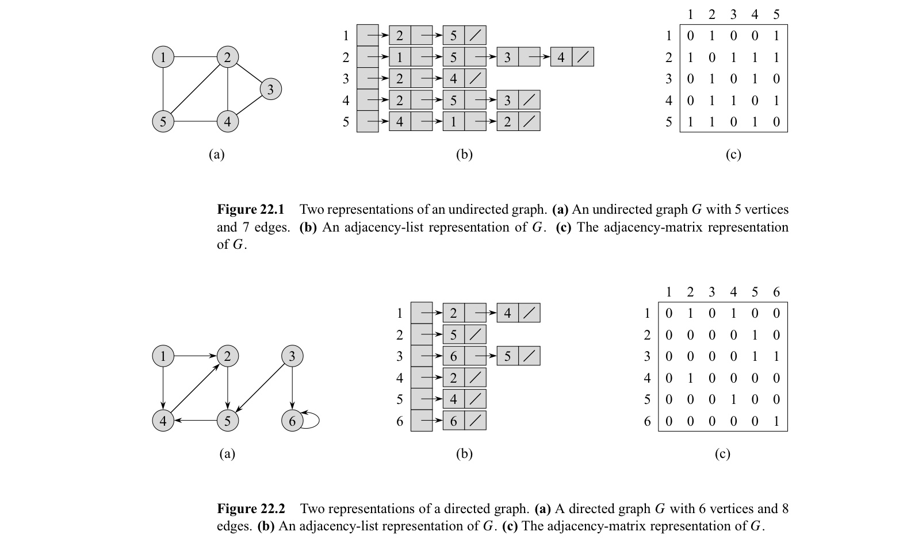

In this post, 17 Algorithm lecture is introuduced. 


CLRS chater 22.1 ~ 22.2의 내용을 다룬다.


# 22.1 Representations of graphs

- **Adjacency-list representation**
  - **sparse** graph ($\lvert E\rvert << \lvert V\lvert^2$) 에서 memory efficient
  - directed, undirected graph 모두 $theta(V+E)$ memory 필요
- **Adjacency-matrix representation**
  - **dense** graph ($\lvert E\rvert \approx \lvert V\rvert^2$) 에서 memory efficient
  - unweighted graph에서 entry 당 1-bit만 필요.
  - edge 개수와 상관없이 $\theta(V^2)$ memory 필요
  - edge $(u, v)$ 가 존재하는지 $\theta(1)$ 에 알 수 있음.



# 22.2 BFS

**Breadth-first search** 는 graph의 vertex들을 search 하는 알고리즘이다. BFS와 하는 일과 그 결과로 만들어지는 것에는 다음이 있다.

- 주어진 그래프 $G = (V, E)$와, source vertex $s$에 대해, $s$에서 reachable 한 모든 vertex를 방문하기 위해, edge들을 탐색한다.
- $s$와 각 reachable vertex들의 distance (최소 edge 개수)를 계산한다.
- BFS의 결과 **breath-first tree** 가 구성된다. Breath-first tree는 $s$를 root로 하며, $s$에서 reachable한 모든 vertex $v$에 대해 $s$ 에서 $v$ 로 가는 tree 상의 path는 $G$ 에서 shortest path가 된다. 

BFS에서 각 vertex는 white, gray, black의 색깔을 가지는데 다음의 의미를 가진다. 

- white : 모든 vertex는 white로 시작한다. search 과정에서 처음 방문되었을 때는 **discovered first time** 이라고 하는데, vertex가 discovered first time 되었을 때, gray, black으로 바뀐다. 
- gray : adjacent white vertices가 존재할 수 있다. 
- black : adjacent white vertices가 존재하지 않는다. 

BFS를 진행하는 과정에서 vertex $u$의 adjacency list를 scanning 하다 white vertex $v$를 찾게 되면, edge $(u, v)$는 breath-first tree에 추가되게 되고, 이 때, $u$를 $v$의 **predecessor** 또는 **parent** 라고 한다. 모든 vertex는 최대 1번 discovered 되기 때문에, 최대 1개의 parent를 가진다. **ancestor, descendant** 관계는 root $s$를 기준으로 정의된다. $s$에서 $v$로 가는 breath-frist tree상의 simple path에 $u$가 있다면 $u$는 $v$의 ancestor, $v$는 $u$의 descendant이다.

다음은 BFS의 pseudocode이다. $u.pi$ 에는 $u$의 predecessor를 저장하고, $u.d$에는 distance가 저장된다. 

```pseudocode
BFS(G, s)
for each vertex u in G.V - {s}
	u.color = WHITE
	u.d = INFINITE
	u.pi = NIL
s.color = GRAY
s.d = 0
s.pi = NIL
Q = Empty
ENQUEUE(Q, s)
while Q != EMPTY
	 u = DEQUEUE(Q)
	 for each v in G.Adj[u]
	 	if v.color == WHITE
	 		v.color == GRAY
	 		v.d = u.d + 1
	 		v.pi = u
	 		ENQUEUE(Q, v)
	 u.color = BLACK
```

위 알고리즘은 다음 loop-invariant를 가진다. 

- while문의 test에서, queue $Q$는 모든 gray vertices들로 구성된다. 

위 알고리즘의 시간 복잡도는 다음과 같다. 

- 모든 vertex는 최대 1번, enqueue와 dequeue된다. 따라서 queue operation의 시간은 $O(V)$
- 각 adjacency list를 최대 1번 scan한다. 모든 adjacency list의 length의 합은 $\theta(E)$ 이므로 총 scanning 시간은 $O(E)$
- Initialization은 $O(V)$
- 따라서, 총 $O(V+E)$의 시간이 걸린다. 

$s$에서 $v$로의 **shortest-path distance**를 $\delta(s,v)$ 로 쓸 때, BFS 알고리즘이 shortest-path distacne를 구하는지를 증명하자.

**Lemma22.1**

$G=(V, E)$ 에 대하여 $s \in V$ 가 임의의 vertex일 때, 임의의 edge $(u, v) \in E$ 에 대하여 다음이 성립.

$\delta(s, v) \leq \delta(s, u)+1$


BFS의 결과 **breath-first tree** 가 구성된다고 했다. 각 vertex에 저장되는 $pi$ attribute을 이용하여 tree를 구성할 수 있다. 이에 앞서 다음과 같이 graph $G=(V, E)$에 대하여 **predecessor subgraph of G** 를 정의하자. 

- $G_\pi = (V_\pi, E_\pi)$ 
- $V_\pi =\set{v \in V : v.\pi \neq NIL} \cup \set{s}$ 즉, root $s$와 $s$에서 reachable 한 vertex 집합
- $E_\pi = \set{(v.\pi, v) : v \in V_\pi - \set {s}}$  즉, BFS에서 구성된 path

이 predecessor subgraph가 $s$에서 reachable한 vertex를 모두 포함하고, $s$에서 reachable한 임의의 vertex $v$에 대해, $s$에서 $v$ 로의 simple path(중복 노드 없는 path)를 가지는데 unique하고, shortest path 라면, breath-first tree가 될 것이다. 그리고 그러함을 아래 lemma가 증명한다. 


다음 프로시저는 $s$에서 $v$로의 path를 출력한다. 

```pseudocode
PRINT-PATH(G, s, v)
if v == s
	print s
elseif v.pi == NIL
	print "no path from s to v exists"
else PRINT-PATH(G, s, v.pi)
	print v
```

