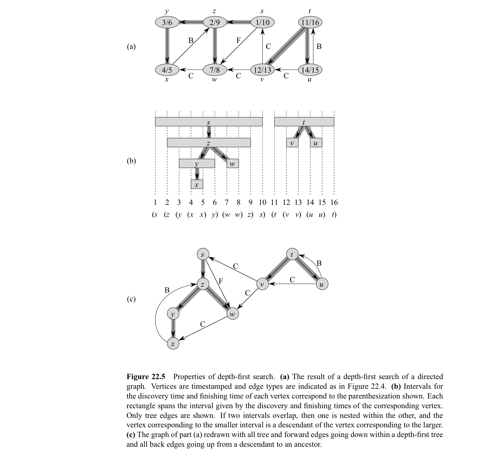
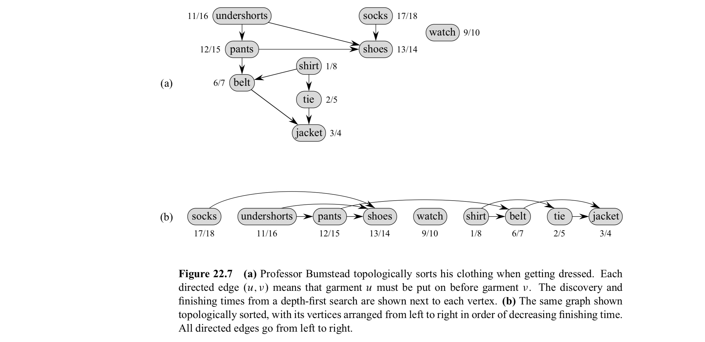

In this post, 18 Algorithm lecture is introuduced. 


CLRS chater 22.3 ~ 22.4의 내용을 다룬다.


# 22.3 DFS

BFS에서는 하나의 source만을 가지고 해당 source에서 reachable한 vertex만 search 했다면, DFS에서는 multiple sources를 가지고 최종적으로 모든 vertex를 search 한다. BFS에서 predecessor subgraph가 tree를 형성함을 보았다면, DFS에서는 predecessor subgrapgh가 여러 tree를 가지는 forest를 형성한다. 이 때, DFS에서는 모든 vertex를 search하게 되므로 predecessor subgraph의 정의는 아래와 같이 바뀐다. 

- $G_\pi = (V, E_\pi)$ 
- $E_\pi = \set{(v.\pi, v) : v \in V_\pi}$  

BFS에서와 마찬가지로 각 vertex는 white, gray, black의 color를 가지게 된다.

- white : 모든 vertex는 white로 시작한다.
- gray : search 과정에서 처음 방문되었을 때 gray로 바뀐다. 
- black : 특정 vertex의 adjacency list에 있는 모든 vertices들이 모두 방문되었을 때 이를 **finished** 라고 하는데 finished 된 vertex는 black이 된다.

또한, DFS에서는 각 vertex마다 first discoved (and grayed) time을 $v.d$에 기록하고, finish time을 $v.f$에 기록한다. 

다음은 BFS의 pseudocode이다.

```pseudocode
DFS(G)
for each vertex u in G.V
	u.color = WHITE
	u.pi = NIL
time = 0
for each vertex u in G.V
	if u.color == WHITE
		DFS-VISIT(G, u)
		
DFS-VISIT(G, u)
time = time + 1
u.d = time
u.color = GRAY
for each v in G.Adj[u]
	if v.color == WHITE
		v.pi = u
		DFS-VISIT(G, v)
u.color = BLACK
time = time + 1
u.f = time
```

위 알고리즘의 시간복잡도는 $\theta(V+E)$ 이다. (CLRS 606 pg 참고)

❗️BFS, DFS의 결과는 유일하지 않다. 

**Theorem 22.7 (Parenthesis theorm)**

임의의 vertex $u, v$ 에 대하여 다음 3가지 중 하나만이 성립. 

- [$u.d, u.f$], [$v.d, v.f$] 가 entiely disjoint 하며, depth-first forest에서 $u, v$는 서로의 descendant가 아님.
- [$u.d, u.f$] $\subset$  [$v.d, v.f$]  이며, depth-first tree에서 $u$는 $v$의 descendant 
- 위와 반대 case.


**Theorem 22.9 (White-path theorem)**

Depth-first forest에서, $v$가 $u$의 descendant 일 필요충분조건은 $u.d$의 시점 즉, $u$가 search 되었을 시점에, $u$에서 $v$로 가는 white vertices로만 이루어진 path가 있는 것이다.

**Calssification of edges**

DFS에서는 graph에 존재하는 edge들을 다음 4가지로 분류할 수 있다. 

- **Tree edges** : Depth-first forest $G_\pi$ 에 포함된 edge. 즉, DFS에서 처음으로 방문하지 않은 vertex로 가는 edge. 
- **Back edges** : ancestor로 가는 edge. 
- **Forward edges** : ancestor와 dessendant를 잇는 edge 중 non-tree edge. 즉, 이미 방문된 자신의 descendant로 향하는 edge. 
- **Cross edges** : 기타 모든 edge. 다른 subtree간 연결 또는, 하나의 tree 내에서 조상/자손 관계가 없는 vertex 사이 연결.

DFS 알고리즘에서 edge ($u, v$)  를 처음 탐색할 때, $v$의 color에 따라 edge의 종류가 정해지게 된다. 

1. WHITE : tree dege
2. GRAY : back edge
3. BLACK : forward or cross edge

Undirected graph에서는 $(u, v)$와 ($v, u$) 가 같은 edge인데, 위 규칙에 의해 먼저 분류되는 type으로 edge를 분류한다. 



**Theorem 22.10**

undirected graph에서 모든 edge는 tree edge이거나 back edge.


# 22.4 Topological Sort

❗️Cycle이 있으면 topological sort가 안됨

Topological sort는 **directed**, **acyclic** graph $G$에 대해, $G$의 모든 vertex들을 어떤 조건을 만족하도록 일렬로 나열하는 것이다. 이 때 조건은 edge $(u, v)$ 가 존재한다면, $u$가 $v$ 보다 먼저 나열되도록 하는 것이다.

아래 그림과 같이 출근을 위해 아침에 할 일의 관계가 graph로 주어져 있을 때 (a), 어떤 순서로 일을 해야할 지 topological sort로 구할 수 있다. (b)



다음은 topolical sort에 대한 pseudocode 이다.

```pseudocode
TOPOLOGICAL-SORT(G)
1 call DFS(G) to compute v.f for each vertex
2 as each vertex is finished, insert it onto the front of a linked list
3 return the linked list of vertices
```

DFS를 사용하므로 시간 복잡도는 $\theta(V+E)$ 이다.

**Lemma 22.11**

**Directed** graph G가 acyclic할 필요충분조건은 G에 대한 DFS가 back edge를 만들어내지 않는 것이다.

**Theorem 22.12**

TOPOLOGICAL-SORT 프로시저가 directed acyclic graph에 대해 topological sort를 제공한다.

