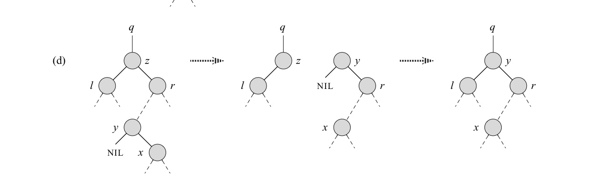
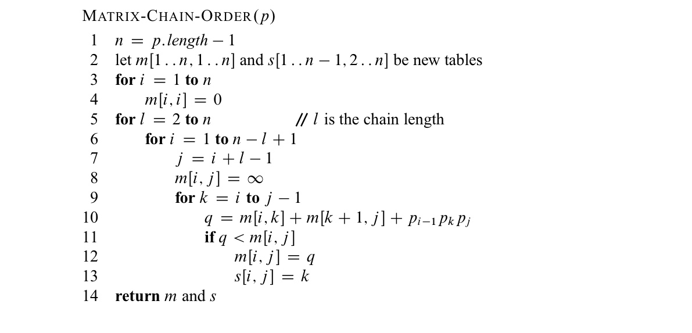
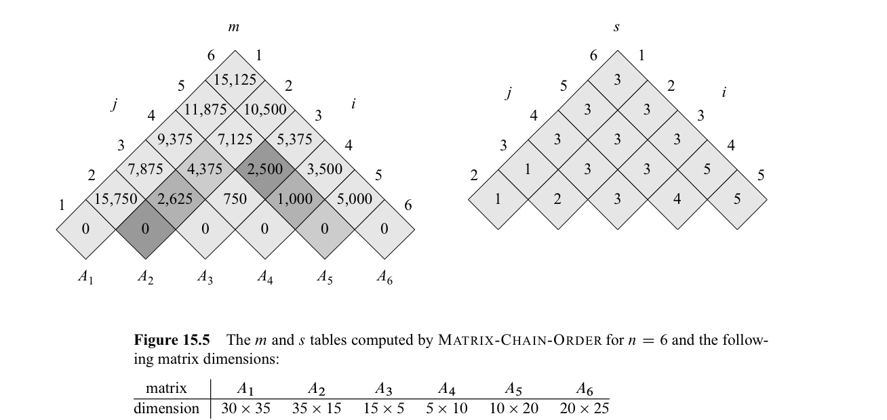

In this post, 19 Algorithm lecture is introuduced. 

CLRS chater 12, 15 ~ 16 범위의 Quiz 의 내용을 다룬다.

# Quiz 2

### Yes / No (5 points each)

1. DP를 이용하여 Mergesort를 해결할 수 있는가? 10단어 이내로 이유를 설명하시오.
1. 문제가 Optimal substructure를 가지려면 (subproblems are independent)이 만족되어야 한다. 빈칸을 채우시오.

### Short answer (10 points each)

**3 ~ 5**

3. BST에서 노드 $z$를 remove 하기 위해 두 단계를 거친다. 첫 번째 단계에서 z의 (successor)를 구한다. 이 노드의 라벨은 ( $y$ )이다. 다음 단계로, ( parent )가 되게 한다. ($y$ )노드가 $z$ 의 right-child의.
4. (가장 왼쪽 그림 기준) $x$가 $y$의 successor 인가? 
5. (가장 왼쪽 그림 기준)  $y$가 $x$의 predecessor 인가? 

**6 ~ 9**

6. 위 코드에서 $m[ , ]$은 (   )을 의미하고, $s[ , ]$은 ( )을 의미한다. 

7. 주어진 코드의 변수 이름을 이용하여 DP의 recurrence relation을 구하시오.

8. General case ($A_1 \cdot A_2 \cdot A_3 ... A_n$) 의 optimal solution을 표현하시오.

9. $A_1 \cdot A_2 \cdot A_3 ... A_5$ 의 optimal structure를 구하고, optimal solution의 value를 구하시오.
10. Activity-selection problem에서 $S_{ij}$를 set of activities that start after activity $a_i$ finishes and that finish before activity $a_j$ starts 라고 하자. $c[i, j]$를 size of an optimal solution for the set $S_{ij}$ 라고 할 때, recurrence relation을 구하고, optimal solution을 표현하시오.
11. Fibonacci 수열로 freq를 가지는 code A:1, B:1, C:2, D:3, E:5, F:8, G:13, H:21 에 대하여 Huffman code를 만드시오.
    
    
