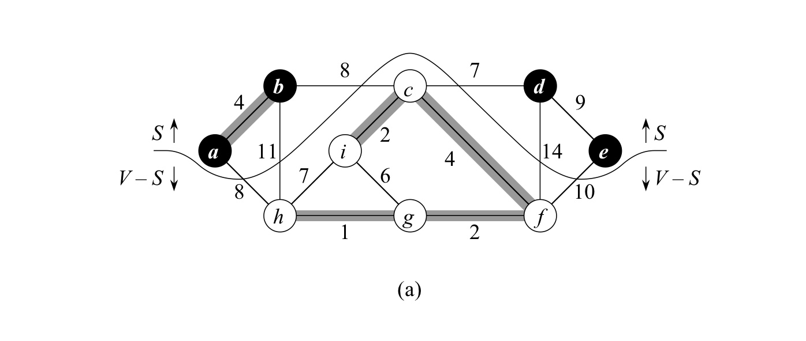

In this post, 21 Algorithm lecture is introuduced. 


CLRS chater 23의 내용을 다룬다.


# 23 MST

**Minimum-spanning-tree** problem은 connected undirected graph G가 주어질 때, edge들의 weigh sum이 최소가 되도록 모든 vertices를 잇는 **acyclic** subset $T \subseteq E$ 를 찾는 문제이다.

## 23.1 Growing a MST

Connected, undirected graph G에 대하여 MST를 구하는 pseudocode는 다음과 같다.

```pseudocode
GENERIC-MST(G, w)
A = Empty
while A does not form a spanning tree
	find an edge (u, v) that is safe for A
	A = A U {(u, v)}
return A
```

위 while 문에서의 loop-invariant은 '매 iteration 직전에 $A$는 어떤 MST의 subset' 인 것이다. 위 알고리즘 line3의 safe의 의미는 이러한 invariant를 깨지 않는 edge를 의미한다.

- **Initialization** : 1번째 줄 이후에 자명.
- **Maintenance** : safe edge만을 A에 추가하므로 자명.
- **Termination** : A는 MST가 됨.

다음 몇 가지 용어를 정의하자. 

- **cut** $(S, V-S)$ 란, undirected graph G를 아래 그림 처럼 $S$ 노드 집합과 $V-S$ 노드 집합으로 나누는 것이다.
- $(u, v) \in E$ 가 **cut** $(S, V-S)$ 를 **cross** 한다는 것은 둘 중 하나는 $S$,  하나는 $S-V$에 속함을 의미한다.
- $A$의 어떤 edge도 cut을 cross하지 않을 때, 해당 cut **respectes a set A of edges** 라고 한다.
- **light edge crossin a cut** 는 crossing a cut 하는 edge 중 weight가 minimum 인 edge이며 여러개가 될 수 있다. 



**Theorem 23.1**

conneceted, undirected graph $G$ 에 대해서, $A$를 어떤 MST에 속하는 $E$의 부분집합이라 하자. (즉, 위 GENERIC-MST에서의 $A$)

$(S, V-S)$를 respect A 하는 임의의 cut이라고 하자. 그리고 $(u, v)$를 $(S, V-S)$를 cross 하는 light edge라고 하자. 

그러면 edge $(u, v)$는 A에 대해 safe (추가해도 여전이 어떤 MST에 속함)하다.


위 GENEREIC-MST 프로시저의 임의의 시점에 그래프 $G_A = (V, A)$는 forest이며, 각각의 connected components 는 tree이다. 초기에 $A= \emptyset$ 일 때는 $V$개의 tree가 $G_A$에 존재하고, 매 iteration 마다 1씩 감소하여, $\vert v\rvert-1$번의 iteration 후에는 1개의 tree (MST)만이 남게 된다. 

**Corollary 23.2**

conneceted, undirected graph $G$ 에 대해서, $A$를 어떤 MST에 속하는 $E$의 부분집합이라 하자. (즉, 위 GENERIC-MST에서의 $A$)

$C = (V_C, E_C)$를 forest $G_A=(V, A)$ 에서의 connected component라고 할 때, $(u, v)$ 가 $C$를 $G_A$의 다른 component로 연결하는 light edge 일 때, $(u, v)$는 $A$에 대해 safe 하다.

## 23.2 The algorithm of Kruskal and Prim

### Kruskal's algorithm 

크루스칼 알고리즘에서는 forest $G_A=(V, A)$ 에 존재하는 임의의 두 tree (각각은 connected component)를 잇는 edge 중에서 least weight인 edge를 $A$에 추가한다. 이 때 두 tree를 $C_1$, $C_2$, edge를 $(u, v)$ 라고 하면, $C_1$ 에 대해서, $(u, v)$ 가 $C_1$를 $G_A$의 다른 component ($C_2$)로 연결하는 light edge 가 되므로, **Corollary 23.2**에 의해 $(u, v)$는 $A$에 대해 safe 하다.

disjoint-set 자료구조를 이용하여 $G_A=(V, A)$ 에 존재하는 disjoint 한 tree들을 나타낸다. 각각의 set은 각각의 tree에 대해 대표 vertex 하나를 저장한다. 

```pseudocode
MST-KRUSKAL(G, w)
A = EMPTY
for each vertex v in G.V
	MAKE-SET(v)
sort the edges of G.E into nondecreasing order by weight w
for each edge (u, v) in G.E, taken in nondecreasing order by weight
	if FIND-SET(u) != FIND-SET(v)
		A = A U {(u, v)}
		UNION(u, v)
return A
```

알고리즘의 수행시간은 $O(ElgE) = O(ElgV)$ $(\because \vert E\rvert < \vert V\rvert^2)$ 이다. (교재 633pg 참고)

### Prim's algorithm

프림 알고리즘에서는 forest $G_A = (V, A)$ 에 존재하는 tree $A$ ($A$에 속한 edge들로 구성되는 트리)를 임의의 isolated vertex로 잇는 edge 중에서 least weight인 edge (light edge)를 $A$에 추가한다.  **Corollary 23.2**에 의해 해당 edge는 $A$에 대해 safe 하다. 초기에 tree $A$에 대응되는 루트 노드는 임의로 정한다.

크루스칼 알고리즘에서 $A$는 forest로 유지되었다면, 프림 알고리즘에서는 single tree로 유지된다.

이 때, light edge를 빠르게 구하기 위하여, tree $A$ 에 속하지 않는 vertices들은 min-priority queue $Q$에 $key$ attribute을 기준으로 저장된다. $v.key$는 tree $A$와 $v$를 연결하는 edge 중 minimum weight을 가지고 있고, 없다면 $\infty$ 가 저장된다.

알고리즘에 명시적으로 등장하지는 않지만 결국 프림 알고리즘은 MST의 root를 $r$로 했을 때, $A=\set {(v, v.\pi) : v \in V-\set{r}-Q}$ 로 키워나가는 셈이 된다. 알고리즘이 종료되는 시점에 $Q=\emptyset$ 이므로, $A=\set {(v, v.\pi) : v \in V-\set{r}}$  이 된다.

```pseudocode
MST-PRIM(G, w, r)
for each u in G.V
	u.key = INFINITE
	u.pi = NIL
r.key = 0
Q = G.V
while Q != Empty
	u = EXTRACT-MIN(Q)
	for each v in G.Adj[u]
	 if v in Q and w(u, v) < v.key
	 	v.pi = u
	 	v.key = w(u, v)
```

다음 3가지 loop-invariant가 존재한다. 

1. $A=\set {(v, v.\pi) : v \in V-\set{r}-Q}$
2. MST된 vertices들은 $V-Q$에 속함
3. $\forall v \in Q$ if $v.\pi \neq NIL$, then $v.key < \infty$ and $v.key$ 는 $v$를 MST에 연결하는 light edge인 $(v, v.\pi)$ 의 weight을 가지고 있다.

알고리즘의 수행시간은 $O(ElgV)$ 이다. (교재 636pg 참고)  

# 24 Single-Source Shortest Paths

다음 강의 참고.

