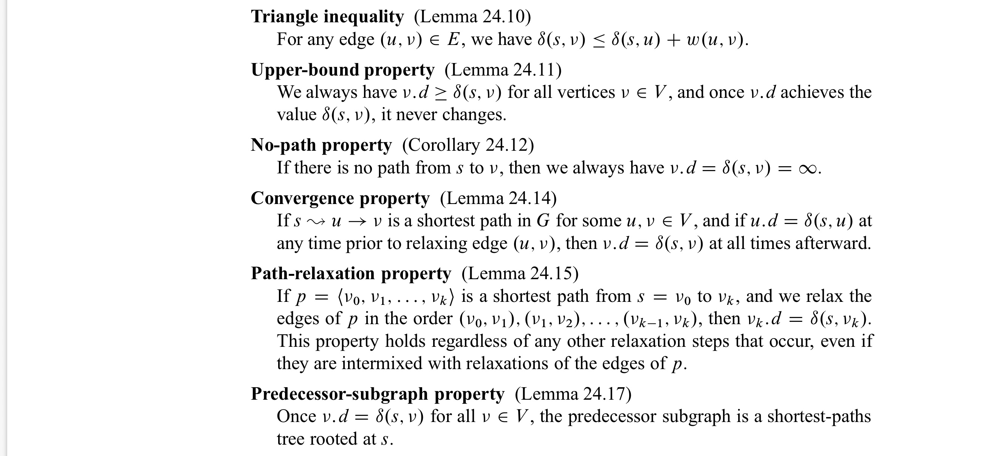
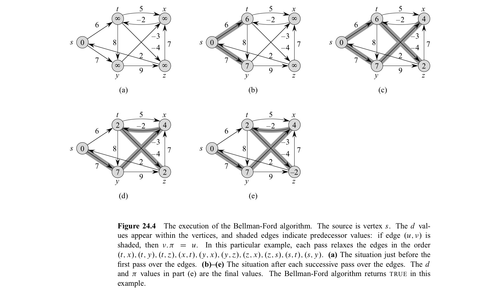
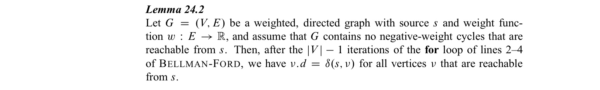
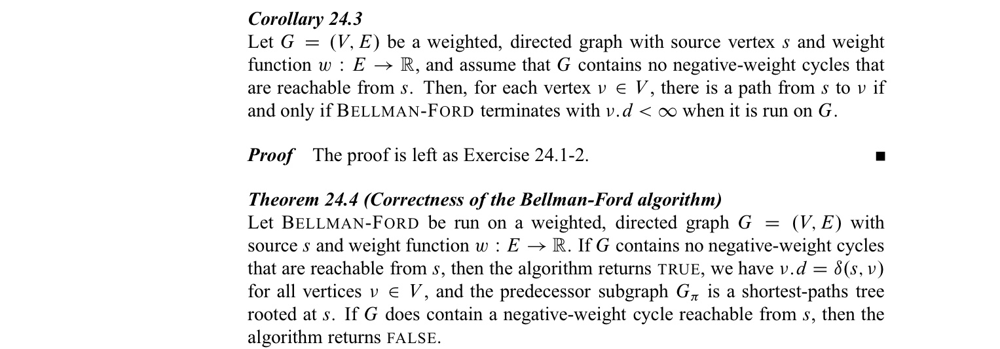
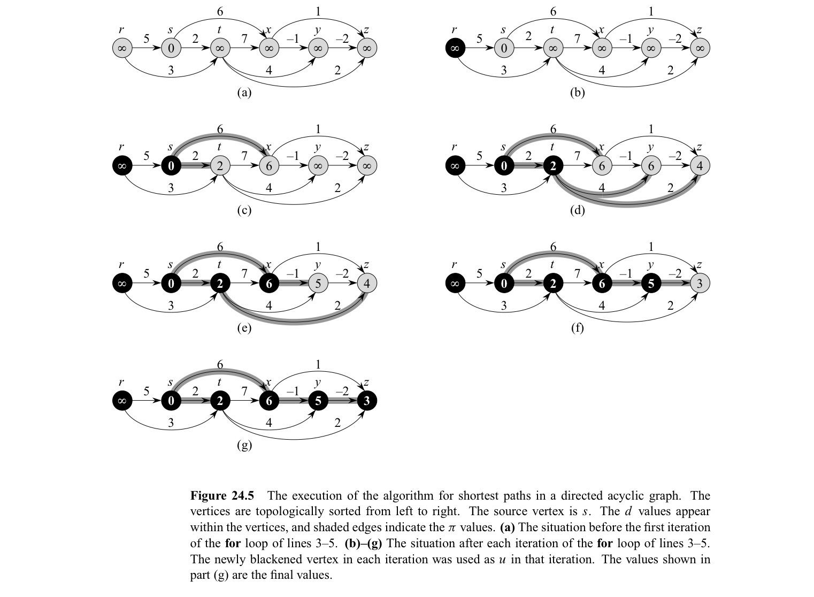
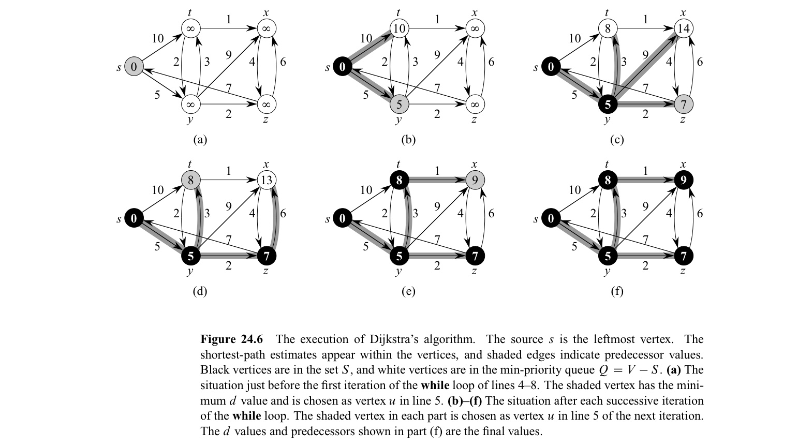
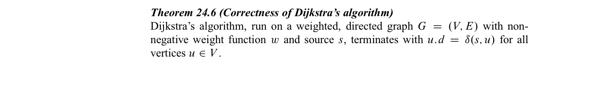
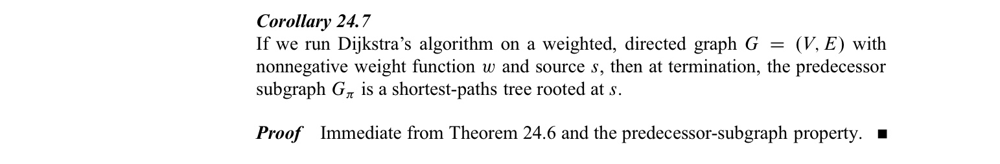
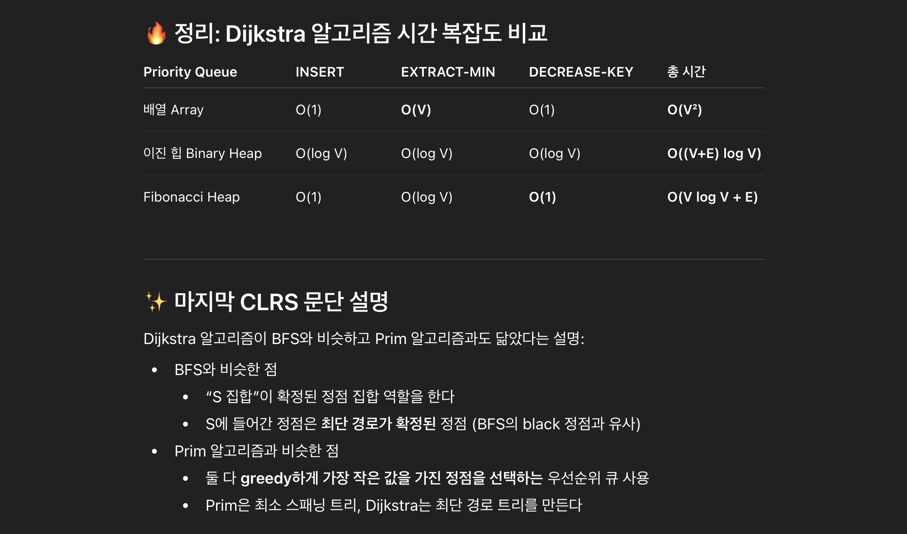
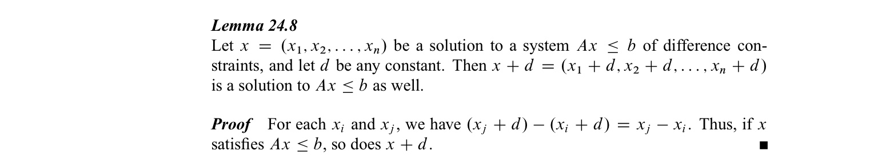

In this post, 22 Algorithm lecture is introuduced. 


CLRS chater 24의 내용을 다룬다.


# 24 Single-Source Shortest Paths

**Shortest-paths problem** 에서는 **weighted, directed** graph가 주어졌을 때, 두 vertex $u, v$  에 대하여, **shortest-path weight** $\delta(u, v)$ 를 가지게 하는 shortest path를 찾는다. 이 때, shortest-path weight는 다음과 같이 정의된다. 

- $\delta(u, v) = min \set{w(p):u \rightarrow v}$ if there is a path from $u$ to $v$
- $\delta(u, v) = \infty$ otherwise 

22장에서 배운 BFS는 unseighted graph에서 shortest path를 구할 수 있는 알고리즘임을 앞서 보았다. 

Dijkstra, Flolyd-Warshall 알고리즘과 같은 shortest path 문제를 해결하는 알고리즘은 각각 greedy, dp 알고리즘을 이용하는데, 이 때, shortest path 문제가 optimal substructure 를 가짐을 다음 lemma가 보장한다.

**Lemma 24.1 (Subpaths of shortest paths are shortest paths)**

Weighted, directed graph $G$ 에 대하여, $p = <v_0, v_1, ... , v_k>$ 가 $v_0$에서 $v_k$로 향하는 shortest path 일 때, $0 \leq i \leq j \leq k$ 를 만족하는 $i, j$에 대하여 $p_{ij} = <v_i, v_{i+1}, ..., v_j>$ 는 $v_i$에서 $v_j$로 향하는 shortest path 이다.


24장에서 다루는 shortest-paths 문제는 single-source shortest pahts 문제로, 주어진 **source** vertex $s$ 로부터 모든 나머지 vertex들로의 shortest paths를 구하는 문제이다. 이 문제는 shortest-path weight가 올바르게 정의되기 위하여 다음의 조건을 가진다. 

- $s$에서 reachable한 negative-weight cycle이 존재하지 않는다. 
- 위 조건이 만족되는 조건 하에, negative-weight edge 가 존재해도 상관없다.

이렇게 주어진 문제에서 shortest-path를 구하고 나면 shortest-path에는 cycle이 포함되지 않는다. 그 이유는 다음과 같다.

- 문제의 조건에 의해 negative-weight cycle은 그래프에 포함되지 않으므로 shortest-path에도 포함되지 않는다.
- positive-weight cycle이 shortest-path에 포함된다면 해당 cycle을 제거하여 weight sum이 더 적은 shortest-path를 얻을 수 있으므로 positive-weight cycle이 shortest-path에 포함될 수 없다.
- 0-weight cycle이 shortest-path에 포함된다면 해당 cycle을 제거하여 weight sum이 동일한 shortest-path를 얻을 수 있으므로 일반성을 잃지 않고 cycle이 없다고 생각해도 된다.


BFS에서와 마찬가지로 **predecessor subgraph** 를 다음과 같이 정의한다. BFS에서는 $v.\pi$ 에 $v$의 predecessor를 저장한다. BFS를 진행하는 과정에서 vertex $u$의 adjacency list를 scanning 하다 white vertex $v$를 찾게 되면, edge $(u, v)$는 breath-first tree에 추가되게 되고, 이 때, $u$를 $v$의 **predecessor** 또는 **parent** 라고 한다. 반면, shortest-path 알고리즘에서도 $v.\pi$에 $v$의 predecessor를 저장하는데 이때 predecessor의 정의가 다르다. $v$로 부터 시작하여, predecessor의 chain을 따라가게 되면, $s$에서 $v$로의 shortest path의 역순으로 노드들을 따라가게 되도록 predecessor가 저장된다.

- $G_\pi = (V_\pi, E_\pi)$ 
- $V_\pi =\set{v \in V : v.\pi \neq NIL} \cup \set{s}$ 즉, root $s$와 $s$에서 reachable 한 vertex 집합
- $E_\pi = \set{(v.\pi, v) : v \in V_\pi - \set {s}}$  즉, shortest-path 알고리즘에서 구성된 path

 여기서 $G_\pi$ 는 **shortest-paths tree** 라고 하며, $s$를 root로 하여 reachable한 모든 vertex에 대한 shortest path로 이루어진 tree이다. 즉, shortest-paths tree는 $G^{'} = (V^{'}, E^{'})$을 만족하는 $s$를 root로 하는 subgraph로써, ($V^{'} \subseteq V, E^{'} \subseteq E$) 다음을 만족한다.

1. $V^{'}$는 $s$에서 reachable 한 vertex들의 집합
2. $G^{'}$은 $s$를 root로 하는 tree
3. $v \in V^{'}$  에 대하여, $G^{'}$에 있는 $s$에서 $v$로의 unique, simple path는 $G$의 $s$에서 $v$로의 shortest path.

Shortest-paths 알고리즘에서는 각 vertex별로 $v.d$ 라는 attribute을 유지하여, $s$에서 $v$로의 shortest path weight의 upper bound를 저장한다. 이를 **shortest-path estimate** 이라 한다. 우선, 다음과 같이 초기화한다.

```pseudocode
INITIALIZE-SINGLE-SOURCE(G, s)
for each vertex v in G.V
	v.d = INFINITE
	v.pi = NIL
s.d = 0
```

이후, 알고리즘이 진행되는 과정에서 $v.d$와 $v.\pi$를 업데이트 하는 과정을 **relaxation**이라 한다. 구체적으로, edge $(u, v)$를 **relaxing** 한다는 것은 아래의 알고리즘을 수행하는 것이다. $w$는 모든 edge들의 weight를 저장하는 함수이다.

```pseudocode
RELAX(u, v, w)
if v.d > u.d + w(u, v)
	v.d = u.d + w(u, v)
	v.pi = u
```

shortest-pahts 알고리즘에서 predecessor와, shortest-path estimate은 오직 RELAX에서만 바뀌며, 여러 알고리즘들은 edge들을 relax하는 순서와 횟수에 차이가 있다.

- Dijkstra, directed acyclic graph에 대한 shortest-paths 알고리즘 : 각 edge를 1번 relax
- Bellman-Ford : 각 edge를 $\vert V\rvert-1$ 번 relax

앞으로 다룰 shortest-paths 알고리즘의 correctness들을 증명하기 위한 lemma에는 다음이 있다.



## 24.1 The Bellman-Ford algorithm

Bellman-Ford 알고리즘은 single-source shortest-paths 문제를 해결하는데, weights이 negative인 graph에 대해서도 동작한다. 이 알고리즘은 source에서 reachable한 negative-weight cycle이 있으면 False를 반환한다. 

```pseudocode
BELLMAN-FORD(G, w, s)
INITIALIZE-SINGLE-SOURCE(G, s)
for i = 1 to |G.V| - 1
	for each edge (u, v) in G.E
		RELAX(u, v, w)
for each edge (u, v) in G.E
	if v.d > u.d + w(u, v)
		return FALSE
return TRUE
```

알고리즘의 시간복잡도는 $O(VE)$ 이다. (교재 651pg 참고)



**correctness**





## 24.2 Single-source shortest paths in directed acyclic graphs

DAG (directed acyclic graph)에서는 topological sorting을 이용하여 각 vetex를 나열하고, 해당 순서대로 vertex를 뽑아, RELAX를 수행한다.

```pseudocode
DAG-SHORTEST-PATHS(G, w, s)
topologically sort the vertices of G
INITIALIZE-SINGLE-SOURCE(G, s)
for each vertex u, taken in topologically sorted order
	for each vertex v in G.Adj[u]
		RELAX(u, v, w)
```

시간복잡도는 $\theta(V+E)$ 이다. (교재 655pg 참고)



**correctness**


**application**

**critiacal path** 란 dag에서 longest path를 의미한다. 일반적으로 longest path 문제는 NP-hard이지만, DAG에서는 acyclic 하므로 모든 edge들의 가중치를 (-1)배 한다음, shortest paths를 구하면 된다. 또는, INITIALIZE-SINGLE-SOURCE에서, $\infty$을 $-\infty$ 으로 바꾸고 RELAX에서 $>$을 $<$로 바꾸면 된다.

## 24.3 Dijkstra's algorithm

Dijkstra 알고리즘은 graph은 모든 edge weight이 nonnegative일 때 적용할 수 있는 알고리즘으로 Bellman-Ford 알고리즘보다 수행시간이 빠르다는 장점이 있다. 

Dijkstra 알고리즘에서는 source $s$ 로부터 final shortest-path weights이 정해진 vertex들의 집합 $S$를 관리한다. $V-S$에서 vertex들을 $v.d$ 값이 작은 것부터 차례로 뽑아 $S$에 포함시키고, RELAX를 하는 과정을 반복한다. 

```pseudocode
DIJKSTRA(G, w, s)
INITIALIZE-SINGLE-SOURCE(G, s)
S = Empty
Q = G.V
while Q != Empty
	u = EXTRACT-MIN(Q)
	S = S U {u}
	for each vertex v in G.Adj[u]
		RELAX(u, v, w)
```

매번 $V-S$의 vertex 중, $v.d$ 의 값이 가장 작은 vertex를 선택하므로 greedy 알고리즘임을 알 수 있다.



**correctness**







## 24.4 Differene Constraints and shortest paths

**Linear programming**

**Linear programming** problem은 $m \times n$ matrix $A$, $m \times 1$ vector $b$, $n \times 1$ vector $c$가 주어졌을 때, objective function $\sum_{i=1}^{n}c_ix_i$ 를 maximize 하면서, constraint $Ax \leq b$ ($m$개의 일차부등식) 을 만족시키는 $n \times 1$ vector $x$를 찾는 문제이다. 

때로는 objective function을 생각하지 않고,  constraint $Ax \leq b$ 를 만족시키는 $x$가 있는지, 있다면 solution을 무엇인지 찾기도 하며 이를 **feasibility problem** 이라 한다.


**System of difference constraints**

System of differecne constraints 는 linear programming 에서 $A$의 각행이 하나의 1, 하나의 -1 나머지는 0 으로 구성된 상황을 의미한다.




**Constraint graph**

System of differecne constraints 에서 $Ax \leq b$ 를 다음과 같이 $n+1$개의 vertex와 $n+m$개의 edge로 이루어진 graph로 나타낼 수 있으며 이를 **constraint graph** 라 한다.

- $V = \set{v_0, v_1, ..., v_n}$
- $E  = \set{(v_i, v_j) : x_j-x_i \leq b_k \ is \  a \ constraint } \cup \set{(v_0, v_1), (v_0, v_2), ..., (v_0, v_n)}$
- $w(v_i, v_j) =b_k$, $w(v_0, v) = 0$

**Theorem 24.9**

System of difference constraints $Ax \leq b$ 가 주어졌을 때  constraint graph $G$ 가 negative-weight cycle을 포함하지 않는다면, $x=(\delta(v_0, v_1), \delta(v_0, v_2), ..., \delta(v_0, v_n))$ 은 feasible solution이고, negative-weight cycle을 포함한다면, feasible solution은 존재하지 않는다.

❗️증명과정에서 traingle inequailty 이용


위 정리를 이용하면, Bellman-Ford 알고리즘을 이용하여 문제를 해결할 수 잇음을 알 수 있다. 시간 복잡도는 $O((n+1)(n+m))=O(n^2+nm)$ 이다. 또한, lemma 24.8을 이용하면 구한 solution에서 모든 값에 +$d$를 더한 값도 solution이 됨을 알 수 있다.
