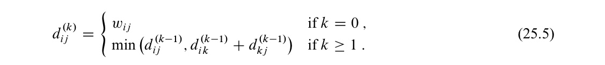
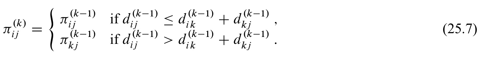
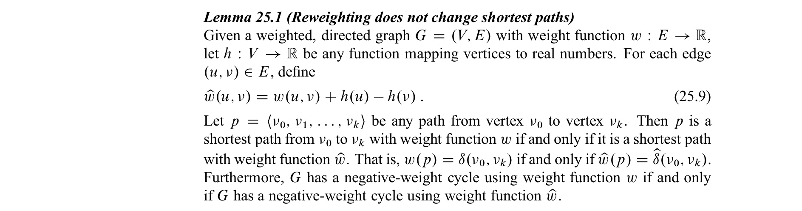
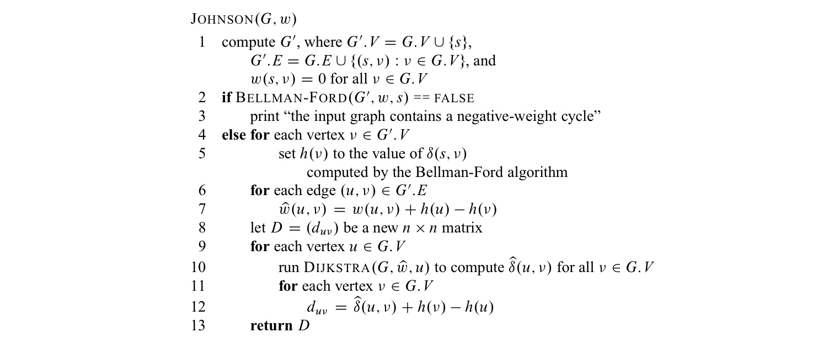

In this post, 23 Algorithm lecture is introuduced. 


CLRS chater 25의 내용을 다룬다.


# 25 All-Pairs Shortest Paths 

All-Pairs Shortest Paths problem은 24장에서 다룬 single-source shortest paths 문제를 모든 vertex를 source로 하여 구하는 것이다. Johnson's 알고리즘을 제외하고는 adjacencly-matrix representation 을 사용한다. 이 때, $n \times n$ matrix $W$ 를 사용하여 edge들의 weight를 아래처럼 나타낸다. 

- $w_{ij} =0$ $(i=j)$
- $w_{ij} =$ the weight of directed edge $(i, j)$  $(i \not= j, (i, j) \in E)$
- $w_{ij} =\infin$ $(i \not= j, (i, j) \notin E)$

negative-weight edge는 허용하지만, negative-weight cycle은 허용하지 않는다. 

또한, $n \times n$ **predecessor matrix** $\Pi = (\pi_{ij})$ 를 사용하여 아래처럼 나타낸다. 

- $\pi_{ij}=NIL$  if there is no path from $i$ to $j$ or $i=j$
- $\pi_{ij}=$  the predecessor of $j$ on some shortest path from $i$

각 vertex에 대하여 **predecessor subgraph** 를 아래와 같이 정의한다. 

- $G_{\pi, i} = (V_{\pi, i}, E_{\pi, i})$ 
- $V_{\pi, i} =\set{j \in V : \pi_{ij} \neq NIL} \cup \set{i}$ 즉, root $i$와 $i$에서 reachable 한 vertex 집합
- $E_{\pi, i} = \set{(\pi_{ij}, j) : j \in V_{\pi, i} - \set {i}}$  즉, shortest-path 알고리즘에서 구성된 path

아래 프로시저는 $i$에서 $j$ 로의 shortest path를 print한다.

```pseudocode
PRINT-ALL-PAIRS-SHORTEST-PATH(Pi, i, j)
if i == j
	print i
elseif pi_ij == NIL
	print "no path from i to j exists"
else
	PRINT-ALL-PAIRS-SHORTEST-PATH(Pi, i, pi_{ij})
	print j
```

## 25.1 Shortest paths and matrix multiplication

**The strucute of an optimal solution**

$i$에서 $j$ 로 가는 shortest path $p$를 생각하자. $p$ 가 최대 $m$ 개의 edge로 이루어져 있다고 가정하자. $i$, $j$ 가 다르다면 $p$를  $i$에서 $k$ 로 가는 최대 $m-1$개 의 edge로 이루어진 path $p^{'}$ 과, edge $(k, j)$ 로 분해할 수 있다. Lemma 24.1에 의해, $p^{'}$ 은 $i$ 에서 $k$로 가는 shortest path 이며 따라서, $\delta(i, j) = \delta(i, k) + w_{kj}$ 가 성립한다.

**Recurrence relation**

$l_{ij}^{(m)}$ 를 $i$에서 $j$ 로 가는 최대 $m$ 개의 edge로 이루어진 path 중, minimum weight 을 나타낸다고 하자. $m=0$ 일 때는 다음이 성립한다.

- $l_{ij}^{(0)} = 0$  $(i=j)$
- $l_{ij}^{(0)} = \infin$ $(i \not= j)$ 

그리고 다음의 recurrence relation이 성립한다.


실제 shortest path는 $\delta(i, j) = l_{ij}^{(n-1)} = l_{ij}^{(n)} = l_{ij}^{(n+1)} = ...$  이다.

**Computing the shortest-path weights bottom up**

다음 코드는 $n \times n$ 행렬 $L^{(m-1)} =  (l_{ij}^{(m-1)})$  이 주어졌을 때 $L^{(m)}$ 을 계산하여 리턴하는 코드이다.

```pseudocode
EXTENDED-SHORTEST-PATHS(L, W)
n = L.rows
let L` = (l`_ij) be a new n*n matrix
for i = 1 to n
	for j =1 to n
		l`_ij = INFINITE
		for k = 1 to n
			l`_ij = min(l`_ij, l`_ij + w_kj)
return L`
```

위 코드를 $m=1$ 일 때부터 $m=n$ 까지 반복하면, shortest-path weights를 얻을 수 있다.

```pseudocode
SLOW-ALL-PAIRS-SHORTEST-PATHS(W)
n = W.rows
L^(1) = W
for m = 2 to n - 1
	let L^(m) be a new n*n matrix
	L^(m) = EXTEND-SHORTEST-PATHS(L^(m-1), W)
return L^(n-1)
```

EXTENDED-SHORTEST-PATHS를 잘 보면, 행렬 곱과 유사하다는 것을 알 수 있다. (교재 688-689 pg) 따라서, 행렬 곱에서 이용하는 repeated squaring을 이용하면 시간복잡도를 $\theta(V^4)$ 에서 $\theta(V^3lgV)$ 로 줄일 수 있다.

```pseudocode
FASTER-ALL-PAIRS-SHORTEST-PATHS(W)
n = W.rows
L^(1) = W
m = 1
while m < n - 1
	let L^(2m) be a new n*n matrix
	L^(2m) = EXTEND-SHORTEST-PATHS(L^(m), L^(m))
	m= 2m
return L(m)
```

## 25.2 The Floyd-Warshall algorithm

Simple path $p = <v_1, v_2, ..., v_l>$ 에 대해, **intermediate vertex** 를 $v_1, v_l$을 제외한 $\set{v_2, ..., v_{l-1}}$ 로 정의한다. 

**The structure of an optimal solution**

$V=\set{1, 2, ..., n}$ 에 대하여, subset $\set{1, 2, ..., k}$ 가 주어질 때, 임의의 $i, j$ pair에 대해 intermediate vertices들이 $\set{1, 2, ..., k}$ 안에서만 존재하는 $i$에서 $j$로의 paths 중 $p$를 minimum-weight path 라고 하자.

- $k$ 가 path $p$의 intermediate vertex에 포함되지 않는 경우, $i$에서 $j$ 로의 inermediate vertices들이 $\set{1, 2, ..., k-1}$ 뿐인 shortest-path 는 $\set{1, 2, ..., k}$ 뿐인 path 중, shortest path와 동일하다.
- $k$ 가 path $p$의 intermediate vertex에 포함되는 경우, $p$를 $i$ 에서 $k$ 로의 path $p_1$과 $k$ 에서 $j$ 로의 path $p_2$ 로 분해하면, lemma 24.1에 의해, $p_1$, $p_2$는 각각 intermediate vertex가 $\set{1, 2, ..., k-1}$ 뿐인 path 중 $i \rightarrow k$, $k \rightarrow j$ 로의 shortest path이다. 

**Recurrence relation**

$d_{ij}^{(k)}$ 를 intermediate vertex가 $\set{1, 2, ..., k}$ 뿐인 $i$ 에서 $j$ 로의 path 중, shortest path의 weight 이라고 하자. 그러면 다음 relation이 성립한다. 



$D^{(n)} = (d_{ij}^{(n)})$ 에 우리가 원하는 solution이 들어있게 된다.

**Computing the shortest-path weights bottom up**


시간복잡도는 $\theta(V^3)$ 이다.

**Constructing a shortest path**

$\pi_{ij}^{(k)}$ 를 intermediate vertex가 $\set{1, 2, ..., k}$ 뿐인 $i$ 에서 $j$ 로의 path 에서 $j$의 predecessor 라고 하자. $k=0$ 일 때는 아래와 같이 정의한다.

- $\pi_{ij}^{(0)}=NIL$ $(i=j \ or \ \ w_{ij}=\infin)$
- $\pi_{ij}^{(0)}=i$ $(i \not=j \ and \ \ w_{ij}<\infin)$

일반적으로 $k$에 대해서는 다음의 관계가 성립한다. 



이를 이용하여 $D^{(k)}$ 를 계산하는 과정에서 $\Pi^{(k)}$ 를 계산하면,  $\Pi^{(n)}$ 을 이용하여 shortest path를 얻을 수 있다.

**Application : Transitive closure of a directed graph**

교재 697-698pg


## 25.3 Johnson's algorithm for sparse graph 

Johnson 알고리즘은 $O(V^2lgV + VE)$의 시간복잡도를 가지며 따라서 sparse graph에서 Floyd-Warshall algorithm 보다 좋은 성능을 보인다. 

(Fibonacci heap으로 min-priority queue를 구현한 경우이고, 만약 binary min-heap으로 구현했다면 $O(VElgV)$인데 역시 sparse에서 Floyd-Warshall 보다 빠르다.)

Johsnson 알고리즘에서는 모든 edge weight가 nonnegative 하다면, 각 vertex마다, 한 번씩 Dijkstra를 적용하여 shortest path를 구할 수 있다. 만약 nonnegative weight edge가 있다면 (nonnegative cycle은 없어야 함), 각 edge의 weight를 nonnegative 하게 바꾸어 계산한다. 이렇게 바꾸는 과정을 **reweighting** 이라고 하며 새로운 weights $\hat w$ 는 다음 조건을 만족해야 한다. 

1. $u, v$ 에 대해서 $p$ 가 weight function $w$ 을 이용했을 때의 shortest path일 필요충분조건은 $p$ 가 weight function $\hat w$ 을 이용했을 때의 shortest path 인 것이다.
2. $\hat w(u,v)$ 는 nonnegative

reweighting의 시간복잡도는 $O(VE)$ 이다.

위 두 조건을 만족시키도록 어떻게 reweighting 해야 할까? 우선, 다음 Lemma를 이용하면, 각 vertex 마다 어떤 실수를 대입하여 $\hat w(u,v)=w(u,v)+h(u)-h(v)$ 로 reweighting 하면 조건 1을 만족시킬 수 있음을 알 수 있다.



그렇다면 2번 조건을 만족시키기 위해서 함수 $h$를 어떻게 정해야 할까? 기존 graph $G$ 에 새로운 vertex $s$를 추가시키고, $s$에서 기존 모든 vertex로 향하는 edge $(s, v)$ 를 추가한 그래프 $G^{'}$ 을 생각하자. 또한, $w(s, v) = 0$ 으로 한다. 그러면 $h(v) = \delta(s, v)$ 로 하면, triangle inequality에 의해 조건 2가 만족된다.



