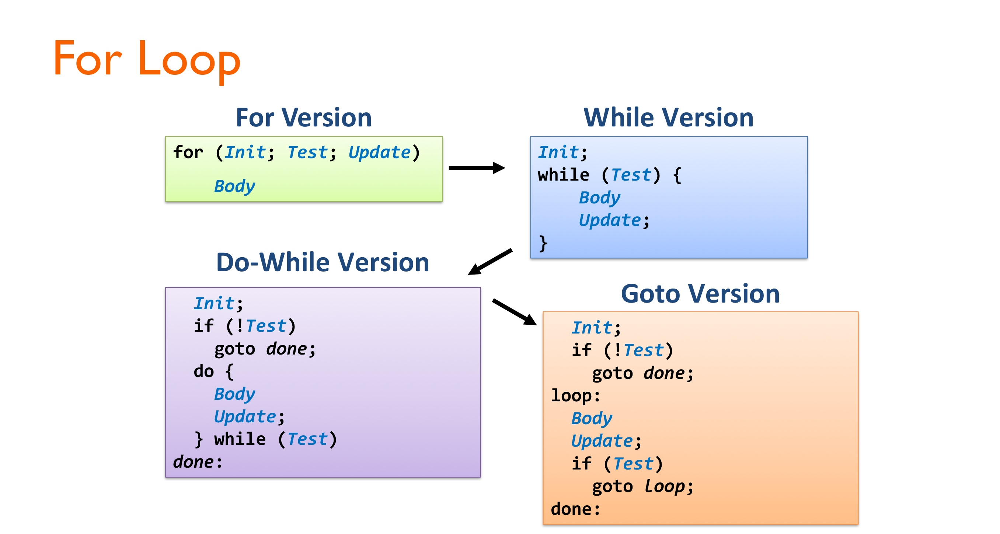

In this post, overral concepts of cache, pipelining and ISA is introuduced. 

# To begin
지난학기 Logic Design, 이번학기 Computer Architecure 강의를 수강하며 추상적이었던 컴퓨터의 동작 방식에 대한 이해가 높아졌다. 총 4편의 글을 통해 두 학기 동안 배운 내용을 정리하고자 한다. 배울 때는 Logic Design에서 가장 밑바닥인 트랜지스터의 구성부터 Computer Architecure 수업에서 ISA, Pipelining, Cache의 순서로 배웠다면 정리를 하는 입장에서는 그 역순으로 가장 큰 그림부터 가장 세부적인 그림까지 보는 방식으로 하여 이해를 높이고자 한다. 01 에서는 Cache-Pipelining-ISA의 순서로 CPU가 어떻게 동작하는지를 알아볼 것이다. 02에서는 BSV라는 언어로 해당 개념들을 어떻게 구현했는지 lab 과제 중심으로 알아볼 것이다. 03에서는 modern cpu의 구조에 알아본다. 04 에서는 Logic Design에서 배운 회로의 개념을 더한다. 

❗이 글에서는 RISC-V 32 bit architecure를 중심으로 글을 전개한다. 32 bit 이라고 할때 무엇이 32인지 헷갈릴 수 있다. 레지스터의 개수인가? 명령어의 길이인가? 메모리 위치 주소를 표현하는데 쓰이는 비트 수인가? 레지스터가 저장하는 비트 수인가? 정답은 마지막이다. 하나의 레지스터가 저장하는 비트수가 32 bit인 것이다.

이 글의 내용을 통해, 컴퓨터가 CPU가 메모리의 명령어를 어떻게 순차적으로 수행하며 그 과정에서 어떤 최적화 기법들을 이용하는지, 컴퓨터 구조에서 하드웨어의 책임과 소프트웨어의 책임은 어디까지인지인지에 대한 이해를 쌓을 수 있다. 

이 글에서 '소프트웨어 사이의 약속' 이라는 말은 '그렇게 동작하도록 컴파일한다' 와 동치이고, '소프트웨어와 하드웨어 사이의 약속' 이라는 말은 '이런 (소프트웨어적인) 동작을 지원하는 하드웨어 부품을 제공한다'와 동치이다. 

# Cache

CPU가 디스크에 접근하는 것은 매우 느리다. Main Memory에 접근하는 것도 디스크에 비하면 매우 빠르지만 여전히 느리다. 따라서, Main Memory 보다 더 작은 영역이지만 훨씬 빨리 접근할 수 있는 메모리 영역을 만들어두었고 이를 Cache 라 한다. 몇 개의 Cache 계층이 있는지는 아키텍처에 따라 다르지만, L1 cache가 가장 빠르고 그 다음 L2 cache, L3 cache 순이다.

- **L1, L2, L3 Cache** : **SRAM** 으로 만들어진다.
- **Main Memory** : **DRAM** 으로 만들어진다. 
- **Disk** : **HDD** 또는 **SSD** 로 만들어진다.

Main Memory 에서 데이터를 어떤 규칙으로 Cache 로 가져올지에 관해 insight를 주는 다음 두 가지 프로그램의 메모리 접근 성질이 있다. 프로그램은 메모리에 접근할 때 무작위로 접근하지 않고, 일정한 **규칙성**을 보인다. 이걸 **지역성의 원리**라고 한다.

- **Temporal locality** : 한 번 접근한 데이터는 **가까운 시점에 또 접근될 가능성이 높다**.

  - Ex. 반복문에서 같은 변수(i, sum 등) 를 계속 참조하는 예시.

  - **캐시 설계 insight**: 최근에 접근한 데이터를 캐시에 두면 성능이 좋아진다.

- **Spatial locality** : 한 주소에 접근하면, 그 **근처 주소들도 접근할 가능성이 높다**.

  - Ex. 배열 순차 탐색 (`for i=0..N: arr[i]`).

  - **캐시 설계 insight**: 캐시는 한 단어(word)만이 아니라 **데이터 블록(block)**을 한꺼번에 가져온다.

1 Block의 사이즈를 4096 Byte로 정했다고 해보자. 우리는 32-bit의 메모리 address 를 상위 20 / 하위 12 bit 으로 나눠, 하위 12 bit을 Block 안에서의 위치 (**Block Offset**) 이라 할 수 있고, 상위 20 bit을 **Block Address** 라 할 수 있다. 

이제 캐시 설계 과정에서 고려해야 할 것은 Main memory 에서 가져올 Block을 Cache의 어느 위치에 저장할 것인지 매핑에 관한 것이다. 이와 관련하여 **Direct-Mapped**, **Fully-Associative**, **Set-Associative** 의 다른 방식이 있다. 

## Direct-Mapped Cache

**Direct-Mapped Cache**는 **한 메모리 Block이 캐시의 단 하나의 위치로만 매핑되는 캐시 구조**이다. 예를 들어, Main Memory 에서 L3 Cache로 block을 옮기는데 L3 Cache 에는 8개의 Block (L3 기준 Block Index 000~111) 만이 위치할 수 있다. 이 때, Main Memory 의 각 Block은 L3 Cache로 옮겨갈 경우, Block address의 20 bit 중 하위 3 bit를 기준으로 들어갈 위치를 정하게 된다. 따라서 Block Address 20 bit는 다시 17 bit **Tag** + 3 bit **Index** 로 나누어진다. 즉, 32 bit 메모리 주소 = 17 bit Tag + 3 bit Index + 12 bit Offset 으로 이루어지게 된다. 참고로 이 상태에서 L3에서 4개의 Block이 위치할 수 있는 L2로 이동할 때에는 이동 후 18 bit Tag + 2 bit Index가 되는 셈이다. 

❗이렇게 DRAM에서 캐시로 데이터가 전달되는 과정은 CPU와 별도의 하드웨어인 **캐시 컨트롤러 + 메모리 컨트롤러 + (필요 시) DMA 장치**가 데이터 전송을 담당한다. CPU가 IF 나 MEM 단계에서 어떤 주소로의 접근을 요청했는데 해당 주소가 포함된 block이 캐시에 존재하지 않는다면 **Miss** 가 발생하고, 이때 CPU는 "이 주소의 블록 가져와"라는 요청만 내리고, 실제 전송은 비동기적으로 별도의 하드웨어(캐시 컨트롤러) 가 진행한다. 즉, Synchronous Exception 이 발생하는 것이 아니고, 파이프라인에서 해당 명령어는 데이터가 캐시로 도착할 때까지 **stall** 되는 것이다.

이제, CPU가 IF 나 MEM 단계에서 어떤 주소로의 접근을 요청했는데 해당 주소가 포함된 block이 캐시에 존재하는지를 확인하는 과정을 알아보자. L3 캐시가 8개의 block을 저장할 때 L3 캐시에는 (다른 캐시도 마찬가지) 각 block과 더불어, **valid bit** 가 저장된다. 초기에는 (L3 캐시가 비어있을때) 8개의 **valid bit** 이 모두 0이다. 정확히는 하나의 **캐시 라인** 에는 valid bit, Tag bits, 실제 data block 이 저장된다. CPU가 IF 단계에서 메모리 `0b 0000 0001 0010 0011 0100 0101 0110 0111` 에 접근하는 상황을 생각해보자. 그러면 Block address 20 bit 중 하위 3 bit `100` 의 인덱스를 가지는 캐시 라인에 방문하여 우선, valid bit이 1인지 확인한다. 초기에는 항상 0이므로 **miss** 가 발생하게 되고, 캐시 컨트롤러 등의 하드웨어는 DRAM에 가서 해당하는 block 을 읽어와 캐시 라인에 저장하고, valid bit를 1로하고 tag (17 bit)도 설정한다. 그제서야 CPU는 해당 block에 접근할 수 있게되고 여기서 하위 12 bit 을 offset 으로 이용해 특정 주소의 데이터를 얻게 되고, 파이프라인이 다시 진행된다. 이번에는 초기 상황이 아닐 때를 가정해보자. `100` 의 인덱스를 가지는 캐시 라인에 방문했고, valid bit이 1인데, tag를 비교했더니 다르다. 즉, 다른 block이 이미 캐시 라인에 자리한 경우이다. 마찬가지로 **miss** 가 발생하고, 이후의 과정은 동일하다. 즉, valid bit 이 1이고 tag bit이 일치해야 **miss** 가 발생하지 않는다.

아래 그림은 위 과정들을 담고 있다. 메모리 주소 = 64 bits, Block size = $2^{62}$ byte, 캐시 라인 개수 = 10 인 상황이다.


이제 MEM 단계에서 **캐시 hit가 발생한 경우에**, 특정 메모리에 데이터를 write 하는 경우를 생각해보자. 이때, 다음의 두 가지 방법을 생각해볼 수 있으며 각각의 문제가 존재한다.

- 캐시의 block 만 데이터를 업데이트 : DRAM과 캐시 사이에 데이터가 inconsistent 하게 저장되는 문제가 발생.
- DRAM과 캐시 block 데이터를 모두 업데이트 : 이를 **Write-through** 라고 한다. Cache를 사용하는 의미가 없어지는 문제 발생. 

**Write-back** 정책과 **Write buffer** 라는 하드웨어를 이용하여 위 두 문제를 모두 해결한다. 

**Write-back** 방법에서는 캐시에 쓰기 연산이 들어왔을 때, 1번 방법 처럼 DRAM에 반영하지 않고 캐시에만 반영한다. 캐시 라인이 교체 (**evict**) 될 때 그제야 메모리에 반영한다. 이를 위해 캐시 라인에 추가로 **Dirty bit** 를 저장하는데, Dirty bit 가 1이면 캐시가 수정되어 DRAM과 다른 상태이고 따라서 교체 시 메모리에 써야 한다. Dirty bit 가 0 이면 캐시와 DRAM의 데이터가 동일하고 따라서 별도의 작업잆이 eviction 해도 된다. 

**Write buffer** 는 캐시에서 메모리로 쓰기를 할 때 **CPU가 기다리지 않도록 중간에 두는 임시 저장소**이다. Write-back 정책에서는 캐시 라인 교체 시 쓰기를 메모리에 내보내야 하는데, 이때 CPU가 stall 되면 성능이 저하된다. CPU는 write buffer에 데이터만 넣고, 메모리에 쓰는 작업은 **메모리 컨트롤러 + write buffer**가 백그라운드에서 처리하게 된다. 위에서 메모리 컨트롤러는 CPU 와 별도의 하드웨어라고 했는데 write buffer 가 없다고 해서 CPU가 stall 되는 이유가 무엇일까? Write buffer 가 없다고 가정해보자. 캐시가 **dirty line**을 메모리로 내보내야 하는 순간 (eviction 시점), CPU는 캐시에 새로운 블록을 가져와야 하는 load 요청을 동시에 내게 된다. 그런데 캐시와 메모리 계층(버스/DRAM)은 **대역폭이 한정**돼 있어서, “쓰기 작업”이 진행되는 동안 “읽기 작업”을 동시에 처리하기 어렵다. 이 경우 dirty line이 DRAM에 먼저 전송 된 후, 새로운 block이 load 된다. 이 시간을 CPU는 stall 하게 된다. Buffer를 사용하게 되면 캐시는 DRAM에서 캐시로 데이터가 이동되는 시간만 기다리면 된다. 만약 Write buffer 가 full인 상황에서는 불가피하게 stall 이 발생하게 된다. 

Write back과 Write buffer 를 이용하게 되면 하드웨어의 복잡도가 증가할 수 있다. 예를 들어, Write buffer에 있는 data에 load 요청이 오게 되면, Cache에 없더라도 (eviction 되어서) DRAM 이 아닌 buffer에서 읽어오도록 해야한다. 

이제 MEM 단계에서 **캐시 miss가 발생한 경우에**, 특정 메모리에 데이터를 write 하는 경우를 생각해보자. 이때, 마찬가지로, Write-back 방법과 Write-through 방법을 생각해볼 수 있다. 

- **Write-through** : 캐시에도 쓰고, DRAM에도 쓰는 정책. 크게 두 가지 전략이 있다.

  - **Write-allocate (Allocate on miss)** : Miss가 나면 해당 블록을 메모리에서 캐시로 가져온다. 가져온 후 CPU의 write를 캐시에 적용하고, 동시에 메모리에도 쓴다. 

  - **Write around (No-write-allocate)** : Miss가 나면 캐시로는 안 가져오고, 메모리에만 직접 쓴다 (이 경우에도 Write buffer가 사용될 수 있다). 

- **Write-back** : 캐시에만 쓰고, **교체(eviction) 시 메모리에 쓰는 정책**. ❗Write-through와 Write-back의 차이는 DRAM 업데이트를 바로 시도하느냐 아니면 eviction 시에만 시도하느냐의 차이이다. 두 정책 모두 Write buffer 를 이용한다. 

  - **Write-allocate** : Miss가 나면 해당 블록을 메모리에서 캐시로 가져온다. CPU의 write는 **캐시에만 반영**하고 Dirty bit = 1로 설정한다.  교체(evict) 시에만 버퍼 거쳐서 메모리에 기록한다.

  - **Write around** (자주 안쓰임) : Write miss 발생 시, 해당 블록을 캐시에 가져오지 않고, 그냥 메모리에 직접 쓴다. 즉, miss가 난 블록은 캐시 안으로 들어오지 않는다. 

## n-way set associative

**set** 은 n개의 cache line 들이 모여 있는 것으로, 한 메모리 Block이 캐시의 단 하나의 set으로만 매핑되게 된다. 이런 캐시 구조를 **n-way set associative** 라고 한다. set 이 s개이고, n-way 일때, number of cache lines $ = s \times n$ 을 만족한다. 

Direct mapped cache 에서의 예제 처럼, 8개의 캐시 라인에 대해서, 2-way set associative 인 경우를 생각해보자. 즉, 4개의 set이 있는 상황이다. 따라서 Main Memory 의 각 Block은 L3 Cache로 옮겨갈 경우, Block address의 20 bit 중 하위 2 bit를 기준으로 들어갈 set을 정하게 된다. 따라서 Block Address 20 bit는 다시 18 bit **Tag** + 2 bit **Index** 로 나누어진다. 즉, 32 bit 메모리 주소 = 18 bit Tag + 2 bit Index + 12 bit Offset 으로 이루어지게 된다. 

CPU가 IF 나 MEM 단계에서 어떤 주소로의 접근을 요청했는데 해당 주소가 포함된 block이 캐시에 존재하는지를 확인하는 과정을 알아보자. CPU가 IF 단계에서 메모리 `0b 0000 0001 0010 0011 0100 0101 0110 0111` 에 접근하는 상황을 생각해보자. 그러면 Block address 20 bit 중 하위 2 bit `00` 의 인덱스를 가지는 캐시 set에 방문하여 이 set에 포함되어 있는 2개의 cache line의 valid bit=1 여부와 tag 일치 여부를 확인한다. 이 과정은 Direct mapped cache 와 동일하다. 

아래 그림은 위 과정들을 담고 있다. 메모리 주소 = 32 bits, Block size = $2^{30}$ byte, 4-way set associative, number of set = 256 인 상황이다.


## Fully associative

n-way set associative 에서 n이 캐시 라인의 수와 동일하면 (즉, block이 어느 캐시라인에도 갈 수 있는 경우) 이를 **Fully associative** 라 한다. 

참고로 1-way set associative 는 Direct mapped cache 이다. 

## Cache Performance

CPI, AMAT, comparison (chapter 5-2, 5-3, 5-4)
To be continued

## Multi level Cache

To be continued (chapter 5-3)

## Matrix Multiplication Example

To be continued (chapter 5-3)


# Virtual Memory
IF-ID-EX-MEM-WB 5단계로 동작하는 파이프라인 구조를 생각하자. 이때 메모리에 접근이 필요한 단계는 언제인가? 우선 IF 단계에서 다음 명령어의 주소를 fetch하기 위해 메모리에 접근해야 한다. 또, MEM 단계에서 Store나, Load 명령어를 수행할 때 메모리에 접근하게 된다. CPU는 컴파일러가 만들어준 명령어를 차례로 수행하는데 아래 그림은 명령어의 수행 과정 중, 메모리 접근이 필요한 IF 단계와 MEM 단계에서 가상 주소를 물리 주소로 변환하는 과정을 나타낸 그림이다. 예를 들어, **IF 단계에서 CPU는 pc register에 있는 값에 있는 가상 주소의 값을 물리 주소로 변환하여 해당 물리 주소의 위치에서 명령어를 fetch 해오게 된다**. 

❗IF 단계와 MEM 단계에서 CPU는 메모리 접근이 필요할 때 그때마다 가상 주소를 물리주소로 변환한다. MMU는 CPU의 구성 요소로서 가상 메모리 시스템에서 CPU가 사용하는 가상 주소(Virtual Address)를 실제 물리 주소(Physical Address)로 변환해주는 하드웨어 장치이다.

❗**컴파일러나 어셈블러가 만들어내는 `st`, `ld`, `mov` 등의 명령어에 포함된 주소는 "가상 주소"가 아니다.**
좀 더 정확히 말하면, **"가상 주소가 될 수 있는 상대적 정보(오프셋)"를 담고 있을 뿐이다.** **진짜 가상 주소는 OS가 실행 시점에 정해준다.** 어쨌든 cpu가 명령어를 하나씩 읽어오는 시점에서는 가상주소정보를 읽어오는 것이다.

❗**프로그램이 실행될 때 OS가 가상주소 공간을 할당한다. OS는 첫 명령어의 가상 주소 (entry point)를 정한다. CPU는 이 가상주소를 PC에 넣는다. MMU가 이 가상주소를 물리주소로 변환한다. 이후 명령어 fetch가 진행된다.** 

🔵 **명령어 생성(컴파일러)**

가상 메모리란, 프로세스가 OS에게 할당 받은 논리적 주소 공간으로 실제 DRAM 의 크기보다 크다. Cache 에서 데이터를 Block 단위로 묶어 다루었다면 가상 메모리에서는 데이터를 Page 단위로 묶어 다룬다. 

DRAM은 SRAM 보다 10배 느리지만, Disk는 DRAM 보다 10,000배 느리다. **DRAM에 존재하는 데이터는 Virtual Page의 데이터 중 일부가 캐시된 것**으로 생각할 수 있고 이러한 관점에서 DRAM Cache 설계를 살펴보면, 다음의 특징이 있다.

- Large page size : typicall 4KB, or 4MB. DRAM에서 miss가 나게 되면 Disk로 접근해야 하기 때문에 miss rate을 줄이는 것이 중요하다. 따라서, page size를 크게 한다.
- Fully associative : 모든 VP (virtual page) 는 모든 PP (physical page) 로 매핑될 수 있다. 즉, 모든 VP는 임의의 PTE에 들어갈 수 있다. 
- Write-through 대신 Write-back 정책 이용 : ???

**Page Table** 은 DRAM의 커널 메모리 영역에 존재하는 data structure 로, 프로세스마다 별도로 존재하며, VP address (VPN, 바로 뒤이어 설명)를 PP address (PPN) 와 map 해주는 Page Table Entry로 구성되어 있다. 48 bit 로 이루어진 VA (virtual address) 가 주어졌고, 1 Page size = $2^{12}$ byte 라고 하자. VA 를 상위 36 / 하위 12 bit 으로 나눠, 하위 12 bit을 Page 안에서의 위치 (**Page Offset, VPO**) 이라 할 수 있고 상위 36 bit을 **Virtual Page Number (VPN)** 이라 한다. 

CPU가 48 bit의 VA를 MMU에 전달하면, MMU는 상위 36 bit VPN을 인덱스로 활용하여 특정 Page Table Entry 를 조회하여 대응하는 PPN을 얻게 된다. Offset에 따른 실제 데이터 위치는 VA와 PA에서 모두 동일하기 때문에 얻어진 PPN과 VPO를 이용하여 PA를 얻게 된다. Page Table Entry 조회 결과 해당 VP가 DRAM 상에 mapping 되어 있지 않다면(디스크에 매핑되어 있을 것이다) **Page fault** 가 발생한다. Page fault는 Syncronous Exception 중 fault에 해당하므로 CPU가 예외가 발생한 명령어를 포함하여 그 이후의 명령어들을 모두 flush 하고, Exception Handler의 코드가 수행된다. Exception Handler는 VP가 매핑 되어 있는 디스크의 Page를 DRAM에 옮기도록 **system call** 을 호출하고 CPU는 OS 스케쥴링에 의해 다른 프로그램을 수행한다. 디스크에서 DRAM으로 다 옮기면 **interrupt** 가 발생하고 그러면 다시 exception handler가 불려서 기존의 프로그램을 다시 수행하게 된다. 

Page fault가 발생한 경우 단계별 흐름은 다음과 같다.

1. **Page fault 발생**
    CPU가 DRAM에 없는 가상 페이지 접근 → MMU가 page fault 발생 → **exception handler**로 제어 이동.
2. **OS Page fault 핸들러 실행**
   - 페이지 테이블을 확인.
   - 해당 가상 페이지를 디스크(보조기억장치)에서 불러와야 하는 상황임을 파악.
3. **프레임 가용성 확인**
   - DRAM에 **빈 프레임이 있으면** 바로 그곳에 페이지를 로드 요청.
   - **빈 프레임이 없으면** → **Page Replacement Algorithm** (LRU, Clock 등)을 사용해서 **eviction 대상 페이지 선정**.
4. **Eviction 단계**
   - 대상 페이지가 **dirty bit = 1**(수정됨, Page Table Entry에 field로 저장) → 디스크에 **write-back**.
   - clean page면 단순히 메모리에서 버림.
   - 이때 페이지 테이블에서 해당 페이지는 invalid 처리.
   - eviction 단계에서 eviction 되는 VP의 valid bit는 PTE 상에서 0이 되고, 점유된 DRAM의 공간은 비워진다.
5. **새 페이지 로드 요청**
   - 선택된 프레임에 새로운 페이지를 디스크에서 읽어오기 시작.
   - I/O가 걸리므로 CPU는 다른 프로세스로 context switch.
6. **I/O 완료 인터럽트**
   - 디스크 → DRAM 로드 완료 시 인터럽트 발생.
   - 커널(OS exception 핸들러)이 다시 페이지 테이블 업데이트, fault난 프로세스를 ready 상태로 되돌림.
7. **원래 명령 재실행**
   - CPU가 다시 그 프로세스를 스케줄링하면 fault 난 명령어 재시도.
   - 이제는 DRAM에 페이지가 있으므로 정상 실행.

가상 메모리는 Page fault가 일어나기 때문에 (가상 메모리를 사용하지 않고 프로세스 별로 실제 물리 메모리 영역을 나눠 할당한다면 사용 가능한 영역은 줄지만 적어도 page fault로 인한 디스크 I/O는 발생하지 않을 것) 비효율적으로 보일 수 있다. 하지만, 프로그램은 **Temporal locality** 와 **Spatial locality** 의 특성을 가지기 때문에 비슷한 시간대에 특정 작은 부분의 가상 메모리 영역을 집중적으로 접근한다. **Working set** 이란 어떤 시점 (at any point in time)에 프로그램이 실제로 활발히 접근하는 가상 페이지들의 집합을 의미하는데 지역성이 좋은 잘 짜여진 프로그램일수록 작은 working set을 갖게 된다. 특정 시간대에 실행중인 모든 프로세스의 working set을 합친 것을 **Total Working set** 이라 한다. 

- **Case 1: Total working set size < main memory size**
  - 메모리에 모든 active page를 담을 수 있으므로, compulsory miss (처음 가상 페이지에 접근 시 발생하는 page fault) 이후에는 좋은 성능 보장.
  - 참고로 DRAM에는 OS가 여러 프로세스의 page들을 동시에 담아둔다. 
- **Case 2: Σ(working set sizes of all processes) > main memory size**
  - 여러 프로세스의 working set을 모두 수용할 수 없게 됨. 이 경우 **thrashing** (성능 붕괴 현상) 발생.
  - 메모리에 필요한 페이지가 계속 부족해서, CPU가 일보다 **페이지 교체(page swap)** 에 대부분의 시간을 쓰고 실제 유용한 작업은 거의 수행되지 않음.


Page Table은 DRAM (커널 메모리 영역)에 존재한다. CPU가 메모리를 접근할 때 MMU가 page table lookup을 하게 되는데, PTE를 읽어올 때도 DRAM에서 가져오므로, 일반 데이터처럼 cache line 단위로 L1/L2/L3 캐시에 들어올 수 있다. 하지만 VA로 부터 PA를 만들어내는데 L1 cache에 방문하는 것도 우리는 오버헤드가 크다고 생각한다. 때문에 MMU 안에는 **Translation Lookaside Buffer (TLB)** 라는 작은 set-associative hardware cache가 존재한다. 

TLB를 이용하여 가상 주소를 물리주소로 바꾸는 과정을 자세히 알아보자. 


위 그림을 기준으로 설명하면,

1. CPU가 변환해야 할 48 bits의 가상 주소 (예를 들어, IF 단계에서 PC+4) 정보를 제공
   - 상위 36 bits는 VPN 으로 해당 가상 주소가 속한 page number를 나타내고
   - 하위 12 bits는 VPO 으로 해당 page 내에서 가상 주소의 위치를 나타내는 오프셋 역할을 한다.
2. VPN으로 TLB에서 해당하는 VPN 이 있는지 확인한다. **TLB는 MMU에 존재하는 고속 캐시로 PTE가 존재하는 L1 cache 영역보다 빠르게 접근이 가능하다.**
   - VPN의 하위 4 bits로 TLB에서 해당하는 set을 찾고
   - 상위 32 bits tag가 해당하는 set의 4개의 entry 중 하나에 존재하고 Valid = 1인지를 확인한다. 그렇다면 해당 entry에서 PPN을 읽고, 그렇지 않다면 TLB Miss가 발생한 것이다. 
   - 위 그림과 같은 경우를 16 sets, 4-**way associative** 라고 한다. 
   - TLB의 각 entry에서는 다음의 정보를 저장한다.
     - Tag : 32 bits VPN을 의미한다.
     - PPN : VPN에 대응하는 실제 물리 페이지 번호를 의미한다. 
     - Valid : 해당 TLB entry의 정보가 현재 유효한지를 나타낸다. TLB Miss가 발생하면, 페이지 테이블에서 정보를 조회한 후, TLB에 새로운 entry를 저장할 때 Valid를 1로 한다. **(Q : 이 과정이 모두 If 단계에서 일어나는가?)** 따라서, 처음 접근되는 페이지는 TLB Miss가 발생할 수 밖에 없다. 
     - Dirty :  TLB 혹은 페이지 테이블에 있는 VP들은 모두 대응하는 물리 메모리의 공간을 차지하고 있다. 운영체제가 **페이지를 물리 메모리에서 디스크로 쫓아낼(evict) 때**, 해당 페이지가 **수정된 적이 있다면 (dirty = 1)** **디스크에 다시 써줘야 한다. (write-back)** TLB miss가 나면 → 페이지 테이블에서 dirty 값을 확인하고, TLB에 로딩할 때 dirty 값도 함께 가져온다.
     - Ref : LRU를 구현하기 위한 비트. LRU (Least Recently Used)는 가장 오랫동안 사용되지 않은 데이터를 가장 먼저 제거하는 캐시 교체 알고리즘이다. TLB Miss가 발생하면, 페이지 테이블에서 정보를 조회한 후, TLB에 새로운 entry를 저장해야 하는데, 이 때 기존 4개의 entry 중 무엇을 제거할 것인지에 대한 기준이 필요하다. Ref = 1 이라는 것은 특정 인터벌 안에서 해당 페이지가 접근 되었음을 의미한다.
     - ❗TLB는 단순히 **Page Table의 캐시**일 뿐, “진짜 데이터”는 항상 **메모리에 있는 Page Table**에 있다. 따라서 TLB 엔트리를 교체(eviction)한다고 해서 디스크처럼 write-back 작업이 필요하지 않다. 하드웨어는 내부적으로 replacement policy(LRU 근사, Random 등)를 적용해서 **알아서 한 엔트리를 버리고 새로 채운다**.


이제, 위 그림을 다시 가져와 pc register에 있는 가상 주소가 어떻게 물리 주소로 변환되어 파이프라인 IF 단계에서 해당 명령어가 fetch 되는지 End-to-end로 살펴보자. 아래에서 HW는 전기 신호가 해당 하드웨어 장치에 도착했을 때 그런 기능을 하도록 하드웨어가 마련되어 있다는 의미이다. SW는 0과1의 머신코드로서 CPU에서 하나씩 실행되는 명령어이며 이미 존재하는 HW를 활용하여 그런 기능을 하도록 하는 프로그램이라는 의미이다. SW 프로그램은 0과1의 형태로 디스크 메모리에 저장되어 있을 것이다. 우리가 클릭을하고 버튼을 누르면 이를 통해 전달되는 전기신호를 HW가 전달받아 (논리설계에서 배운대로) OS라는 SW 프로그램이 CPU 위에서 실행되도록 HW가 동작할 것이다. OS 프로그램에서 내리는 여러가지 명령 (context switch, 특정 프로그램 실행 등) 은 HW와 SW 사이 약속으로 그런 01의 규약에 따라 HW가 그렇게 움직이도록 약속 되어 있을 것이다. 

1. pc register(**HW**)에 48 bit **VA** 가 저장되어 있음 (`cpu status : process A (IF)`)

2. **MMU(HW, CPU 구성부품)** 가 pc register의 48 bit 중 일부인 **VPN** 값으로 **TLB(HW, MMU에 존재)** 에서 **PPN** 을 찾을 수 있는지 확인. (`cpu status : process A (IF)`)

3. 다음 두 가지 경우 발생 가능.

   - **TLB hit** : **MMU(HW)** 가 **PPN** 과 **VPO** 를 합쳐 **PA** (DRAM 상의 주소) 를 얻음.  (`cpu status : process A (IF)`)

   - **TLB miss** : **MMU(HW**) 가 **PTE(HW, DRAM 커널 메모리 영역 or L1 cache)** 에서 **PPN** 을 찾을 수 있는지 확인. 이 때, 다음의 두 가지 경우 발생 가능.

     - **Page hit** : **MMU(HW)** 가 **PPN** 과 **VPO** 를 합쳐 **PA** (DRAM 상의 주소) 를 얻음. 또한, **MMU(HW)**가 TLB에 새로운 entry를 저장하며 Valid를 1로 함. 이 때 TLB가 꽉 차있어 eviction이 필요하다면 **MMU(HW)** 가 알고리즘(LRU 등) 을 토대로 eviction을 함. (`cpu status : process A (IF)`)

     - **Page fault** : **PTE** 에서 **PPN** 을 찾을 수 없다면 **MMU(HW)** 가 Page falult 발생시킴. → **exception handler(SW, OS 커널 코드의 일부)**로 제어 이동. (`cpu status : os page fault handler`) → **exception handler(SW)** 가 DRAM에 새로운 **VP** 를 배치할 공간이 있는지 확인. 이 때, 다음의 두 가지 경우 발생 가능.

       - DRAM에 빈 프레임 존재 : 

         1.  **exception handler(SW)** 가 **Disk Driver(SW, OS 커널 코드의 일부)** 에 해당 VP를 디스크에서 읽어오도록 요청.  (`cpu status : os disk driver`) 

         2.  **Disk Driver(SW)** 는 이 요청을 **Disk Controller(HW)** 가 이해할 수 있는 저수준 명령어로 변환. 

         3. 이제 CPU는 OS 스케쥴링에 의해 다른 프로세스 실행  (`cpu status : process B`). 

         3.  **Disk Controller(HW)** 는 읽어온 데이터(VP)를 CPU가 아닌 **DMA 엔진(HW)**을 통해 직접 DRAM에 써넣음. 데이터 전송이 끝나면**Disk Controller(HW)**는 CPU에게 **Interrupt**를 발생시킴. 

         4. CPU는 다시 OS 커널의 **I/O Completion Handler(SW, OS 커널 코드의 일부)**로 점프하여 **PTE** 를 갱신하고 (`cpu status : os I/O Completion Handler`). fault 난 process A를 ready 상태로 돌려놓고, 스케줄러가 다시 실행시킴. (`cpu status : process A (IF)`) 
         5. **MMU(HW)** 는 다시 PTE를 방문하여 **PA** 를 얻고, TLB에 이 새로운 entry를 저장하며 Vali를 1로 함.

         ❗OS 커널 안에는 각 장치를 다루는 **디바이스 드라이버(SW, OS 커널 코드의 일부)**가 있다. 

       - DRAM에 빈 프레임 없음 : 

         1. **exception handler(SW)** 가 OS 커널의 page replacement 알고리즘(**LRU(SW, OS 커널 코드의 일부**, Clock 등)을 실행하여 victim page 결정. (`cpu status : os LRU`) 
         2. **exception handler(SW)** 가 victim page의 **PTE** 검사 → dirty bit=1 이면 디스크에 쓰기 요청 필요. OS는 **Disk Driver(SW)** 에게 “victim page를 디스크에 저장해라” 요청. (`cpu status : os disk driver`) 
         3. Disk Driver(SW)는 명령을 **Disk Controller(HW)** 가 이해할 수 있는 저수준 명령으로 변환.
         4. 이제 CPU는 OS 스케줄러에 의해 다른 프로세스 실행. (`cpu status : process B`)
         5. **Disk Controller(HW)** + **DMA(HW)** 가 victim page를 DRAM에서 디스크로 write-back.
         6. 완료 후 **Interrupt** → CPU가 **OS I/O Completion Handler(SW)** 실행. PTE에서 victim page의 entry 수정. (`cpu status : os I/O Completion Handler`)
         7. 다시 **page fault handler(SW)** 로 복귀하여 fault 난 VP를 디스크에서 읽어오도록 **Disk Driver(SW)** 에 요청. 이후 과정은 위와 동일하다. 

         ❗TLB  에서의 eviction은 MMU가 하지만, PTE-DRAM 에서의 eviction은 OS 커널이 담당한다. 

4. **PA** 를 얻고 나서, L1 cache-L2 cache-L3 cache-DRAM 순으로 접근하며 데이터를 CPU로 보내는 것의 OS의 관여 없이 순수 **캐시 하드웨어** 들의 동작으로만 이루어진다. L1 cache에서 **PA** 의 32 bit 중 일부인 **CI (cache inex)** 와 **CT (cache tag)** 를 바탕으로 후보가 되는 cache line들에 방문하여 valid bit 가 1이고 tag가 일치하는 지 확인한다. **cache hit** 가 나면 CPU 로 해당 데이터가 **캐시 하드웨어(HW)** 를 통해 전달되고 CPU 에 ready signal 이 전달된다. CPU는 이 **ready 신호**를 기다렸다가, 데이터가 준비되면 파이프라인 다음 단계로 진행한다. ready 신호가 없을 때는 CPU는 stall 하고 있는다. 


## Multi-Level Page Tables

To be continued (chapter 5-4 39pg)

## TLB and Cache Interaction

To be continued (chapter 5-4 46pg)

## Speeding up L1 Access

To be continued (chapter 5-4 47pg)

## Data transfer Hardware

각 메모리 장치 상에서 데이터를 주고 받을 때 이용되는 하드웨어 장치를 정리하면 다음과 같다. 

**CPU ↔ Cache**

- **경로**: 내부 버스(interconnect, load/store 유닛)
- CPU 파이프라인 안에서 바로 캐시 접근 → 수 ns 단위

**Cache ↔ DRAM**

- **경로**: 캐시 컨트롤러 + 메모리 컨트롤러
- 캐시 미스가 나면 캐시 컨트롤러가 메모리 컨트롤러에 요청 → DRAM에서 블록 가져옴

**CPU ↔ Disk**

- **경로**는 훨씬 복잡. 디스크는 메모리처럼 CPU가 직접 load/store 할 수 있는 장치가 아님.

**소프트웨어 계층**

- 프로그램이 `read()`/`write()` 같은 **시스템 콜** 호출
- 운영체제 커널의 **파일 시스템**과 **I/O 서브시스템**을 거쳐 디스크 드라이버로 전달

**하드웨어 계층**

- CPU ↔ 디스크 직접 연결은 없음
- 디스크는 보통 **I/O 버스(PCIe, SATA, NVMe 등)**에 연결
- **디스크 컨트롤러**가 CPU/메모리와의 데이터 교환 담당
- 실제 데이터 전송은 **DMA(Direct Memory Access)**로 이뤄져서, 디스크 컨트롤러가 DRAM에 직접 데이터를 써넣음

CPU는 “명령 내리기”까지만 하고, 데이터 전송은 **디스크 컨트롤러 + DMA 엔진**이 맡는 구조


## VM as a tool for memory management

to be continued (chater 5-4)

## VM as a tool for memory protection

to be continued (chapter 5-4)

## Example Problem

to be continued


지금까지의 논의에서 다음과 같은 질문이 생길 수 있다. 

1. IF-ID-EX-MEM-WB 각 단계가 무엇을 의미하는가?
2. Store, Load 등 명령어가 무엇인가
3. 가상 주소를 사용하는 이유는 무엇인가?
   1번 질문에 대한 답은 글의 중반부 Pipelining에서 얻을 수 있다. 2번 질문에 대한 답은 글의 후반부 ISA에서 얻을 수 있다. 우선 3번 질문 가상 주소를 사용하는 이유에 대해 알아보자.
   프로그램이 물리주소를 직접적으로 이용하여 메모리에 접근한다면 크게 두 가지 문제점이 생길 수 있다. 우선 만약, Physical Memory의 크기 (DRAM size)를 벗어나는 프로그램을 작성하게 되면 문제가 생긴다. 예를들어, 어떤 컴퓨터가 4MB의 물리 메모리 시스템 (DRAM size)을 가지고 있는데 프로그램이 8MB의 메모리 요구량을 가진다면? 이 프로그램은 돌아가지 않을 것이다. 또한, 프로그램은 돌아가는 컴퓨터의 환경 (DRAM size)에 따라 돌아갈수도 돌아가지 않을 수도 있을 것이다. 다음으로, 여러 개의 프로그램 A, B, C가 같이 수행되는 경우 물리주소를 나눠서 프로그램별로 할당해야 한다. 이때 프로그램 D를 추가로 작성하려고 하면 메모리 할당을 새롭게 해야한다. 

# Exception

밑에 다룰 ISA의 내용만으로는 

- `Jumps and branches`: 조건문이나 루프에서 쓰이는 점프/분기
- `Call and return`: 함수 호출 및 복귀

위 두 메커니즘을 이용해 **program state (프로그램 상태)**의 변화에만 반응할 수 있다. 즉, **내부 로직 흐름에 대한 제어**만 가능하다. 하지만 현실적인 시스템은 외부 환경, 하드웨어, 사용자의 예기치 못한 행동 등으로 인해 **system state (시스템 상태)**가 변하는데, 기존 방식은 이런 상황을 다루기 어렵다. 

+ **디스크나 네트워크 어댑터에서 데이터 도착**

- **명령어 실행 중 0으로 나누기 발생**

- **사용자가 키보드에서 Ctrl+C 입력**

- **시스템 타이머 만료**

따라서, **Exceptional Control Flow** 가 필요하다. **Excpetional Control Flow** 란, 컴퓨터 시스템의 모든 **계층(Layer)**에서 존재하는 제어 흐름 변경 방식을 말한다.  계층에는 **하드웨어 레벨**, **운영체제 레벨**, **런타임 라이브러리 레벨**, **응용프로그램 레벨** 이 있다. 

Low-level 에서는 **Exception**을 처리하는 방식으로 제어가 이루어진다. **Exception**이란, 시스템 이벤트에 반응해 제어 흐름이 변경되는 것을 의미한다.(An **Excpetion** is a transfer of control to the OS Kernel in response to some event) 하드웨어와 OS software의 조합으로 동작한다. 예를 들어, **Divide by 0 Exception**이 발생하는 경우를 생각해보자.

1. 유저 프로그램 실행 중
   - CPU가 DIV 명령어를 해석하다가 0으로 나누는 상황을 감지
   - 이 시점에서 하드웨어 수준 **Divide by 0 Exception** 이 발생
2. CPU 내부 동작 (하드웨어 제공)
   - 현재 실행 상태(Reg, PC 등)을 스택/특정 메모리에 저장
   - 특정 예외 벡터 주소로 PC를 변경
     - 이 예외 벡터 주소에는 OS 커널의 예외처리 루틴 코드의 시작 위치가 들어 있음
3. OS 커널 코드 실행 (소프트웨어 영역)
   - 커널의 예외 처리 루틴(메모리에 존재) 에서 상황 분석
   - 적절한 대응(프로세스 종료, 페이지 로드, 시그널 전달 등) 수행
   - 필요한 경우 다시 원래 프로그램의 다음 명령어로 복귀
4. 복귀 또는 종료
   - 복귀 시 저장된 Reg, PC를 복원
   - 종료 시 해당 프로세스 자원 해제

Exception 마다 해당하는 번호가 있다. 예를들어 **Divide by 0** 의 Exception Number을 0이라고 하면 CPU가 해당 예외를 감지했을 때, Exception Table의 0번 entry를 방문한다. 여기에는 해당 예외에 대한 예외 처리 루틴 주소가 매핑되어 있다. 


❗Pipleline이 20단계라고 가정했을 때, 10단계 진행중인 instruction에서 Exception이 발생하면, 11~20 단계의 instruction은 수행을 마치도록 보장해주어야 한다.

❗실행되어야 할 instruciton 순서가 1->2->3->4 일 때 실제 Pipeline에서는 in order로 1->2->3->4 수행되지 않는다. 최적화를 위해 3->4->1->2 처럼 out of order로 수행되는데 이 때, 1에서 exception이 발생하면 3, 4를 수행하기 전으로 복원해야 하는데, 이 overhead가 크므로 커밋 (머신 상태를 바꾸는 일) 은 out of order로 수행하지 않는다. 중간 수행은 out of order로 해도 마지막 커밋은 in order로 한다.  

ECF의 Higher-level 메커니즘에는 다음이 있다.

- **Process Context Switch** 
  - 여러 프로세스를 번갈아 실행하기 위해, 현재 실행 중인 프로세스 상태를 저장하고 다른 프로세스 상태로 교체하는 과정
  - 하드웨어 타이머 + OS software 로구현됨
- **Signals**
  - 실행 중인 프로세스에 비동기 이벤트를 알리는 메커니즘
  - Ex : SIGINT (Ctrl+C), SIGKILL
  - OS software로 구현됨
- **Nonlocal Jumps (setjmp() / longjmp() in C) **
  - C 런타임 라이브러리에서 제공하는 기능으로, 함수 호출 스택을 건너뛰고 특정 지점으로 바로 점프 가능
  - 예외 처리나 긴급 복구 상황에서 사용


Exception에는 **Asynchronous Exception (Interrput)** 과 **Synchronous Exception**이 존재한다.

1. **Asynchronous Exception (Interrupt)**

   - CPU 외부에서 발생한 사건에 의해 발생하는 예외를 의미한다. 즉, 현재 CPU가 실행 중인 명령어와 직접적인 연관이 없다.
   - 외부 장치에서 CPU의 interrupt pin에 신호를 전달하여 exception을 알린다.
   - 처리 흐름
     - 외부 장치 (타이머, 키보드, 디스크 등) 에서 이벤트 발생
     - CPU의 interrupt pin 활성화
     - CPU가 현재 명령어를 끝낸 후 커널의 interrupt handler로 제어 이동 (현재 명령어를 끝낸다는 것은 pipeline 안에 존재하는 모든 명령어의 수행을 완료한다는 것이다. 그동안은 새로운 명령어를 fetch 하지 않는다.)
     - 처리 후 next 명령어로 복귀
   - 예시
     - **Timer interrupt** : 몇 ms 마다, 타이머 칩이 interrupt를 발생시켜 OS가 CPU 제어권을 가져옴. 스케쥴링, 프로세스 전환 등에 사용
     - **I/O interrupt** : Ctrl+c 키 입력, 네트워크 패킷 도착, 디스크 데이터 읽기 완료

2. **Synchronous Exception**

   - CPU가 현재 실행 중인 명령어 수행 과정에서 발생하는 예외를 의미한다. 명령어와 직접적인 관련이 있다.

   - **Traps** : 의도적으로 발생시키는 Exceptions로 **system calls**, **breakpoint traps**, **special instructions** 가 있다.

     - interrupt와 동일하게 exception을 일으킨 명령어를 비롯해 파이프라인에 들어있는 현재 명령어를 모두 실행 후, 커널 진입. 이후 next 명렁어로 북귀.

     - **System Call** : 유저 모드에서 커널 모드로 진입하기 위한 공식적인 인터페이스. 유저 프로그램은 하드웨어(디스크, 네트워크, 화면 등)에 직접 접근할 수 없고 OS를 통해서만 접근 가능하다. System Call 실행절차는 아래와 같다.

       1. 프로그램이 라이브러리 함수를 호출 (printf, read, write 등)
       2. 라이브러리 함수 내부에서 trap 명령어 실행
       3. trap이 CPU를 커널 모드로 전환 -> 시스템 콜 번호를 보고 해당 커널 함수 실행
       4. 결과를 유저 모드로 반환

     - **printf("hi")** 시 trap 발생 과정

       1. printf("hi") 호출 -> C 표준 라이브러리의 printf 함수 실행

          (컴파일러가 메모리에 있는 C 표준 라이브러리 printf 함수로 jump 하도록 컴파일 함)

       2. printf 내부에서 문자열 포맷 처리 후, 최종적으로 **write** 시스템 콜 호출. Ex. write(1, "hi", 2)

          (메모리에 있는 printf 함수는 내부적으로 write라는 시스템 콜 함수를 호출, 이 write 함수도 메모리에 존재)

       3. write 시스템 콜 함수는 내부적으로 trap 명령어 (RISC-V ISA 기준 **ecall**)를 실행

          (write함수는 우리가 원하는 프린트 동작 중 일부를 하도록 메모리에 작성되어 있음. sys_write 시스템 콜 번호 등을 레지스터에 로드. 다만 하드웨어에 접근한다는 의미에서 ecall 명령어 마지막에 사용)

       4. trap 명령어 실행 시, CPU에서는 현재 Reg, PC를 저장하고 커널로 전환한다. 예외 번호를 보고 exception table에서 sys_write 핸들러 주소를 로드한다.

       5. 커널 모드에서 sys_write 함수가 실행 후, trap에서 복귀하여 유저모드로 돌아와 printf 이후 코드를 계속 실행한다.

     - **breakpoint** : 디버깅 중 프로그램 실행을 특정 지점에서 멈추게 하는 기능이다. 멈추고자 하는 지점의 명령어를 저장해두고 그 자리에 특수 trap 명령어로 바꿔치기한다. 실행이 trap에 도달하면 디버거가 제어권을 얻어 변수 값 확인, 메모리 상태 조사 등을 할 수 있다.

   - **Faults** : 의도적이지 않지만 복구가 가능할 수도 있는 exception이다. 

     - Ex : **page fault** (복구 가능), **protection fault** (복구 불가능), **floating point exceptions**
     - 커널이 처리 후, 현재 명령어를 재실행하거나 프로그램 종료

   - **Aborts** : 의도적이지 않고 복구가 불가능하다.

     - Ex : illegal instruction, parity error, machine check
     - 즉시 프로그램을 종료한다.

   Fault나 Abort의 경우 Interrupt와 Trap과 다르게, CPU가 예외가 발생한 즉시, 예외 발생 지점 이후 파이프라인 안의 명령어들을 모두 flush 하고 예외 핸들러로 점프한다. 예외 발생 지점 이전 파이프라인 안의 명령어들은 모두 수행이 완료되고 예외 핸들러로 점프한다.(밑에서 설명할 Precise Exception일 경우에만 그렇다.) Fault의 경우, 복귀를 하게 되면 해당 명령어를 다시 fetch 해 실행한다. 

RISC-V 에서, 예외 발생 시, 하드웨어가 처리하는 기본 절차는 다음과 같다.

- Save PC of offending instruction
  - **SEPC** Reg에 예외를 발생시킨 명령어의 PC 값을 저장. Fault의 경우, 예외 처리 후 그 명령어를 다시 실행해야 하므로, 저장해야 한다. Trap은 보통 다음 명령어로 돌아가지만, 그래도 현재 PC 값을 저장.
- Save indiciation of the problem
  - **SCAUSE** Reg에 예외의 원인(코드)을 저장. 이 값은 OS 커널이 예외 처리 루틴에서 참조해 무슨 예외인지를 구분하는 데 사용
- Jump to handler
  - 커널의 예외 처리 루틴 시작 코드로 jump


파이프라인은 여러 명령어를 동시에 수행하므로, 동시에 여러개의 예외가 발생할 수 있다. 이 예외를 처리하는 방법에는 **Precise Exception**과, **Imprecise Exception**이 있다. 

- **Precise Exception** : 예외가 발생했을 때, 해당 명령어 이전까지의 명령어는 모두 정상적으로 완료되고 해당 명령어 이후의 명령어는 전부 flush 된 상태로 CPU 제어가 예외 처리기로 넘어가는 것.
  - 가장 먼저 발생한 명령어의 예외를 우선 처리
  - 그 이후 단계에 있는 명령어는 모두 flush
  - 예외가 발생한 명령어 주소와 원인을 SPEC, SCAUSE에 저장
  - OS 예외 처리기로 점프
  - Instruction이 4->3->2->1 순으로 out-of-order로 수행되는데 2에서 exception이 발생하면 1번의 commit이 정상적으로 끝나고 나서 수행.
- **Imprecise Exception** : 하드웨어에서 예외를 정렬하지 않고, 그 시점의 파이프라인 상태를 그대로 저장한 뒤, 소프트웨어가 어떤 명령어가 실패했는지 직접 찾아서 처리하게 하는 방식
  - 하드웨어 구현이 단순해지지만, 소프트웨어 예외 처리기가 더 복잡해짐.
  - 복잡한 다중 out-of-order 파이프라인에서는 정확한 예외 순서를 복구하기가 어려워 현대 고성능 CPU 대부분 precise exception을 유지하려고 노력함.


# Pipeline and Solving Hazard

CPU는 한 번에 하나만의 명령어를 수행하지 않는다. 대신 아래 그림처럼, 해야 할 일을 여러 단계로 나누어 동시에 여러 명령어를 수행하는 파이프라인 구조를 가진다. RISC-V 에서는 파이프라인을 5단계 (IF-ID-EX-MEM-WB) 로 나누어 각 단계에서 서로 다른 명령어를 처리하고 다음 단계로 넘기는 과정을 반복한다. 


각 단계에서 하는 일을 간단히 설명하면 다음과 같다.

- **IF (Instruction Fetch)** : **메모리** 에서 명령어를 load 해와(❗CPU bus) CPU의 IF/ID register 에 저장한다. (이 register는 데이터를 저장하는 32개의 register와 별도이다.)
- **ID (Instruction Decode)** : 명령어의 opcode, funct3/7, 레지스터 번호 필드(rs1, rs2, rd) 등을 **디코딩**한다. 또, 레지스터 파일에서 rs1, rs2 값을 읽어온다. 
- **EX (Execution)** :  ALU를 이용해 연산을 실행한다. (ADD, SUB, AND, OR, SLT …) 또, 접근이 필요한 메모리 주소를 계산한다. (Load/Store 주소 = base + offset)
- **MEM (Memory)** : Load 명령어 → Data Memory에서 읽기, Store 명령어 → Data Memory에 쓰기를 수행한다.
- **WB (Write Back)** : ALU 결과 또는 메모리 읽은 값을 **레지스터 파일의 rd에 기록**한다. 

이 과정에서 CLK의 next cycle에 새로운 instruction이 파이프라인으로 진입하지 못하거나, 진입한 instruction이 다음 단계로 넘어가지 못하는 상황을 **Hazard** 라고 하는데 Hazard의 종류에는 **Structural Hazard**, **Data Hazard**, **Control Hazard** 가 있다. 각 hazard가 무엇인지, 그리고 이를 어떻게 해결하는지 알아보자.

## Structural Hazard

to be continued

### Solution : Resource Duplication

## Data Hazard

to be continued

### Solution 1 : Freezing the pipeline

### Solution 2 : Forwarding

- scoreboard

### Solution 3 : Compiler scheduling

### Solution 4 : Out-of-Order execution

## Control Hazard

to be continued

### Solution 1 : Stall on branch

### Solution 2 : Branch Prediction

- static prediction
- dynamic prediction 
  - Epoch, NAP, BTB, BHT, 1-bit predictior, 2-bit predictor

### Solution 3 : Delayed branch (compiler scheduliing to avoid stalls)


# Translating and Starting a Program

우리가 프로그램을 Compile 하면 Assembly를 만들어내고 Assembler를 불러서 Object 파일을 만들어낸다. 여러 개의 c파일 a.c, b.c 등의 파일에서 Object 파일을 만들어내고 이들을 하나의 Binary로 만드는 것이 Linker이다. 그렇게 만들어진 것이 Executable 인데, 이 파일을 실제 실행하려면 메모리에 옮겨져야 하는데, 이 일을 하는 것이 Loader 이다. Executable 안에 있는 instruction이 뭐가 있고 data가 뭐가 있는지 정해진 약속에 따라서 정해진 위치에 load 한 다음에 맨 처음 address로 start.


- **Object file**
  - 오브젝트 파일은 거의 실행 가능한 코드이지만, 아직 모든 주소나 외부 참조가 완전히 해결된 상태가 아니다. 
  
  - 오브젝트 파일 안에는 이미 기계어 명령과 데이터가 들어 있다. 하지만 다른 파일의 코드와 **link** 되지 않은 상태이다. 예를 들어, main.c에서 foo() 를 호출했지만 foo() 가 util.c 에 구현되어 있다면, 현재 단계에서는 foo 의 실제 주소를 모른다. 
  
  - 한 파일에서 정의한 함수/변수를 다른 파일에서 사용하려면 **symbol** 연결이 필요하다. 오브젝트 파일에는 '이 이름의 함수나 변수를 호출/참조해야 함' 이라는 외부 참조 표기만 있고, 실제 주소는 나중에 링커가 채운다.
  
  - 오브젝트 파일은 실행파일을 만들기 위해 필요한 부가 정보를 함께 가지고 있다.
    - **Header** : 오브젝트 파일의 전반적인 구조와 크기 등 메타데이터.
    - **Text segment** : 실제 기계어 코드 (명령어) 가 들어 있는 영역. 
    - **Static data segment** : 전역 변수, static 변수 등을 저장. 
    - **Relocation info** : 아직 확정되지 않은 주소나 참조에 대한 정보. main.c 에서 foo() 함수의 선언과 호출은 있지만 정의는 util.c에 있을 때, foo(); 호출 코드를 머신 코드로 바꾸려면 foo() 의 주소가 필요하지만 어디있는지 현재는 모름. 따라서, 외부 심볼 foo가 필요함이라고 기록. (Symbol Table 상에서 U foo 로 표시됨). 호출 명령의 위치에는 '이 자리에는 foo 주소가 들어와야 함' 이라는 재배치 정보만을 남김. util.c 에는 foo가 정의되어 있으므로 Symbol Table에 foo를 T foo로 등록. 이 때 T는 text 섹션에 정의되었다는 뜻. 그리고 foo의 코드가 .text 섹션에 저장됨.
    
    - **Symbol table** : 현재 파일 안에서 정의된 심볼(함수, 전역변수)과 외부에서 가져와야 하는 심볼 목록.
    - **Debug info** : 소스 코드와 기계어를 연결하는 디버깅 정보.
  
- **Linker**
  - 링커는 여러 Object file을 합쳐서 실행 가능한 프로그램을 만든다.
  - **Merge Segments** 
    - 각 .o file에는 자기만의 .text, .data, .bss 섹션이 있다. 링크는 이들을 하나의 큰 세그먼트로 합친다.
    - a.o의 .text + b.o의 .text → 실행파일의 .text 세그먼트.
  - **Resolve labels (determine their address)**
    - 함수명, 변수명 같은 심볼의 실제 주소를 결정
    - main.c 에서 호출한 foo() 가 util.o 에 정의되어 있으니, 링커가 foo의 최종 주소를 정해준다. main.o의 U foo 와 util.o 의 T foo를 확인하여 둘을 매핑한다(**symbol resolution**). 링커는 .text, .data 의 주소를 배치하고(**address assignment**) 이 때 배정된 foo의 주소를 바탕으로 Object file에서 남겨둔 재배치 정보에 해당 주소/오프셋을 채운다(**relocation**).
    - 옛날 시스템에서는 링커가 모든 주소를 확정하지 않고, 일부 주소 결정을 loader에게 미루었다. 즉, 실행파일을 메모리에 올릴 때 loader가 “여기 주소를 이렇게 바꿔야지” 하고 직접 고쳤다. 이를 **Relocating Loader**라고 한다. 하지만 현대 시스템에서는 **가상 메모리** 덕분에 이런 수고가 필요 없어졌다. 프로그램이 실행될 때 운영체제가 가상주소 공간을 만들어 주면 실행파일은 **미리 약속된 가상주소 영역**에 그대로 매핑하면 되기 때문에, loader 가 일일이 수정할 필요가 없다.
  - **Combine with static run-time libraries**
    - C 표준 라이브러리를 정적 링크하면, 필요한 함수 코드 (printf 같은 것)을 실행파일 안에 직접 복사한다.
  - **Some libraries are dynamically linked**
    - **static linking**의 경우, 실행 파일 크기가 커지고, libc가 업데이트 되면 다시 빌드해야 한다. 반면 **dynamic linking**을 이용하면 실행파일에는 printf  같은 함수가어느 공유 라이브러리(.so)에 있는지 정보만 기록한다. 실제 코드 자체는 실행파일에 들어가지 않고, 실행할 때 loader가 그 라이브러리를 찾아서 연결한다. 
  
- **Loader**
  
  - 사용자가 ./a.out 같은 실행 요청을 하면, **OS 커널**은 **process**를 만든다.
  
    - 프로그램이 실행 중일 때의 모습이 process 인데, 구체적으로 CPU, 메모리, 파일 디스크립터, 스택/힙, 레지스터 상태 등을 모두 갖춘 실행 단위를 의미한다.
  
  - **Load from image file on disk into memory**
  
    - **Read header to determine segment sizes** : 실행파일에는 헤더(ELF 헤더, 프로그램 헤더)가 있어서 .text는 어디서부터 몇 바이트, .data는 어디서부터 몇 바이트 등의 정보가 기록되어 있다. loader 는 이 헤더를 읽고 어느 세그먼트를 어디에 매핑할지 (절대 가상주소를 결정. 실행파일 안에 절대 가상주소가 있는 경우도 있고 오프셋 정보만 있어 loader 가 정하는 경우도 있음).
    - **Copy text and initialized data into memory** : 실행파일의 코드 (.text)와 초기화된 데이터 (.data) 는 그대로 메모리에 복사됨. C 언어에서 초기값이 설정된 **전역변수/static 변수**는 실행파일의 .data 세그먼트에, 초기값이 없는 **전역변수/static 변수** 는 실행파일의 .bss 세그먼트에 저장되어 있다. .bss 세그먼트에는 “이 변수들이 필요하다, 크기는 얼마다”라는 정보만 기록되고, 실제 데이터(0 값들)는 들어 있지 않다. (그래서 실행파일의 크기가 불필요하게 커지지 않는다.) 프로그램 실행 시, loader가 .bss 영역을 확보하고 모든 바이트를 0으로 채운다.
  
    - **Set up stack** : 새 프로세스에는 빈 스택이 준비된다. 스택에는 argc, argv[], envp[] 같은 프로그램 실행 인자들이 초기값으로 채워진다.
    - **Initialize registers (including sp, fp, gp)** : 스택 포인터(sp), 프레임 포인터(fp), 전역 포인터(gp) 같은 레지스터들이 초기화된다. 
  
  - **Jump to startup routine**
  
    - CPU가 실행을 시작할 첫 주소, **entry point** 로 점프한다. 실행파일의 헤더에는 e_entry 라는 entry point의 주소가 기록되어 있고 거기로 점프한다. 이 entry point 는 보통 C 런타임의 _start 루틴이다. _start는 main() 을 바로 호출하지 않고, argc, argv, envp 를 register와 stack 에 올린 후 main(argdc, argv, envp) 를 호출한다. 
    - main이 리턴하면, _start는 exit() 시스템콜을 불러 프로세스를 종료시킨다.
  

## Memory Layout - How Variables are stored

- **Stack** : 가장 큰 주소에 stack을 할당하고 stack point가 가장 위를 가리키게 한다.

  - 함수 호출, **지역 변수** 저장, 리턴 주소 보관

- **Text** : 프로그램 코드 (명령어) 가 존재한다. 시작 주소 (entry point) 에서 부터 코드가 실행된다 (_start 루틴). 

- **Static Data** : **global 변수**, **static 변수 (static global, static local)**, **Constant** 등 저장. 프로그램 시작~종료까지 메모리에 존재한다.

  ```c
  int g = 10; // global
  static int s1 = 20; // static global
  void foo(){
    static int s2 = 0 ; // static local
  }
  ```

  - **global** : 함수 밖, 파일 전역에서 선언 / 파일 전체, 다른 파일에서 extern 키워드로 접근 가능
  - **static global** : 함수 밖, 파일 전역에서 선언 / 해당 파일 안에서만 사용 가능, extern 키워드로 접근 불가
  - **static local** : 함수 안에서 선언 / 함수 블록 내부에서만 접근 가능, 함수가 여러 번 호출되어도 값은 유지됨.(지역 변수인데 수명은 전역)
  - **global pointer** : 특정 register에 global pointer 값을 저장하여 base 주소 값으로 삼고 offset 만큼 움직여 모든 global 변수의 값에 접근. gp는 static area의 가운데를 가리키고 offset의 범위만큼 static area 가 설정된다.

- **Heap** : Java의 new 나, C의 malloc 같이 새로운 메모리를 할당하고 더 이상 필요하지 않으면 return을 하는 것을 **dynamic data** 라 한다. dynamic data를 관리하는 공간을 heap 이라고 한다. 

  - dynamic data는 언제 return 될지 모르기 때문에 return 후에 사라지는 stack 과 다른 공간에 저장이 필요하다. 따라서 heap 이라는 별도의 영역을 사용하고 이 때 heap은 stack의 반대 방향부터 할당한다. 때로는 stack이 많이 필요할 수도, 때로는 heap 이 많이 필요할 수도 있기 때문에 이렇게 서로 반대 방향에서 자라게 한다.

    ```c
    int main(){
      int *arr = (int *)malloc(3 * sizeof(int));	
    }
    ```

    다음과 같은 코드에서 arr은 지역변수 이므로 arr 의 값은 stack 영역에 저장된다. 이 때, stack에 저장되는 값은 malloc이 return 한 heap 영역의 시작 주소가 있다.

  - Stack 처럼 LIFO 같은 정책이 없다. 


```c
#include <stdio.h>
#include <stdlib.h>

// 전역 변수들
int g1 = 10;        // 초기값 있는 전역 변수 → .data 세그먼트
int g2;             // 초기값 없는 전역 변수 → .bss 세그먼트

void demo() {
    int local = 42;           // 지역 변수 → 스택(stack)
    static int s_local = 99;  // static 지역 변수 → .data 세그먼트

    int *heap_var = (int*)malloc(sizeof(int)); // malloc → 힙(heap)
    *heap_var = 77;

    printf("local (stack)       = %d, addr=%p\n", local, (void*)&local);
    printf("heap_var (heap)     = %d, addr=%p\n", *heap_var, (void*)heap_var);
    printf("g1 (global .data)   = %d, addr=%p\n", g1, (void*)&g1);
    printf("g2 (global .bss)    = %d, addr=%p\n", g2, (void*)&g2);
    printf("s_local (static .data)= %d, addr=%p\n", s_local, (void*)&s_local);

    free(heap_var); // 할당 해제
}

int main() {
    demo();
    return 0;
}

local (stack)       = 42, addr=0x7ffee1c2b7ac
heap_var (heap)     = 77, addr=0x600003e0
g1 (global .data)   = 10, addr=0x1043e1018
g2 (global .bss)    = 0, addr=0x1043e1020
s_local (static .data)= 99, addr=0x1043e1028
```


가상주소 -> 실제주소는 cpu 실행 중 mmu에서 실시간 처리.

컴파일(어셈블리어)된 코드는 가상주소의 오프셋 정보에 관련된 코드.

이 오프셋이 실제 가상주소로 연결되는 시점은 프로그램이 시작될 때 OS에 의해(loader?)

링킹은 이 코드나 데이터가 가상주소 어느 위치로 들어갈지 결정만 해두고 실제 메모리 적재를 로딩해서 한다고 생각.


# ISA

**Instruction Set Architecture** 란, 하드웨어와 소프트웨어 사이의 약속이다. **ISA** 는 CPU가 어떤 명령어를 지원해야 하는지에 관한 규칙을 정의하고 CPU 제조사는 그 규칙을 만족하는 하드웨어 회로 (마이크로아키텍처) 를 설계한다. **ISA** 에서 정의하고 있는 것들은 다음과 같다.

- **Instruction Set**
  - 어떤 연산을 할 수 있는지 (덧셈, 곱셈, 분기, 메모리 접근 등)
  - 각 명령어의 형식 (어떤 비트가 opcode 이고, 어떤 비트가 레지스터 번호인지 등)
- **Data Type**, **Register 구조**
  - 정수, 실수 처리 방식
  - 몇 비트 레지스터를 몇 개 제공하는지
- **Memory model**
  - 주소 공간 크기 (32 비트, 64 비트)
  - 정렬 규칙 (align), 메모리 접근 방식(load/store) 구조 등
- **Exception / Interrupt model** 
  - 시스템 호출, 오류 처리 방법
  - 모드 전환 (유저 모드 <-> 커널 모드) 방식

다음은 몇 가지 ISA 와 그에 따른 CPU 모델에 대한 소개이다. 앞으로 우리는 RISC-V 32 bit ISA 를 기준으로 ISA 에 대해 알아볼 것이다.

- **x86 ISA** 
  - Intel Core i9
  - AMD Ryzen
- **ARM ISA**
  - Apple M1, M2, M3
  - Qualcomm Snapdragon
  - Samsung Exynos
  - AWS Graviton
- **RISC-V ISA**
  - Alibaba Xuantie C910

## Instruction Types and Operations

Instruction 들은 그 형식에 따라 아래와 같이 6 가지의 type 으로 나뉘며 지원하는 Operation 의 성격에 따라 다음 3가지로 나뉜다.

- **Arithmetic / Logical Operations ** : 덧셈, and 와 같은 연산을 지원하는 명령어
- **Data Transfer Operations** : 메모리->레지스터로 data load, 레지스터->메모리로 data store 하는 명령어
- **Control Transfer Operations** : jump, 조건문, 함수 호출과 관련된 명령어


이제 우리는 지원하는 Operation의 성격을 기준으로 명령어들을 알아볼 것이다.

## Arithmetic / Logical Operations

|     Type (operations)      |            Instruction            |             Assembly Expression              |
| :------------------------: | :-------------------------------: | :------------------------------------------: |
| R  (arithmetic operations) |        add, sub, slt, sltu        |   add rd, rs1, rs2<br />sltu rd, rs1, rs2    |
|   R (logical operations)   |    sll, sra, srl, and, or, xor    |               sll rd, rs1, rs2               |
| I (arithmetic operations)  |         addi, slti, sltiu         |             addi rd, rs1, imm12              |
|   I (logical operations)   | slli, srai, srli, andi, ori, xori | addi rd, rs1, imm12<br />srli rd, rs1, shamt |
| U (arithmetic operations)  |            lui, auipc             |      lui rd, imm20<br />auipc rd, imm20      |

몇 가지 명령어의 기능을 살펴보면 다음과 같다.

- sltu rd, rs1, rs2 : 두 register rs1과 rs2의 값을 부호 없는 정수 취급하여 비교하여, rs1 < rs2 이면 rd = 1, 아니면 rd = 0
- sll rd, rs1, rs2 : shift-left logical 의 약자. rd = rs1 << (rs2의 하위 5비트 값). 왼쪽으로 비트를 밀고, 빈자리는 0으로 채움
- addi rd, rs1, imm12 : rs1 + 12비트의 immediate 상수 값을 더해 rd에 저장
- lui rd, imm20 : rd = imm20 << 12. 레지스터의 상위 20비트에 즉시값을 로드하고, 하위 12비트는 0으로 채움.
- auipc rd, imm20 : rd = PC + (imm20 << 12). 현재 PC(program counter)에 즉시값 상위 20비트(<<12) 를 더한 값을 레지스터에 저장.

### Constants

아래와 같이 상수가 포함된 코드를 RISC-V 에서 어떻게 처리할까.

```c
x = x + 5;
```

한 가지 방법은 constant를 variable로 만들어 stack 에 저장하는 것이다. 하지만 메모리에 접근하는 것은 느린 동작이기 때문에 실제로 이렇게 하지는 않는다.

Promgram을 분석해보면, 대부분 사용하는 constant의 값은 작은 값이다. 예를 들어, x > 0 같은 구문은 매우 자주 쓰이는데, 이 때 상수 0이 쓰인다. Constant 마다 사용 빈도의 차이가 있고 이러한 차이는 최적화의 요소가 된다. **Make Common Case Fast** 는 컴퓨터 구조 최적화의 핵심 모토이다. 컴퓨터 프로그램에서 상수는 0->1->작은 값->random 순으로 중요도 (빈도 측면) 를 가진다. 이제 각각의 상수를 어떻게 취급하는지 알아보자. 

- 0 : **hard-wired zero register ** 를 이용한다. 즉, 값의 변화 없이 항상 0의 값을 가지는 register 하나가 하드웨어 상에서 구현되어 있다.

- small constant : **Immediate Operands** 를 이용한다. 위에서 보았던 addi 처럼 명령어 자체에 12 bit immediate constant를 내장시켜 수행되는 명령어의 수와 메모리 접근 횟수를 줄인다. x = x +5 ; 를 수행하기 위해 메모리에 접근해서 5를 register에 load 하고, 두 register의 값을 더하는 것보다 addi x5, x5, 5 처럼 계산하는 것이 이득이다.

- big constant : 대부분의 constant는 12 bits 이내로 표현되므로 위 방법으로 해결이 가능하다. 그러나 일반적인 32-bit constant를 표현하고 싶다면 하나의 명령어 (32 bits)에 32-bit constant를 다 담을 수 없으므로, lui와 addi 명령어를 사용해 나타낸다. 예를 들어, x = 0x003D0500 이라고 해보자. 

  ```shell
  lui x19, 0x003D0
  addi x19, x19, 0x500
  ```

  위와 같이 상위 20-bit 0x003D0 을 lui를 이용하여 x19 register에 저장하고, immdeiate operand를 이용하여 하위 12 bit를 더하는 방식을 이용한다. 

  이렇게 2단계에 걸쳐서 32-bit constant를 만들기 싫다면 어떤 instruction은 그 다음 32-bit이 다음 instrucition이 아니고 32-bit data가 되게 만들어야 한다. 즉, 일부 instruction은 길이가 64-bit이 되는 것이다. RISC ISA의 특징 중 하나는 instruction의 길이가 단일 길이로 주어지는 것인데 이는 예외가 없도록 하기 위함이다. 그럼에도 이렇게 만든다면 instruction을 읽어오는 단계가 더 복잡해진다. RISC-V 에서는 이러한 형태의 일을 하드웨어가 느려지기 때문에 (pipeline fetch, decode 단계가 복잡해짐) 최대한 하지 않는다. 하지만 최근 ML 분야에서는 거대한 상수를 레지스터에 바로 로드하거나 특수 연산(매트릭스 곱, 벡터 연산, 텐서 연산 등)이 필요 단순성을 희생하더라도 프로그램 전체 성능이 크게 개선되는 경우가 있다. 이런 경우에는 ISA를 바꾸게 된다 (하드웨어, 소프트웨어 모두 수정됨).

## Data Transfer Operations

RISC의 특징 중 하나는 arithmetic, logical 연산을 memory에 있는 operand를 대상으로 직접 할 수 없다는 것이다. 반드시 register로 옮겨와서 연산을 해야 한다. 

| Type (operations) |        Instruction        | Assembly Expression |
| :---------------: | :-----------------------: | :-----------------: |
|     I (load)      | lb, lh, lw, lbu, lhu, lwu | lw rd, offset(rs1)  |
|     S (store)     |        sb, sh, sw         | sw rs2, offset(rs1) |

몇 가지 명령어의 기능을 살펴보면 다음과 같다.

- lw rd, offset(rs1) : rd register에 rs1에 있는 값(base) + 12-bit(offset) 을 더한 주소의 메모리 위치에서부터 4-byte 값을 load
  - lb, lh는 각각 1-byte, 2-byte를 load 하는데, 이때 각각 상위 24-bit, 상위 16-bit 는 load 하는 값이 양수면 0, 음수면 전부 1로 채워 부호를 보존한다.
  - lbu, lhu는 모두 양수 취급하여 상위 bit를 0으로 채운다.
- sw rs2, offset(rs1) : rs2 register에 있는 값을 rs1에 있는 값(base) + 12-bit(offset) 을 더한 주소의 메모리 위치에 store. 
  - sb, sh 는 각각 rs2 regisger의 하위 8-bit, 16-bit 만을 저장한다.

Memory 와 관련해서 다음 세 가지 질문을 던질 수 있다.

- What is a basic unit of an addressing? (memory의 주소를 부여하는 기본단위가 무엇인가?)
  - 현재는 byte (8-bit) 단위로 주소를 부여한다.
  
- How do you map byte orders in a larger quantity? (address를 부여하는 최소단위보다 더 큰 object는 어떻게 address를 부여하는가?)
  - 이를 위해 우선, **MSB**, **LSB** 를 정리하자. 일반적으로 **MSB**은 Most-Significant-Bit 의 약자로 한 byte 내에서 가장 상위 비트를 의미한다. 예를 들어, 1 byte `1001 0110` 이 있다면 가장 왼쪽의 상위비트 1이 MSB가 되는 것이다. 하지만 **Endian** 을 비롯하여 바이트 단위의 맥락에서 **MSB** 는 Most-Significant-**Byte** 를 의미한다. 즉, 4 byte `0x 7A 23 0B 19` 가 있다면 가장 왼쪽의 상위 바이트 `0x 7A` 가 MSB가 되는 것이다. 
  
  - **Big Endian** : **MSB(가장 큰 자리의 바이트)**를 **메모리의 낮은 주소**에 저장하는 저장 방식이다. 4 byte (32 bits) integer `0x 12 34 56 78` 을 저장한다고 생각하자. 그러면 다음과 같이 데이터가 메모리 상에 저장될 수 있다.
  
    ```scss
    주소 | 저장 byte
    0x00: 12
    0x01: 34
    0x02: 56
    0x03: 78
    ```
  
    **Little Endian** :  **LSB(가장 작은 자리의 바이트)**를 **메모리의 낮은 주소**에 저장하는 저장 방식이다.
  
    ```scss
    주소 | 저장 byte
    0x00: 78
    0x01: 56
    0x02: 34
    0x03: 12
    ```
  
  - RISC-V 에서는 Big Endian을, x86에서는 Little Endian을 사용한다.
  
- How do we place data/operands in memory? (alignment의 관점에서 데이터를 메모리 어느 위치에 저장하는가?)
  
  - 이와 관련해서는 크게 두 가지 방식이 있다. **Alignment** 를 요구하는 방식에서는 `n byte` 의 데이터가 저장되는 메모리 시작 위치를 반드시 `n의 배수`가 되도록 한다. 요구하지 않는 방식에서는 이를 지키지 않는다. 
  - ISA가 Alignment를 지키게 되면 소프트웨어는 패딩을 삽입해야 하므로 복잡해진다. 반면, 하드웨어는 간단해진다. CPU는 메모리 버스를 **word 단위**(RISC-V에서는 4 bytes)로 읽는데, 주소가 word 경계에 맞춰져 있으면 한 번의 메모리 접근으로 끝난다. 하지만 Alignment를 지키지 않으면 예를들어, 4바이트 정수가 0x0003 주소부터 시작하게 될때, CPU는 0x0000~0x0003, 0x0004~0x0007 두 word를 읽어서 내부적으로 합쳐야 한다. 이 경우, **두 번 읽도록 컴파일 되는 것이 아니라** 하드웨어적으로 **interrupt가 발생하여 handler가 동작한다.**
  

### Examples

Load and Store instructions가 사용되는 예시를 보자. 다음과 같은 C 코드가 있다.

```c
// A : array of 100 doublewords(8 bytes)
// The base address of the array A is in x22
// h in x21
A[12] = h + A[8]
```

위 코드를 수행하기 위해선 `A[8]` 에 해당하는 8 bytes 값을 memory에서 load 해야하고, 이 값을 `h` 와 더한 후, `A[12]` 가 저장될 memory 위치에 store 해야 한다. 이를 RISC-V 명령어로는 다음과 같이 나타낼 수 있다.

```assembly
ld x9, 64(x22) # 64=8*8
add x9, x21, x9
sd x9, 96(x22) # 96=12*8
```

이번에는 Swap 예시를 보자.

```c
// xp in a0, yp in a1
void swap(long *xp, long *yp){
  long t0 = *xp;
  long t1 = *yp;
  *xp = t1;
  *yp = t2;
}
```

```
swap:
	ld a4, 0(a0)
	ld a5, 0(a1)
	sd a5, 0(a0)
	sd a4, 0(a1)
	ret
```

## Control Transfer Operations

| Type (operations) |          Instruction           | Assembly Expression |
| :---------------: | :----------------------------: | :-----------------: |
|    SB (branch)    | beq, bne, blt, bge, bltu, bgeu | beq rs1, rs2, imm12 |
|     UJ (jump)     |              jal               |    jal rd, imm20    |
|     I (jump)      |              jalr              | jalr rd, rs1, imm12 |

몇 가지 명령어의 기능을 살펴보면 다음과 같다.

- beq rs1, rs2, imm12 : 두 register rs1과 rs2의 값을 비교하여, 같으면 $pc=pc+sign \ extend(imm12) \times 2$, 로 설정, 다르면 기존대로 다음 instruction (pc = pc + 4) 를 수행. 이 때, 2를 곱하는 이유는 뭘까? 그 이유는 RISC-V 는 alignment를 지키기 때문에 명령어(4 byte) 가 저장된 메모리의 시작 주소는 반드시 4의 배수이기 때문이다. 그런데 4를 곱하지 않고 2를 곱하는 이유는 뭘까? RISC-V ISA에는 **16비트 압축 명령어(Compressed Instruction, “C” 확장)**도 정의되어 있기 때문에 정확히는 명령어의 시작 주소는 2의 배수이기 때문이다. 때문에 위 명령어를 이용하면 $pc \ \pm 2^{12}=4096B=4KB$ 영역을 커버하며 명령어 분기를 구현할 수 있다.  

- jal rd, imm20 : $pc=pc+sign \ extend(imm20) \times 2$ 로 하고, 기존 pc의 다음 instruction (pc+4) 를 rd에 저장한다. beq 보다 현재 pc에서 더 멀리 떨어진 곳의 명령어를 실행해야 하는 상황에서 쓸 수 있다. 

- jalr rd, rs1, imm12 :  $pc=rs1+sign \ extend(imm12)$ 로 하고, 기존 pc의 다음 instruction (pc+4) 를 rd에 저장한다. **jalr 에선, 2를 곱하지 않는다**. 충분히 임의의 32bit 위치를 표현할 수 있기 때문이다. 그런데 rs1에 때로는 2의 배수가 아닌 값이 저장되어 있을 수 있으므로 위 계산대로 pc를 계산하고 LSB가 1인 경우 0으로 바꿔준다. 

  jalr 명령어를 앞서 배운 lui 또는 auipc 명령어와 연속적으로 사용하여, 임의의 32-bit 주소로 jump 하거나, pc에서부터 임의의 32-bit offset 떨어진 주소로 jump 할 수 있다.

  ```assembly
  # 임의의 32-bit 위치로 jump
  lui x1, imm20
  jalr ra, x1, imm12 # ra에는 return address 저장(function call에서)
  # pc에서부터 임의의 32-bit 상대주소로 jump
  auipc x1, imm20
  jalr x0, x1, imm12 # x0는 hard-wired zero 이므로 return address 무시하는 셈.
  ```

위 명령어들을 적절히 조합하여 for, while, do-while 문 등을 구현할 수 있다. 아래 그림처럼, 유저가 for loop을 작성하여 컴파일하면 내부적으로, while->do-while->goto 로의 변환 과정을 거쳐 goto에 맞게 명령어가 만들어진다. 



## Procedure Call

지금까지 배운 ISA 명령어들을 바탕으로 procedure call (함수 호출과 리턴)이 어떻게 명령어들로 구현되는지 알아보자. 코드가 실행되던 중 어떤 함수를 호출하게 되면 어떤 일들이 벌어져야 할까? 호출되는 함수의 명령어 집합이 있는 곳으로 pc가 바뀌어야 할 것이다. 이때, 호출된 함수가 return 되면 다시 원래 위치로 돌아와야 하므로 beq 등의 branch instruction으로는 이를 구현할 수 없고 jal, jalr 로 구현해야 할 것이다. 또, 함수 argument를 전달해야 할 것이다. 기본적으로 정해진 register를 이용하여 전달하게 될 것이다. 또한, 호출되는 함수에서 정의되는 지역변수들을 관리할 스택 영역이 필요할 것이다. 이러한 일들이 어떻게 일어나는지 단계별로 알아보자.

RISC-V 기준, 새로운 프로시저가 호출되면 메모리 주소가 작아지는 방향으로 stack 영역이 자라고, 이 자라난 영역 (stack frame) 내에서 새로운 프로시저에서 쓰이는 지역 변수 등이 저장된다. 이 때, 할당된 가장 마지막 주소를 가리키는 register를 **SP (stack pointer)** 라고 하며, **소프트웨어 사이의 약속** 으로써 x2 register 를 stack pointer 전용으로 사용한다 (그렇게 코드를 컴파일 한다). 프로시저 진행 중 필요에 따라 sp 값이 조정되어 스택 영역이 늘어나거나 줄어들 수 있다. 

### Step 1. Place parameters in registers x10 to x17 (or a0 to a7)

함수 `foo` 에서 `bar` 를 호출하는 상황을 생각하자. 이 때, 인자 8개 까지는 소프트웨어 끼리의 약속으로 정해진 x10 ~ x17 register에 argument 를 전달한다. 인자의 개수가 9개 이상인 경우 9번째 인자부터는 **caller** 즉, `foo` 의 sp 를 조정하여 스택 영역을 확장시킨 다음, 거꾸로 저장 (9번째 인자를 sp, 10번째 인자를 sp+4 ...) 한다.

```assembly
# foo (caller)
addi sp, sp, -16     # sp를 조정하여 스택 프레임 확장. 9,10번째 인자 넣을 공간 확보 (step 1)
sw   t0, 0(sp)       # arg9 저장 (step 1)
sw   t1, 4(sp)       # arg10 저장 (step 1)
jal  ra, bar         # 함수 bar 호출 (step 2)
addi sp, sp, 16      # 호출 끝나고 sp 원복. 스택 프레임 축소
```

```assembly
# bar (callee)
addi sp, sp, -32     # b 함수 로컬 스택 프레임
... 생략
addi s0, sp, 32      # s0 = caller의 sp (즉, call 시점의 sp 저장)
lw t0, 0(s0)   			 # 9번째 인자 reg에 저장
lw t1, 4(s0)    	   # 10번째 인자 reg에 저장
```

### Step 2. Transfer contrl to procedure, saving the return address in ra

`jal` 명령어를 이용하여 `bar` 명령어가 있는 곳으로 jump 하고 이 때 return address를 ra register에 저장한다. 참고로 ra는 x1 register를 의미한다. 컴파일러가 ra로 어셈블리를 적으면 어셈블리가 x1을 의미하는 머신코드로 바꿔준다. (소프트웨어 사이 약속). 또한, ra가 retrun address를 가지도록 컴파일 하는 것도 소프트웨어 사이 약속이다. 

### Step 3. Acquire storage for procdeure

To be continued. (chapter 2-2)

### Step 4. Perform procedure's operations

To be continued. (chapter 2-2)

### Step 5. Place result in register a0 (and a1) for caller

To be continued. (chapter 2-2)

### Step 6. Return to the next instruction of call (address in ra)

To be continued. (chapter 2-2)

### Returning Pointer Example

To be continued. (chapter 2-3)

To be continued의 관련 내용은 <a href = "https://arcstone09.github.io/study/2025-10-30-systemprogram-13"> 여기 </a> 참고.

// overal / BSV / logic design / modern cpu

// 레지스터에 저장된 주소는 가상주소
// pc는 32개 레지스터 외 별도의 추가 레지스터.
// 시스템에 따라 다르다 / 컴파일러에 따라 다르다 / 프로세서(=cpu)에 따르 다르다 의미

// 컴파일러는 어떤 하드웨어인가 그끝은 무엇인가(펀치기계)

// 프로그램 여러개가 실행될때 가상주소-물리주소를 누가/어떻게 관리하는가


위 그림에서 초록색 R_X86에 대해 

1. 현재 명령어 기준으로 buf의 주소를 레지스터에 로드하려 함. 컴파일러는 buf의 실제 주소를 모르므로 .text에 00..00 으로 적어 놓음 

2. .rel.text 섹션에 기록

   Offset = 7, Type = R_X86_64_PC32, Symbol = buf, Addend = 0

3. 링커는 buf의 절대주소 지정 (symbol table)

4. 링커는 .rel.text 섹션을 보고 encoded_value = (addr(buf) +addend) - (addr(.text)+offset) 계산하여 이 값으로 .text 섹션의 00..00을 수정.

위와 동일한 형식으로 사진의 빨간색 즉, 두번째 R_X86 과정에 대해 서술해줘

