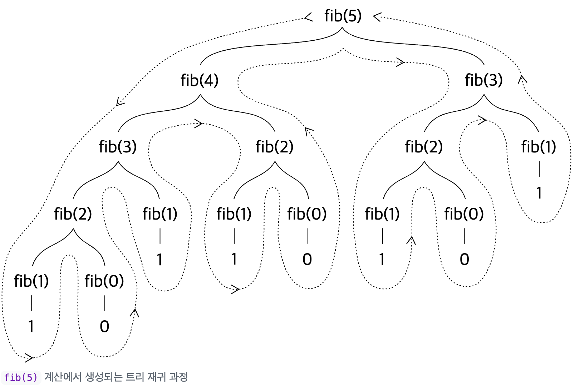
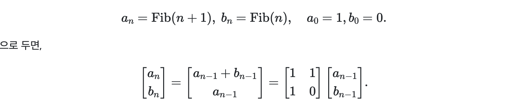
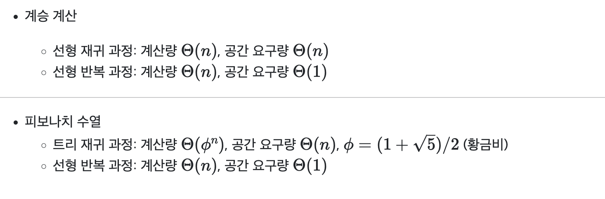
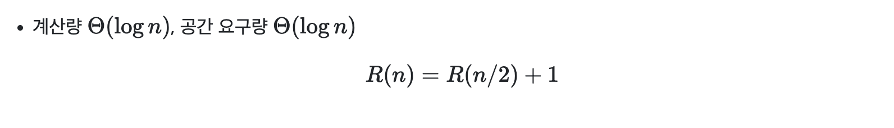
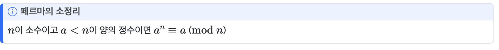

In this post, 03 Computation lecture is introuduced. 


# 1.2.1 함수가 생성하는 계산적 과정

함수는 계산적 과정의 지역적 전개 패턴이다.

## 1.2.1.1 선형재귀와 반복

#### !의 선행재귀 과정

```r
Factorial <- function(n) {
  if (n==1) {
    1
  } else {
    n * Factorial(n-1)
  }
}
Factorial(6)
```

#### !의 선형반복 과정

```r
Factorial <- function(n) {
  fact_iter(1, 1, n)
}

fact_iter <- function(product, counter, max_count) {
  if (counter > max_count) {
    product
  } else {
    fact_iter(counter * product, counter + 1, max_count)
  }
}

Factorial(6)
```

재귀와의 차이는 상태변수 `counter`와 `product`를 두어 일을 미루지 않고 계산하여 계산의 상태를 기억함. 재귀는 계산을 계속 뒤로 미룸. 

**선형 재귀 과정: 확장 후 수축**

- 확장 — 미뤄둔 연산(deferred operations)의 사슬(chain) 구축
- 수축 — 연산 수행
- *재귀 과정*(recursive process) — 미뤄둔 연산의 사슬로 특징지어지는 계산적 과정
  - 나중에 수행해야 할 연산 기억이 필요
- 계승 계산: **사슬의 길이(연산)와 메모리 요구량 모두 $n$에 비례** — *선형* 재귀 과정

**선형 반복 과정: 상태 변수**

- 각 $n$에 대해 `product`, `counter`의 값만 기억
- 확장/수축 없음
- 반복 과정 (iterative process)
  - 상태 변수(state variables), 상태 갱신 규칙, 종료 조건
  - ❗필요 메모리는 상태 변수 개수에 비례 (과 무관) **call stack이 꼬리재귀 최적화에 의해 덮여씌워진다고 생각하면 됨!**
- 계승 계산: **필요한 단계(연산) 수가 $n$에 비례** — *선형* 반복 과정

**차이**

- 반복 과정에서 상태 변수는 임의의 시점에서 과정의 상태를 완전히 서술
  - 멈춘 상태에서 다시 진행 가능
- 재귀 과정은 해석기가 관리하는 보조 정보가 필요
  - 멈춘 상태에서 다시 진행 불가능
- 재귀 *함수*가 반복 과정을 생성할 수 있음(`fact_iter`)
- 위에서 선형반복 **과정**에서도 재귀**호출**을 이용하지만 

**꼬리재귀(Tail recursion)**

- 반복 과정을 생성하는 재귀 함수는 꼬리 재귀(tail recursion) 형태

  - 함수의 마지막 동작이 자기 자신을 호출하며, **추가 연산 없이** 바로 반환하는 경우를 의미함.
  - 예시: 앞의 `fact_iter` 함수는 꼬리 재귀 형태임

- R을 포함한 대부분의 프로그래밍 언어는 꼬리 재귀 함수라 하더라도 소비하는 메모리가 호출 횟수에 비례하도록 설계되어 있음

- 별도의 꼬리 재귀 최적화(tail call optimization, TCO) 과정을 거쳐 고정된 메모리 소비량으로 동작하게 할 수 있음

  - R은 버전 4.4.0부터 지원 (`Tailcall`)

  ```r
  fact_iter <- function(product, counter, max_count) {
    if (counter > max_count) {
      product
    } else {
      Tailcall(fact_iter, counter * product, counter + 1, max_count)
    }
  }
  Factorial(6)
  ```

## 1.2.1.2 트리 재귀

#### 피보나치의 트리 재귀 과정

```r
fib <- function(n) {
  if (n==0) {
    0
  } else if (n==1) {
    1
  } else {
    fib(n - 1) + fib(n -2)
  }
}
```



- 중복 계산!
  - 이파리 노드(`fib(0)`, `fib(1)`)의 개수 = `fib(n+1)`
- 필요 계산 단계 수: 노드 수에 비례 (에 대해 지수적으로 증가)
- 필요 메모리: 트리의 최대 깊이에 비례 (에 대해 선형으로 증가) (**호출스택의 깊이**)

#### 피보나치의 선형반복 과정



```r
fib <- function(n) {
  fib_iter(1, 0, n)
}
fib_iter <- function(a, b, count) {
  if (count == 0) {
    b
  } else {
    fib_iter(a + b, a, count - 1)
  }
}
```

!의 선형반복 과정과 마찬가지로 메모리 사용량은 상수, 연산은 $n$에 비례

#### EX. 잔돈세기

- 50센트, 25센트, 10센트, 5센트, 1센트 동전으로 1달러(=100센트) 만들기
- (일반화 재귀) $n$ 종류의 동전으로 금액 $a$ 를 만드는 경우의 수=
  - 첫 번째 종류의 동전을 제외한 동전들로 금액 $a$ 를 만드는 경우의 수 +
  -  $n$종류의 동전을 사용해서 금액 $a-d$를 만드는 경우의 수. 단, 여기서 $d$는 첫 번째 종류의 동전의 가치
- 경계 조건
  - $a=0$이면 경우의 수는 1
  - $a<0$이면 경우의 수는 0
  - $n=0$이면 경우의 수는 0

------

```r
count_change <- function(amount) {
  cc(amount, 5)
}
cc <- function(amount, kinds_of_coins) {
  if (amount == 0) {
    1
  } else if (amount < 0 || kinds_of_coins == 0) {
    0
  } else {
    cc(amount, kinds_of_coins - 1) + 
      cc(amount - first_denomination(kinds_of_coins), kinds_of_coins)
  }
}
first_denomination <- function(kinds_of_coins) {
  if (kinds_of_coins == 1) {
    1
  } else if (kinds_of_coins == 2) {
    5
  } else if (kinds_of_coins == 3) {
    10
  } else if (kinds_of_coins == 4) {
    25
  } else if (kinds_of_coins == 5) {
    50
  } else {
    0
  }
}
```

## 1.2.1.3 증가 차수



#### Ex. 연속제곱법(successive squaring)


```r
fast_expt <- function(b, n) {
  if (n == 0) {
    1
  } else if (is_even(n)) {
    square(fast_expt(b, n / 2))
  } else {
    b * fast_expt(b, n - 1)
  }
}
is_even <- function(n) { n %% 2 == 0 }
```



#### Ex. 소수판정법



```r
expmod <- function(base, exp, m) {
  if (exp == 0) {
    1
  } else if (is_even(exp) ) {
    square(expmod(base, exp / 2, m)) %% m
  } else {
    (base * expmod(base, exp - 1, m)) %% m
  }
}
fermat_test <- function(n) {
  try_it <- function(a) {
    expmod(a, n, n) == a
  }
  try_it(1 + floor(runif(1) * (n - 1)));
}
fermat_test(97)
```

- 계산량 $\Theta(logn)$ (연속제곱법)
- 확률적 방법
  - `fermat_test(n) == FALSE`: 은 소수가 아님
  - `fermat_test(n) == TRUE`: 은 소수일 가능성이 있음
- a를 바꿔가며 시행 횟수를 늘리면 판정을 통과할 경우 소수일 가능성이 커짐

```r
fast_is_prime <- function(n, times) {
  if (times == 0) {
    TRUE
  } else if (fermat_test(n) ) {
    fast_is_prime(n, times - 1)
  } else {
    FALSE
  }
}

fast_is_prime(97, 3)
```


