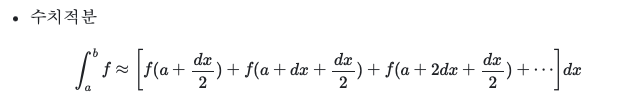
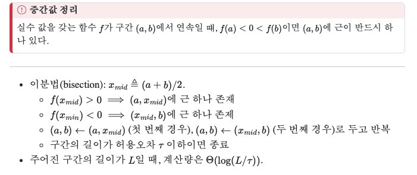
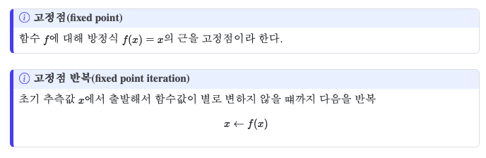
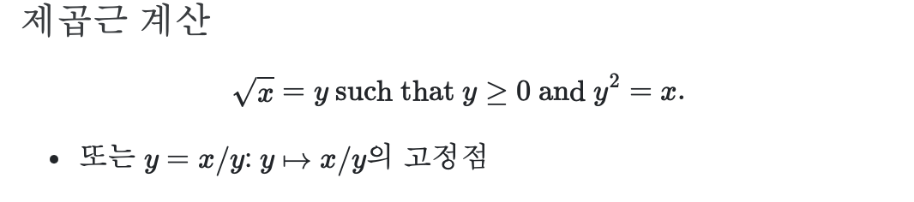
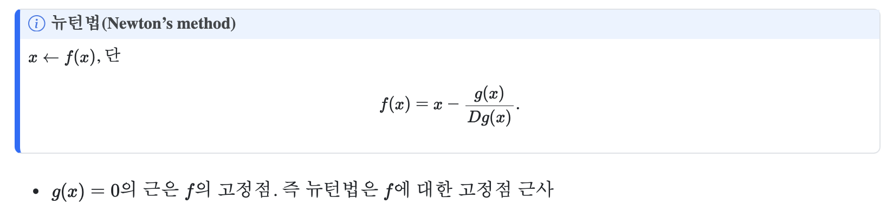
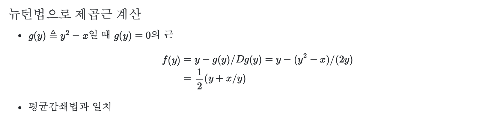

In this post, 04 Computation lecture is introuduced. 


# 1.3.1 고차 함수를 이용한 추상화

고차 함수 (Higher-order Function) : 함수를 전달인자로 받거나 값으로 반환하는 함수

## 1.3.1.1 함수를 받는 함수

다음은 a~b 정수 세제곱의 합을 구하는 코드이다. 

```r
cube <- function(x) { x * x * x }

sum_cubes <- function(a, b) {
  if (a > b) {
    0
  } else {
    cube(a) + sum_cubes(a + 1, b)
  }
}
```

코드의 형식은 다음과 같다.

```r
<name> <- function(a, b) {
  if (a > b) {
    0
  } else {
    <term>(a) + <name>(<next>(a, b))
  }
}
```

이를 고차함수 방식으로 구현하기 위해 다음과 같이 고차함수 Sum을 정의한다. 

```r
Sum <- function(term, a, Next, b) {
  if (a > b) {
    0
  } else {
    term(a) + Sum(term, Next(a), Next, b)
  }
}
```

- term : a에 대해 작업할 함수
- a, b : 시작, 끝 원소
- Next : 다음 원소를 구하는 함수

이제 Sum을 이용하여 세제곱의 합을 구하는 코드를 다음과 같이 작성한다. 즉, 우리는 Sum이라는 고차함수를 이용해 세제곱의 합 뿐만 아니라 임의의 급수를 구할 수 있다. 

```r
identity <- function(x) {x}
inc <- function(n) {n+1}
sum_integers <- function(a, b) {
  Sum(identity, a, inc, b)
}
sum_integers(a, b)
```


## 1.3.1.2 수치적분

정적분의 값을 다음과 같이 작은 값 dx에 대해서 아래와 같이 수치적분을 이용하여 계산할 수 있다.



```r
integral <- function(f, a, b, dx) {
  add_dx <- function(x) {
    x + dx
  }
  Sum(f, a + dx / 2, add_dx, b) * dx
}

integral(cube, 0, 1, 0.01)   # 0.2499875 exact value is 0.25
```

## 1.3.1.3 무명함수

term과 next에 해당하는 함수는 다른 곳에서는 사용되지 않는데 단지 Sum에 인자로 전달하기 위해서만 정의될 때가 많다. 아래와 같이 함수 인자로 무명함수를 바로 전달할 수 있다. 

```r
integral <- function(f, a, b, dx) {
  Sum(f, a + dx / 2,
      function(x) { x + dx }, b) * dx
}
integral(cube, 0, 1, 0.01)
```

무명함수를 함수 내에서 지역이름으로 사용하는 예시는 아래와 같다. 

```r
f_2 <- function(x, y) {
  (function(a, b) { x * square(a) + y * b + a * b })(1 + x * y, 1 - y)
}
f_2(3, 4)
```

다음의 차이에 주의하자.

```r
x <- 2
(function(x, y) { x * y })(3, x + 2) # 12
x # 2
```

```r
x <- 2
{
  x <- 3
  y <- x + 2
  x * y
} # 15
x # 3 !
```

❗하지만, R에서는 `{}` 블록이 함수처럼 완전히 독립된 스코프를 만들지 않는다. `x <- 3` 이 실행되면, R은 “현재 환경에 `x`가 이미 있나?”를 확인한다. 현재 환경은 전역 환경이고, 전역에 `x`가 존재하므로 이 문장은 전역의 x 값을 3으로 덮어쓴다.

## 1.3.1.4 일반적 방법으로서의 함수

### 이분법을 이용한 방정식의 근 구하기

- 비선형 방정식 $f(x) = 0$ 의 특정 구간에서의 근을 수치적으로 구하는 방법이다. (단 f는 구간에서 연속)



### 함수의 고정점 구하기



```r
tolerance <- 0.00001
fixed_point <- function(f, first_guess) {
  close_enough <- function(x, y) {
    abs(x - y) < tolerance;
  }
  try_with <- function(guess) {
    nxt <- f(guess)
    if (close_enough(guess, nxt) ) {
      nxt
    } else {
      try_with(nxt)
    }
  }
  try_with(first_guess)
}

fixed_point(cos, 1)
```



- $f(y)=x/y$ 의 고정점. 하지만 이 경우 발산함.

```bash
Sqrt <- function(x) { fixed_point(function(y) { x / y }, 1) }
```

- $g(y)=(y+f(y))/2 =(y+x/y)/2$ 의 고정점. 발산했던 위 함수와 y의 평균으로 새로운 고정점 함수를 만드는 이 방법은 평균 감쇄 (average damping) 이라고 함.

### 뉴튼법

- 비선형 방정식 $g(x)=0$의 근을 수치적으로 구하는 방법 중 하나이다. (다른 방법은 이분법)
- $f(x)$를 아래와 같이 정의하고 $f$ 에 대한 고정점을 찾으면 그것이 $g(x)=0$ 의 근이다.

​	

- 이 때, $g$ 가 미분 가능하고 모든 $x$ 에서 $Dg(x)$ 의 값이 0이 아니라는 가정이 숨어 있다. (이분법은 미분 불가능해도 적용 가능)

  

### 일급 개체

- 계산적 개체의 조작에 가해지는 제약이 가장 적을 때, 이를 일급(first-class) 개체라 한다.
- 일급 개체의 특성
  - 이름으로 지칭할 수 있다.
  - 함수의 인자로 전달될 수 있다.
  - 함수의 반환값이 될 수 있다.
  - 자료 구조에 포함될 수 있다.
- R에서는 함수가 일급 개체이다.
- 함수를 일급 개체로 다루면 표현력이 크게 높아진다.
