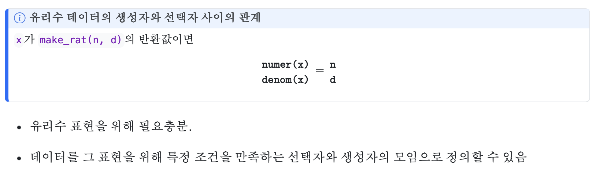

In this post, 05 Computation lecture is introuduced. 


# 2.1.1 데이터 추상화

순서쌍 자료구조 pair가 주어져 있을 때, 유리수 연산을 다음과 같이 만들 수 있다. 

```r
make_rat <- function(n, d) {
    g <- gcd(n, d)
    pair(n / g, d / g)
} # constructor
numer    <- function(x) { head(x) } # selector
denom    <- function(x) { tail(x) } # selector

add_rat <- function(x, y) {
  make_rat(numer(x) * denom(y) + numer(y) * denom(x),
           denom(x) * denom(y))
}
sub_rat <- function(x, y) {
  make_rat(numer(x) * denom(y) - numer(y) * denom(x),
           denom(x) * denom(y))
}
mul_rat <- function(x, y) {
  make_rat(numer(x) * numer(y),
           denom(x) * denom(y))
}
div_rat <- function(x, y) {
  make_rat(numer(x) * denom(y),
           denom(x) * numer(y))
}
equal_rat <- function(x, y) {
  numer(x) * denom(y) == numer(y) * denom(x);
}
```

## 2.1.1.1 데이터란 무엇인가


