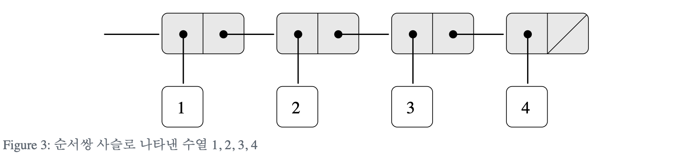
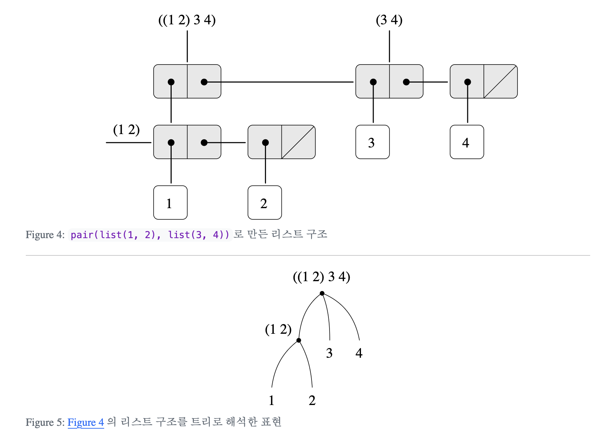
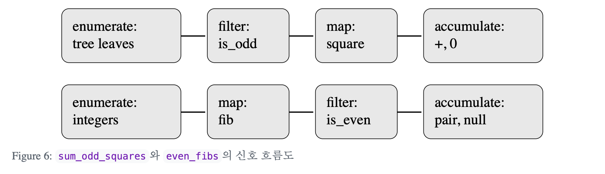

In this post, 06 Computation lecture is introuduced. 


# 2.2.1 계층적 데이터와 닫힘

## 2.2.1.1 닫힘(closure)

- 순서쌍을 원소로 갖는 순서쌍을 생성하는 능력 — 데이터 개체의 집합은 `pair` 연산에 대해 닫혀 있음
- 집합이 어떤 연산에 대해 닫혀 있다면 해당 연산의 결과에 다시 그 연산을 적용 가능
- 계층적(hierarchical) 또는 재귀적(recursive) 자료 구조 생성 가능

## 2.2.1.2 수열의 표현

```r
pair(1, 
  pair(2, 
    pair(3, 
      pair(4, NULL))))

# List(1, 2, 3, 4) 와 동등
```



- 리스트 따라가기

  ```r
  # returns the n-th item of the list
  list_ref <- function(items, n) {
    if (n == 0) {
      head(items)
    } else {
      list_ref(tail(items), n - 1)
    }
  }
  squares <- List(1, 4, 9, 16, 25)
  list_ref(squares, 3) # 16
  ```

- 리스트 길이

  ```r
  # recursive style
  len <- function(items) {
    if (is.null(items)) { 
      0
    } else {
      1 + len(tail(items))
    }
  }
  
  odds <- List(1, 3, 5, 7)
  len(odds)
  
  # iterative style
  len <- function(items) {
    len_iter <- function(a, count) {
      if (is.null(a)) {
        count
      } else {
        len_iter(tail(a), count + 1)
      }
    }
    len_iter(items, 0)
  }
  
  odds <- List(1, 3, 5, 7)
  len(odds)
  ```

- append

  ```r
  appnd <- function(list1, list2) {
    if (is.null(list1)) { 
      list2
    } else {
      pair(head(list1), appnd(tail(list1), list2))
    }
  }
  ```

- map(사상) : 리스트의 각 원소를 변환하여 결과값들의 리스트를 생성

  ```r
  scale_list <- function(items, factor) {
    if (is.null(items)) {
      NULL
    } else {
      pair(head(items) * factor, 
           scale_list(tail(items), factor))
    }
  }
  
  scale_list(List(1, 2, 3, 4, 5), 10)
  
  # 고차함수로 일반화
  map <- function(fun, items) {
    if (is.null(items)) {
      NULL
    } else {
      pair(fun(head(items)), 
           map(fun, tail(items)))
    }
  }
  scale_list <- function(items, factor) {
    map(function(x) { x * factor }, items)
  }
  
  scale_list(List(1, 2, 3, 4, 5), 10)
  ```

### 2.2.1.3 계층 구조



```r
x <- pair(List(1, 2), List(3, 4))
len(x)  # 3 as a List. 원치 않는 결과.

count_leaves(x) # 4 as a tree. 원하는 결과.

count_leaves <- function(x) {
  if (is.null(x)) { # empty
    0
  } else if (!is_pair(x)) { # leaf
    1
  } else {
    count_leaves(head(x)) + count_leaves(tail(x))
  }
}
```

- 트리 map

  ```r
  scale_tree <- function(tree, factor) {
    if (is.null(tree)) { # empty
      NULL
    } else if (!is_pair(tree)) { # leaf
      tree * factor
    } else {
      pair(scale_tree(head(tree), factor), 
           scale_tree(tail(tree), factor))
    }
  }
  
  scale_tree(List(1, List(2, List(3, 4), 5), List(6, 7)), 10)
  
  # map 사용 ver.
  scale_tree <- function(tree, factor) {
    map(function(sub_tree) { 
          if (is_pair(sub_tree)) {
            scale_tree(sub_tree, factor)
          } else {
            sub_tree * factor 
          }
      }, tree)
  }
  
  scale_tree(List(1, List(2, List(3, 4), 5), List(6, 7)), 10)
  ```

  

## 2.2.1.4 통용 인터페이스로서의 수열

```r
#1
square <- function(x) { x * x }
is_odd <- function(n) { n %% 2 == 1 }

sum_odd_squares <- function(tree) {
  if (is.null(tree)) {
    0
  } else if(!is_pair(tree)) {
    if (is_odd(tree)) {
      square(tree)
    } else {
        0
    }
  } else {
    sum_odd_squares(head(tree)) +
             sum_odd_squares(tail(tree))
  }
}

sum_odd_squares(List(List(2, 3), List(4, 5)))

# 2
is_even <- function(n) { n %% 2 == 0 }
fib <- function(n) {
  if (n == 0) { 0
  } else if (n == 1) { 1
  } else {
    fib(n - 1) + fib(n - 2);
  }
}

even_fibs <- function(n) {
  nxt <- function(k) {
    if (k > n) {
      NULL
    } else {
      f <- fib(k)
      if (is_even(f)) {
        pair(f, nxt(k + 1))
      } else {
        nxt(k + 1)
      }
    }
  }
  nxt(0)
}

even_fibs(9)
```

### 두 함수의 추상적 유사성

- sum_odd_squares
  - 트리의 이파리를 나열
  - 홀수값을 갖는 잎만 선택하도록 필터링
  - 선택된 잎의 값의 제곱을 계산
  - `0`에서 출발, `+`를 이용해서 누적합 계산
- even_fibs
  - `0`부터 `n`까지의 정수를 나열
  - 각 정수에 대한 피보나치 수를 계산
  - 짝수값을 갖는 피보나치 수만 선택하도록 필터링
  - 빈 리스트에서 출발, `pair`를 이용해서 선택된 값을 누적



- 앞의 두 함수 구현은 신호 흐름에 대응되는 부분들이 명확히 나뉘어 있지 않음.

1. 사상 모듈

   ```r
   map(square, List(1, 2, 3, 4, 5))
   ```

2. 필터링 모듈

   ```r
   filtr <- function(predicate, sequence) {
     if (is.null(sequence)) {
       NULL
     } else if (predicate(head(sequence))) {
       pair(head(sequence),
            filtr(predicate, tail(sequence)))
     } else {
       filtr(predicate, tail(sequence))
     }
   }
   
   filtr(is_odd, List(1, 2, 3, 4, 5))
   ```

3. 누적 모듈

   ```r
   accumulate <- function(op, initial, sequence) {
     if (is.null(sequence)) {
       initial
     } else {
       op(head(sequence), 
          accumulate(op, initial, tail(sequence)))
     }
   }
   ```

4. 열거 모듈

   - `even_fibs`

     ```r
     enumerate_interval <- function(low, high) {
       if (low > high) {
         NULL
       } else {
         pair(low, enumerate_interval(low + 1, high))
       }
     }
     
     enumerate_interval(2, 7)
     ```

   - `sum_odd_squares`

     ```r
     enumerate_tree <- function(tree) {
       if (is.null(tree)) { # empty
         NULL
       } else if ( !is_pair(tree) ) { # leaf
         List(tree)
       } else {
         appnd(enumerate_tree(head(tree)),
               enumerate_tree(tail(tree)))
       }
     }
     
     enumerate_tree(List(1, List(2, List(3, 4)), 5))
     ```

5. 신호 흐름식 최종 구현

   - `sum_odd_squares`

     ```r
     sum_odd_squares <- function(tree) {
       accumulate(`+`, 
                  0, 
                  map(square, 
                      filtr(is_odd, 
                            enumerate_tree(tree))))
     }
     
     sum_odd_squares(List(List(2, 3), List(4, 5)))
     ```

   - `even_fibs`

     ```r
     even_fibs <- function(n) {
       accumulate(pair, 
                  NULL, 
                  filtr(is_even, 
                        map(fib, 
                            enumerate_interval(0, n))))
     }
     
     even_fibs(9)
     ```


### Ex. 중첩된 사상

- 주어진 양의 정수 $n$에 대해 $1 \leq j < i \leq n$ 이고 ($i+j$) 가 소수인 서로 다른 양의 정수 $i, j$ 의 순서순서쌍을 구해보자.

​	(생략)
