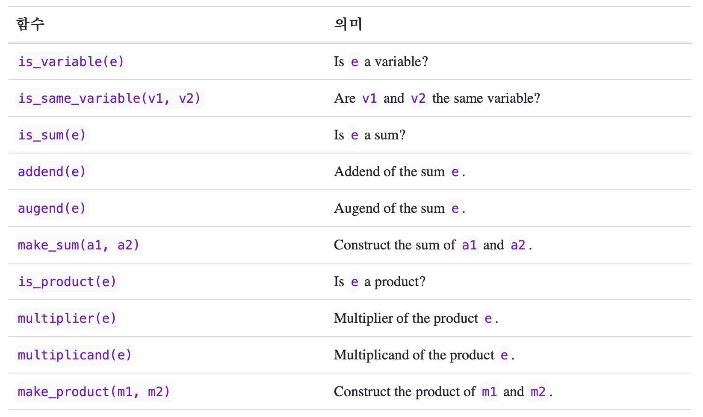
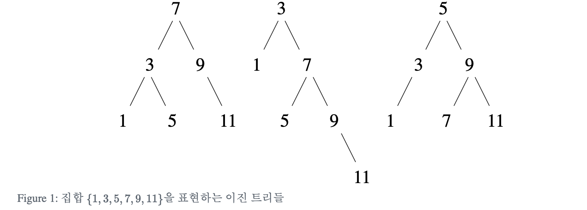
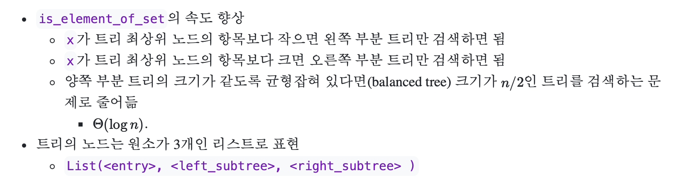
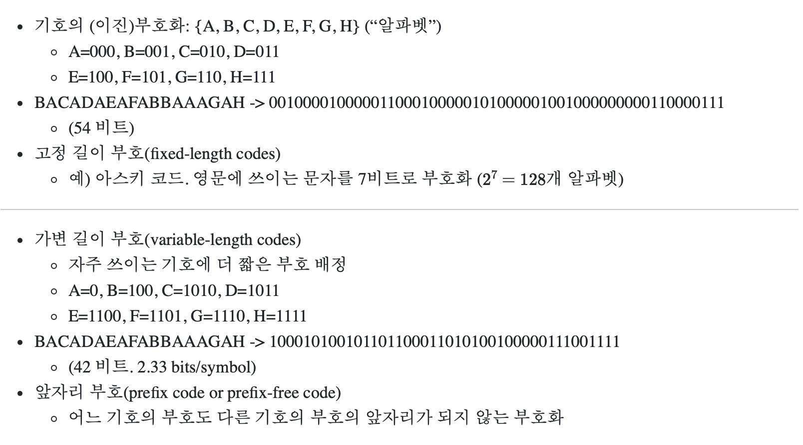
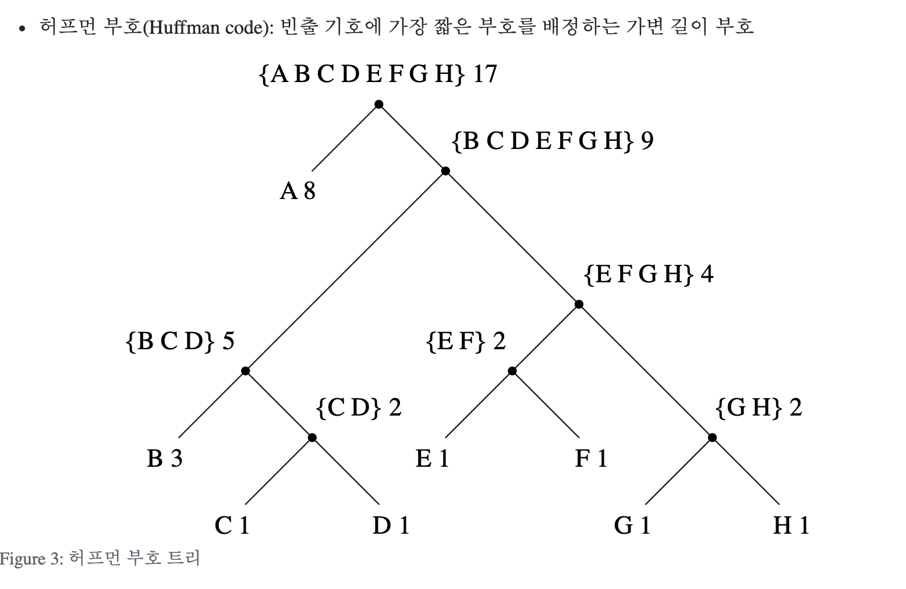
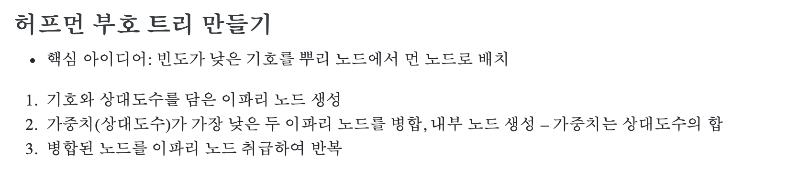

In this post, 08 Computation lecture is introuduced. 


# 2.3 기호 데이터

이 장에서는 수치형이 아닌 자료를 주로 다루게 된다. 

 ## 2.3.1 문자열

```r
List("a", "b")
[a, [b, NULL]]
```

**문자열의 비교**

```r
identical("abc", "abc") # TRUE
identical("abc", "bcd") # FALSE
```

**member 함수 구현**

```r
# item이 list x에 있는지 판별
member <- function(item, x) {
  if (is.null(x)) {
    NULL
  } else if (identical(item, head(x))) {
    x
  } else {
    member(item, tail(x))
  }
}
```


## 2.3.2 기호 미분

1장에서는 미분을 할때, 수치 미분을 이용했다면 여기서는 기호 미분에 대해 배운다. 이미 알고 있는 합의 미분, 곱의 미분 등에 대한 지식을 그대로 코드로 표현하게 된다.


미분에 관련된 기본 규칙은 위와 같다. 마지막 두 규칙은 재귀적임을 알 수 있다. 

다음의 선택자, 생성자, 함수가 존재한다고 가정하자. 예를 들어, `is_variable(e)` 는 `e`가 미분하려는 변수이면 TRUE 아니면 FALSE를 반환한다. 



위 함수들을 이용해 다음과 같이 미분 함수를 구현할 수 있다.

```r
deriv <- function(exp, variable) {
  if (is.numeric(exp)) {
    0
  } else if (is_variable(exp)) {
    if (is_same_variable(exp, variable) ) {
      1
    } else {
      0
    }
  } else if (is_sum(exp)) {
    make_sum(deriv(addend(exp), variable),
             deriv(augend(exp), variable))
  } else if (is_product(exp)) {
    make_sum(make_product(multiplier(exp),
                          deriv(multiplicand(exp), variable)),
             make_product(deriv(multiplier(exp), variable),
                          multiplicand(exp))
        )
  } else {
     stop("unknown expression type -- deriv")
  }
}
```

위 코드에서 `exp` 에 해당하는 대수식을 어떻게 표현할 수 있을까? 리스트를 이용한 전위표기법으로 표현할 수 있다. 예를 들어, 대수식 $ax+b$ 를 `List("+", List("*", "a", "x"), b)`  처럼 표현하는 식이다. 

위에서 가정한 선택자, 생성자, 함수들의 구현은 아래와 같다.

```r
# 변수는 그냥 문자열
is_variable <- function(x) { is.character(x) }

# 두 변수는 해당 문자열이 같으면 같다
is_same_variable <- function(v1, v2) {
  is_variable(v1) && is_variable(v2) && identical(v1, v2)
}

# 합과 곱은 리스트
make_sum <- function(a1, a2) { List("+", a1, a2) }
make_product <- function(m1, m2) { List("*", m1, m2) }

# 리스트의 첫 원소가 "+"이면 합
is_sum <- function(x) {
  is_pair(x) && identical(head(x), "+")
} # 전위 표기법의 장점!

# 더하는 수는 합 리스트의 두번째 원소
addend <- function(s) { head(tail(s)) }

# 더해지는 수는 합 리스트의 세번째 원소
augend <- function(s) { head(tail(tail(s))) }

# 리스트의 첫 원소가 "*"이면 곱
is_product <- function(x) {
  is_pair(x) && identical(head(x), "*")
} # 전위 표기법의 장점!

# 곱하는 수는 곱 리스트의 두번째 원소
multiplier <- function(s) { head(tail(s)) }

# 곱해지는 수는 곱 리스트의 세번째 원소
multiplicand <- function(s) { head(tail(tail(s))) }
```

**식 간단히 하기**

위 함수들의 정의를 이용해서 $x+3$ 을 미분하면 다음과 같은 결과가 나온다.

```r
deriv(List("+", "x", 3), "x")    # x+3
[ +, [ 1, [ 0, NULL ] ] ] # 1+0

deriv(List("*", List("*", "x", "y"), List("+", "x", 3)), "x") # xy(x+3)
[ +, [ [ *, [ [ *, [ x, [ y, NULL ] ] ], [ [ +, [ 1, [ 0, NULL ] ] ], NULL ] ] ], [ [ *, [ [ +, [ [ *, [ x, [ 0, NULL ] ] ], [ [ *, [ 1, [ y, NULL ] ] ], NULL ] ] ], [ [ +, [ x, [ 3, NULL ] ] ], NULL ] ] ], NULL ] ] ]
```

결과가 맞기는 하지만 1+0보다는 1로 표현될 수 있다면 훨씬 간단할 것이다. 두 번째 예제는 훨씬 더 복잡하게 표현되게 된다.

이를 위해 덧셈, 곱셈 함수를 더 간결한 결과를 내도록 아래처럼 수정한다.

```r
number_equal <- function(exp, num) {
  is.numeric(exp) && identical(exp, num)
}

make_sum <- function(a1, a2) {
  if (number_equal(a1, 0)) {
    a2
  } else if (number_equal(a2, 0)) {
    a1
  } else if (is.numeric(a1) && is.numeric(a2)) {
    a1 + a2
  } else {
    List("+", a1, a2)
  }
}

make_sum(2, 3) # 5

make_product <- function(m1, m2) {
  if (number_equal(m1, 0) || number_equal(m2, 0)) {
    0
  } else if (number_equal(m1, 1)) {
    m2
  } else if (number_equal(m2, 1)) {
    m1
  } else if (is.numeric(m1) && is.numeric(m2)) {
    m1 * m2
  } else {
    List("*", m1, m2);
  }
}

make_product(2, 3) #6
```

그 결과 미분 결과가 훨씬 간단해졌다.

```r
deriv(List("+", "x", 3), "x")    # x+3
1

deriv(List("*", List("*", "x", "y"), List("+", "x", 3)), "x") # xy(x+3)
[ +, [ [ *, [ x, [ y, NULL ] ] ], [ [ *, [ y, [ [ +, [ x, [ 3, NULL ] ] ], NULL ] ] ], NULL ] ] ]
```


## 2.3.3 집합 표현하기

지금까지 알아본 유리수나 대수식에 비해 집합의 표현 방식은 다소 자명하지 않다.

유리수라는 데이터를 생성자와 선택자의 관계로 추상화했던 것처럼 집합도 다음의 연산들로 추상화 할 수 있다.

`union_set`,`intersection_set`, `is_element_of_set`, `adjoin_set`

`is_element_of_set` 함수는 아래 조건들을 만족해야 한다.

```r
is_element_of_set(x, adjoin_set(x, S)) == TRUE
is_element_of_set(x, union_set(S, T)) == 
    (is_element_of_set(x, S) || is_element_of_set(x, T))
is_element_of_set(x, NULL) == FALSE
```

이를 바탕으로 집합을 순서 없는 리스트로 표현한다면 아래와 같이 구현한다면 아래와 같다.

```r
is_element_of_set <- function(x, set) {
  if (is.null(set) ) {
    FALSE
  } else if (identical(x, head(set)) ) {
    TRUE
  } else {
    is_element_of_set(x, tail(set))
  }
}

adjoin_set <- function(x, set) {
  if (is_element_of_set(x, set) ) { # duplicate
    set
  } else {
    pair(x, set)
  }
}

intersection_set <- function(set1, set2) {
  if (is.null(set1) || is.null(set2) ) {
    NULL
  } else if (is_element_of_set(head(set1), set2) ) {
    pair(head(set1), intersection_set(tail(set1), set2))
  } else {
    intersection_set(tail(set1), set2)
  }
}
```

집합을 구현할 때 반드시 순서 있는 리스트의 형태로만 저장되도록 구현할 수도 있다,

```r
is_element_of_set <- function(x, set) {
  if (is.null(set) ) {
    FALSE
  } else if (x == head(set) ) {
    TRUE
  } else if (x < head(set) ) { # x is not in the set
    FALSE
  } else {  # x > head(set)
    is_element_of_set(x, tail(set))
  }
}
```

이렇게 구현하면 찾으려는 원소가 없는 경우에 시간복잡도가 위의 경우 n에서 이 경우 n/2로 줄어든다.

```r
intersection_set <- function(set1, set2) {
  if (is.null(set1) || is.null(set2)) {
    NULL
  } else {
    x1 <- head(set1)
    x2 <- head(set2)
    if (x1 == x2) { 
      pair(x1, intersection_set(tail(set1), tail(set2)))
    } else if (x1 < x2 ) {
      intersection_set(tail(set1), set2)
    } else { # x2 < x1
      intersection_set(set1, tail(set2))
    }
  }
}
```


마지막으로 이진트리를 이용해서 집합을 표현할 수 있다.

- 트리의 각 노드는 집합의 한 원소를 담는다 (항목).
- 노드의 왼쪽 부분 트리의 항목들은 자신보다 작다.
- 노드의 오른쪽 부분 트리의 항목들은 자신보다 크다.





```r
entry <- function(tree) { head(tree) }
left_branch <- function(tree) { head(tail(tree)) }
right_branch <- function(tree) { head(tail(tail(tree))) }
make_tree <- function(entry, left, right) { 
  List(entry, left, right)
}

is_element_of_set <- function(x, set) {
  if (is.null(set) ) {
    FALSE
  } else if (x == entry(set) ) {
    TRUE
  } else if (x < entry(set) ) {
    is_element_of_set(x, left_branch(set))
  } else { # x > entry(set) 
    is_element_of_set(x, right_branch(set))
  }
}

adjoin_set <- function(x, set) {
  if (is.null(set) ) {
    make_tree(x, NULL, NULL)
  } else if (x == entry(set) ) {
    set
  } else if (x < entry(set) ) {
    make_tree(entry(set),
              adjoin_set(x, left_branch(set)),
                            right_branch(set))
  } else { # x > entry(set) 
    make_tree(entry(set),
              left_branch(set),
              adjoin_set(x, right_branch(set)))
  }
}
```

극단적으로 균형이 깨진 트리의 경우에는 adjoin_set 연산이 n에 비례한 시간이 걸린다. 아래의 방법들로 문제를 해결할 수 있다. 

1. `adjoin_set` 연산시 트리를 균형잡힌 트리로 변환
2. 별도의 자료 구조 사용(B-tree 등)


## 2.3.4 허프먼 부호화 트리








