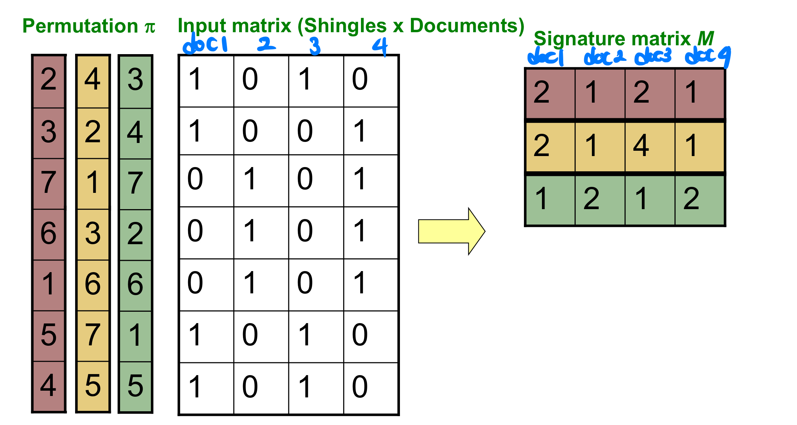
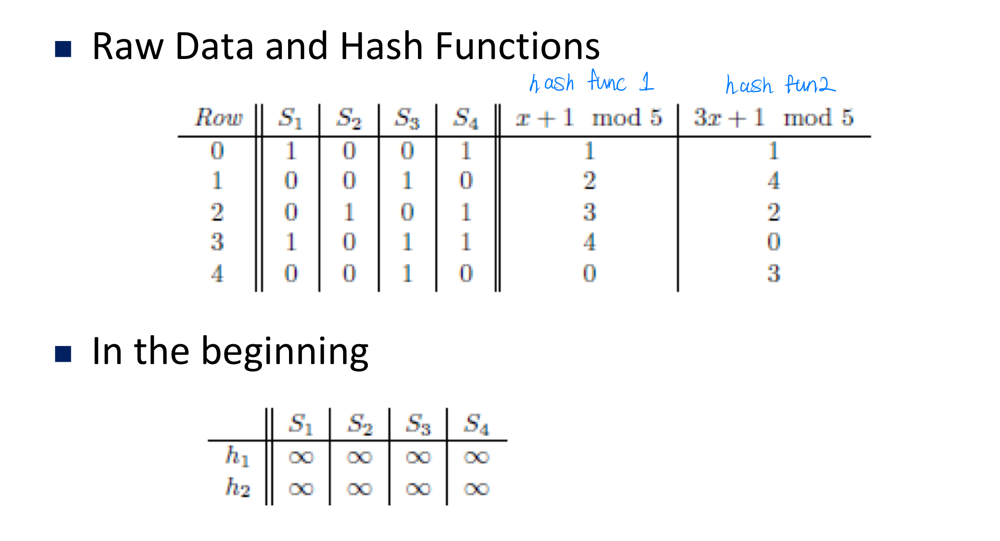
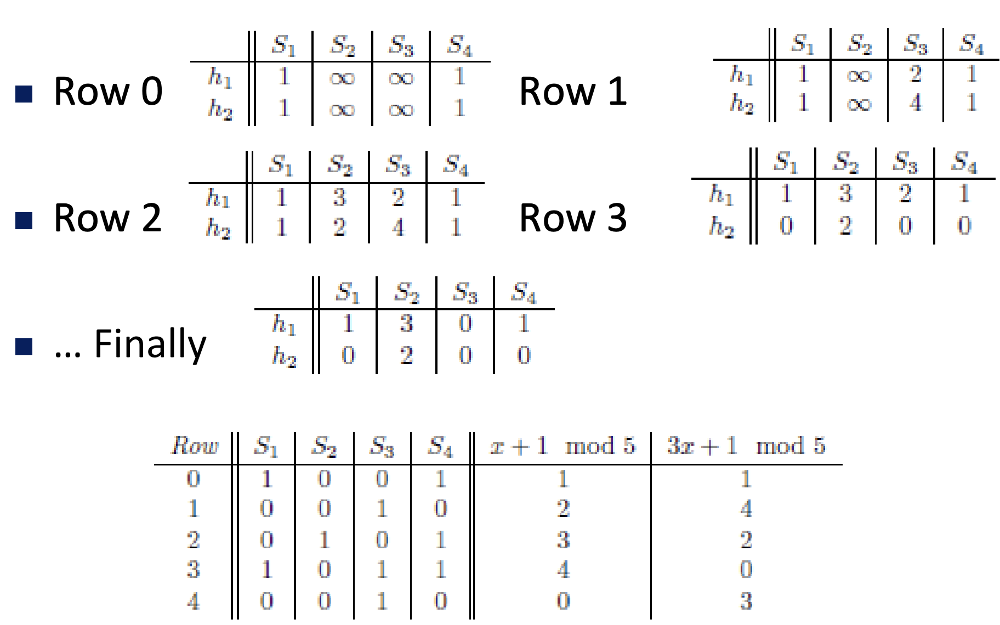
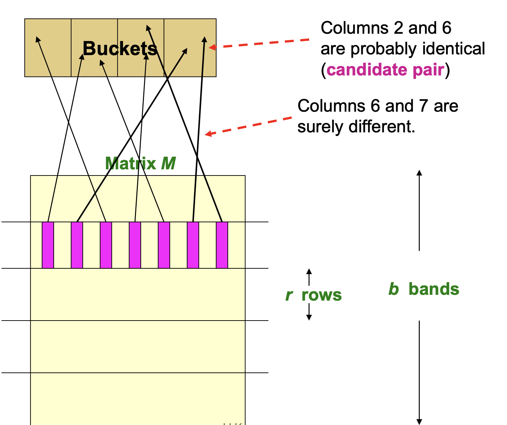
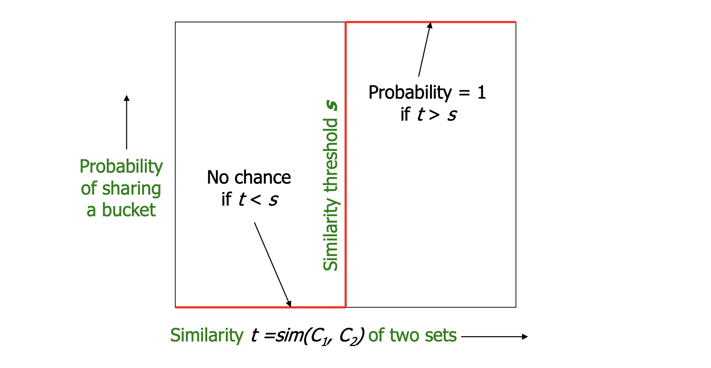
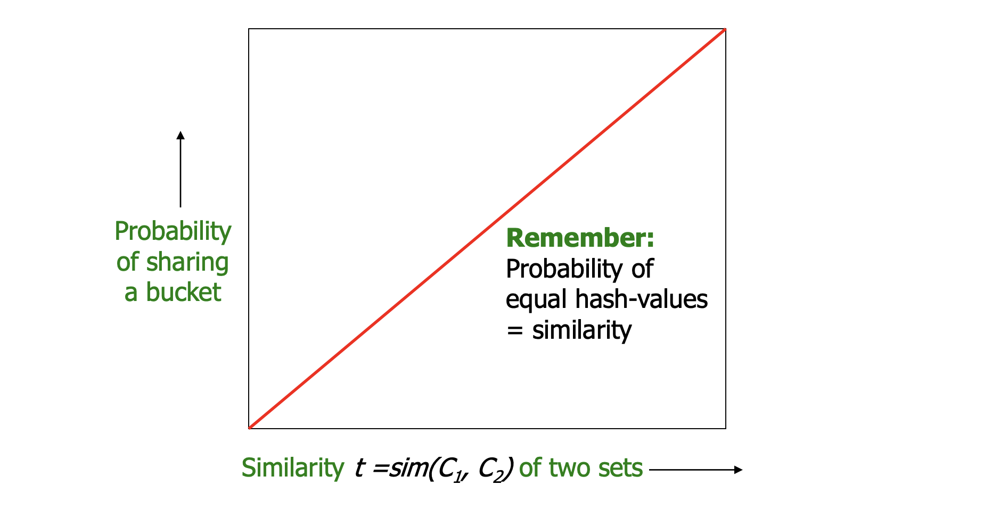
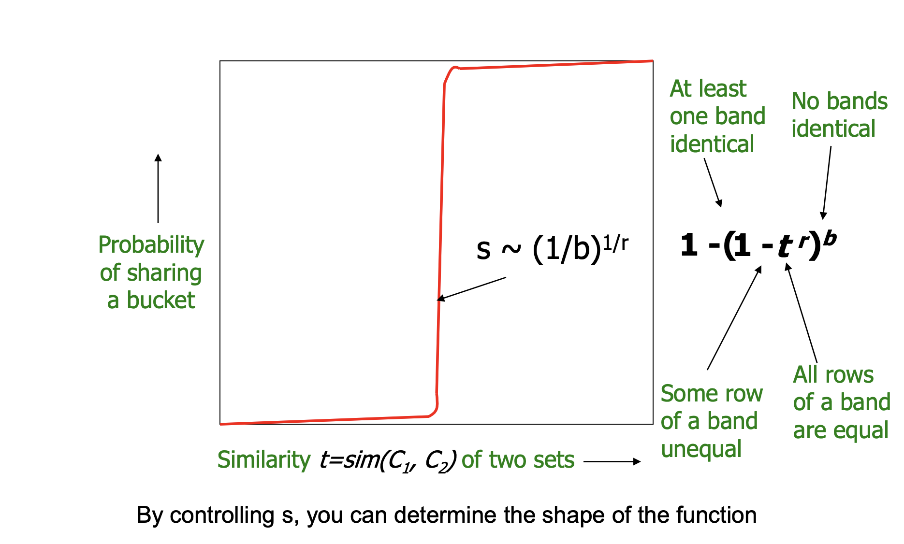
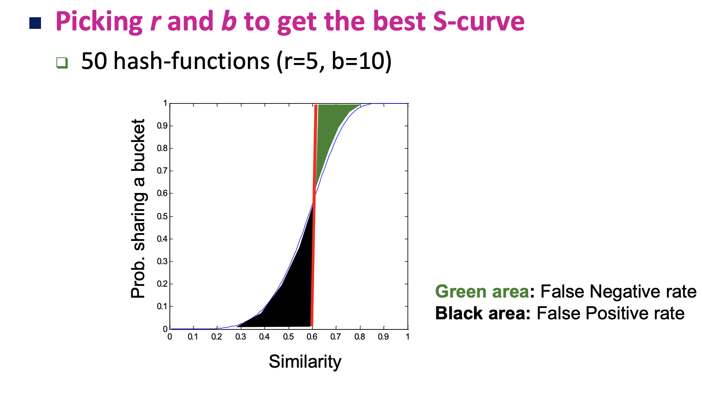
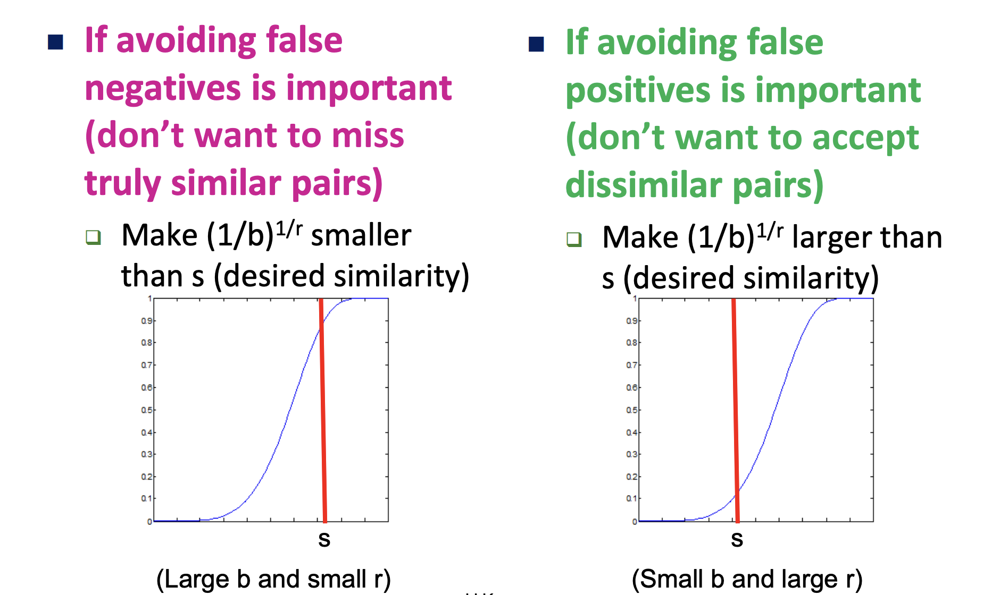

In this post, 03, 04, 05 Data Mining lecture is introuduced. 

# Finding Similar Items

## Application

여러 item들 사이에서 비슷한 item을 찾는 일은 여러 application에서 필요하다.

- 검색 엔진에서 'Amazaon' 이라고 검색했을 때 나오는 여러 news 들을 주제에 맞게 비슷한 글들끼리 묶어 브라우저에서 보여 줄 필요가 있다. 
- 쇼핑 몰 웹사이트에서 비슷한 제품군을 구매한 고객들을 선별하는 작업이 필요 할 수 있다. 
- **Scene Completion Problem** 은 장애물이 있는 풍경 사진에서 장애물을 제거하고 그 빈자리에 주변 풍경과 어울리는 그림을 찾아 넣는 작업으로 이 때에도 주변 환경과 similar한 사진들을 골라야 한다.

## Problem & Goal

- **Problem** : High dimensional data $x1, x2, ... x_n$ 가 주어졌을 때, 우리는 두 data 사이의 거리가 $d(x_i, x_j) \leq s$ 인, $(x_i, x_j)$ 쌍들을 찾고 싶다. 이 문제에 대한 Naive solution은 $O(n^2)$ 이고 이는 너무 느리다.
- **Goal** : 약간의 정확도를 희생하여 이 작업을 $O(n)$ 에 수행할 수 있다. 

## Jaccard Distance & Similarity

앞으로 두 set의 distance나 similarity는 모두 Jaccard 방식으로 계산되며 아래와 같다.

- $J\_Sim(C_1, C_2) = |C_1 \cap C_2| / |C_1 \cup C_2|$
- $J\_Dist(C_1, C_2) = 1-J\_Sim(C_1, C_2)$

## 3 Essential Steps for finding Similar Docs

Finding Similar Item에서 Item을 Document로 하여 매우 큰 숫자(millions or billions)의 document가 주어졌을 때 위 조건을 만족하는 pair들을 찾고자 한다. 이 과정에서 다음 문제점들이 생길 수 있다. 

- 두 문서가 내용상 거의 동일하지만, 그 내용이 **순서가 바뀌거나 조각나서 재배열되어 있을 수 있다**. 이런 경우에도 유사하다고 평가할 수 있어야 한다.
  - **Shingling** 을 통해 해결한다. 
- main memory에 적재하기에 document 하나의 크기가 너무 크거나 document의 개수가 너무 많다. 
  - **Min-Hashing** 을 통해 해결한다. 
- 모든 쌍을 비교하기에 document의 수가 너무 많다.
  - **Locality-Sensitive Hasing** 을 통해 해결한다.

## Shingling

**Shingling** 은 input으로 들어온 document를 set으로 변환시키는 과정이다. 우리는 lecture 01에서 배운 TF.IDF를 이용하여 document를 "set of important words"로 변환할 수 있을 것이다. 그러나 이 방법은 문장 내 단어 배열 순서를 고려하지 않으므로 올바른 결과를 내기가 어렵다. 즉, shingling 과정은 다음을 만족해야 한다. 

- 같은 문장들이지만 순서가 바뀐 두 document는 **유사하게 평가**될 수 있는 set이어야 한다. (TF.IDF 만족. Shingling 만족.)
- 같은 단어들로 이루어졌지만 배열이 다른 문장들은 **다르게 평가**될 수 있는 set이어야 한다. (TF.IDF 불만족. Shingling 만족.)

어떤 document의 **k-shingle** 이란, 연속된 **k tokens** 을 의미한다. 이 때 토큰은 한 글자가 될 수도 있고, 단어가 될 수도 있다.

- Ex. k=2, document $D_1$=abcab, set of 2-shingles=$S(D_1)$ = {ab, bc, ca}
- long shingles를 압축하기 위해 위 결과를 hasing하여 $h(D_1) = {1, 5, 7}$ 과 같이 나타낼 수 있다.

shingling을 이용하면 문장 수준에서 순서가 바뀐 경우는 모두 set에 포함되므로 유사하게 평가될 수 있고, k보다 작은 단위에서 순서가 바뀐 경우는 다른 shingle이므로 유사하게 평가되지 않는다. **k**가 너무 작으면 모든 문서들이 대부분의 shingle을 가지고 있어 유사하게 평가될 수 있으므로 충분히 크게 잡는다.

## MinHashing

Shingling의 결과로 각 document 별로 shingle이 존재(1), 존재 안함(0)을 아래처럼 matrix로 나타낼 수 있다.

많은 경우에, document들은 서로 다른 shingle을 가지고 있으므로 matrix는 sparse 하게 되고 이는 메모리 공간의 낭비이다. 따라서 column 대신, signature라는 것을 이용하여 메모리 공간을 절약 하고자 한다. 

우리는 다음의 조건을 만족하도록 matrix의 각 column **C**를 **signatrue** **h(C)** 로 hashing 하고 싶다.

- $h(C)$ 가 RAM에 fit 할 수 있도록 크기가 작다.
- 만약, $J\_Sim(C_1, C_2)$ 의 값이 크다면 $pr\{ h(C_1) = h(C_2)\}$ (같은 버킷으로 hashing 될 확률) 이 커야 한다.
- 만약, $J\_Sim(C_1, C_2)$ 의 값이다면 $pr\{ h(C_1) = h(C_2)\}$ 이 작아야 한다.

Min-Hashing은 이러한 조건을 만족하는 hash function으로 다음과 같이 동작한다. 

- 위 matrix에서 임의의 row-permutation $\pi$에 대해 $h_\pi (C) = min_\pi \pi(C)$ 
  - 이 때, $\pi(C)$ 는 permutation 했을 때, 값이 1인 row index들의 set이다. 

이 때, 우리는 다음의 중요한 성질 **Min-Hash Property** 를 얻는다.

$pr\{ h_\pi (C_1) = h_\pi (C_2) \} = J\_Sim(C_1, C_2)$

- 참고로, $pr\{ h_\pi (C_1) = h_\pi (C_2) \}$ 는 similarity of signature $C_1, C_2$ 의 정의이다. (Jaccard Similarity와 다른 개념)

위 property는 간단하게 증명 가능하며, 이를 이용하면 여러 permutation들에 대해서 두 column의 min-hashing 값이 같은 비율을 구해 이를 similarity로 추정할 수 있다. 

여기서 permutation 자체의 시간이 오래 걸리는 문제가 생기는데 이를 **row hasing** 을 통해 해결할 수 있다. 

- 아래 표에서 hash function은 각 permutation을 정의한다. shingle-matrix의 row 별로 각 col을 돌며 값이 1인 경우 해당 hash function 값을 저장된 signature-matrix의 값 (초기에는 모두 infinite) 과 비교하여 더 작으면 업데이트 한다. 

## Locality Sensitive Hashing

이제 앞선 두 단계를 통해, document들의 signature-matrix를 만들었다. 우리의 최종 목표는 similarity가 s이상인 모든 pair를 찾고 싶은 것이다. 그러나 모든 document pair를 비교하는 것은 시간 복잡도상 무리가 있다. 따라서 우리는 특정 작업을 통해 similarity를 직접 구할 후보 pair들을 먼저 구한다.

- 아래 그림과 같이 signature-matrix를 r-rows를 갖는 b개의 bands로 나눈다. 
- 각 band에 대해서, 각 column들을 k개의 buckets으로 hashing 한다. (k는 충분히 큰 숫자로 설정한다)
- 최소 1개 이상의 band에서 같은 bucket으로 hasing된 column들은 candidate pairs가 된다. 
- 실제 similar pairs가 잘 후보로 선정되도록 b, r을 tuning한다.
- 우리는 충분히 큰 k와 적절한 hash function을 사용하여, 각 band 내에서 column이 같은 bucket으로 hashing 되는 경우는, band내에서의 column값이 **완벽히 일치** 할 때인 것으로 가정한다.

우리는 similarity가 0.8 이상인 pair를 찾고 싶다. 실제 $C_1, C_2$의 similarity가 0.8이고 b=20, r=5 일 때, ($C_1, C_2$) 가 candidate으로 선정될 확률을 구해보자. 

- $C1, C2$ 가 특정 band에서 완벽히 일치할 확률은 $(0.8)^5=0.328$ 이다. (Min-hash property 사용)
- 20개의 밴드에서 모두 같은 bucket으로 향하지 않을 확률은 $1-(0.328)^20 = 0.00035$ 이다.
- 따라서 99.965%의 확률로 해당 pair는 candidate이 되고, false-negative의 확률은 0.035% 이다.

우리가 원하는 이상적인 LSH의 동작은 다음 그림과 같다.

band의 개수가 1, row의 개수(즉 permutation의 횟수)가 1일 때의 동작은 min-hashing property에 의해 아래와 같다.

band의 개수가 b, 하나의 band 내 row의 개수가 r 일때의 동작은 아래와 같다. 

- 다음 두 그림은 b, r 선택에 따른 false-negative, false-positve 와 관련된 내용을 보여준다. 

## Code

아래는 문서 집합이 주어졌을 때, 유사한 문서 pair를 구해주는 코드를 구현한 것이다. 

