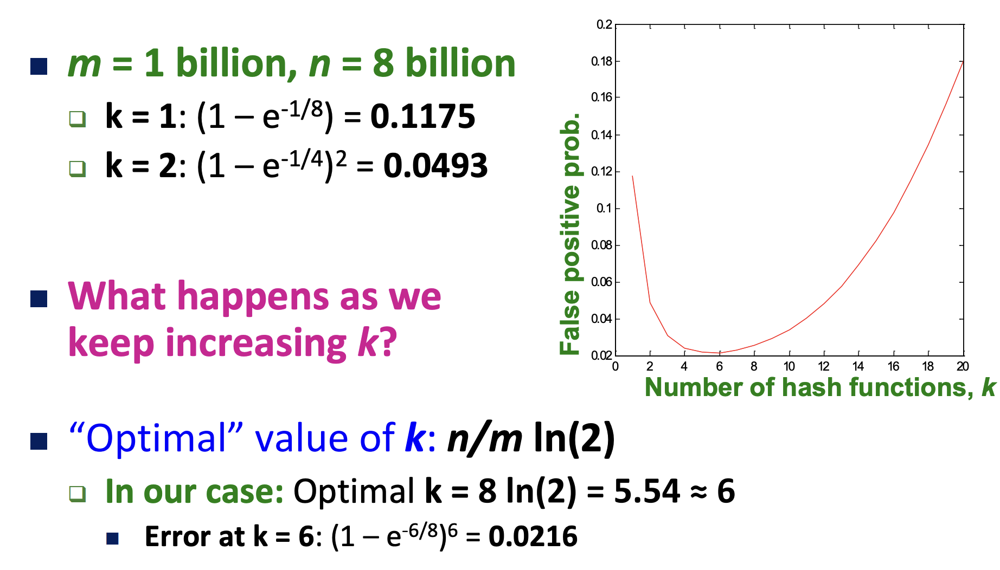

In this post, 08 Data Mining lecture is introuduced. 

# Data Streams

## Application

많은 data mining의 상황에서, 모든 데이터가 사전에 주어지지 않고, 시간의 흐름에 따라 순차적으로 주어지게 된다. 

- Google은 어제보다 오늘 더 많이 검색된 query를 알고 싶을 수 있다. 
- Google은 지난 몇시간 동안 평소보다 비정상적으로 많은 트래픽이 발생한 page를 알고 싶을 수 있다. 

## Problem & Goal

**Data Stream** 에서 우리는 다음의 작업들을 해결하고 싶다. 이번 lecture에서는 첫 2개의 topic을 다룬다. 핵심은 사실상 infinite data를 제한된 main memory에서 효과적으로 처리하는 것이다. 

- Sampling data from a stream

- Queries over sliding windows

- Filtering a data stream

  - Email spam filtering 

  - Publish-subscribe systems : 유저가 설정한 관심사 keyword에 맞는 article을 추천해줌.

- Counting distince elements

  - How many different words are found among the web pages being crawled at a site? (unusally low or high numbers could indicate artificial pages)

  - How many different Web pages does each customer request in a week?

  - How many distince products have we sold in the last week?

- Estimating moments

- Finding frequent elements

  

## Filtering Data Streams

tuple 형태로 이루어진 원소의 data stream이 들어오고, key list가 주어질 때 key 값이 key list에 속한 tuple들을 고르고 싶다.

- 가장 Naive 한 방법은 모든 element들을 순차적으로 scan하여 알아보는 것이다.
- 더 효율적인 방법은 Hash table을 이용하여 key list의 key 값들을 hash table에 저장해두고, element의 key 값에 hash function을 적용하여 거기 있는 hash table의 key 값들과만 비교하면 되어 사실상 O(n)이다. (n은 stream 원소 수)
- 하지만, key list의 모든 key들을 hash table에 저장하기에 memory 공간이 충분하지 않을 수 있다. key list의 원소 수가 N, 일 때, $O(N \times (key 크기+pointer/metadata))$의 공간이 필요하다. 대신 n bits로 이루어진 array B를 저장하여, key list S의 원소 s에 대해 B[h(s)]=1로 설정한다. 이후, tuple element의 key a에 대해 B[h(a)]==1 이면 a를 선택하고, 0이면 선택하지 않는다. 
  - false negative는 존재하지 않고,  false positive는 존재한다.

### Analysis for false positive

위 방법에서 stream의 원소 수를 $n$, key list의 원소 수를 $m$ 이라고 할 때, array B의 $n$ bits 중 대략 몇 개의 bits가 1인지 구해보자.

array B의 특정 bit가 1이 아닐 확률은 $(1-(\frac{1}{n}))^m$ 이므로 1일 확률은 $1-(1-(\frac{1}{n}))^m = 1-e^{-m/n}$ 으로 근사할 수 있다.

이 때 (false positive rate) = array B에서 1인 bits의 비율 = (B의 특정 bit가 1일 확률) = $1-e^{-m/n}$ 이다.

### Bloom Filter

**Bloom Filter** 에서는 위 과정을 서로 다른 $k$ 개의 hash function에 적용하여 false positive rage을 줄인다. 구체적인 과정은 아래와 같다.

$S$ = key list, $B$ = hash table array, $|S|=m, |B|=n$ 일 때, 

- Set $B$ to all 0
- $S$의 각 원소 s에 대해, i=1~k 까지 모든 hash function을 적용하여 $B[h_i(s)]=1$ 로 한다.
- Stream 원소의 key $x$에 대해 $B[h_i(x)]=1$ 이 **모든 i=1~k** 에 대해 성립하면, $x$ 를 positive로 결론 내린다. 

위 과정에서 (B의 특정 bit가 1일 확률) = (B에서 1인 bits의 비율) = $1-e^{-km/n}$ 이다.

이 때 (false positive rate) = $(1-e^{-km/n})^k$ 이다.

- $B$ 를 위처럼 하나의 큰 array로 관리할 수도 있고 $n/k$ 개의 bits를 갖는 $k$ 개의 작은 array들로 관리할 수도 있다. false positive rate은 동일하다.

   $(1-e^{-km/n})^k = (1-e^{-m/(n/k)})^k$ 

## Counting Distinct Elements

현재까지 들어온 전체 N개의 stream에 대해 서로 다른 element의 개수를 알고 싶다. simple solution은 hash table에 각 element를 저장하는 것이다. 하지만, 전체 원소를 memory에 저장할 수 없을 수 있다. 

### Flajolet-Martin Approach

**Flajolet-Martin Approach** 에서는 전체 원소 중 1/2를 bit 0로 mapping, 1/4를 bit 1로 mapping, 1/8을 bit 2로 mapping 해 나간다. 이때 R을 0값을 가지는 최하위 비트의 포지션이라고 할 때, number of distince items = $2^R/\phi$ 이다. ($\phi$ 는 constant)

## Code

아래는 문서 집합이 주어졌을 때, 유사한 문서 pair를 구해주는 코드를 구현한 것이다. 

