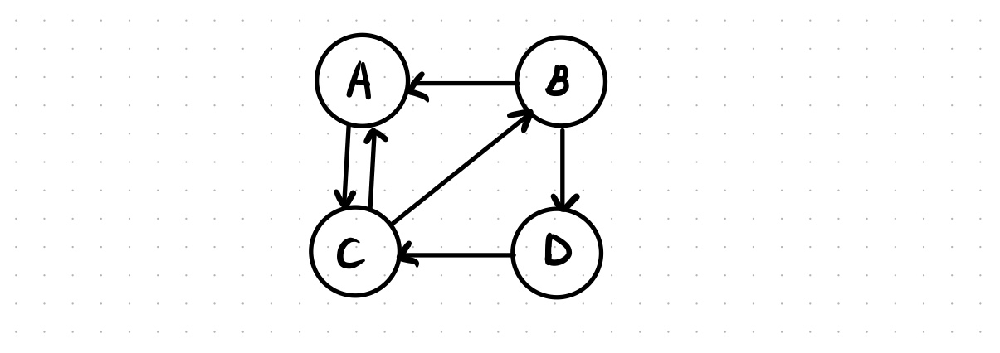

In this post, 09 Data Mining midterm is introuduced. 

# Midterm

1. Similarity 

   a.1 (T/F)

   a.2 (T/F)

   a.3 (T/F) 

   a.4 (T/F) Jaccard similarity가 Cosine similarity 보다 성능 좋다.

   a.5 

   

   Shingling / Min-hashing / Lsh

   b.1

   b.2 

   b.3 

   

2. Mining data stream

   

   grade 데이터가 Grade(University, CourseID, StudentID, grade)로 저장된다. courseID, studentID는 단일 university 내에서만 distinguish 된다. (다른 university에서 같은 courseID, studentID 존재 가능)

   b.1 대학교 내 평균 course 수를 구하고 싶다. (1) 1/15 비율로 샘플링을 할때, filed 조건(i.e. 어떤 필드를 유지해야 e되는지)을 서술하고 (2) 전체 1/15 sampling에 비해 더 좋은 이유를 서술하시오.

   b.2 Gpa가 3.7 이상인 학생들의 비율을 구하고 싶다. (1) 1/15 비율로 샘플링을 할때, filed 조건(i.e. 어떤 필드를 유지해야 e되는지)을 서술하고 (2) 전체 1/15 sampling에 비해 더 좋은 이유를 서술하시오.

   

3. Mining data stream

   

4. Graph

   

   a.1 위 그림에서(그림 확실치 않음) (1) column stochastic matrix를 쓰고, (2) teleport 하지 않을 때, power iteration 결과가 수렴하는지 이유를 서술하시오. 

   a.2 위 그림에서 {B, D}를 specific-topic set으로 하고, $\beta = 0.8$ 로 하여 google matrix를 쓰시오.

   a.3 (a.2)의 matrix를 이용하여 각 노드의 pagerank를 구하시오. (power iteration을 쓰지 않고, 연립 방정식을 풀어 해결하시오.)

   b.1 ~ b.3 matrix 계산시 메모리 이슈 관련 문제.
