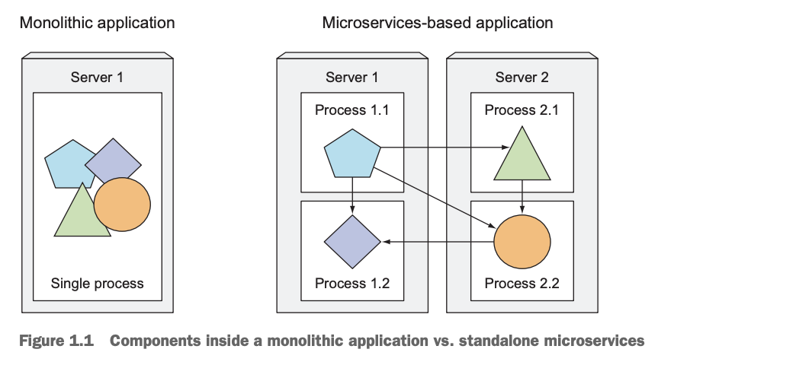
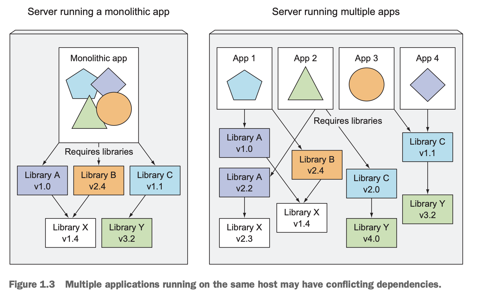
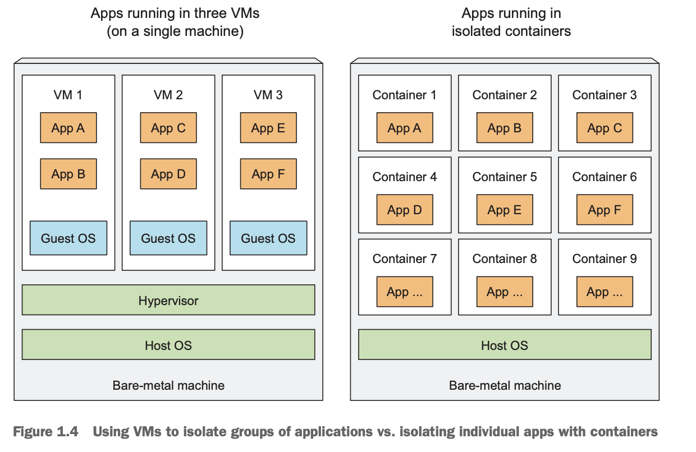
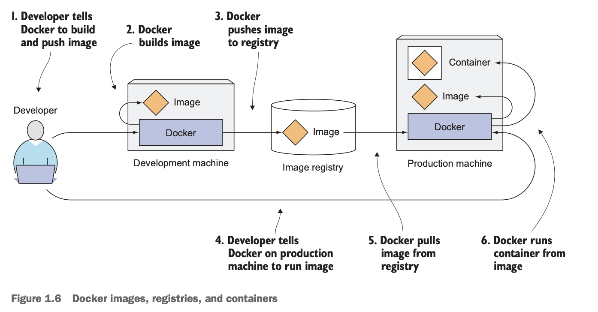
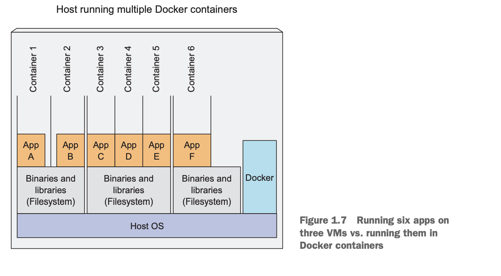
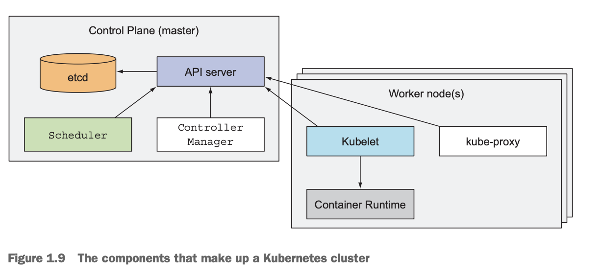
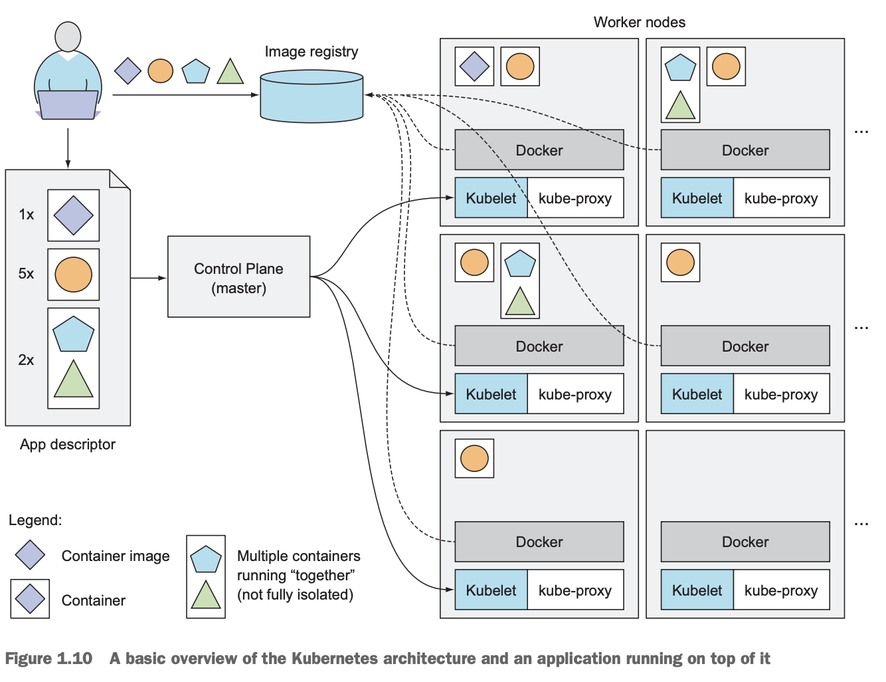

In this post, chapter 1 of Kubernetes in Action is introduced. 


# 1.1 Understanding the need for a system like Kubernetes

과거부터 현재까지 오면서 애플리케이션 개발 구조가 어떤식으로 바뀌어 왔는지 알아보자.

### Monolithic Application

​	Monolithic Application이란, singlic process로 실행되는 애플리케이션이다. Monolithic Application인지 여부를 결정하는 것은 애플리케이션 로직에 해당하는 부분이 단일화 (single process) 되어 있나 여부이다. 예를 들어, Nginx + Uvicorn + FastAPI + SQL 구조에서 각 프로그램은 별도의 process로 동작하지만 애플리케이션 로직을 담당하는 FastAPI python 코드가 하나의 process에서 동작한다면 이는 Monolithihc Application이다.

​	Monolithic Application은 다음의 특징이 있다. 

- 애플리케이션의 한 부분이 수정되면 전체를 재배포 (redeployment) 해야 한다.

- 애플리케이션을 실행하기 위해 몇 대의 강력한 서버만 있으면 된다. 

  이 때, 애플리케이션 시스템의 규모가 커짐에 따라 크게 두 가지 조치를 할 수 있다. 

- Scaling up : 더 좋은 서버를 사용한다. (Ex. CPU 4코어 → 16코어, 메모리 8GB → 128GB, HDD → SSD)

  - 장점 : 애플리케이션 코드의 변화를 요구하지 않는다.
  - 단점 : 비싸다. 퍼포먼스의 상한이 있다.

- Scaliing out :  서버를 여러 대 두고 작업을 분산 처리한다 (Ex. 로드 밸런서)

  - 장점 : 상대적으로 저렴한 장비 여러 대 활용 가능하고 사실상 무한히 확장 가능하다. 
  - 단점 : 애플리케이션/DB 코드에 변경 필요하다. (Ex. 세션 공유, 데이터 일관성 처리 등\) 또한, RDBMS는 모든 데이터가 한 곳에서 모여 있어야 관계를 유지하기 쉽기 때문에 기본적으로는 단일 서버에서 잘 동작하고 때문에 Scaling out이 어렵다. 

### Splitting to Microservices

​	Monolithic application의 위 문제들로 인해 각각 프로세스에서 동작하여 독립적으로 배포 가능한 microservices 들로 애플리케이션을 쪼개기 시작했다. 예를 들어, monilithic 애플리케이션에서는 사용자 서비스(users.py), 주문 서비스(orders.py), 결제 서비스 등이 한 곳에 존재하고 하나의 빌드 결과물 (main.py, app.jar 등)이 하나의 프로세스에서 실행되었다면 Microservies-based application에서는 각 서비스를 독립적으로 빌드하고 실행한다. 



​	이 과정에서 프로세스들 간의 통신이 필요하면 HTTP나 AMPQ protocol을 이용한다. 이러한 protocol 들은 특정 언어에 의존하지 않기 때문에 각 microservice 들은 각 서비스에 최적화된 언어로 작성될 수 있다. 예시로 사용자 정보를 관리하는 user-service 에서 주문 처리를 하는 order-service와 통신하고 싶다면 다음 처럼 할 수 있다. 

```HTTP
# order-service → user-service 호출
GET http://user-service.local/users/123
```

```json
// user-service는 JSON으로 응답:
{
  "id": 123,
  "name": "Alice",
  "email": "alice@example.com"
}
```

​	📖 **HTTP**

​	애플리케이션 계층에서 위와 같은 텍스트를 HTTP 규약에 맞게 작성하면, 전송 계층(OS 커널의 TCP/IP 스택)에서 01 byte로 전환한다. 이후 네트워크 계층(OS 커널의 IP 모듈)이 송신지/수신지의 IP 주소를 붙이고, 링크 계층(OS 커널) 에서 나머지 논리적인 작업(MAC 주소 등)을 마친 후, 링크 계층(NIC 하드웨어)이 전송한다. 

​	Microservies-based application에서는 서비스 별로 자유롭게 scaling out이 가능하다. 그러나, 배포 과정에서 서로간의 의존성을 고려해야 하기 때문에 deployment-related-decision 의 절차와 방법이 매우 까다로워진다. 현업에서 각각의 microservice를 각 팀이 맡아 개발하다보면 필요한 라이브러리의 여러 버전을 각각 설치하게 되고 이는 전체 애플리케이션을 실행하는 과정에서 충돌로 이어질 수 있다. 



​	또한, 일반적으로 로컬에서의 개발 환경과 서버의 환경이 다르므로 개발과 운영 환경이 완전히 같아야 (같은 OS, 같은 라이브러리 버전, 같은 시스템 설정, 같은 네트워크 환경) 할 필요성이 생긴다.


# 1.2 Introducing container technologies

​	애플리케이션을 구성하는 microservice의 개수가 적을 때는 VM (virtual machine)을 이용하여 앞서 다룬 문제들을 해결할 수 있다. 하지만 개수가 많아짐에 따라 각 component 별로 VM을 부여하면 하드웨어 자원의 낭비가 심해진다. (각 VM마다 별도의 OS를 가지는데 OS마다 수백 MB ~ 수 GB의 메모리/디스크를 차지하게 되고 CPU도 OS 커널 코드가 계속 실행되게 된다)



​	VM을 사용하게 되면 Hypervisor가 physical hardware 리소스(CPU, RAM, Disk)를 각 VM의 guest OS가 사용할 수 있도록 배분한다. 각 VM에서 동작하는 애플리케이션들은 Guest OS 커널에 시스템 콜을 보내게 되고 Guest OS 커널은 hypervisor를 통해 host의 CPU에서 x86 instruction을 수행하게 된다.(Guest OS는 이 과정이 Guest CPU에서 수행된다고 생각) 

​	반면 컨테이너의 경우, 각 애플리케이션의 모든 시스템 콜은 host OS의 커널에서 수용하여 host CPU에서 수행되게 된다. 모든 프로세스가 동일한 Host OS 위에서 실행되는데 어떻게 컨테이너가 프로세스들을 격리시킬 수 있는지 궁금증이 생긴다. 그것은 **Linux Namespaces** 와 **Linux Control Groups (cgroups)** 에 의해 가능하다.

### Linux Namespaces

📖 **namespace** 

리눅스 커널은 `task_struct` 구조체를 이용하여 각 프로세스를 표현한다. `task_struct` 안에는 프로세스가 속한 여러 네임스페이스에 대한 포인터들이 들어 있다. 예를 들어, pid_ns에 가보면 해당 프로세스가 속한  pid_namespace 안에서, 부여된 pid(프로세스별 구분 번호) 를 저장하고 있는 식이다. 

```c
struct task_struct {
    ...
    struct nsproxy *nsproxy;  // 네임스페이스 정보
    ...
};

struct nsproxy {
    struct uts_namespace *uts_ns;
    struct mnt_namespace *mnt_ns;
    struct pid_namespace *pid_ns;
    struct net *net_ns;
    ...
};
```

리눅스에는 mnt, pid, net, ipc, UTS, User ID에 대한 namespace가 각각 존재한다. 

​	기본적으로 Linux 시스템에서는 초기에 하나의 namespace 만이 존재한다. 하지만 유저가 새로운 namespace를 만들 수 있다. 예를 들어, pid에 대해 새로운 namespace를 만들고 어떤 process 는 pid_namspace를 초기 pid_namespace가 아니라 새로 만든 namespace로 가지게 하는 식이다.  컨테이너 안의 모든 프로세스는 **같은 네임스페이스**를 공유하게 된다. 

### cgoups

​	cgroups는 Linux kernel feature(내장 기능)로, 각 프로세스마다 CPU, 메모리, 네트워크 bandwidth 등의 사용량 한도를 정해 놓을 수 있는 기능이다. 즉, 다음 두 가지의 기술이 컨테이너가 프로세스를 격리할 수 있게 해준다. 

- 네임스페이스(namespace): 자원을 **분리해서 보이게** 함 (예: PID, 네트워크, 파일시스템)

- cgroups(control groups): 자원 사용량을 **제한**함 (예: CPU %, 메모리 MB)

아래와 같은 명령어로 리눅스에서 컨테이너를 만들 수 있다. 

```zsh
# 새로운 UTS, PID, Mount namespace 생성
sudo unshare -u -p -m --fork /bin/bash
# cgroups으로 리소스 제한
mkdir /sys/fs/cgroup/memory/mycontainer
echo 268435456 > /sys/fs/cgroup/memory/mycontainer/memory.limit_in_bytes
echo $$ > /sys/fs/cgroup/memory/mycontainer/cgroup.procs
```

### Docker

​	Docker의 원리를 이해하기 전에 docker로 무엇이 가능한지 알아보자. Docker를 이용하면 애플리케이션과 library, 기타 dependencies(Ex. python runtime), OS filesystem 까지 패키징 하여 docker를 이용하는 다른 머신에서 실행할 수 있다. VM에서는 각 VM마다 VM image를 이용하여 별도의 operating system을 설치하는 방식으로 이를 구현했다면 Docker는 Linux 컨테이너 기술을 이용하여 이를 구현한다. 

​	도커를 구성하는 요소들은 다음이 있다.

- Image : Docker-based container image는 애플리케이션과 library, dependencies 등을 패키징 해놓은 것이고, image가 실행되었을 때 실행해야 할 executable의 path 등도 포함되어 있다.
- Registries : Docker images 를 저장하는 repository이다. 유저가 build한 image를 registry에 push하면, 다른 머신에서 이를 pull하고 실행할 수 있다.
- Container : Docker-based container image 로부터 만들어진 Linux Container 이다. 컨테이너 안에서 실행되는 애플리케이션은 사실 호스트 OS 위에서 돌아가는 프로세스이지만, 네임스페이스(namespace) 덕분에 호스트나 다른 컨테이너 프로세스를 보지 못하고(파일 시스템도 namespace임), cgroups 덕분에  정해진 만큼의 CPU, 메모리, 네트워크 대역폭만 사용 가능하다(도커 명령어로 이런 것들을 수행). 



​	각 컨테이너는 격리된 파일시스템(namespace에 따른)을 가진다고 했는데 아래 그림에서 왜 애플리케이션 A, B는 같은 파일을 공유하고 있을까?



​	docker image는 layer 구조를 가지고 있다. 즉, 모든 image는 기존 다른 image 위에 어떤 것들을 추가하여 만들어진다. 따라서, 2개의 다른 image가 같은 부모 image로 부터 파생될 수 있다. 효율성을 위해 서로 다른 2개의 image를 pull 할때, 같은 layer가 있으면 이를 공유한다. 이러한 이유로 이 공유된 layer가 파일시스템을 담고 있는 layer 였다면 2개의 image로부터 만들어진 2개의 컨테이너는 같은 파일시스템을 공유할 수 있다. 

​	도커 이미지의 각 레이어(파일이 속해있음)는 변경 불가능 (immutable)하다. 컨테이너를 실행하면, 이미지 레이어 위에 새로운 writable 레이어(컨테이너 레이어) 가 생긴다. 컨테이너 1에서 파일을 수정할때, 원래 파일이 있는 레이어는 그대로 유지한채로, 수정하려는 파일을 최상단 writable 레이어로 복사한다. 그 후 수정은 복사본에만 반영된다. 따라서 여러 컨테이너가 같은 레이어를 공유해도, 각 컨테이너는 서로 영향을 주지 않는다. 즉, 요약하면 아래와 같다.

​	1. 컨테이너 1이 `/etc/hosts` 파일을 수정하려고 함

​	2. 원본 파일은 읽기 전용 레이어(예: base image layer)에 존재

​	3. Docker가 그 파일을 **writable layer로 복사(copy)**

​	4. 이후 모든 수정은 이 복사본에 반영

	5. 다른 컨테이너는 자기 writable layer를 갖기 때문에 영향을 받지 않음

​	도커를 이용하더라도, 이미지를 만든 머신과 사용하는 머신 모두 Linux OS 기반이어야 하고, CPU 아키텍처(x86, ARM)은 동일해야 한다. 다르다면 VM을 이용해야 한다. 


# 1.3 Introducing Kubernetes

​	k8s 클러스터는 1개의 master node(server)와 여러개의 worker node(server)로 이루어진다. 예를 들어, 1대의 마스터 노드와 3대의 워커노드로 구성되었다고 가정하자. 개발자가 "user-service 컨테이너 5개, order-service 컨테이너 2개 실행"을 요청하면 마스터 노드가 이를 스케쥴링하여 워커 노드들이 다음과 같이 각각 컨테이너를 실행하게 된다.

- 워커 노드 1 : user-service 컨테이너 2개
- 워커 노드 2 : user-service 컨테이너 1개, order-service 컨테이너 1개
- 워커 노드 3 : user-service 컨테이너 1개, order-service 컨테이너 1개 



​	k8s의 구조는 위 그림과 같다.

- Control Plane(master node) : 전체 클러스터 상태를 저장하고 관리, 새로운 앱 배포, 장애 대응, 스케일링 결정.
  - API server(program) : 유저와 Control Plane의 다른 컴포넌트들이 통신하게 해주는 서버
  - Scheduler : deployable component에 워커 노드 배정
  - Controller Manager : 클러스터를 원하는 상태(desired state)로 유지하도록 여러 컨트롤러를 실행
  - etcd : 분산 키-값 저장소. 클러스터의 모든 상태(노드, 파드, 설정 정보 등)를 저장
- Worker nodes : 컨테이너 애플리케이션을 실행하는 머신
  - Docker : 컨테이너 실행 환경
  - Kubelet : API server와 통신하며 노드의 컨테이너 관리
  - Kubernetes Service Proxy (kube-proxy) : 네트워크 관리, 로드 밸런싱 역할



​	k8s의 동작 방식은 위 그림과 같다.

1. 개발자가 컨테이너 이미지와 개수, 그리고 같은 서버에서 실행되어야 하는 이미지(컨테이너)에 대한 정보를 k8s API server에 전달한다. 위 그림에서 컨테이너의 종류는 4개이고(도형의 종류), 오각형과 삼각형 서비스(=이미지=컨테이너)는 같은 node에서 실행되어야 한다. 

2. 스케쥴러가 워커 노드에 pod(k8s가 컨테이너를 실행할 때 사용하는 가장 작은 단위. 컨테이너를 감싸는 껍데기 역할을 하는 객체. 하나의 Pod 안에는 1개 이상의 컨테이너가 들어갈 수 있음) 을 배정한다. 

3. Worker node의 kublet이 docker가 image registry에서 해당하는 이미지를 pull 하고 컨테이너를 실행하게 한다.

4. 이후, 필요한 관리를 자동으로 해준다.(parallel 한 컨테이너 개수 유지 or 최적화, 컨테이너를 다른 노드로 이동)

