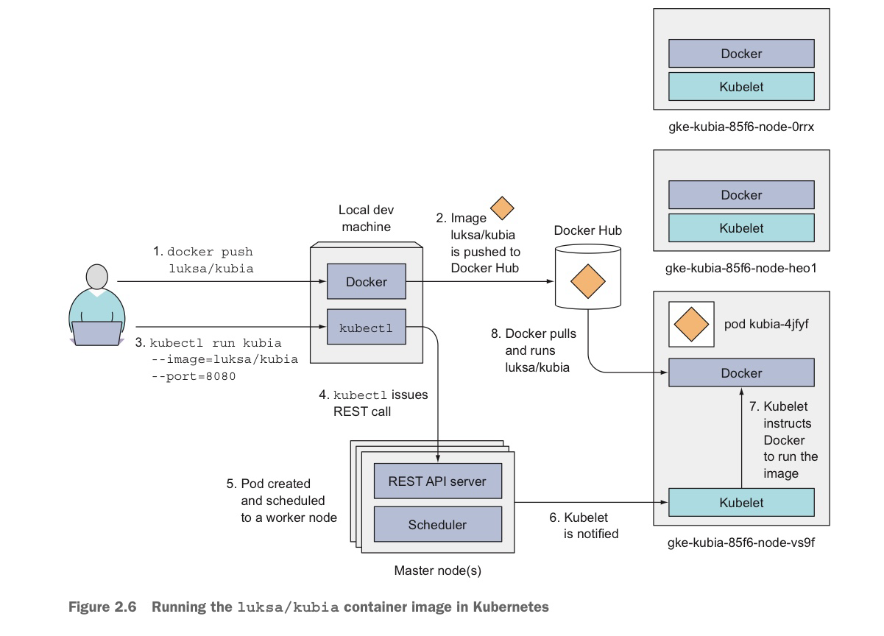
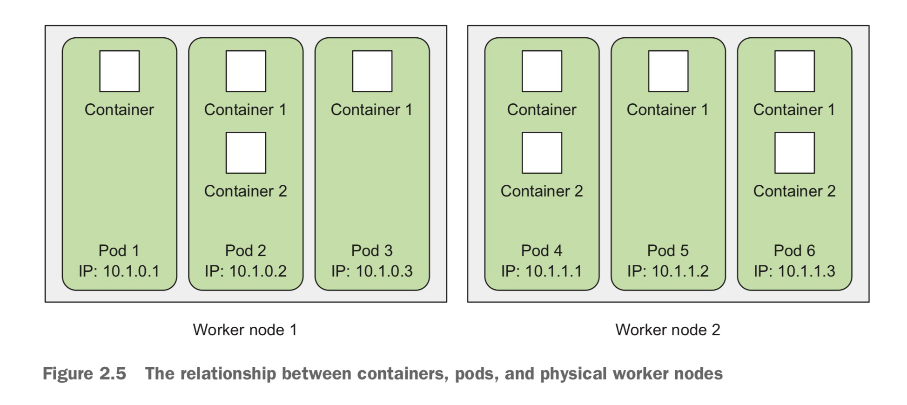
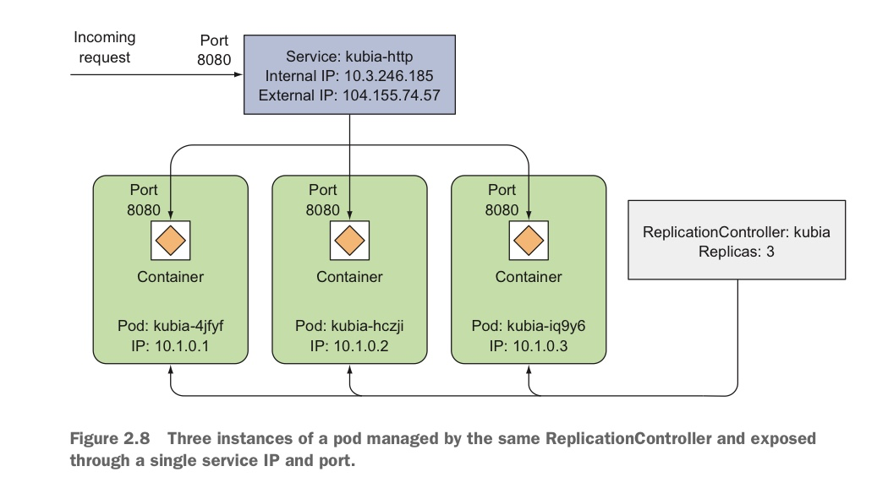

In this post, chapter 2 of Kubernetes in Action is introduced. 


# 2.1 Creating, running, and sharing a container image

MacOS에서 docker를 설치하면 linux VM 안에서 docker daemon이 실행되고, 유저는 host OS에서 docker client를 이용해 docker를 이용할 수 있다. Docker를 설치한 후 다음 커맨드를 입력했을 때 벌어지는 일을 살펴보자.

```zsh 
docker run busybox echo "Hello world"  
```

docekr는 우선 busybox image가 로컬 머신에 있는지 확인한다. 없으므로, Docker Hub Registry에서 image를 pull 한다. 도커는 image로부터 컨테이너를 만들고 echo 명령어를 실행한다. 

이제, Dockerfile을 이용하여 image를 만들고, 이 이미지로 만든 container에서 node.js app이 실행되게 해보자. 

#### Creating a trivial Node.js app

우선, 다음과 같은 node.js파일 app.js를 작성한다. 

```js
const http = require('http'); // HTTP 서버 만들때 이용
const os = require('os'); // node.js 프로세스가 실행중인 운영체제에 관한 정보를 가져올 수 있는 메서드, 속성 제공

console.log("Kubia server starting...")

var handler = function(request, response) {
  console.log("Received request from " + request.connection.remoteAddress);
  response.writeHead(200);
  response.end("You've hit " + os.hostname() + "\n"); // os.hostname : 이 프로세스가 실행중인 컨테이너의 hostname
};
var www = http.createServer(handler); // HTTP 서버 객체 생성(handler 등록)
www.listen(8080); // 8080 포트에서 요청대기
```

📖 **Port**

네트워크에서 한 컴퓨터(=IP 주소) 안에 여러 프로그램이 동시에 통신할 수 있도록 구분하는 논리적 번호이다. (Ex. 80 → HTTP 서버, 22 → SSH) 즉, 포트는 **소켓(socket)** 이라는 "프로세스별 네트워크 통신 창구"에 붙는 번호이다. OS 커널은 TCP/UDP 스택을 관리한다. 프로세스가 `bind(8080)` 하면 커널은 "이 프로세스는 이제 8080번 포트로 들어오는 TCP 연결을 처리 (커널 내부 자료구조)"라고 기록한다. 클라이언트가 이 컴퓨터의 8080포트로 패킷을 보내면 커널이 해당 프로세스로 그 패킷(01 비트들의 집합)을 전달한다. 즉, 단계별로 정리하면 아래와 같다. 

1. **소켓 생성**

- 유저 프로세스가 `socket()` 시스템 콜 호출
- 커널이 `struct socket` 자료구조를 메모리에 생성하고, 파일 디스크립터(fd)를 반환

2. **주소 바인딩**

- `bind(fd, IP:port)` → 커널이 "이 소켓은 192.168.0.10:8080 담당”이라고 기록

3. **연결 & 통신**

- `listen()`, `accept()` → 서버 소켓 준비
- `connect()` → 클라이언트 연결
- 이후 `send()`, `recv()` → 커널 TCP/IP 스택이 소켓을 통해 패킷 송수신

4. **해제**

- `close(fd)` → 커널이 `struct socket` 자료구조를 제거

Docker 컨테이너는 **리눅스 네임스페이스**로 네트워크가 격리되어 있다. 그래서 컨테이너 안에서 `app.listen(8080)` 하면, 그건 컨테이너 네트워크 공간의 8080 포트를 의미한다. 예를 들어 컨테이너에서 다음 프로세스가 실행된다고 해보자.

```js
const http = require('http');
http.createServer((req, res) => {
  res.end("Hello");
}).listen(8080);
```

Node.js가 내부적으로 `socket() → bind() → listen()` 시스템 콜을 호출한다. 그러면 컨테이너 네트워크 네임스페이스 안에서 포트 8080을 사용하는 소켓이 호스트 커널에 등록된다(커널이 "이 소켓은 이 네임스페이스 안의 0.0.0.0 IP, 8080 포트를 담당한다."고 기록)

호스트에서는 컨테이너의 8080 포트를 바로 볼 수 없기 때문에 **포트 포워딩**(port mapping)을 해주는 게 `-p 8080:8080` 옵션이다.

#### Creating a Dockerfile for the image

**Dockerfile**은 docker가 image를 만들때 수행할 명령어의 모음이다. 위 예제의 app.js와 같은 디렉터리에 있어야 한다.

```dockerfile
FROM node:7
ADD app.js /app.js
ENTRYPOINT ["node", "app.js"]
```

- `FROM` : base image를 지정한다.
- `ADD` : local directory의 app.js를 image의 root directory 아래에 같은 이름으로 저장한다.
- `ENTRYPOINT` : image를 run했을 때 실행될 명령어를 지정한다.  

#### Building the container image

이제 아래의 명령어를 통해 image를 생성한다.

```bash
docker build -t kubia .
```

Docker에게 kubia라는 이름의 image를 현재 디렉터리의 Dockerfile을 이용하여 만들어달라는 명령어이다. Build 프로세스는 docker client가 아닌 docker daemon에서 일어나는 작업으로 현재 디렉터리의 모든 내용이 docker daemon에 업로드 되고 이 정보를 바탕으로 docker daemon이 이미지를 만든다. (docker client와 daemon이 반드시 같은 machine에 있을 필요는 없다.)

❗Dockerfile이 만들어내는 image는 single layer가 아니라, dockerfile의 각 command가 하나의 레이어를 형성하게 된다. 

image를 build 한 후, 다음 명령어를 통해 만들어진 image를 확인할 수 있다. 

```bash
docker images
```

Dockerfile을 이용하지 않고도 image를 만들 수 있다. 이미 존재하는 image로 컨테이터를 실행한 다음, 여러가지 커맨드를 실행하고 컨테이너에서 exit 한 후 최종 상태를 새로운 image로 만들면 된다. Dockerfile을 이용하면 이 과정이 자동적으로 수행되는 것이다. 

#### Running the container image

다음의 명령어로 image 로부터 컨테이너를 실행할 수 있다.

```bash
docker run --name kubia-container -p 8080:8080 -d kubia # port는 host:container 순
```

위와 같이 컨테이너를 실행하면, local machine의 8080 포트가 컨테이너의 8080포트와 연결되므로, http://localhost:8080 (local machine port) 에서 app에 access 할 수 있게 된다. 아래의 명령어로 확인할 수 있다. 

```bash
curl localhost:8080
You've hit 3abf6a9e4185 # 3abf6a9e4185는 컨테이너 hostname
```

다음의 명령어로 현재 실행중인 컨테이너 정보를 볼 수 있다.

```bash
docker ps
```

#### Exploring the inside of a running container

하나의 컨테이너 내에서 여러 프로세스가 동작할 수 있다. 따라서, shell 프로그램도 프로세스로서 수행될 수 있다. 이 때의 shell은 컨테이너의 namespace를 기준으로 파일 구조 등을 보여주는 shell 프로그램이다. shell에서 명령을 실행시, host 커널에서 시스템 콜을 처리하지만 컨테이너의 namespace 맥락에서 동작하게 된다. 

다음의 명령어로 컨테이너 안에서 bash shell을 수행할 수 있다. (이는 Node.js image가 bash shell을 포함하기 때문에 가능한 것)

```bash
docker exec -it kubia-container bash
```

위에서 `-it` 옵션은 필수적이다. 

- `-i` 옵션은 STDIN 을 계속 열려 있게 한다, 이 옵션이 없다면, 키보드 입력을 받을 수 없다.
- `-t` 옵션은 pseudo terminal(TTY)를 display한다. 이 옵션이 없다면, 프롬프트가 보이지 않을 것이다.

이렇게 컨테이너 안의 bash shell에서 ps aux를 통해 확인한 app.js의 PID와, host bash shell에서 ps aux를 통해 확인한 app.js의 PID는 다름을 확인할 수 있다. 즉, 프로세스는 컨테이너와 host에서 다른 ID를 갖는다. 

❗하나의 process는 여러 PID namespace에 동시에 속할 수 있다. 

exit을 통해 host machine으로 돌아올 수 있다. 

#### Stopping and removing a container

다음의 명령어를 통해 컨테이너에서 실행 중인 프로세스를 종료하고 결과적으로 컨테이너를 stop 할 수 있다(실행중인 프로세스가 없는 컨테이너를 container stop으로 정의한다). 

```bash
docker stop kubia-container
```

컨테이너를 stop 해도 컨테이너는 남아있게 되는데, 다음의 명령어로 삭제할 수 있다. 

```bash
docker rm kubia-container
```

#### Pusing the Image to Docker Hub

Docker hub의 규정에 맞게 image 이름을 수정한 다음 (docker tag 명령어 이용), 다음의 명령어를 이용해 docker hub에 image를 push 할 수 있다. 

```bash
docker push luksa/kubia
```


# 2.2 Setting up a Kubernetes cluster

#### Running a local single-node Kubernetes cluster with Minikube

**Minikube** 는 로컬 머신에 k8s single-node 클러스터를 띄워주는 툴이다. single-node 클러스터란, Control Plane 과 Worker 역할이 하나의 노드 안에 같이 들어있는 것을 의미한다. 우선, 다음을 설치해야 한다. 

- **Minikube** : 위에 설명.
- **VirtualBox or KVM** : Minikube는 VM 안에서 Kubernetes를 실행하므로(driver 설정으로 docker를 사용하게 할 수도 있음) 설치해야 한다.
- **KUBECTL** : kubectl은 k8s 클러스터(master node)와 상호작용하는 명령줄 client 이다. 

(다른 옵션 : **GKE** 는 Google Cloud 위에서 동작하는 Kubernetes 클러스터 서비스로 control plane과 worker 노드를 클라우드 상에서 제공해주고 사용자는 kubectl을 이용해 상호작용할 수 있다. )

설치 후, 다음 명령어를 통해 minikube를 실행한다.

```bash
minikube start
```

이제, kubectl을 이용해 k8s 클러스터를 조작한다. 아래 명령어를 이용해 존재하는 노드들을 확인한다.

```bash
kubectl get nodes
```

#### Deploying Node.js app

다음의 명령어를 통해 위에서 만든 app.js를 배포할 수 있다. 

```bash
kubectl run kubia --image=luksa/kubia --port=8080 --generator=run/v1 #구버전
kubectl run kubia --image=luksa/kubia --port=8080 # 최신 버전에서는 replicationcontrolloer 기능 없어짐. 단일 pod만 생성
```

- `kubia` : 만들어진 ReplicationController (후에 설명) 의 이름
- `--image=kubia` : 사용할 컨테이너 image. 이때의 image는 Docker hub에서 pull 하므로 docker hub에 등재된 image name.
- `--port=8080` : 내 service (app.js)가 컨테이너 안에서 8080 포트로 요청을 받고 있음 (worker 노드의 포트 아님)
- `--generator=run/v1` : Deployment 대신, ReplicationController를 생성하게 함 (후에 설명)



#### Introducingi Pods

**Pod** 이란, 강하게 연관된 컨테이너들의 집합을 의미한다. 강하게 연관되어 있다는 것은 다음 두 가지를 동시에 만족함을 의미한다.

- 같은 worker node에서 실행된다.
- 같은 Linux namespace를 가진다.

각각의 pod은 고유의 IP, hostname, processes 를 가진 구분된 machine 처럼 동작한다. 즉, 같은 pod에 속한 컨테이너들은 같은 머신에서 동작하는 것처럼 보이고, 다른 pod에 속한 컨테이너들은 같은 worker 노드에 있더라도 다른 머신에서 동작하는 것처럼 보인다. 



❓이럴거면 하나의 컨테이너로 쓰지 컨테이너를 나누고 굳이 pod으로 쓰는 이유가 뭘까? (Chap3에 소개)

다음의 명령어로 pod을 확인할 수 있다. 

```bash
kubectl get pods
```

처음에는 REDAY가 0/1로 나타나는데, 이는 컨테이너 이미지 pull이 완료되지 않았기 때문이다. 완료되면, pod의 컨테이너 1개가 실행되고 1/1로 바뀐다. 

#### Accessing the web applicatoin

(컨테이너 포트의 경우와 유사하게) Pod의 IP는 클러스터 내부의 값이므로 외부에서 직접 접근할 수 없다. 따라서, `LoadBalancer` type의 service를 만들고, 이 로드 밸런서의 public IP에 pod을 연결할 수 있다. 

📖 **Load Balancer**

로드 밸런서(load balancer)는 **부하 분산 장치**, 즉 **요청(트래픽)을 여러 서버에 고르게 나눠주는 시스템**을 말한다. 사용자(클라이언트)는 여러 서버가 있다는 사실을 모르는 상태에서 단 하나의 주소(Ex. `www.example.com`)로 접속하고, 로드 밸런서가 뒤에 있는 여러 서버 중 하나로 요청을 전달한다.

```bash
kubectl expose rc kubia --type=LoadBalancer --name=kubia-http #구버전
kubectl expose pod kubia --type=LoadBalancer --name=kubia-http --port=8080 --target-port=8080
# rc가 없어진 최신 버전에서는 kubia가 단일 pod 이었으므로.
```

- `kubectl expose` : Pod, Deployment, ReplicaSet 등의 리소스에 대해 Service를 생성하는 명령. 해당 리소스를 네트워크 상에 노출시켜 접근 가능하게 만든다. 이 명령은 결국 **Service** 오브젝트를 생성한다. 

- `pod kubia` : `kubia`라는 Pod를 기준으로 Service를 만든다는 의미. 즉, 이 Pod를 백엔드로 연결하는 LoadBalancer가 만들어진다.

- `--type=LoadBalancer` : Service의 타입을 지정한다. 

- `--name=kubia-http` : 생성될 Service의 이름을 `kubia-http`로 지정한다. 즉, 새로운 리소스 이름이 `service/kubia-http`가 된다.

- `--port=8080` : Service가 클라이언트에게 열어줄 포트이다. 사용자가 `http://<External-IP>:8080` 으로 접근한다.

- `--target-port=8080` : Service가 내부적으로 Pod 컨테이너에 연결할 실제 포트이다. 즉, Pod 안의 컨테이너가 리스닝하고 있는 포트 번호.

  ❗외부 → 로드밸런서 → 워커 노드 → Pod 의 흐름에서 로드밸런서와 Pod의 포트가 명시되어 있고 워커 노드의 포트는 랜덤으로 할당된다. 

다음의 명령어로 service를 확인할 수 있다. (Minikube의 경우 laodbalancer service를 지원하지 않는다.)

```bash
kubectl get services
```

정리하면, ReplicationController는 같은 역할을 하는 Pod을 복제한다. Pod은 여러 가지 이유로 사라질 수 있는데 이때 ReplicationController가 이를 새 Pod으로 교체한다. 이때 새로운 Pod은 이전과 다른 IP 주소를 가지게 되고 이를 외부에서 알 수 없으므로  `expose` 명령어를 통해 해당 ReplicationController가 관리하는 모든 Pod들에 대응되는 Load Balancer 서비스를 만든 것이고, 이 서비스의 IP로 외부에서 접속하면 서비스는 해당 pod 중 하나와 연결되게 한다. 

다음의 명령어를 이용해 pod의 3개 instance가 만들어지고 실행되게 할 수 있다. 

```bash
kubectl scale rc kubia --replicas=3 # 구버전. 이제 rc 지원 X
```



Pod들이 각각 어느 node에 스케쥴링 되었는지는 일반적으로 중요하지 않다. 서로 다른 노드에 있는 Pod들끼리도 IP를 통해 통신할 수 있다. 

#### k8s dashboard

Minikube에서 다음의 명령어를 입력하면 브라우저에서 k8s GUI dashboard가 보인다. 

```bash
minikube dashboard
```

