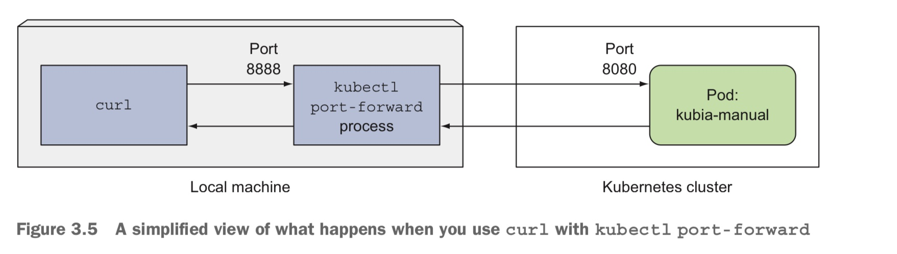

In this post, chapter 3 of Kubernetes in Action is introduced. 


# 3.1 Introducing pods

#### Why we need pods

하나의 컨테이너에서는 하나의 프로세스만 실행하는 것이 권장된다. 하나의 컨테이너에서 여러 프로세스를 실행했을 때, 프로세스들 간 충돌을 직접 해결해야 하고, 여러 프로세스가 stdout에 찍는 log를 구분하기 힘들어진다. 여러 컨테이너들의 집합으로 이루어진 Pod은 서로 연관된 프로세스들이 거의 같은 환경에서 실행되게 하면서도 동시에 독립되게 한다. 

#### Partial Isolation between containers of the same pod

- k8s는 하나의 pod안에 있는 컨테이너들이 같은 Linux namespace를 공유하도록 docker를 configure한다. 즉, 같은 network, UTS namespace를 가지므로 컨테이너들은 같은 hostname과 network interface를 갖는다. 또한, 같은 IPC(inter process communication) namespace를 가지므로 IPC를 통해 프로세스간 통신이 가능하다. 

- 하지만 컨테이너의 filesystem은 컨테이너 image에 포함된 경우가 많으므로, 각 컨테이너들의 filesystem은 격리된다. 하지만 k8s의 Volume을 이용하면 공유가 가능하다.(Chap 6)
- 같은 pod의 컨테이너들은 같은 network namespace를 가지므로 같은 IP 주소와, 포트 공간을 가진다. 따라서, 같은 pod의 컨테이너들은 같은 포트에 바인딩 되어서는 안된다. 또한, 같은 pod의 컨테이너들은 localhost를 통해 통신할 수 있다. 

​	❓**pod의 포트 = 컨테이너에서 앱이 리슨하는 포트?**

​	Pod 레벨에서 보면, 컨테이너 포트 `80`은 사실상 `Pod_IP:80`으로 노출된 것처럼 동작.

​	하지만 여전히 **다른 Pod에서 직접 접근하려면 Pod IP를 알아야** 하고, **Service**로 노출하지 않으면 외부 접근은 불가능.

#### Using multiple pods

프런트, 백 서버를 하나의 pod에 2개의 컨테이너로 넣는 것은 다음의 이유들로 좋지 않은 선택이다. 

- 메모리 자원을 효율적으로 사용하지 못한다. 예를 들어, 워커 노드가 2개일때, 하나의 워커 노드만을 사용하게 되어 다른 하나의 cpu, memory 자원을 활용하지 못한다. 
- Scaling 과정이 비효율적이다. pod의 개수를 2개로 scale up할때, 프런트, 백 서버가 모두 2개씩 만들어진다. 하지만, 프런트와 백 서버는 scaling 요구사항이 다르다.

반면 애플리케이션이 하나의 main process (Ex. 특정 파일 디렉터리에서 파일을 제공하는 웹 서버) 와 몇개의 complementary process (Ex. 외부에서 content를 다운로드 하여 웹 서버의 디렉터리에 저장) 로 구성될 때는 하나의 pod에 여러 컨테이너를 사용한다.

# 3.2 Creating pods from YAML or JSON

Chap 2에서처럼 `kubectl run` 커맨드를 이용하여 pod을 생성할 수 있지만 다양한 property를 설정하기 위해서 JSON, YAML를 작성하여 k8s API 서버에 요청을 보낼 수 있다. 

다음 명령어로 chap 2에서 만든 pod에 대한 YAML definition을 확인할 수 있다, 

```bash
kubectl get pod kubia -o yaml
```

#### Creating a simple YAML descriptor for a pod

```bash
# kubia-manual.yaml
apiVersion: v1
kind: Pod
metadata:
 name: kubia-manual
spec:
 containers:
 - image: luksa/kubia
   name: kubia
   ports:
   - containerPort: 8080 # the port the app is listening on
     protocol: TCP
```

k8s 리소스에 대한 YAML 파일 작성시 구성 요소는 다음과 같다. 

- apiVersion : k8s API 서버가 제공/이해하는 api version
- kind: 생성할 k8s 리소스. 이 경우 Pod.
- metadata: namespace 등의 정보. 
- spec: 컨테이너 정보. 
- status: 실행 중인 pod에 대한 현재의 정보가 담기므로 YAML 생성단계에서는 작성하지 않는다. 

작성한 YAML 파일로부터 pod을 만들기 위해 다음 명령어를 이용한다. 

```bash
kubectl create -f kubia-manual.yaml
```

#### Retrieving a pod's log

애플리케이션은 일반적으로 stdout에 log를 찍는데, docker runtime은 이를 file로 redirect한다. 다음의 명령어로 해당 log를 확인할 수 있다. 

```bash
kubectl logs kubia-manual
```

만약 pod 안에서 여러 개의 컨테이너가 실행 중이라면 다음과 같이 컨테이너 이름을 명시해야 한다.

```bash
kubectl logs kubia-manual -c kubia
```

#### Forwarding a local newtwork port to a port in the pod

Chap 2에서 다룬 service를 이용하지 않고 pod에 access하기 위해서는 다음과 같이 포트 포워딩을 이용한다. 

```bash
kubectl port-forward kubia-manual 8888:8080
```

❗이 때의 포트 8888번은 워커 노드의 포트가 아니라 kubectl이 있는 로컬 머신의 포트이다. 8080은 pod의 8080 포트이다.




# 3.3 Organizing pods with labels

#### Label

Label이란 k8s 리소스들에 붙이는 key-value pair 이다. label을 통해 여러 개의 pod을 구분/구조화할 수 있다. 

```bash
# kubia-manual-with-labels.yaml
apiVersion: v1
kind: Pod
metadata:
 name: kubia-manual-v2
 labels:
  creation_method: manual # label
  env: prod # label
spec:
 containers:
 - image: luksa/kubia
   name: kubia
   ports:
   - containerPort: 8080 
     protocol: TCP
```

```bash
kubectl create -f kubia-manual-with-labels.yaml
kubectl get pod --show-labels # pod들의 label 표시
kubectl get pod -L creation_method,env # pod들의 해당 label key의 value 값 보여줌
kubectl label pod kubia-manual creation_method=manual # 기존 pod 신규 label 추가
kubectl label pod kubia-manual-v2 env-debug --overwrite # 기존 pod 기존 label 수정

kubectl get pod -l env # env label 포함하는 pod만 보여줌
kubectl get pod -l '!env' # env label 포함하지 않는 pod만 보여줌
kubectl get pod -l env!=prod # env가 prod가 아닌 pod만 보여줌
kubectl get pod -l env in (prod, devel) # env가 prod, devel인 pod만 보여줌
kubectl get pod -l env notin (prod, devel) # env가 prod, devel가 아닌 pod만 보여줌
```

# 3.5 Using labels and selectors to constrain pod scheduling

일반적으로 pod이 어느 노드로 배정되는지는 중요하지 않지만 다음의 경우에는 고려가 필요할 수 있다.

- 워커 노드들간의 하드웨어 인프라가 상이한 경우. 한쪽은 spinning harddrive, 한쪽은 ssd를 사용할때 특정 pod을 특정 노드에 배정하고 싶을 수 있다.
- pod이 GPU-based 연산을 많이 사용할때, 이를 지원할 수 있는 노드에 배정한다.

```bash
# kubia-gpu.yaml
apiVersion: v1
kind: Pod
metadata:
 name: kubia-gpu
spec:
 nodeSelector:
  gpu: "true" # gpu label이 true인 노드에게만 이 pod을 배정
 containers:
 - image: luksa/kubia
   name: kubia
   ports:
   - containerPort: 8080 
     protocol: TCP
```

# 3.6 Annotating pds

Annotatioin은 label 처럼 key-value pair 이지만 label과 다르게 selector로 선택될 수 없고, 대신 더 큰 단위의 정보를 저장할 수 있다. 

```bash
kubectl annotate pod kubia-manual mycompany.com/someannotation="foo bar"
```

# 3.7 Using namespaces to group resources

k8s namespace를 이용하면 여러 리소스들의 이름의 범위를 규정할 수 있다. k8s namespace는 chap 2에서 프로세스들을 격리하기 위해 다룬 Linux namespace와 다른 것이다. 여러 리소스들이 다른 k8s namespace에 속해 있다면 같은 이름을 가질 수 있다. 여러 유저들이 k8s 클러스터를 관리하는데 각각이 특정 리소스들만을 관리할 때 관리할 리소스들을 namespace로 구분해 놓을 수 있다. (label로 구분하면 label에 따라 overlap 될 수 있음. 예를 들어, app label에 대해서는 A, B가 묶이고 C는 값이 다른 반면 gpu label에 대해서는 A, C가 묶이는 식) 이 외에도 namespace는 특정 유저들이 특정 리소스에 접근 가능하게 제한하고 각 유저들이 사용할 수 있는 컴퓨팅 자원을 제한하는 데에도 이용된다. (chap 12~14)

❗ 노드 리소스는 특정 namespace에 속할 수 없어 전역적으로 이름이 사용된다.

#### Discovering other namespaces and their pods

다음 명령어를 입력하면 k8s defualt namepsapce의 리소스들이 나타난다. 

```bash
kubectl get ns
```

k8s에는 default 외에 `kube-public` , `kube-system` namespace가 있고, 다음은 `cube-system` namespace에 속한 pod 리소스를 나타내는 명령어이다.

```bash
kubectl get pod --namespace kube-system
```

#### Creating a namespace from a YAML file

```bash
# custom-namespace.yaml
apiVersion: v1
kind: Namespace
metadata:
 name: custom-namespace
```

위와 같이 namespace를 정의하는 YAML 파일을 만들고 아래의 명령어로 이를 k8s API 서버로 요청한다.

```bash
kubectl create -f custom-namespace.yaml
```

YAML 파일 대신 다음의 명령어를 이용할 수도 있다.

```bash
kubectl create namespace custom-namespace
```

이제 pod을 만들고 이를 해당 namespace에 속하게 하려면 아래처럼 할 수 있다.

```bash
kubectl create -f kubia-manual.yaml -n custom-namespace
```

❗다른 k8s namespace의 pod들도 k8s networking solution이 inter0namespace entwork isoloation을 제공하지 않는다면, IP 주소를 이용해 HTTP 요청을 보내고 통신할 수 있다. 

# 3.8 Stopping and removing pods

#### Deleting a pod by name

다음의 명령어로 pod의 이름으로 pod을 삭제하면, k8s는 pod에 속해 있는 컨테이너들을 모두 종료한다.

```bash
kubectl delete pod kubia-gpu
```

#### Deleting pods using label selectors

```bash
kubectl delete pod -l creation_method=manual
```

#### Deleting pods by deleting the whole namespace

```bash
kubectl delete ns custom-namespace
```

#### Deleting all pods in a namespace, while keeping the namespace

아래 명령어를 통해 현재 namespace (appendix A) 에 존재하는 모든 pod을 삭제한다. 

```bash
kubectl delete pod --all
```

하지만 RecpicationController를 통해 pod을 삭제한 경우, pod을 지울 때마다 새로운 Pod이 생성된다. 이 경우, rc 자체를 지워야 한다.

#### Deleting almost all resources in a namespace

```bash
kubectl delete all --all # 현재 namespace의 모든 리소스 (pod, rc, service 등) 삭제
# 첫번째 all은 모든 리소스 type의미, --all은 모든 이름 의미
```


