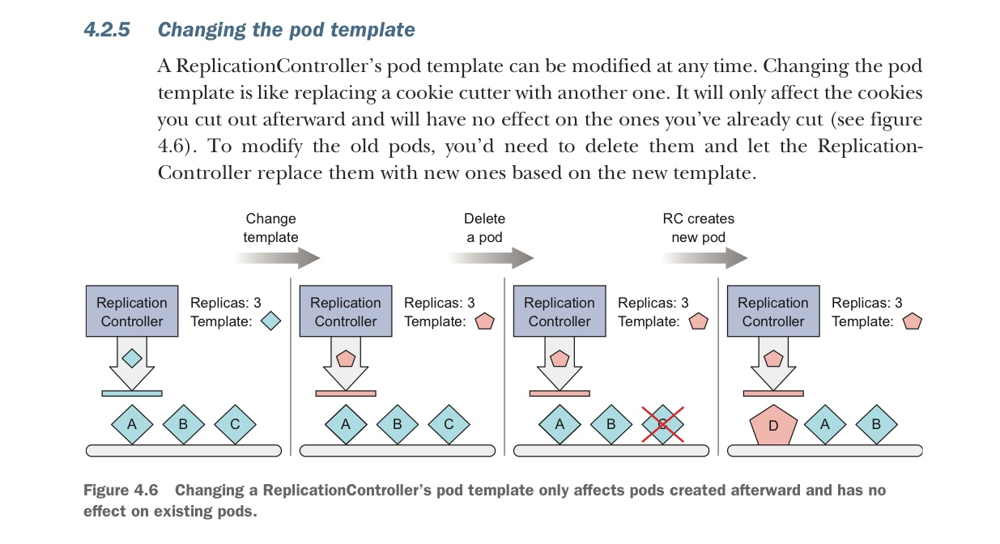

In this post, chapter 4 of Kubernetes in Action is introduced. 


# 4.1 Keeping pods healthy

❗4.1에서는 컨테이너에 문제가 생겼을 때, Pod을 자동으로 재시작하는 법을 배운다. ReplicationController는 현재 지원되지 않는 기능이지만 k8s 이해 차원에서 공부한다.

chap 3에서 pod을 만들고 관리하는 법을 배웠지만, 우리는 이 pod이 자동적으로 유지되기를 원한다. 

Pod이 노드에 배정되고 나면 해당 노드의 Kublet이 pod의 컨테이너를 실행하고, 컨테이너의 main 프로세스 crash가 발생했을 때 컨테이너를 재시작하게 하는 역할을 담당한다. 하지만 애플리케이션은 프로세스 crash가 발생하지 않더라도 기능적으로 동작하지 않는 상태가 될 수 있다. 예를 들어, Java app의 경우 메모리 누수가 발생하면 OutOfMemoryErrors 가 발생하는데 JVM은 프로세스를 계속 실행한다. (이 경우 앱 내부적으로 해당 에러가 발생하면 프로세스 자체를 종료하는 로직을 구현하면 kublet에 의해 컨테이너가 재시작 될 수는 있다) 또는, 앱이 무한 루프에 빠지는 경우가 있을 수 있다. 따라서, 앱 내부가 아닌 외부에서 현재 애플리케이션의 상태를 체크할 필요가 있다. 

#### Introducing liveness probes

k8s에서는 liveness probes를 이용하여 주기적으로 외부에서 pod의 상태를 체크하고 필요할 경우 컨테이너를 재시작할 수 있다. 이를 pod이 배정된 노드의 kublet에서 담당한다. 다음 세 가지 방식의 체크가 가능하다. 

- HTTP GET probe : 컨테이너 IP의 정해진 포트로 HTTP GET 요청을 보낸다.
- TCP Socket probe : 컨테이너의 정해진 포트로 TCP 연결 open을 시도한다. 
- Exec probe : 컨테이너 내부에서 특정 커맨드를 실행하여 커맨드의 exit status code를 확인한다.

#### Creating an HTTP-based liveness probe

다음과 같이 pod을 정의하는 YAML 파일에  HTTP livness probe를 작성할 수 있다.

```bash
# kubia-liveness-probe.yaml 
apiVersion: v1
kind: pod
metadata:
 name: kubia-liveness
spec:
 containers:
 - image: luksa/kubia-unhealthy
   name: kubia
   livenessProbe:
    httpGET:
     path: /
     port: 8080 # http get을 시도할 컨테이너 포트
```

❗다음 커맨드를 통해 현재 pod의 상태 (probe에 의해 종료되었던 history 등)을 확인할 수 있다.

```bash
kubectl describe pod kubia-livenss
```

#### Configuring additional properties of the liveness probe 

livenessProbe와 관련해 세부적인 property를 작성할 수  있다. 

```bash
# kubia-liveness-probe.yaml 중
livenessProbe:
 httpGet:
  path: /
  port: 8080
 initialDelaySeconds: 15
```

initialDelaySeconds는 컨테이너가 생성되고 나서 첫 probe를 하기까지 걸리는 시간을 정의한다. 이 값을 설정하지 않으면, 컨테이너 시작과 동시에 probe를 시도하는데, 앱이 http request를 받을 준비가 안되어 있는 상태에서 fail이 나버리고 이로 인해 컨테이너가 계속 재시작되는 일이 발생할 수 있다. 

❗이 외에도 probe 주기 (period=10s), 컨테이너를 재시작하는 기준이 되는 연속 실패 횟수 (#failure=3) 등을 설정할 수 있다. 

다음은 몇가지 주의사항이다. 

- probe가 감지하는 fail이 앱 내부적 요인에 의한 것만이 되도록 설정해야 한다. 예를 들어, 웹 서버의 경우에 백 엔드 db와 연결이 불가할 때 이를 livenessProbe에서 fail로 인지하게 설정하면, 실제로는 백 엔드 pod의 문제인데 웹 서버 컨테이너를 계속 재시작하게 된다.
- probe과정에서 차지되는 cpu time은 컨테이너에 배정된 cpu time에 포함되므로, probe 과정이 너무 무거우면 실제 앱 프로세스가 차지하는 cpu time이 줄어들 수 있다. 

# 4.2 Introducing ReplicationControllers

❗4.2에서는 노드 등의 문제로 Pod자체가 접근 불가능할 때, 새로운 pod을 자동으로 다시 배정하는 법을 배운다.

k8s에서는 probe를 통해 컨테이너를 자동으로 재시작하는 것은 순수 해당 노드의 kublet의 역할이고 Control Plane과는 관계가 없다. 따라서, 해당 노드 자체가 crash 되면 Control Plane이 해당 노드에 존재하던 pod들에 대해 새로운 노드를 배정해야 한다. 하지만 이 pod들은 모두 kublet에 의해 관리되고 있었기 때문에 정확히 같은 pod들에 대해 위 작업을 진행할 수 없다. 이 대목에서 ReplicationController가 필요하다. 

ReplicationController(RC)는 **마스터 노드(=Control Plane)에 존재하는 컨트롤러 매니저(`kube-controller-manager`) 내부**에서 동작한다. RC는 실행 중인 pod들의 개수를 모니터링 하여 그 개수가 설정된 것보다 많으면 pod을 삭제하고, 적으면 새 pod을 생성한다. pod의 개수가 원하는 수보다 많은 경우는 다음의 이유들로 발생 가능하다.

- 누군가 (rc를 통하지 않고) 직접 pod을 생성한 경우
- 기존 pod의 type (label)을 변경한 경우
- rc에 설정된 이상적인 pod 개수를 줄인 경우

#### Three pars of a RC

Rc는 다음 3개의 요소로 구성된다. 

- label selector : 어떤 label을 가진 pod들이 해당 rc의 관리 대상이 되는지를 설정
- replica count : 이상적인 pod 개수
- pod template : 새로운 Pod을 생성해야할 때 사용하는 템플릿

#### Creating a RC

k8s의 다른 리소스들과 마찬가지로 rc는 YAML 파일을 api server에 전달하여 만들 수 있다. 

```bash
# kubia-rc.yaml
apiVersion: v1
kind ReplicationController
metadata:
 name: kubia
spec:
 replicas: 3 # pod 개수 (replica count)
 selector:
  app: kubia # rc의 대상이 되는 pod들의 label (label selector)
 template: # 새로 만들 pod의 template (pod template)
  metatdata:
   labels:
    app: kubia
  spec:
   containers:
   - name: kubia
     image: luksa/kubia
     ports:
     - containerPort: 8080
```

이제 다음 명령어로 rc를 생성한다.

```bash
kubectl create -f kubia-rc.yaml
```

#### Moving pods in and out of the scopre of a RC

`kubia-dmdck` pod이 `app=foo` 라는 label을 가지고 있어 `kubia-rc` 의 모니터링을 받고 있었다고 가정하자.

```bash
kubectl label pod kubia-dmdck app=foo --overwrite
```

이때, 위와 같이 label의 값을 덮어쓰기하면 이 pod은 더 이상 rc의 모니터링 대상이 아니게 되어, rc는 새로운 pod을 생성하게 된다. 

❗이렇게 pod을 rc 밖으로 빼는 작업은 특정 pod에 디버깅 등의 작업을 할때 필요하다. 그렇지 않으면 rc가 디버깅 과정의 pod에 문제가 생겼다고 생각하여 해당 pod을 삭제해 버릴 수도 있다. 

#### Changing the RC's label selector

Rc의 label selector를 바꾸는 것도 가능하다. 그렇게 되면 현재 모니터링 중인 pod들이 전부 빠지게 될 것이다.(바뀐 label selector를 가지고 있지 않는 한)

#### Changing the pod template

Rc의 label selector를 유지한 채로, template만 변경할 경우 (이 때, template의 기존 label은 반드시 유지한다. template 변경은 다른 spec을 바꾸거나 아니면 label을 추가하는 등의 변경을 의미한다.), 기존의 pod들은 계속 rc가 모니터링 할 것이다. 만약 하나의 pod이 지워지면 이때부터는 변경된 template에 맞는 다른 pod이 만들어져 rc의 모니터링 대상이 될 것이다. 



#### Scaling up a RC

다음 명령어로 replica count를 늘릴 수 있다. 

```bash
kubectl scale rc kubia --replicas=10
```

또는, 다음 명령어로 rc가 정의된 파일을 열어 직접 수정할 수도 있다.

```bash
kubectl edit rc kubia
```

#### Deleting a RC

```bash
kubectl delete rc kubia # rc 안의 pod도 함께 삭제
kubectl delete rc kubia --cascade=false # rc만 삭제. pod은 남겨짐.
```

# 4.3 Using ReplicaSets instead of ReplicastionControllers

RC는 현재 k8s에서 지원하지 않는대신 ReplicaSets이 활발히 사용되고 있다. Rc와 유사하지만 더 다양한 pod selector 조건을 제공한다. 

#### Defining a ReplicaSet

```bash
# kubia-replicaset.yaml
apiVersoiin: apps/v1beta2 # RS는 v1 API 아님!
kind: ReplicaSet
metadata:
 name: kubia
spec:
 replicas: 3
 selector:
  matchLabels: # label이 app=kubia인 pod들을 관리. (rc와 동일)
   app: kubia
  template:
   metadata:
    labels:
     apps: kubia
   spec:
    containers:
    - name: kubia
      image: luksa/kubia
```

selector를 다음과 같이 다르게 설정하는 경우를 보자.

```bash
selector:
 matchExpressions:
  - key: app # app key를 가진 pod을 관리
    operator: In 
    values:
     - kubia # app의 value는 kubia 야함.
```

이 expressions 들을 바꾸어 다양한 selector 조건을 만들 수 있다. 다음은 가능한 operator 값들이다. 

- `In` : label의 value가 values 들 중 하나여야 함.
- `NotIn` : label의 value가 values 들과 일치하면 안됨.
- `Exixts` : 해당 key의 label을 가지고 있어야 함. 이 경우 values는 미제공.
- `DoesNotExist` : 해당 key의 label을 가지고 있지 않아야 함. 이 경우 values는 미제공.

만약, 여러가지 expressions를 동시에 제공하면, 예를 들어 위의 matchLabels expression과 matchExpressions expression을 동시에 제공한 경우, 모두를 참으로 만족시키는 pod들이 대상이 된다.

# 4.4 Running exactly one pod on each node with DaemonSets

pod이 **모든 노드**에서 **하나씩** 실행되기를 원하는 상황이 있을 수 있다. 예를 들어, system-level의 operation을 수행하는 인프라와 관련된 pod들의 경우가 그렇다. log collector가 각 노드에서 실행되어 해당 노드의 리소스들을 모니터하는 경우를 생각해 볼 수 있다. 또 다른 예시로는 k8s kube-proxy process가 있다. 

DaemonSet은 이런 기능을 수행하는 k8s 리소스이다. Rc, Rs와 유사하지만 pod이 배정될 노드를 정하는 스케쥴러(master node)의 단계를 생략하게 된다. DaemonSet은 현재 존재하는 노드의 개수만큼 pod의 개수를 유지한다. 

#### Using a DS to run pods only on certain nodes

Chap 3.5 Using labels and selectors to constrain pod scheduling 에서 봤던 것처럼 DS도 nodeSelector 속성을 이용하여 pod이 특정 노드들에게만 하나씩 수행되게 할 수 있다. 아래 예시는 노드의 disk가 ssd인 노드에게만 pod을 배정하는 DS YAML 파일이다. 

```bash
# ssd-monitor-daemonset.yaml
apiVersoiin: apps/v1beta2 # DS는 v1 API 아님!
kind: DaemonSet
metadata:
 name: ssd-monitor
spec:
 selector:
  matchLabels: 
   app: ssd-monitor
  template:
   metadata:
    labels:
     apps: ssd-monitor
   spec:
    nodeSelector: # !! disk=ssd인 node에게만 배정.
     disk: ssd
    containers:
    - name: kubia
      image: luksa/ssd-monitor
```

# 4.5 Running pods that perform a single completable task

지금까지는 pod이 계속 실행되는 (즉, 끝나지 않는) 경우만 살펴보았다. 때로는 수행을 마친 뒤 프로세스가 종료되는 pod이 필요할 수 있다. ad hoc task들이 그렇다. Job 은 k8s에서 프로세스가 끝나면 재시작 되지 않는 컨테이너들의 pod을 관리하게 해주는 리소스이다. 

- Node failure 발생 시 : rs와 동일하게 해당 pod은 다른 노드에서 다시 생성된다.
- process failure 발생 시 : 컨테이너를 재시작할지 여부를 Job 리소스에서 설정할 수 있다.

#### Defining a Job resource

```bash
# exporter.yaml
apiVersion: batch/v1 # Job은 v1 API 아님!
kind: Job
metatdata:
 name: batch-job
spec:
 template:
  metadata:
   labels:
    app: batch-job
  spec:
   restartPolicy: OnFailure
   containers:
   - name: main
     image: luksa/batch-job
```

위 YAML 파일에서 `restartPolicy` 는컨테이너에서 프로세스의 수행이 완료되었을 때 어떻게 동작할 건지를 설정하는 property이다. 일반적으로 rs, rc 등의 리소스에서 이를 설정하지 않으면 Always 값이 적용되고 이는 항상 재시작 함을 의미한다. 하지만 Job 에서는 (Job 리소스의 취지상 당연하게) Always를 사용할 수 없다. OnFailure는 프로세스 failure시 재시작 한다는 의미이다. 혹은 Never를 사용하여 재시작하지 않을 수 있다.

❗Job 리소스에서는 pod selector를 설정하지 않는다. 즉, 기존의 pod을 택하지 않고 pot template에 맞게 새롭게 생성된다. 

❗`restartPolicy`는 Pod(컨테이너)가 “종료된 후 다시 시작할지”를 제어하는 정책이고, `livenessProbe`는 컨테이너가 “살아있지만 내부적으로 비정상일 때” 재시작시키는 메커니즘이다. 

#### Running multiple pod instances in a Job

Job 리소스 spec에 completions property를 설정하여 Job이 관리하는 pod이 연속적으로 몇 번 수행된 뒤 종료될지를 정할 수 있다. 또한, pallelism property를 설정하여 동시에 수행될 pod의 개수 (반드시 같은 노드에 스케쥴링 될 필요는 없다)를 지정한다. 

```bash
# exporter.yaml
apiVersion: batch/v1 # Job은 v1 API 아님!
kind: Job
metatdata:
 name: batch-job
spec:
 completions: 5
 parallelism: 2
 template:
  <same as before>
```

#### Scaling a Job

다음의 명령어로 parallelism property를 조정할 수 있다.

```bash
kubectl scale job exporter --replicas 3
```

#### Limiting the time allowed for a Job pod to complete

Job 리소스 spec에 `activeDeadlineSeconds` property를 설정하여 pod이 수행되기까지 최대로 기다릴 수 있는 시간을 설정한다. 이 이상 pod이 수행되면 failure로 처리된다.

# 4.6 Scheduling Jobs to run periodically or once in the future

Job은 만들어짐과 동시에 YAML에 정의된 pod들을 만들고 수행한다. 하지만 여러 batch job들이 (해당 job이 관리하는 pod들이) 특정 시간에 함께 그리고 몇 번에 걸쳐 반복적으로 수행되어야 할 필요가 있을 수 있다. Linux 시스템에서 이러한 일들을 cron jobs라고 한다.

CronJob 은 k8s에서 Job의 수행 인터벌과 횟수를 지정할 수 있는 리소스이다. 

#### Creating a CronJob

```bash
# cronjob.yaml
apiVersoiin: apps/v1beta2 # CronJob은 v1 API 아님!
kind: CronJob
metadata:
 name: batch-job-every-fifteen-minutes
spec:
 schedule: "0, 15, 30, 45 * * * *"
 jobTemplate:
  spec:
   template:
    metadata:
     labels:
      app: periodic-batch-job
    spec:
     restartPolicy: OnFailure
     containers:
     - name: main
       image: luksa/batch-job
```

여기서 "0, 15, 30, 45 * * * *"는 매 15분 마다 job을 실행함을 의미한다. 

- "0, 15, 30, 45" : 분 

- 첫 번째 `*` : 매 시간

- 두 번째 `*` : 달의 매 날

- 세 번째 `*` : 매 달

- 네 번째 `*` : 주의 매 요일

- Ex. 매 달 첫번 째 날에 30분 간격으로 = "0, 30 * 1 * *"

  Ex. 매 주 일요일 3AM = "0, 3, *, *, 0" (일요일은 0)

#### Understanding how scheduled jobs are run

Job 리소소들은 CronJob 리소스가 지정한 스케쥴 타임의 근접하여 만들어진다. 그리고 Job들은 pod을 생성한다. 따라서, 실제 pod이 만들어지고 실행되기까지 시간이 많이 걸릴 수 있다. 다음과 같이 `startingDeadlineSeconds` property를 통해 해당 pod이 스케쥴된 시간으로부터 제한 시간 이내에 실행될 수 있도록 강제한다. 그렇지 못하면 Job이 수행되지 않고 fail 처리 된다. 

보통 CronJob은 스케줄에 맞춰 한 번에 **하나의 Job**만 생성하지만, 간혹 클러스터의 스케줄 지연이나 타이밍 문제로 동시에 두 개의 Job이 만들어지거나, 아예 Job이 만들어지지 않는 경우가 있을 수 있다.

**첫 번째 문제(중복 실행)** 를 방지하려면, Job이 “**멱등(idempotent)**” 해야 한다. 즉, 같은 Job이 여러 번 실행돼도 결과가 달라지거나 중복 반영되지 않아야 한다.

- 비멱등 예시: “DB에 데이터 INSERT만 하는 스크립트” → 두 번 실행하면 중복 데이터 발생
- 멱등 예시: “특정 키 기준으로 UPSERT(존재하면 UPDATE, 없으면 INSERT)” → 두 번 실행해도 결과 동일

**두 번째 문제(실행 누락)** 의 경우에는, “다음 Job이 이전에 수행하지 못한 작업을 대신 처리”할 수 있도록 설계해야 한다. 즉, CronJob이 한 번 건너뛰더라도
다음 실행 시 누락된 구간의 데이터를 처리하거나 보정할 수 있어야한다.

- 데이터 백업 Job이라면 → “이전 백업 이후 변경된 데이터만 다시 백업”
- 로그 수집 Job이라면 → “이전 실행 시점 이후의 로그까지 모두 포함해서 수집”


