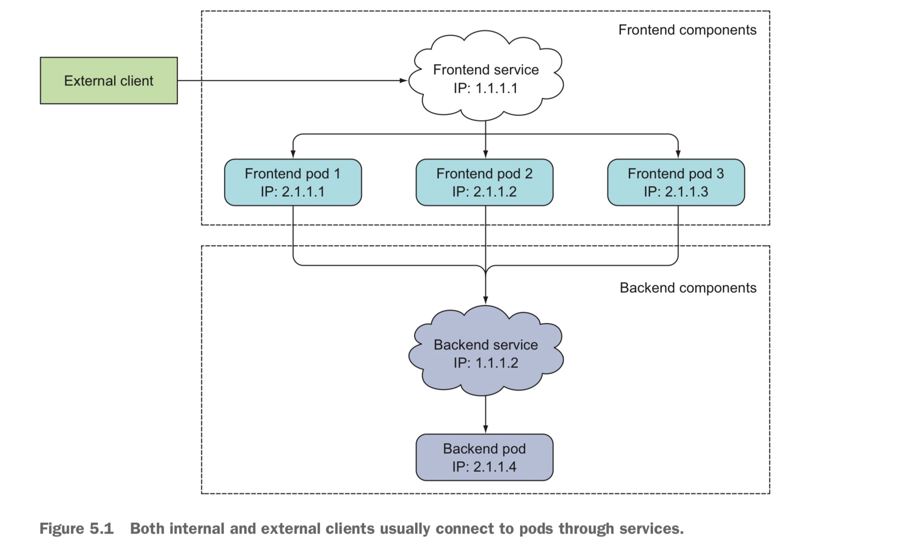
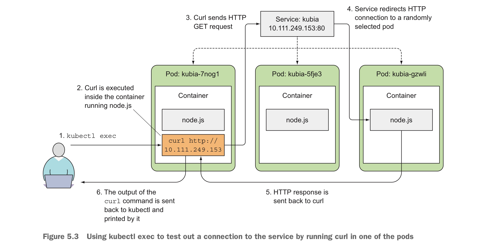
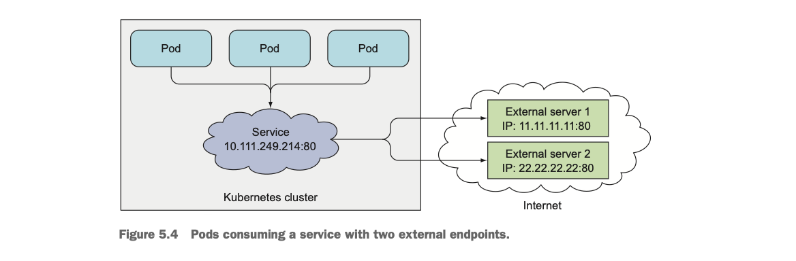
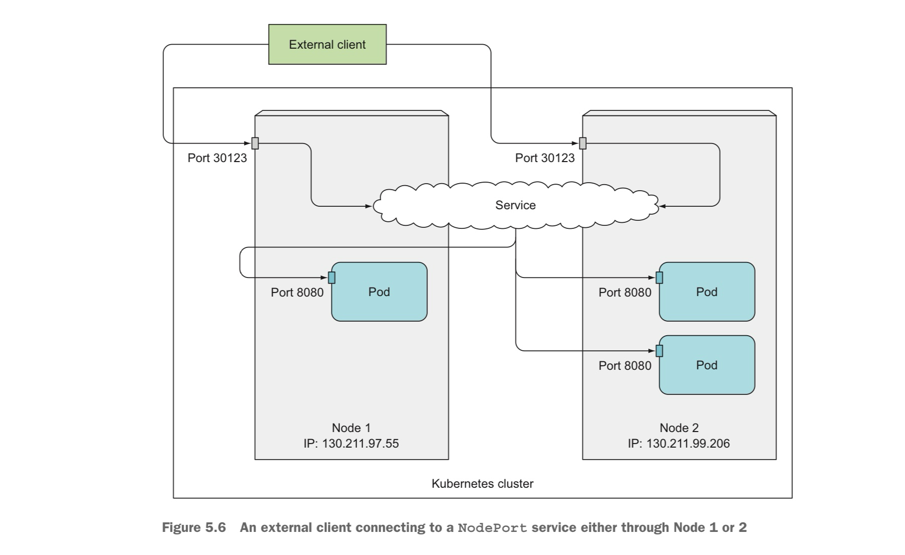
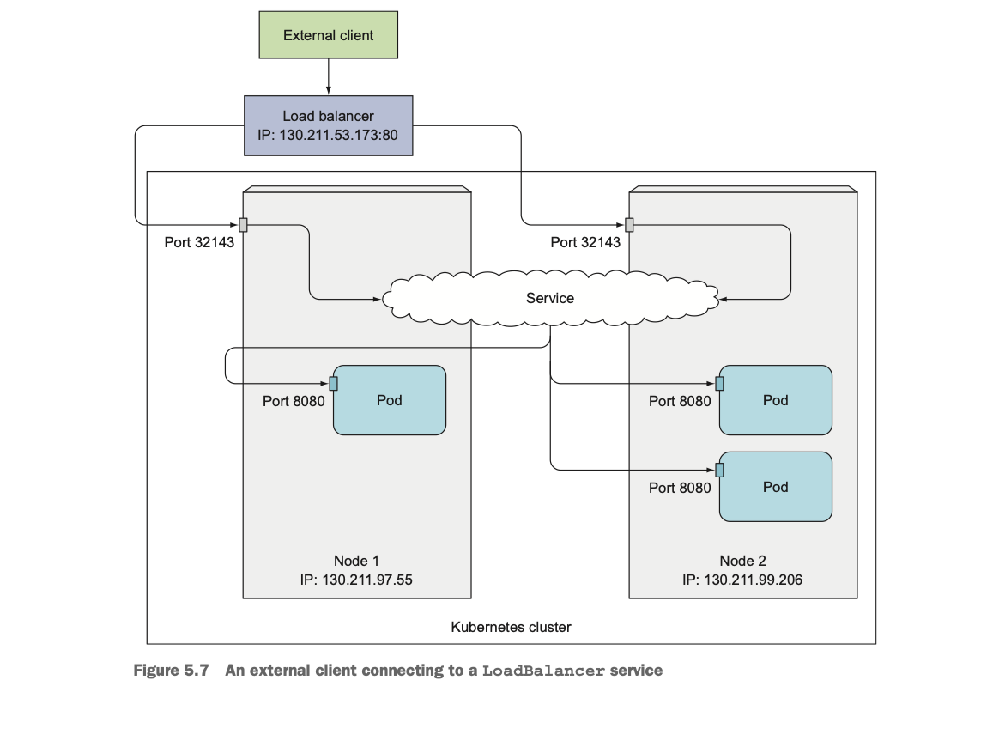
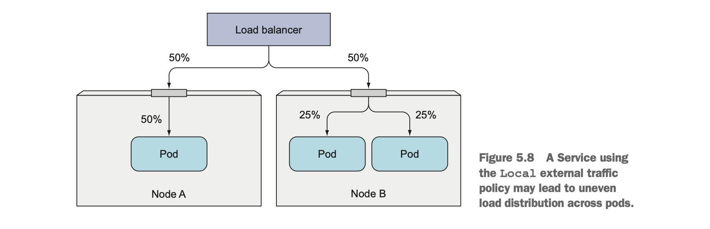

In this post, chapter 5 of Kubernetes in Action is introduced. 


# 5.1 Introducing services

Pod 끼리 통신하는 방법이 필요하다. Pod들이 서로 서비스를 호출하려면 상대방의 IP 주소를 알아야 한다. 일반적인 서버 환경에서는, 시스템 관리자가 각 애플리케이션의 설정 파일에 서버의 **고정 IP나 호스트 이름**을 직접 적어넣는다. 하지만 k8s에서는 다음 3가지 이유로 그것이 불가능하다. 

- Pod는 언제든 사라지거나 새로 생길 수 있다.
- IP 주소는 Pod 시작 후에야 부여된다. 클라이언트는 Pod가 만들어지기도 전에는 그 IP가 무엇인지 알 수 없다.
- Horizontal scaling(같은 서비스를 여러 개의 Pod로 늘리는 것)의 경우에 이들 각각이 다른 IP 주소를 가짐에도 불구하고
  클라이언트 입장에서는 하나의 web-server 서비스로 인식되어야 한다. 클라이언트가 각 Pod의 IP를 일일이 관리하는 것은 비효율적이다.

**Service**는 여러 개의 Pod를 하나의 논리적 엔드포인트(고정 IP, Port)로 묶어준다.

- Pod가 재시작되거나 IP가 바뀌어도, Service의 주소는 변하지 않는다.
- 클라이언트는 오직 Service 이름만 알고 있으면 된다.
- Service는 내부적으로 로드밸런서를 통해 요청을 적절히 Pod로 분배한다.

여러 개의 frontend pod들과 1개의 backend pod가 동작하는 상황을 생각해보자. 외부 클라이언트는 frontend pod들 개수를 신경쓰지 않고 이들 중 하나에 연결될 수 있어야 하고, frontend pod들도 backend pod들과 연결될 수 있어야 한다. 



## Creating services

Service를 생성하는 방법에는 크게 두 가지가 있다. 

- `kubectl expose` 커맨드를 이용한다. 앞서 2장에서 살펴본 것처럼 아래 명령어를 사용하면, 미리 생성해둔 rc라는 이름의 ReplicationController를 생성할 때 사용한 pod selector와 동일한 selector를 적용하여 해당 pod들에 대한 service를 만든다.  

  ```bash
  kubectl expose rc kubia --type=LoadBalancer --name=kubia-http
  ```

- YAML 파일을 이용한다.

  ```bash
  # kubia-svc.yaml
  apiVersion: v1
  kind: Service
  metadata:
   name: kubia
  spec:
   ports:
   - port: 80 # Service가 listen하는 포트
     targetPort: 8080 # service과 forwarding할 컨테이너 포트
   selector:
     app: kubia
  ```

  YAML 파일을 포스팅한 이후, `kubectl get svc` 명령어를 통해 만들어진 service 리소스의 Cluster-IP를 확인할 수 있다. Cluster-IP 이므로, 클러스터 내에서만 accessible 하다. (외부에서도 accessible 하게 하는 방법을 뒤에 다룬다.)

클러스터 내에서 다음 3가지 방법으로 만들어진 service에 요청을 보낼 수 있다. 

- 테스트용 pod를 하나 띄우고 그 Pod 내부에서 Service의 Cluster IP 또는 이름으로 요청을 보낸다.

  ```bash
  curl http://my-service:80
  ```

- 클러스터의 노드에 직접 SSH로 접속해서 `curl` 명령어를 실행한다.

  ```bash
  ssh user@worker-node
  curl http://10.96.0.15:8080
  ```

- 기존 Pod 내부에서 `kubectl exec`로 테스트한다.

  ```bash
  kubectl exec <existing-pod-name> -- curl http://10.111.249.153:80
  ```

  ❗`kubectl exec` 커맨드를 이용하면 해당 pod의 컨테이너에서 특정 명령어를 수행할 수 있다.
  
  

Pod에서 Service에 여러번 HTTP 요청을 보내면 그때마다 다른 pod으로 해당 요청이 redirection 될 것이다. 이것이 싫다면 다음과 같이 `sessionAffinity` propetry를 `ClientIP`로 설정하면 된다.

```bash
apiVersion: v1
kind: Service
spec:
 sessionAffinity: ClientIP
```

이렇게 되면, 같은 클라이언트 IP에서 Service로 요청한 request는 항상 같은 pod로 redirect된다.


하나의 Pod에서 여러개의 service의 여러 port로 요청을 보내고 이 요청이 목적지 pod들의 여러 port로 redirect되게 할 수도 있다.

```bash
apiVersioin: v1
kind: Service
metadata:
 name: kubia
spec:
 ports:
 - name: http
   port: 80
   targetPort: 8080
 - name: https
   port: 443
   targetPort: 8443
 selector:
  app: kubia
```

만약 target이 되는 Pod들을 만들 때 아래와 같이 port에 이름을 지정했다면, Service를 만들때도 targetPort에 구체적인 숫자 대신 이 이름을 사용할 수 있다.

```bash
kind: pod
spec:
 containers:
 - name: kubia
   ports:
   - name: http
     containerPort: 8080
   - name: https
     containerPort: 8443
     
apiVersioin: v1
kind: Service
metadata:
 name: kubia
spec:
 ports:
 - name: http
   port: 80
   targetPort: http 
 - name: https
   port: 443
   targetPort: https
 selector:
  app: kubia
```

이렇게 하면 pod의 포트 넘버가 바뀌더라도 service spec을 바꿀 필요가 없어진다. 


## Discovering services

클라이언트 pod에서 요청을 보낼 Service의 IP를 어떻게 알 수 있을까.

Pod가 만들어지면 k8s는 그 시점에 존재하는 모든 Service에 대한 정보를 자동으로 pod의 환경변수로 주입해준다. 만약 Service가 pod보다 나중에 만들어졌다면 기존 pod를 삭제하고 Rs가 다시 생성하게끔 하면 된다. 

```bash
kubectl exec kubia-3inly env # kubia-3inly pod의 환경변수 출력

KUBERNETES_SERVICE_HOST=10.111.240.1
KIBERNETES_SERVICE_PORT=443

KUBIA_SERVICE_HOST=10.111.249.153
KUBIA_SERVICE_PORT=80
```

❗Kubernetes 클러스터에는 항상 **`kubernetes`라는 기본 Service** 가 존재한다. 이는 API 서버에 접근할 때 사용되는 내부 Service이다.

클라이언트 pod에서 요청을 보낼 Service의 IP를 어떻게 알 수 있는 또다른 방법은 DNS 서버를 이용하는 것이다. k8s의 `kube-system` namespace에는 `kube-dns` 라는 같은 이름의 pod과 service가 존재한다. Kubernetes의 DNS 서버는 클러스터 내 모든 Service를 추적한다.

Kubernetes는 Pod를 만들 때 자동으로 Pod 내부의 `/etc/resolv.conf` 파일을 수정해서 내부 DNS 서버(`kube-dns`)를 기본 nameserver로 등록한다. 그 결과, Pod 내부에서 실행되는 어떤 애플리케이션이든 DNS 요청을 보내면 그 요청은 자동으로 Kubernetes 내부 DNS로 전달된다. 예를 들어, `curl http://kubia`  를 Pod 안에서 실행하면 내부 DNS가 `kubia`라는 이름을 인식하고 해당 Service의 IP(예: `10.111.249.153`)로 변환해준다.

k8s는 각 Service마다 DNS엔트리(FQDN, 완전한 도메인 이름)를 자동으로 생성하며 그 형식은 아래와 같다.

```bash
<service-name>.<namespace>.svc.cluster.local # Service의 도메인 주소
```

❗여전히 클라이언트 pod에서 Service pod의 port는 환경변수를 통해 알아야 한다.


# 5.2 Connecting to services living outside the cluster 

이제, Service가 클러스터 내의 pod이 아니라 외부 IP와 port로 redirect를 하는 경우를 살펴보자. 

## Service endpoints

Service는 Pod에 직접 연결시키지 않는다. Endpoints라는 중간 리소스가 존재한다. Kubernetes에서 Service 리소스를 생성할 때 `spec.selector`를 지정하면, selector와 일치하는 Pod들의 정보가 자동으로 수집되어 Endpoints 리소스가 생성된다. Endpoints는 IP:Port 형식의 리스트이다. 클라이언트 pod이 service에 연결되면 service는 이렇게 만들어진 Endpoints 중 하나를 선택하여 redirect한다. 

클러스터 내의 pod가 아닌 외부로 redirect하고 싶을 때는 Service를 만들 때, YAML에 selector를 아래와 같이 적지 않는다.

```bash
apiVersion: v1
kind: Service
metadata:
 name: external-service # Service 이름. Endpoints이름과 반드시 일치해야 함. 
spec:
 ports:
 - port: 80
```

Pod selector를 적지 않았기 때문에 endpoints 리소스가 자동으로 만들어지지 않은 상태이다. 따라서, 우리는 외부 IP와 포트를 가리키는 endpoints 리소스를 직접 만든다. 이 때 Endpoints의 이름은 Service의 이름과 일치해야 한다. 

```bash
apiVersion: v1
kind: Endpoints
metadata:
 name: external-service
subsets:
 - addresses:
   - ip: 11.11.11.11
   - ip: 22.22.22.22
   ports:
   - port: 80
```

이 경우 실행 흐름은 다음과 같다. 

1. 클러스터 안의 Pod이 `curl http://external-service` 로 요청을 보낸다.
2. DNS가 `external-service` → Service의 ClusterIP로 변환한다.
3. Service는 자신과 이름이 같은 Endpoints 리소스를 찾는다.
4. 요청을 Endpoints에 명시된 IP (`11.11.11.11`, `22.22.22.22`) 중 하나로 전달한다.



위 방식처럼 Service가 redirect할 endpoints 리소스를 수동으로 만들고 관리할 수도 있지만 대신, ExternalName type의 Service를 만들어서 더 간편하게 작업할 수 있다. 

```bash
apiVersion: v1
kind: Service
metadata:
 name: external-service 
spec:
 type: ExternalName
 externalName: someapi.somecompany.com
 ports:
 - port: 80
```

이렇게 Service를 만들고 나면, pod은 `external-service.default.svc.cluster.local` 이라는 Service의 도메인 이름을 이용하여 외부 IP에 연결할 수 있다. 


# 5.3 Exposing services to external clients

이제, Service가 내부의 pod가 아닌 외부 IP로부터 요청을 받는 경우를 생각해보자. 크게 3가지 방식이 있다.

## Using a NodePort service

Service의 type을 NodePort로 설정하면, k8s의 모든 노드(서버)의 동일한 포트 (아래 예시에서 30123)에서 외부로부터 요청을 받을 수 있게 된다. 

```bash
apiVersion: v1
kind: Service
metadata:
 name: kubia-nodeport
spec:
 type: NodePort # type을 NodePort로 설정!
 ports:
 - port: 80 # Service의 포트
   targetPort: 8080 # target pod의 포트
   nodePort: 30123 # node의 포트
 selector:
   app: kubia
```

- `port: 80` : **ClusterIP를 통한 내부 통신용**. 즉, 클러스터 내부의 다른 Pod들이 `http://kubia-nodeport:80` 으로 접근할 때 사용하는 포트이다.
- `targetPort: 8080` : 실제 애플리케이션이 실행 중인 **Pod 내부 포트 번호**.
- `nodePort: 30123` : 클러스터 외부에서 접근 가능한 포트. Kubernetes는 클러스터의 모든 Node에 동일한 포트를 개방.

다음 상황을 보자.


Service는 다음의 경로들로 접근 가능하다. 

- 10.11.254.223: 80 (By 5.1)
- <1st node's IP>:30123, <2nd node's IP>:30123, ...



## Using external load balancer

LoadBalancer Service는 NodePort의 상위 개념이며, 사실상 내부적으로 **NodePort + 외부 로드밸런서** 구조로 동작한다.

사용자가 `type: LoadBalancer` 로 Service를 생성하면 Kubernetes가 클라우드 API를 호출하여 **외부 로드밸런서**를 자동 생성한다. 생성된 로드밸런서는 고유한 **공인 IP 주소 (External IP)** 를 가진다. 로드밸런서는 클러스터의 NodePort로 트래픽을 포워딩하고 NodePort는 다시 Pod들로 분배한다. 따라서, 클라이언트는 로드밸런서의 IP로 연결을 시도하면 된다. 

```bash
apiVersion: v1
kind: Service
metadata:
 name: kubia-loadbalancer
spec:
 type: LoadBalancer # type을 LoadBalancer로 설정!
 ports:
 - port: 80 # Service의 포트
   targetPort: 8080 # target pod의 포트
 selector:
   app: kubia
```

구체적인 NodePort를 위와 같이 적지 않고 k8s가 알아서 선택하게 맡길 수 있다.



**Understanding and Preventing Unnecssary Network Hops**

외부 클라이언트 → NodePort → Pod 으로 트래픽이 들어올 때, 요청이 도착한 Node(예: Node A)와 실제 Pod이 있는 Node(예: Node B)가 다를 수 있다. 이 경우 Node A는 요청을 Node B로 한 번 더 전달해야 하는 이 추가 전달이 불필요한 network hop이다.

아래와 같이 설정하면, 외부 요청이 들어온 노드(Node)에서 실행 중인 Pod로만 트래픽을 전달하게 된다. 즉, Node A로 들어온 요청은 Node A에 있는 Pod에게만 가고, Node B로 들어온 요청은 Node B에 있는 Pod에게만 간다.

```bash
spec:
  externalTrafficPolicy: Local
```

- 일반 모드의 경우, 부하 분산은 고르게 되지만, Node 간 트래픽이 생겨 네트워크 홉이 늘어난다.
- Local 모드의 경우, 홉이 줄어서 지연이 감소하지만, 해당 노드에 Pod이 없으면 트래픽이 전달되지 않는다.



위 그림에서 첫 번째 50/50은 로드 밸런서의 동작에 의한 것이고, Node B에서 25/25는 Service에 의한 부하 분산이지만 어쨌든 local모드에서는 Node B로만 전달하므로 Node A의 50과 비교했을 때 부하가 고르게 분산되지 않는 결과를 낫는다. 

**Being Aware of the Non-preservation of the Client's IP**

클러스터 내부 Pod들이 서로 통신할 때는, 패킷의 출발지 IP(Source IP)가 그대로 유지된다. 따라서 백엔드 Pod(서버 역할을 하는 쪽)는 요청을 보낸 Pod의 실제 IP를 볼 수 있다. 아래 상황에서 Pod B는 “요청을 보낸 IP = 10.1.1.15” 라는 걸 로그에서 그대로 확인 가능하다. 

```bash
Pod A (10.1.1.15)  →  Service  →  Pod B (10.1.2.20)
```

그러나 외부 클라이언트(예: 웹 브라우저)가 NodePort 또는 LoadBalancer로 접근하면 Service가 내부적으로 **SNAT(Source Network Address Translation)** 처리를 한다. 

📘 **SNAT란?**

> “패킷의 출발지 IP를 바꿔서 전달하는 것”
> 즉, 클러스터 외부 IP → Node IP로 바꿔서 Pod으로 전달한다. 

```bash
클라이언트 (203.0.113.10)
   ↓
Node (10.0.0.5)
   ↓ (SNAT 수행)
Pod (10.1.2.20)
```

Pod이 실제로 받는 요청의 출발지 IP는 `203.0.113.10`이 아니라 `10.0.0.5` (노드의 IP)로 바뀐다.

Service는 기본적으로 **랜덤한 Pod으로 트래픽을 분산(Load Balancing)** 한다. 그런데 그 Pod이 다른 Node에 있을 수도 있다. 이때 패킷을 다시 다른 노드로 전달하려면 NAT 처리가 필요하다. 그래서 Kubernetes는 안전하게 연결을 유지하기 위해 SNAT을 적용한다. 하지만 이 과정에서 실제 클라이언트의 IP 정보는 사라져 버린다.

❓NAT처리가 필요한 이유?

Pod은 요청이 **어디서 왔는지(클라이언트의 실제 IP)** 를 알 수 없게 되고, 모든 요청의 출발지 IP가 “노드의 IP”로 보인다. 이는 웹 애플리케이션에서 **사용자 IP 기반 기능(로그 분석, 보안 필터링 등)** 을 쓸 때 문제가 된다.

```
spec:
  externalTrafficPolicy: Local
```

이 설정을 사용하면:

- NodePort 또는 LoadBalancer로 들어온 요청은 “해당 요청을 받은 Node에 있는 Pod”에게만 전달된다.
- Node 간 트래픽 전달이 없어지므로 SNAT이 필요하지 않다.
- 따라서 Pod이 클라이언트의 실제 IP를 그대로 볼 수 있다.


