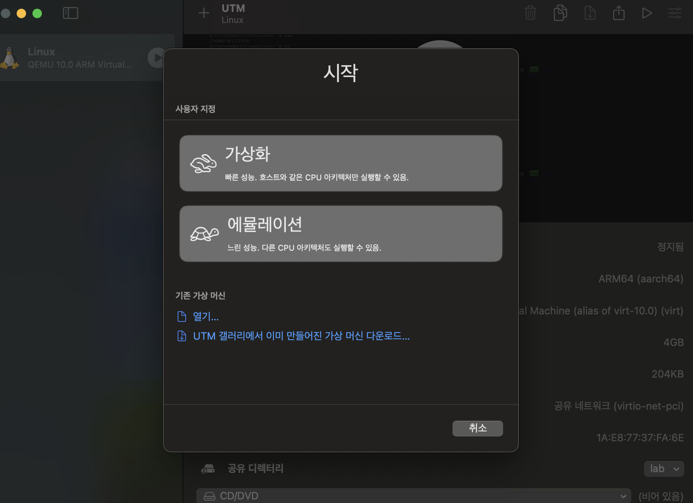
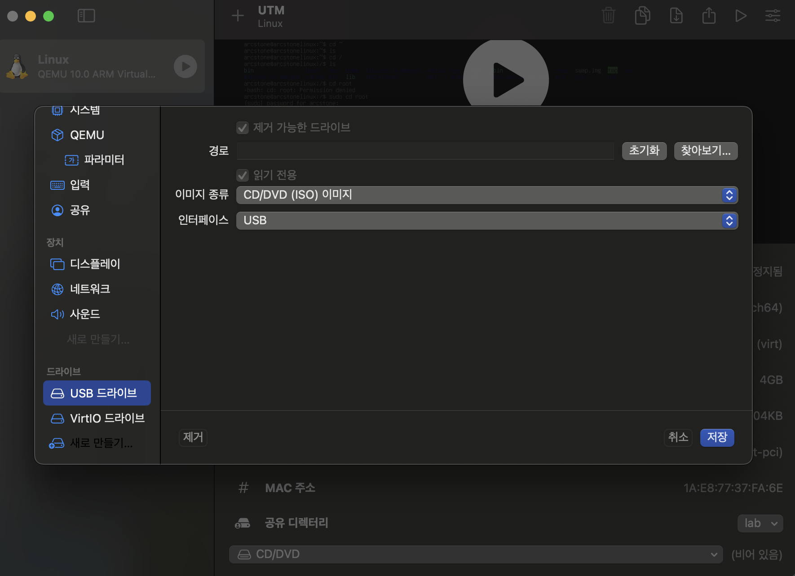

In this post, installinig process of Linux VM on MacOS is introduced.


# Linux VM on MacOS

VM의 개념에 대한 정보는 <a href="https://arcstone09.github.io/study/2025-09-26-k8s-1">여기</a> 와 <a href = "https://arcstone09.github.io/study/2025-09-16-waffle-6"> 여기 </a> 참고.

System programming 과제를 수행하며 ARM-based Linux 환경에서 코드가 채점되어, ARM-based Mac에서 개발할 경우 100% compatiable 하지 않은 경우가 있었다. 따라서, Ubuntu Server for ARM 을 설치하여 이를 VM에서 실행하였다.  

프로그램은 단순히 CPU 명령어만 쓰는 게 아니라, OS 제공 기능(시스템 콜, 라이브러리, API)을 사용하는데, 각 OS는 시스템 콜 인터페이스가 다르다.

- Linux: `fork()`, `exec()`, `open()` 등 POSIX 기반 호출
- Windows: `CreateProcess()`, `ReadFile()` 등 Win32 API

따라서 같은 CPU에서라도 Linux용 실행 파일은 Windows에서 바로 실행되지 않고, 이는 Linux와 MacOS 사이에서도 마찬가지이다. 

- [Ubuntu Server for ARM](https://ubuntu.com/download/server/arm) : ARM-based Ubuntu OS를 설치
- <a href="https://mac.getutm.app"> UTM </a> : UTM(VM software) 설치 

위 곳에서 각각 `ubuntu-24.04.3-live-server-arm64.iso` (Ubuntu OS ISO image)와, UTM을 설치한 후, 아래의 절차를 따른다. 

UTM에서 다음과 같이 새로운 VM 생성버튼을 누르고 아래 화면에서 가상화(emualtion에서는 host의 CPU 아키텍처와 다른 VM 아키텍처를 선택할 수 있다. 즉 host는 ARM인데 x86 바이너리를 실행할 수 있는 것이다)를 누른다. 이후 계속 설정을 진행하다, '부팅 이미지 종류'에서 Boot from Image 를 선택하고 위에서 설치한 ubunto image를 선택한다. 이후, 설정을 진행하다 '공유 디렉터리 설정' 에서, Ubuntu server 안에서 접근하고 싶은 Host 디렉터리를 선택한다. 



이후 설치를 진행하고 나서, 오른쪽 상단 설정-드라이브에서 경로를 초기화하여야 Ubuntu server를 이용할 수 있다. 



이제 위에서 설정한 share directory를 사용하기 위해서 ubuntu server 상에서 다음의 명령어를 수행한다. 

```zsh
sudo mkdir -p /mnt/share
sudo mount -t 9p -o trans=virtio share /mnt/share
```

`mount` 란 파일시스템(장치)을 특정 디렉터리에 연결하는 명령이다. 

`share` 는 어떤 장치/리소스를 마운트할 건지 지정해야 하는데, 이 때 UTM에서 공유폴더를 추가할 때 설정된 기본 이름인 `share` 를 선택하는 것을 의미한다. (공유폴더가 여러 개면 `share0`, `share1` … 이런 식으로 된다.)

`/mnt/share`는 게스트(Ubuntu) 안에서 접근할 디렉터리 (마운트 포인트)로, 즉 이 위치에서 호스트(macOS)의 공유 폴더가 보이게 된다. 

