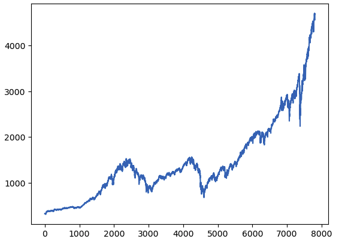
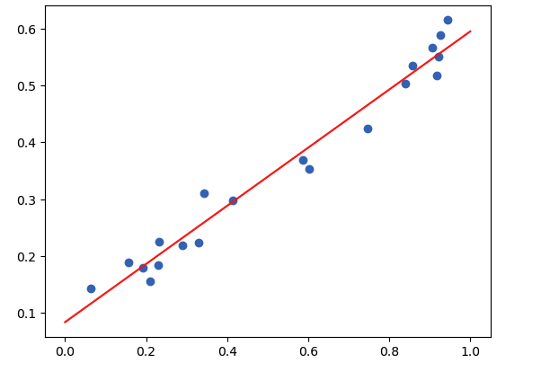

In this post, lecture 01 of BigData math is introduced.


# 01 Vectors

- pyplot.quiver : 벡터장(vector field)을 화살표로 시각화할 때 사용하는 matplotlib 함수.

  ```python
  import numpy as np 
  import csv
  import matplotlib.pyplot as plt
  
  plt.quiver([0], [0], [2], [4], angles='xy', scale_units='xy', scale=10)
  plt.xlim(-5, 5)
  plt.ylim(-5, 5)
  plt.show()
  ```

- read_file : 

  ```python
  def read_file(file_name):
      results = [] # csv의 각 row를 저장할 리스트
      with open(file_name, newline='') as csvfile:
          idx_reader = csv.reader(csvfile, delimiter=',', quotechar='|')
          for row in idx_reader:
                  results.append(row)
      return results
  sp_idx = read_file('../data/sp500_idx.csv')
  sp_idx = np.asarray(sp_idx)
  
  closing = np.asarray(sp_idx[:, 6], dtype=float) 
  print(closing.shape) # 6:7이 아니라, 6으로 정수 인덱싱을 사용했으므로 shape이 (1, 7803)이 아닌 (7803, ) 이  됨.
  closing = closing[::-1] # 슬라이싱을 이용한 배열 뒤집기
  plt.plot(closing) # x축은 배열 길이만큼 표현, y축은 closing 값.
  plt.show()
  ```
  
  - with open : CSV 파일을 열 때는 항상 `newline=''`을 사용할 것.
  - csv.reader : 인자로 주어진 csvfile을 한 줄씩 읽어주는 iterator를 반환한다. 각 반복에서 반환되는 것은 str들의 list이다. 
    - `delimter=','` : csv의 row의 문자열을 구분하는 구분자이다. 
    - `quotechar='|'` : |...| 아느이 쉼표는 구분자로 취급하지 않는다.
    - 즉, 하나의 row가 "2020-01-02,|3,257.85|" 이라면 첫 번째 iteration에서 ['2020-01-02', '3,257.85'] 이 반환된다. 
  - `np.asarray(x)`:  `x`를 NumPy 배열로 변환하되, 이미 ndarray면 그대로 반환하고, 필요할 때만 새로운 배열을 만든다.
  
  

# 02 Vector addition and scalar multiplication 

- vector addition code :

  ```python
  v = np.asarray([2, 0])
  w = np.asarray([0, 4])
  vw = v + w
  plt.quiver([0, v[0], 0], [0, v[1], 0], [v[0], w[0], vw[0]], [v[1], w[1], vw[1]], angles='xy', scale_units='xy', scale=1)
  plt.xlim(-1, 8)
  plt.ylim(-1, 8)
  plt.show()
  print("The length of v+w is ", np.sqrt(np.dot(vw, vw)))
  ```

  - `plt.quiver(X, Y, U, V)` 
    - `(X[i], Y[i])` : i번째 화살표의 시작점
    - `(U[i], V[i])` : i번째 화살표의 벡터 성분(방향+길이)


# 04 Linear Regression

- sklearn linear regression training

  ```python
  from sklearn.linear_model import LinearRegression
  
  N = 20
  xs = np.random.rand(N)
  ys = 0.5*xs + 0.1 + 0.1 * (np.random.rand(N) - 0.5)
  
  model = LinearRegression()
  model.fit(xs.reshape((-1, 1)), ys) # xs.shape은 (20, ) 이므로 이를 (20, 1)으로 reshaspe
  
  a = model.coef_
  b = model.intercept_
  
  plt.scatter(xs, ys)
  plt.plot([0, 1], [a*0 + b, a*1 + b], c='red')
  ```

  - xs.reshape((-1, 1)) 을 하는 이유는 scikit-learn은 입력 X를 항상 2차원으로 요구하기 때문이다.  

​	


# 08 K-means Clustering

- Setting for K-menas Clustering

  ```python
  import gzip
  #f = gzip.open('t10k-images-idx3-ubyte.gz', 'r')
  f = gzip.open('../data/MNIST/raw/t10k-images-idx3-ubyte.gz', 'r')
  image_size = 28
  num_images = 10000
  f.read(16) # read and ignore header
  buf = f.read(image_size * image_size * num_images)
  f.close()
  data = np.frombuffer(buf, dtype=np.uint8).astype(np.float32)
  data = data.reshape(num_images, image_size, image_size, 1)
  
  image = np.asarray(data[0]).squeeze()
  plt.imshow(image)
  plt.show()
  
  f = gzip.open('../data/MNIST/raw/t10k-labels-idx1-ubyte.gz', 'r')
  f.read(8)
  buf = f.read(1 * num_images)
  f.close()
  labels = np.frombuffer(buf, dtype=np.uint8)
  print("The first digit is ", labels[0])
  ```

  - gzip : **gzip 압축 파일**(`.gz`)을 읽기 위한 표준 라이브러리. MNIST 데이터는 보통 `.gz` 형태로 배포됨.
  - np.frombuffer : `buf` (바이트 덩어리)를 NumPy 배열로 변환
  - .squeeze() : 
    - 크기가 **1인 차원 제거**
    - `(28, 28, 1)` → `(28, 28)` 

- K-means Clustering

  ```python
  from sklearn.cluster import KMeans
  kmeans = KMeans(init="random", n_clusters=20, n_init=10, max_iter=300, random_state=42)
  flattened = data.reshape((10000, 28*28))
  kmeans.fit(flattened)
  
  clusters =[[] for i in range(20)]
  for pred, label in zip(kmeans.labels_, labels):
      clusters[pred].append(label)
  print("The first 10 samples of the first cluster are ", clusters[0][0:10], ".")
  
  bins, _, _ = plt.hist(clusters[0])
  digit = np.argmax(bins)
  print("The most common digis in cluster 0 is ", digit)
  ```

  
