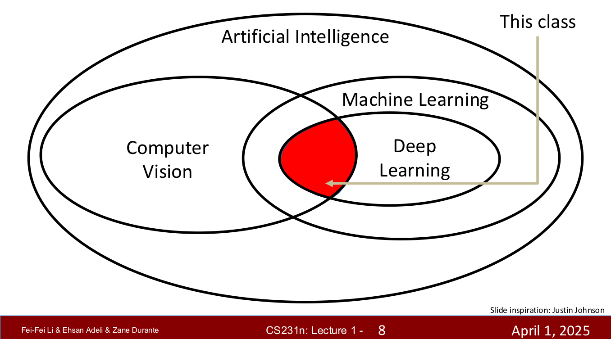
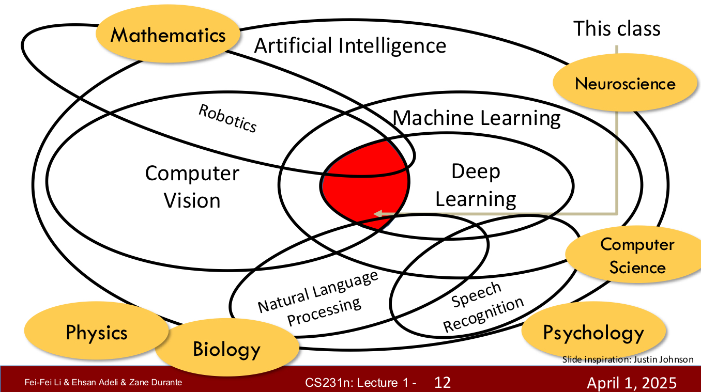
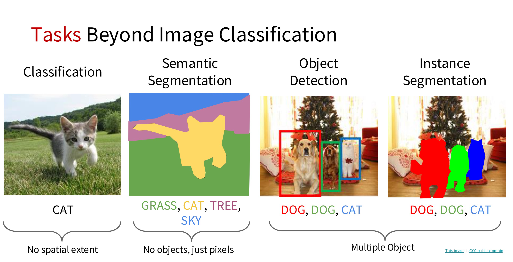
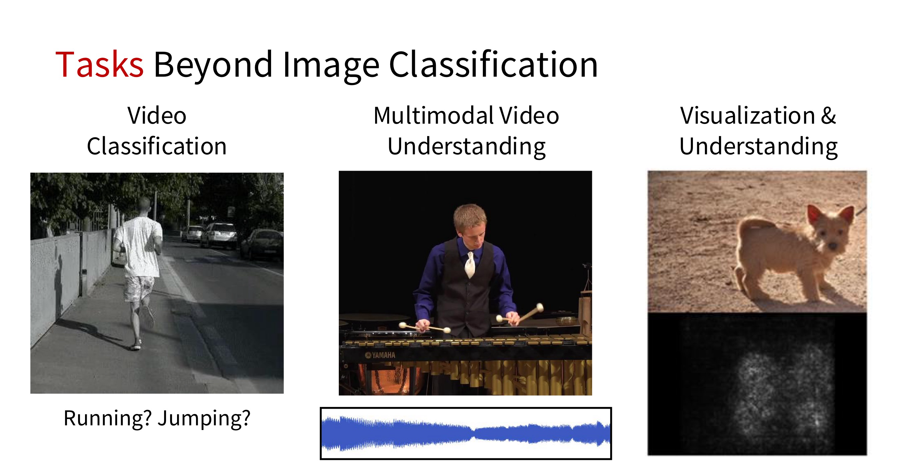

In this post, lecture 01 of cs231n is introduced.

# 01 Intro

## Scope of the lecture

## Tasks Beyond Image Classification

Computer Vision의 대표적인 과제들은 다음과 같다.

- **Classification** (이미지 분류) : 이미지 전체에 대한 하나의 label을 예측. 위치/크기 정보 없음.
- **Semantic Segmentation** (의미 분할) : 이미지의 모든 픽셀에 class label을 할당. 같은 클래스의 개체들은 구분하지 않음. (모든 고양이는 같은색)
- **Object Detection** (객체 탐지) : 각 객체의 위치(bounding box) + class. 여러 객체를 구분 하지만, 정확한 윤곽은 모름.
- **Instance Segmentation** (인스턴스 분할) : 객체 하나하나를 정확한 픽셀 마스크로 분리. 같은 클래스라도 개체별로 분리 + 정확한 형태.

Computer vision은 정적인 이미지 외 동적인 동영상을 분석하는데에도 쓰인다.

- **Video Classification** : 한 영상 전체에 대해 행동/상황 하나의 라벨을 예측
- **Multimodal Video Understanding** : 두 번째 영상을 보고 정확히 이해하기 위해선, 영상 뿐만 아니라, 연주하고 있는 오디오 데이터가 필요함. 이렇게 여러 모달을 이용해 추론.
- **Visualization & Understanding** : 모델이 무엇을 보고 판단했는지를 시각화/해석.

## Syllabus

cs231n lecture의 강의 흐름은 아래와 같다.

