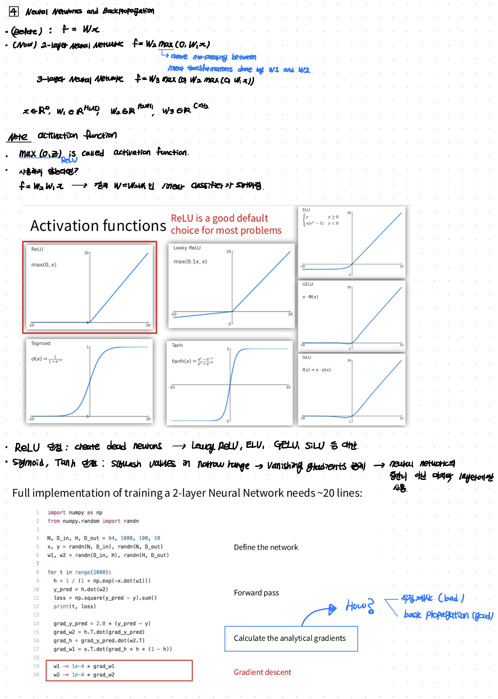
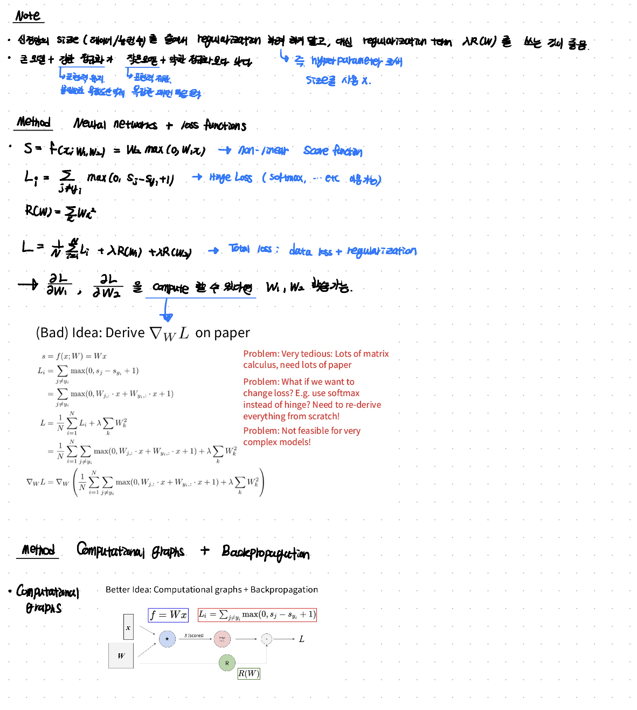
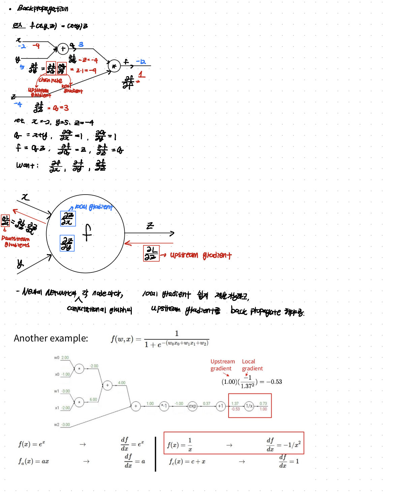
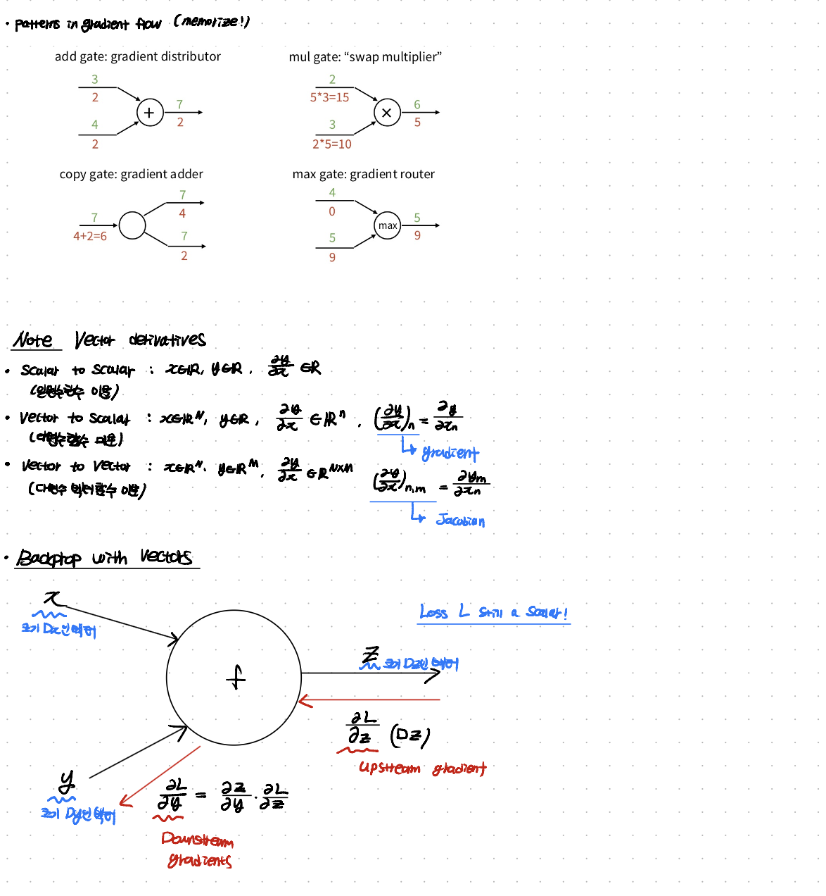
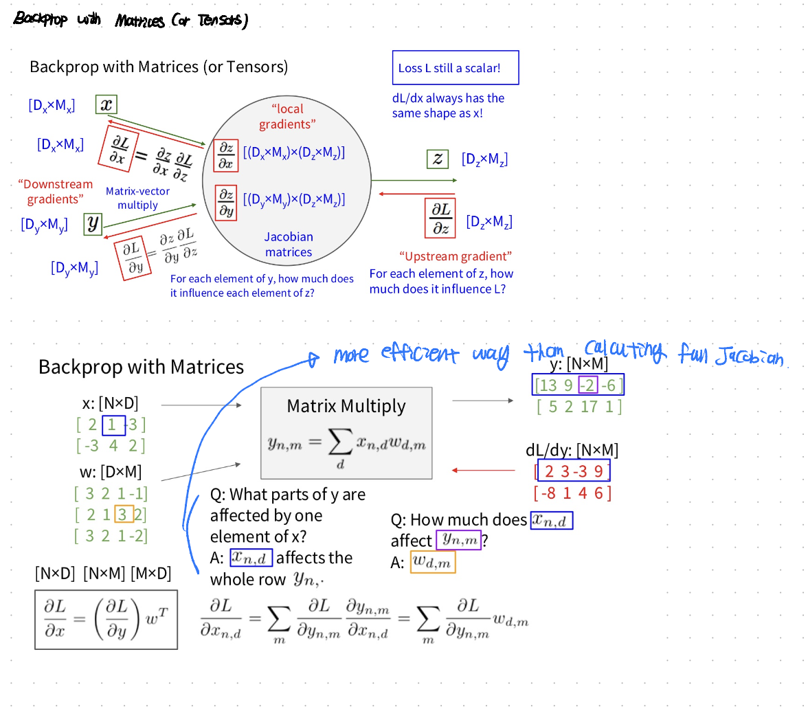
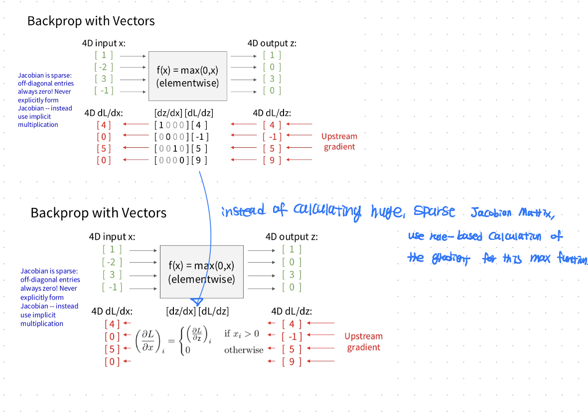

In this post, lecture 04 of cs231n is introduced.

# 04 NN and Backpropagation

## Syllabus

Lecture 4에서는 cs231n syllabus 상에서 Backpropagation, MLP, NN, Activation Functions 내용을 다룬다.

## lecture note

