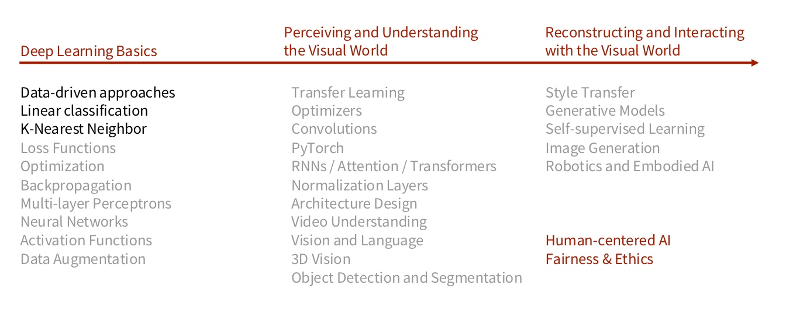
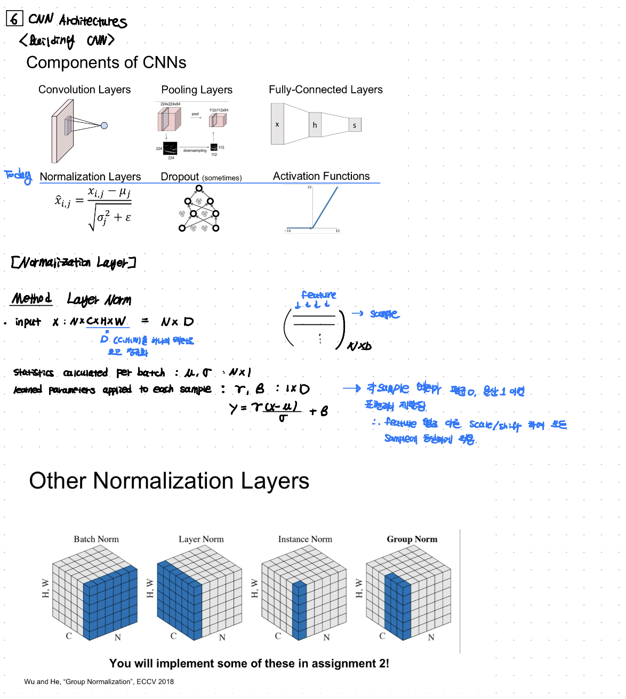
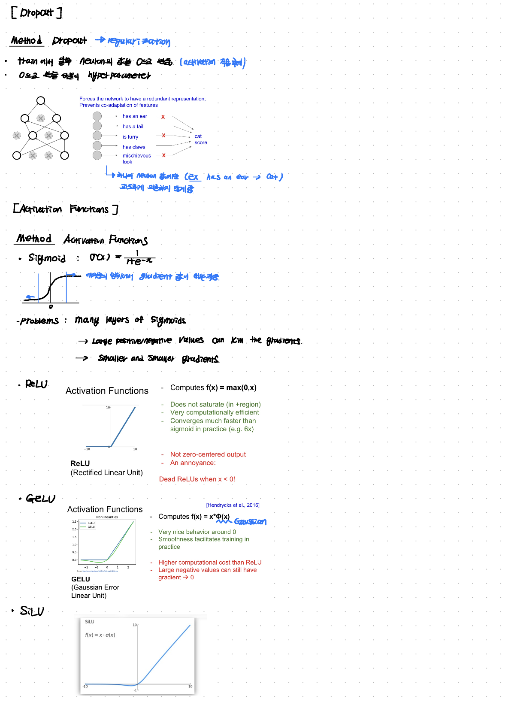
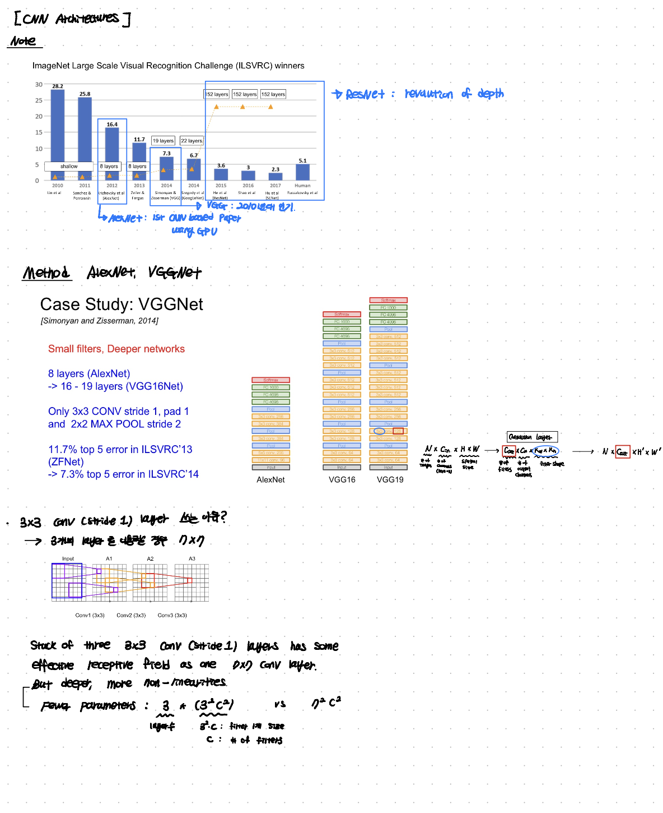
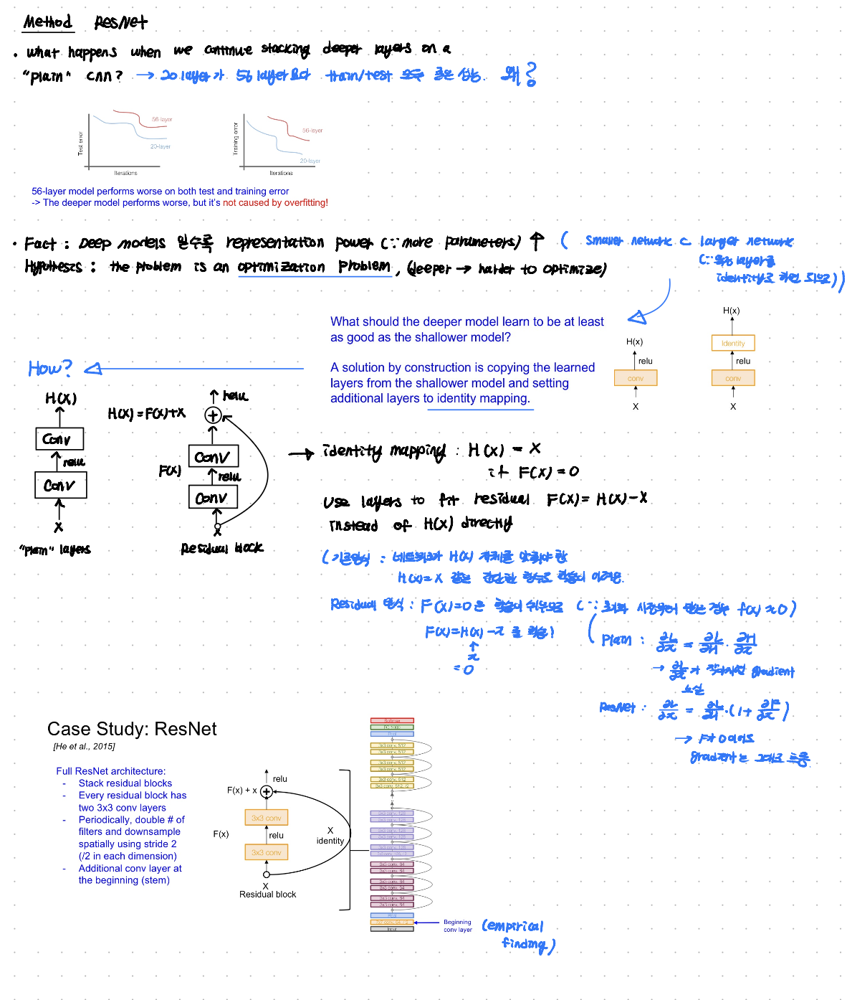
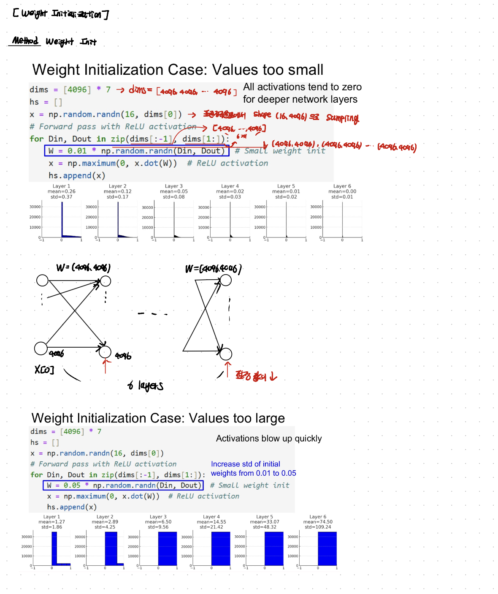
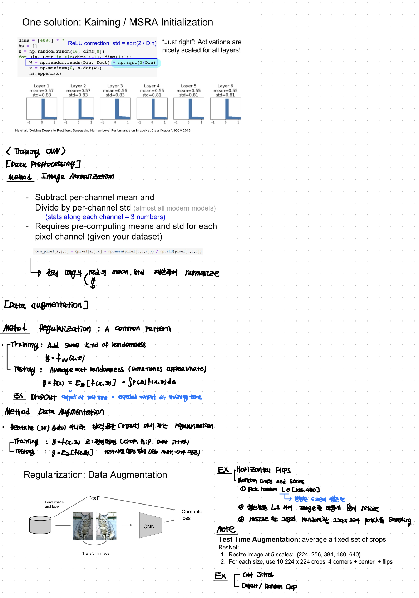
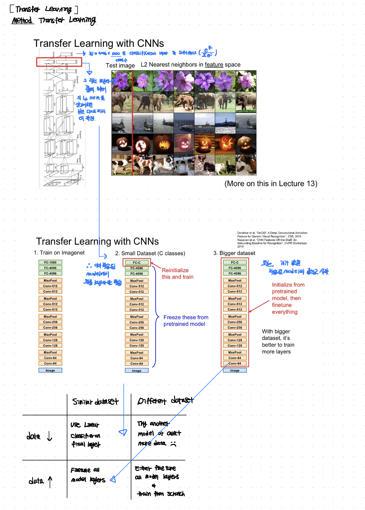
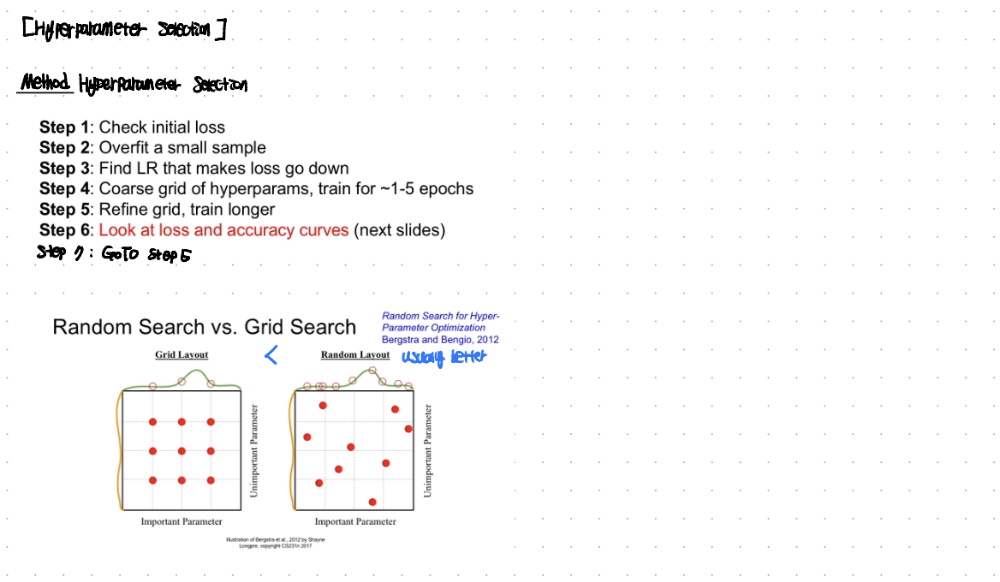

In this post, lecture 06 of cs231n is introduced.

# 06 CNN Architectures

## Syllabus

Lecture 6에서는 cs231n syllabus 상에서 Data Augmentation, Transfer Learning, Normalziation Layers, Architecture Design 내용을 다룬다.

## lecture note

