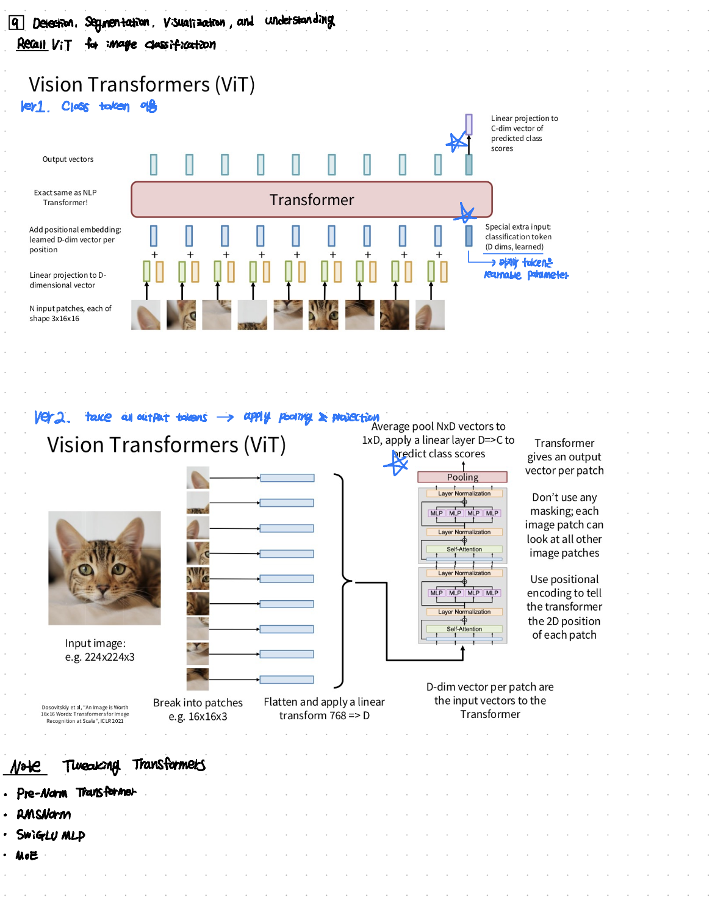
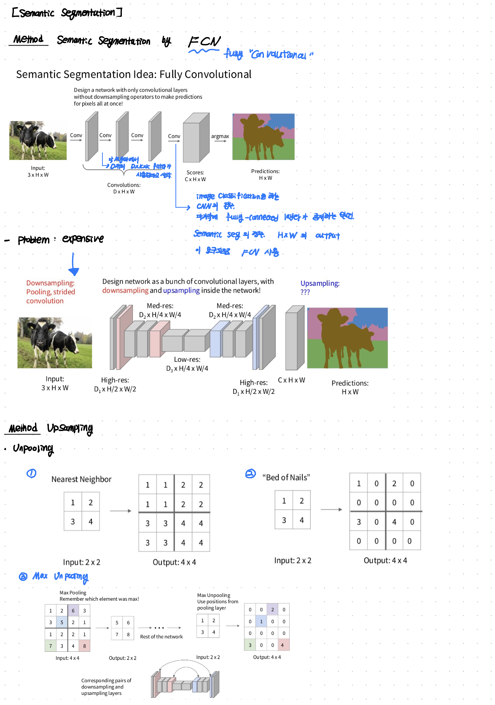
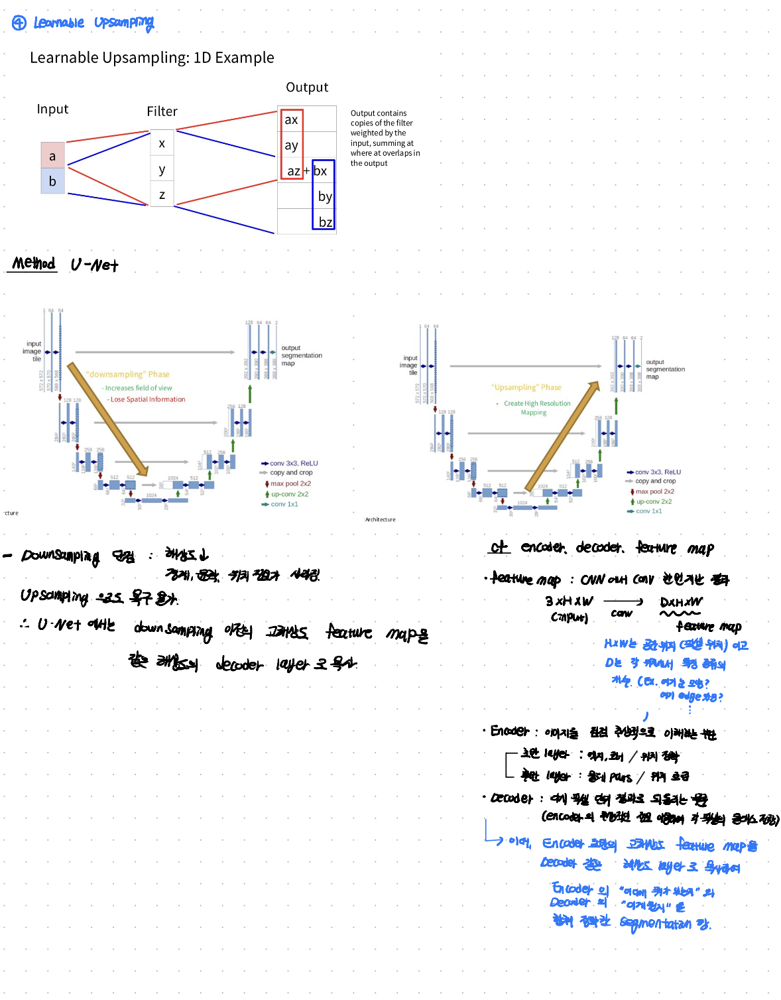
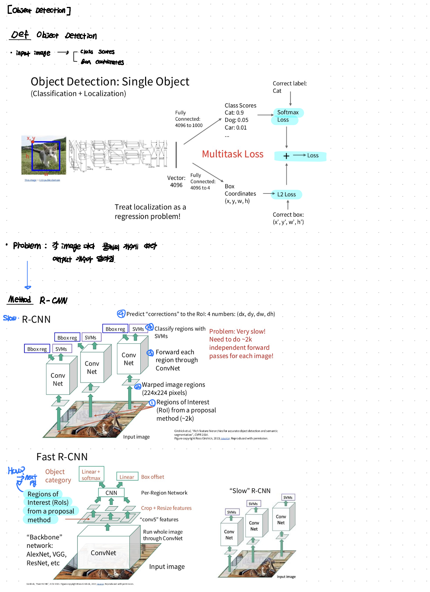
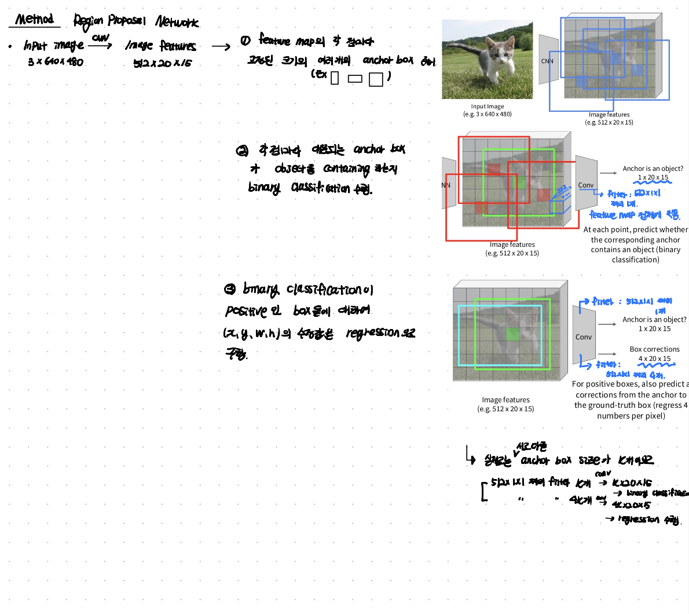
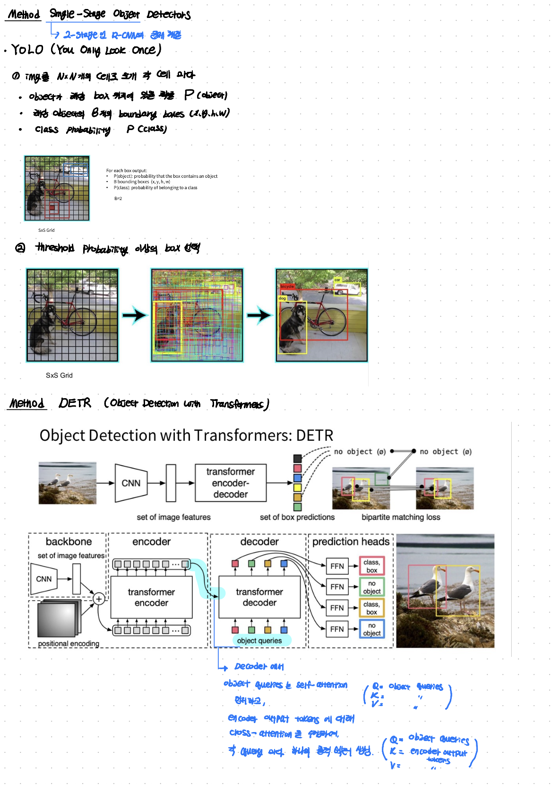
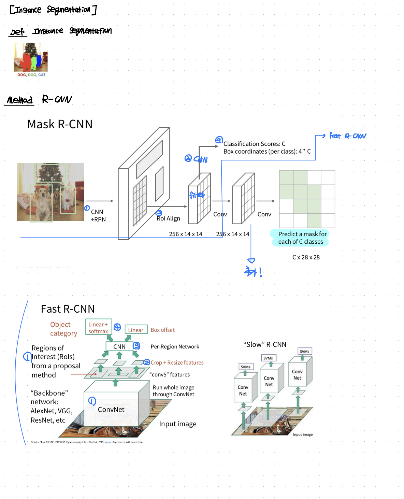
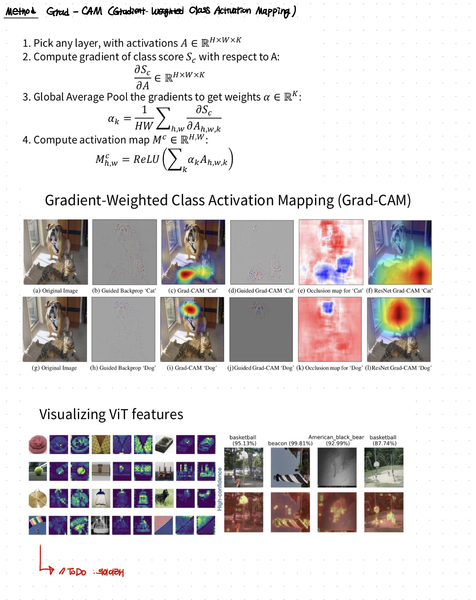

In this post, lecture 09 of cs231n is introduced.

# 09 Detection, Segmentation, Visualization, and Understanding

## Syllabus

Lecture 9에서는 cs231n syllabus 상에서 Vision and Language, 3D Vision, Object Detection and Segmentation 내용을 다룬다.

## lecture note

