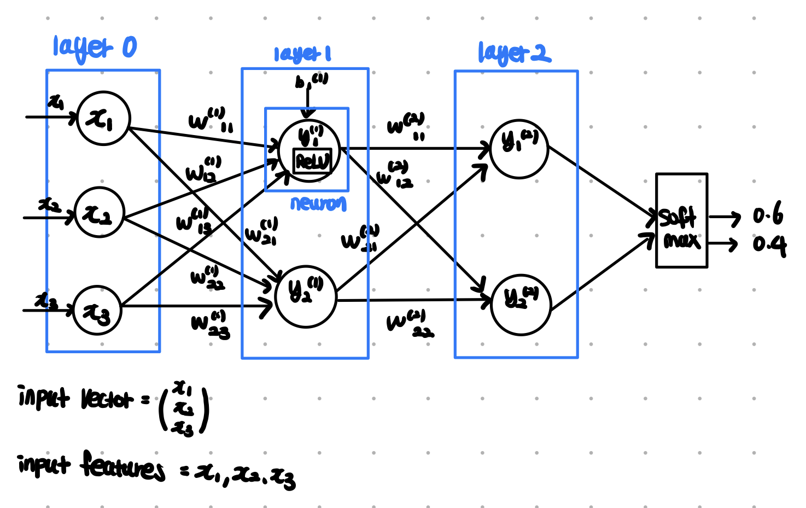
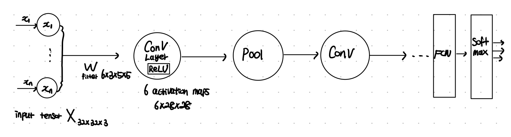
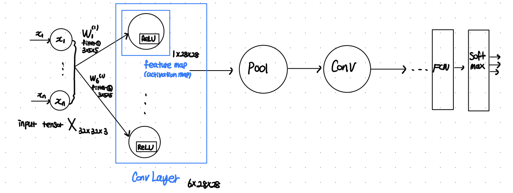
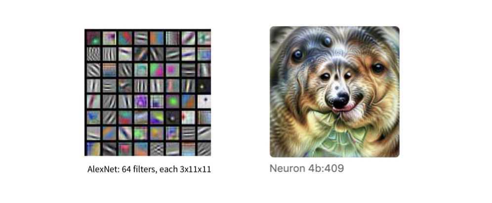
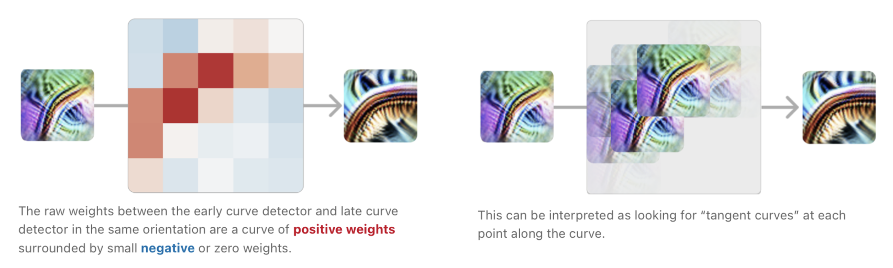

In this post, article 01 of Distil Circuits is introduced.

# Intro

Neural network의 해석 가능성 (interpretability)에 대해 연구자들 사이에서는 여러 입장이 존재한다. 

## Terminolgy

이 글에서 통용되는 몇 가지 용어에 대한 정의를 명확히 하고 가고자 한다.

2개의 layer로 이루어진 다음의 Fully-Connected-Network를 생각해보자.

$3 \times 1$ input vector $X$ 가 $2 \times 3$ matrix $W^{(1)}$ , $2 \times 2$ matrix $W^{(2)}$ 를 거쳐 $2 \times 1$ output vector로 나오는 모습이다. 

아래 그림에는 다음의 규칙이 존재한다. 

- 각 원은 들어오는 화살표들과 화살표가 나온 이전 원들의 값을 input으로 하여 특정 연산을 하는 함수이다. 원에 적힌 값은 이 함수의 결과이다. 
  - layer0의 3개의 원은 주어진 input을 그대로 내보내는 항등함수의 역할을 한다고 할 수 있다. 통일성을 위해서 이렇게 그린다.
- Layer1의 각 원은 들어오는 weight와 input x를 일차결합하고, bias b를 더하고 원 안의 사각형 ReLU 함수를 적용한 후 output을 내보낸다. 
  - Layer2도 마찬가지이며 마지막에는 softmax 함수를 적용하여 최종 output vector가 나온다. 

이 때, 주요 용어들의 정의는 아래와 같다.

- input vector : $(x_1 \ x_2\ x_3 )$

- input features : $x_1$, $x_2$, $x_3$ 각각을 의미

- Neuron : output 스칼라 1개를 만들어내는 함수. 위 그림에서 동그라미 1개에 해당.

- Layer : 같은 입력 $x$를 공유하는 여러 neuron의 집합.

- Perceptron : neuron 1개 짜리 model로 activation function으로 step 함수를 사용하는 이진 분류기.

- Activation Space : 한 layer의 모든 neuron 출력이 좌표가 되는 벡터 공간.

- Feature : 보통은 input/output의 각 성분 좌표를 의미하나, **딥러닝 해석 관점**에서 **feature란 activation space에서 의미 있는 방향**(direction), 즉 **벡터**이며, **입력의 특정 구조에 의해 일관되게 활성화**되고 모델의 계산에 실제로 사용되는 표현 단위이다.
  - 예를 들어, 위 그림의 layer2에서 activation space는 $\mathbb R^2$ 이므로 $v = (2, 7)$ 이 하나의 feature 라고 하자. feature는 값이 아니라 방향이므로, $(4, 14), (0.2, 0,7)$ 모두 같은 feature 이다. 보통은 정규화하여 $\hat v = \frac{(2,7)}{||(2,7)||}$ 로 사용한다. 
  
  - $a(x)$ 를 feature가 정의된 layer의 입력 $x$가 해당 layer (현재 예시에서 layer2)에 만든 FC 출력이라 하고, $\hat v$ 를 feature 라고 할 때, **feature activation** 은 $\hat v^Ta(x)$ 로 정의된다. (즉, output과 feature의 내적) 밑에서 보겠지만 feature visualization이란, 이 feature activation  $\hat v^Ta(x)$ 을 maximize 하는 벡터 $x$를 찾아 visualize 한 것이다. 
  
    

CNN 모델에서도 위 용어들을 똑같이 정의할 수 있다. 단, 그림을 그리는 방식에 약간의 차이가 있다. 위에서의 규칙대로 CNN 모델의 그림을 그리면 아래와 같을 것이다. 

즉 원 1개 = 뉴런 1개 = 스칼라 출력 1개이다. 하지만 편의를 위해 원의 의미를 다음과 같이 정한다. 

- FC layer에서 원 1개 = 뉴런 1개 = 스칼라 출력 1개
- Conv layer에서 원 1개 = **feature map** 1개 (속에 다수의 뉴런 포함)

Feature map은 Activation map이라고도 하며 정의는 다음과 같다. 

- Feature map (Activation map) : input tensor에 filter(1개) 를 적용한 뒤, activation function을 지난 결과 (matrix or tensor)

이 규칙에 따라 CNN을 그리면 아래와 같이 그릴 수 있다. 

FC에서 activation space을 한 layer의 모든 neuron 출력이 좌표가 되는 벡터 공간으로 정의했다. 이는 엄밀히 말하면 **global activation space** 의 정의이다. CNN에서는 activation space를 다음과 같이 구분지어 정의한다. 

- global activation space :  한 layer의 모든 neuron 출력이 좌표가 되는 벡터 공간. 
  - 위 그림에서 Conv Layer1의 output이 $\mathbb R^{6\cdot 28 \cdot 28} = \mathbb R^{4704}$ 이므로 global activation space는 $\mathbb R^{4704}$ 이 된다. 
  - ❗️위 그림에서 **각 뉴런은 $(i, j)$ 에 특정 filter를 해당 위치 $(i, j)$의 $5 \times 5$ receptive field에 적용해 스칼라를 내보내는 계산 단위이다. **
- **local activation space** : 고정된 위치 $(i, j)$ 에서의 채널 벡터 $a_{:, i, j} \in \mathbb R^6$ 를 하나의 작은 activation space라 함.

앞서, **딥러닝 해석 관점**에서 **feature란 activation space에서 의미 있는 방향**(direction), 즉 **벡터**이며, **입력의 특정 구조에 의해 일관되게 활성화**되고 모델의 계산에 실제로 사용되는 표현 단위라고 했는데 CNN에서는 이때 이 정의에서 local activation space를 사용한다. 

- 예를 들어, 위 그림의 Conv layer1에서 특정 위치의 activation $a_{:,i,j}^{(1)}$ 의 activation space는 $\mathbb R^6$ 이므로 $v = (0.8, 0.7, 0.0, -0.2, 0.0, 0.1)$ 이 우리가 발견한 하나의 feature 라고 하자. 

- $a_{:,i,j}(x) \in \mathbb R^6$ 를 feature가 정의된 layer의 입력 $x$가 해당 layer (현재 예시에서 Conv layer1)에 만든 출력이라 하고, $\hat v$ 를 feature 라고 할 때, **feature activation** 은 $\hat v^Ta_{:,i,j}(x)$ 로 정의된다. (즉, output과 feature의 내적) 밑에서 보겠지만 feature visualization이란, 모든 픽셀 위치에서 이 feature activation  $\hat v^Ta_{:,i,j}(x)$ 을 maximize 하는 벡터 $x$를 찾아 visualize 한 것이다. 즉, $max_x \sum_{i,j}v^Ta_{:i,j}^{(1)}$ 를 찾아 $x$ 를 visualize 한 것이다. 

- edge detector, curve detector와 같이 **detector** 는 특정한 feature를 의미하고 (ex. $v = (0.8, 0.7, 0.0, -0.2, 0.0, 0.1)$), edge detecting **neurons** 란, CNN에서 초반 layer에서만 성립할 수 있는 용어로, feature가 $v \approx (0, 1, 0, 0, 0, 0)$ 꼴로 여러 filter를 적용한 값들의 일차결합이 아닌, 특정 하나의 filter에만 대응되어 feature=filter 일 때, 해당 filter에 대응하는 $28 \times 28 = 784$ 개의 neurons를 의미한다. 이 경우, 해당 filter에 대한 activation map 자체를 detector라 부르기도 한다. 

  

추가로, CNN에서 다음의 용어들을 정의한다.

- **Weight Visualization** : Filter의 weight 값을 그대로 RGB image로 나타낸 것.
  - 아래 그림은 AlexNet에서 첫 번째 Convolution Layer에 적용되는 64개의 $3 \times 11 \times 11$ filter (Weight tensor) 들을 weight 값을 그대로 이용하여 이미지로 visualization 한 것이다. 뒷 단 layer는 channel 수가 3이 아니므로 RGB로 쉽게 visualize 할 수 없고 다른 방법을 이용해야 한다. filter는 해당 크기의 이미지 영역에 곱해져 계산되므로 내적 연산이고, 내적은 두 벡터가 유사할수록 크게 나오기 때문에, 이미지의 부분이 해당 filter와 유사한 모습일 때 neuron 값이 커짐을 알 수 있다. 
- **Feature Visualization** : Conv Layer에서의 특정 feature에 대응하는 feature activatiojn의 값이 maximize 되게 하기 위해 입력을 최적화 했을 때 나타나는 input image. 

위 그림에서 왼쪽은 AlexNet 모델에서 첫 번째 layer의 64개 filter에 대한 weight visualization 이고, 오른쪽 그림은 특정 feature에 대한 feature visualization 이다. 

# 3 Claims about NN

NN에 대한 3가지 claim은 다음과 같다. 

- **Claim 1: Features**

  Features are the fundamental unit of neural networks. They correspond to directions. These features can be rigorously studied and understood.

- **Claim 2: Circuits**

  Features are connected by weights, forming circuts. These circuits can be also be rigorously studied  and understood.

- **Claim 3: Universality**

  Analogous features and circuits form across models and tasks. 

## Claim 1: Features

Features are the fundamental unit of neural networks. They correspond to directions. These features can be rigorously studied and understood.

### Ex1: Curve Detectors

Curve Detectors 는 다음을 만족한다.

- 특정 반지름과 곡률 자체에 반응함
- 방향만 다른 여러 unit으로 구성된 orientation family를 이루어 모든 방향을 커버.
- Orientation family는 원, S자, z코너 같은 고수준 형태를 인식하지 않음.

Curve Detectors가 정말 curve를 감지하는지 어떻게 알 수 있을까? 다음 7가지의 근거를 살펴볼 수 있다. 

**1. Feature Visualization** 

- Feature Visualization을 진행하면 curve를 가진 이미지가 나온다.

**2. Dataset Examples**

- Feature activation이 큰 값을 가지는 ImageNet 이미지를 모아보면 모두 곡선 형태이다.

**3. Synthetic Examples**

- 사람이 직접 방향, 곡률, 배경 등을 변수로 하여 곡선 이미지를 만들고 feature activation을 보았을 때, 예상된 조건(곡률, 반지름 등)의 곡선에서만 값이 크게 나온다.

**4. Joint Tuning**

- Curve Detecting neurons 값이 큰 이미지를 조금씩 rotation 하면 해당 neurons 값이 감소하고 다음 방향의 curve detecting neurons 값이 커진다. 즉, 특정 neurons들은 특정 방향의 곡선만을 담당한다. 

**5. Feature Implementation**

- Weight를 보면 가중치 자체가 curve detection에 관한 알고리즘을 설명해줌. Curve 말고 다른 이유로 curve detecting neurons 값이 커질 수 있는 구조가 weight를 봤을 때 안보인다.

**6. Feature Use**

- Curve features 출력을 받아서 사용하는 다음 layer unit을 보면 원, 나선 detector 등 curve를 필요로 하는 것들이다.

**7. Handwritten Circuits**

- Curve Detector의 구조를 이해한 뒤 학습 없이 사람이 직접 weight을 설계에서 curve detector를 만들 수 있음. 즉, 랜덤하거나 신비한 weight이 아니라 사람이 설명 가능한 알고리즘 형태이다. 

위 근거들은 신경과학에서 실제로 특정 뉴런이 X를 본다라는 주장을 할 때의 검증 방식과 동일하다. 

5 ~ 7번의 근거들은 **Circuit Based Argument** 로써, high-level의 추상화 된 feature의 증명에도 쉽게 적용 가능하다는 장점이 있다. 

### Polysemantic Neurons

Polysemantic Neuron이란, 특정 neuron이 자동차 옆면, 고양이 얼굴 등 여러 개념에 대해 크게 반응하는 다의적 뉴런이다. 

## Claim 2: Circuits

Features are connected by weights, forming circuts. These circuits can be also be rigorously studied  and understood.

CNN에서 첫 번째 conv layer의 output neurons $6 \times 28 \times 28$ 개에 대해, 두 번째 conv layer에서 $10 \times 6\times 5\times 5$ filter를 적용한다고 가정하자. 

그럼 두 번째 layer에서는 $10 \times 24 \times 24$ 개의 neurons가 만들어질 것이며 현재 layer의 각 neuron은 이전 layer에서 $6 \times 5 \times 5$ 개 neurons들의 일차결합으로 나타날 것이다. (최종값은 ReLU 적용) 핵심은 뉴런은 이전 레이어 뉴런 일부의 일차결합으로 나타난다는 것이다.

### Equivarance

Rough 한 예시로, 첫 번째 conv layer에서 6개 중 2개의 filter가 각각 edge detecting filter의 역할을 수행한다고 가정하자. 그럼 두 번째 layer의 neuron은 $6 \times 5 \times 5$ 개의 이전 layer의 neuron의 값에 영향을 받는데, 이 중 $2 \times 5 \times 5$ 개는 edge detecting filter를 적용한 뉴런들(edge detector에 해당하는 activation map 중 일부)일 것이다. 즉, 여러 edge detector들의 결과가 모여 새로운 curve detector가 만들어 질 수 있다. 

Conv layer1의 특정 filter에 대한 activation map $\in \mathbb R^{28\times 28}$ 이 early curve detector 로써 존재할 때 왼쪽 그림은 해당 filter(feature)에 대한 feature visualization 이다. 가운데 $5 \times 5$ 그림은 $10 \times 6\times 5\times 5$ 의 Conv layer2의 filter 중, 하나의 필터를 선택하고 ($6 \times 5 \times 5$), 그 중 conv layer1에서 early curve detector에 해당하는 영역($A$ 라 하자) 에 곱해지는 채널만 선택 ($5 \times 5$, $F$ 라 하자) 하여 weight를 색상으로 표시한 것이다. $F$를 보면 곡선 형태를 띄고 있음을 알 수 있다. 실제 계산 과정에서 $A$와 $F$ 를 내적하는데, $A$에서 각 픽셀은 해당 픽셀 주변($5\times 5$)의 초기 input 픽셀들의 구성이 early curve(곡선의 일부) 일수록 큰 값을 갖도록 유도된 상태이다. 이 때 다시 한 번 필터 $F$ 를 적용함으로써, 더 큰 receptive filed에서 그림이 왼쪽 45도 모양의 Curve를 가진다면 큰 내적값이 발생하도록 $F$가 존재하게 된다. Conv layer2의 10개의 filter 중 1개의 filter가 curve detector가 되고 오른쪽은 해당 filter에 대한 feature visualization이다.

Conv layer1에서의 edge detector (편의상 early curve detector 대신 edge detector 로 설명) 를 바탕으로 Conv layer2에서 curve detector의 동작 방식을 나타내면 아래와 같다.

곡선 검출기 회로를 자세히 들여다보면, 입력의 회전 대칭성이 가중치의 회전 대칭으로 그대로 반영되어 있으며, 이는 CNN이 **등변환(equivariance)**을 명시적인 구조 없이도 가중치 학습을 통해 자연스럽게 구현하고 있음을 보여준다.

### Invariance

ImageNet 모델은 수많은 동물을 구분해야 하며, 특히 개만 해도 수백 종을 구별해야 한다. 그 결과 모델은 개와 관련된 feature(머리, 털, 주둥이 등)에 특화된 뉴런들을 다수 학습한다.

이 중 흥미로운 Circuit은 **왼쪽을 바라보는 개 머리**, **오른쪽을 바라보는 개 머리**를 **서로 다른 두 경로(pathway)** 로 분리해 처리한다.

이 두 경로는 서로 **거울 대칭 구조**를 가지며, 각 단계마다 **서로를 억제(inhibit)** 하여, “왼쪽이다 / 오른쪽이다”라는 방향 정보를 더욱 선명하게 만든다.

마지막 단계에서는 이 두 경로를 **union(합집합)** 하여, 왼쪽이든 오른쪽이든 **“개 머리”라는 개념에 반응하는 방향 불변(invariant) 뉴런**을 만들어낸다.

이 패턴을 저자들은 **“unioning over cases”** 라고 부른다.

모델은 훨씬 단순한 방식도 가능했다. 예를 들면, 눈·털·주둥이의 위치를 무시하고, 그냥 섞여 있는 패턴을 찾는 방식처럼 말이다.

하지만 대신,**좌/우 방향을 명확히 분리**, **각각 처리**, **마지막에 결합** 이라는 **훨씬 구조적인 해법**을 gradient descent만으로 학습했다는 점이 놀랍다.

### Superposition

InceptionV1의 중후반 레이어(mixed4c)에는 **자동차를 검출하는 뉴런**이 존재한다. 이 뉴런은 아래쪽에서 바퀴, 위쪽에서 창문과 같은 전형적인 자동차 구조를 탐지한다. 하지만 다음 레이어에서 모델은:새로운 “순수한(car-only) 뉴런”을 만들지 않고 **자동차 feature를 여러 뉴런에 분산**시킨다. 그런데 이 뉴런들은 놀랍게도 주로 **개(dog)를 탐지하던 뉴런들**이다.

즉, **자동차 + 개 feature가 하나의 뉴런에 함께 실려 있고** 이런 뉴런을 **polysemantic neuron**이라고 부른다.

**엄밀하게 말하면** CNN에서 여러 feature를 겹쳐서 저장(superposition)하는 주체는  **하나의 필터(channel)** 다. “polysemantic neuron”이라는 표현은 해석 편의상 쓰는 관습적 표현이고, 정확한 수학적 실체는 필터(=feature direction)다.

이 현상을 저자들은 **superposition**이라고 명명한다. 자동차와 개가 동시에 등장하지 않는 한, 모델은 이후 레이어에서 해당 feature를 다시 분리해낼 수 있고, 그 덕분에 **뉴런 수를 절약**할 수 있다. 즉, superposition은 실수나 버그가 아니라 **자원 효율을 위한 전략적 선택**일 수 있다.

### Circuit Motifs

InceptionV1과 다른 모델들을 분석해보면, 다음과 같은 **반복되는 회로 패턴(motif)** 이 등장한다.

- **Equivariance**
  → 회전하면 함께 회전하는 curve detector 회로
- **Unioning over cases**
  → 좌/우를 분리한 뒤 합쳐서 불변성 생성
- **Superposition**
  → 여러 feature를 한 뉴런에 겹쳐 저장

이는 생물학에서 말하는 **circuit motif**와 유사하다. 생물학에서는 motif 하나를 이해하면, 그것이 등장하는 모든 네트워크를 이해하는 데 도움이 된다. 저자들은 개별 회로를 하나하나 보는 것보다, **이러한 motif를 체계적으로 이해하는 것이 장기적으로 더 중요할 수 있다고 ** 주장한다.

## Clam 3: Universality

Claim 3은 서로 다른 모델과 과제에서도 동일하거나 매우 유사한 feature와 회로 구조가 반복적으로 형성된다는 ‘보편성(universality)’ 가설을 제시한다. 첫 레이어에서 Gabor 필터가 보편적으로 등장하듯, 더 깊은 레이어에서도 의미 있는 feature와 그 연결 구조가 수렴적으로 학습될 가능성이 있다는 것이다. 다만 현재까지의 증거는 제한적이며, 단순한 상관관계가 아닌 동일한 feature와 동일한 weight 구조가 반복적으로 등장함을 입증하는 체계적인 비교 연구는 아직 부족하다.

Universality 가설은 circuits 연구가 “일반 과학”이 될 수 있는지, 아니면 “모델별 장인 기술”로 남을지를 결정한다. 만약 feature와 circuit가 모델 전반에 걸쳐 보편적으로 형성된다면, 우리는 딥러닝의 주기율표를 만들 수 있을지도 모른다. 반대로 그렇지 않다면, 해석 연구는 소수의 중요 모델에 국한될 수밖에 없다.
