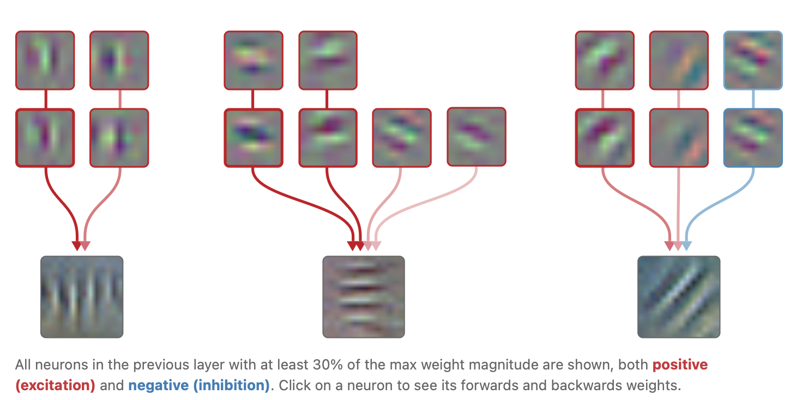
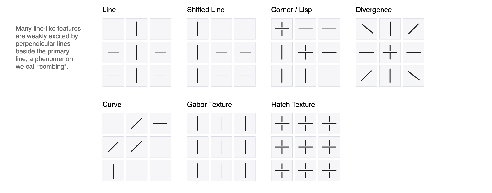
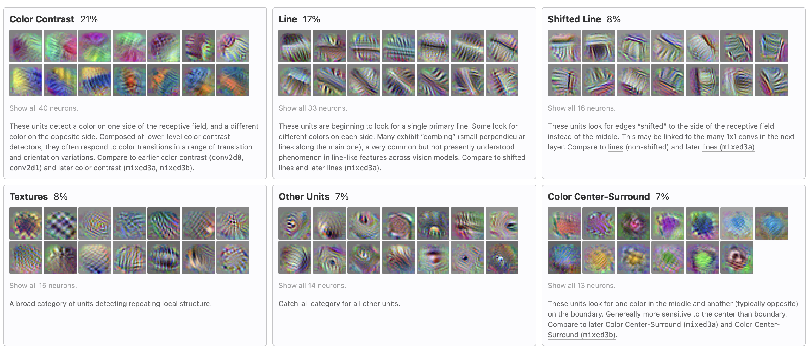
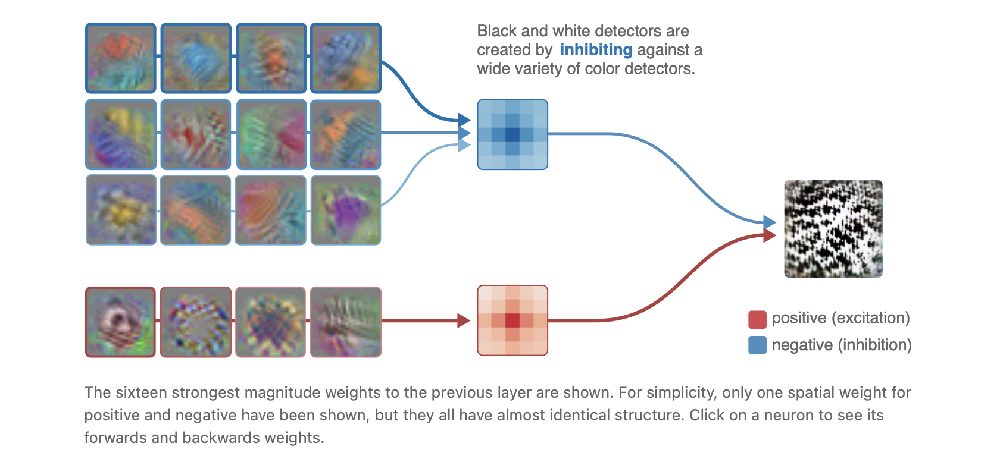

In this post, article 02 of Distil Circuits is introduced.

# An Overview of Early Vision in InceptionV1

이 글에서는 InceptionV1 (GoogleNet(2014) 논문에서 제시된 모델) 에서 첫 3개의 pooling layer가 나오기까지 5개의 conv layer (conv2d0, conv2d1, conv2d2, mixed3a, mixed3b)가 나오는데 여기까지의 layer를 대상으로 한다. 

## Terminology

$3 \times 32\times 32$ input img & $6 \times 3\times 5 \times 5$ filter →  $6 \times 28\times 28$ conv layer1 output  & $10 \times 6\times 5 \times 5$ filter → $10 \times 24\times 24$ conv layer2 output 을 생각하자. 

이 때, **circuit** 은 다음의 구성요소를 가진다.

- 1 neuron $\in$ Layer2   :  (이 때의 뉴런은 함수가 아니라 그 함수의 스칼라 값 자체를 의미.) Conv2 layer의 뉴런 1개
- 6 neurons $\in$ Layer1 : 현재 layer의 뉴런 값은 이전 layer에서 $6 \times 5 \times 5$ 개 neurons들의 일차결합으로 나타남을 이전 글에서 확인했다. 실제로 150개의 뉴런들을 모두 보여주기 복잡하니, channel 축으로 길이 6인 벡터 25개 중, L2 Norm이 가장 큰 벡터 1개 (뉴런 6개) 만을 보여준다.
- 6 weights $\in$ Layer2 : 위 6개의 뉴런과 곱해지는 6개의 weights를 의미한다.

**Neurons** 라 복수형으로 표현하면, 특정 filter에 대한 activation map 하나 (Conv layer1에서 $\mathbb R^{28\times 28}$ 공간의 matrix)  을 의미한다. 또는 해당 filter(feature)를 의미한다.

이 neurons에 대한 **Feature Visualization** 은, 이전 글에서 본 것처럼 $max_x \sum_{i,j} \hat v^Ta_{:i,j}^{(1)}$ 인 $x$를 visualize 한 것인데, 특별히 feature $\hat v$ 가 $(0, 0, 1, 0, 0, 0)$ 꼴이라 $max_x \sum_{i,j} a_{c, i,j}^{(1)}$ 인 $x$를 찾은 것으로 이해할 수 있다. 

## conv2d0

**conv2d0** 는 InceptionV1에서 Input 이미지 바로 뒤에 오는 첫 번째 conv layer를 의미한다. 

거의 모든 비전 모델에서, conv layer1에는 바로 **색 대비(color-contrast) 검출기**와 **가보르(Gabor) 필터** 가 존재한다. 

다만 다른 모델들과 비교해 보면, InceptionV1의 경우 이러한 특징들이 이상적인(color contrast detector나 Gabor filter로서의) 형태는 아니다. InceptionV1은 **Batch Normalization이나 Adam 옵티마이저**처럼, 깊은 모델을 안정적으로 학습시키는 데 표준처럼 쓰이는 기법들이 도입되기 이전에 설계된 모델이기 때문이다.

- **Gabor 필터** : 특정 방향의 줄무늬/경계(edge)를 detect 필터

가보르 필터가 거의 항상 서로 부호만 반대인(weight가 음수 관계인) 쌍으로 등장한다. InceptionV1뿐 아니라 다른 비전 모델들에서도 공통적으로 관찰된다.

예를 들어 세로 엣지를 찾는 필터를 상상해보자. 이 필터는 왼쪽은 밝고 오른쪽은 어두움(또는 반대) 같은 패턴을 좋아한다. 그런데 엣지가 필터 안에서 어느 칸에 걸치느냐에 따라 점수가 확 달라진다. 그래서 단일 Garbor는 엣지가 딱 맞는 위치에서만 강하게 반응하고 조금만 옮겨도 반응이 약해지거나 부호가 바뀔 수 있다.

필터를 뒤집으면, 같은 입력에 대해 점수가 부호만 바뀐다.

이후 ReLU가 있으므로 다음과 같이 동작한다. 

| 입력 패치(엣지 위치/밝기방향)     | +Gabor 출력 | ReLU(+Gabor) | -Gabor 출력 | ReLU(-Gabor) |
| --------------------------------- | ----------- | ------------ | ----------- | ------------ |
| 케이스 A (딱 맞음)                | +10         | 10           | -10         | 0            |
| 케이스 B (반대로 걸침/한 칸 이동) | -10         | 0            | +10         | 10           |

즉, 두 필터 중 하나의 값에서는 살아남게 된다.

## conv2d1

두 번째 layer에서는 **Complex Garbors** 가 나타난다. conv2d1에서는 $1 \times 1$ convolution 을 하므로, conv2d0에서의 각 filter (총 6개라 가정) 에 대해서 하나씩, 총 6개의 weight scalar가 존재한다.

- 위쪽 그림 : 각각은 conv2d0의 한 채널(feature, filter)에 대한 feature visualization 이다. 빨간색 테두리는 해당 filter를 적용한 output이 conv2d1에 weight 와 함께 곱해질 때 weight의 부호 (빨강이면 양, 파랑이면 음, 선이 굵을수록 크기가 큼) 을 나타낸다. 모든 filter가 아닌 해당 filter에 대응하는 weight scalar가 max의 30% 이상인 것만 표시한 것이다.
- 아래쪽 그림 :  conv2d1의 한 채널(feature, complex garbor filter)에 대한 feature visualization 이다. conv2d1에서는 $1 \times 1$ convolution을 하므로 각 garbor filter를 적용한, $28 \times 28$ output (크기는 실제와 다를 수 있음. 항상 생각하던 예시로 생각.) 에서 각 좌표의 스칼라는 conv2d0에서의 각 좌표 output의 filter 방향 합이 된다. 

conv2d1 complex garbor filter는 여러 방향/위상의 Gabor들을 동시에 받아 결합한다. 특히 conv2d0에서 부호가 반대인(reciprocal) Gabor들을 함께 양의 weight로 더하여 **명암 부호·정확한 위치 변화에 둔감한 엣지 검출기(Complex Gabor)**가 만들어진다. 이는 **union over cases(여러 경우 중 하나라도 만족하면 활성화)**의 초기 사례다.

## conv2d2

세 번째 layer인 conv2d2에서는 $3\times 3$ convolution을 적용한다. 

아래 그림에서 9개의 정사각형 각각은 conv2d2 layer의 filter 1개가 $9 \times 3\times 3$ 이라고 할 때, $3 \times 3$ filter 와 내적했을 때, 큰 값이 나오는 (이상적인) input 형태를 그린 것이다.

다음과 같은 filter가 conv2d2에 존재한다.

## mixed3a

네 번째 layer인 mixed3a에서는 **Black & White**  detector가 등장한다. 

왼쪽 각 정사각형은 이전 layer의 feature에 대한 feature visualization 이다. 모두 색과 관련된 feature임을 알 수 있다. 가운데 정사각형은 mixed3a layer의 Black & White filter가 적용할 16개의 (마찬가지로 예시용 숫자) $5 \times 5$ weight 중 하나를 보여준 것이다. 모두 음수이므로 대략적으로NOT(color_feature_1 OR color_feature_2 OR …)NOT(color_feature_1 OR color_feature_2 OR …) 을 계산한다고 볼 수 있다. 

이외에도 **small circle** detector, **triangle** detector 등이 등장한다. 

## mixed3b

다섯 번째 layer인 mixed3b에서는 mixed3a에서의 high-low frequency detector로부터 boundary detector를 만들어낸다.

또한, 곡선을 기반으로 한 원, S자, spiral 등 더 복잡하고 구체적인 형태 검출기들이 등장한다. 

머리카락처럼 털이 갈라지는 방향을 detect하는 방향성 있는 털(oriented fur) 검출기도 존재한다. 
