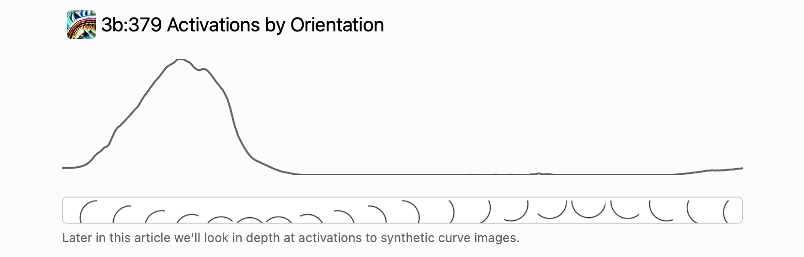
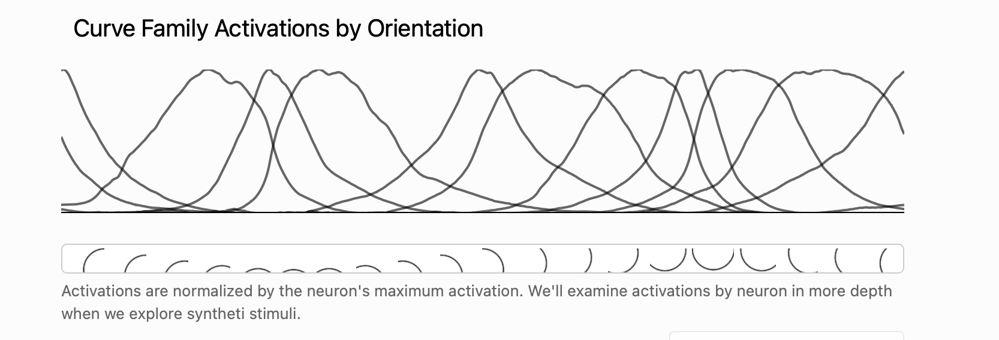
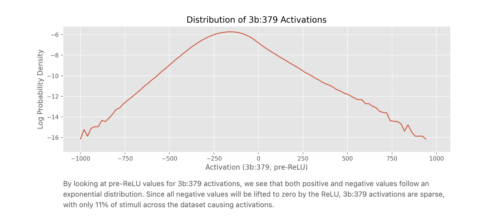
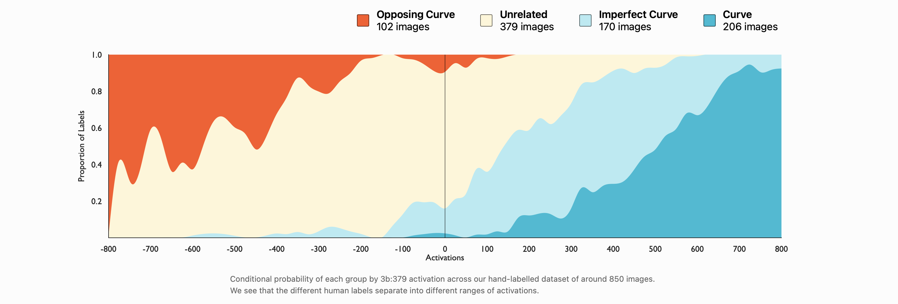
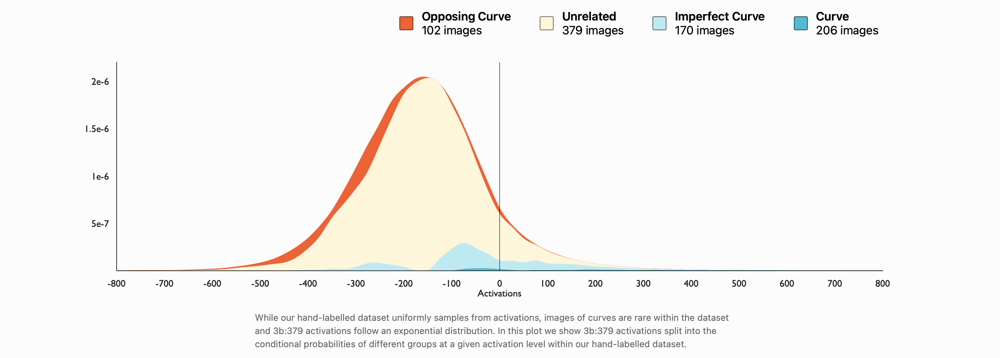
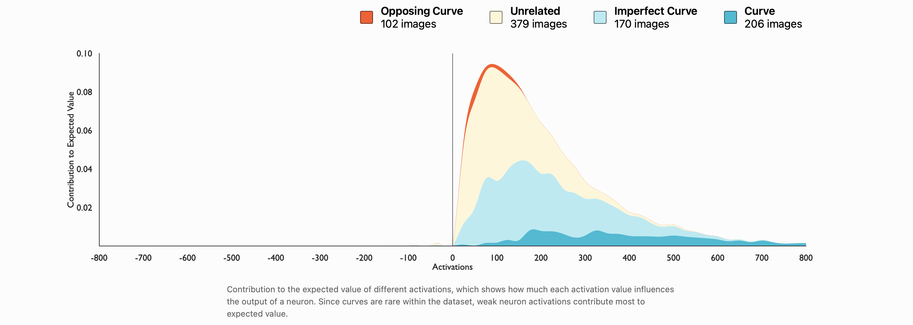
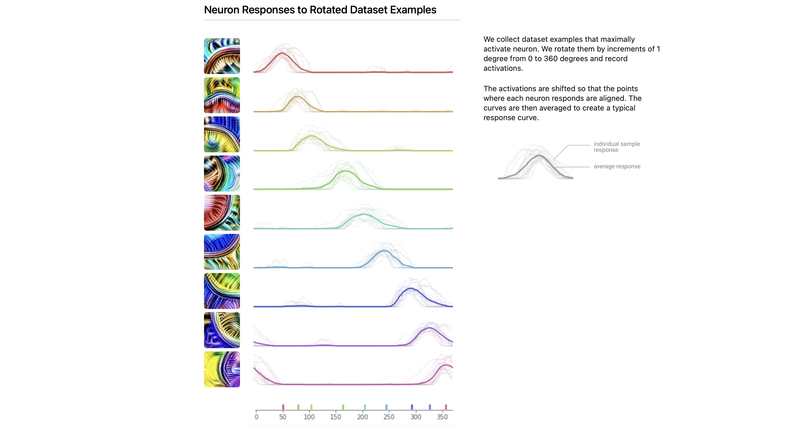
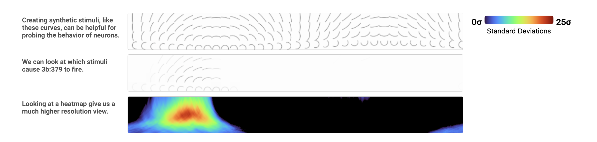
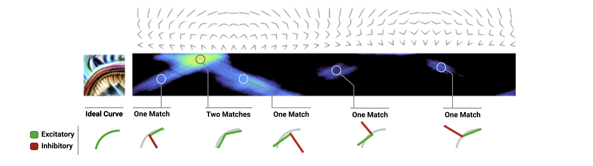
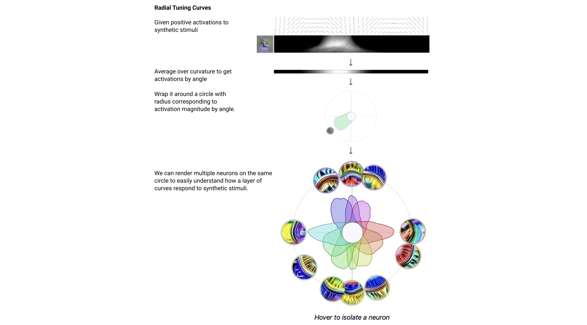

In this post, article 03 of Distil Circuits is introduced.

# Curve Detectors

이 글에서는 Curve Detectors에 대해 자세히 알아본다. 곡선 검출기는 커뮤니티가 널리 동의하는 1차 합성곱 층의 **에지 검출 가버 필터**에서 한 단계만 나아간 개념처럼 보인다. 또한 **인공적인 곡선은 생성이 매우 간단**하여, 엄밀한 실험 가능성을 풍부하게 제공한다. 그리고 곡선 검출기는 **몇 개의 합성곱 층 깊이**에만 존재하므로, **모든 뉴런의 연결을 입력까지 추적**할 수 있다. 그럼에도 불구하고, 모델이 구현한 **곡선 검출 알고리즘 자체는 상당히 정교**하다.

## A simplified Story of Curve Neurons

여기서 다루는 layer의 Curve Detector는 특정 방향의 curve에 반응하는 detector라고 이해하면 된다. 아래 그림은 3b layer의 뉴런 1개 (스칼라 1개)에 대해서 x축은 서로 다른 orientation을 가지는 input img이고 y축은 특정 좌표에서, curve detector의 특정 방향 activation 크기(즉, $6\times 5 \times 5$ 내적 연산인, 뉴런 1개의 연산) 를 나타낸 것이다.

아래 그림은 특정 좌표에서, 여러 curve detector의 activation 크기 (즉, 10개의 $6\times 5\times 5$ 내적 연산 결과)를 나타낸 것이다. 그 다음 layer에서 이 값들을 모두 더한 것이 해당 좌표에서 curve detector의 값이 될 것이다(따라서, 임의의 방향 곡선이 모두 큰 activation을 가진다). 그래프에 나타낼 때에는 뉴런의 max값을 기준으로 normalized 되어 있다. 

곡선 검출기가 실제로 곡선을 검출한다는 근거로는 다음이 있다. 

- **Causality** (인과성) : 곡선 검출기는 곡선과 우연히 상관된 다른 무언가 를 검출하는 것이 아니라, 진짜로 곡선이라는 특징 자체를 검출한다. feature visualization, visualizing attribution (아래 설명)을 통해 이를 보일 수 있다.
- **Generality** (일반성) : 곡선 검출기는 다양한 곡선 자극들에 모두 반응한다. 예를 들어, 곡률반경이 달라도 크게 활성화 된다. 색, 밝기, 텍스처 같은 외형적 요소에는 거의 불변이다. 첫 번째 article에서 설명한 synthetic stimuli로 이를 보일 수 있다. 
- **Purity** (순수성) : 곡선 검출기는 여러 의미를 동시에 가지는 polysemantic 뉴런이 아니며, 의미 있는 부차적 기능도 없다. 그 근거에 대해선 다음 article에서 다룬다. 
- **Family** (패밀리 구조) : 곡선 뉴런들은 집단으로서 모든 곡선 방향을 포괄한다. 

## Feature Visualization

Feature visualization 결과를 읽는 데에는 어느 정도의 숙련이 필요하며, 처음 접하는 사람에게는 이미지가 다소 혼란스럽게 느껴질 수 있다. 여기서 가장 중요하게 봐야 할 것은 곡선의 형태이다. 또한 곡선의 양쪽에 서로 반대되는 색조의 밝은 색이 나타나는 것을 볼 수 있는데, 이는 곡선 경계에서 색 변화가 존재하는 것을 선호한다는 것을 반영한다. 마지막으로 자세히 보면, 곡선의 경계에 수직한 방향으로 작은 선들이 나타나는 것을 확인할 수 있다. 우리는 이러한 작은 수직 선들에 대한 약한 선호를 combing이라고 부르며, 이는 이후에 다시 논의할 것이다.

곡선 뉴런을 최대한 강하게 활성화시키도록 feature visualization을 수행할 때마다, 항상 곡선 형태의 이미지가 생성된다. 심지어 다양성 항을 추가해 서로 다른 종류의 이미지를 만들도록 명시적으로 유도하더라도 결과는 동일하다. 이는 곡선 검출기가 일반적으로 말하는 의미에서 polysemantic, 즉 서로 다른 종류의 자극을 비슷한 정도로 선호하는 뉴런이 아니라는 점에 대한 매우 강한 증거다.

Feature visualization은 뉴런을 최대한 강하게 활성화시키는 이미지를 찾아주지만, 이러한 superstimulus가 정말로 해당 뉴런의 일반적인 행동을 대표하는 것일까 하는 의문이 남는다. 우리는 보통 feature visualization을 보면, 그와 질적으로 유사한 자극에 대해 뉴런이 강하게 반응하고, 해당 시각적 특징이 줄어들수록 반응도 점차 약해질 것이라고 상상한다. 그러나, **뉴런이 최대 활성화 근처에서는 곡선에만 반응하는 것처럼 보이지만, 실제 데이터에서 대부분을 차지하는 중간 또는 약한 활성화 구간에서는 전혀 다른 기준으로 반응할 수도 있다는 가능성을 배제할 수 없다.** 예를 들면, 뉴런이 완벽한 곡선에는 강하게 반응하고, 반응 곡선이 조금 있는 패턴에서 activation이 0.3 이고, 완전히 다른 질감 패턴에서도 activation 0.3 인 경우를 상상할 수 있다. 

따라서 뉴런이 실제로 어떻게 동작하는지를 이해하고 싶다면, 데이터셋에 포함된 실제 이미지들에 대해 그 뉴런이 어떻게 반응하는지를 직접 관찰하는 것만큼 확실한 방법은 없다.

##  Dataset Analysis

아래 그래프는 3b:379 뉴런이 여러 input img에 대해서 어떤 activation 분포를 가지는 지를 나타낸 것이다. (ReLU 이전의 pre-activation value를 본다).

- 3b:379의 pre-activation 평균은 약 -200이다. 대부분의 경우 이 뉴런은 강하게 음수 쪽에 있고, 그래서 ReLU를 통과하면 0이 된다. 실제로 데이터셋 전체에서 이 뉴런은 약 11%의 경우에만 발화한다. 즉, 약 89%의 경우에는 완전히 꺼져 있다. 이건 “곡선 검출기는 sparse하다”는 주장과 일치한다.

- 활성화되는 구간만 놓고, 확률을 로그 스케일로 그려보면, 직선에 가까운 형태가 나온다. 이건 활성화 값이 지수분포를 따른다는 뜻이다. 수식적으로 말하면, 가우시안처럼 $e^{-x^{2}}$ 로 빠르게 줄어드는 게 아니라 $e^{-x}$ 처럼 더 천천히 감소한다. 분포의 꼬리가 길어진다. 즉, 대부분의 활성화는 약하지만, 아주 드물게 매우 강한 활성화가 튀어나온다.

## Visualizing Attribution

3b:379 뉴런에 대한 attribution tensor는, 해당 뉴런에 영향을 준 3a layer의 activation 값에 가중치를 곱한 벡터(텐서)이다. 즉, $(w_0x_0, w_1x_1, …)$ 꼴이며 위 예시의 경우 $6\times 5\times 5 = 25$ size 임을 알 수 있다.  

지금까지는 filter나, 뉴런 1개에 대한 feature visualization을 보았다. 그러나 attribution tensor에 대해, feature visualization 을 적용한다는 것은,  3b:379를 활성화시킨 3a 층의 뉴런들을 많이 활성화시키는 img를 생성하는 것을 의미한다. 이 때, attribution tensor의 크기(절댓값)을 목적함수로 사용하여, $||(w_0x_0, w_1x_1, …)||$ 값이 최대가 되는 (즉, 각 $|x_i|$ 가 커질수록 좋다.) img를 찾는다. 이는 비록 그 영향이 3b:379 뉴런의 발화를 약화시키는 방향이었더라도, 곡선 뉴런에 영향을 준 곡선 관련 시각적 속성들을 확인하는 데 유용하다. 

아래 그림은, 3b:370 뉴런의 pre-activation 값 $w_0x_0+w_1x_1+...+w_{149}x_{149}$ 값을 x축으로 하여 해당 값이 나오는 img를 흑백 처리하여 나타낸 것이다. 

## Human Comparison

Nick Cammarata는, 3b:379의 pre-activation 값을 100 단위 구간(bin)으로 쪼개어, 각 구간에서 같은 개수의 input img를 랜덤하게 뽑아 총 800장의 이미지를 가지고 자신이 직접 다음의 4가지로 분류했다. 라벨링의 기준은 다음과 같다.

- curve :이미지에 곡선이 있으며, 그 방향이 뉴런의 feature visualization과 유사하다. 또한 그 곡선이 이미지의 가로 폭 대부분을 가로지른다.
- imperfect curve : 이미지에 곡선이 있고 뉴런의 feature visualization과 유사하긴 하지만, 하나 이상의 중요한 결함이 있다. 예를 들면 곡선이 너무 평평하거나, 중간에 각이 끼어 있거나, 방향이 약간 어긋난 경우다.
- unrelated : 이미지에 곡선이 없다.
- opposing curve : 이미지에 곡선이 있기는 하지만, 뉴런의 feature visualization과 비교했을 때 방향 차이가 45도 이상 나는 경우다.

이렇게 사람이 직접 라벨을 붙인 뒤, 같은 이미지들에 대해 3b:379의 activation 값을 비교했다. 그 결과를 stackplot으로 시각화해 보니, 사람의 라벨들이 activation 값 구간에 따라 매우 깔끔하게 분리되어 나타났다.

즉, 이 뉴런이 내는 하나의 스칼라 값은 단순한 내부 신호가 아니라, 사람이 인식하는 “이 곡선이 얼마나 적절한가”라는 판단과 매우 잘 정렬된 연속적인 척도라는 의미다. 이 실험의 중요성은 두 가지다.

- feature visualization이나 attribution 같은 해석 도구 없이도, 사람의 직관적 분류와 뉴런의 activation이 잘 맞는다는 점을 보여준다.
- 이 뉴런이 polysemantic해서 여러 의미를 뒤섞어 반응하는 게 아니라, 곡선의 방향과 품질이라는 하나의 기준을 따라 일관되게 반응한다는 강한 증거다.

사람이 보기에는 ‘무관한(unrelated)’으로 라벨링된 이미지들 중에서도, 3b:379를 활성화시키는 이미지들은 종종 아주 미세한 곡선을 포함하고 있으며, 이러한 곡선은 곡선 뉴런에 대한 attribution을 시각화했을 때 드러난다.

Nick은 수백 장의 곡선 이미지를 계속해서 보면서 라벨링을 진행하다 보니, 한 종류의 자극을 오랫동안 볼 때 발생하는 잔상 효과(afterimage effect)를 경험하게 되었고, 그 결과 미묘한 곡선을 감지하는 것이 점점 어려워졌다고 한다. 이로 인해, 관찰된 미세한 곡선들이 실제 구조인지 아니면 단순한 지각적 착시인지 판단하기가 힘들어졌다. Attribution을 시각화하면, 뉴런이 이미지에서 실제로 보고 있는 곡선을 드러낼 수 있으며, 이를 통해 사람의 라벨링 과정에서 놓친 곡선들을 확인할 수 있다. 이러한 경우에 한해서는, 3b:379가 인간보다 뛰어난 곡선 검출기처럼 보인다.

이제 전체 데이터셋에서 pre-activation 값의 분포와 인간의 라벨링 결과를 함께 보고 싶다. 이를 위해서, 위의 data anaylsis에서 했던 것처럼 전체 데이터 셋에 대한 3b:379의 pre-activation 값의 확률밀도 함수를 그린다. 그리고 색칠 할 때에는 인간 라벨링에서의 비율대로 한다. 예를 들어, activation [0, 100] 구간에서, 인간 라벨링의 비율이 opposing : unrelated : imperfect : curve = 2 : 5 : 3 : 1 이었다면 해당 비율대로 영역의 넓이를 색칠한다. 

확률밀도가 정말로 뉴런의 행동을 생각하기에 적절한 방식인지는 분명하지 않다. 압도적으로 대부분의 경우는 뉴런이 발화하지 않은 경우들인데, 그런 경우들을 실제로 중요하게 생각해야 할까? 그리고 어떤 뉴런이 매우 자주 ‘거의 발화하지 않는 수준’으로만 반응한다면, 그 사실은 네트워크에서 그 뉴런의 역할을 이해하는 데 얼마나 중요할까?

활성화 스펙트럼의 서로 다른 부분들이 얼마나 중요한지를 생각하기 위한 대안적 척도는 기댓값에 대한 기여도, 즉 $x \cdot p(x)$ 이다. ($x$ 는 3b:379의 activation 크기, $p(x)$ 는 해당 activation의 확률밀도함수 값) 이 척도는 해당 활성화 값이 뉴런의 출력에 얼마나 영향을 주는지, 그리고 더 나아가 네트워크의 행동에 얼마나 영향을 주는지에 대한 근사치로 볼 수 있다. 물론 높은 활성화 사례가 이 척도 이상으로 불균형하게 중요할 이유도 여전히 있을 수 있다(예를 들어 max pooling에서는 가장 큰 값만 중요하다). 하지만 기댓값에 대한 기여도는 합리적인 추정치처럼 보인다.

앞에서 확률밀도를 살펴보았을 때, 3b:379가 정말로 의미 있는 의미에서 곡선 검출기인지에 대해 회의적인 시각을 가질 수도 있었을 것이다. 비록 이 뉴런이 강하게 발화할 때는 매우 높은 선택성을 보이지만, 그런 경우들이 확률밀도 그래프에서는 아예 보이지도 않을 정도라면, 그것이 과연 중요한 역할이라고 할 수 있을까? 그러나 기댓값에 대한 기여도를 살펴보면, 보수적인 기준으로 보더라도 곡선과 불완전한 곡선이 전체의 55%를 차지함을 알 수 있다. 이는 이 뉴런이 실제로 곡선 검출기라는 가설과 잘 부합하며, 나머지 자극들은 라벨링 오류이거나 잡음이 많은 이미지로 인해 뉴런이 오작동한 경우로 해석할 수 있다.

(Q : 이번엔 post-activation 값? 왜 음수 영역 없지?)

지금까지 데이터셋을 분석한 실험들은 3b:379의 활성화가 이미지에 곡선이 포함되어 있는지에 대한 인간의 라벨링 판단과 대체로 대응된다는 것을 보여주었다. 또한 이러한 이미지들의 attribution 벡터를 시각화해 보면, 이 이미지들이 뉴런을 활성화시키는 이유가 실제로 이미지 속의 곡선 때문이라는 점을 알 수 있으며, 우리가 우연한 상관관계에 속고 있는 것은 아님을 확인할 수 있다. 하지만 이러한 실험들만으로는 곡선 뉴런이 곡선 이미지를 검출한다고 단정하기에는 충분하지 않다. 데이터셋에서 곡선 이미지가 드물게 나타나기 때문에, 이를 이용해 곡선 이미지를 체계적으로 연구하는 데에는 한계가 있다. 따라서 다음 실험들에서는 이를 직접 다루어, 곡선 뉴런이 합리적인 곡선 이미지 공간 전반에 대해 어떻게 반응하는지를 집중적으로 연구할 것이다.

## Joint Tuning Curves

우리의 앞선 두 실험은, 각각의 곡선 검출 뉴런이 **서로 다른 방향(orientation)의 곡선**에 반응한다는 것을 시사한다. 다음 실험의 목적은, 이 뉴런들이 실제로 **같은 곡선 특징의 회전된 버전들**을 검출하고 있는지 확인하고, 각 유닛이 **방향 변화에 얼마나 민감한지**를 정량적으로 설명하는 것이다.

이를 위해 우리는, 특정 곡선 검출 뉴런을 발화시키는 **자연 이미지 데이터셋의 예제들**을 선택한 뒤, 이 이미지들을 **회전시켰을 때 모든 곡선 검출 뉴런들이 어떻게 반응하는지**를 나타내는 **joint tuning curve(공동 튜닝 곡선)**를 만든다.

각 뉴런은 자신이 선호하는 방향(preferred orientation)을 중심으로 **가우시안 형태의 봉우리(bump)**를 가지며 반응한다. 한 뉴런의 반응이 줄어들면 다른 뉴런의 반응이 증가하는 식으로, 이 뉴런들은 함께 작동하여 **곡선의 모든 방향 공간을 공동으로 커버**한다.

## Synthetic Curves

곡선 검출기들은 특히 방향과 곡률에 가장 민감한 것으로 보이므로, 우리는 이 두 가지를 곡선 렌더러의 파라미터로 사용한다. 이를 통해 방향이나 곡률이 어떻게 변할 때 특정 뉴런, 예를 들어 3b:379가 발화하는지를 측정할 수 있다. 

아래 그림에서 첫 번째 그림들은, 인간이 인위적으로 만들어낸 여러 조건의 곡선들이다.(가로축은 방향, 세로축은 곡률로 볼 수 있다.) 가운데 그림들은 해당 그림들을 input으로 넣었을 때, 3b:379의 activation 정도를 굵기로 표현한 것이고 가장 아래쪽은 색상으로 표현한 것이다. 

굉장히 복잡한 자연 이미지(또는 feature visualization 결과)가 아니라 아주 단순하게 그린 곡선 그림만으로도 이 뉴런은 엄청나게 강하게 반응한다. 그 강함의 정도가 ImageNet 전체에서 이 뉴런이 보통 보이는 평균 반응보다무려 24σ 나 위에 있을 정도로 극단적이다.

삼각형 모양의 기하 구조는, 곡률이 더 큰 곡선일수록 곡선 검출기들이 더 넓은 범위의 방향에 반응한다는 것을 보여준다. 이는 곡률이 큰 곡선일수록 더 많은 방향 성분을 포함하고 있기 때문이다. 예를 들어, 직선은 곡선 방향을 전혀 포함하지 않지만, 원은 모든 곡선 방향을 포함한다. 합성 이미지에서 위쪽에 가까운 것들은 직선에 더 가까우므로, 이 경우 활성화가 더 좁은 범위에만 나타난다.

이러한 흐릿한 패턴(wisps)은 방향이나 곡률의 아주 작은 변화만으로도 활성화가 극적으로 변할 수 있음을 보여주며, 이는 곡선 검출기들이 취약하고 강건하지 않다는 것을 의미한다. 안타깝게도 이는 곡선 뉴런들만의 문제가 아니라, 뉴런 패밀리 전반에 걸쳐 나타나는 보다 일반적인 문제이며, 우리는 이를 두 번째 합성곱 층(conv2d1)의 가보르(Gabor) 패밀리에서 이미 관찰할 수 있다.

## Synthetic Curves

합성 곡선 실험과 데이터셋 분석 모두에서, 곡선 뉴런들은 방향(orientation)에는 민감하지만 곡선의 반지름(radius)에 대해서는 상당히 넓은 허용 범위를 가진다는 점이 나타난다. 극단적인 경우, 곡선 뉴런들은 좁은 방향 범위 내에서는 직선(edge)에도 부분적으로 반응하는데, 이는 반지름이 무한대인 곡선으로 볼 수 있다. 이 때문에 곡선 뉴런들이 실제로는 “곡선” 자체에 반응한다기보다는, 올바른 방향을 가진 다양한 형태들에 반응하는 것처럼 보일 수도 있다.

우리는 모든 가능한 형태를 체계적으로 생성해 실험할 수는 없지만, 이러한 가설을 검증하기 위한 좋은 테스트 사례로 각도(angle)를 사용할 수 있다고 생각한다.

다음 실험에서는 합성 곡선 실험과 유사하게 합성 각도를 변화시킨다. 이때 y축에는 반지름을, x축에는 방향을 두고 각 뉴런의 반응을 측정한다.

활성화는 두 개의 뚜렷한 선 형태로 나타나며, 이 두 선이 만나는 지점에서 가장 강한 활성화가 발생한다. 각각의 선은 각(angle)을 이루는 두 직선 중 하나가 곡선의 접선 방향과 정렬되는 경우에 해당한다. 이 두 선이 서로 만나는 지점은, 해당 각이 뉴런의 feature visualization과 방향이 일치하는 곡선과 가장 유사해지는 경우다. 활성화 지도 오른쪽에 나타나는 더 약한 활성화들도 같은 원인에서 나오지만, 이 경우에는 각 자극의 억제(inhibitory) 절반이 안쪽이 아니라 바깥쪽을 향하고 있다.

우리가 처음 살펴본 자극은 합성 곡선이었고, 두 번째 자극은 합성 각도였다. 다음 예시들에서는 각도에서 곡선으로 점진적으로 변해가는 일련의 자극들을 보여준다. 각 열(column)에서 가장 강한 활성화는 이전 열보다 더 강한데, 이는 자극이 점점 더 둥글어질수록 곡선에 가까워지고, 그 결과 곡선 뉴런이 더 강하게 발화하기 때문이다. 또한 자극이 점점 더 둥글어질수록, 활성화의 “삼각형 영역”은 점점 더 채워지는데, 이는 원래 각 자극을 이루던 두 직선이 부드러운 호(arc)로 전이되기 때문이다.

이 인터페이스는 여러 자극 속성이 변할 때 **서로 다른 곡선 뉴런**들이 어떻게 반응하는지를 살펴보는 데 유용하지만, 다소 복잡하다. 다음 섹션에서는 서로 다른 레이어에 걸친 곡선 뉴런 패밀리를 탐구할 것이며, 이를 위해 곡선 뉴런 패밀리의 활성화를 더 간결한 방식으로 볼 수 있는 방법이 필요하다. 이를 위해 우리는 방사형 튜닝 곡선(radial tuning curve)을 도입한다.

## Radical Tuning Curve

방사형 튜닝 곡선을 그리는 과정은 다음과 같다.

1. 합성 자극에 대한 활성화 : 맨 위에서는 합성 곡선 자극들을 여러 방향과 곡률로 만들어서, 특정 뉴런이 얼마나 강하게 반응하는지를 측정한다. 가로축은 방향, 세로축은 곡률이라고 생각하면 되고, 밝을수록 활성화가 큰 영역이다. 이건 2차원 튜닝 맵이다.
2. 곡률에 대해 평균내기 : 곡률 축을 없앤다. 즉, 같은 방향에 대해 여러 곡률에서 나온 활성화를 평균낸다. 그러면 “이 뉴런은 방향별로 얼마나 반응하는가”라는 1차원 함수가 된다. 검은 막대처럼 보이는 것이 각 방향에 대한 평균 활성화다. 어짜피 곡률축 없앨거면 뭐하러 고려하나? “이 뉴런이 이 방향을 좋아한다”는 말이 곡률 하나에만 우연히 맞았을 가능성을 배제하기 위에 애초에 곡률축을 사용했던 것.
3. 원으로 감기 : 이 1차원 방향-활성화 값을 원 위에 감는다. 각도는 방향에 대응하고, 원점에서의 반지름은 그 방향에서의 활성화 크기다. 반지름이 길수록 그 방향의 곡선에 강하게 반응한다는 뜻이다. 이렇게 생긴 물방울 모양이 한 뉴런의 방사형 튜닝 곡선이다.
4. 여러 뉴런을 한 번에 보기 : 맨 아래 그림에서는 여러 곡선 뉴런을 같은 원 위에 겹쳐서 그린다. 각 색이 다른 뉴런이다. 이렇게 하면 한 레이어 안에서 곡선 뉴런들이 서로 다른 방향을 어떻게 나눠서 담당하는지, 즉 방향 공간을 어떻게 커버하는지를 한눈에 볼 수 있다.

이 방식은 이전의 방식보다 한 눈에 알아보기 쉽고, 실제 angle과 대응된다는 점에서 의미가 있다.

## The Family of InceptionV1

지금까지 우리는 3b에 있는 곡선 뉴런들의 한 집합을 살펴봤다. 하지만 InceptionV1에는 실제로 네 개의 연속된 레이어에 걸쳐 곡선 뉴런들이 존재하며, 3b는 그중 세 번째 레이어다. conv2d2(InceptionV1에서 3번째 conv layer), 3a, 3b, 4a가 있다.

## Repurposing Curve Detectors

우리는 곡선 자체에 본질적인 관심이 있어서가 아니라, 신경망을 더 잘 이해하기 위해 곡선 뉴런을 연구하기 시작했다. 그러나 연구를 진행하면서, 곡선 검출이 항공 영상, 자율주행차, 의료 연구와 같은 분야에서 중요하다는 사실을 알게 되었고, 각 분야마다 고전적인 컴퓨터 비전에서 곡선 검출에 대한 방대한 연구 문헌이 존재한다는 것도 인식하게 되었다. 우리는 곡선 뉴런 패밀리를 활용해 몇 가지 서로 다른 곡선 관련 컴퓨터 비전 작업을 수행하는 기법을 프로토타입으로 구현했다. 한 가지 작업은 곡선 추출(curve extraction)로, 이미지에서 곡선에 해당하는 픽셀들을 강조하는 작업이다.

// ToDo

그중 하나의 작업은 곡선 추출이다 [29]. 이는 이미지에서 곡선에 해당하는 픽셀들을 강조하는 작업이다. 이 글에서 우리가 해온 것처럼 곡선 뉴런에 대한 attribution을 시각화하는 것은 곡선 추출의 한 형태로 볼 수 있다. 여기서는 혈관의 X-ray 이미지인 angiogram에 대해, 널리 사용되는 Canny 엣지 검출 알고리즘과 이를 비교한다. 이 이미지는 [29]의 Figure 2.1에서 가져왔다.
Attribution 시각화는 선과 곡선을 명확히 분리하고 밝히며, 시각적 아티팩트도 더 적게 보여준다. 그러나 강한 빗질(combing) 효과가 나타나는데, 이는 추적 중인 에지에서 수직 방향으로 원치 않는 선들이 뻗어나오는 현상이다. 이러한 선들이 실제 응용에서 얼마나 해로운지는 확실하지 않지만, 곡선 뉴런의 회로를 편집함으로써 제거할 수 있을 가능성이 있다고 생각한다.

우리는 이 방법이 경쟁력 있는 곡선 추적 알고리즘이라고 주장하려는 것은 아니다. 최첨단 곡선 검출 알고리즘들과의 정밀한 비교를 수행하지도 않았고, 특정 목적에 맞게 정교하게 튜닝된 고전적 알고리즘들이 우리의 접근법보다 더 뛰어날 가능성이 크다고 생각한다. 대신, 여기서의 목표는 신경망 내부 표현을 활용함으로써 매우 넓은 시각적 연산의 공간이 열린다는 점을 탐구하는 것이며, 곡선 추출은 그중 하나의 지점에 불과하다.

**스플라인 파라미터화**

무엇을 최적화하느냐를 바꾸면 이 공간의 더 많은 부분에 접근할 수 있다. 지금까지는 픽셀을 최적화해왔지만, 곡선을 렌더링하는 미분 가능한 파라미터화 [25]를 만들 수도 있다. 이는 [30], [31]의 연구와 유사하다. Attribution으로부터 입력을 거쳐 스플라인의 제어점(knots)까지 역전파함으로써, 우리는 이제 곡선을 추적할 수 있고, 이미지 속 곡선을 설명하는 최적의 스플라인 방정식을 얻을 수 있다. 우리는 이 접근법의 초기 프로토타입을 만들었다. 곡선 뉴런이 다양한 환경에서 작동하기 때문에 [11], 우리의 스플라인 파라미터화 역시 그러하다.

**알고리즘적 조합**

겉보기에는 무관해 보이는 또 다른 시각적 연산으로 이미지 분할(image segmentation)이 있다. 이는 비음수 행렬 분해(NMF) [30, 32]를 사용해 비지도 방식으로 수행할 수 있다. 우리는 스플라인 파라미터화를 이용해 각 분해 요소에 대한 attribution을 시각화함으로써, 이미지 속 서로 다른 객체들의 곡선을 추적할 수 있다.

단일 이미지의 활성화만을 분해하는 대신, 많은 나비 이미지들을 함께 분해하면, 네트워크 안에서 전반적으로 나비에 반응하는 뉴런들을 찾을 수 있다. 활성화를 분해하는 것과 일반적인 이미지 분할의 큰 차이점은, 우리가 픽셀이 아니라 뉴런의 집합을 얻는다는 점이다. 이 뉴런 집합은 일반적인 이미지들에서 나비를 찾는 데 적용할 수 있고, 이를 미분 가능한 스플라인 파라미터화와 결합하면, 어떤 이미지에든 적용할 수 있는 단일 최적화 과정으로 나비를 자동으로 찾아내고, 그에 맞는 스플라인 방정식을 얻을 수 있다.

위의 예제에서 우리는 나비와 곡선을 조작했지만, 그 세부 사항에 대해 신경 쓸 필요는 없었다. 다양한 종과 방향의 나비를 인식하는 복잡함은 뉴런들에게 맡기고, 우리는 ‘나비’라는 추상적인 개념을 다루는 데 집중할 수 있었다.

우리는 이것이 고전적 컴퓨터 비전과 딥러닝을 결합하는 흥미로운 방법 중 하나라고 생각한다. 위에서 보인 기법을 확장하는 데에는 아직 손쉽게 따낼 수 있는 열매들이 많다. 우리의 스플라인 파라미터화는 아직 초기 프로토타입이고, 사용한 신경망도 반세기 가까이 된 모델이기 때문이다. 그러나 우리는 특정 작업 하나의 성능을 개선하는 것보다, 사용자들이 작업과 작업 사이의 공간을 탐색할 수 있게 하는 연구에 더 큰 흥미를 느낀다 [33]. 일단 작업이 명확히 정해지면, 그 작업만을 위해 신경망을 학습시키는 것이 보통 최상의 성능을 낸다. 하지만 현실 세계의 작업은 정밀하게 정의되는 경우가 드물며, 진짜 어려운 문제는 어떤 작업에 집중할지를 찾기 위해 작업 공간 자체를 탐색하는 것이다.

예를 들어, 이미지에서 나비의 스플라인을 자동으로 찾는 알고리즘이 더 발전한다면, 나비 영상 데이터를 애니메이션으로 변환하는 기반으로 사용할 수 있을 것이다 [12]. 하지만 애니메이터는 질감 뉴런을 추가하고, 부드러운 브러시 파라미터화로 바꿔 로토스코핑 스타일을 적용하고 싶어할 수도 있다. 렌더링에 사용되는 모든 뉴런에 접근할 수 있기 때문에, 털 뉴런 패밀리나 특정 개 품종에 대한 뉴런의 attribution을 조작해, 영화 전체에서 특정 개 종의 털 표현 방식을 바꿀 수도 있다. 이러한 알고리즘들은 신경망을 재학습시키거나 학습 데이터를 필요로 하지 않기 때문에, 원칙적으로는 애니메이터가 이 알고리즘 공간을 실시간으로 탐색할 수 있다. 이는 빠른 피드백 루프가 창의성을 끌어내는 데 중요하기 때문에 매우 의미 있는 점이다.

## The Combining Phenomenon

곡선 검출기에서 흥미로운 현상 중 하나는, 곡선의 접선 방향에 수직인 작은 선분들에 의해 (곡선의 안쪽이든 바깥쪽이든) 강하게 활성화된다는 점이다. 이 현상은 feature visualization을 보면 가장 쉽게 관찰할 수 있다. 우리는 이 현상을 “combing”이라고 부른다.

Combing은 ImageNet이 아니라 Places365로 학습된 모델을 포함해, 여러 모델의 곡선 검출기 전반에서 관찰된다. 심지어 생물학적 신경계에서도 유사한 현상이 나타난다는 약한 증거가 있다. 원숭이 시각 피질 V4 영역의 생물학적 뉴런에 대해 feature visualization과 유사한 절차를 수행한 연구에서는, 바깥쪽으로 짧은 선들이 튀어나온 원형 모양이 가장 강하게 뉴런을 활성화시키는 자극 중 하나였다고 보고했다.

Combing이 왜 생기는지에 대해서는 여러 가설이 제안되었지만, 아직 결정적인 설명은 없다.

한 가지 가설은 현대 세계에서 중요한 많은 곡선들이 실제로 곡선에 수직인 선들을 동반한다는 것이다. 예를 들어 바퀴의 스포크, 시계 테두리의 눈금 같은 것들이다.

관련된 또 다른 가설은, combing이 어떤 경우에는 털(fur) 같은 패턴을 검출하는 데 곡선 검출기를 활용할 수 있게 해준다는 것이다. 또 다른 가설은, 곡선은 그 방향으로 향하는 수직 선들이 있을 때 더 높은 “대비(contrast)”를 가진다는 설명이다. 데이터셋 분석에서 ReLU 이전의 강한 음수 활성화가 반대 방향의 곡선에서 나타났다는 점을 떠올려 보면, 곡선 검출기는 곡선과 그 주변 공간 사이의 방향 변화가 크기를 원할 수 있다. 이때 단색 영역보다는 수직 선들이 더 강한 대비로 작용할 수 있다.

마지막으로, combing은 실제로는 곡선 검출기를 구현하기 위한 편의적인 방식일 뿐이며, 본질적으로 유용한 특성이 아니라 회로 구성에서의 지름길이 만들어낸 부작용일 가능성도 있다. conv2d1에서 엣지 검출기는 conv2d0의 수직 선들에 의해 억제된다. 선이나 곡선 검출기가 해야 하는 일 중 하나는, 이미지가 단순한 반복 텍스처가 아니라 대비를 가진 강한 선을 포함하고 있는지를 확인하는 것이다. 이 과정에서 접선 방향으로 평행한 선들을 약하게 억제하는 방식이 사용되는 것으로 보인다. 수직 선에 의해 흥분되는 구조는, 이전 레이어에 별도의 전용 뉴런을 만들지 않고도 “흥분성 뉴런을 억제한다”는 패턴을 구현할 수 있는 쉬운 방법일 수 있다.

Combing은 곡선에만 나타나는 현상이 아니다. 직선에서도 관찰되며, 직선의 미분 형태라고 볼 수 있는 거의 모든 형태 특징에서 나타난다. combing 현상에 대해서는 더 많은 연구가 가능하다. 왜 combing이 형성되는가? 적대적 공격에 강인한 모델에서도 유지되는가? Ilyas 등[13]이 말하는 “비강인(non-robust) 특징”의 한 예일 수 있는가?

