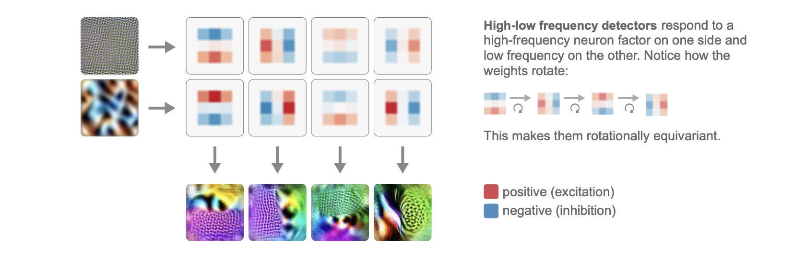
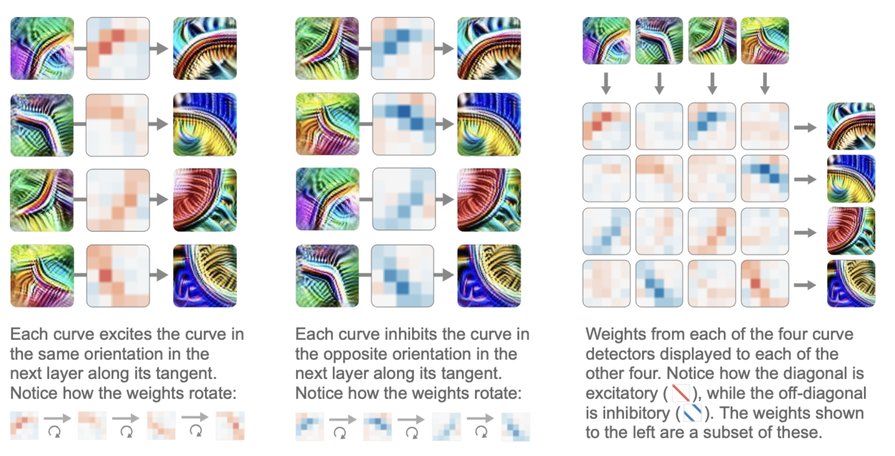
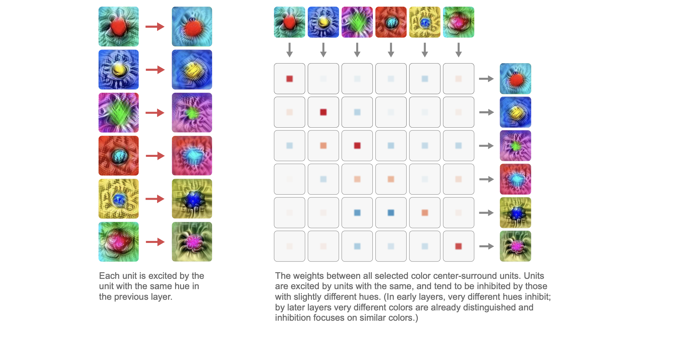

In this post, article 04 of Distil Circuits is introduced.

# Naturally Occurring Equivariance in Neural Networks

이 글에서는 Circut motif중 하나인 Equivariance에 대해 다룬다.

## Equivariant Features

등변성이란, 입력에 변환 g를 가했을 때, 출력도 **같은 방식으로 변환**되는 성질을 의미한다.

$f(T_g(x))=T^`_g(f(x))$

- $T_g$ : 입력 공간에서의 변환 (회전, 이동, 스케일 등)
- $T^`_g$:  출력 공간에서의 대응되는 변환

**회전 등변성 (Rotational Equivariance)**

등변성의 한 예는 **같은 특징이 회전된 형태들**이다. 이러한 현상은 특히 **초기 시각 처리(early vision)** 단계에서 매우 흔하게 나타나며, 예를 들어 **곡선 검출기(curve detectors)**, **고·저주파 검출기(high–low frequency detectors)**, **선 검출기(line detectors)** 등이 이에 해당한다.

즉, input을 회전시켜 입력하면, weight 값이 회전된 또 다른 뉴런이 같은 크기만큼 활성화된다. 

조금 더 넓은 의미의 등변성은 **같은 개념적 특징(feature)**이 입력 변환에 따라 **다른 위치 / 다른 레이어 / 다른 뉴런**으로 “이동”하는 것을 의미한다.

**스케일 등변성 (Scale Equivariance)**

회전된 버전만이 우리가 관찰하는 변화의 전부는 아니다. **같은 특징이 서로 다른 스케일에서 나타나는 경우**도 매우 흔하다. 다만 보통은 스케일이 다른 특징들이 **서로 다른 레이어**에서 나타난다. 예를 들어, 우리는 매우 다양한 스케일에 걸친 **원 검출기(circle detectors)**를 관찰할 수 있는데, 작은 원들은 초기 레이어에, 큰 원들은 더 뒤쪽 레이어에 존재한다.

**색상 등변성 (Hue Equivariance)**
색상 등변성이란 동일한 공간적 구조나 패턴을 가지되, 색상(hue)만 서로 다른 특징들이 존재하며 입력의 색상이 변하면 그에 대응하는 다른 뉴런이 활성화되는 현상을 말한다. 즉, 물체의 형태나 배치와 같은 구조적 정보는 그대로 유지된 채 색상만 바뀌었을 때, 신경망 내부에서는 동일한 역할을 수행하는 색상별 변형 뉴런들이 서로 교대하며 반응한다. 이는 회전 등변성에서 각도 변화에 따라 활성화되는 뉴런이 바뀌는 것과 유사하게, 색상 공간에서의 변화가 뉴런 인덱스의 변화로 대응되는 경우이다.

**색상–회전 등변성 (Hue–Rotation Equivariance)**
색상–회전 등변성은 색상 변화와 공간적 회전이 서로 독립적이지 않고 결합되어 작용하는 경우로, 특히 색 대비를 감지하는 초기 시각 뉴런에서 나타난다. 이러한 뉴런은 한쪽에는 특정 색상을, 반대쪽에는 그에 대응되는 보색을 감지하는데, 색상을 180도 순환시키면 어느 쪽에 어떤 색이 있는지가 뒤바뀌어 결과적으로 입력을 180도 회전시킨 것과 동일한 효과를 낸다. 따라서 이 경우에는 색상 변화와 회전 변화가 같은 변환으로 인식되며, 신경망 내부에서 색과 방향이 얽힌 대칭 구조를 형성한다.

**반사 등변성 (Reflection Equivariance)**

네트워크의 **중간 레이어(mid layers)**로 갈수록 회전에 따른 변형은 덜 두드러지게 나타나는 반면, **좌우 반전(horizontal flip)**된 특징 쌍이 매우 흔해진다. 즉, 어떤 특징이 왼쪽 방향으로 나타나면 그에 대응되는 **좌우가 뒤집힌 동일한 의미의 특징**도 함께 존재하며, 입력 이미지를 좌우 반전시키면 활성화되는 뉴런 쌍이 서로 바뀐다. 예를 들어 개의 주둥이, S자 곡선, 사람 옆에 동물이 있는 장면과 같은 고수준 특징들은 방향만 반대일 뿐 의미적으로 동일하기 때문에, 네트워크는 이를 반사 변환에 대해 등변적으로 표현한다.

**기타 등변성 (Miscellaneous Equivariance)**

마지막으로, 회전·반사·스케일처럼 전통적으로 정의된 변환이 아니더라도, **본질적으로 같은 의미를 유지하는 변형들**에 대해 등변적인 구조가 나타난다. 예를 들어 같은 개 얼굴 특징이지만 주둥이 길이가 짧거나 긴 경우, 같은 특징이 인간과 개라는 서로 다른 대상에 적용되는 경우, 혹은 카메라 시점(perspective)이 달라졌을 때의 장면 표현 등이 이에 해당한다. 이러한 변형들은 고전적인 의미의 수학적 등변성이라고 보기는 어렵지만, 신경망 내부에서는 입력의 변화에 따라 **동일한 개념적 특징이 예측 가능한 방식으로 대응**된다는 점에서 본질적으로 등변성과 같은 역할을 한다.

## Equivariant Circuits

우리가 뉴런 수준에서 관찰하는 등변적 행동은, 사실 신경망의 **가중치(weight)**와 그 가중치들이 만들어내는 **회로(circuit)** 안에 존재하는 더 깊은 대칭성의 반영이다. 즉, 등변성은 개별 뉴런의 우연한 성질이 아니라, 여러 뉴런이 연결되어 형성하는 **회로 구조 자체**에 뿌리를 두고 있다.

이 글에서는 먼저 **회전 불변(invariant)**인 특징들로부터 **회전 등변(equivariant)**인 특징이 만들어지는 경우를 살펴본다. 이 “불변 → 등변” 구조는 가장 단순한 형태의 등변적 회로이다. 그 다음으로 “등변 → 불변” 회로를 보고, 마지막으로 가장 복잡한 “등변 → 등변” 회로를 다룬다.

### Invariant → Equivariant

**하이–로우 주파수 회로 (High–Low Circuit)**

고주파-저주파 검출기는 이전 레이어에서 고주파 / 저주파 성분이라는 두 가지 feature을 결합해 형성된다. 이전 레이어의 고주파 filter, 저주파 filter는 Invariant 하다. **Invariant** 하다는 의미는, input을 회전 시켜도 입력을 회전시켜도, 출력(활성화된 표현)이 동일하다. 즉, 방향 정보 없이 얼마나 촘촘한 패턴이 있는지 등을 보기 때문에 weight는 동일하다. high-low freq detector가 $2 \times 5 \times 5$ 인 filter라고 가정하자. 여기서 2는 이전 layer의 고주파 filter, 저주파 filter에 해당한다. 이 고주파 filter를 통과한 feature map에 대해서는 $5\times 5$ weight 에서 왼쪽은 (+), 오른쪽은 (-)로 학습되고, 저주파 filter를 통한 feature map에 대해서는 왼쪽은 (-), 오른쪽은 (+)로 학습된다. 그렇게 되면, high-low freq detector는 input의 왼쪽에 고주파, 오른쪽에 저주파가 있는 이미지 일수록 큰 output을 만들어낸다.  

이런식으로, 좌우방향, 위아래, 대각선 방향에 대한 고주파-저주파 검출기가 존재하고, 가중치 자체가 회전 대칭을 이루고 있기 때문에, 입력이 회전하면 출력 역시 그에 맞게 회전된 형태로 대응된다(feature map 전체가 채널축을 기준으로 재배치된다는 의미, 이렇게 채널축으로 재배치되는 경우가 equivariant에 해당한다. 예를 들어, 하나의 high-low freq detector가 존재하여 filter가 $8\times 5\times 5$ 로 좌우, 위아래, 대각선 방향을 모두 고려하여 input이 달라지면 마찬가지로 회전된 다른 weight가 똑같이 활성화되는 특징은 있지만 output은 일관되게 하나로 높은 경우, 즉 high-low freq가 존재한다는 결론만 내리는 경우 equivariant가 아닌 invariant이다). 이로 인해 이 회로는 **회전 등변성(rotational equivariance)**을 갖게 된다.

### Equivariant → Invariant

**Contrast → Center Circuit **

이 회로는 **방향을 가진 색 대비 특징들(equivariant)**을 모아서 **방향과 무관한 중심–주변(center–surround) 특징(invariant)**을 만든다. 예를 들어, 여러 방향의 초록–보라 색 대비 검출기들이 각각은 “어느 쪽이 초록이고 어느 쪽이 보라인지”라는 방향 정보를 담고 있지만, 이들을 모두 합치면 “중심은 초록, 주변은 보라”라는 **방향 없는 개념**만 남는다. 중요한 점은 이 회로의 가중치 구조가 이전 회로와 사실상 동일하지만, **입력과 출력의 역할만 바뀐 전치(transpose)** 형태라는 것이다. 즉, 등변적인 특징을 만드는 데 쓰이던 구조가 그대로 불변 특징을 만드는 데 재사용된다.

**BW–Color Circuit (색상 요인 분해 → 재결합)**

이 회로는 입력을 **흑백 정보(밝기)**와 **색상 정보**라는 두 요인으로 나눈 뒤, 이를 다시 조합해 더 복잡한 색 구조를 만든다. 먼저 “색이 있는가 없는가”를 감지하는 흑백 vs 컬러 특징이 만들어지고, 이후 이 특징들이 결합되어 “중심은 흑백이고 주변은 컬러” 혹은 그 반대와 같은 **색-구조 결합 특징**이 생성된다. 즉, 이 회로는 색을 단순히 RGB 값으로 보는 것이 아니라, **의미적인 색 역할(중심/주변, 대비)**로 재구성한다.

**Line → Circle / Divergence Circuit** 

아주 초기 레이어에서 존재하는 **방향성 선(line) 검출기들**은 회전에 대해 등변적이다. 이 회로는 여러 방향의 선 검출기들을 결합해 **작은 원(circle)**이나 **방사형 발산(diverging lines)**처럼 **방향에 의존하지 않는 구조**를 만든다. 즉, “어느 방향의 선이냐”는 정보는 사라지고, “원형 구조다” 혹은 “중심에서 퍼져나간다”는 개념만 남는다. 이는 매우 고전적인 방식으로, 생물학적 시각계(V1 → V2)와도 잘 맞는다.

**Curve → Circle / Evolute Circuit (회전 + 스케일 등변성)**

이 회로는 선보다 더 복잡한 **곡선(curve) 검출기들**을 입력으로 받아 **원(circle)**이나 **에볼루트(evolute, 곡선의 곡률 중심 궤적)** 같은 고수준 구조를 만든다. 핵심은 이 과정이 **회전 등변성뿐 아니라 스케일 등변성도 동시에 만족**한다는 점이다. 작은 곡선들이 모이면 작은 원을 만들고, 큰 곡선들이 모이면 큰 원을 만든다. 즉, 같은 회로 패턴이 **크기만 바뀌어 재사용**되며, “곡선 → 원”이라는 개념적 변환이 스케일에 따라 반복된다.

**Invariant Dog Head Circuit (등변 → 불변의 최종 단계)**

이 회로는 좌향/우향으로 고개를 돌린 **방향성 강아지 머리 특징들(equivariant)**을 결합해, **자세와 무관한 강아지 머리 검출기(invariant)**를 만든다. 이때 가중치는 좌우가 뒤집힌 형태로 대응되어 있어, 어느 방향을 보든 같은 개념으로 통합된다. 이 단계에 오면 네트워크는 더 이상 “왼쪽을 보느냐 오른쪽을 보느냐”에 관심이 없고, **“강아지 머리인가?”**만 판단한다.

### Equivariant → Equivariant

**Curve→Curve Circuit**

마지막 그림에서 위쪽 4개 이미지는 이전 layer의 각 filter(왼쪽상단 curve detector, 오른쪽 상단 curve detector, 오른쪽 하단 / 왼쪽 하단)에 대한 feature visualization이고, $4 \times 4$ weight grid의 각 행은 현재 layer의 각 filter를 나타낸다. 더 정교한, 좌상단/우상단/우하단/좌하단 curve detector가 되고 equivariant 하다.

**Hue→Hue Circuit**

## Equivariant Architecture

등변성(equivariance)은 딥러닝에서 오랜 역사를 가지고 있다. 많은 중요한 신경망 아키텍처들은 그 핵심에 등변성을 포함하고 있으며, 이를 더 적극적으로 네트워크에 포함시키려는 연구 흐름도 매우 활발하다. 하지만 이러한 연구들은 지금까지 우리가 논의해 온 “자연스럽게 형성되는 등변성(natural equivariance)”보다는, 보통 **등변성을 의도적으로 설계한 아키텍처**에 초점을 맞춘다. 그렇다면 “자연적인” 등변성과 “설계된” 등변성의 관계는 어떻게 이해해야 할까? 앞으로 보겠지만, 이 둘 사이에는 꽤 깊은 연결고리가 존재하는 것처럼 보인다.

역사적으로 보면, 이 두 관점 사이에는 흥미로운 상호작용이 반복되어 왔다. 연구자들은 신경망의 첫 번째 레이어에서 많은 특징들이 하나의 기본 템플릿이 변형된 형태로 나타난다는 사실을 자주 관찰해 왔다. 이러한 **자연스럽게 발생하는 첫 레이어의 등변성**은 이후—실제로는 그보다 더 일찍도 가능했겠지만—새로운 아키텍처를 설계하는 데 영감을 주곤 했다.

예를 들어, 완전연결 신경망을 시각적 과제에 학습시키면 첫 번째 레이어는 같은 특징을 반복해서 학습한다. 즉, 서로 다른 위치, 방향, 스케일을 갖는 가보르(Gabor) 필터들이 계속 등장한다. 합성곱 신경망(CNN)은 이 문제를 바꾸어 놓았다. 각 특징의 **이동된 사본이 존재한다는 사실을 아키텍처에 직접 포함**함으로써 (CNN에서 filter를 sliding하여 사용하도록 설계한 것을 의미하는 말이다), 네트워크가 각 특징의 이동된 버전을 다시 학습할 필요를 없앤 것이다. 그 결과 통계적 효율성이 크게 증가했고, 이는 현대 컴퓨터 비전 딥러닝의 초석이 되었다. 하지만 잘 학습된 CNN의 첫 레이어를 자세히 살펴보면, 동일한 특징의 **다른 변환된 버전들**이 여전히 남아 있음을 볼 수 있다.

이러한 관찰에서 영감을 받아, 2011년의 “One Gabor to Rule Them All”이라는 부제가 달린 논문은 하나의 가보르 필터를 이동, 회전, 스케일 변환하여 사용하는 희소 코딩(sparse coding) 모델을 제안했다. 이후 더 최근에는, 이러한 등변성을 신경망의 은닉 레이어로 확장하고, 더 일반적인 변환들로 확장한 여러 연구들이 등장했다. 합성곱 신경망이 두 특징 사이의 **상대적 위치가 같으면 가중치를 같게 강제**한다. 즉, 아래 식이 성립한다. (Wa→b는 이전 layer의 뉴런 a와 현재 layer의 뉴런 b사이 weight)

- W(x1,y1,a)→(x2,y2,b)=W(x1+Δx, y1+Δy, a)→(x2+Δx, y2+Δy, b)

보다 정교한 등변적 신경망들은, 두 뉴런 사이의 **보다 일반적인 변환 하에서의 상대적 관계가 같다면 가중치를 같게 만든다**:

- Wa→b=WT(a)→T(b)Wa→b=WT(a)→T(b)

이는 우리가 앞서 등변적 회로들을 살펴볼 때, 합성곱 신경망이 **자연스럽게 하고 있던 행동**과 최소한 근사적으로 일치한다. 즉, 가중치가 대칭성을 가지며, 유사한 관계를 가진 뉴런들이 유사한 가중치를 갖도록 만드는 것이다. 이는 등변적 아키텍처가 의도적으로 강제하는 구조와 매우 닮아 있다.

자연적으로 관찰되는 구조를 모방하는 신경망 아키텍처가 존재한다는 점을 고려하면, 그러한 모델들이 **어떤 특징과 회로를 학습하는지** 궁금해지는 것은 자연스러운 일이다. 이 모델들은 우리가 자연스럽게 형성된다고 관찰한 것과 같은 등변적 특징들을 학습할까, 아니면 전혀 다른 무언가를 학습할까? 이러한 질문에 답하기 위해, 우리는 InceptionV1을 대략적으로 본뜬 등변적 모델을 ImageNet에서 학습시켰다. 전체 뉴런의 절반은 회전에 대해 등변적이도록 만들었고(16가지 회전), 나머지는 회전에 대해 불변적으로 만들었다. 특별한 튜닝을 하지 않았기 때문에 테스트 정확도는 매우 낮았지만, 그럼에도 불구하고 모델은 흥미로운 특징들을 학습했다. mixed3b 레이어를 살펴본 결과, 이 등변적 모델은 InceptionV1에서 관찰되는 여러 큰 회전 등변적 특징 군들의 유사체를 학습했음을 확인했다. 예를 들어 곡선 검출기, 경계 검출기, 움푹 패인 형태(divot) 검출기, 방향성 있는 털(fur) 검출기 등이 그러하다.

등변적 모델에서 이러한 유사한 특징들이 실제로 나타난다는 사실은, **해석 가능성에 대한 성공적인 예측**으로 볼 수 있다. 질적인 연구를 수행하는 연구자라면 항상 스스로를 속이고 있는 것은 아닌지 경계해야 한다. 등변적 신경망 아키텍처에서 어떤 특징들이 형성될지를 성공적으로 예측하는 것은 결코 자명한 일이 아니며, 우리가 현상을 올바르게 이해하고 있다는 좋은 확인이 된다.

또 하나의 흥미로운 가능성은, 이러한 특징 및 회로 분석이 **등변성 연구 자체에 도움을 줄 수 있다는 점**이다. 예를 들어, 자연스럽게 형성되는 등변성의 종류는, 신경망의 각 레이어에 **어떤 종류의 등변성을 설계해야 할지**에 대한 중요한 단서를 제공할 수 있다.

등변성은 신경망의 수많은 뉴런을 소수의 구조적 패턴으로 묶어 이해할 수 있게 해 주는 강력한 도구이며, CNN의 번역 등변성은 인공 시각을 해석 가능하게 만든 결정적 요인이었다. 자연적으로 형성되는 등변성은 발견과 해석에 한계가 있지만, 이를 아키텍처로 명시적으로 설계하면 신경망 이해의 복잡도를 획기적으로 줄일 수 있으며, 이는 특히 초기 시각 영역에서 큰 잠재력을 가진다.
