In this post, article 05 of Distil Circuits is introduced.

# High-Low Frequency Detectors

Curve Detector의 존재는 놀랍지 않다. 반면에 **고–저 주파수 검출기(high–low frequency detector)** 는 훨씬 더 놀랍게 느껴진다. InceptionV1의 초기 레이어들을 체계적으로 분석한 결과, **mixed3a** 안에 한쪽에서는 고주파 패턴을, 다른 한쪽에서는 저주파 패턴을 검출하는 것처럼 보이는 뉴런이 **무려 15개**나 존재한다는 것을 발견했다. 신경망이 학습하는 표현은 우리가 직관적으로 기대한 것보다 훨씬 풍부하고, 심지어 직관적이지 않은 것도 분석하면 이해 가능하다.

📝 **mixed3a layer**

- 이전 layer에서 $192 \times H \times W$ 출력이 input으로 들어오면, mixed3a는 4개의 branch를 병렬로 적용한 뒤 channel 방향으로 concat함.
- 1×1 conv branch
  - conv filter : 64 × 192 × 1 × 1
  - output : 64 × H × W
- 3×3 conv branch
  - 1×1 reduction filter : 96 × 192 × 1 × 1
  - 3×3 conv filter : 128 × 96 × 3 × 3
  -  output : 128 × H × W
- 5×5 conv branch
  - 1×1 reduction filter : 16 × 192 × 1 × 1
  - 5×5 conv filter : 32 × 16 × 5 × 5
  - output : 32 × H × W  (**high–low frequency detector들이 여기서 주로 나옴**)
- pooling branch
  - 3×3 max pooling
  - 1×1 conv filter : 32 × 192 × 1 × 1
  - output : 32 × H × W
- 채널 수 합치면 64 + 128 + 32 + 32 = 256 이 되어, mixed3a의 출력은 256 × H × W이 된다.

## Feature Visualization

다음을 확실히 해두고자 한다. 

- **Neuron**
  - spatial neuron : $6\times 5\times 5$ 와 같은 filter와의 내적으로 생긴, output 영역의 특정 $(c, i, j)$ 에 생기는 스칼라 하나
  - neurons / channel/filter neuron : 위 spatial neuron들을 모든 공간 $(i, j)$ 에 대해 적용한 $28 \times 28$ feature map.
- **Feature Visualization**
  - maximize $max \ \mathbb E_{(i,j)\in S}[A_c(i, j)]$

이 글에서의 neuron이라 하면, filter neuron을 의미한다. 

Mixed3a layer의 여러가지 filter neuron들에 대한 feature visualization 결과는 아래와 같다.

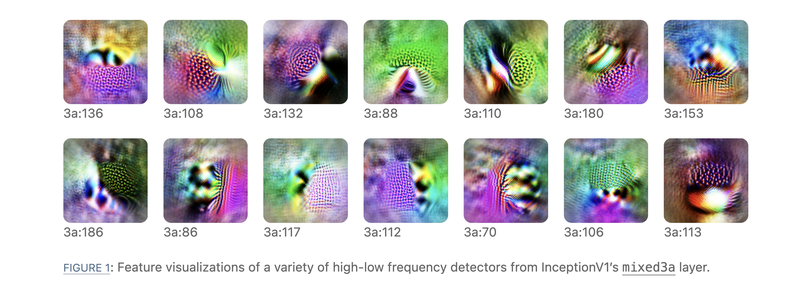

High-low freq detectors는 다음의 공통적인 특성이 있다. 

- **Detection of adjacent high and low frequencies. (인접한 고주파와 저주파의 검출)** 이 검출기들은 한쪽에서는 **고주파(high frequency)**에, 다른 쪽에서는 **저주파(low frequency)**에 반응한다.
- **Rotational equivariance.** 이 검출기들은 회전에 대해 등변적이다. 즉, 각 유닛은 **특정한 각도 방향을 따라 발생하는 고–저 주파수 변화**를 검출하며, 서로 다른 유닛들이 합쳐져 **가능한 모든 방향(360°)**을 포괄한다. (Rotatational Equivariant 하다는 것은 서로 다른 input에 대하여 feature map 전체가 채널축을 기준으로 재배치된다는 의미)

## Dataset Examples

Dataset Examples는 학습 데이터 셋 중, 해당 filter neuron을 가장 maximize 한 이미지들을 뽑는 과정이다. 

이 때, **argmaxed over spatial locations** 절차를 이용한다고 그림에 설명이 되어 있는데 그 과정은 다음과 같다. 

1. 이미지 하나 넣기 → `mixed3a:136`의 feature map 계산
2. **argmaxed over spatial locations** : 가장 큰 activation 위치 $(i, j)$ 찾기
3. 그 위치에 대응하는 입력 영역을 **crop** : receptive field를 역으로 계산해서, 원본 이미지에서 해당 패치를 잘라냄
4. activation이 큰 이미지들만 top-K로 선택

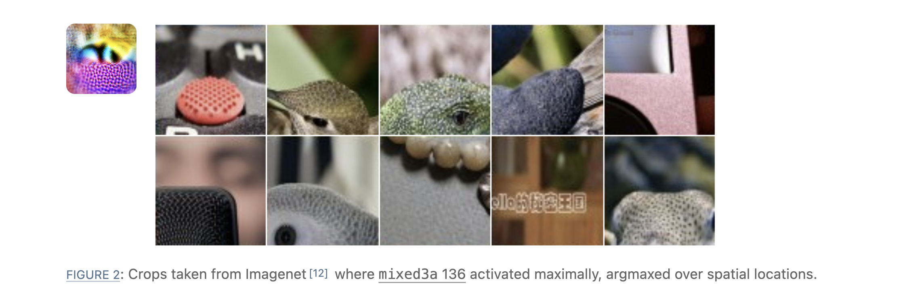

(위 방식을 쓰지 않고, 모든 위치에서의 갑의 평균이나 합산을 기준으로 img를 선택하면, receptive field가 겹치는 부분이 많은 중앙 영역에서의 고/저주파가 나타나는 그림만 선택될 수 있음.)

현실 세계의 매우 다양한 상황들이 **고–저 주파수 검출기(high–low frequency detector)**를 활성화시킬 수 있다. 흔히는 **질감이 매우 풍부하고 초점이 맞은 전경 물체**가 **흐릿한 배경**과 대비될 때 나타난다. 예를 들어 전경이 마이크의 격자 무늬, 벌새의 아주 작은 머리 깃털, 혹은 Lenovo ThinkPad 트랙포인트의 작은 고무 돌기일 수 있다. 하지만 항상 그런 것은 아니다. 우리는 또한 MP3 플레이어의 **브러시드 메탈 표면**이 **반짝이는 화면**과 대비될 때, 혹은 **워터마크의 텍스트**에서도 이 검출기가 활성화되는 것을 관찰한다.

모든 경우에서 공통적으로, **한 영역에는 고주파가 있고 다른 영역에는 저주파가 존재**한다. 이 검출기들은 종종 **물체의 경계(object boundary)**에서 활성화되지만, **물체 경계가 없더라도 주파수 변화가 존재하는 경우**에도 활성화될 수 있다. 따라서 **고–저 주파수 검출기는 경계 검출기(boundary detector)와 동일한 것은 아니다.**

## Synthetic Tuning Curves

**튜닝 커브(tuning curve)**는 어떤 **매개변수(parameter)**에 따라 **뉴런의 반응이 어떻게 변하는지**를 보여준다. 이는 신경과학에서 표준적으로 사용되는 방법이며, 인공 신경망을 연구하는 데에도 매우 유용하다는 것을 우리는 확인했다. 예를 들어, 우리는 **곡선 검출기(curve detector)**의 반응이 **방향(orientation)**에 따라 어떻게 변하는지를 보이기 위해 튜닝 커브를 사용했다. 마찬가지로, 튜닝 커브를 사용해 **고–저 주파수 검출기(high–low frequency detector)**가 어떻게 반응하는지도 보여줄 수 있다.

이러한 커브를 구성하기 위해서는, 고–저 주파수 검출기를 활성화시키는 **합성 자극(synthetic stimuli)**들의 집합이 필요하다. **Synthetic stimuli** 는 **연구자가 의도적으로 만들어낸 인공 이미지**를 의미한다. 우리는 한쪽에는 **고주파 패턴**, 다른 한쪽에는 **저주파 패턴**이 있는 이미지를 생성한다. 우리가 관심 있는 것이 방향이므로, 이 패턴을 회전시켜 **1차원(1D) 자극 군(family of stimuli)**을 만든다.

우리의 합성 자극에서 첫 번째 변화 축은 **방향(orientation)**이다.

하지만 각 쪽에 어떤 주파수를 사용해야 할까? 두 주파수 간의 차이는 얼마나 커야 할까? 이를 탐구하기 위해, 우리는 **두 주파수 사이의 비율(ratio)**을 변화시키는 **두 번째 차원**을 추가한다.

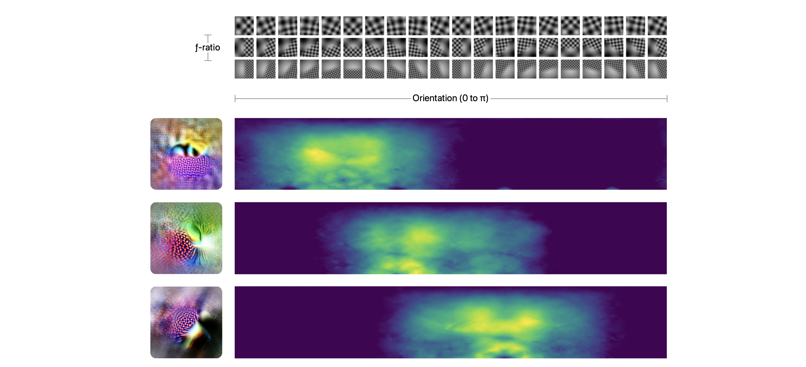

- 위 그라데이션 영역의 각 직사각형 1개는 filter neuron 1개와 대응. 각 직사각형의 가로축은 rotation, 세로축은 f-ratio. 해당 좌표의 밝기는 해당 뉴런을 해당 그림에 적용했을 때의 activation 값의 크기를 의미한다.
- high–low frequency detectors가 rotationally equivariant 함을 확인 할 수 있다. 입력을 45도 회전시시키면 45도 방향을 담당하는 “다른 detector”가 활성화되고, 이 때의 weight는 0도 에서의 weight를 45도 회전한 것.

## Implementation

고수준–저수준(high–low) 주파수 검출기는 더 낮은 수준의 뉴런들로부터 어떻게 구성될까? 이 행동을 구현할 수 있는 회로는 여러 가지가 있을 수 있다. 하나의 예만 들자면, 이러한 유닛들이 갖는 **방향성(oriented nature)** 이 형성되는 방식에는 최소한 두 가지 다른 가능성이 있는 것으로 보인다.

### Equivariant → Equivariant Hypothesis

첫 번째 가능성은 이전 레이어가 이미 고주파에서 저주파로의 **방향성 있는 전이**를 감지하는 전조(precursor) 특징들을 가지고 있다는 것이다. 이 가설의 극단적인 형태에서는, 고수준–저수준 주파수 검출기가 단순히 어떤 하위 레이어 뉴런의 **정체성 전달(identity passthrough)** 에 불과할 수도 있다. 보다 완화된 형태로는, 초기 곡선 검출기(early curve detectors)가 더 크고 정교한 후기 곡선 검출기(late curve detectors)로 정제되는 경우와 유사한 상황을 생각할 수 있다. 또 다른 예로는, 이미 방향성을 가진 단순한 가보르(Gabor) 필터들로부터 에지 검출이 구성되는 방식을 들 수 있다. 우리는 이를 **등변성 → 등변성**이라 부르는데, 그 이유는 **방향에 대한 등변성**이 이전 레이어에 이미 존재했기 때문이다.

### Invariant → Equivariant Hypothesis

다른 한편으로, 이전 레이어에는 고수준–저수준 주파수 검출기와 유사한 것이 전혀 없을 수도 있다. 대신, 방향성은 뉴런의 가중치에서의 **공간적 배열**로부터 비롯될 수 있으며, 이 배열이 저주파 및 고주파 특징에 의해 어디에서 흥분되는지를 결정한다.

이 질문을 해결하고—더 일반적으로는 이러한 검출기들이 어떻게 구현되는지를 이해하기 위해—우리는 **가중치(weight)** 를 살펴볼 수 있다.

하나의 검출기를 살펴보자. conv2d2에서 mixed3a 110으로 이어지는 가중치들($6\times 5\times 5$)을 대략적으로 훑어보면, 대부분은 두 가지 범주로 나눌 수 있다. 즉, **왼쪽에서 활성화되고 오른쪽에서 억제되는 것들**, 그리고 **그 반대로 작동하는 것들**이다.

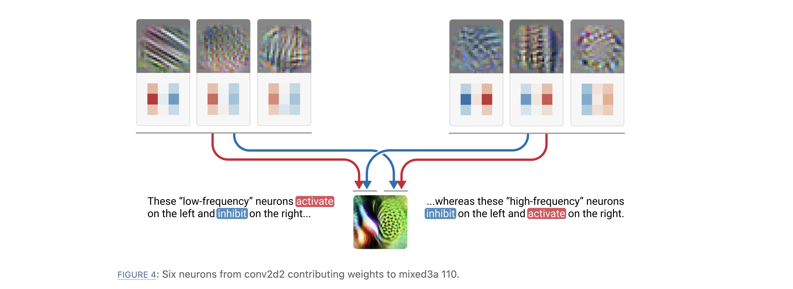

위 그림에서, 왼쪽/오른쪽 위 6개의 feature visualization은 이전 layer의 방향별 저주파/고주파 filter에 대한 feature visualization 이다.

그 아래, weight는 mixed3a 110 neuron에서 이전 layer의 각 feature map에 적용하는 filter이다. 이 값들을 모두 내적한 다음 더하면 최종적으로 mixed3a 110 neuron의 각 좌표에서의 값이 될 것이다. 

저주파가 왼쪽, 고주파가 오른쪽에 있는 이미지일수록 최대가 됨을 알 수 있고, 가장 아래의 feature visualization 결과도 이와 일치한다. 

서로 다른 방향의 high-low freq detector도 마찬가지의 모습을 보인다. 중요한 점은 다른 방향의 high-low freq detector가 모두 이전 layer의 같은 feature를 참고한다는 것이다. 

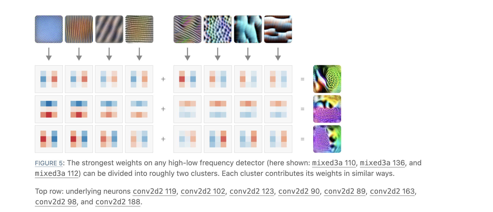

만약 Invariant → Equivariant 가설이 맞다면, 바로 이런 현상이 나타나야 한다. 

- 모든 high–low frequency detector는 **항상 동일한 두 구성요소(component)** 를 사용한다. (이전 layer의 **Invariant**)
  - 하나는 **저주파 클러스터**
  - 하나는 **고주파 클러스터**
- 달라지는 것은 **이 두 구성요소를 공간적으로 어떻게 배치하느냐**뿐이다. (현재 layer의 **Equivariant**)

즉, 새로운 detector마다 새로운 저주파/고주파 뉴런을 쓰는 게 아니라 같은 재료를 재배치해서 다른 detector를 만든다.

### High and Low Frequency Factors

이 두 개의 뉴런 클러스터가 실제로 존재한다는 것을 확인할 수 있다면 좋을 것이다. 또한, 이후에 회로(circuit) 분석을 하기 위해 이들을 더 단순한 방식으로 표현할 수 있다면 더욱 좋을 것이다.

하위 레이어와 고주파–저주파 검출기 사이의 **연결(connection)** 을 요인분해하는 것은, 이 두 클러스터가 의미 있는지 확인하고 그 중요성을 조사할 수 있는 한 가지 방법이다. **단측 비음수 행렬 분해(one-sided non-negative matrix factorization, NMF)** 를 수행하면 이러한 연결을 두 개의 factor으로 분리할 수 있다.

📝 **NMF(Non-negative Matrix Factorization, 비음수 행렬 분해)**

모든 원소가 **0 이상인 행렬**을, 역시 **0 이상만 가지는 두 행렬의 곱**으로 근사하는 방법.

비음수 행렬 $V \in \mathbb R^{m \times n}$ 이 주어지면

- $W \in \mathbb R^{m \times r}$ , $W \geq 0$ 
- $H \in \mathbb R^{r \times n}$ , $H \geq 0$
- $r << min(m, n)$ (저차원)
- 에 대해, $V \approx WH$ 로 근사하는 방법. 
- 즉,  $min||V-WH||^2$ 가 되는 비음수행렬 W, H를 찾는 것이다. 

여기서 $V$ 를 각 행이 하나의 data sample을 나타내는 data set matrix로 생각해보자.

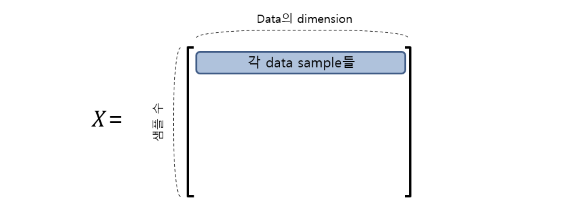

이 때, NMF를 하면 행렬곱의 정의에 의해

- $X_{ij}=\sum_{k=1}^{r}W_{ik}H_{kj}$
  - $X_{ij}$ 는 $i$ 번째 sample의, $j$ 번째 좌표값
  -  feature란, 데이터의 새로운 좌표축(기저)으로 이해 가능. 기존 데이터가 (키, 몸무게, 나이) 였다면 이는 다시 말해 키*(1, 0, 0) + 몸무게*(0, 1, 0) + 나이(0, 0, 1) = $키*e_1 + 몸무게 *e_2 + 나이*e_3$ 인 것이다. 만약 $H$ 의 1행의 값이 (1, 2, 0.5) 라면, 기존 데이터의 새로운 좌표 표현에서 첫 번째 좌표가 (키+2*몸무게+0.5*나이) 가 되는 것이다. 즉 $h_1$ 이라는 새로운 기저를 만드는 셈이다. 
  - $W$ 의 각 행은 각 data sample을 새로운 feature 좌표로 나타낸 계수이다. 
  - $X_{ij}$ 는 $i$ 번째 sample의, $j$ 번째 좌표값은 ($i$ 번째 data sample을 새로운 feature들에 대해 나타낸 좌표 벡터) $\cdot$ (각 feature 별로 $j$ 번째 좌표가 반영된 계수) 로 구할 수 있다. 

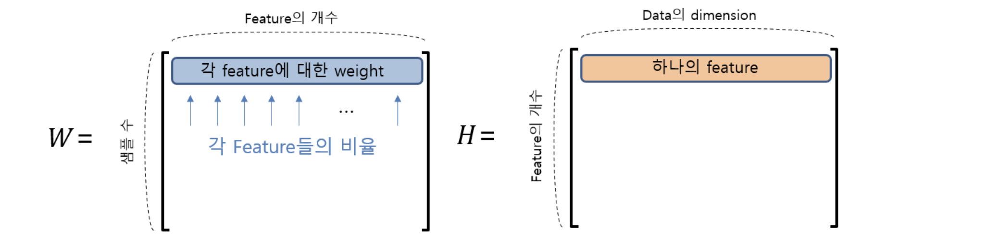

- NMF 과정의 목적은, $n$ 차원 요소로 표현되는 데이터를 그보다 작은 $r$ 차원의 데이터로 나타내었고, 이 과정에서 손실을 최소화하도록 했다는 것이다.

예를 들어보자.

얼굴 이미지 100장이 있고 각 이미지는 $64 \times 64 = 4096$ 픽셀로 이루어져 있다. 여기서 우리는 $V \in \mathbb R^{100 \times 4096}$  으로 놓고 $r=3$ 으로 하여, NMF를 수행한다. 그러면 각 얼굴 이미지를 길이 4096의 벡터가 아닌 (0.7, 0.5, 0.8) 처럼 길이 3인 벡터로 각각 나타낼 수 있다. 이 때, $H$ 의 1행 벡터(크기 4096)를 이미지로 바꾸면 얼굴 이미지에서 눈 위치만 밝은 그림, 2행 벡터는 코 위치만 밝은 그림, 3행 벡터는 입 위치만 밝은 그림이 나오게 된다. 말로 풀면, $i$ 번째 얼굴 이미지의 $j$ 번째 픽셀 값은 (눈 픽셀값 x 눈 사용량 + 코 픽셀값 x 코 사용량 + 입 픽셀값 x 입사용량) 으로 근사된다. 

📝 **SVD (Singular Value Decomposition)** 

📝 **PCA**

이제 NMF를 우리의 상황에 적용해보자. 

mixed3a에 10개의 high-low freq detector가 있다고 하자. Conv2d2의 출력 shape = (192, 28, 28) 이고, conv2d2 → mixed3a 에서 $1\times 1$ conv가 쓰이므로, 다음과 같이 적을 수 있다 (k=10) 이것이 바로 NMF에서 V가 되는 것이다. 

$r=2$ 를 적용하여 NMF를 적용하니 $W \approx HF$ 에서, factor는 $F$ 의 각 행에 해당하는 두 벡터를 의미한다. 

의미를 생각해보면 다음과 같다. 우리는 각 high-low freq detector에 대하여 이전 layer의 192개 채널에서 들어오는 feature map에 곱해지는 길이 192의 벡터 $W_{i,:}$ 가 실은 이 192개의 벡터들이 이런저런 관계를 맺어, high/low 여부를 나타내는 길이 2의 벡터로 환원되길 바란다. 즉 $W_{i,:}$$(0.7, 0.3, 0.8, ...) \in \mathbb R^{192}$ 가 주어지면, 공통적인 규칙에 의해 $(0.4, 0.6)$ 과 같이 나타내어 지고, 

즉, 192개의 내적 합의 결과가 실제로는 input의 high 정도 * 0.4 + input의 low 정도 * 0.6가 되도록 하길 원하는 것. (input의 high 정도는 0.4가 구해진 이런저런 관계를 이전 layer의 길이 192의 output에 대해서 적용하면 구할 수 있다.)

실제로 크기 $192 \times 1 \times 1$ 인  $f_1, f_2$  에 대하여 feature visualization을 진행하면, 하나는 고주파 텍스처, 하나는 저주파 텍스처의 이미지가 나온다. 

다음 그림의 가장 왼쪽 그림은 $f_1, f_2$ 에 대한 feature visualization이다. 오른쪽 그림은, 이전 layer의 192개의 각 feature들에 대한 feature visualization이고, 0.93, 0.72 등은 숫자는 $W = HF$ 에서 $F$ 의 각행의 계수 벡터를 의미한다. 

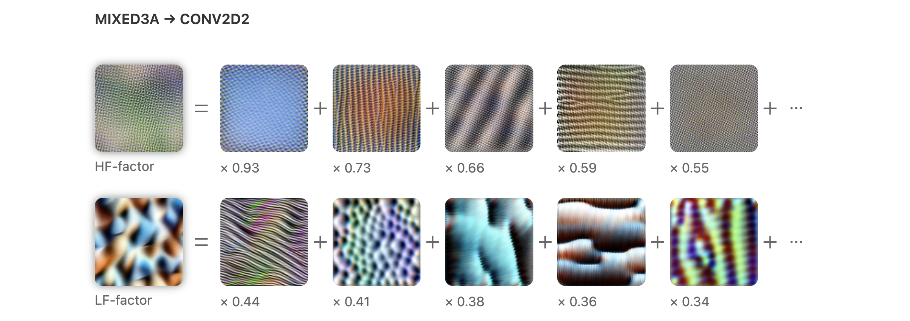

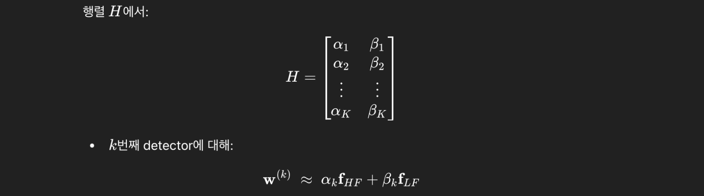

**단측 비음수 행렬 분해(one-sided non-negative matrix factorization, NMF)** 

factor는 현재 layer의 각 뉴런에 대해 정의되는 값들로, **이전 레이어 뉴런들에 대한 가중치 벡터**에 해당한다. 따라서, 이전 layer의 채널 수만큼의 길이를 가지는 벡터이다. 

mixed3a의 High-low detector 하나에 대해, 

- detecor output = $ \sum_{i=1}^{192} w_i \cdot a_i \in \mathbb R^{28 \times 28}$
  - Conv2d2의 출력 shape = (192, 28, 28)
  - $a_i \in \mathbb R^{{28 \times 28}}$ : conv2d2의 **i번째 채널 activation map**
  - conv2d2 → mixed3a는 **1×1 convolution**. 따라서, $w_i \in \mathbb R$ , $w=(w_1, ..., w_{192}) \in \mathbb R^{192}$
  - 하나의 spatial 위치 $(x, y)$ 에서 $detector(x, y) = \sum_{i=1}^{192} w_i \cdot a_i(x, y) \in \mathbb R$ 
  - $detector = \sum_{i=1}^{192} w_i \cdot a_i \in \mathbb R^{28 \times 28}$
- mixed3a의 3a:310 neuron의 $f_{HF}, f_{LF} \in \mathbb R^{192}$
  - NMF를 이용하여, $w \approx \alpha \cdot f_{HF} + \beta \cdot f_{LH}$ 로 나타낸다.
  - 
  - HF image $= \sum_{i=1}^{192}f_{HF,i} \cdot a_i \in \mathbb R^{28 \times 28}$
  - 

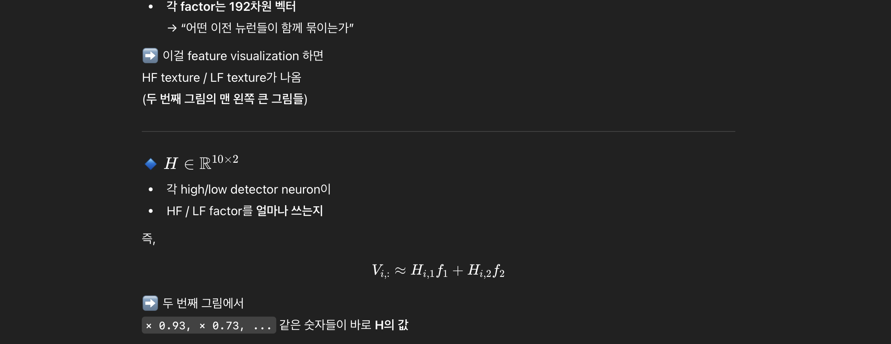

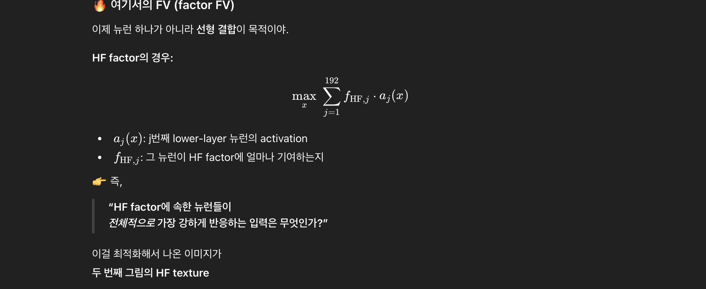

특징 시각화(feature visualization)는 암시적인 단서를 제공하긴 하지만, 이러한 요인들이 실제로 **특정한 고주파 또는 저주파 패턴**이 아니라 **일반적인 의미에서의 고주파·저주파**에 대응한다고 어떻게 확신할 수 있을까?
이를 확인하기 위해 우리가 할 수 있는 한 가지 방법은 다시 한 번 **합성 자극(synthetic stimuli)**을 생성하되, 이번에는 **두 개의 NMF 요인의 반응을 직접 플로팅**하는 것이다.

왼쪽 두개의 feature visualization은 이전 layer의 192개의 filter를 처리하는 하나의 뉴런 $192 \times 1 \times 1$을 $2 \times 1\times 1$ 로 NMF를 이용하여 축소시킨 다음, 2개의 $1\times 1$ 에 대해 feature visualization을 진행한 것이다. 

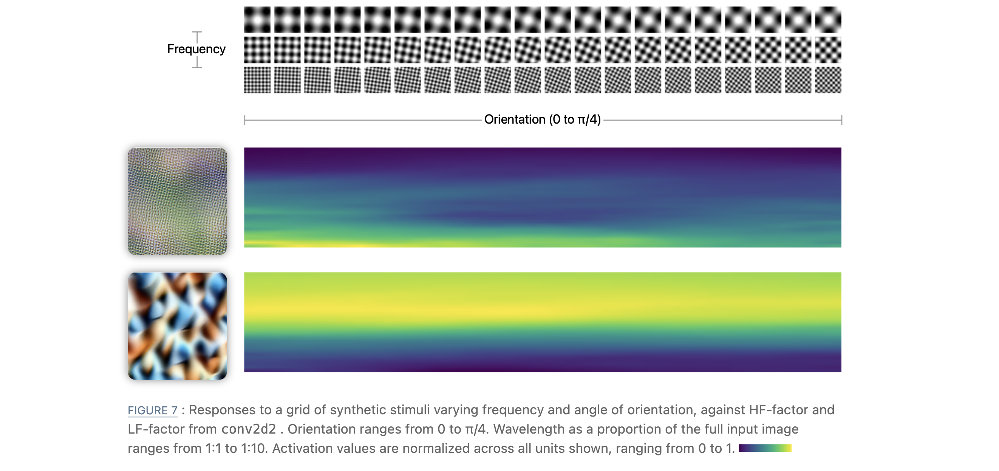

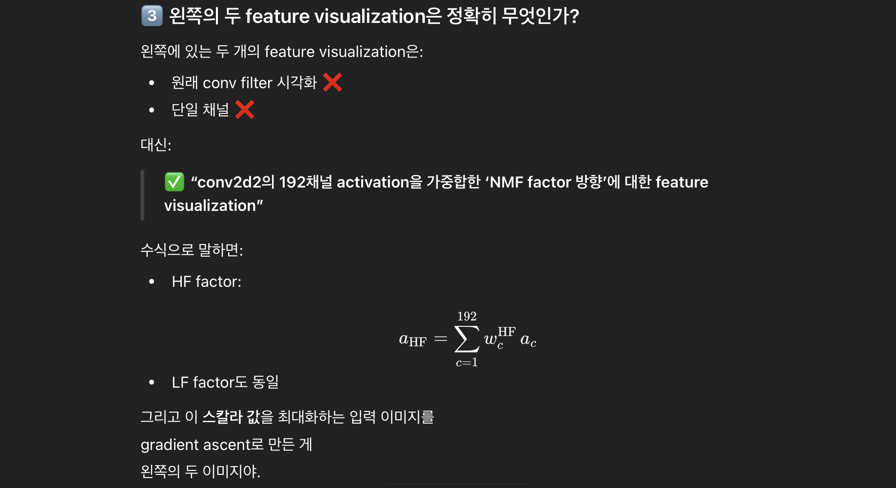

### Construction of High-Low Frequency Detectors

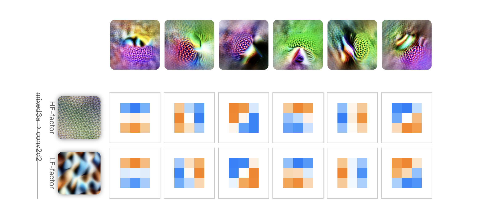

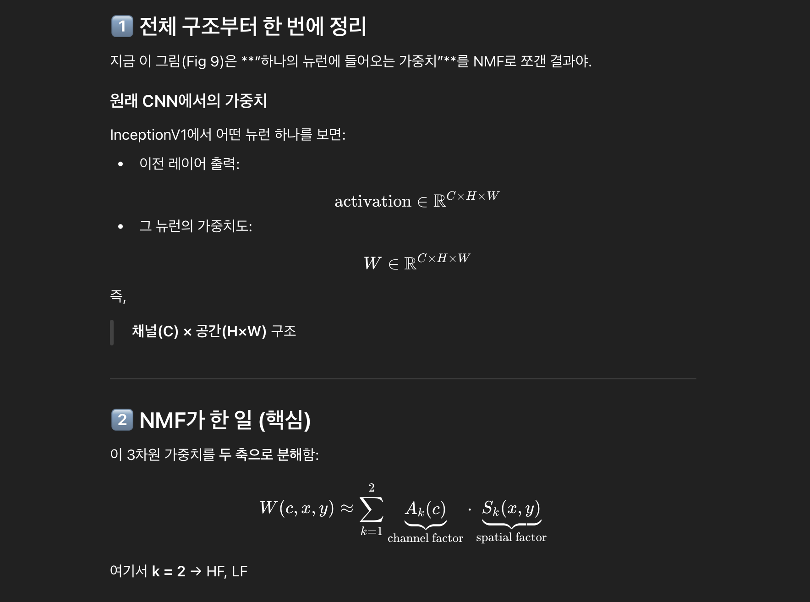

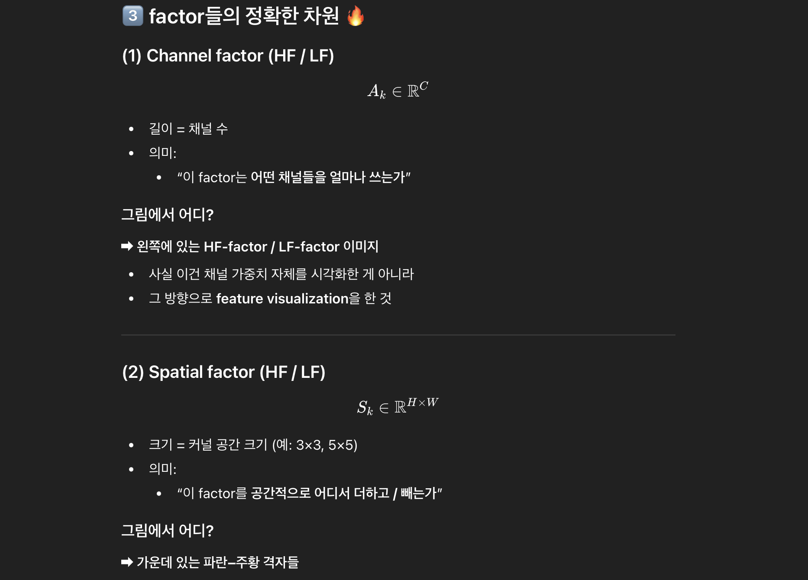

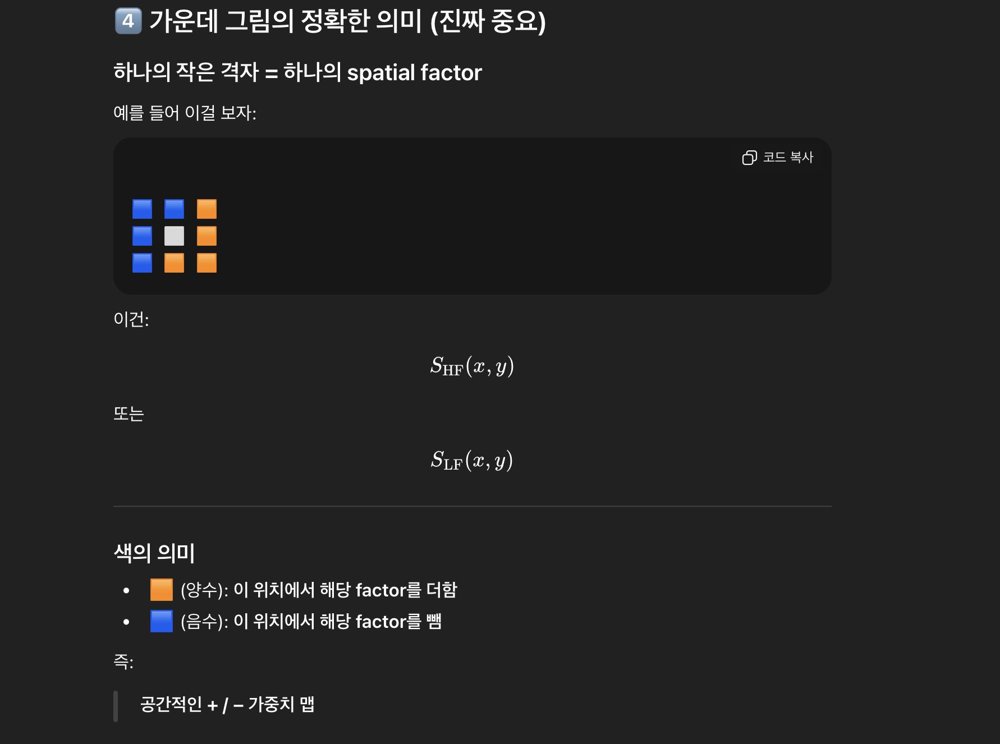

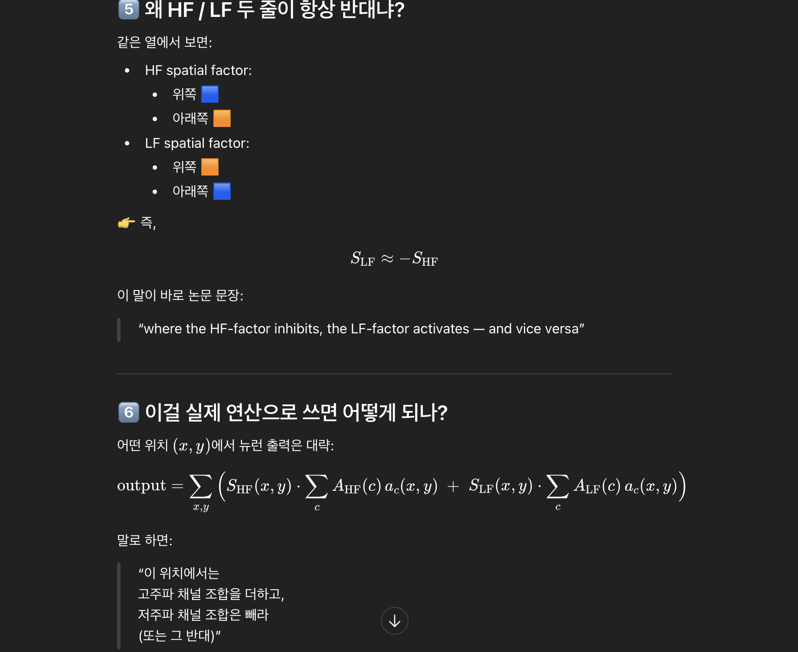

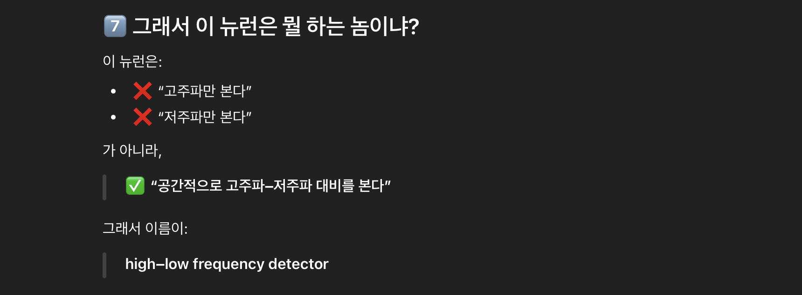

## Usage

**mixed3b**는 고주파–저주파 주파수 검출기 바로 다음에 위치한 레이어이다. 이 레이어에서 고주파–저주파 주파수 검출기들은 다양한 특징(feature)에 기여한다. 이들의 가장 중요한 역할은 **경계(boundary) 검출기**를 보조하는 것으로 보이지만, 이들은 또한 **돌출부와 움푹 파인 부분(bumps and divots)**, **선 모양 및 곡선 모양의 형태**, 그리고 **중심–주변(center-surround) 구조**, **패턴**, **텍스처**에 해당하는 특징들에도 각각 최소 하나씩 기여한다.

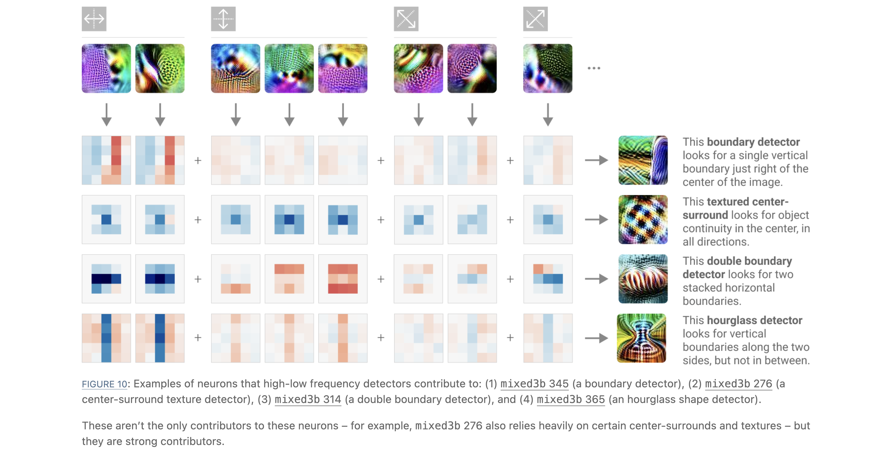

위 그림에서 첫 번째 행은 mixed3a layer에서 여러 방향의 high-low freq activation map에 mixed3b에서 어떻게 weight를 설정하여 그림에서 세로의 boundary 선이 나타나는지를 detect 하는지를 보여준다. mixed3a layer의 좌우가 각각 high-low freq인지 detect한 filter의 activation map을 보면 경계 부근에서 activation 스칼라 값이 가장 클 것이고, 여기에 직선으로 강한 값을 가지는 weight를 곱해주면 boudnary detector로서 동작할 수 있다. 좌우가 각각 low-high freq인지 detect한 filter도 마찬가지이다. 따라서, 위 그림에서 두 weight의 그림이 대칭되지 않고 동일한 것이다. 

종종 하위 단계의 특징들은 고주파–저주파 주파수 검출기의 **“극성(polarity)”** 을 무시하는 것처럼 보이며, 어느 쪽이 고주파인지에 관계없이 거의 동일한 방식으로 반응한다. 예를 들어, 수직 경계 검출기 **mixed3b 345**(위에서 본 것)는 수직선 방향을 따라 주파수 변화가 어느 방향으로 발생하든 이를 감지하는 고주파–저주파 주파수 검출기들에 의해 강하게 활성화된다.

한편, 고주파–저주파 주파수 검출기의 **활성화(activation)** 는 서로 다른 객체 사이의 경계를 감지하는 데 도움을 줄 수 있는 반면, 고주파–저주파 주파수 검출기로부터의 **억제(inhibition)** 는 어떤 방향을 따라 반드시 연속적으로 이어져야 하는 영역들을 감지함으로써 객체 검출기에 구조를 추가할 수도 있다. 이는 본질적으로 **경계가 존재하지 않음을 나타내는 것**이다.

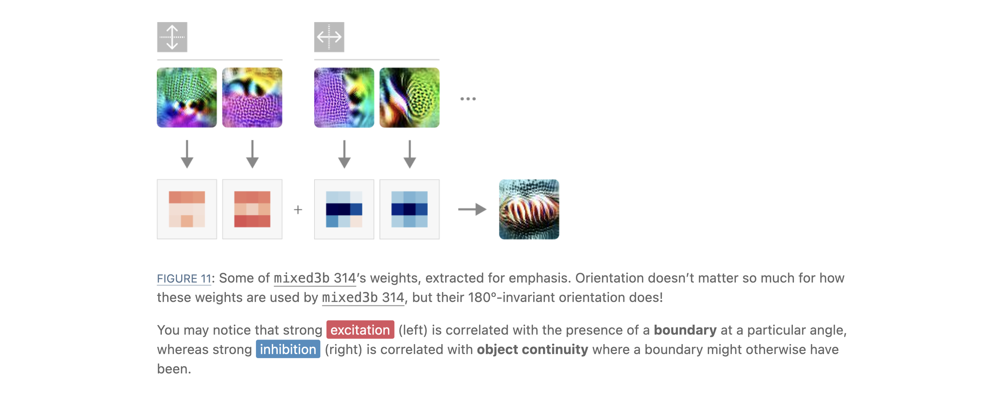

### 객체 경계 검출에서의 역할 (Role in Object Boundary Detection)

**객체 경계 검출기(object boundary detectors)** 는 객체와 객체 사이의 경계를 감지하는 뉴런들로, 이는 한 객체와 다른 객체 사이의 경계를 의미할 수도 있고, 전경(foreground)에서 배경(background)으로의 전이를 의미할 수도 있다. 이들은 에지 검출기나 곡선 검출기와는 다르다. 비록 에지에 민감하긴 하지만(실제로 이들의 가장 강한 가중치 중 일부는 더 하위 단계의 에지 검출기들로부터 기여받는다), 객체 경계 검출기는 **색 대비(color contrast)** 나 **고주파–저주파 주파수 검출**과 같은 다른 단서들에도 함께 민감하다.

## Universality

지금까지 우리의 분석 범위는 **InceptionV1**으로 제한되어 있었다. 그렇다면 **일반적인 합성곱 신경망들 전반에서**, 고주파–저주파 주파수 검출기는 얼마나 흔하게 나타날까?  

### High-Low Freq Detectors in Other Networks

InceptionV1에서 발견된 것과 유사한 고주파–저주파 주파수 검출기들은 **다양한 신경망 아키텍처**에서 찾아볼 수 있다.

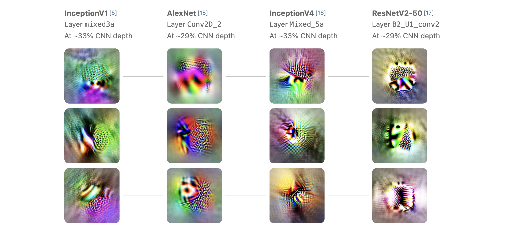

### HF-factor and LF-factor in Other Networks

# Presentation

- 저주파/고주파 motiv

- 저주파/고주파의 정의

  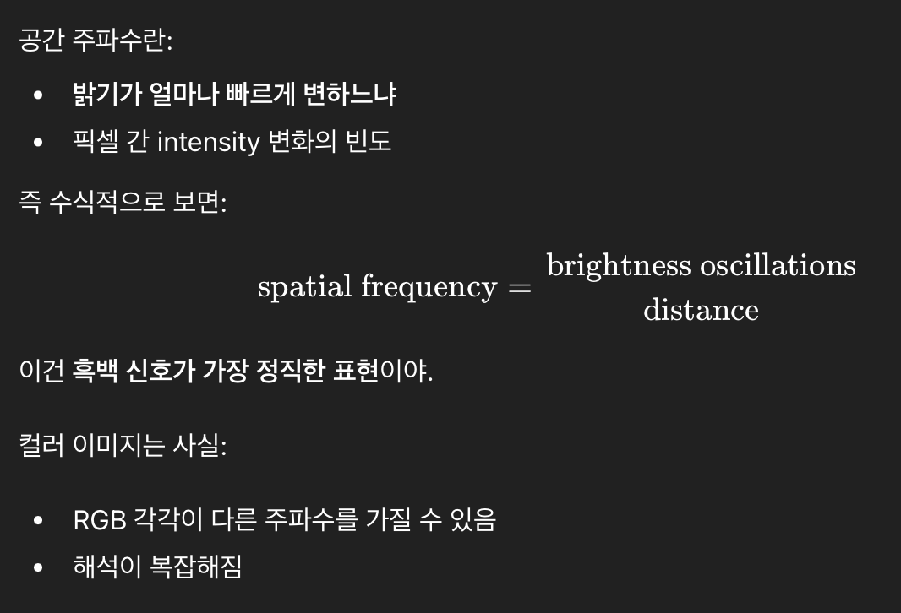

- 뉴런 / 뉴런s / feature, filter 의미. (각자가 이해하는바가 다른 거 같은데 이 글에서 이 방식대로 이해해도 논리적으로 크게 무리가 없다)

- Mixed3a layer

Q : feature visualization과 data examples를 둘 다 보는 이유는?

Q : armax over spatial location 방식에서 수용영역을 계산하고 crop 하면,  feature visualization 결과의 이미지 들 중에서 전체적으로 고주파/저주파 한쌍으로 분리되는 그림 말고 고주파/저주파 열쌍이 등장하는 그림도 있어야 하는 거 아냐"?

A : **effective receptive field는 유한하고 중심에 집중됨**

즉: 뉴런이 “실제로 신경 쓰는 영역”은 feature visualization 이미지 전체가 아니라 **중앙의 작은 영역**

그래서 중앙에 **가장 잘 맞는 전이 1쌍**을 두는 게 activation을 가장 효율적으로 올림

Q : 합성 이미지에서 흑백을 보는 이유?

> **이 뉴런이 색이나 물체가 아니라,
> 진짜로 ‘고주파 ↔ 저주파의 공간적 대비’를 보고 있나?**

색을 넣으면 문제가 생김:

- 색 변화도 고주파처럼 작동할 수 있음
- 채널 간 상호작용(RGB mixing)
- 색 경계 = 주파수 경계처럼 오인 가능

그래서:

- **밝기(luminance)만 남김**
- 색상(hue), 채도(saturation) 제거
  → **주파수만 실험**

Q : rotation equivariant의 조건이 같은 크기로 활성화 되는 detector 의 인덱스만 바뀌면 되는거야 아니면 detector의 weight 관계도 회전된 관계여야 하는거야

A : rotation equivariant의 “필수 조건”은
👉 활성화 값의 *패턴*이 회전에 따라 *같이 회전*하는 것이지,
👉 detector weight들이 수학적으로 정확히 회전 관계일 필요는 없다.

Q : 만약 Equivaraint -> Equivariant 가설이 맞다면 어떤식으로 나타나야 함?

A : 이전 layer에서 비슷한 방향의 feature에 대해선 weight가 해당 방향대로 설정되고, 다른 방향의 feature에 대해선 weight가 반대 방향으로 설정됨. -> 즉, 일정한 weight가 아닐 것.

Q : nmf에서 1*1 conv가 아니라 3x3이면?

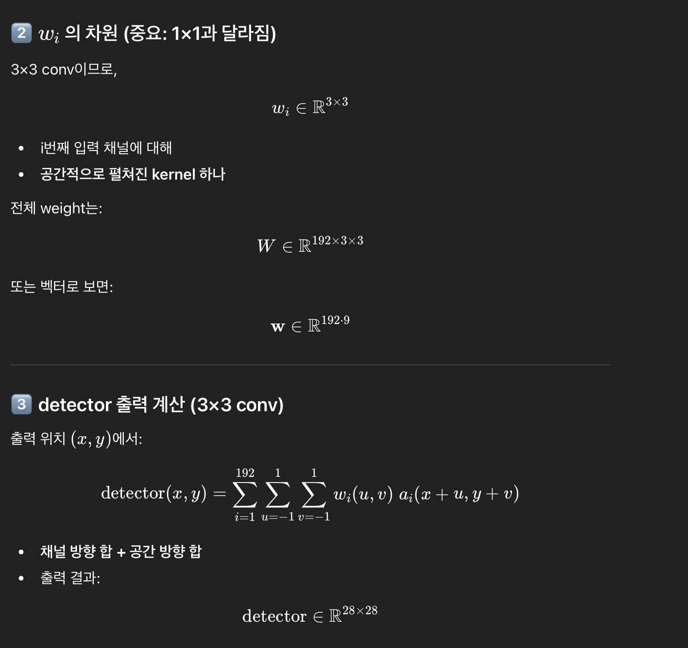

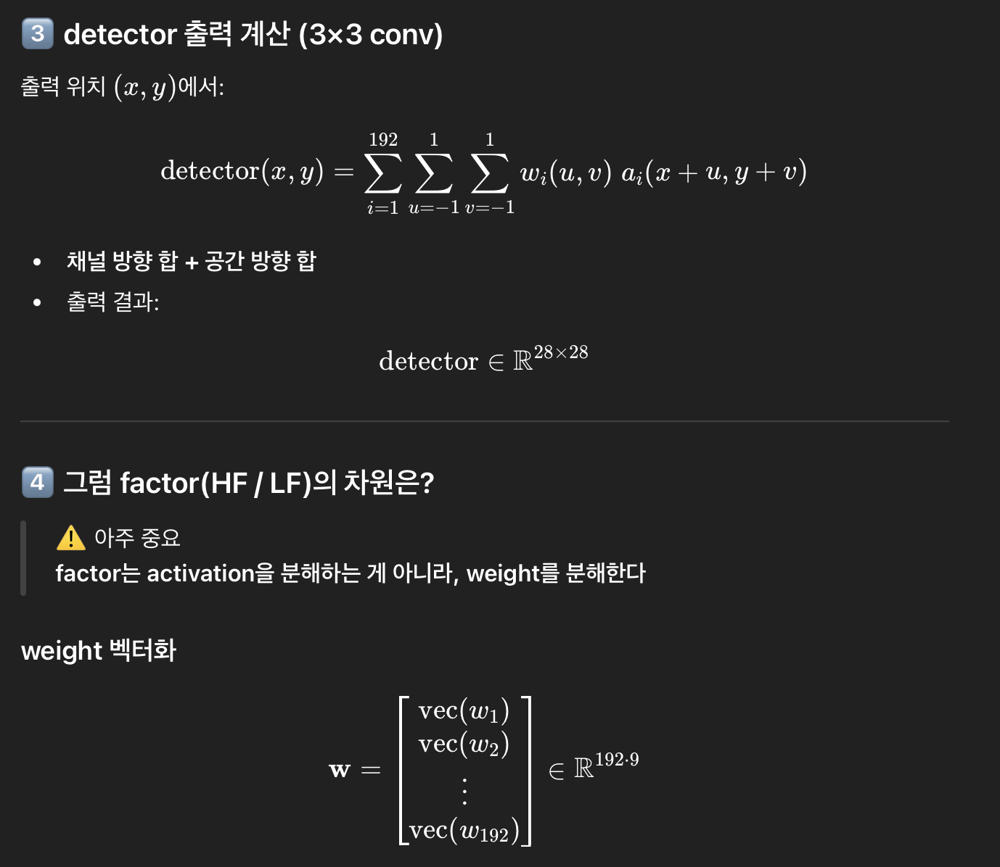

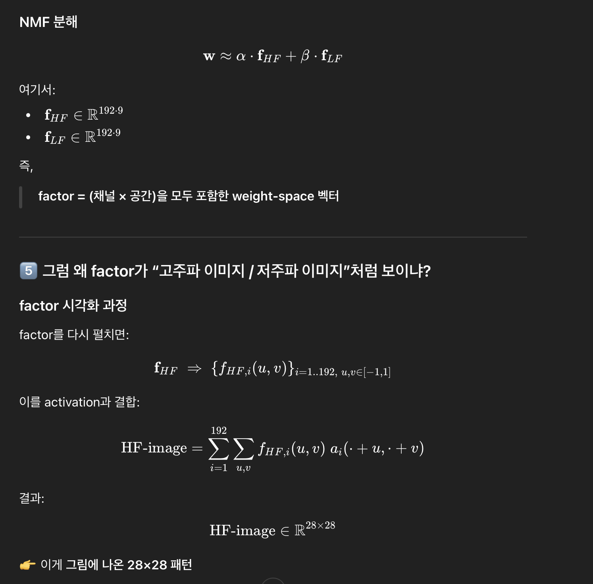

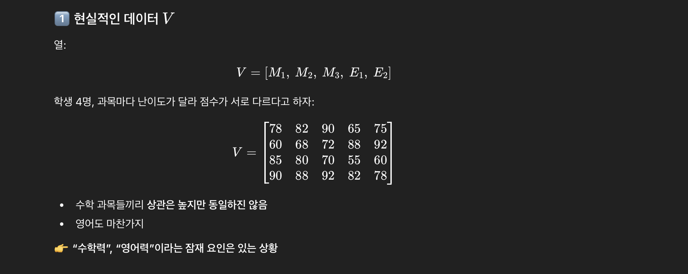

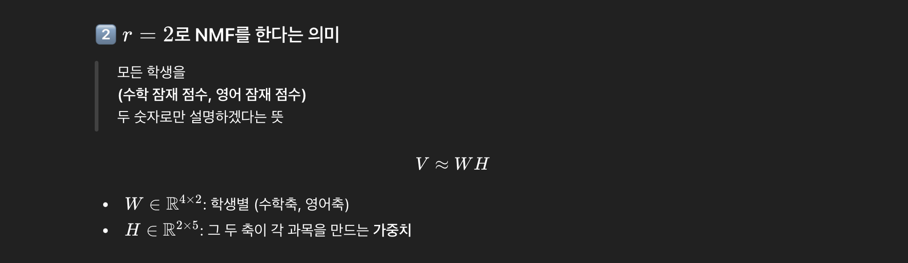

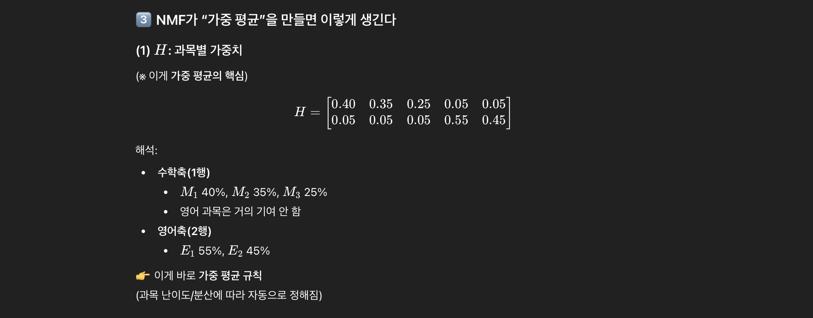

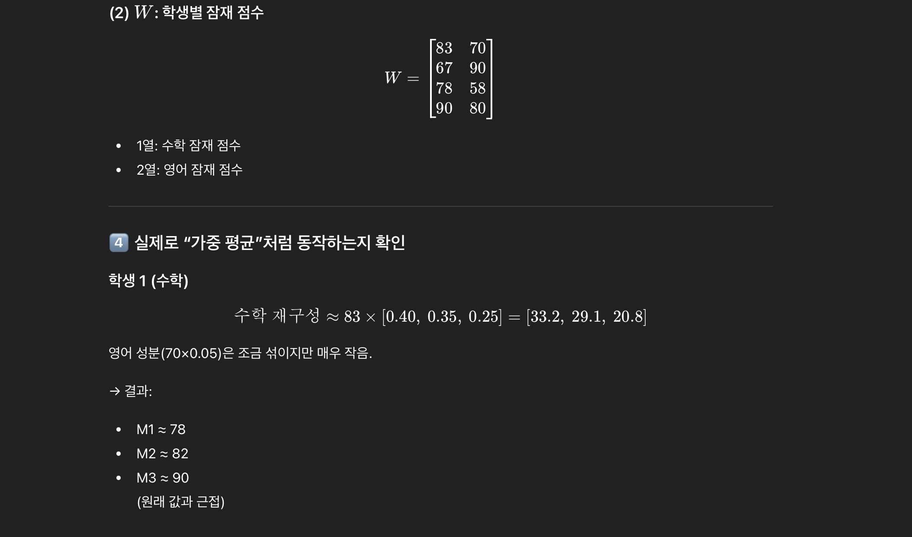

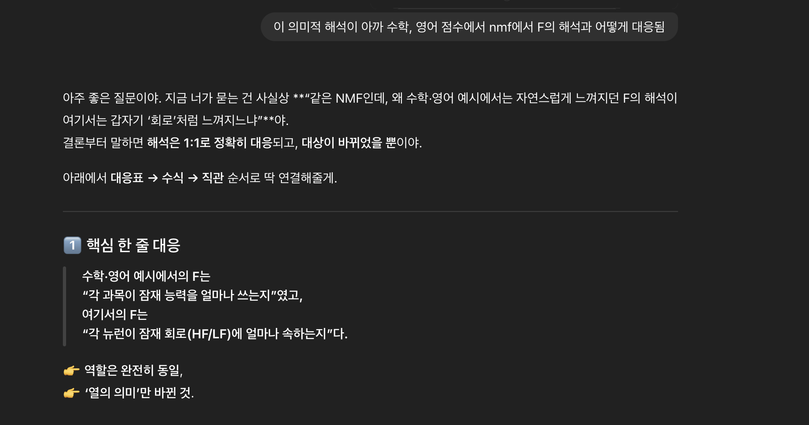

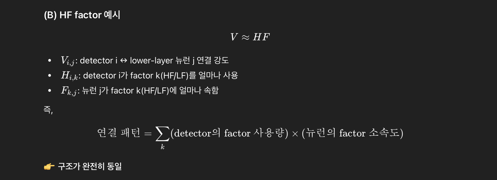
