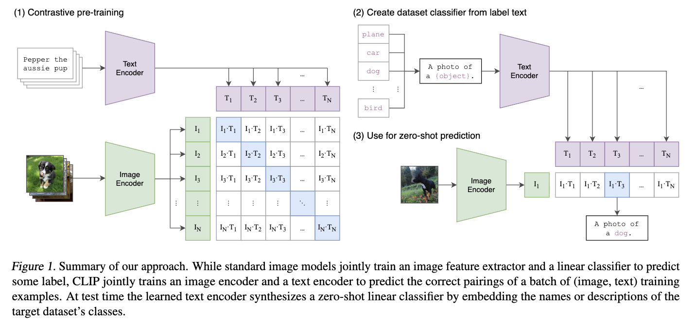
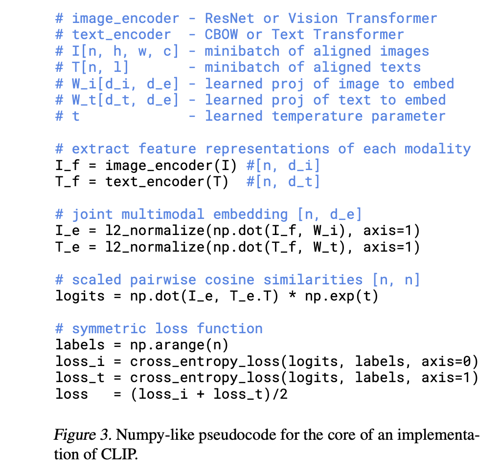

In this post, CLIP is introduced.

# Learning Transferable Visual Models From Natural Language Supervision

## 1. Introduction and Motivating Work

Self-Supervised Learning은 Pretext Task → Downstream Task로 나뉘는데, Vision 분야의 Pretext Task (Predict rotations 같은 작업 또는 SimCLR에서는 Constrative Learning) 에서는 ImageNet 같은 labeled dataset을 이용하고 새로운 개념을 추가하려면 새로운 labeled dataset이 필요하다. 

CLIP에서는 기존의 고정된 라벨링된 데이터셋에 의존하는 방식에서 벗어나, 인터넷에 존재하는 방대한 텍스트 데이터를 활용한다. Pretext Task로써 "어떤 캡션이 어떤 이미지에 해당하는가"를 예측하는 contrastive pre-training을 통해 이미지와 텍스트 간의 관계를 학습한다.

CLIP의 장점은 우수한 성능과 더불어, Downstream Task (Transfer Learning) 과정에서 Zero-shot transfer (새로운 데이터 학습없이 OCR, action recognition, geo localization, fine-grained classification 등의 task 수행 가능)가 가능하다는 점이다. 

## 2. Approach

### 2.2 Creating a Sufficiently Large Dataset

새로운 데이터셋 (WIT - Web Image Text) 구축

- 수집 규모 : 인터넷에서 4억 개의 (이미지, 텍스트) 쌍을 수집
- 수집 방법 : 50만 개의 쿼리를 사용하여 (이미지, 텍스트) 쌍을 검색했으며, 각 쿼리당 최대 2만 개의 쌍을 포함하여 광범위한 시각적 개념을 포괄하고자 함
- 데이터셋 특징 : 총 단어 수는 GPT-2 훈련에 사용된 WebText 데이터셋과 유사

### 2.3 Selecting an Efficient Pre-Training Method

N개의 (이미지, 텍스트) 쌍으로 구성된 batch에서, 실제 짝을 이룬 N개의 (이미지, 텍스트) 쌍의 유사도(cosine similarity)를 최대화하고, $N^2 - N$ 개의 잘못된 pair의 similiarity를 minimize 한다 .Symmetric Cross Entropy Loss (이미지에서 텍스트를 예측하는 방향과 텍스트에서 이미지를 예측하는 방향 모두)에 대해 손실을 계산하여 최적화한다. 

- Multimodal-Embedding space: 이미지 인코더와 텍스트 인코더를 통해 얻은 임베딩을 L2 정규화한 후, 일관된 Multimodal-Embedding space 로 매핑한다. 

### 2.4 Choosing and Scaling a Model

Training 과정은 다음과 같다. 

1. 이미지와 텍스트를 각각 encoder에 넣어 feature를 얻는다.
2. 각 feature를 공통 embedding space로 projection 한다.
3. 모든 조합의 similarity 를 계산한다. similarity score 계산 이후에 softmax temperature $e^\tau$ 를 곱하여 softmax의 sharpness를 조정한다. ($\tau$는 학습 파라미터) 
4. symmetric contrastive loss 를 계산한다. 즉, text를 보고 image를 classification 하는 문제의 Cross-Entropy Loss와 반대 경우의 loss를 합한다. $loss = (loss \ image + loss \ text) / 2$ 

### 2.5 Training

- Model : 5 ResNets and 3 Vision Transformers
- Optimizer : Adam
- Learning Rate : Cosine Decay
- Batch size : 32,768
- RestNet은 592개의 V100 GPU로 18일간 학습, ViT-L/14는 256개의 GPU로 12일간 학습

## 3. Experiments

### 3.1 Zero-Shot Transfer

컴퓨터 비전에서 **zero-shot learning**은 보통 학습하지 않은 클래스도 예측하는 능력을 의미한다. (cat, dog, car만 학습했는데 zebra, elephant도 맞추는 것). CLIP에서 zero-shot은 더 넓은 의미로 학습하지 않은 "데이터셋"에서도 바로 사용 가능함을 의미한다. (ImageNet, CIFAR, OCR, action recognition 같은 새로운 task에서도 **추가 학습 없이 바로 사용**.) 

Classification 과정은 다음과 같다. 

1. 이미지를 embedding으로 변환
2. 각 클래스 이름을 **문장으로 변환** (dog → "a photo of a dog", cat → "a photo of a cat")
3. image와 모든 text의 similarity 계산
4. 계산된 유사도에 온도 파라미터($\tau$)를 곱하고 Softmax를 적용하여 확률 분포를 얻는다. 가장 높은 확률을 가진 클래스를 예측 결과로 선택한다. 
5. 해석: CLIP의 이미지 인코더는 feature 추출기 역할을 하고, 텍스트 인코더는 **자연어 설명을 기반으로 선형 분류기의 가중치를 생성하는 하이퍼네트워크(hypernetwork)** (network → 다른 network의 weight 생성) 처럼 작동한다고 해석.

결과는 다음과 같다.

- 성능 향상: CLIP은 ImageNet에서 Visual N-Grams의 11.5% 성능을 76.2%로 대폭 향상시켰다.
- ResNet-50 성능 달성: 1.28백만 개의 ImageNet 훈련 예시 없이도 ResNet-50의 제로샷 성능을 달성했다.
- Top-5 정확도: CLIP의 Top-5 정확도는 95%에 달하며, 이는 Inception-V4와 유사한 수준이다.

CLIP에서는 성능을 향상 시키기 위해 추론 단계에서 다음을 수행하였다. 

- Prompt Engineering : 텍스트 입력시, dog 대신 "a photo of a dog" 처럼 문맥을 추가한다.
- Prompt Ensenble : 하나의 이미지에 대해 여러 prompt의 embedding을 만든 후 "a photo of a {label}", "a blurry photo of a {label}", "a photo of a small {label}" 이를 평균하여 사용한다. 
- 총 5%의 성능 향상이 있었다.

## 4. Comparison to Human Performance

- 인간과 CLIP의 비교 : Oxford Pets 데이터셋을 사용하여 인간과 CLIP의 제로샷 및 few-shot(1-shot, 2-shot) 성능을 비교했다.
  - 인간의 few-shot 학습 능력 : 인간은 단 한 번의 예시(1-shot)만으로도 성능이 크게 향상되며, 추가 예시(2-shot)의 효과는 미미하다. 이는 인간이 "모르는 것을 안다(know what they don't know)"는 능력이 뛰어나고, 불확실한 정보에 대해 더 잘 학습함을 시사한다.
  - CLIP과 인간의 차이: CLIP의 few-shot 학습은 인간의 few-shot 학습과 같은 수준의 드라마틱한 성능 향상을 보이지는 않는다. 이는 인간이 사전 지식을 효과적으로 활용하는 반면, CLIP은 그렇지 못할 수 있음을 암시하며, 샘플 효율성 향상의 필요성을 제기하다.
  - 어려운 태스크의 일관성: CLIP에게 어려운 태스크는 인간에게도 어렵다는 것이 되었다. 이는 데이터셋의 노이즈나 분포 외 데이터(out-of-distribution data)의 본질적인 어려움 때문일 수 있다고 추측한다.

## 5. Data Overlap Analysis

- 문제 제기 : 대규모 인터넷 데이터셋을 사용할 때, 평가 데이터셋이 사전 훈련 데이터셋에 **의도치 않게 포함(overlap)**되었을 가능성이 있다. 이는 일반화 성능 평가를 무효화할 수 있다.
- 분석 방법 
  - 중복 감지기(duplicate detector): 평가 데이터셋의 이미지와 사전 훈련 데이터셋 간의 유사도를 측정하여 중복을 탐지한다.
  - Overlapping vs. Clean 데이터셋: 중복이 탐지된 데이터(Overlap)와 중복이 없는 데이터(Clean)로 나누어 성능을 비교한다.
- 결과
  - 낮은 중복률: 대부분의 데이터셋에서 중복률은 2.2% (평균 3.2%)로 낮았다.
  - 미미한 성능 영향: 낮은 중복률로 인해, 전체 성능에 미치는 영향은 0.1%p 미만으로 매우 작았다. 일부 통계적으로 유의미한 차이가 있는 경우도 있었지만, 그 영향은 미미했다.

## 6. Limitations

- 성능 향상 필요성 : 제로샷 CLIP의 성능은 여전히 "최고 수준(state-of-the-art)"에 도달하기까지 약 1000배의 컴퓨팅 자원 증가가 필요할 것으로 추정된다.
- 특정 태스크의 취약점
  - 미세 분류: 자동차 모델, 꽃 종류, 항공기 종류 등 미세한 차이를 구분하는 데 어려움을 보인다.
  - 추상적/시스템적 태스크: 객체 수 세기와 같은 추상적이고 체계적인 태스크에 취약하다.
  - 신규 태스크: CLIP의 사전 훈련 데이터셋에 포함되지 않았을 가능성이 높은 완전히 새로운 태스크(예: 자동차까지의 거리 추정)에서는 성능이 무작위 수준에 가깝다.
- 분포 외(Out-of-Distribution) 데이터의 한계 : CLIP이 방대한 데이터셋으로 "모든 데이터를 분포 내(in-distribution)"로 만들려고 시도하지만, MNIST와 같은 완전히 다른 분포의 데이터에는 여전히 취약함을 보여준다. 이는 딥러닝 모델의 근본적인 일반화 문제를 해결하지는 못한다는 점을 시사한다.
- 생성 능력의 부재: CLIP은 분류기 생성이 가능하지만, 이미지 캡셔닝처럼 새로운 출력을 생성하는 능력은 부족하다.
- 데이터 효율성: CLIP은 방대한 데이터를 사용하지만, 데이터 효율성 자체를 개선하지는 못했다.