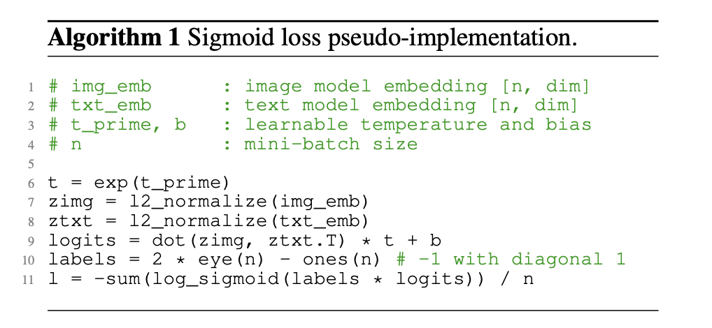
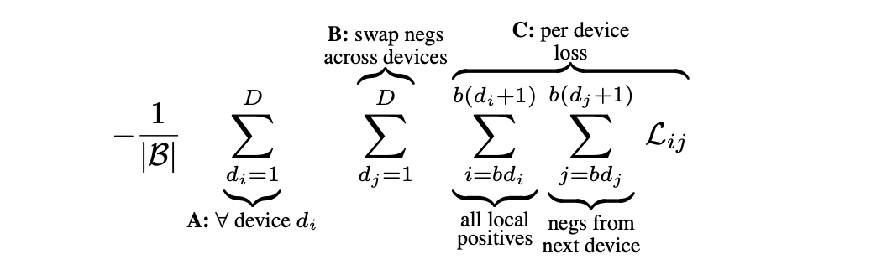

In this post, SIGLIP is introduced.

# Sigmoid Loss for Language Image Pre-Training

## 1. Introduction

본 논문은 기존의 Contrastive learning에서 사용되는 소프트맥스(softmax) 기반 손실 함수 대신, Sigmoid Loss라는 새로운 손실 함수를 제안하며 이를 언어-이미지 사전 학습(Language-Image Pre-training, LIP)에 적용한 SigLIP 및 SigLiT 모델을 소개한다.

CLIP과 같은 Constrative learning에서 표준적인 사전 학습 방법은 소프트맥스(softmax) 기반 손실을 사용하는 것이다. 이는 일치하는(positive) 쌍은 유사하게, 일치하지 않는(negative) 쌍은 다르게 만들도록 학습한다. 이를 위해 배치 내 모든 이미지와 텍스트 간의 유사도를 계산하고 정규화해야 한다. ( img → text loss for 1 sampe :  $L_i=-log \frac {exp(sim(i,i))}{\sum_{j} exp(sim(i,j))}$ 에서 전체 sampel의 $L_i$를 구하기 위해선 $N^2$의 similarity matrix가 필요함을 알 수 있다.) 또한, 소프트맥스 계산은 수치적으로 불안정할 수 있으며, 이를 안정화하기 위해 보통 입력값에서 최대값을 빼는 연산이 추가된다. 이 과정은 **전체 배치에 대한 두 번의 통과(pass)**를 요구하여 계산 복잡성을 증가시킨다. Sigmoid Loss는 ($L_i$ 를 계산 시) 전체 배치 연산을 요구하지 않아($N^2$ 개의 similarity score를 이용하지만 정규화 과정 등이 필요 없음.) 분산 학습 구현을 간소화하고 효율성을 크게 향상시킨다.

논문의 주요 결과는 다음과 같다. 

sigmoid loss가 작은 batch에서 softmax보다 성능이 좋다

- **batch size < 16k** → sigmoid loss **성능 더 좋음**
- **batch size 커질수록** → softmax와 성능 차이 **줄어듦**

- batch size 1,000,000까지 학습 가능
- 하지만 성능은 **32k 정도에서 포화**

sigmoid loss는 구조적 장점이 있다. 

- symmetric : 이미지→텍스트 / 텍스트→이미지 따로 계산할 필요 없음 (CLIP은 두 번 계산)

- single pass : softmax contrastive는 similarity matrix, normalization, distributed gather

  등이 필요함. sigmoid는 **한 번의 pair 계산으로 끝**

- memory 효율 : SigLIP도 $N^2$ 개의 similarity를 계산하지만, CLIP처럼 batch 전체를 GPU마다 모아서 저장할 필요가 없다. 그래서 distributed training에서 메모리 사용량이 훨씬 작아진다.

- 입력
  - img_emb : $(n, d)$, text_emb : $(n, d)$, $n$ : batch size, $d$ : embedding dimension
  - t_prime, $b \in \mathbb R$ : learnable parameters
- temperature 계산 : $t = e^{t \ prime}$ 
- Normalization : 각 embedding을 **unit vector**로 만듦.
  - zimg : $(n, d)$, ztxt : $(n,d)$ 
- similarity matrix 구성
  - logits = dot(zimg, ztxt.T) * t + b : $(n, n)$ 
  - $\begin{pmatrix}
    s_{1,1}e^{t \ prime}+b & s_{1,2}e^{t \ prime}+b & s_{1,3}e^{t \ prime}+b \\
    s_{2,1}e^{t \ prime}+b & s_{2,2}e^{t \ prime}+b & s_{2,3}e^{t \ prime}+b \\ s_{3,1}e^{t \ prime}+b & s_{3,2}e^{t \ prime}+b & s_{3,3}e^{t \ prime}+b\end{pmatrix}$
- label matrix 구성
  - labels = 2 * eye(n) - ones(n) : $(n, n)$
  - $\begin{pmatrix}
    1 & -1 & -1 \\
    -1 & 1 & -1 \\ -1 & -1 & 1\end{pmatrix}$

- Element-wise multiplication
  - labels * logits : $(n, n)$
  - 정답 positive pair 에는 similarity에 +1 곱하고, negative pair 에는 similarity에 -1 곱함
  - $\begin{pmatrix}
    s_{1,1}e^{t \ prime}+b & -(s_{1,2}e^{t \ prime}+b) & -(s_{1,3}e^{t \ prime}+b )\\
    -(s_{2,1}e^{t \ prime}+b) & s_{2,2}e^{t \ prime}+b & -(s_{2,3}e^{t \ prime}+b) \\ -(s_{3,1}e^{t \ prime}+b) & -(s_{3,2}e^{t \ prime}+b) & s_{3,3}e^{t \ prime}+b\end{pmatrix}$
- sigmoid loss
  - log_sigmoid(labels * logits) : $(n, n)$ 
  - sigmoid : $\sigma(x)=\frac {1}{1+e^{-x}}$ 
  - log_sigmoid : $log(\sigma(x)) = log(\frac {1}{1+e^{-x}}) = -log(1+e^{-x})$ 
  - 위에서 $s_{i,j}e^{t \ prime}+b = s'_{i, j}$ 라 두면, 
  - $\begin{pmatrix}
    log(\sigma(s'_{1,1})) & -log(\sigma(s'_{1,2})) & -log(\sigma(s'_{1,3})) \\
    -log(\sigma(s'_{2,1})) & log(\sigma(s'_{2,2})) & -log(\sigma(s'_{2,3})) \\ -log(\sigma(s'_{3,1})) & -log(\sigma(s'_{3,2})) & log(\sigma(s'_{3,3}))\end{pmatrix}$

- 위 행렬의 모든 값을 합한 스칼라를 Loss로 한다.

- BCE(Binary Cross Entropy) 와의 비교
  - BCE에서는 classification label이 ${0, 1}$ 뿐인 경우에, data i 에 대해 $L_i$ 를 계산하고 이를 sum한다.
  - $L_i = -y_ilog(\sigma(s_i)) - (1-y_i)log(1-\sigma(s_i))$
  - class label $y \in \set {0, 1}$ 을 $y'=2y-1 \in \set{-1, 1}$ 로 치환하면 $L_i =log(1+e^{-y's}) = -log(\sigma(y's))$
  - SIGLIP에서는 data pair (i, j) 에 대해 $L_{ij}$ 를 계산하고 이를 sum한다.
  - $L_{ij} = -log(\sigma(y_{ij}s_{ij}))$ 
  - $y=1$ for positive pair (정답 pair), $y=-1$ for negative pair
  - 즉, BCE에서 class label을 $\set{-1, 1}$ 로 치환한 표현이 SIGLIP에서 사용한 loss 이다. 

## 3. Method

### 3.3 Efficient “chunked” implementation

SigLIP에서는 **softmax처럼 전체 batch의 similarity matrix를 한 번에 모으지 않고**, 각 device가 자신의 local batch로 pairwise loss를 부분적으로 계산한 뒤 text (또는 image) embedding만 다른 device와 순차적으로 교환하며 새로운 pair들의 loss를 계속 누적하는 방식**으로 분산 학습을 수행한다. 이렇게 하면 매 단계에서 **전체 B×BB×Bsimilarity matrix를 만들 필요 없이 작은 b×bb×b chunk만 메모리에 올려 계산할 수 있으며**, 모든 image–text pair가 한 번씩 상호작용한 뒤 마지막에 **cross-device sum으로 loss를 합쳐 전체 loss를 얻는다. 이 방식은 softmax normalization이 필요 없는 sigmoid loss의 **pairwise 독립성** 덕분에 가능하며, 그 결과 **all-gather 없이도 메모리 효율적인 large-batch distributed training**이 가능해진다. 

## 4. Results

제안된 Sigmoid Loss는 기존의 Softmax Loss에 비해 특히 작은 배치 크기에서 더 나은 성능을 보였으며, 메모리 효율성이 뛰어나 더 큰 배치 크기를 사용할 수 있게 했다. 이러한 장점을 바탕으로 SigLiT 모델은 단 4개의 TPUv4 칩으로 2일 만에 84.5%의 ImageNet 제로샷 정확도를 달성했으며, 배치 크기의 한계를 탐색한 결과 32k 배치 크기에서 성능이 포화되는 것을 발견했다. 또한, Sigmoid Loss는 다국어 학습에서도 효과적이며, 데이터 노이즈에 대한 강건성도 뛰어난 것으로 나타났다.
