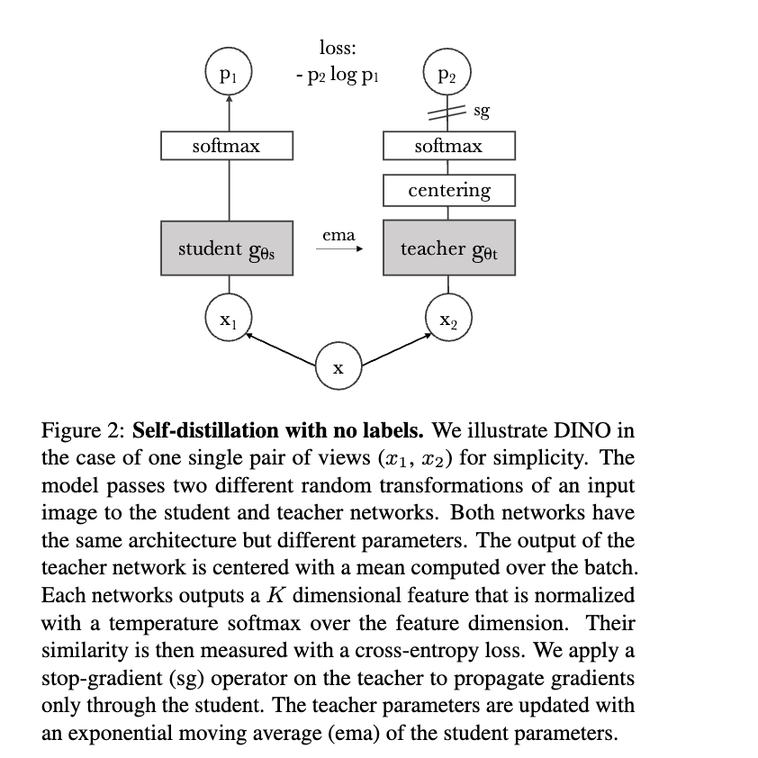
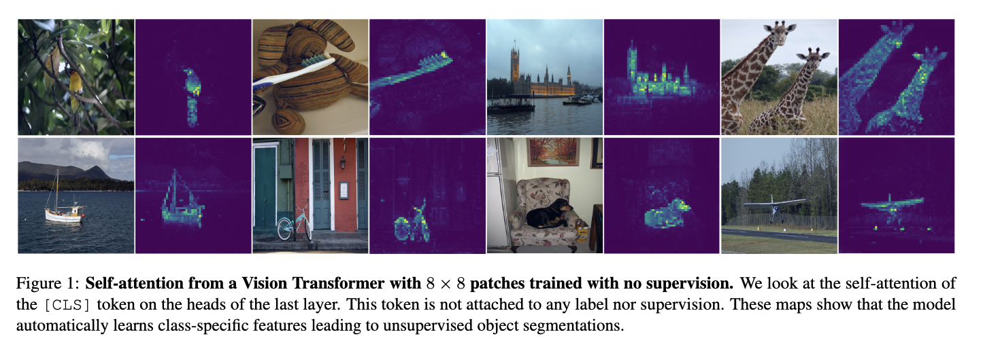
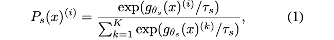
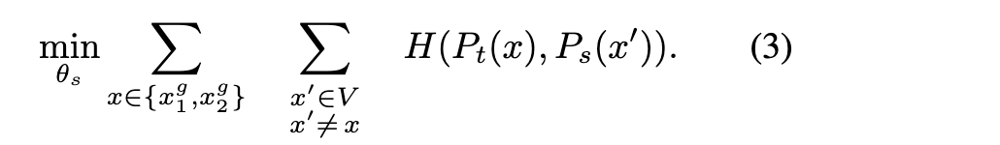
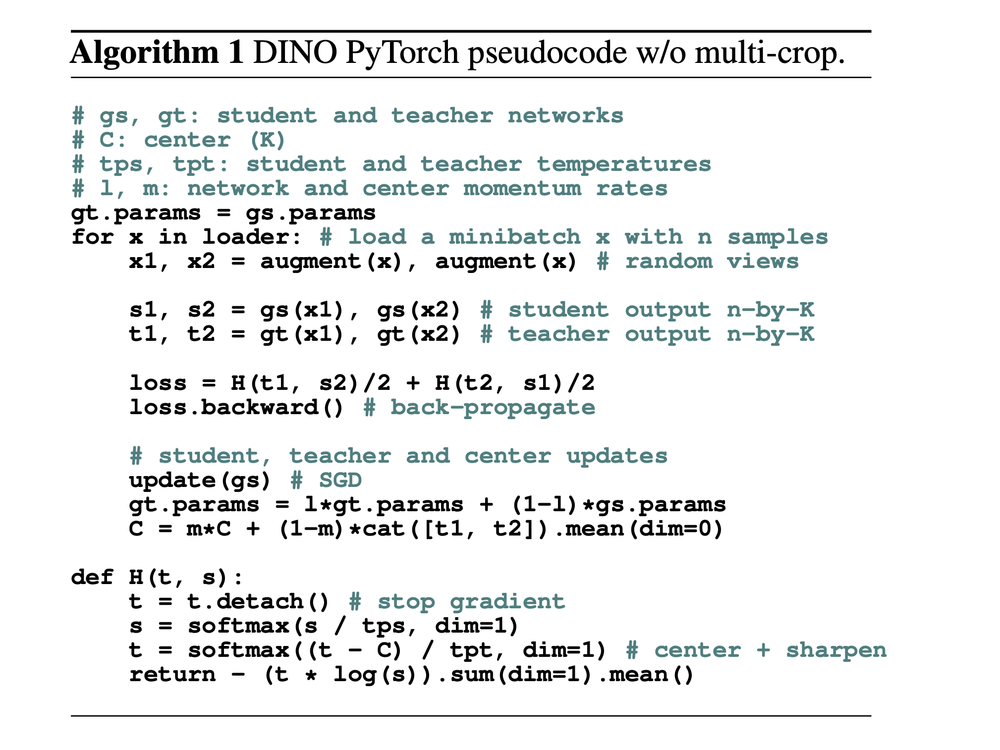

In this post, DINO is introduced.


# Emerging Properties in Self-Supervised Vision Transformers

## 1. Introduction

저자들은 Self-supervised learning을 Vision Transformer(ViT)에 적용하면 기존 CNN이나 supervised ViT와 다른 특성이 나타나는가? 라는 질문을 던진다. 결과적으로, Self-supervised ViT는 객체 segmentation 정보를 자동으로 학습한다.

- ViT의 **self-attention map**을 보면 **이미지의 객체 영역을 자연스럽게 구분하는 패턴**이 나타남.
- 특히 **[CLS] token**의 attention이 object mask처럼 동작. (CLS token은 self-attention에서 모든 token의 value를 가중합으로 받아오는 토큰으로, Loss를 계산할 때 CLS 토큰 기준으로 정의하므로 cLS가 전체 정보를 요약해 모으도록 학습된다.)

SSL을 위한 SimCLR와 같은 constrative learning의 방식과는 달리 저자들이 제안한 방법은 **DINO** = self-distillation with no labels 이다. (ViT를 encoder로 두고 DINO 방식으로 representation을 학습한다.) Self-supervised learning (DINO)을 ViT에 적용하면 label 없이도 객체 단위 표현과 segmentation-like attention이 자연스럽게 나타난다.

Distillation(지식 증류)은 보통 큰 모델(teacher)이 입력에 대해 출력한 **확률 분포(soft prediction)**를 학습 목표로 사용하여 작은 모델(student*이 그 출력을 모방하도록 학습하는 방법으로, 일반적으로 teacher는 **정답 라벨로 미리 학습된 모델**이다. 반면 **distillation with no labels**(예: DINO)은 **외부의 정답 라벨이나 사전 학습된 teacher가 없이**, 모*이 만든 표현을 스스로 학습 신호로 사용한다. 즉 동일한 이미지의 서로 다른 augmentation을 student와 teacher 네트워크에 입력하고, **teacher의 출력 분포를 student가 맞추도록 학습**하는데, 이때 teacher는 보통 student 파라미터의 **EMA(지수 이동 평균)**로 업데이트된다. 따라서 supervised label 대신 **모델 자체의 예측을 목표로 삼아 표현을 학\*하는 self-distillation 방식**이다.




Self-supervised learning으로 학습한 ViT 다음과 같은 특별한 특성을 가진다.

- scene layout, object boundaries 같은 정보가 명시적으로 나타난다. 이 정보는 아래 그림처럼 ViT 마지막 layer의 self-attention에서 직접 확인 가능하다. 즉, attention map → object segmentation처럼 보인다.
- ViT encoder를 이용해 k-NN classifier에 적용하면 ImageNet top-1 = 78.3%의 성능이 나온다. 




## 3. Approach

### 3.1. SSL with Knowledge Distillation

먼저 저자들은 self-training과 distillation의 관계를 설명한다. Self-training 과정은 다음과 같다. 

- 먼저 작은 labeled 데이터로 모델을 학습(고양이/개 분류 모델을 100개의 라벨된 이미지로 학습)
-  그 모델을 이용해 label이 없는 데이터(unlabeled data)에 대해 예측을 수행(10,000개의 라벨 없는 이미지에 대해 모델이 “고양이일 확률 0.95”라고 예측)
-  적은 라벨 데이터로 시작해 많은 unlabeled 데이터를 활용하여 모델 성능을 높일 수 있음.

Knowledge Distillation distillation은

```shell
teacher model
↓
soft prediction
↓
student model이 따라 학습
```

하는 방법이며, 보통 목적은 큰 모델 → 작은 모델 압축이다. 

DINO의 차이점은, 기존 방법들은 보통 pretrained teacher 필요한데, DINO는 teacher를 학습 중에 생성한다는 것이다. 즉, teacher = EMA(student) 이다. 

DINO는 두 개의 네트워크를 사용한다. 

- student network : $g\theta_s$ 
- teacher network :  $g\theta_t$ 
- 둘은 architecture 동일, parameter 다름

이미지 $x$가 들어오면, 각 네트워크는 K차원 벡터를 출력하고, softmax를 적용하여 확률분포로 만든다. 



- $P_s(x)^{(i)}$ : 출력 벡터의 $i$ 번째 차원값.
- $\tau$ = temperature 는 분포의 sharpness 조절

학습 목표는 student가 teacher의 출력을 따라하도록 한다. Loss 는 $H(P_t(x),P_s(x))$ 이다. ($H(a,b)=−alogb$ )

-  이미지 하나에서 여러 view를 만든다. global view 2개, local view 여러 개. 
- student → 모든 view 입력, teacher → global view만 입력한다. (이렇게 하면 local feature ↔ global feature 정렬이 학습된다)
- 
- 위 식은 전체 Loss로써, teacher(global view), student(다른 모든 view) 간 cross entropy를 최소화하는 것이다. 
- teacher는 gradient로 학습하지 않고, EMA(student) 로 업데이트 된다. $\theta_t ← \lambda \theta_t+(1−\lambda) \theta_s$ 
- ❗️DINO에서 teacher의 목적은 SimCLR와 달리 같은 이미지의 (두 view → representation 유사, 다른 이미지 → representation 멀어짐)이 아니다. DINO의 목적은 teacher representation을 student가 따라가도록 학습하는 것이고 이 과정에서 teacher의 역할은 stable target representation을 제공하는 것이다. 
- DINO의 위와 같은 특성 때문에 **Collapse**가 발생할 위험이 있다. 이는 모든 이미지에 대해 모델이 같은 벡터를 출력하는 상황이다. 예를 들어, teacher가 image1 → [0.90, 0.05, 0.05], image2 → [0.88, 0.06, 0.06], image3 → [0.91, 0.04, 0.05] 와 같이 항상 첫 번째 차원에 확률이 몰리도록 되면, 이 경우 student는 그냥 [0.90, 0.05, 0.05] 같이 출력하면 모든 이미지에서 loss가 작아진다. 따라서 DINO에서는 **Centering**을 이용한다. mean = ([0.90,0.05,0.05] + [0.88,0.06,0.06] + [0.91,0.04,0.05]) / 3 = [0.8967, 0.05, 0.0533] 값을 각 img 출력에서 빼서, 최종적으로 image1 → [ 0.0033, 0,      -0.0033], image2 → [-0.0167, 0.01,    0.0067], image3 → [ 0.0133,-0.01,   -0.0033] 처럼 모든 모든 이미지 출력이 서로 달라진다. 그래서 student는 모든 이미지 동일 출력으로는 loss를 줄일 수 없게된다. 



### 3.2. Implementation and evaluation protocols


## 4. Main Results


## 5. Ablation Study of DINO


