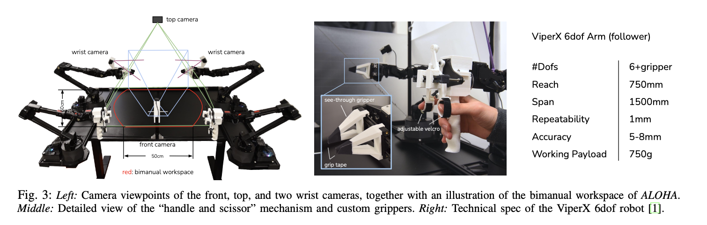
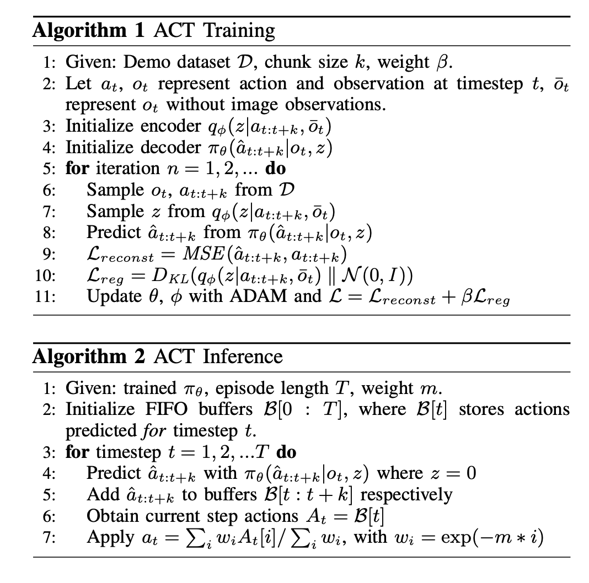
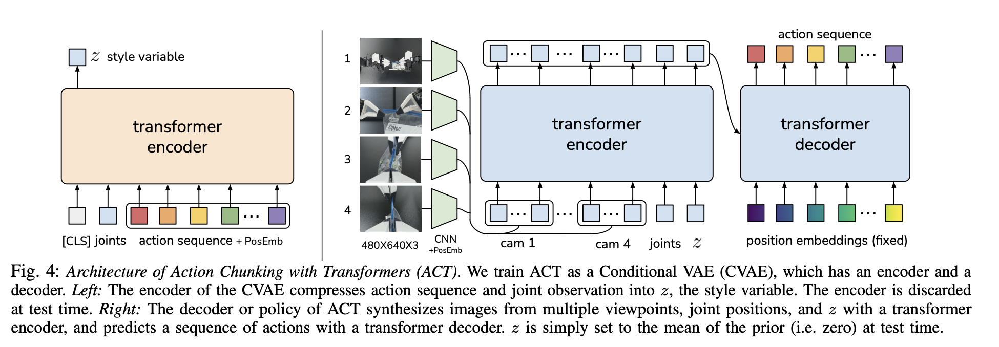
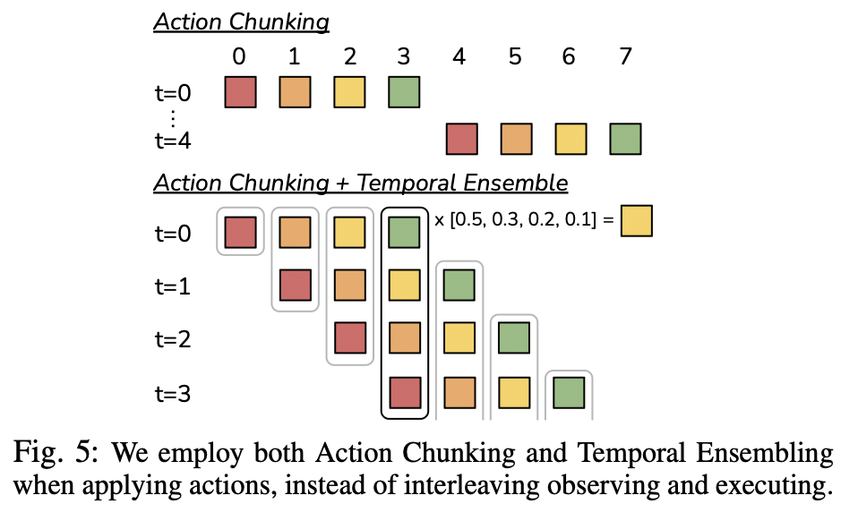

In this post, ALOHA is introduced.

# Learning Fine-Grained Bimanual Manipulation with Low-Cost Hardware

## 1. Introduction

왜 로봇은 정밀 작업(fine manipulation)을 못하는가? 케이블 타이 끼우기, 배터리 슬롯에 넣기, 컵 뚜껑 따기와 같은 작업은 mm 단위 정밀도가 필요하고, 접촉(force control)이 중요하며, 계속 보고 피드백하면서 조정해야 한다. 그래서 기존에는 고급 로봇, 정밀 센서 (비쌈), 복잡한 calibration을 사용했다. 논문의 핵심 질문은 싸고 부정확한 로봇 + 학습으로 이 문제를 해결할 수 있는가이다. 

- 제안 시스템 (ALOHA)
  - 기성품 로봇 팔과 3D 프린팅 부품을 사용하여 $20,000 미만의 비용으로 구축 가능.
  - 사용자가 저렴한 "리더(leader)" 로봇을 직접 조작(backdriving)하면, 더 큰 "팔로워(follower)" 로봇이 동일한 움직임을 미러링하는 방식의 텔레오퍼레이션(teleoperation) 시스템.
  - 정밀하고, 접촉이 중요하며, 동적인 작업 수행이 가능함을 보여줌.

- 제안 학습 알고리즘 (ACT)
  - 저비용, 부정확한 하드웨어로 미세 조작 작업을 수행하기 위해 학습 기반 접근 방식을 채택.
  - 특히, 고정밀 도메인에서 발생하는 오류 누적(compounding errors)과 인간 시연의 비정상성(non-stationarity) 문제를 해결하기 위해 행동 청킹(Action Chunking) 개념을 활용.
  - 정책이 한 번에 하나의 행동이 아닌, 여러 타임스텝에 걸친 행동 시퀀스(k 타임스텝)를 예측하도록 하여 유효 작업 범위를 줄여 오류 누적을 완화.
  - 또한, 시간적으로 상관된 모호성(temporally correlated confounders) 문제를 해결하고 시연의 부드러움을 향상시키기 위해 시간적 앙상블(temporal ensembling) 기법을 사용.
  - ACT는 트랜스포머(Transformer) 아키텍처를 사용하여 행동 시퀀스를 학습하는 조건부 변이형 오토인코더(CVAE)로 구현되며, 10분 정도의 시연 데이터로 6가지 까다로운 실제 작업을 80-90%의 성공률로 학습할 수 있음을 보여줌.

## 2. Related Work

**Imitation Learning for robotic manipulation** 

Imitation Learning 이란, 전문가의 행동을 보고 이를 따라하는 학습 방법이다. 로봇은 상태 $s$ (이미지, 관절 위치) 등이 주어지면 그 다음 수행할 행동 $a$ (팔 움직임, 그리퍼 조작 등) 을 알아야 한다. 

즉, 데이터 $(s_1, a_1), (s_2, a_2), ... , (s_n, a_n)$ 을 통해 학습하여, 상태를 넣으면 행동을 출력하는 Policy $\pi(a \mid s)$ (상태 $s$가 주어졌을 때 행동 $a$를 할 확률)를 학습해야 한다. 

 Behaviroal Cloning (BC) 는 Imitation Learning의 가장 단순한 형태이다. $\min_\theta \sum_{i} \lVert a_i-\pi_\theta (s_i) \rVert ^2$ 를 목표로 한다. 입력 예시는 카메라 이미지, 출력 예시는 로봇 팔 joint 각도가 될 수 있다. 

지금까지는 과거 정보(history) 넣기, 다른 loss 함수 사용, regularization, multi-task / few-shot, language 활용, task 구조 활용 등 BC를 더 잘 만들려고 다양한 시도 있었다. 그러나 **fine manipulation** 에서는 기존 imitation learning이 다음의 이유들로 잘 되지 않았다. 

- **Compounding Error** : 동작을 거듭할수록 이전 오류가 계속 쌓이게 된다. 
  - 이를 위한 해결방안으로 DAgger 계열이 제시되었다. 이는 학습 과정에서 모델이 직접 행동한 결과가 이상한 상태로 가면 해당 상태에서 어떻게 해야하는지를 사람이 라벨링 하여 학습 데이터에 추가하는 방법이다. 즉, 모델이 만든 실수 상태까지 포함해서 다시 학습하는 방법이다. 이 밖에도 노이즈 추가, synthetic correction data 등의 방법이 제시되었다. 

본 논문에서는 **Action Chunking** 과 **Temporal Ensemble** 을 이용해 Compouding Error 문제를 해결하고자 한다. 

**Bimanual Manipulation (양손 로봇)**

양손 로봇을 제어하기 위한 방법으로 기존에는 다음의 방법들이 사용되었다. 

- **Classical Control** : 물리 모델을 직접 써서 로봇 움직임 계산하는 것이다. 이 힘을 주면 이렇게 움직인다를 정확히 계산해내는 것인데 물체가 복잡하면 모델링 어려움, 마찰, 변형 등에 대한 예측이 어렵다. 
- **Reinforcement Learning** : 보상을 최대화하도록 행동 학습하는 것이다. 학습 오래 걸리고, 샘플이 비효율적이다.
- **Imitation Learning** : 위에 설명. 
- **Keypoints → Motor Primitives** : 이미지 → keypoints 추출 → primitive 선택 → 실행 흐름의 모델을 의미한다. 예를 들어, 컵잡기 task라면, 손잡이 위치 좌표 등의 keypoints이고 이들에 대해 어떤 primitive (grasp (잡기), push (밀기), lift (들기), rotate (회전) 등 미리 정의된 행동) 을 수행할지 결정한다. 

본 논문에서 Bimanual Manipulation을 위한 setup은 다음과 같다. 

- low-cost hardware : 로봇 팔 하나당 약 500만~700만원 수준
- high-precision, closed-loop tasks : 아주 정밀한 작업을, 피드백 기반으로 수행
- teleoperation setup : teleoperation system 이란, 사람이 로봇을 직접 조종하는 시스템을 의미한다. 그 방법으로 Leader-Follower 구조를 이용한다. 
  - **Leader-Follower** : Leader는 사람이 직접 움직이는 로봇이고, Follwer는 실제 작업 수행 로봇이다. 사람이 leader를 움직이면 follower가 따라한다.
  - **Joint-space mapping** : 따라하는 방식이 Joint-space mapping이다. 이는 leader의 관절 각도를 그대로 복사하는 것을 의미한다. 
- special encoders (고정밀 관절 센서), sensors (힘 센서, 촉각 센서 등), machined components (정밀 가공 부품) 등을 사용하지 않았다. 
- 3D printed parts : 필요한 부품만 3D 프린터로 제작한다. 
- non-experts can assemble in < 2 hours (전문가 아니어도 2시간 내 조립 가능)

## 3. ALOHA

본 논문에서는 저렴하고 쉽게 만들 수 있는 양손(두 로봇 팔) 원격조작 시스템을 설계했고, 기존 방식보다 더 직관적이고 정밀하게 조작되도록 했다. 이 시스템은 아래 5가지 기준을 만족하도록 설계되었다. 

1. Low-cost (저렴) : 산업용 로봇 하나 수준 가격으로 구축 가능
2. Versatile (범용성) : 다양한 실제 물체 조작 가능
3. User-friendly (사용자 친화적) : 직관적이고 쉽게 사용 가능
4. Repairable (수리 용이) : 고장 나도 쉽게 교체 가능
5. Easy-to-build (조립 쉬움) : 비전문가도 빠르게 조립 가능

이를 위한 하드웨어 구성은 다음과 같았다. 

- ViperX 로봇 팔 2개 (양손), 병렬 그리퍼 (집게 형태)
- 기본 그리퍼로는 정밀 작업이 부족하여 3D 프린트를 통해 투명 손가락을 만들어 gripping tape (마찰력 증가 tape)로 부착했다. 

Teleoperation 방식은 다음과 같았다. 

- 기존 방식에서는 사람 손의 위치/자세를 측정 (VR 컨트롤러, 카메라) 하여 이를 로봇 끝(end-effector) 위치로 변환하는 방식을 이용했다. 이 과정에서, IK (inverse kinematics)이 필요하고, 계산 복잡하며, 오차 발생하는 문제가 있다.
- 본 논문에서는 Leader-Follower 구조를 이용하여 사람 손 대신 작은 로봇 (Leader) 자체를 조작한다. 
  - Leader로 WindowX, Follower로 ViperX 를 사용했다.
  - 이 때, backdriving (모터를 역으로 밀어서 직접 움직이는 것) 으로 leader robot을 조작한다. (쉽게 말하면 로봇을 손으로 잡고 그냥 관절을 직접 움직이는 것)

이 방식의 이점은 다음과 같다.

- IK 불필요 
  - IK란 목표 위치가 주어졌을 때, 각 관절을 어떻게 움직여야 하는지 계산하는 것이다. 로봇 손을 옮길 위치 좌표를 주면 IK는 그러기 위해 각 관절을 몇 도씩 움직이면 되는지를 계산하는 식이다. (반대로 관절 각도로부터 손 끝위치를 계산하는 것을 Forward Kinematics 라 한다.)
  - singularity(특이점) 근처에서 IK가 잘 풀리지 않는 문제가 있다.
    -  로봇 끝 위치 $x$와 관절 각도 $\theta$ 사이에는 다음의 관계가 있다. $\dot x = J(\theta)\dot \theta$  ($J(\theta)$ 는 속도 변환 Jacobian이다)
    - IK 에서는 $\dot \theta = J^{-1}(\theta) \dot x$ 를 푸는데, singularity 근처에서는 역행렬이 존재하지 않는다. 따라서 IK가 실패하거나 이상한 값을 출력하게 된다. 
  - 또한, 이 로봇은 자유도 6개라 여유(중복)가 없어 더 불안정하다.  자유도 (DOF) 란, 자유롭게 선택할 수 있는 값으로 6인 경우 (로봇 손 끝 $x, y, z$ 좌표와 rotatioin 좌표 3개를 의미한다.) 만약 DOF > 6 이라면 같은 위치를 만드는 방법이 여러 개이기 때문에 singularity가 아닌 방법을 선택할 수 있으나 현재 로봇에선 그렇지 못하다.

- 무게가 있어서 너무 빨리 못 움직인이고, 작은 진동을 흡수한다. 
  - VR 컨트롤러는 가벼워서 손을 휙휙 움직이기 쉽다. 그러면 로봇도 같이 급하게 움직인다. (불안정)
  - 작은 로봇을 이용하는 경우 무게 + 관절 저항 있어 자연스럽게 천천히 움직이게 된다. 
  - 사람 손에는 항상 미세 떨림이 있고 VR을 사용하는 경우 그 떨림이 그대로 전달된다.
  - 로봇을 통해 전달하는 경우 작은 떨림은 사라지고 큰 움직임만 전달된디. 

카메라 구성은 다음과 같았다. 

- 모두 Logitech C922x 웹캠 (해상도: 480×640 RGB)

- 카메라 4대 배치 : **2개 (손목)**→ follower 로봇의 손목에 장착 (그리퍼 근접 영상), **1개 (정면)** → 전체 작업 공간 front view, **1개 (위쪽)**→ top-down view

이 밖에도, 팔에 고무줄을 달아 중력 부하를 줄이는 등의 setup이 있었다.

이러한 setting을 통해 다음의 작업들이 우수한 성능으로 가능했다.

정밀 작업 (Precise tasks, 케이블 타이 끼우기, 지갑에서 카드 꺼내기, 지퍼백 열고 닫기), 접촉 기반 작업 (Contact-rich tasks, RAM (288핀) 꽂기, 책장 넘기기, 체인/벨트 조립), 동적 작업 (Dynamic tasks, 탁구공 튕기기, 공 균형 잡기, 공중에서 비닐봉지 열기)

## 4. ACTION CHUNKING WITH TRANSFORMERS

기존 imitation learning 알고리즘은 정밀 작업(fine-grained tasks), 빠른 제어(high-frequency control), 실시간 피드백(closed-loop) 상황에서 성능이 좋지 않았다. 

본 논문에서는 **ACT (Action Chunking with Transformers)** 라는 새로운 알고리즘을 제안한다. 앞서 imitation learning 이란 데이터 $(s_1, a_1), (s_2, a_2), ... , (s_n, a_n)$ 을 통해 학습하여, 상태를 넣으면 행동을 출력하는 Policy $\pi(a \mid s)$ (상태 $s$가 주어졌을 때 행동 $a$를 할 확률)를 학습하는 것이라 했다. 따라서, model traing을 위해 데이터 $(s_1, a_1), (s_2, a_2), ... , (s_n, a_n)$ 이 필요하다. 

- state $s$ : follower joint positions (follower 관절 좌표), 4개 카메라 이미지 
- action $a$ : leader joint positions (leader 관절 좌표) 

중요한 점은 action으로써, follower가 아닌 leader의 관절 좌표를 이용한다는 점이다. 

이를 통해 leader와 follower의 차이를 계산하면 PID를 통해 만들어낼 실제 힘(토크)을 알 수 있다. 

### A. Action Chunking and Temporal Ensemble

Action Chunking and Temporal Ensemble은 imitation learning에서 발생하는 compounding error와 짧은 horizon 문제를 해결하기 위해, 매 timestep마다 단일 행동이 아니라 k개의 미래 행동을 한 번에 예측하도록 하여 $(\pi (a_{t:t+k}|s_t))$ 의사결정 횟수를 줄이고 인간의 비마코프적·연속적인 행동 구조를 반영하는 한편, 단순 chunking이 새로운 관측을 반영하지 못해 움직임이 끊기는 문제를 해결하기 위해 매 timestep마다 policy를 다시 호출하여 서로 겹치는 여러 action chunk를 생성하고, 동일 timestep에 대한 여러 예측을 지수 가중 평균(최근 예측에 더 큰 weight)으로 결합하는 temporal ensemble을 적용함으로써, 추가 학습 비용 없이도 더 부드럽고 안정적이며 정확한 로봇 제어를 가능하게 하는 방법이다.

- 비-마르코프적 행동 : 현재 상태만으로는 다음 행동을 결정할 수 없는 경우. $a_t = f(s_t)$ 가 아닌 경우이다. 예를 들어, 멈췄다가 다시 움직이기의 경우, 손이 컵 위에 있는 상태는 동일한데 방금 도착한 상황이라면 행동은 멈춤이 되어야 하고, 잡으려는 중이었다면 행동은 잡기여야 한다. 즉, 상태는 같지만 지금이 어느 타이밍인지에 따라 행동이 달라진다. 

### B. Modeling human data

VAE 학습.

로봇이 사람처럼 정밀 작업을 배우려면 어떻게 해야 하는가. 본 논문에서는 기존의 문제를 해결하기 위한 수단으로 Action Chunking, Temporal Ensemble, CVAE + Transformer를 이용한다.

