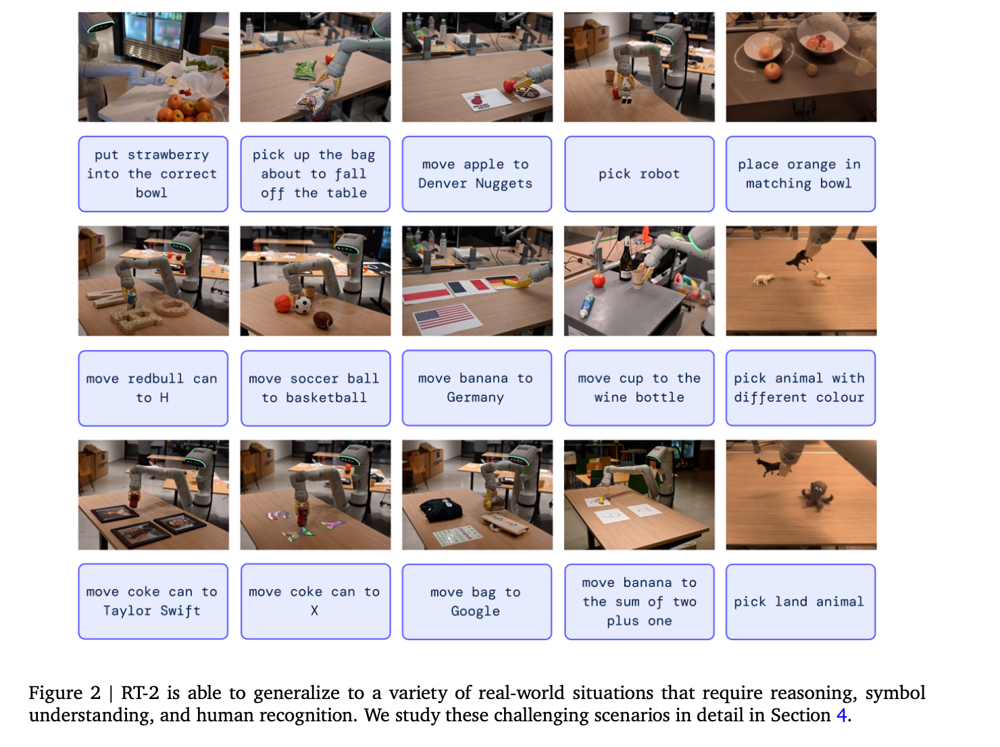
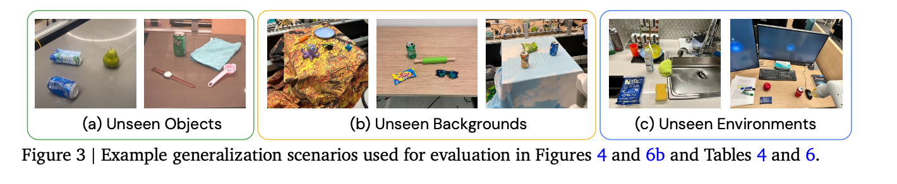
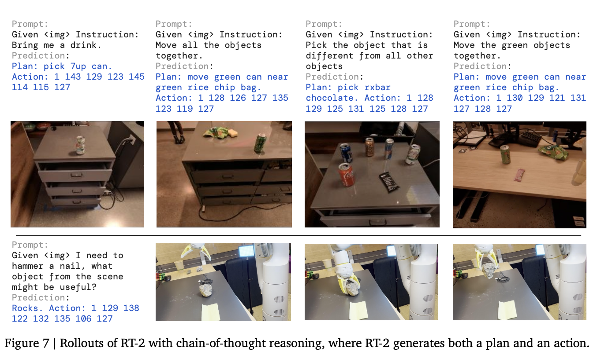

In this post, RT-2 is introduced.


# RT-2: Vision-Language-Action Models Transfer Web Knowledge to Robotic Control

## 1. Introduction

### 🔹 1. 웹 데이터로 학습된 모델의 능력

- 대규모 데이터로 학습된 모델들(LLM, VLM)은 이미 강력함
  - LLM → 자연스러운 글쓰기, 문제 해결, 코드 생성
  - VLM → 다양한 객체 인식 + 이미지 속 상황 이해 + 추론까지 가능

👉 즉, **이미 “생각하는 능력(semantic reasoning)”은 충분히 갖고 있음**

------

### 🔹 2. 이 능력이 왜 중요한가 (로봇 관점)

- 현실 세계 로봇은 단순 반복 작업이 아니라
  → 다양한 상황에서 판단해야 함 (generalist robot)

예:

- “이 중에서 가장 작은 물체 집어”
- “컵을 숫자 3 위에 놓아”
- “피곤한 사람에게 맞는 음료 가져와”

👉 이런 건 단순 제어가 아니라 **언어 이해 + 추론 + 시각 이해**가 필요

## 🔹 1. 데이터 문제 (로봇 vs 웹)

- 로봇이 이런 능력을 가지려면?
  → 엄청 많은 실제 로봇 실험 데이터 필요

하지만 현실:

- 웹 모델: **수십억 데이터 (텍스트 + 이미지)**
- 로봇: **실험 데이터 수집이 너무 비쌈 → 절대 그 규모 못 맞춤**

👉 결론:

> 로봇만으로 학습해서는 LLM/VLM 수준 못 따라감

------

## 🔹 2. 그렇다고 웹 모델을 그대로 쓰기도 어려움

문제는 반대쪽에도 있음:

- LLM/VLM은
  → “의미(semantic), 텍스트, 개념”을 다룸
- 로봇은
  → “좌표, 각도, 힘” 같은 **저수준 물리 행동** 필요

예:

- 모델: “컵을 테이블 위에 놔”
- 로봇: (x, y, z 위치 + gripper angle 등)

👉 즉,

> **추상적 reasoning ↔ 물리적 action 사이에 gap 존재**

------

## 🔹 3. 기존 연구의 한계

기존 방식은 보통 이렇게 함:

1. LLM/VLM → 명령 해석
2. → “pick”, “place” 같은 primitive로 분해
3. → 별도의 low-level controller가 실행

👉 구조:

```
언어 모델 → (계획) → primitive → (별도 컨트롤러) → 실행
```

문제:

- **semantic knowledge가 실제 행동까지 전달 안됨**
- low-level controller는 그냥 기계적으로 움직임

👉 즉,

> “똑똑한 두뇌”와 “몸”이 분리되어 있음

------

## 🔹 4. 이 논문의 핵심 질문

그래서 RT-2가 던지는 질문:

> ❗ “웹에서 학습된 VLM을
> 중간 과정 없이
> **직접 low-level 로봇 제어에 연결할 수 없을까?**”

그리고 목표:

- generalization 향상
- reasoning 기반 행동 가능

------


# 🔹 2. 기존 방식 vs RT-2 방식

### ❌ 기존 방식

```
이미지 + 텍스트 → (LLM/VLM)
→ 계획 (pick, place 등)
→ 별도 컨트롤러 → 실제 행동
```

👉 문제:

- 중간 단계 많음
- 의미(semantic)가 행동까지 안 이어짐

------

### ✅ RT-2 방식

```
이미지 + 명령 → VLM → action tokens 바로 출력
```

👉 즉,

> **모델이 “말” 대신 “행동”을 출력**

------

# 🔹 3. 어떻게 가능하게 했냐 (핵심 트릭)

### 👉 Action을 text token으로 변환

- 원래 로봇 action:
  - (x, y, z 좌표, gripper 상태 등)

이걸 이렇게 바꿈:

```
"move_to(x=0.3, y=0.2, z=0.5)"
"close_gripper"
```

👉 즉,

> **행동 = 문장처럼 표현**

------

# 🔹 4. 학습 방식 (진짜 중요)

기존 VLM 학습:

```
이미지 + 질문 → 텍스트 답변
```

RT-2 학습:

```
이미지 + 명령 → action 텍스트
```

그리고:

- 웹 데이터 (VQA, caption 등)도 같이 학습
- 로봇 trajectory도 같이 학습

👉 그래서:

> **언어 능력 + 행동 능력을 동시에 학습**

------

# 🔹 5. multimodal sentence 개념

논문에서 말하는 “multimodal sentence”:

```
[이미지 + 명령] → [행동 토큰 sequence]
```

👉 이것을 하나의 “문장”처럼 다룸

------

# 🔹 6. 왜 이게 좋은가

### ✔ 장점

- 기존 VLM 그대로 사용 (새 아키텍처 필요 없음)
- 웹에서 배운 지식 활용 가능
- end-to-end (중간 planner 없음)

👉 핵심:

> **semantic reasoning이 바로 행동으로 연결됨**

------

# 🔹 7. RT-2 정의

이렇게 만든 모델을:

👉 **VLA (Vision-Language-Action model)**
→ RT-2가 그 대표 모델


# 🔹 4. Emergent capability (핵심)

👉 학습하지 않은 능력이 “자연스럽게 생김”

------

## 🔥 예시 1: 의미 기반 위치 이해

- “숫자 3 위에 물체 올려라”
- 로봇 데이터에는 숫자 개념 없음

👉 그런데도 성공

------

## 🔥 예시 2: 관계 이해

- “A에 가장 가까운 물체 집어라”

👉 거리 관계 추론 가능

------

## 🔥 예시 3: 용도 기반 추론 (진짜 중요)

- “망치 대신 쓸 수 있는 것 가져와”
  → 🪨 돌 선택
- “피곤한 사람에게 맞는 음료”
  → ⚡ 에너지 드링크 선택

👉 이건 단순 vision이 아니라
👉 **상식(reasoning)**


## 2. Related Work

# 🔹 1. Vision-Language Model (VLM) 종류 정리

논문은 VLM을 크게 **2가지로 나눔**

------

## ✔ (1) Representation learning 모델 (예: CLIP)

- 이미지 ↔ 텍스트를 같은 embedding 공간에 매핑

👉 역할:

- “이 이미지 = 이 텍스트” 같은 **매칭/분류**

👉 특징:

- 직접 문장 생성 ❌

------

## ✔ (2) Vision-Language Model (생성형)

```
(이미지 + 텍스트) → 텍스트 출력
```

👉 예:

- captioning
- VQA (질문 답변)

👉 특징:

- **자유로운 텍스트 생성 가능**
- reasoning 가능

------

👉 RT-2는?

> **(2)번\*생성형 VLM을 사용**

------

# 🔹 2. 기존 VLM 연구의 특징

- 다양한 task 동시에 학습:
  - 이미지 설명
  - 질문 답변
  - 언어 작업

👉 결과:

> 강력한 generalization + reasoning 능력 확보

------

# 🔹 3. 그런데 로봇에서는 어떻게 쓰였나?

기존 연구:

- VLM을 로봇에 쓰긴 했지만

👉 방식:

- planning (상위 단계)만 담당
- 실제 action은 따로 처리

------

# 🔥 RT-2의 차별점

👉 이 논문은:

> **VLM이 직접 action을 예측하도록 확장**

즉,

```
기존: VLM → 계획 → 행동
RT-2: VLM → 행동 (end-to-end)
```

------

# 🔹 4. Generalization in Robot Learning (두 번째 큰 축)

로봇 분야의 오래된 목표:

> **“새로운 상황에서도 잘 동작하는 로봇 만들기”**

------

## ✔ 기존 접근 방법

- 다양한 데이터로 학습

👉 결과:

- 새로운 물체 가능
- 새로운 task 조합 가능
- 새로운 명령 가능

------

## ✔ 하지만 한계

- 여전히 제한적
- 데이터 의존적

------

# 🔥 RT-2의 접근

👉 핵심 아이디어:

> **로봇 데이터 말고
> 웹에서 배운 지식을 활용하자**

------

# 🔹 5. 논문의 포지셔닝 (가장 중요)

기존:

- 특정 축에서만 generalization
  - object만
  - task만
  - 환경만

RT-2:

> **모든 축에서 동시에 generalization 목표**

- 새로운 object
- 새로운 task
- 새로운 instruction
- 새로운 환경

------

# 🔹 1. 기존 로봇 pre-training 방식들

## ✔ (1) Vision pretraining (이미지 모델)

- ImageNet 같은 걸로 학습한 모델 사용
- 로봇의 camera encoder 초기화

👉 역할:

> **이미지 특징 잘 뽑기**

------

## ✔ (2) Data augmentation / control-specific 학습

- 로봇 task에 맞게 augmentation
- 제어에 특화된 loss/objective

👉 역할:

> **로봇 행동 성능 개선**

------

## ✔ (3) Language model 활용

- 명령 해석 (instruction encoder)
- high-level planning

👉 구조:

```
언어 모델 → 계획 → 로봇 실행
```

------

# 🔥 핵심 문제

👉 다 따로 놀고 있음

- vision 따로
- language 따로
- action 따로

👉 즉:

> **통합된 “지능 + 행동” 모델이 없음**

------

# 🔹 2. VLM 활용한 기존 연구

최근 연구:

- VLM을 로봇에 적용하려고 시도

사용 방식:

- 상태 표현 (representation)
- 객체 인식
- planning
- success 판단

👉 하지만:

> ❗ 여전히 “보조 역할”만 함
> (직접 행동 생성 ❌)

------

# 🔹 3. 일부 end-to-end 시도 (CLIPort, MOO)

- VLM을 end-to-end로 쓰긴 했지만

### ❗ 문제

- 구조가 너무 제한적
- action space 제한 (예: 2D만)
- 카메라 calibration 필요

👉 즉:

> **일반화 어려움**

------

# 🔥 4. RT-2의 핵심 차별점

## ✔ (1) VLM을 “그대로 사용”

- 따로 vision / language 분리 안 함

------

## ✔ (2) 생성형 VLM 사용 (중요)

👉 기존:

- embedding 모델

👉 RT-2:

> **텍스트 생성 모델 사용**

------

## ✔ (3) unified output space (핵심 중 핵심)

👉 언어 + 행동을 동일하게 표현

```
텍스트 = 행동 = 같은 token space
```

👉 결과:

- 파라미터 공유됨
- 별도 action head 필요 없음

------

## ✔ (4) 제약 없음

- 2D action 제한 없음
- calibration 필요 없음


## 3. Vision-Language-Action Models


### 3.1. Pre-Trained Vision-Language Models

# 🔹 2. VLM 기본 구조 (핵심 이해)

논문에서 사용하는 모델:

```
이미지 (1장 or 여러 장)
→ 모델
→ token sequence 출력
```

👉 원래 의미:

- 이 token = 자연어 문장

예:

```
이미지 → "a red cup on the table"
```

------

# 🔥 RT-2에서는?

👉 이 token이:

```
자연어 ❌
행동 ⭕
```

------

# 🔹 3. VLM이 원래 잘하는 것

이 모델은 이미:

- 이미지 구성 이해
- 객체 관계 이해
- 질문 답변
- 추론

👉 즉:

> **이미 “생각 능력”은 완성됨**

------

# 🔹 4. 핵심 아이디어 (여기서 연결됨)

👉 그래서:

> “이 좋은 모델을
> 그냥 행동까지 출력하게 만들자”

------

# 🔹 5. 어떤 모델을 사용했나

논문에서 실제 사용:

## ✔ PaLI-X

- 큰 vision-language 모델

## ✔ PaLM-E

- 로봇 + language 통합 모델

👉 그리고 이름을 바꿈:

- RT-2-PaLI-X
- RT-2-PaLM-E



### 3.2 Robot-Action Fine-tuning

# 🔹 2. 원래 로봇 action 형태

로봇이 실제로 하는 행동:

```
(Δx, Δy, Δz, Δrot_x, Δrot_y, Δrot_z, gripper)
```

👉 연속값 (continuous)

------

# 🔴 문제

LLM/VLM은:
👉 **연속값 못 다룸 → token만 다룸**

------

# 🔹 3. 해결 방법: Discretization

👉 연속값을 **256개 구간으로 쪼갬**

예:

```
Δx ∈ [-1 ~ 1] → 256개 bin
→ 0, 1, 2, ..., 255
```

👉 결과:

> 모든 action을 “정수”로 표현 가능

------

# 🔹 4. Action → Token 변환

이제 이렇게 됨:

```
Δx = 128
Δy = 91
Δz = 241
...
```

👉 그리고 이걸 문자열로:

```
"1 128 91 241 5 101 127"
```

👉 완전히 “텍스트”처럼 변함

------

# 🔥 5. 구조 (엄청 중요)

모델 입출력:

```
입력:
이미지 + 명령

출력:
"terminate Δx Δy Δz Δrot_x Δrot_y Δrot_z gripper"
```

👉 즉:

> **행동 = 문장**

------

# 🔹 6. Token 매핑 방법 (모델별 차이)

## ✔ PaLI-X

- 숫자 자체가 token 있음

👉 그냥:

```
128 → token(128)
```

------

## ✔ PaLM-E

- 숫자 token 없음

👉 해결:

- 덜 쓰이는 token 256개 가져다가
- action token으로 재정의

👉 이걸:

> **symbol tuning**

------

# 🔹 7. 학습 데이터 형태

데이터를 이렇게 바꿈:

```
Q: 어떤 행동 해야 해?
A: 1 128 91 241 5 101 127
```

👉 완전히 VQA 형식

# 🔥 1. Co-Fine-Tuning (핵심 중 핵심)

## 🔹 기존 방식 (문제)

```
웹 데이터로 pretrain → 로봇 데이터로 finetune
```

👉 문제:

- finetune 하면서
  👉 **웹에서 배운 지식이 사라짐 (catastrophic forgetting)**

------

## 🔹 RT-2 방식

```
웹 데이터 + 로봇 데이터 → 같이 학습
```

👉 이걸:

> **co-fine-tuning**

------

## 🔹 왜 좋은가

모델이 동시에 배움:

- 웹 데이터 → 개념, 의미, 상식
- 로봇 데이터 → 실제 행동

👉 결과:

> **“생각 + 행동” 동시에 유지됨**

------

## 🔹 핵심 디테일

학습할 때:

- batch 안에
  - 웹 데이터
  - 로봇 데이터

👉 둘 다 섞어서 넣음

그리고:
👉 로봇 데이터 비중을 더 높임 (중요)

------

## 🔥 한 줄 핵심

👉 **웹 지식 잃지 않으면서, 행동까지 배우게 하는 방법**

------

# 🔥 2. Output Constraint (실전에서 중요)

## 🔹 문제 상황

모델은 원래:

```
모든 token 다 출력 가능
```

👉 근데 로봇에서는:

```
action token만 출력해야 함
```

------

## 🔴 문제

모델이 갑자기:

```
"hello", "cat", "table"
```

👉 이런 거 출력하면?
👉 로봇 망함

------

## 🔹 해결 방법

👉 action task일 때:

```
출력 가능한 token = action token만
```

👉 즉:

> **vocab 제한**

------

## 🔹 반대로

일반 VLM task일 때:

```
모든 token 허용
```

👉 flexibility 유지


# 🔥 1. 문제 상황 (핵심)

RT-2 모델 크기:

- 최대 **55B 파라미터**

👉 이건:

❌ 로봇에 직접 탑재 불가능
❌ 일반 PC에서도 힘듦

------

# 🔹 2. 왜 문제냐

로봇은:

```
계속 빠르게 행동 결정해야 함 (real-time)
```

예:

- 1초에 여러 번 행동 계산 필요

👉 그런데 모델이 너무 크면:

- 계산 느림
- 반응 늦음

------

# 🔴 핵심 문제

👉 **“큰 모델 vs 빠른 반응” 충돌**

------

# 🔹 3. 해결 방법 (핵심 아이디어)

👉 모델을 로봇에 안 넣고

```
클라우드에서 실행
```

------

## ✔ 구조

```
로봇 → (이미지 + 명령 전송) → 클라우드
클라우드 → RT-2 실행 → action 반환
```

👉 즉:

> **로봇 = 센서 + 실행기
> 클라우드 = 두뇌**

## 4. Experiments

# 🔹 2. 실험 설정

## ✔ 데이터

- 약 **6000개 로봇 실행(trial)**

------

## ✔ 로봇

- 7자유도 (7-DoF) 로봇 팔

------

## ✔ 학습 데이터 구성

### (1) 웹 데이터

- VQA
- caption
- 이미지 + 텍스트

👉 = “지식”

------

### (2) 로봇 데이터

- 13개 로봇
- 17개월 수집
- 실제 환경 (오피스 주방)

👉 = “행동”

------

## ✔ 중요한 점

각 데이터에:
👉 자연어 instruction 있음

예:

```
"pick up 7up can"
"open drawer"
```

------

# 🔹 3. 모델 종류

## ✔ RT-2-PaLI-X

- 5B, 55B

## ✔ RT-2-PaLM-E

- 12B

------

# 🔹 4. 비교 대상 (Baseline)

RT-2가 잘했는지 보려면 비교 필요

------

## ✔ RT-1

- 기존 로봇 모델

------

## ✔ VC-1 / R3M

- representation learning 기반

------

## ✔ MOO

- VLM을 보조적으로 쓰는 모델

### 4.1. How does RT-2 perform on seen tasks and more importantly, generalize over new objects, backgrounds, and environments?

RT-2의 일반화 성능을 평가하기 위해, 연구는 seen task와 unseen task로 나누어 실험을 수행하며, 특히 unseen 상황을 새로운 물체, 새로운 배경, 그리고 새로운 환경으로 구분하여 테스트한다. 각 설정은 easy와 hard로 나뉘며, 모델이 단순히 학습 데이터를 암기한 것이 아니라 다양한 현실 변화를 이해하고 대응할 수 있는지를 평가하는 데 초점을 둔다.



**RT-2는 seen task에서는 기존 모델과 유사한 성능을 보이지만, unseen object, background, environment와 같은 일반화 상황에서는 기존 모델 대비 약 2배 이상의 성능 향상을 보이며, 이는 웹 데이터로부터 학습한 시각적·언어적 개념을 로봇 행동에 효과적으로 전이할 수 있음을 보여준다.**

### 4.2 Can we observe and measure any emergent capabilities of RT-2?

# 🔥 1. 이 섹션에서 하고 싶은 말 (한줄 요약)

👉 **RT-2는 단순히 따라하는 로봇이 아니라, “새로운 능력(emergent capability)”을 만들어낸다**

------

# 🧠 2. emergent capability가 뭐냐?

논문 정의 그대로 풀면:

👉 **웹에서 배운 지식이 로봇 행동으로 “새롭게 튀어나오는 능력”**

중요 포인트:

- 로봇 데이터에 **없던 상황**
- 그런데도 **잘 행동함**

즉,

> ❌ 그냥 imitation learning
> ✅ 웹 지식 → 로봇 행동으로 “전이(transfer)”됨

------

# 📦 3. 핵심 주장 (문장 해석)

### 원문 핵심:

> we do not expect new robotic motions
> but semantic & visual concepts transfer

👉 해석:

- ❌ 새로운 모터 동작을 배우는 건 아님
- ✅ 대신 **개념 이해 능력**이 생김

예:

- “strawberry는 과일이다”
- “비슷한 것끼리 모아야 한다”

------

# 🎯 4. 실제 emergent 능력 예시

## (1) 🍓 strawberry 분류

> "put strawberry into the correct bowl"

이게 왜 어려움?

👉 단순히 “딸기 집기”가 아님

필요한 능력:

1. strawberry가 뭔지 알아야 함
2. bowl이 뭔지 알아야 함
3. 과일끼리 묶는다는 개념 이해
4. 상황 보고 판단

👉 **이건 로봇 데이터에 없던 추론**

------

## (2) 🛍️ 떨어질 것 같은 가방 집기

> "pick up the bag about to fall"

필요한 능력:

1. 두 개 가방 구분
2. “위험한 상태” 인식
3. 물리적 상태 이해 (unstable)

👉 단순 vision이 아니라
👉 **상황 reasoning + 물리 이해**

------

# 🧪 5. 중요한 결론

👉 이 모든 상황:

> ❗ 로봇 데이터에 없었음

그럼 왜 가능?

👉 **웹 데이터에서 배운 semantic knowledge 때문**

------

# 📊 6. quantitative 평가 (숫자로 증명)

- RT-1, VC-1 (기존 모델)
- vs RT-2 (새 모델)

👉 같은 환경에서 비교 (A/B testing)

결론:

> RT-2가 emergent capability를 실제로 더 잘 수행함

------

# ⚠️ 7. 중요한 개념 정리 (시험 핵심)

### ❗ emergent capability =

👉 “훈련에 없던 능력이 나타남”

근데 이유는:

- 모델 구조 때문 ❌
- **대규모 웹 pretraining 때문 ⭕

------

# 🧠 1. emergent capability를 3가지로 나눔

논문이 한 일:

👉 “이게 진짜 새로운 능력이냐?”를 보기 위해
👉 **3개 카테고리로 쪼개서 테스트**

------

## ① Symbol Understanding (기호 이해)

👉 **언어 ↔ 의미 매핑 능력**

예:

- "move apple to 3"
- "push coke can on top of heart"

핵심:

> 로봇 데이터에 없던 “기호/표현”을 이해하는가?

✔️ 숫자, 모양, 단어 의미 연결

------

## ② Reasoning (추론 능력)

👉 이게 제일 중요

### 포함되는 것:

- 👁️ 시각 reasoning
  → "같은 색 컵으로 이동"
- ➕ 수학 reasoning
  → "2+1 위치로 이동"
- 🌍 다국어 이해
  → "mueve la manzana..."

핵심:

> 단순 매칭이 아니라 **생각해서 행동**

------

## ③ Human Recognition (사람 이해)

👉 사람 관련 지시 이해

예:

- "안경 쓴 사람에게 콜라 줘"

필요:

- 사람 인식
- 속성 인식 (안경)
- 대상 선택

------

# ⚠️ 핵심 구조 요약

| 카테고리  | 의미        |
| --------- | ----------- |
| Symbol    | 언어 → 의미 |
| Reasoning | 생각/추론   |
| Human     | 사람 이해   |

------

# 📊 2. 결과 (Figure 6 핵심 해석)

## (1) RT-2 vs 기존 모델

👉 RT-2가 압도적으로 좋음

특히:

- Symbol: 압도적
- Reasoning: 크게 향상
- Human: 크게 향상

👉 평균:

> **RT-2 ≈ 3배 성능**

------

## (2) 모델 크기 영향

- PaLI-X (큰 모델) → 전체적으로 더 좋음
- PaLM-E (작은 모델) → **수학 문제에서 더 좋음**

------

# 🤔 3. 왜 이런 차이가 생김?

논문 해석:

👉 **pretraining 데이터 차이 때문**

- PaLI-X → 시각 중심
- PaLM-E → 더 다양한 데이터 (텍스트/수학 포함)

그래서:

| 모델   | 강점               |
| ------ | ------------------ |
| PaLI-X | vision + semantics |
| PaLM-E | math reasoning     |

------

# 📈 4. 추가 실험 (오른쪽 그래프)

👉 generalization 테스트

- 새로운 물체
- 새로운 배경
- 새로운 환경

결과:

> **Fine-tuning + 큰 모델 → 가장 잘 일반화**

------

# 💡 5. 이 페이지의 진짜 핵심

이 논문이 말하고 싶은 것:

------

## 🚀 핵심 메시지

> RT-2는 단순 imitation이 아니라
> **언어 + 시각 + 추론을 결합한 “지능”을 보여준다**

### 4.3. How does the generalization vary with parameter count and other design decisions?

# 🔥 4.3 핵심: 일반화 성능은 무엇에 의해 결정되나?

## 🧪 실험 설계

논문이 바꾼 3가지:

### 1️⃣ 모델 크기

- 5B (작은 모델)
- 55B (큰 모델)

------

### 2️⃣ 학습 방식 (중요 ⭐)

| 방법           | 의미                   |
| -------------- | ---------------------- |
| Scratch        | 완전 처음부터 학습     |
| Fine-tuning    | 로봇 데이터만으로 학습 |
| Co-fine-tuning | 웹 + 로봇 같이 유지    |

------

# 📊 결과 (핵심 3줄 요약)

## ❌ 1. Scratch는 망함

> 큰 모델이어도 성능 매우 낮음

👉 이유:

- 로봇 데이터 너무 적음
- 웹 지식 없음

------

## ⚠️ 2. Fine-tuning만 하면 부족

👉 문제:

> 기존 웹 지식이 사라짐 (catastrophic forgetting)

------

## ✅ 3. Co-fine-tuning이 최고 (핵심🔥)

👉 방법:

- 웹 데이터 유지
- - 로봇 데이터 추가

👉 결과:

> **일반화 성능 최고**

------

# 💡 핵심 insight

> “로봇은 웹 지식을 절대 잃으면 안 된다”

------

# 📈 4. 모델 크기 효과

👉 결론:

> 모델 클수록 → generalization ↑

즉:

- 55B > 5B


### 4.4. Can RT-2 exhibit signs of chain-of-thought reasoning similarly to vision-language models?

👉 질문:

> LLM처럼 chain-of-thought 가능?

------

## 🧪 방법

논문이 한 것:

👉 데이터를 이렇게 바꿈

```
Instruction → Plan → Action
```

예:

```
Instruction: 배고프다
Plan: 초콜릿 집기
Action: (로봇 행동 토큰)
```

------

## 💡 이게 왜 중요?

👉 기존:

```
Instruction → 바로 행동
```

👉 변경:

```
Instruction → 생각 → 행동
```

------

# 🧠 효과

👉 결과:

> 더 복잡한 명령을 잘 수행함

왜냐면:

- 행동 전에 “의도 정리”를 하기 때문

------

# 🔗 중요한 연결

논문 말:

> VQA (질문 답변) + manipulation (행동) 연결됨

👉 즉:

- 말로 reasoning
- 행동으로 실행

------

# 🚀 핵심 의미

> LLM = planner
> Robot = executor
> 👉 이걸 하나로 합침

------

# ⚠️ 중요한 포인트

이건 아직:

- 정량적 증명 ❌
- **qualitative evidence (초기\*증거)**



## 5. Limitations

이 마지막 **Limitations (한계)**는*시험/연구에서 진짜 중요하다.
👉 “RT-2가 뭘 못하는지” 정확히 이해해야 함.

------

# 🔥 핵심 요약 (먼저)

👉 RT-2의 한계는 크게 3가지:

1. ❌ 새로운 동작 못 배움
2. 💸 계산량 너무 큼
3. 🔒 모델/데이터 접근성 제한

------

# 🧠 1. 가장 중요한 한계: “새로운 motion은 못 만든다”

## ❗ 핵심 문장

> does not acquire ability to perform new motions

👉 해석:

> RT-2는 **새로운 로봇 기술(스킬)**을 배우지 못함

------

## 🤔 그럼 뭘 하는 모델임?

👉 가능한 것:

- 기존 동작을 **새롭게 조합**
- 상황에 맞게 **잘 쓰는 것**

👉 불가능한 것:

- 완전히 새로운 manipulation
- 새로운 물리 skill

------

## 💡 쉽게 이해

👉 RT-2:

- “생각은 잘함”
- “몸은 그대로”

------

## 🔥 핵심 insight

> 웹 데이터 → semantic 능력만 줌
> ❌ motor skill은 안 생김

------

## 📌 이유

👉 로봇 데이터 부족

논문 말:

> dataset not varied enough

------

## 🚀 future 방향

👉 해결 방법:

- 사람 영상 활용
- 더 다양한 robot data

------

------

# 💸 2. 계산 비용 문제 (실전에서 중요)

## ❗ 문제

👉 모델이 너무 큼

- real-time 가능하긴 함
- BUT:

> 고속 제어에서는 bottleneck

------

## 💡 왜 문제냐

로봇은:

- ms 단위로 판단해야 함

근데:

- LLM/VLM은 느림

------

## 🚀 해결 방향

👉 논문 제안:

- Quantization (경량화)
- Distillation (작은 모델로 압축)

------

------

# 🔒 3. 생태계 문제 (현실적인 한계)

## ❗ 문제

👉 사용할 수 있는 VLM이 적음

- 대부분 proprietary (닫혀 있음)
- fine-tuning 제한

------

## 💡 의미

👉 누구나 RT-2 만들기 어려움

------

## 🚀 해결 방향

- 오픈소스 VLM 증가 필요
- API 개방 필요
