In this post, lectures about Generative Models from Basics of Deep Learning class are introduced. 

This article is based on Basics of Deep Learning -2026 Lecture 17 ~ 22.

# Generative model

생성형 모델은 고양이 사진 100만 장이 주어졌을 때, 이를 학습하여 고양이 사진을 생성해내는 것이다. 

$x^{(1)}, x^{(2)}, ..., x^{(N)}$ 의 $N$ 장의 고양이 사진이 training data로 주어지면, 생성형 모델은 $p_\theta(x)$ 라는 확률분포를 학습한다.

- 현실에서의 cat data 생성 규칙 $p_{data}(x)$ 가 있을 것이다. 이는 고양이 사진을 생성했을 때, $x$ 라는 이미지가 나올 확률을 의미한다. 실제 고양이 사진은 이 값이 클 것이고, 완전한 노이즈 사진은 이 값이 작을 것이다. 
- 실제로 $p_{data}(x)$는 우리가 알 수 없는 분포이므로 생성형 모델은 $p_\theta(x)$ 라는 추정값을 구하는 것이다.
- $\theta$ 는 model parameter 이고, $p_\theta(x)$는 (마찬가지로) 고양이 사진을 $x$ 라는 이미지가 나올 확률을 의미한다. ($x$가 고양이 사진일 확률과 다른 의미이다. 이는 classifier 문제이다.)

## VAE

위에서 생성형 모델의 목표는 $p_\theta(x)$ 라는 확률분포를 학습하는 것임을 알았다. 

일반적인 MLE에서는 우리는 $p_\theta(x)$ 가 특정 분포, 예를 들면 $N(\theta, I)$ 를 iid로 따름을 가정하고 (㉠), $p_\theta(x_1) \cdot p_\theta(x_2)\cdot ... \cdot p_{\theta}(x_N)$ 을 maximzie 하는 모수 $\theta$ 를 찾는다. $log$를 취하면 이는 곧, $\max_{\theta}\sum_i \log p_{\theta}(x_i)$ 를 구하는 것과 같다. 

그런데, 임의의 확률분포를 따르는 $z$에 대해서, $p_{\theta}(x) = \int p_{\theta}(x, z)dz = \int p(z)p_{\theta}(x \mid z)dz$ 이 성립한다. 따라서, $\max_{\theta}\sum_i \log \int p_{\theta}(x_i \mid z)\,p(z)\,dz$ 를 구하는 것과 같다 (㉡). 이 때, 우리는 ㉠처럼 분포에 대한 가정이 필요한데, VAE에서는 $p_{\theta}(x \mid z) \sim N(g_{\theta}(z), \sigma^2I)$, $p(z) \sim N(0, I)$ 를 가정한다. 국어적으로 해석하면, latent space에 (표준정규분포를 따르는 ) $z$ 가 주어지면, data가 생성될 확률분포는 평균 $g_{\theta}(z)$, 분산 $\sigma^2I$ 를 따르는 정규분포를 가진다는 가정을 하는 것이다. 

- 문제는 $\int p_{\theta}(x_i \mid z)\,p(z)\,dz$ 에서 $p_\theta(x_i \mid z)$ 가 neural network로 만든 $\theta$에 대한 함수이므로 계산이 어렵다. (Intractable)  
- ㉡에서 베이즈 정리를 이용하면, $\max_{\theta}\sum_i \log \int p_{\theta}(x_i \mid z)\,p(z)\,dz = \log p_\theta(x^{(i)})
  = \max_{\theta}\sum_i
  \log
  \mathbb{E}_{p_\theta(z\mid x^{(i)})}
  \left[
  \frac{p_\theta(x^{(i)}\mid z)\,p(z)}
  {p_\theta(z\mid x^{(i)})}
  \right]$  처럼 기댓값의 식으로 바꿀 수 있다. 이렇게 되면 분자는 더 이상 적분할 필요가 없다. 하지만, 분모 ${p_\theta(z\mid x^{(i)})}$ 를 계산하기 위해서, ${p_\theta(z\mid x^{(i)})} = \frac{p_\theta(x \mid z)\,p(z)} {\int p_\theta(x \mid z)\,p(z)\,dz}$ 를 계산해야 하는데 이 때 위에서 본 것처럼 분모가 계산 불가능하다. 
- 따라서, VAE에서는 neural network를 사용하여, ${p_\theta(z\mid x^{(i)})}$ 대신 $q_{\phi}(z \mid x^{(i)})$ 를 사용한다. 
- $L(x_i;\theta,\phi)
  :=
  \mathbb{E}_{z \sim q_\phi(z \mid x_i)}
  \left[
  \log
  \frac{P_\theta(x_i, z)}
  {q_\phi(z \mid x_i)}
  \right]$ 로 정의하면, $\log p_{\theta}(x) \ge \mathcal{L}(x;\theta,\phi)$ (㉢) 을 보일 수 있다. 따라서, ㉡에 대입하면, $\max_{\theta}\sum_i \log p_{\theta}(x_i) \ge \max_{\theta,\phi} \sum_i  L (x_i;\theta,\phi)$ 가 성립하고 우리의 새로운 objective는 이 lower bound를 minimize 하는 것이다. 

㉢을 증명하자. 젠센 부등식을 이용하여 간단히 보일 수 있다.

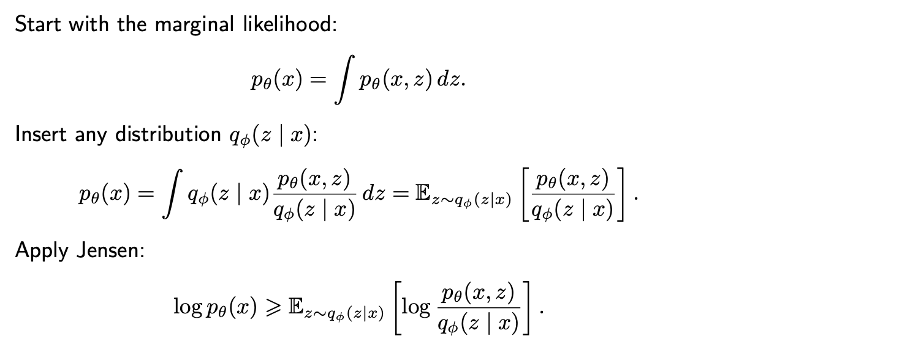

- 또한, $L(x;\theta,\phi) = \mathbb{E}_{z \sim q_{\phi}(z\mid x)} \bigl[\log p_{\theta}(x\mid z)\bigr] - D_{\mathrm{KL}}
  \!\left(q_{\phi}(z\mid x) \,\|\,  p(z) \right)$  임을 보일 수 있다. 

  - $\begin{aligned}
    L(x_i;\theta,\phi)
    &=
    \mathbb{E}_{z\sim q_\phi(z\mid x_i)}
    \!\left[
    \log
    \frac{p_\theta(x_i,z)}
    {q_\phi(z\mid x_i)}
    \right] \\
    &=
    \mathbb{E}_{z\sim q_\phi(z\mid x_i)}
    \!\left[\log p_\theta(x_i,z)\right]
    -
    \mathbb{E}_{z\sim q_\phi(z\mid x_i)}
    \!\left[
    \log
    \frac{q_\phi(z\mid x_i)}
    {p(z)}
    \right] \\
    &=
    \mathbb{E}_{z\sim q_\phi(z\mid x_i)}
    \!\left[\log p_\theta(x_i\mid z)\right]
    -
    D_{\mathrm{KL}}\!\left(q_\phi(z\mid x_i)\,\|\,p(z)\right)
    \end{aligned}$ 

- 또한, $\log p_\theta(x_i)
  =
  L_{\mathrm{ELBO}}(x_i;\theta,\phi)
  +
  D_{\mathrm{KL}}\!\left(q_\phi(z\mid x_i)\,\|\,p_\theta(z\mid x_i)\right)$  임을 보일 수 있다. 

  - $\begin{aligned}
    L(x_i;\theta,\phi)
    +
    D_{\mathrm{KL}}\!\left(q_\phi(z\mid x_i)\,\|\,p_\theta(z\mid x_i)\right)
    &=
    \mathbb{E}_{z\sim q_\phi(z\mid x_i)}
    \!\left[
    \log
    \frac{p_\theta(x_i,z)}
    {q_\phi(z\mid x_i)}
    \right]
    +
    \mathbb{E}_{z\sim q_\phi(z\mid x_i)}
    \!\left[
    \log
    \frac{q_\phi(z\mid x_i)}
    {p_\theta(z\mid x_i)}
    \right] \\
    &=
    \mathbb{E}_{z\sim q_\phi(z\mid x_i)}
    \!\left[
    \log
    \frac{p_\theta(x_i,z)}
    {p_\theta(z\mid x_i)}
    \right] \\
    &=
    \mathbb{E}_{z\sim q_\phi(z\mid x_i)}
    \!\left[\log p_\theta(x_i)\right] \\
    &=
    \log p_\theta(x_i)
    \end{aligned}$

    

- $\sum_i  L (x_i;\theta,\phi) = \sum_i \mathbb{E}_{z \sim q_{\phi}(z\mid x)} \bigl[\log p_{\theta}(x\mid z)\bigr] - D_{\mathrm{KL}} \!\left(q_{\phi}(z\mid x) \,\|\,  p(z) \right) $  를 maximize 하기 위해선, $\sum_i \mathbb{E}_{z \sim q_{\phi}(z\mid x^{(i)})} \bigl[\log p_{\theta}(x^{(i)}\mid z)\bigr]$ (①) 를 maximize, $D_{\mathrm{KL}} \!\left(q_{\phi}(z\mid x) \,\|\,  p(z) \right)$ (②) 를 minimize 해야 한다. 

- ① 의 각 term은 $x$에 대한 함수이며 계산하는 과정은 다음과 같다.
  - sample $x$ from train data
  - push $x$ to encoder
  - sample $z$ from encoder
  - Pass $z$ to decoder
  - evaluate the log prob of real data $x$ under decoding distribution

- 다변량 정규분포의 pdf 공식에 의해, $\log p_{\theta}(x_i \mid z) = -\frac{1}{2\sigma^2} \|x_i-g_{\theta}(z)\|^2 + C$ 이므로 ①을 maximizing 하는 것은 각 term을 maximizing 하는 것이고, 이는 곧 sample latent $z$로 부터 원래 $x$를 잘 복원하도록 $\theta, \phi$ 를 학습시키는 것을 의미한다. 즉, good reconstruction을 강제한다.

- ② 을 minimize 하는 것은 $q_{\phi}(z\mid x)$ 가, $p(z) \sim N(0,I)$ 처럼, 우리가 설정한 분포와 유사해지도록 $\phi$를 학습하는 것을 의미한다.

① 을 계산하는 데에는 $z$ 를 sampling 해야한다. 이 과정을 Monte Carlo Estimation이라 한다 (확률적 샘플링으로 적분을 근사하는 모든 방법). 즉 각 dataset $x^{(i)}$ 에 대해 $q_\phi(z \mid x^{(i)})$ 에서 $L$ 번 sampling 하여 target 값을 평균 낸 것으로 $E$ 를 근사한다. $\mathbb{E}_{q_\phi(z \mid x^{(i)})}[\log p_\theta(x^{(i)} \mid z)]
\approx
\frac{1}{L}\sum_{\ell=1}^{L}\log p_\theta(x^{(i)} \mid z^{(\ell)}),
\quad
z^{(\ell)} \sim q_\phi(z \mid x^{(i)})$  주로 $L=1$ 을 쓴다.

반면, ② 을 계산하는 데에는 sampling이 필요없다. 2개의 $k$ 차원 정규분포  $p_0, p_1$ 에 대해 divergence 값은 다음과 같다. 

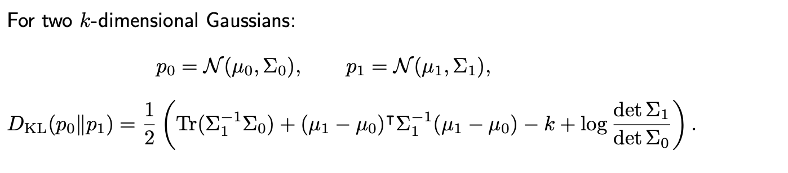

여기서 $p_1 = p(z) = N(0, I)$ , $p_0 = q_{\phi}(z \mid x^{(i)}) = N(\mu_\phi (x^{(i)}), diag(\sigma^2_\phi (x^{(i)})))$ 로 두면, $D_{\mathrm{KL}}\!\left(q_{\phi}(z\mid x^{(i)})\,\|\,p(z)\right) 
=
\frac{1}{2}
\sum_{j=1}^{k}
\left(
\mu_j(x^{(i)})^2
+
\sigma_j(x^{(i)})^2
-
1
-
\log \sigma_j(x^{(i)})^2
\right)$ 이고 따라서, (②) = $\sum_i \frac{1}{2}
\sum_{j=1}^{k}
\left(
\mu_j(x_i)^2
+
\sigma_j(x_i)^2
-
1
-
\log \sigma_j(x_i)^2
\right)$ 으로 closed form으로 계산된다.

📝 **KL Divergence**

KL Divegence에 대해서는 밑에 더 자세히 다루겠지만 우선, 정의와 기본적인 성질을 알아보자. 정의는 다음과 같다.

- $p, q$ 가 이산형 확률분포일 때 : $ D_{{KL}}(p\|q) = \sum_{x\in\mathcal{X}} p(x)\log\frac{p(x)}{q(x)} = \mathbb{E}_{X\sim p} \!\left[ \log\frac{p(X)}{q(X)} \right]$
- $p, q$ 가 연속형 확률분포일 때 : $D_{KL}(p\|q) = \int p(x)\log\frac{p(x)}{q(x)}\,dx = \mathbb{E}_{X\sim p} \!\left[ \log\frac{p(X)}{q(X)} \right]$ 
- 분포 $p$를 근사하는데 $q$를 사용했을 때 손실되는 정보량을 의미한다.

주요 성질은 다음과 같다. 

- $D_{\mathrm{KL}}(p\|q)\ge 0$ (㉣)
- $D_{\mathrm{KL}}(p\|q)= 0\iff p = q \ \ \ a.e.$ 
- $D_{\mathrm{KL}}(p\|q)\neq D_{\mathrm{KL}}(q\|p)$ (It is not a distance)
- $D_{\mathrm{KL}}(p\|q) < \infty \iff supp(p) \subseteq supp(q)$ ($supp$ 은 확률이 0보다 큰 영역을 의미한다.

㉣ 은 아래와 같이 젠센 부등식을 이용하여 증명할 수 있다. 

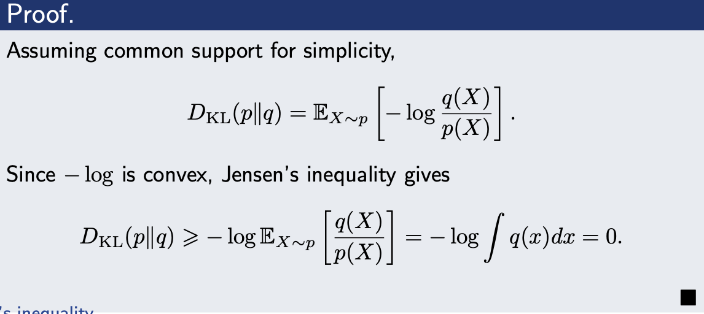

이렇게 VAE 학습이 끝나면, 데이터 $x$ 들에 대해, $q_\phi(z \mid x)$ 은 $N(0, I)$를 유사하게 따를 것이다. 따라서, 이미지 생성 과정에서는, 우리가 아는 분포 $z \sim N(0,1)$ 를 sampling 한 다음, $p_{\theta}(x \mid z)$ 에서 sampling 하여 최종 이미지를 만들어 낸다. 

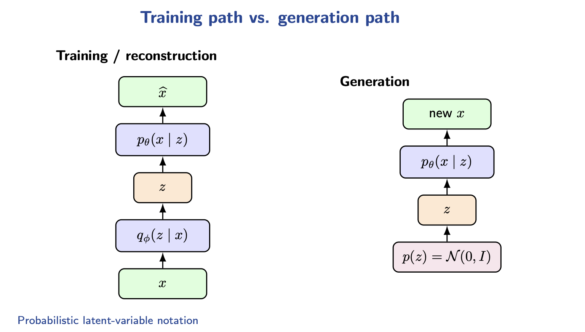

**Encoder Parameterization**

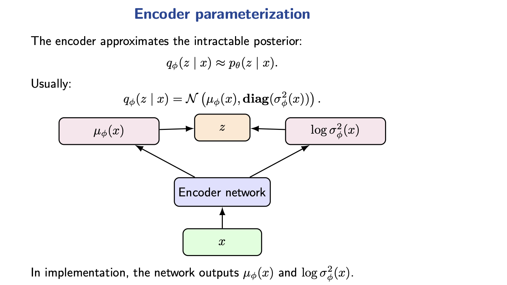

**Decoder Parameterization**

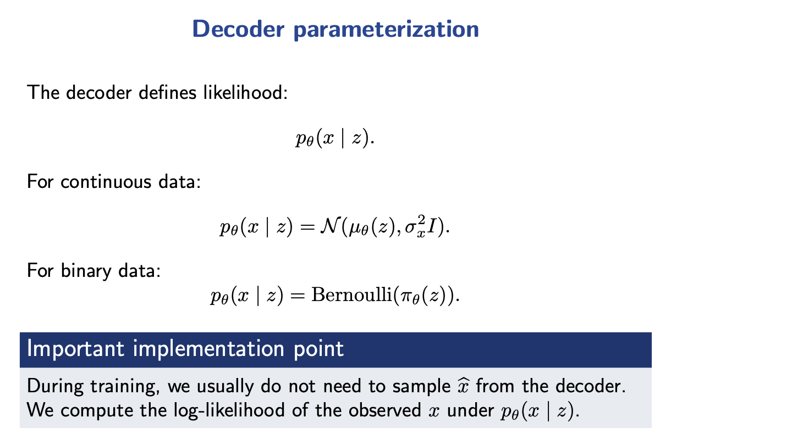

**Reparameterization trick**

loss를 계산할 때, $q_\phi(z \mid x^{(i)})$ 에서 $z$ 를 sampling 하는 layer의 연산은 parameter $\phi$ 에 대해 미분 불가능하다. 따라서, backprop을 할 수 없다는 문제가 생긴다. 따라서 아래와 같은 reparameterization trick을 이용한다.

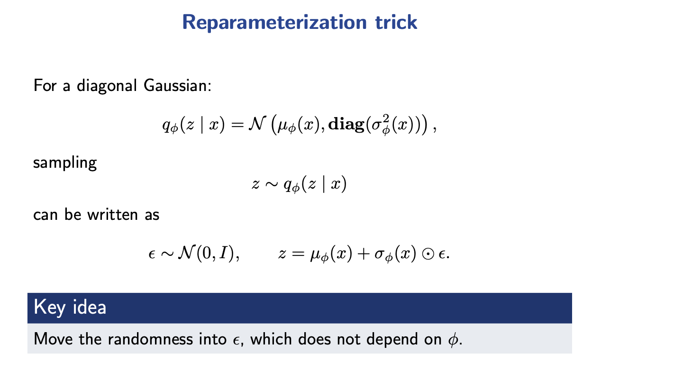

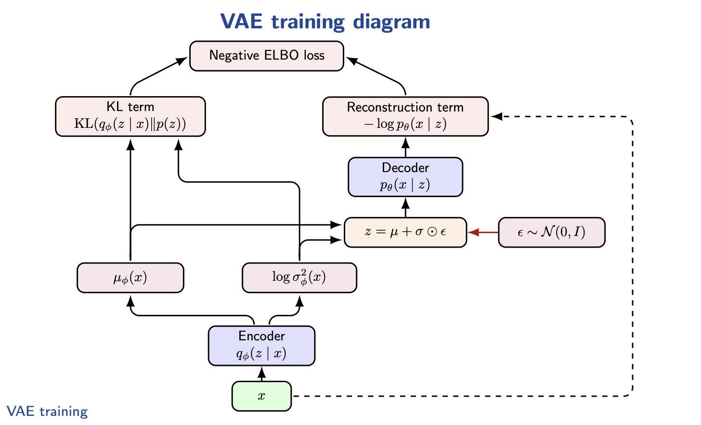

# AE

// ToDo

## Autoregressive models

위에서 다룬 VAE와 앞으로 다룰 Autoregressive model, GAN을 비교하면 아래와 같다.

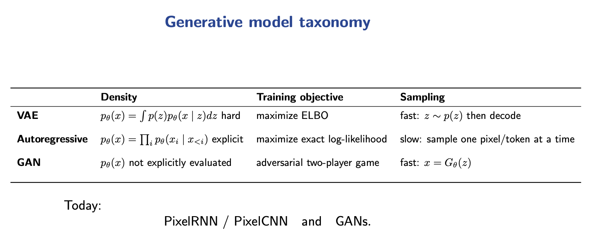

//ToDo

## Generative adversarial networks

//ToDo

## Diffusion Models - DDPM

Diffusion Model에서 무엇을 알고, 무엇을 원하고, 무엇을 모르고, 무엇을 가정하는지를 정리하면 다음과 같다.

- $q(x_0)$는 clean한 cat 이미지들의 확률분포 (확률밀도함수)이다. 우리가 알고 싶은 것은 $q(x_0)$ 이다. $q(x_0)$를 정확히 안다면, 이 분포에서 sampling 하여 이미지를 생성할 수 있다.

- clean 이미지에서 매 step 마다 우리가 정한 규칙으로 Gaussian noise를 추가한다. 즉, 우리는 $q(x_t \mid x_{t-1})$ 을 정확히 안다. (①)

- 만약, 우리가 $q(x_{t-1} \mid x_t)$ 를 정확히 안다고 가정해보자. Markov 가정(정방향 가정) 을 하면, $q(x_{0:T})
  =
  q(x_T)
  \prod_{t=1}^{T}
  q(x_{t-1}\mid x_t)$ 이다.(②) 이 때, $q({x_T}) = N(0, I)$ 이므로,  $q(x_{0:T})$를 closed form으로 정확히 구할 수 있는 것이다. 이를 $q_1, ..., q_T$에 대해 적분하면 $q(x_0)$ 를 정확히 알 수 있는 것이다. 

- 그러나, 애초에 $q(x_{t-1} \mid x_t) = \frac{q(x_t\mid x_{t-1})\,q(x_{t-1})}{q(x_t)}$ 에서 $q(x_{t-1}), q(x_t)$를 알지 못하기 때문에 위 내용의 가정이 성립할 수 없는 것이다.

-  $q(x_{t-1} \mid x_t)$ 은 구할 수 없지만, $\tilde{\beta}_t
  =
  \frac{1-\bar{\alpha}_{t-1}}
       {1-\bar{\alpha}_t}
  \,\beta_t$, $\tilde{\mu}_t(x_t,x_0)
  =
  \frac{\sqrt{\bar{\alpha}_{t-1}}\beta_t}
       {1-\bar{\alpha}_t}
  \,x_0
  +
  \frac{\sqrt{\alpha_t}(1-\bar{\alpha}_{t-1})}
       {1-\bar{\alpha}_t}
  \,x_t$ 에 대해, $q(x_{t-1}\mid x_t,x_0)=\mathcal{N}\!\left(\tilde{\mu}_t(x_t, x_0),\tilde{\beta}_t I\right)$ 로써, closed form으로 구할 수 있다. (③)

- $q(x_{t-1}\mid x_t,x_0)$ 의 분포 평균에는 $x_0$가 쓰이지만 데이터 생성 과정에서는 $x_0$를 알 수 없으므로, neural network를 이용하여 $q(x_{t-1}\mid x_t,x_0)$ 를  $p_\theta(x_{t-1}\mid x_t)
  =
  \mathcal{N}\!\left(
  \mu_\theta(x_t,t),
  \Sigma_\theta(x_t,t)
  \right)$ 로 근사한다.(㉠) 그러면 Markov 가정을 하면, $p_\theta(x_{0:T})=p(x_T)\prod_{t=1}^{T} p_\theta(x_{t-1}\mid x_t)$ 이므로 적분하면 $p_\theta(x_0)$를 알 수 있지만 실제로는 몬테카를로 방법을 이용하여 $x_T \sim N(0, I)$ 에서 sampling → $x_{T-1} \sim p_\theta(x_{T-1} \mid x_T)$ 에서 sampling → ... → $x_0$ sampling 하여 새로운 이미지를 generation 하게 된다. (④) 즉 생성 알고리즘은 (밑에 사진 적기) 에서 샘플링 하는 것이다. 결국 $p_\theta(x_0)$ 에서 샘플링하는 것이다.

  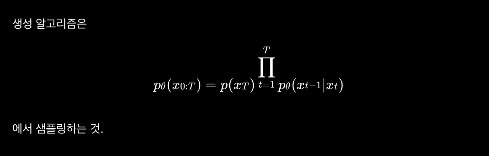

- 어떻게 근사할까. Neural Network를 학습하기 위해선 training set과 label이 있어야 한다. Neural Network는 $x_0$로부터 $x_t$를 construct 할때, 사용한 $\epsilon$을 $\epsilon_\theta(x_t, t)$ 로 예측하고 그 loss로부터 학습한다. 그럼 $\hat{x}_0
  =
  \frac{x_t-\sqrt{1-\bar{\alpha}_t}\,\epsilon_\theta(x_t,t)}
  {\sqrt{\bar{\alpha}_t}}$가 나온다. 그럼, $\mu_\theta(x_t,t)
  =
  \tilde{\mu}_t(x_t,\hat{x}_0)= \mu_\theta(x_t,t)
  =
  \frac{1}{\sqrt{\alpha_t}}
  \left(
  x_t
  -
  \frac{\beta_t}{\sqrt{1-\bar{\alpha}_t}}
  \,\epsilon_\theta(x_t,t)
  \right)$ 라 정의할 수 있다. 이렇게 되면, $p_\theta(x_{t-1}\mid x_t)$ 은 $q(x_{t-1}\mid x_t,x_0)$ 을 근사한 것이지만 거기에는 $x_t$ (와 $t$) 만이 이용되었기 때문에 $p_\theta(x_{t-1}\mid x_t)$ notation을 쓸 수가 있는 것이다. (이것이 가능한 이유는 $x_t$를 통해 $x_0$, 동치로는 $\epsilon$을 추정했기 때문이다.) (⑤)

- ❓모델이 거의 완벽하게 학습을 해내면, 학습한 $p_\theta(x_{t-1}\mid x_t)$ 은 결국 $q(x_{t-1}\mid x_t,x_0)$ 인 의미이지, $q(x_{t-1}\mid x_t)$ 의 의미가 아닌데, $x_T \sim N(0, I)$ 에서 sampling → $x_{T-1} \sim p_\theta(x_{T-1} \mid x_T)$ 에서 sampling → ... → $x_0$ sampling 한다고 해서, 그 sampling 확률이 $q(x_0)$ 이라는 보장이 어디있나? (⑥) (즉, 근본적으로 학습이 가능한 이유가 무엇인가?)

이제 각 부분을 조금 더 자세히 알아보자. 

① ) Adding Gaussian Noise

Diffusion model 에서는 clean data $x_0$ 에 대해, $q(x_t \mid x_{t-1})
=
\mathcal{N}
\!\left(
\sqrt{1-\beta_t}\,x_{t-1},
\beta_t I
\right)$  분포를 따르도록, $x_1$, $x_2$, ... $x_T$ 을 생성한다. $\alpha_t = 1 - \beta_t, \ \bar{\alpha}_t=\prod_{s=1}^{t} \alpha_s$ 라 쓰면, $q(x_t \mid x_{t-1})
=
\mathcal{N}
\!\left(
x_t;
\sqrt{\alpha_t}\,x_{t-1},
(1-\alpha_t)I
\right)$ 로 쓸 수 있다. 이 때 다음 성질이 만족함을 보일 수 있다. 

- $q(x_t \mid x_0)
  =
  \mathcal{N}
  \!\left(
  \sqrt{\bar{\alpha}_t}\,x_0,
  (1-\bar{\alpha}_t)I
  \right)$  (❗️**증명 CHECK**)

위 성질을 이용하면, 임의의 step $t$에 대해 $x_t$를 $x_0$로부터 바로 얻을 수 있음을 알 수 있다. 

- $x_t
  =
  \sqrt{\bar{\alpha}_t}\,x_0
  +
  \sqrt{1-\bar{\alpha}_t}\,\epsilon,
  \epsilon \sim \mathcal{N}(0,I)$ (㉡)

② ) Property of $q, p$

$q$ 는 noise 생성 과정에서 Markov 성질을 만족하도록 설계되었고, denoising 과정 $p$ 에 대해 우리는 **Markov** 가정을 한다. Markov 가정이란, 미래를 예측할 때 현재 상태만 알면 충분하고, 그 이전 과거는 필요 없다는 것이다. 수식적으로는, $p(x_t \mid x_{t-1}, x_{t-2}, \ldots, x_0)
=
p(x_t \mid x_{t-1})$ 을 의미한다.(이 식은 markov 가정에 대한 일반적인 식이고 이 경우에는 반대방향으로 적용하므로 $p_\theta\!\left(x_{t-1}\mid x_t,x_{t+1},\ldots,x_T\right)
=
p_\theta\!\left(x_{t-1}\mid x_t\right)$ 가 성립한다.) 이를 이용하면 아래 두 식이 성립함을 알 수 있다. (㉢)

- $p_\theta(x_{0:T})=p(x_T)\prod_{t=1}^{T} p_\theta(x_{t-1}\mid x_t)$  
- $q(x_{1:T}\mid x_0)
  =
  \prod_{t=1}^{T} q(x_t\mid x_{t-1})$ 

여기서 B 가정에 대해 잠시 알아보자. 

- $p_\theta(x_{0:T})
  =
  p(x_T)\prod_{t=1}^{T} p_\theta(x_{t-1}\mid x_t)$ (Markov 가정)
- $p_\theta(x_{t-1}\mid x_t)
  =
  \mathcal{N}\!\left(
  \mu_\theta(x_t,t),
  \Sigma_\theta(x_t,t)
  \right)$ (Gaussian 가정) (이 가정은 증명할 수 있다.)

그런데, denoising 과정과 noise prediction 은 같은 것이다. 식 ㉡ $x_t
=
\sqrt{\bar{\alpha}_t}\,x_0
+
\sqrt{1-\bar{\alpha}_t}\,\epsilon,
\epsilon \sim \mathcal{N}(0,I)$ 에서, model이 $x_t$ 와 $t$를 받아 $\epsilon$ 을 예측하는 noise prediction을 생각하자. 즉, $\epsilon_{\theta}(x_t, t) \approx \epsilon$ 이다. 이렇게 예측한 noise를 바탕으로, ㉡을 이용하면 clean image $x_0$를 다음식으로 추정할 수 있으므로, 곧 denosing이 된다. 

- $\hat{x}_0
  =
  \frac{
  x_t
  -
  \sqrt{1-\bar{\alpha}_t}\,
  \epsilon_\theta(x_t,t)
  }{
  \sqrt{\bar{\alpha}_t}
  }$ 

③ ) Property of $q$ 

- $q(x_{t-1}\mid x_t,x_0)
  =
  \frac{q(x_t\mid x_{t-1},x_0)\,q(x_{t-1}\mid x_0)}
       {q(x_t\mid x_0)}$ 인데, Markov 성질에 의해 $q(x_t\mid x_{t-1},x_0)
  =q(x_t\mid x_{t-1})$ 가 성립하므로, $q(x_{t-1}\mid x_t,x_0)
  \propto
  q(x_t\mid x_{t-1})\,q(x_{t-1}\mid x_0)$ 가 성립한다. ($x_{t-1}$ 에 대한 함수이므로 분모는 상수 취급 가능)
- 그런데 오른쪽은 Gaussian X Gaussian 이다. Guassian 밀도함수를 곱하면 결과도 Gaussian이다.  $q(x_{t-1}\mid x_t,x_0)=\mathcal{N}\!\left(\tilde{\mu}_t(x_t, x_0),\tilde{\beta}_t I\right)$ 이다. 
- 이때, $\tilde{\beta}_t
  =
  \frac{1-\bar{\alpha}_{t-1}}
       {1-\bar{\alpha}_t}
  \,\beta_t$, $\tilde{\mu}_t(x_t,x_0)
  =
  \frac{\sqrt{\bar{\alpha}_{t-1}}\beta_t}
       {1-\bar{\alpha}_t}
  \,x_0
  +
  \frac{\sqrt{\alpha_t}(1-\bar{\alpha}_{t-1})}
       {1-\bar{\alpha}_t}
  \,x_t$ 이다. (❗️**CHECK**)

④ ) Generation Process

- $p_\theta(x_{t-1}\mid x_t)
  =
  \mathcal{N}\!\left(
  \mu_\theta(x_t,t),
  \sigma^2_tI
  \right)$  를 가정한다. ㉠ 가정을 쓴 것인데, 분산을 더 간단히 가정한 것이다. $\sigma^2_t$ 는 고정된다.
- generation시에 $x_{t-1} = \mu_{\theta}(x_t, t) + \sigma_t z, \quad z \sim \mathcal{N}(0, I)$ 이 성립하므로, 여기서 sampling 한다.

⑤ ) Training Process

1. $x_0 \sim q(x_0), \qquad
   t \sim \mathrm{Uniform}(\{1,\ldots,T\}), \qquad
   \epsilon \sim \mathcal{N}(0,I)$  에서 sampling 한다.

- $q(x_0)$ 는 real world에 있는 cat img $x_0$의 분포를 뜻하고(학습 데이터의 분포와 유사), $p_\theta(x_0)$ 는 모델이 cat img를 생성했을 때 $x_0$ 가 나올 확률을 의미한다.(즉, 모델이 학습한 분포)

2. $x_t
   =
   \sqrt{\bar{\alpha}_t}\,x_0
   +
   \sqrt{1-\bar{\alpha}_t}\,\epsilon$ 을 construct 한다.

- $t$ step의 noise image를 생성하는 과정이다.

3. $\mathcal{L}_{\mathrm{simple}}
   =
   \mathbb{E}_{x_0,t,\epsilon}
   \left[
   \left\|
   \epsilon-\epsilon_\theta(x_t,t)
   \right\|_2^2
   \right]$ 을 계산한다.

- 실제 학습에서는 이 기댓값을 정확히 계산할 수 없으니까 **Monte Carlo 샘플링**으로 근사한다. 매 iteration 마다 $x_0^{(i)} \sim q(x_0),
  \qquad
  t^{(i)} \sim \mathrm{Uniform}(\{1,\ldots,T\}),
  \qquad
  \epsilon^{(i)} \sim \mathcal{N}(0,I)$ 를 뽑고, $\ell^{(i)}
  =
  \left\|
  \epsilon^{(i)}-
  \epsilon_\theta\!\left(x_t^{(i)}, t^{(i)}\right)
  \right\|_2^2$  을 계산한다. 배치 크기가 $B$ 이면, $\hat{\mathcal{L}}_{\mathrm{simple}}
  =\frac{1}{B}
  \sum_{i=1}^{B}
  \left\|
  \epsilon^{(i)}-
  \epsilon_\theta\!\left(x_t^{(i)}, t^{(i)}\right)
  \right\|_2^2$ 을 loss로 사용한다. 

⑥ ) 의문에 대한 답

$p_\theta(x_0)
=
\int p_\theta(x_{0:T}) \, dx_{1:T} 
=
\int
q(x_{1:T}\mid x_0)
\,
\frac{p_\theta(x_{0:T})}
{q(x_{1:T}\mid x_0)}
\, dx_{1:T}$ 이 성립한다. (조건부 확률의 성질) 이는 기댓값의 정의에 의해, $p_\theta(x_0)
=
\mathbb{E}_{q(x_{1:T}\mid x_0)}
\left[
\frac{p_\theta(x_{0:T})}
{q(x_{1:T}\mid x_0)}
\right]$ 이다. 따라서, $-\log p_\theta(x_0)
=
-\log
\mathbb{E}_{q(x_{1:T}\mid x_0)}
\left[
\frac{p_\theta(x_{0:T})}
{q(x_{1:T}\mid x_0)}
\right]$ 이다. 여기에 젠센 부등식을 적용하면, $-\log p_\theta(x_0)
\le
\mathbb{E}_{q(x_{1:T}\mid x_0)}
\left[
-\log
\frac{p_\theta(x_{0:T})}
{q(x_{1:T}\mid x_0)}
\right]$ 이다.

- 이제 양변에 대해 실제 데이터 분포 $q(x_0)$ 로 평균을 취하면 $\mathbb{E}_{x_0 \sim q}
  \bigl[-\log p_\theta(x_0)\bigr]
  \le
  \mathbb{E}_{x_0 \sim q}
  \left[
  \mathbb{E}_{q(x_{1:T}\mid x_0)}
  \left[
  -\log
  \frac{p_\theta(x_{0:T})}
  {q(x_{1:T}\mid x_0)}
  \right]
  \right]$  이다.
- $\mathbb{E}\mathbb{E}f(X)\mid Y = \mathbb{E}f(X)$ 를 $X= X_{0:T}$, $Y=X_0$ 에 적용하면, $\mathbb{E}_{x_0 \sim q}
  \left[
  -\log p_\theta(x_0)
  \right]
  \le
  \mathbb{E}_{x_{0:T} \sim q}
  \left[
  -\log
  \frac{p_\theta(x_{0:T})}
  {q(x_{1:T}\mid x_0)}
  \right]$ 임을 보일 수 있다. (㉣)

㉢ 에 의해, $-\log\frac{p_\theta(x_{0:T})}{q(x_{1:T}\mid x_0)}
=
-\log p(x_T)
-\sum_{t=1}^{T}\log p_\theta(x_{t-1}\mid x_t)
+\sum_{t=1}^{T}\log q(x_t\mid x_{t-1})$ 가 $t \ge 2$ 에서 성립함을 보일 수 있다. (㉤)

또한, 베이즈 정리와, Markov property를 이용하면 다음을 보일 수 있다. 

- $q(x_t \mid x_{t-1})
  =
  \frac{
  q(x_{t-1} \mid x_t, x_0)\, q(x_t \mid x_0)
  }{
  q(x_{t-1} \mid x_0)
  }$  

이를 ㉤에 대입하면, $-\log \frac{p_\theta(x_{0:T})}{q(x_{1:T}\mid x_0)}
=
-\log \frac{p(x_T)}{q(x_T\mid x_0)}
-\sum_{t=2}^{T}
\log
\frac{
p_\theta(x_{t-1}\mid x_t)
}{
q(x_{t-1}\mid x_t,x_0)
}
-\log p_\theta(x_0\mid x_1)$ 이다.

이를 ㉣에 대입하면, $\mathbb{E}_{x_0 \sim q}
\left[
-\log p_\theta(x_0)
\right]
\le
\mathbb{E}_{x_{0:T} \sim q}
\left[
-\log \frac{p(x_T)}{q(x_T\mid x_0)}
-\sum_{t=2}^{T}
\log
\frac{
p_\theta(x_{t-1}\mid x_t)
}{
q(x_{t-1}\mid x_t,x_0)
}
-\log p_\theta(x_0\mid x_1)
\right]$ 이다. 우변의 세 개의 항의 기댓값을 각각 구해보자. 

- $\mathbb{E}_{x_{0:T} \sim q} \left[-\log \frac{p(x_T)}{q(x_T\mid x_0)} \right] = \mathbb{E}_{q({x_0, x_T)}} \left[-\log \frac{p(x_T)}{q(x_T\mid x_0)} \right]= \mathbb{E}_{x_{0} \sim q} \mathbb{E}_{q(x_T\mid x_0)}
  \left[
  -\log
  \frac{p(x_T)}
       {q(x_T\mid x_0)}
  \right]$ 을 보이자. 
  - 첫 번째 등식을 보이자. $\mathbb{E}_{q(x_{0:T})}
    \left[
    -\log \frac{p(x_T)}{q(x_T\mid x_0)}
    \right]= \
    \int q(x_{0:T})
    \left(
    -\log \frac{p(x_T)}{q(x_T\mid x_0)}
    \right)
    dx_{0:T}$ 여기서, $q(x_{0:T})
    =q(x_0)\,q(x_T\mid x_0)\,q(x_{1:T-1}\mid x_0,x_T)$​ 을 대입하면, $\int
    q(x_0)\,q(x_T\mid x_0)
    \left(
    -\log \frac{p(x_T)}{q(x_T\mid x_0)}
    \right)
    \left[
    \int q(x_{1:T-1}\mid x_0,x_T)\,dx_{1:T-1}
    \right]
    dx_0\,dx_T$ 이다. 대괄호 안은 $\int q(x_{1:T-1}\mid x_0,x_T)\,dx_{1:T-1}
    =
    1$ 이므로, $
    =
    \int
    q(x_0)\,q(x_T\mid x_0)
    \left(
    -\log \frac{p(x_T)}{q(x_T\mid x_0)}
    \right)
    dx_0\,dx_T$ 즉, $
    \mathbb{E}_{q(x_{0:T})}
    \left[
    -\log \frac{p(x_T)}{q(x_T\mid x_0)}
    \right]
    =
    \mathbb{E}_{q(x_0,x_T)}
    \left[
    -\log \frac{p(x_T)}{q(x_T\mid x_0)}
    \right]$ 이다. 
  - 두 번째 등식은 기댓값 전체 법칙에 의해 성립한다. 
- 그리고 아래 등식이 성립한다.

$\begin{align}
L_T
&=
\mathrm{KL}\!\left(q(x_T\mid x_0)\,\|\,p(x_T)\right)\\
&=
\mathbb{E}_{x_T\sim q(x_T\mid x_0)}
\left[
\log
\frac{q(x_T\mid x_0)}
     {p(x_T)}
\right]\\
&=
\int q(x_T\mid x_0)
\log
\frac{q(x_T\mid x_0)}
     {p(x_T)}
\,dx_T\\
&=
\int q(x_T\mid x_0)
\left[
\log q(x_T\mid x_0)
-
\log p(x_T)
\right]
dx_T\\
&=
\mathbb{E}_{q(x_T\mid x_0)}
\left[
\log q(x_T\mid x_0)
-
\log p(x_T)
\right]\\
&=
\mathbb{E}_{q(x_T\mid x_0)}
\left[
-\log
\frac{p(x_T)}
     {q(x_T\mid x_0)}
\right].
\end{align}$ 

- 이를 조합하면, $\mathbb{E}_{x_{0:T} \sim q} \left[-\log \frac{p(x_T)}{q(x_T\mid x_0)} \right] = \mathbb{E}_{x_{0} \sim q} \left[ L_T \right]$ 이다. 
- 이와 유사한 방법을 이용하면, $L_{t-1}
  =
  \mathrm{KL}\!\left(
  q(x_{t-1}\mid x_t,x_0)
  \;\|\;
  p_\theta(x_{t-1}\mid x_t)
  \right)$ 라 할때, $\mathbb{E}_{x_{0:T} \sim q}
  \left[
  -\sum_{t=2}^{T}
  \log
  \frac{
  p_\theta(x_{t-1}\mid x_t)
  }{
  q(x_{t-1}\mid x_t,x_0)
  }
  \right] = \mathbb{E}_{x_{0} \sim q} \left[ \sum_{t=2}^{T} L_{t-1} \right]$ 이다.
  - $q(x_{t-1}\mid x_t,x_0)
    =
    \mathcal{N}\!\left(
    x_{t-1};
    \tilde{\mu}_t(x_t,x_0),
    \tilde{\beta}_t I
    \right),
    p_\theta(x_{t-1}\mid x_t)
    =
    \mathcal{N}\!\left(
    x_{t-1};
    \mu_\theta(x_t,t),
    \sigma_t^2 I
    \right)$ 임을 이용하면, $L_{t-1}
    =
    \mathbb{E}\!\left[
    \frac{1}{2\sigma_t^2}
    \left\|
    \tilde{\mu}_t(x_t,x_0)
    -
    \mu_\theta(x_t,t)
    \right\|_2^2
    \right]
    +
    C$​ = $w_t \mathbb{E} \left[\left\|\epsilon -\epsilon_\theta(x_t,t)\right\|_2^2\right]+C$ 이다. simplicity를 위해 $w_t$를 빼고 생각하면, 이는 위에서 보았던 $L_{simple}$ 이다. 
- 이와 유사한 방법을 이용하면, $L_0
  =
  -\log p_\theta(x_0\mid x_1)$ 라 할때, $\mathbb{E}_{x_{0:T} \sim q}
  \left[
  -\log p_\theta(x_0\mid x_1)
  \right] = \mathbb{E}_{x_{0} \sim q} \left[ L_0 \right]$ 이다.

따라서, 최종적으로 $\mathbb{E}_{x_0 \sim q}
\left[
-\log p_\theta(x_0)
\right]
\le \mathbb{E}_{x_{0} \sim q} \left[ L_T +\sum_{t=2}^{T} L_{t-1} +L_0\right]$ 가 성립하며 학습의 과정은 우변을 minimize (특히, 가운데 항) 하는 것임을 알 수 있다. 

완벽하게 학습이 이루어지면 $p_\theta(x_{t-1} \mid x_{t}) \approx q(x_{t-1} \mid x_t, x_0)$ 이고, (학습은 우변을 minimize 하는 과정으로 이해 가능), 따라서, $L_{t-1} = 0$, $L_0 = 0$ 이다. 또한, 학습과 무관하게 $L_T \approx 0$ 이다.   

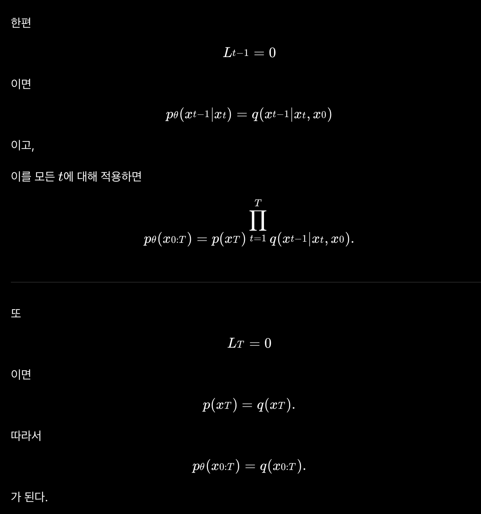

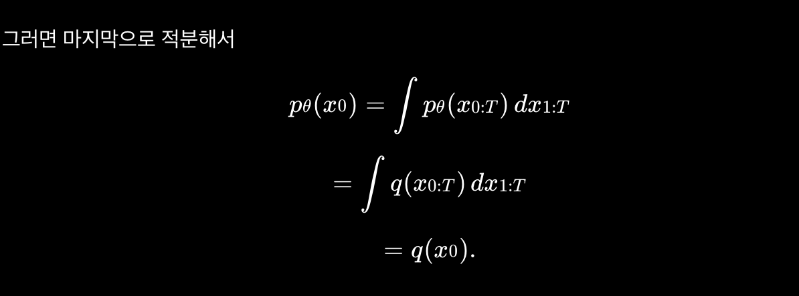

## Difusion Models - Score-Based View and Modern Extensions

//ToDo.

