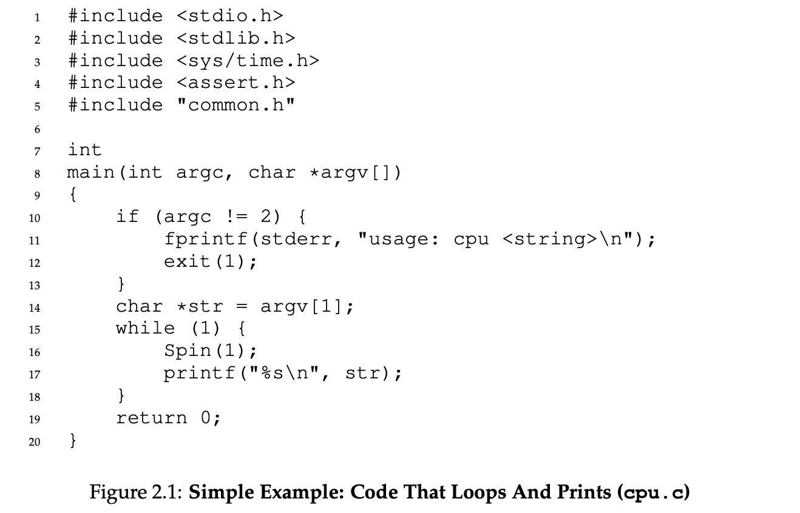
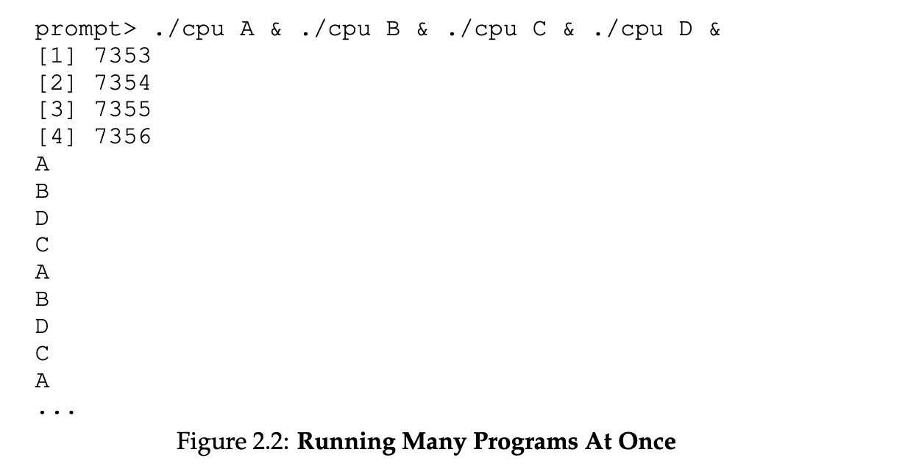
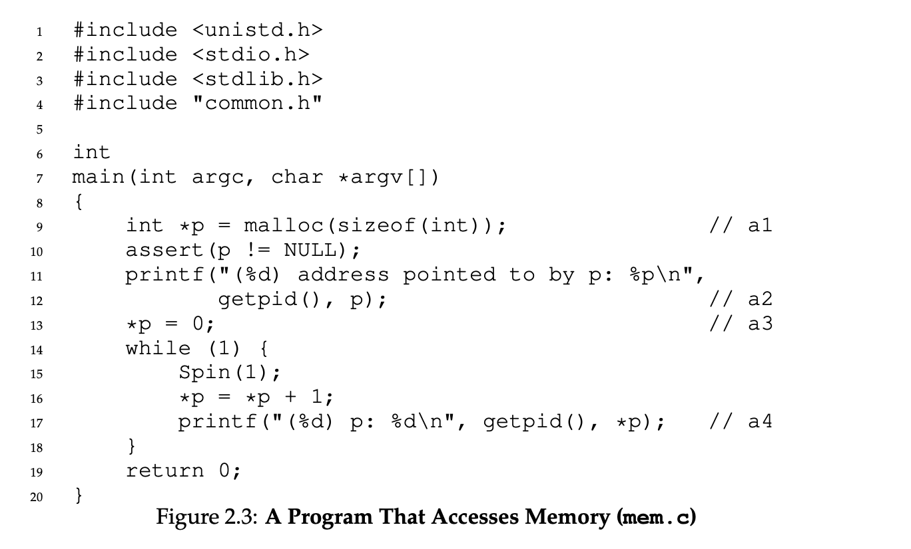
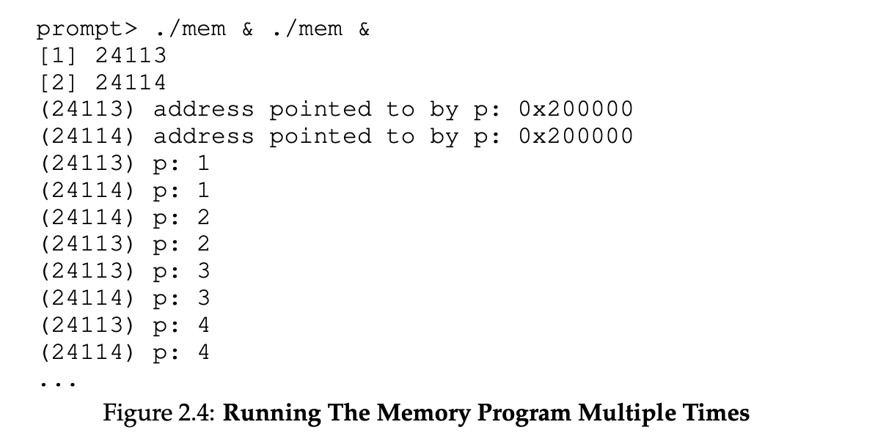
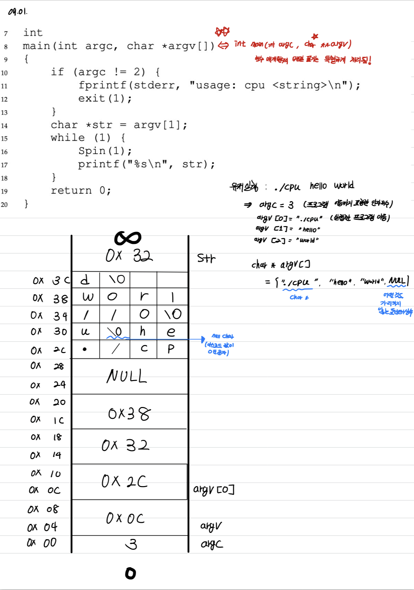
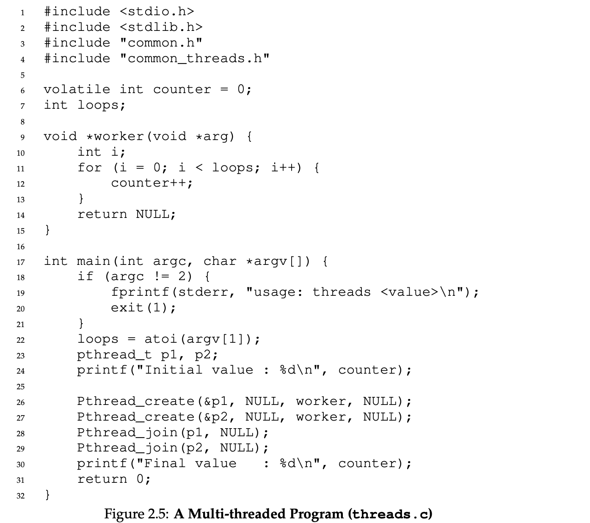
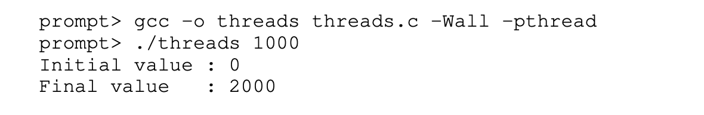
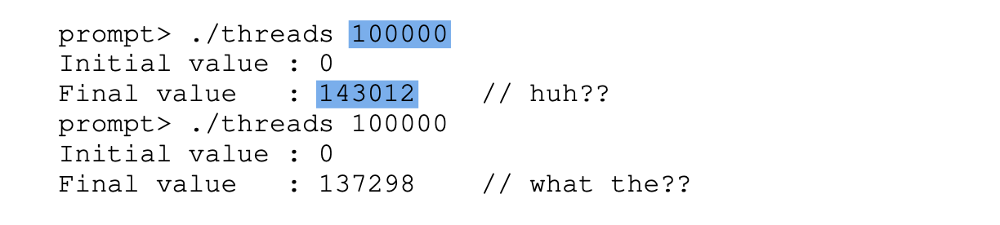
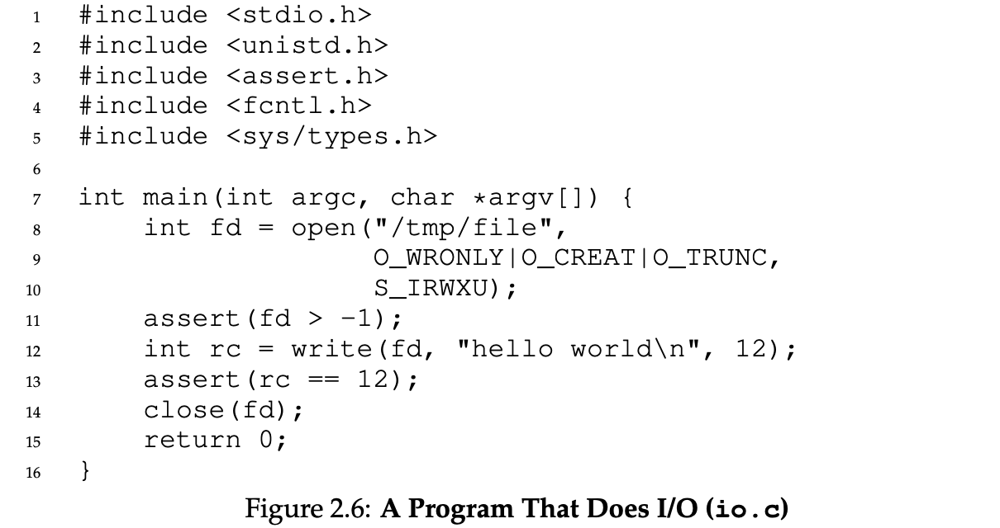
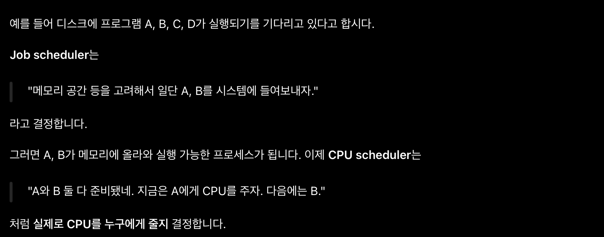

In this post, 1st lecture of operating system is introduced.

(3 Easy Pieces Chapter 1 & SNU Lecutre 1, 2)

# What is OS

OS의 주요 기능은 다음과 같다. 

- **Virtualization** : 컴퓨터 시스템의 여러 resource들을 가상화한다.
  - 컴퓨터 시스템의 resource에는 CPU, memory, Disk가 있다. 이 중 CPU, memory를 가상화한다.
  - 이 과정에서 **resource manager**의 역할도 수행한다. 
  - 유저(응용 어플리케이션)를 위한 인터페이스(API) 역할을 수행한다.
- **Concurrency** : 응용 프로그램이 동시성 문제를 해결할 수 있도록 지원(해야)한다.
- **Protection** : 프로그램이나 사용자가 자원에 함부로 접근하지 못하게 하고, 허용된 범위 안에서만 사용하도록 통제한다. 또한, 파일시스템을 통해 데이터가 영구적으로 저장되도록 관리한다.

# Virtualization

CPU, Memory Virutalization의 개념에 대해 알아보자.

## CPU Virtualization

다음 코드를 보자.

위 프로그램에 대해 여러 프로세스를 실행하면 결과는 아래와 같다. 

- 운영체제는 하드웨어의 도움을 받아, 시스템에 매우 많은 가상 CPU가 있는 것처럼 보이는 효과를 만들어 낸다.
  - 하나의 CPU(또는 소수의 CPU)가 마치 무한히 많은 CPU인 것처럼 보이게 하여, 여러 프로그램이 동시에 실행되는 것처럼 만드는 것을 **CPU 가상화(virtualizing the CPU)** 라고 한다. 이것이 이 책의 첫 번째 주요 부분에서 다룰 주제이다.

- 여러 프로그램을 동시에 실행할 수 있게 되면 온갖 새로운 질문이 생긴다. 예를 들어, 두 프로그램이 특정 시점에 실행되기를 원한다면 어느 프로그램을 실행해야 할까?
  - 이 질문의 답은 운영체제의 **정책(policy)**에 의해 결정된다. 정책은 운영체제의 여러 곳에서 이러한 유형의 질문에 답하기 위해 사용된다. 따라서 우리는 운영체제가 구현하는 기본적인 **메커니즘(mechanism)** - 예를 들어 여러 프로그램을 동시에 실행할 수 있게 하는 기능 - 을 배우면서 정책도 함께 살펴볼 것이다. 이처럼 운영체제는 **자원 관리자(resource manager)** 역할을 한다.

- `printf` 는 C 라이브러리 함수이다. 이 함수는 `write` 라는 또 다른 C 라이브러리의, 시스템 콜 호출 함수를 호출한다. `write` 은 내부 구현상 `syscall` 이라는 instruction을 포함한다. 하드웨어는 syscall 명령어가 fetch되면 커널 모드로 들어가고 커널의 syscall entry 주소로 실행을 넘긴다. 조금 더 자세한 내용은 <a href ="https://arcstone09.github.io/study/2025-11-04-systemprogram-14"> 여기 </a> 참조.
  - 즉, write 같은 시스템 콜 호출 함수는 유저가 OS의 기능을 활용하기 위한 인터페이스(API) 역할을 수행한다.

## Memory Virtualization

다음 프로그램을 여러 프로세스에서 실행한 결과를 보자.

예제에서 실행 중인 각 프로그램은 동일한 주소(`0x200000`)에 메모리를 할당받았지만, 각자 **`0x200000`에 저장된 값을 독립적으로 갱신하는 것처럼 보인다!** 마치 다른 프로그램들과 동일한 물리 메모리를 공유하는 것이 아니라, 각 프로그램이 자신만의 전용 메모리를 갖고 있는 것 같다.

실제로 운영체제가 **메모리를 가상화(virtualizing memory)**하면서 바로 이러한 일이 일어난다. 각 프로세스는 자신만의 **가상 주소 공간(virtual address space)**—간단히 주소 공간이라고도 한다—에 접근하며, 운영체제는 이를 어떤 방식으로든 컴퓨터의 물리 메모리에 대응시킨다. 실행 중인 한 프로그램의 메모리 참조는 다른 프로세스의 주소 공간이나 운영체제 자체에 영향을 주지 않는다. 실행 중인 프로그램의 관점에서는 물리 메모리 전체를 자신이 독점하고 있는 셈이다.

하지만 실제로 물리 메모리는 운영체제가 관리하는 **공유 자원**이다. 이 모든 것이 정확히 어떻게 구현되는지 역시 이 책의 첫 번째 부분인 가상화에서 다룬다.

참고로, 위 프로그램의 메모리 구조는 다음과 같다.

# Concurrency

OS 와 concurry의 관련성은 다음과 같다.

- **OS 자체도 동시성 문제를 해결해야 한다.**
  - OS 안에서도 여러 작업이 진행되면서 같은 자료구조에 접근한다. 예를 들어, 두 작업이 동시에 같은 메모리 영역을 할당하려 하면 문제가 생길 수 있으니 조율해야 한다.

- **응용 프로그램이 동시성 문제를 해결할 수 있도록 지원해야 한다.**
  - 아래의 `counter` 예제가 여기에 해당한다. OS는 스레드 실행과 동기화를 지원하지만, **공유 카운터를 언제 보호해야 하는지 판단하고 올바르게 사용하는 것은 프로그래머의 몫**이다. 하드웨어와 라이브러리도 함께 관여한다.

다음 프로그램을 보자.

메인 프로그램은 `Pthread_create()`를 사용하여 두 개의 스레드를 생성한다. **스레드는 다른 함수들과 동일한 메모리 공간에서 실행되는 함수라고 생각할 수 있으며, 이러한 함수 여러 개가 동시에 실행될 수 있다.** 자세한 내용은 <a href ="https://arcstone09.github.io/study/2025-12-02-systemprogram-20"> 여기 </a> 참조.이 예제에서 각 스레드는 `worker()`라는 루틴을 실행하기 시작한다. 이 루틴은 반복문 안에서 카운터 값을 증가시키는 작업을 `loops`번 수행한다. 

아래는 변수 `loops`의 입력값을 1000으로 설정하여 프로그램을 실행한 결과이다. `loops`의 값은 두 작업 스레드 각각이 반복문에서 공유 카운터를 몇 번 증가시킬지 결정한다. 

아마 예상했듯이, 두 스레드가 실행을 마치면 카운터의 최종 값은 2000이다. 각 스레드가 카운터를 1000번씩 증가시켰기 때문이다. 일반적으로 `loops`의 입력값이 N이면 프로그램의 최종 출력은 2N일 것으로 예상한다. 하지만 실제 상황은 그렇게 단순하지 않다. 같은 프로그램에서 `loops` 값을 더 크게 설정하면 어떤 일이 일어나는지 살펴보자.

입력값으로 100,000을 주었지만, 첫 번째 실행에서 최종 값은 200,000이 아니라 143,012가 나왔다. 두 번째로 실행했을 때도 잘못된 값이 나왔으며, 심지어 이전 실행 결과와도 달랐다. 실제로 `loops` 값을 크게 설정하고 프로그램을 반복해서 실행하다 보면, 가끔은 올바른 답이 나오기도 한다! 도대체 왜 이런 일이 발생할까? 자세한 내용은 <a href ="https://arcstone09.github.io/study/2025-12-04-systemprogram-21"> 여기 </a> 참조.

이처럼 이상한 결과가 나오는 이유는 명령어가 한 번에 하나씩 실행되는 방식과 관련이 있다. 위 프로그램의 핵심 부분인 **공유 카운터를 증가시키는 작업에는 세 개의 명령어가 필요하다.** 하나는 메모리에서 카운터 값을 읽어 레지스터에 적재하는 명령어이고, 다른 하나는 그 값을 증가시키는 명령어이며, 마지막 하나는 그 값을 메모리에 다시 저장하는 명령어이다.

이 세 명령어는 **원자적으로(atomically), 즉 하나의 나눌 수 없는 작업으로 실행되지 않기 때문에** 이상한 일이 발생할 수 있다. 이러한 동시성 문제를 이 책의 두 번째 부분에서 아주 자세히 다룰 것이다.

즉, **올바르게 동작하는 동시성 프로그램을 어떻게 만들 것인가?** 라는 주제에 대해  동일한 메모리 공간에서 여러 스레드가 동시에 실행될 때, 어떻게 올바르게 동작하는 프로그램을 만들 수 있을까? 운영체제는 어떤 기본 연산(primitives)을 제공해야 할까? 하드웨어는 어떤 메커니즘을 제공해야 할까? 그리고 이를 활용해 동시성 문제를 어떻게 해결할 수 있을까? 에 대한 답을 찾을 것이다. 

# Protection

OS는 Protection의 기능을 수행한다. **데이터를 어떻게 영구적으로 저장할 것인가?** 라는 주제에 대해 다음 질문들에 대해 답한다.

파일 시스템은 운영체제에서 영구적 데이터를 관리하는 부분이다. 이를 올바르게 수행하려면 어떤 기법이 필요할까? 높은 성능을 달성하려면 어떤 메커니즘과 정책이 필요할까? 하드웨어와 소프트웨어에 장애가 발생하더라도 신뢰성을 어떻게 보장할 수 있을까?

OS가 CPU와 메모리에 제공하는 추상화와 달리, **OS는 각 애플리케이션에 전용의 가상화된 디스크를 만들어 주지는 않는다.** 오히려 사용자들은 파일에 담긴 정보를 서로 공유하고 싶어 하는 경우가 많다고 가정한다.

예를 들어, C 프로그램을 작성할 때는 먼저 편집기(예: Emacs)를 사용하여 C 파일을 만들고 수정할 수 있다(`emacs -nw main.c`). 작성이 끝나면 컴파일러를 사용하여 소스 코드를 실행 파일로 변환할 수 있다(예: `gcc -o main main.c`). 그런 다음 새로 만든 실행 파일을 실행할 수 있다(예: `./main`).

이 예를 통해 **서로 다른 프로세스 사이에서 파일이 어떻게 공유되는지** 알 수 있다. 먼저 Emacs는 컴파일러의 입력으로 사용될 파일을 만든다. 컴파일러는 그 입력 파일을 사용하여 새로운 실행 파일을 만든다. 이 과정은 여러 단계로 이루어지는데, 자세한 내용은 컴파일러 수업에서 배우게 될 것이다. 마지막으로, 이렇게 만들어진 실행 파일이 실행된다. 이렇게 새로운 프로그램이 탄생한다!

장치에 접근하는 방식과 파일 시스템이 그 장치 위에서 데이터를 영속적으로 관리하는 방식에는 훨씬 더 많은 세부 사항이 있다. 성능상의 이유로 대부분의 파일 시스템은 쓰기 요청들을 더 큰 묶음으로 모아 처리하기 위해 실제 쓰기를 잠시 미룬다.

쓰기 도중 시스템이 중단되는 문제에 대처하기 위해, 대부분의 파일 시스템은 **저널링(journaling)**이나 **쓰기시 복사(copy-on-write)** 같은 복잡한 쓰기 프로토콜을 사용한다. 디스크에 쓰는 순서를 세심하게 조정하여, 일련의 쓰기 작업 도중 장애가 발생하더라도 이후 시스템이 적절한 상태로 복구될 수 있도록 하는 것이다.

또한 자주 수행되는 여러 연산을 효율적으로 처리하기 위해, 파일 시스템은 단순한 리스트부터 복잡한 B-트리까지 다양한 자료구조와 접근 방식을 사용한다. 아직 이 모든 내용이 이해되지 않아도 괜찮다! 이 책의 세 번째 부분인 영속성에서 자세히 다룰 것이다. 먼저 장치와 I/O 전반을 살펴보고, 이어서 디스크, RAID, 파일 시스템을 상세하게 설명한다.

# Goal of the Semester

이제 운영체제(OS)가 실제로 어떤 일을 하는지 어느 정도 알게 되었을 것이다. 운영체제는 CPU, 메모리, 디스크 같은 물리적 자원을 가상화한다. 또한 동시성과 관련된 까다롭고 복잡한 문제를 처리한다. 그리고 파일을 영속적으로 저장하여 장기간 안전하게 보존한다. 이러한 시스템을 만들려면 설계와 구현의 방향을 잡고 필요에 따라 절충할 수 있도록 몇 가지 목표를 염두에 두어야 한다. **적절한 절충점을 찾는 것은 시스템 구축의 핵심이다.**

가장 기본적인 목표 중 하나는 시스템을 편리하고 쉽게 사용할 수 있도록 **추상화(abstraction)**를 제공하는 것이다. 추상화는 컴퓨터 과학에서 우리가 하는 모든 일의 토대다. 추상화 덕분에 큰 프로그램을 작고 이해하기 쉬운 부분들로 나누어 작성할 수 있고, 어셈블리를 생각하지 않고도 C 같은 고급 언어로 프로그램을 작성할 수 있다. 또한 논리 게이트를 생각하지 않고 어셈블리 코드를 작성할 수 있으며, 트랜지스터를 지나치게 신경 쓰지 않고 게이트를 이용해 프로세서를 만들 수 있다. 추상화는 너무나 근본적이어서 때로는 그 중요성을 잊기도 하지만, 이 책에서는 그러지 않을 것이다. 따라서 각 부분에서 오랜 시간에 걸쳐 발전해 온 주요 추상화들을 살펴보며, 운영체제의 구성 요소들을 이해하는 관점을 제공할 것이다.

운영체제를 설계하고 구현할 때의 또 다른 목표는 **높은 성능**을 제공하는 것이다. 달리 말하면, 운영체제로 인해 발생하는 **오버헤드(overhead), 즉 추가적인 부담을 최소화**하는 것이 목표다. 가상화와 사용 편의성은 충분히 가치가 있지만, 그렇다고 어떤 비용이든 감수할 수 있는 것은 아니다. 따라서 과도한 오버헤드 없이 가상화와 그 밖의 운영체제 기능을 제공하도록 노력해야 한다. 이러한 오버헤드는 추가적인 시간 소모(더 많은 명령어 실행), 추가적인 공간 사용(메모리나 디스크) 등 여러 형태로 나타난다. 우리는 가능하다면 이 중 하나 또는 둘 다를 최소화하는 해결책을 찾을 것이다. 하지만 언제나 완벽함을 달성할 수 있는 것은 아니며, 이러한 한계를 인식하고 적절한 경우에는 받아들이는 법도 배우게 될 것이다.

또 다른 목표는 **응용 프로그램 사이의 보호**, 그리고 **운영체제와 응용 프로그램 사이의 보호**를 제공하는 것이다. 여러 프로그램을 동시에 실행할 수 있게 하려면, 한 프로그램의 악의적이거나 우발적인 잘못된 동작이 다른 프로그램에 피해를 주지 않도록 해야 한다. 물론 응용 프로그램이 운영체제 자체를 손상할 수 있어서도 안 된다. 그렇게 되면 시스템에서 실행 중인 모든 프로그램이 영향을 받기 때문이다. Protection은 운영체제의 주요 기본 원칙 중 하나인 **격리(isolation)**의 핵심에 있다. 프로세스를 서로 격리하는 것은 보호의 핵심이며, 따라서 운영체제가 수행해야 하는 많은 일의 바탕이 된다.

운영체제는 중단 없이 계속 동작해야 한다. 운영체제가 실패하면 시스템에서 실행 중인 모든 응용 프로그램도 함께 실패한다. 이러한 의존 관계 때문에 운영체제는 높은 수준의 **신뢰성(reliability)**을 제공하고자 한다. 운영체제가 점점 복잡해지고 때로는 수백만 줄의 코드를 포함하게 되면서, 신뢰할 수 있는 운영체제를 만드는 일은 상당한 도전이 되었다. 실제로 이 분야에서 진행 중인 많은 연구는 저자들의 일부 연구[BS+09, SS+10]를 포함하여 바로 이 문제에 초점을 맞추고 있다.

그 밖에도 고려할 만한 목표들이 있다. 환경을 점점 더 중시하는 세상에서는 **에너지 효율성**이 중요하다. 특히 오늘날처럼 네트워크로 긴밀하게 연결된 환경에서는 악성 응용 프로그램에 대응하는 **보안**이 매우 중요하다. 사실 보안은 보호를 확장한 개념이라고 할 수 있다. 또한 운영체제가 점점 더 작은 기기에서 실행됨에 따라 **이동성(mobility)**도 점점 중요해지고 있다. 시스템의 용도에 따라 운영체제의 목표가 달라지므로, 구현 방식 역시 적어도 조금씩은 달라질 것이다. 하지만 앞으로 살펴보겠듯이, 이 책에서 제시하는 운영체제 구축 원칙 중 상당수는 다양한 기기에서 유용하게 적용된다.

# Lecture 1, 2

|             | Job Scheduling                     | CPU Scheduling                                    |
| ----------- | ---------------------------------- | ------------------------------------------------- |
| 다른 이름   | **Long-term scheduling**           | **Short-term scheduling**                         |
| 결정하는 것 | 어떤 **job을 메모리에 올릴지**     | 메모리에 있는 프로세스 중 **누구에게 CPU를 줄지** |
| 대상        | 디스크 등에 대기 중인 job          | Ready Queue의 프로세스                            |
| 실행 빈도   | 비교적 드물게                      | 매우 자주                                         |
| 핵심 목적   | 시스템에 들어오는 프로세스 수 조절 | CPU를 효율적으로 분배                             |

