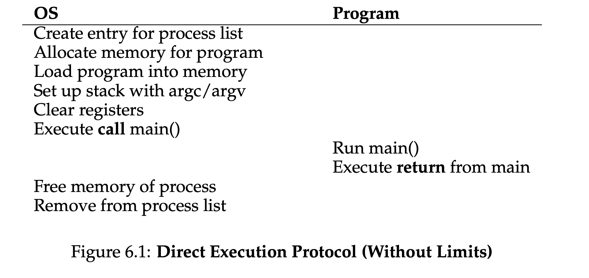
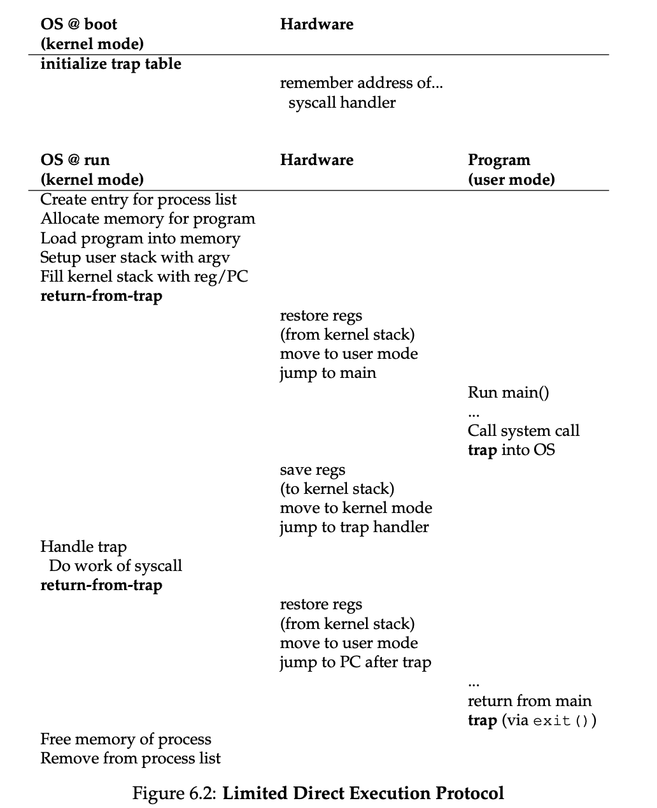
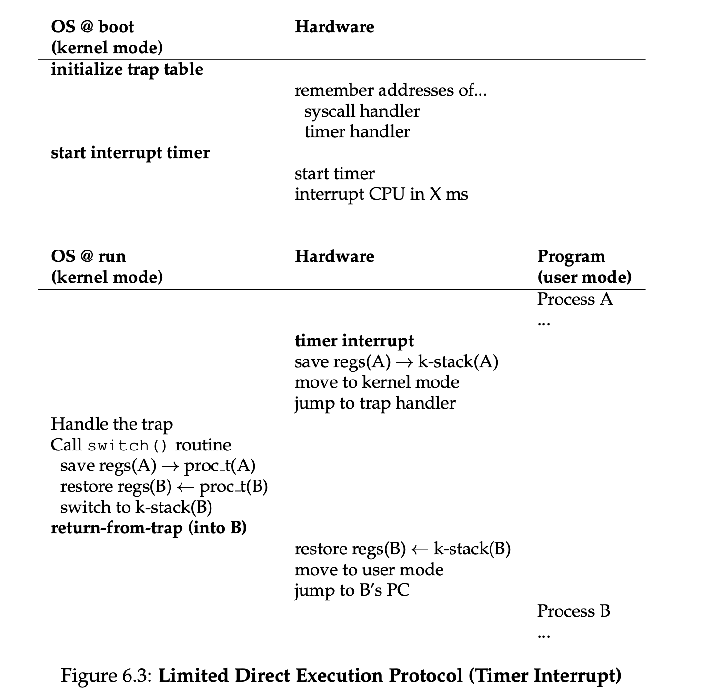
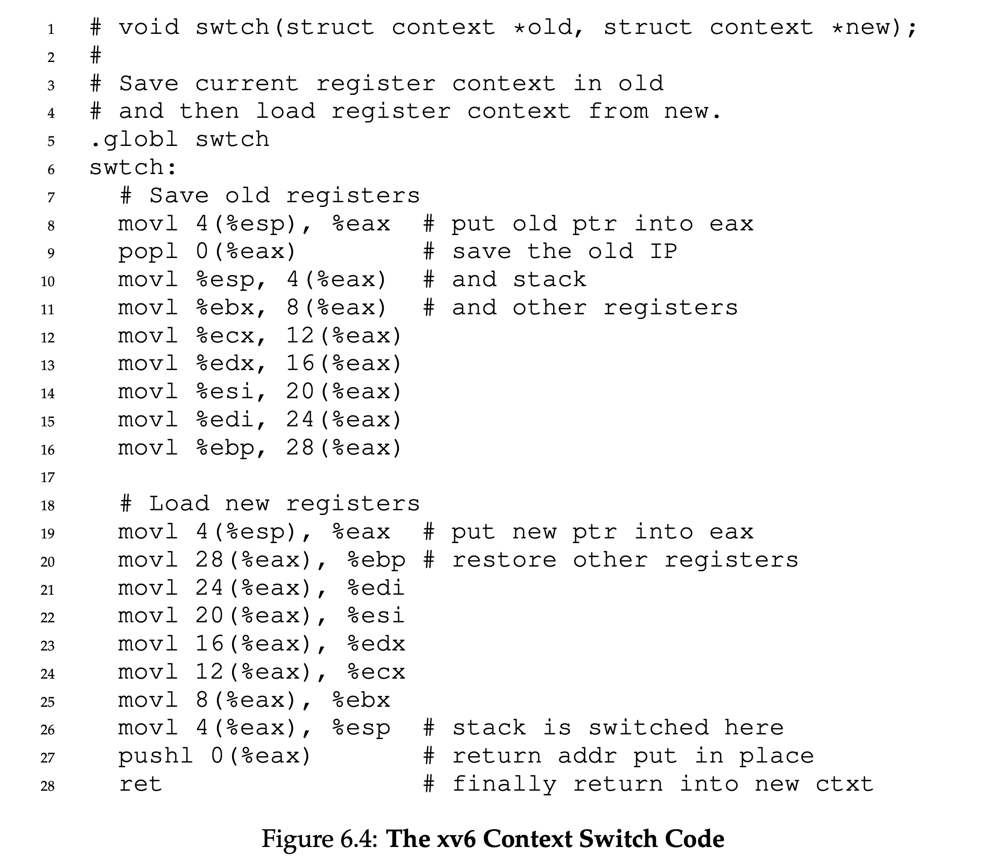

In this post, 2nd lecture of operating system is introduced.

(3 Easy Pieces Chapter 2)

# CPU Virtualization

CPU Virtualization을 위해 운영체제는 겉보기에 동시에 실행되는 여러 작업이 하나의 물리적 CPU를 나누어 사용하도록 해야 한다. 기본 아이디어는 간단하다. 한 프로세스를 잠시 실행한 다음, 다른 프로세스를 실행하는 식으로 계속 전환하는 것이다. 이처럼 CPU를 **시간적으로 분할하여 공유(time sharing)**함으로써 CPU 가상화가 이루어진다. 그러나 이러한 가상화 체계를 구축하는 데에는 몇 가지 어려움이 있다.

- 첫 번째는 **성능(performance)**문제다. 시스템에 지나치게 큰 **추가 비용(overhead)**을 발생시키지 않으면서 어떻게 가상화를 구현할 수 있을까?

- 두 번째는 **제어(control)**문제다. CPU에 대한 통제권을 유지하면서 어떻게 프로세스를 효율적으로 실행할 수 있을까?

운영체제는 시스템 자원을 관리하는 주체이므로 제어권을 유지하는 것이 특히 중요하다. 운영체제가 제어권을 갖지 못한다면, 어떤 프로세스가 무한히 실행되면서 컴퓨터를 독점하거나 접근해서는 안 되는 정보에 접근할 수도 있다. 따라서 **제어권을 유지하면서 높은 성능을 달성하는 것**은 운영체제를 구축할 때 해결해야 하는 핵심 과제 중 하나다.

# Limited Direct Execution

프로그램이 기대한 만큼 빠르게 실행되도록 하기 위해, 운영체제 개발자들은 **제한적 직접 실행(limited direct execution)**이라는 기법을 고안했다. 이 아이디어에서 **직접 실행(direct execution)** 부분은 단순하다. 프로그램을 CPU에서 직접 실행하는 것이다. 따라서 운영체제가 어떤 프로그램의 실행을 시작하려 할 때는 다음과 같은 작업을 수행한다.

- 프로세스 목록에 해당 프로그램의 프로세스 항목을 만든다.
- 프로그램을 위한 메모리를 할당한다.
- 디스크에 저장된 프로그램 코드를 메모리로 불러온다.
- 프로그램의 진입점, 즉 `main()` 함수 또는 그와 비슷한 시작 지점을 찾는다.
- 그 진입점으로 점프하여 실행을 시작한다.
- 사용자의 코드를 실행하기 시작한다. 
- 일반적인 함수 `call`과 `return` 명령을 사용하여 프로그램의 `main()` 함수로 점프하고, 나중에는 다시 커널로 돌아온다.

이러한 접근법은 CPU를 가상화하는 과정에서 몇 가지 문제를 일으킨다.

- 프로그램을 CPU에서 그대로 실행한다면, 운영체제는 그 프로그램을 효율적으로 실행하면서도 프로그램이 우리가 원하지 않는 일을 하지 못하도록 어떻게 보장할 수 있을까?
- 어떤 프로세스가 실행 중일 때, 운영체제는 어떻게 그 프로세스의 실행을 중단시키고 다른 프로세스로 전환할 수 있을까? 즉, CPU 가상화에 필요한 **time sharing** 을 어떻게 구현할 수 있을까?

이제부터 이러한 질문에 답하면서 CPU를 가상화하려면 무엇이 필요한지를 훨씬 명확하게 이해하게 될 것이다. 

## Problem #1: Restricted Operations

Direct Execution은 빠르다는 분명한 장점이 있다. 프로그램이 하드웨어 CPU에서 직접 실행되므로 예상한 만큼 빠르게 작동한다. 그러나 CPU에서 프로그램을 직접 실행하면 한 가지 문제가 생긴다. 프로세스가 다음과 같은 **restricted operation**을 수행하려 한다면 어떻게 해야 할까?

- 디스크에 입출력(I/O)을 요청하는 작업
- CPU나 메모리 같은 시스템 자원을 더 많이 사용하는 작업

예를 들어 파일에 대한 접근을 허용하기 전에 권한을 검사하는 파일 시스템을 만들고 싶다고 하자. 이 경우 모든 사용자 프로세스가 디스크에 직접 I/O 명령을 내리도록 허용해서는 안 된다. 이를 허용하면 프로세스가 디스크 전체를 마음대로 읽거나 쓸 수 있으므로 모든 보호 장치가 무력화된다.

따라서 **사용자 모드(user mode)**라는 새로운 프로세서 모드를 도입한다. 사용자 모드에서 실행되는 코드는 수행할 수 있는 작업이 제한된다. 예를 들어 사용자 모드에서 실행되는 프로세스는 직접 I/O 요청을 내릴 수 없다. 이를 시도하면 프로세서가 exception을 발생시키며, 운영체제는 일반적으로 해당 프로세스를 kill할 것이다.

사용자 모드와 대비되는 것이 **커널 모드(kernel mode)**이다. 운영체제, 즉 커널은 이 모드에서 실행된다. 커널 모드에서 실행되는 코드는 I/O 요청이나 모든 종류의 제한된 명령어 실행을 포함하여 원하는 작업을 수행할 수 있다.

하지만 여전히 한 가지 문제가 남는다. 사용자 프로세스가 디스크 읽기 같은 **특권 연산(privileged operation)**을 수행하려면 어떻게 해야 할까?

이를 가능하게 하기 위해 거의 모든 현대 하드웨어는 사용자 프로그램이 **시스템 콜(system call)**을 수행할 수 있도록 지원한다. 시스템 콜은 커널이 다음과 같은 핵심 기능 일부를 사용자 프로그램에 안전하고 제한적으로 제공할 수 있게 한다.

- 파일 시스템 접근
- 프로세스 생성과 제거
- 다른 프로세스와의 통신
- 추가 메모리 할당

대부분의 운영체제는 수백 개 정도의 시스템 콜을 제공한다. 자세한 내용은 POSIX 표준에서 확인할 수 있다. 반면 초기 Unix 시스템은 약 20개 정도로 구성된 더욱 간결한 시스템 콜 집합을 제공했다.

📝 **시스템 콜이 프로시저 호출처럼 보이는 이유**

`open()`이나 `read()` 같은 시스템 콜의 호출이 왜 C 언어의 일반적인 프로시저 호출과 똑같아 보이는지 궁금할 수 있다. 간단한 이유는 그것이 실제로 프로시저 호출이기 때문이다. 다만 그 프로시저 호출 내부에 잘 알려진 **트랩 명령어(trap instruction)**가 숨겨져 있다.

좀 더 구체적으로 설명하면, 예를 들어 `open()`을 호출할 때는 C 라이브러리 내부의 프로시저를 호출하는 것이다. `open()`을 비롯한 시스템 콜을 처리하기 위해 라이브러리는 커널과 미리 약속된 **호출 규약(calling convention)**에 따라 다음 작업을 수행한다.

- `open()`의 인자들을 정해진 위치에 저장한다. 예를 들어 스택이나 특정 레지스터에 넣는다.
- 어떤 시스템 콜을 요청하는지 나타내는 **시스템 콜 번호**도 정해진 위치, 즉 스택이나 레지스터에 넣는다.
- 앞서 설명한 트랩 명령어를 실행한다.

트랩이 끝난 뒤 실행되는 라이브러리 코드는 반환 값을 꺼내고, 시스템 콜을 요청했던 프로그램으로 제어권을 돌려준다.

따라서 시스템 콜을 수행하는 C 라이브러리의 일부는 **어셈블리어로 직접 작성된다.** 인자와 반환 값을 올바르게 처리하려면 호출 규약을 정확하게 따라야 하며, 하드웨어마다 다른 트랩 명령어도 실행해야 하기 때문이다.

이제 우리가 운영체제로 진입하기 위한 어셈블리 코드를 직접 작성하지 않아도 되는 이유를 알 수 있다. 누군가가 이미 그 어셈블리 코드를 대신 작성해 두었기 때문이다.

system call을 실행하려면 프로그램은 특별한 **trap instruction**을 실행해야 한다. 이 instruction은 kernel 내부로 jump하는 동시에 privilege level을 **kernel mode**로 높인다. kernel에 들어오면 system은 필요한 privileged operation을 수행할 수 있으며(허용되는 경우), 이를 통해 system call을 호출한 process가 요청한 작업을 처리한다.

작업이 끝나면 OS는 특별한 **return-from-trap instruction**을 실행한다. 이 instruction은 예상할 수 있듯이 호출한 user program으로 돌아가는 동시에 privilege level을 다시 **user mode**로 낮춘다.

hardware는 trap을 실행할 때 조금 주의해야 한다. OS가 return-from-trap instruction을 실행했을 때 올바른 위치로 돌아갈 수 있도록, 호출자의 register를 충분히 저장해야 하기 때문이다.

예를 들어 x86에서는 processor가 **program counter**, **flags**,그리고 몇몇 다른 register를 각 process에 할당된 **kernel stack**에 push한다. 이후 return-from-trap은 이 값들을 stack에서 pop하고 user-mode program의 실행을 재개한다. 

trap은 OS 내부에서 어떤 code를 실행해야 하는지 어떻게 알까? system call을 호출한 process가 jump할 address를 직접 지정해서는 안 된다. 일반적인 procedure call에서는 그렇게 하지만, system call에서도 이를 허용하면 program이 kernel 내부의 임의의 위치로 jump할 수 있기 때문이다. 이는 명백히 매우 위험하다. 따라서 kernel이 trap이 발생했을 때 실행할 code를 엄격하게 통제해야 한다.

kernel은 boot time에 **trap table**을 설정함으로써 이를 해결한다. machine이 boot될 때는 privileged mode, 즉 kernel mode로 실행되므로 필요한 대로 machine hardware를 설정할 수 있다.

따라서 OS가 가장 먼저 하는 일 중 하나는 특정한 exceptional event가 발생했을 때 어떤 code를 실행해야 하는지 hardware에 알려주는 것이다. 예를 들면 다음과 같다.

- hard-disk interrupt가 발생했을 때
- keyboard interrupt가 발생했을 때
- program이 system call을 호출했을 때

OS는 일반적으로 특별한 instruction을 사용하여 이러한 **trap handler**들의 위치를 hardware에 알려준다. 이 정보를 전달받은 hardware는 machine이 다음에 reboot될 때까지 handler의 위치를 기억한다. 따라서 system call이나 다른 exceptional event가 발생했을 때 무엇을 해야 하는지, 즉 어느 code로 jump해야 하는지를 알 수 있다.

📝 **Trap Table**

**Trap table**은 CPU가 **예외·인터럽트·system call 같은 trap이 발생했을 때 어느 커널 코드로 이동해야 하는지** 기록한 표다.

| 발생한 사건     | 번호                  | 실행할 커널 코드       |
| --------------- | --------------------- | ---------------------- |
| 0으로 나눔      | 예외 번호 0           | divide-error handler   |
| page fault      | 예외 번호 14          | page-fault handler     |
| timer interrupt | 정해진 interrupt 번호 | timer handler          |
| system call     | 정해진 번호           | system-call entry code |

요약하면 다음과 같다.

hardware는 서로 다른 execution mode를 제공하여 OS를 돕는다.

- **user mode**에서 application은 hardware resource 전체에 접근할 수 없다.
- **kernel mode**에서 OS는 machine의 모든 resource에 접근할 수 있다.

또한 hardware는 다음과 같은 특별한 instruction을 제공한다.

- kernel로 진입하기 위한 **trap instruction**
- user-mode program으로 돌아가기 위한 **return-from-trap instruction**
- **trap table**이 memory의 어디에 있는지 OS가 hardware에 알려주기 위한 instruction

이처럼 실행 제어권을 아무 곳으로나 넘기는 것이 아니라, 미리 정해진 안전한 경로를 통해서만 user mode와 kernel mode 사이를 이동시키는 것을 **protected control transfer**라고 한다.

📝 **Secure System에서는 User Input을 경계하라**

system call이 실행되는 동안 OS를 보호하기 위해 많은 노력을 기울였지만—hardware trapping mechanism을 추가하고 OS를 향하는 모든 call이 이를 거치도록 보장하는 등—**secure operating system**을 구현하기 위해 고려해야 할 요소는 여전히 많다.

그중 하나가 system call 경계에서 argument를 처리하는 방식이다. OS는 user가 전달한 값을 검사하여 argument가 올바르게 지정되었는지 확인해야 하며, 그렇지 않다면 해당 call을 거부해야 한다.

예를 들어 `write()` system call에서 user는 쓰려는 data가 담긴 buffer의 address를 지정한다. user가 실수로든 악의적으로든 잘못된 address—예를 들어 kernel 영역에 속하는 address—를 전달하면 OS는 이를 감지하여 call을 거부해야 한다.

그렇지 않으면 user가 kernel memory 전체를 읽는 것이 가능해진다. 또한 kernel의 virtual memory에는 보통 system의 physical memory 전체가 포함되어 있으므로, 이 작은 실수 하나로 program이 system에 존재하는 다른 모든 process의 memory까지 읽을 수 있게 된다.

정확히 어떤 system call을 요청하는지 지정하기 위해 보통 각 system call에는 **system-call number**가 할당된다. 따라서 user code는 원하는 system-call number를 register 또는 stack의 지정된 위치에 넣어야 한다. 

OS는 trap handler 내부에서 system call을 처리할 때 이 number를 확인한다. 그리고 number가 유효한지 검사한 뒤, 유효하다면 그에 대응하는 code를 실행한다. 이러한 **indirection**은 일종의 protection 역할을 한다. user code는 jump할 정확한 address를 직접 지정할 수 없으며, 대신 number를 통해 특정 service를 요청해야 한다.

마지막으로 한 가지 더 알아둘 것이 있다. trap table의 위치를 hardware에 알려주는 instruction을 실행할 수 있다는 것은 매우 강력한 capability이다. 따라서 예상할 수 있듯이 이 instruction 역시 **privileged operation**이다.

각 process에는 register를 저장하고 복원하기 위한 **kernel stack**이 있다고 가정한다. 이 register에는 **general-purpose register**와 **program counter**가 포함되며, kernel에 진입하거나 kernel에서 빠져나올 때 hardware에 의해 저장되고 복원된다.

**Limited Direct Execution(LDE) protocol** 에는 두 단계가 있다.

- 첫 번째 단계는 boot time에 진행된다. kernel이 trap table을 초기화하고, CPU는 나중에 사용할 수 있도록 그 위치를 기억한다. kernel은 **privileged instruction**을 통해 이 작업을 수행한다. 그림에서 모든 privileged instruction은 굵게 표시되어 있다.

- 두 번째 단계는 process를 실행할 때 진행된다. kernel은 `return-from-trap` instruction을 사용해 process의 실행을 시작하기 전에 몇 가지를 설정한다. 예를 들어 process list에 node를 할당하고 memory를 할당한다.

`return-from-trap`은 CPU를 user mode로 전환하고 process의 실행을 시작한다. process가 system call을 요청하려 하면 OS로 trap된다. OS는 요청을 처리한 다음 다시 `return-from-trap`을 통해 process에 control을 돌려준다.

이후 process는 자신의 작업을 완료하고 `main()`에서 return한다. 일반적으로 이 return은 program을 정상적으로 종료하는 stub code로 이어진다. 예를 들어 stub code는 `exit()` system call을 호출하고, 이 system call은 다시 OS로 trap한다. 이 시점에서 OS가 process의 resource를 정리하면 모든 실행 과정이 끝난다.

## Problem #2: Switching Between Processes

direct execution의 다음 문제는 process 사이의 전환을 구현하는 것이다. 어떤 process가 CPU에서 실행되고 있다는 것은 정의상 OS는 실행되고 있지 않다는 뜻이다. OS가 CPU에서 실행되고 있지 않다면 OS가 어떤 동작을 수행할 방법은 분명히 없다. 그렇다면 OS는 CPU의 control을 어떻게 다시 획득하여 process 사이를 전환할 수 있는가?

### Cooperative Approach: System Call을 기다리기

과거 일부 system이 사용했던 접근법은 **cooperative approach**라고 알려져 있다. 이 방식에서 OS는 system의 process들이 합리적으로 행동할 것이라고 믿는다. 너무 오래 실행되는 process는 주기적으로 CPU를 자발적으로 넘겨주어 OS가 다른 task를 실행하도록 결정할 수 있게 한다고 가정한다.

그렇다면 이런 이상적인 환경에서 우호적인 process는 어떻게 CPU를 넘겨주는가? 대부분의 process는 결국 매우 빈번하게 **system call**을 수행하면서 CPU의 control을 OS에 넘긴다. 예를 들어 file을 열고 이어서 읽거나, 다른 machine에 message를 보내거나, 새로운 process를 생성한다. 이러한 system은 종종 명시적인 **yield system call**도 제공한다. 이 system call은 OS가 다른 process를 실행할 수 있도록 control을 OS에 넘겨주는 것 외에는 아무 일도 하지 않는다.

Application이 잘못된 동작을 수행할 때도 control이 OS로 넘어간다. 예를 들어 application이 0으로 나누거나 접근해서는 안 되는 memory에 접근하려 하면 OS로 향하는 **trap**이 발생한다. 그러면 OS가 CPU의 control을 다시 갖게 되며, 문제를 일으킨 process를 종료할 가능성이 크다.

따라서 **cooperative scheduling system**에서 OS는 system call이나 일종의 illegal operation이 발생하기를 기다림으로써 CPU의 control을 다시 획득한다. 하지만 이런 수동적인 접근법은 이상적이지 않다고 생각할 수도 있다. 예를 들어 어떤 process가 악의적이거나 단순히 bug가 많아서 infinite loop에 빠지고 system call을 전혀 수행하지 않는다면 어떻게 되는가? 이때 OS는 무엇을 할 수 있는가?

### Non-Cooperative Approach: OS가 control을 가져오기

Hardware의 추가적인 도움이 없다면, process가 system call을 수행하기를 거부하거나 실수로 system call을 수행하지 않아 OS에 control을 돌려주지 않을 때 OS가 할 수 있는 일은 거의 없다. 실제로 cooperative approach에서는 process가 infinite loop에 빠졌을 때 취할 수 있는 유일한 해결책이 computer system의 모든 문제를 해결하는 오래된 방법, 즉 **machine을 reboot하는 것**이다. 따라서 우리는 CPU의 control을 획득한다는 일반적인 문제에서 또 하나의 문제에 도달한다. Process들이 cooperative하게 행동하지 않더라도 OS는 CPU의 control을 어떻게 획득할 수 있는가? Rogue process가 machine을 장악하지 못하도록 OS가 할 수 있는 일은 무엇인가?

그 답은 바로 **timer interrupt**이다. Timer device는 수 millisecond마다 interrupt를 발생시키도록 programming할 수 있다. Interrupt가 발생하면 현재 실행 중인 process가 중단되고, OS에 미리 설정된 **interrupt handler**가 실행된다. 이 시점에서 OS는 CPU의 control을 되찾았으므로 원하는 작업을 할 수 있다. 즉, 현재 process를 중단하고 다른 process를 시작할 수 있다.

앞서 system call에서 살펴본 것처럼, OS는 timer interrupt가 발생했을 때 어떤 code를 실행해야 하는지 hardware에 알려야 한다. 따라서 OS는 boot time에 바로 이 작업을 수행한다. 둘째로, OS는 역시 boot sequence 중에 timer를 시작해야 한다. 물론 timer를 시작하는 것은 **privileged operation**이다.

Timer가 시작되고 나면 OS는 결국 자신에게 control이 돌아올 것이라고 확신할 수 있으므로 안심하고 user program을 실행할 수 있다. Timer는 끌 수도 있으며, 이 역시 privileged operation이다. 이에 대해서는 나중에 concurrency를 더 자세히 이해한 뒤 살펴볼 것이다.

📝 **Interrupt 발생 시 hardware의 역할**

Interrupt가 발생할 때 hardware도 일정한 책임을 맡는다. 특히 interrupt 발생 당시 실행 중이던 program의 state를 충분히 저장해야 한다. 그래야 나중에 **return-from-trap instruction**을 실행했을 때 해당 program을 올바르게 이어서 실행할 수 있다.

이 일련의 동작은 명시적인 system call로 인해 kernel에 trap이 발생했을 때 hardware가 수행하는 동작과 매우 유사하다. 이 과정에서 여러 register가 예를 들어 **kernel stack**에 저장되며, 이후 return-from-trap instruction에 의해 쉽게 복원된다.

### Context 저장 및 복원

이제 system call을 통한 cooperative한 방식이든 timer interrupt를 통한 더 강제적인 방식이든 OS가 control을 되찾았으므로, 한 가지 결정을 내려야 한다. 현재 실행 중인 process를 계속 실행할 것인지, 아니면 다른 process로 전환할 것인지 결정해야 한다. 이 결정은 OS의 **scheduler**라고 불리는 부분이 담당한다. Scheduling policy에 대해서는 다음 몇 개 chapter에서 자세히 다룰 것이다.

다른 process로 전환하기로 결정하면 OS는 **context switch**라고 부르는 low-level code를 실행한다. Context switch의 개념 자체는 간단하다. OS가 해야 할 일은 현재 실행 중인 process의 몇몇 register 값을 저장하고(예를 들어 해당 process의 kernel stack에 저장), 곧 실행될 process의 register 값 몇 개를 복원하는 것이다(그 process의 kernel stack에서 가져옴).

이를 통해 OS는 마지막으로 **return-from-trap instruction**이 실행될 때 원래 실행 중이던 process로 돌아가는 대신, 다른 process의 실행을 재개하도록 만든다.

현재 실행 중인 process의 context를 저장하기 위해 OS는 low-level assembly code를 실행하여 해당 process의 general-purpose register, PC, kernel stack pointer를 저장한다. 그런 다음 곧 실행될 process의 register와 PC를 복원하고, kernel stack을 그 process의 kernel stack으로 전환한다.

OS는 stack을 전환함으로써 한 process, 즉 interrupt된 process의 context에서 switch code를 호출하고, 다른 process, 즉 곧 실행될 process의 context에서 그 code로부터 return한다. 이후 OS가 마침내 return-from-trap instruction을 실행하면 곧 실행될 process가 현재 실행 중인 process가 된다. 이것으로 context switch가 완료된다.

### Context switch의 전체 흐름

전체 process의 timeline은 Figure 6.3에 나와 있다. 이 예시에서는 Process A가 실행 중이다가 timer interrupt에 의해 중단된다. Hardware는 A의 register를 A의 kernel stack에 저장하고 kernel로 진입한다. 이때 kernel mode로 전환된다.

Timer interrupt handler에서 OS는 실행 중인 Process A에서 Process B로 전환하기로 결정한다. 이 시점에 OS는 `switch()` routine을 호출한다. 이 routine은 현재 register 값을 Process A의 process structure에 조심스럽게 저장하고, Process B의 register를 B의 process structure에서 복원한 뒤 context를 전환한다. 구체적으로는 stack pointer를 변경하여 A의 kernel stack 대신 B의 kernel stack을 사용한다.

마지막으로 OS가 return-from-trap을 실행하면 B의 register가 복원되고 B가 실행되기 시작한다.

이 protocol 중에는 두 종류의 register 저장 및 복원이 일어난다는 점에 유의해야 한다.

1. **Timer interrupt가 발생했을 때**

   실행 중인 process의 **user register**는 hardware에 의해 암묵적으로 저장된다. 이때 해당 process의 kernel stack이 사용된다.

2. **OS가 A에서 B로 전환하기로 결정했을 때**

   **Kernel register**는 software, 즉 OS에 의해 명시적으로 저장된다. 이번에는 process의 process structure 내부 memory에 저장된다.

두 번째 동작으로 인해 system은 마치 B에서 kernel로 trap된 직후인 것처럼 A의 kernel에서 B의 kernel로 이동한다.

이러한 전환이 어떻게 구현되는지 더 잘 이해할 수 있도록 Figure 6.4에는 xv6의 context switch code가 제시되어 있다. x86과 xv6에 대해 어느 정도 알고 있다면 그 code를 이해할 수 있을 것이다. 이전 process와 새로운 process의 context structure는 각각 이전 process와 새로운 process의 process structure 안에 존재한다.

## Concurrency

“System call을 처리하는 도중에 timer interrupt가 발생하면 어떻게 되는가?” 또는 “하나의 interrupt를 처리하고 있는데 또 다른 interrupt가 발생하면 어떻게 되는가? Kernel에서는 이런 상황을 처리하기 어렵지 않은가?”

답은 그렇다. Interrupt 또는 trap을 처리하는 동안 또 다른 interrupt가 발생할 경우 어떤 일이 일어날지 OS는 실제로 신경 써야 한다. 사실 이것이 이 책 전체의 두 번째 부분에서 다룰 핵심 주제인 **concurrency**다. 자세한 논의는 그때까지 미뤄두겠다.

궁금증을 조금 해소하기 위해, OS가 이러한 까다로운 상황을 처리하는 기본적인 방법 몇 가지를 간단히 살펴보자. OS가 사용할 수 있는 한 가지 간단한 방법은 interrupt를 처리하는 동안 **interrupt를 disable하는 것**이다. 그러면 하나의 interrupt를 처리하는 동안에는 다른 interrupt가 CPU에 전달되지 않는다.

물론 OS는 interrupt를 disable할 때 주의해야 한다. Interrupt를 너무 오랫동안 disable하면 interrupt가 유실될 수 있는데, 이는 기술적으로 말해 좋지 않은 일이다.

Operating system은 내부 data structure에 대한 concurrent access를 보호하기 위해 여러 정교한 **locking scheme**도 개발했다. 이를 통해 kernel 내부에서 여러 activity가 동시에 진행될 수 있다. 이러한 방식은 특히 multiprocessor에서 유용하다.

이 책의 다음 부분인 concurrency에서 살펴보겠지만, 이러한 locking은 복잡할 수 있으며 흥미롭고 발견하기 어려운 다양한 bug를 발생시킬 수 있다.

