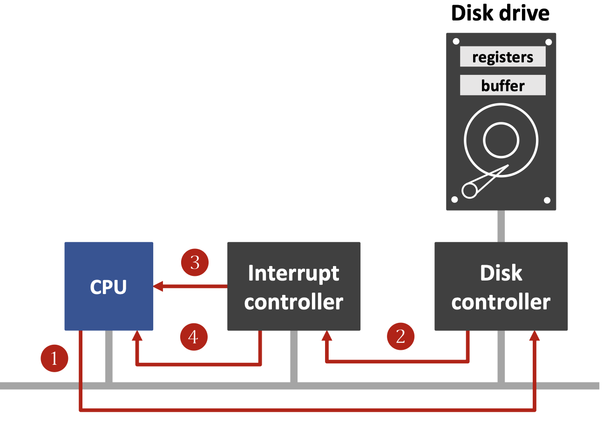
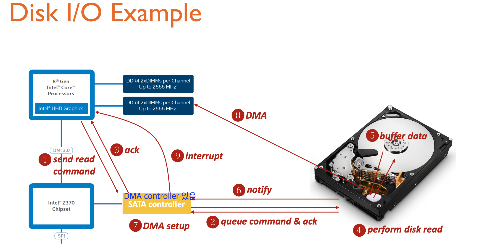
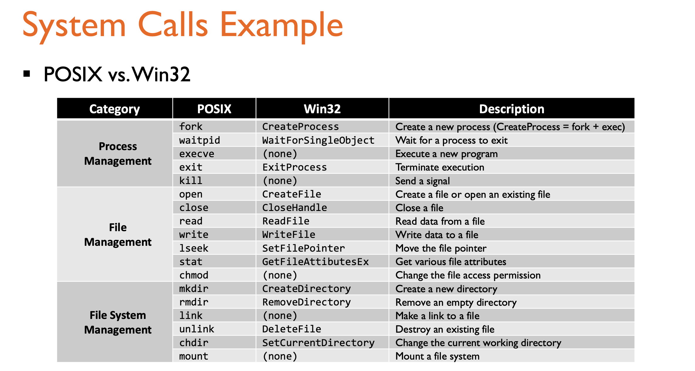
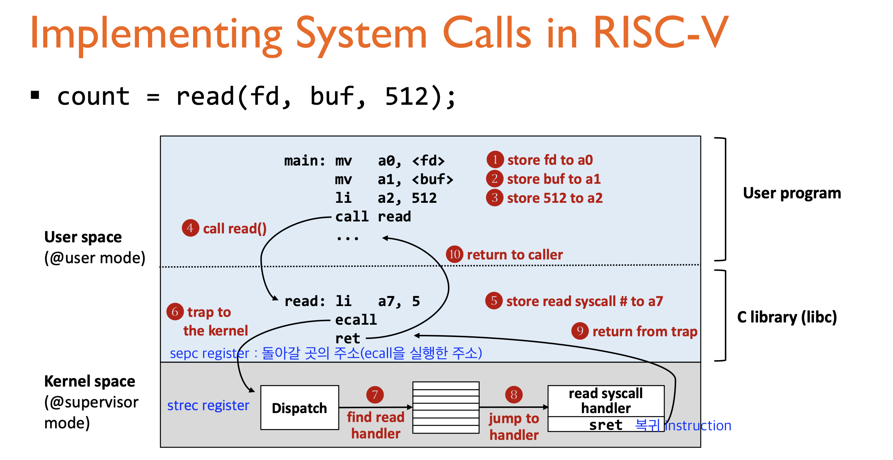
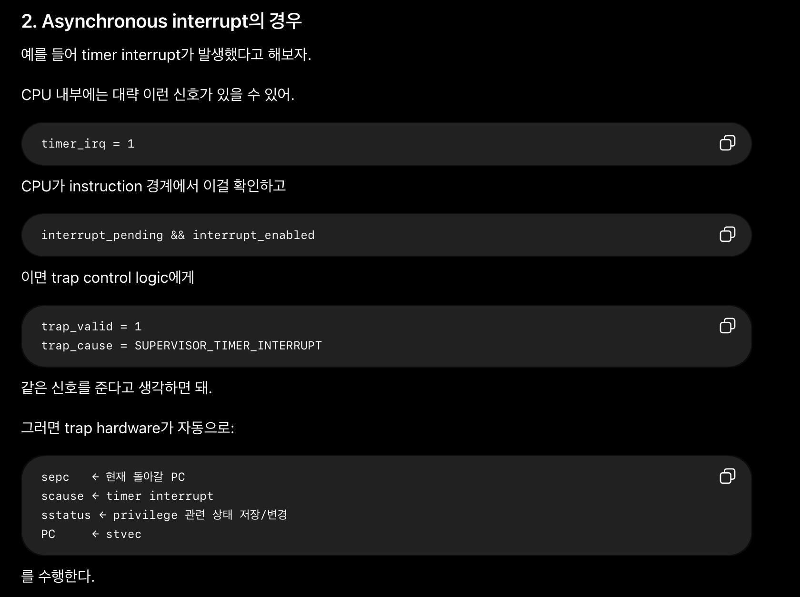
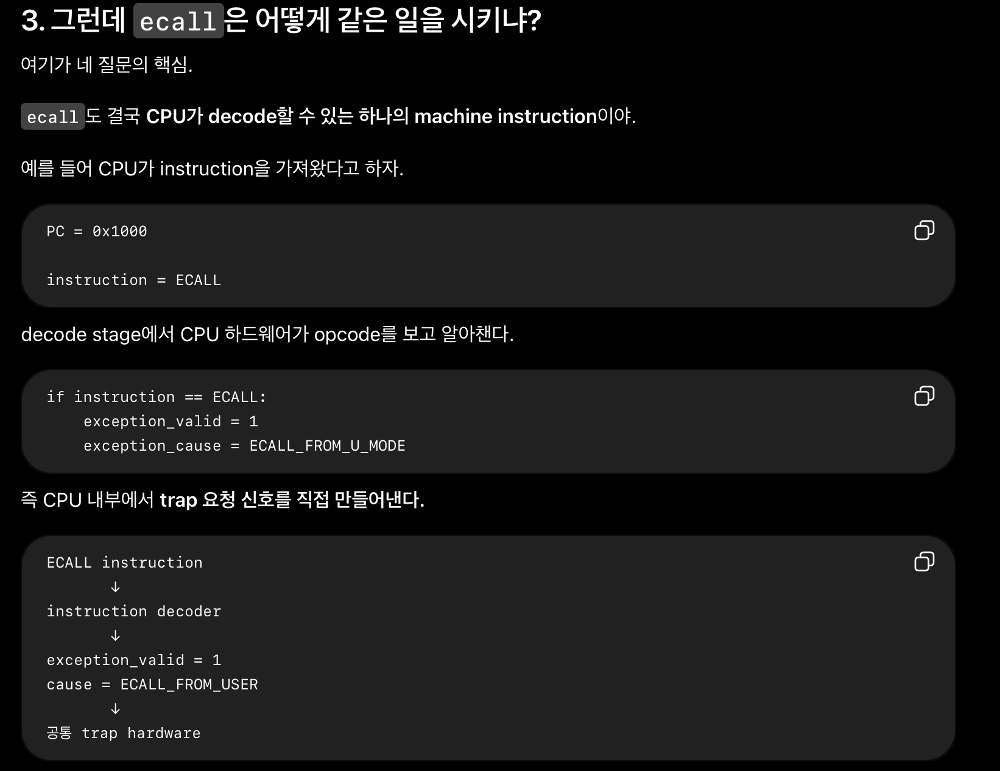
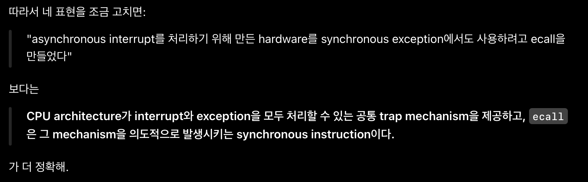
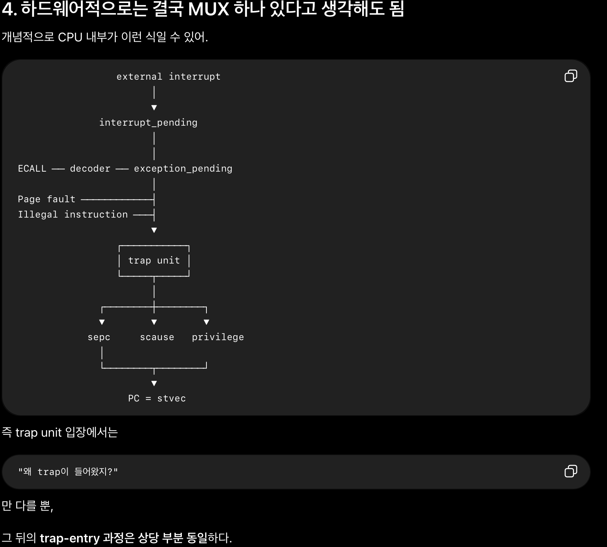

In this post, 3rd lecture of operating system is introduced.

(SNU Lecutre 3, 4)


# Lecture 3, 4 - Architectural Support for OS

OS도 결국 디스크에 있는 Software 인데, OS의 특별한 기능을 수행하기 위해선 하드웨어적 지원이 필요하다. 여기서는 각 이슈별로 어떤 하드웨어 지원이 필요한지 알아본다. 

## Issue 1. I/O

### Step 0. Basic

컴퓨터에서 I/O가 가능하기 위해 다음의 최소한의 장치만 있다고 생각해보자. 

```scss
CPU  ←────────→  I/O device
```

즉, CPU가 장치를 직접 제어하고, 장치가 끝날 때까지 기다리고, 데이터도 직접 옮긴다.

예를 들어 디스크에서 1KB를 읽는다면,

```scss
CPU: "이 데이터 읽어"
CPU: 끝났나?
CPU: 끝났나?
CPU: 끝났나?
...
CPU: 끝났네
CPU: 데이터 하나씩 가져와서 RAM에 저장
```

즉, 어느 장치에서 데이터를 읽어오는 코드를 작성하는 실제 CPU가 실행하는 명령어는, 다음 코드의 instuction이도록 컴파일 되는 셈이다.

```c
while (read_status() == 0) {
    // 아직 키 안 눌림
}

x = read_data();
```

그러면 `read_status()`는 실제로 어떻게 실행되나? **Memory-Mapped I/O** 라면 장치 (여기까지만 읽으면 장치가 I/O 디바이스 자체를 의미한다고 해석되지만 step 1에서 사실 device controller임을 알게 된다)의 register를 특정 메모리 주소처럼 취급한다. (레지스터가 RAM에 있다는 뜻이 전혀 아니다. CPU가 특정 주소로 memory access를 하면 하드웨어가 그 요청을 RAM이 아니라 device controller로 보내주는 것이다.) 그러면 "주소를 보고 어디로 갈지"는 누가 결정하는가? CPU와 RAM/device 사이에 있는 **hardware interconnect**가 담당한다. 현대 컴퓨터에서는 단순한 하나의 bus라기보다는 여러 interconnect/controller가 있지만, OS 처음 배울 때는 **bus가 address를 decode한다**고 생각하면 충분하다.

예를 들어,

```scss
0xFFFF0000 → keyboard status
0xFFFF0004 → keyboard data
```

라고 정해져 있으면 CPU가 그냥

```scss
LOAD R1, [0xFFFF0000]    ; status 읽기
CMP  R1, 0
JE   loop
```

같은 instruction들을 반복 실행할 수 있다.


### Step 1. Device Controller

0단계를 물리적으로 구현하려면 의문이 드는 몇가지가 있다. 

- CPU는 귀한 자원인데, 모든 I/O 작업을 직접 담당하게 하는 것이 맞나?

- 장치의 register를 특정 메모리 주소처럼 취급한다고 했는데 CPU가 장치의 register에 접근하는 법이 무엇인가?
- CPU가 "끝났나?" 라고 물어볼 대상이자 끝났는지를 알려주는 기능을 하는 장치는 어떻게 구현되는가?

첫 번재 질문에 대한 답부터 하자면, 그래서 실제 디바이스 장치를 직접 제어하는 일부터 CPU에게서 떼어내고, Device Controller 라는 하드웨어에게 맞긴다. 

```scss
CPU
 │
 │ 명령
 ↓
Device Controller
 │
 ↓
실제 Device
```

controller에는 보통 이런 인터페이스가 있다.

```scss
┌── Device Controller ──┐
│ command register      │
│ status register       │
│ data/buffer           │
└───────────────────────┘
```

CPU는 이제 실제 장치가 어떻게 움직이는지 세세하게 제어할 필요 없이, `command register = READ`, `address = 1000`  같은 식으로 controller에게 명령만 준다. 

예를 들어 물리적으로 이렇게 있다고 하자.

```scss
CPU
 │
 ├────────── RAM
 │
 └────────── Keyboard Controller
                 ├─ command register
                 ├─ status register
                 └─ data register
```

시스템이 주소를 다음처럼 배정했다고 해보자.

```scss
0x00000000 ~ 0x7FFFFFFF  → RAM

0xFFFF0000               → Keyboard status register
0xFFFF0004               → Keyboard data register
```

CPU가 

```scss
LOAD R1, [0xFFFF0000] # Keyboard Status Register의 값을 R1 Register로 읽어옴
```

을 실행하면 하드웨어가 `0xFFFF0000`은 키보드 controller에 할당된 주소라고 판단해서 RAM이 아니라 keyboard controller로 요청을 보내 status register에 저장된 값을 load 해온다. 비슷하게, command register에 store 할 수 있다.

이제 두번째 질문에서 장치가 사실은 I/O 디바이스 장치가 아니라 device controller 임을 알았고, 이제 질문은 device controller가 실제 디바이스 장치 사이의 상호작용이 어떻게 이루어지는가 이다. 

현대 USB 키보드를 예로 들면 대략 다음과 같은 구조이다. 

```scss
[키보드 내부]
키 스위치
   ↓
키보드 MCU
   ├─ 내부 register / memory
   │
   ↓ USB

[컴퓨터 내부]
USB Host Controller
   ├─ controller registers
   │
   ↓
CPU ↔ RAM
```

키보드에도 실제로 작은 MCU가 있어서 "어떤 키가 눌렸는가"를 감지하고 USB 메시지를 만들어 보내면 이것이 device controller의 data register/buffer에 저장된다. 

마지막 질문도 이제 device controller에 대한 것임을 알았다. step 0에서의 내용을 상기하면, CPU는 주기적으로 device controller의 status register를 load하는 명령을 내려, 끝났는지를 확인하고 이를 **polling** 이라 한다.


### Step 2. Interrupt

장치 제어 자체는 controller에게 넘겼는데, CPU가 여전히 완료 여부를 확인하느라 시간을 버린다. CPU가 계속 물어보지 말고, **장치가 끝나면 CPU에게 알려주면 되는 것 아닌가?** 그게 **interrupt** 이다.



① CPU가 Disk Controller에게 I/O 명령 : CPU가 disk controller의 **command register** 등에 값을 쓴다.

② Disk Controller → Interrupt Controller : 디스크 작업이 끝났다. 이제 polling을 쓰지 않기 때문에, Disk controller가 자기 status register를 BUSY → DONE 같이 바꾸는 것만으로는 CPU가 자동으로 아는 게 아니다. 그래서 **interrupt request 신호(IRQ)**를 보낸다.

```scss
Disk controller
       │
       │ IRQ
       ▼
Interrupt controller
```

Interrupt controller가 필요한 이유는 CPU에 interrupt를 발생시킬 수 있는 장치가 디스크 하나가 아니기 때문이다.

```scss
keyboard ───┐
disk ───────┤
network ────┤→ Interrupt Controller → CPU
timer ──────┤
USB ────────┘
```

여러 interrupt를 모으고, 우선순위를 정하고, CPU에 전달한다.

③ Interrupt Controller → CPU : Interrupt controller가 CPU에 Interrupt가 들어왔다라는 하드웨어 신호를 보낸다. 중요한 건 CPU가 일반 instruction을 실행하다가도 interrupt를 확인할 수 있도록 **CPU 자체에 interrupt를 처리하는 하드웨어 기능이 있다는 것**이다.

예를 들어 CPU가

```scss
ADD
LOAD
MUL
STORE
...
```

를 실행하다가 instruction 하나를 끝냈다고 하자.

CPU 내부적으로

```scss
instruction 완료
       ↓
interrupt pending?
       ↓
YES
       ↓
현재 프로그램 실행 잠시 중단
```

하게 된다.

④ 어떤 interrupt인지 알아낸다. CPU가 interrupt 출처가 디스크인지, 키보드인지, 네트워크인지 알아야 한다. (**Polling 방식**은 interrupt가 들어온 뒤 CPU/OS가 장치들을 확인하면서 keyboard 너야? disk 너야? network 너야? 식으로 원인을 찾는다.) 그래서 interrupt controller가 CPU에게 **interrupt vector 번호** 같은 정보를 제공한다. 예를 들어 개념적으로

```scss
32 → timer
33 → keyboard
46 → disk
47 → network
```

라고 하자. Disk interrupt가 들어오면

```scss
Disk Controller
      │
      │ IRQ
      ▼
Interrupt Controller
      │
      │ interrupt 발생 + vector 46
      ▼
CPU
```

가 된다.


여기서부터는 **CPU 하드웨어 + OS kernel**이 연결된다. CPU에는 interrupt vector에 따라 실행할 코드 위치를 찾는 메커니즘이 있다. 개념적으로

```scss
vector 46
   ↓
Interrupt Vector Table
   ↓
46번 → disk_interrupt_handler 주소
   ↓
PC를 그 주소로 변경
```

그러면 kernel에 있는

```scss
disk_interrupt_handler() {
    ...
}
```

가 실행된다. 이것을 **interrupt handler** 또는 **ISR(Interrupt Service Routine)**이라고 한다. 예를 들어 CPU가 프로그램 A를 실행 중이었다.

```scss
Program A

instruction
instruction
instruction
      ↑
   여기서 interrupt
```

그냥 PC를 disk handler로 바꿔버리면 나중에 어디로 돌아가야 할지 모른다. 그래서 CPU가 현재 실행 상태를 일부 저장한다. PC, 일부 CPU 상태/레지스터 등을 저장하고 kernel의 interrupt handler로 이동한다. handler가 끝나면 interrupt-return 계열 명령을 통해 원래 실행으로 돌아간다.


### Step 3. DMA

interrupt까지 넣어도 또 문제가 있다. controller가 디스크에서 데이터를 읽어서 자신의 **local buffer**에 넣었다고 해보자.

```scss
Disk
 ↓
Controller
┌──────────────┐
│ local buffer │  ← 데이터 도착
└──────────────┘

RAM
```

이 데이터를 RAM으로 옮겨야 한다. 가장 단순하게는 **CPU가 직접 복사**한다.

```scss
Controller buffer
       ↓
   CPU register
       ↓
      RAM
```

예를 들어 계속

```scss
CPU: controller에서 8 byte 읽기
CPU: RAM에 8 byte 쓰기

CPU: controller에서 다음 8 byte 읽기
CPU: RAM에 8 byte 쓰기

...
```

를 반복한다. CPU가 계산을 해야 하는 귀중한 자원인데 **복사기 역할**을 하고 있다. 그래서 CPU가 일일이 옮기지 말고 **전용 하드웨어가 RAM으로 직접 옮기면 되잖아?** 라는 생각을 한다. 이런 역할을 하는 하드웨어 장치가 **DMA (Direct Memory Access)** 이다. 

CPU는 처음에 "이 데이터를 RAM의 0x100000부터 4096 byte 옮겨" 정도만 설정한다. 

```scss
store 0x100000 -> [0xF0000000] 
```

- `0xF0000000` = 저장의 대상이 되는 register 주소. **DMA register의 MMIO 주소**
- `0x100000` = 저장할 값 자체. DMA에게 알려주는 **RAM 목적지 주소**

(Device Controller에서와 마찬가지로 CPU가 실행하는 일반적인 메모리 쓰기 instruction을 이용하는데 다만 주소가 RAM이 아니라 DMA MMIO register에 대응되어 있는 것). 그러면 DMA가 실제 전송을 수행하고 끝나면 interrupt를 발생시킨다.

참고로, DMA를 사용하지 않고 CPU가 직접 데이터를 옮기는 방식을 **PIO** 라고 한다.


| 질문                                        | 방법                 |
| ------------------------------------------- | -------------------- |
| **I/O가 끝났는지 CPU가 어떻게 아는가?**     | Polling vs Interrupt |
| **장치와 RAM 사이 데이터를 누가 옮기는가?** | PIO vs DMA           |

Interrupt가 무조건 polling보다 좋은 건 아니다. I/O가 매우 빨리 끝난다면

```scss
작업 시작
 ↓
context 저장
 ↓
interrupt handler 진입
 ↓
handler 실행
 ↓
context 복원
```

이 interrupt 처리 비용 자체가 부담이 될 수 있다.

차라리 CPU가 아주 잠깐

```c
while (!done)
    check();
```

하면서 기다렸더니 금방 끝나는 게 더 빠를 수도 있다. 그래서 **hybrid polling** 같은 전략을 쓴다.

```scss
I/O 요청
   ↓
잠깐 polling
   ↓
끝났음? ── YES → 바로 처리
   │
   NO
   ↓
CPU는 다른 일
   ↓
나중에 interrupt 등으로 처리
```



## Issue 2. Protection

OS도 소프트웨어고 사용자 프로그램도 소프트웨어인데, 왜 OS만 디스크 제어·페이지 테이블 변경·CPU 정지 같은 위험한 일을 할 수 있는가? CPU 하드웨어가 **현재 실행 권한 수준(mode/privilege level)**을 가지고 있고, 위험한 instruction을 실행할 때 하드웨어가 그 권한을 검사한다.


모든 instruction이 똑같은 권한으로 실행되는 게 아니다. 예를 들어 일반적인 계산은 user program도 자유롭게 한다.

```scss
ADD
SUB
MUL
LOAD   ; 허용된 메모리에 대해서
STORE
```

반면 시스템 전체에 영향을 미칠 수 있는 동작들은 **privileged instruction** 또는 protected instruction으로 제한한다.

```scss
직접 I/O 제어
시스템 control/status register 변경
interrupt 관련 설정
page table 관련 상태 변경
HLT
...
```

예를 들어 x86의 전통적인 port I/O:

```scss
OUT ...
IN  ...
```

같은 I/O 접근은 권한 검사의 대상이 될 수 있다.

앞에서 배운 MMIO에서는

```scss
Device Controller

command register → 0xFFFF0000
status register  → 0xFFFF0008
data register    → 0xFFFF0010
```

처럼 device register를 주소 공간에 mapping한다.

CPU는 그냥

```
STORE [0xFFFF0000], ...
```

같은 일반 memory instruction을 사용한다. 그렇다면 user program도 `STORE`를 실행할 수 있는데 어떻게 막을까? **`STORE` 자체를 privileged instruction으로 만들 필요는 없다.** 대신 **메모리 보호**를 이용한다.

즉 두 가지를 구분해야 한다. 

- **특수 I/O instruction 방식:** instruction 자체에 privilege restriction을 둘 수 있음.

- **MMIO 방식:** `LOAD/STORE`는 일반 instruction이지만, **그 MMIO 주소 영역에 user mode가 접근하지 못하도록 page table/MMU로 보호**한다.

그러면 CPU는 지금 OS인지 user program인지 어떻게 알수 있을까? CPU에는 **현재 privilege level을 나타내는 하드웨어 상태**가 있다. 그러면 CPU가 instruction을 실행할 때

```scss
instruction fetch
      ↓
decode
      ↓
이 instruction에 privilege 필요?
      ↓ YES
현재 CPU privilege 충분함?
   ↙             ↘
 YES              NO
 ↓                 ↓
실행             exception
```

한다. 즉 **CPU가 instruction을 decode하고 실행하는 하드웨어 자체에서 검사**한다.

아키텍처마다 mode가 다르다. 

- x86 

```scss
Ring 0  ← 가장 높은 권한
Ring 1
Ring 2
Ring 3  ← 가장 낮은 권한
```

보통 현대 OS에서는 핵심적으로

```scss
Kernel → Ring 0
User   → Ring 3
```

를 사용한다.

- ARM

```scss
EL3 > EL2 > EL1 > EL0

EL1 : 보통 OS kernel
EL0 : user application
EL2 : hypervisor
EL3 : secure monitor 등
```

- RISC-V

```scss
Machine
   >
Supervisor
   >
User
```

보통

```scss
OS kernel → Supervisor mode
Application → User mode
```

이고 Machine mode는 훨씬 더 높은 수준의 firmware/초기화 등에 사용된다.

user가 mode를 kernel로 바꾸는 것이 가능하면 protection이 아무 의미가 없다. 그래서 **user program은 임의로 privilege level을 올릴 수 없다.** 특정 경로를 통해서만 가능하다. 대표적인 특정 경로가 **system call, exception, interrupt** 다.

## Issue 3. Serving Requests 

앞에서 User program은 위험한 privileged operation을 직접 못 한다는 것을 배웠다. 그럼 프로그램은 파일을 어떻게 읽고, 화면에 어떻게 출력하고, 네트워크는 어떻게 쓰는가? 그 답이 **system call**이다.

user program이 그냥 `kernel_read_file(...);` 해서 kernel 코드를 실행하면 안 될까? 일반 function call은 단순히 PC를 다른 코드 주소로 옮길 뿐이라 여전히 user mode로 **CPU privilege가 안 바뀐다.** 따라서 kernel 코드를 실행하더라도 privileged instruction을 만나면 CPU가 막아버린다.

그래서 system call은 일반 procedure call과 달리 **protection boundary를 넘는 호출**이어야 하고 그렇기 때문에 **protected procedure call**이라고 한다.

예를 들어:

```
write(fd, buf, 100);
```

을 생각해보자.

개념적인 전체 과정은:

```scss
User Program
   │
   │ write(...)
   ▼
C library
   │
   │ syscall을 위한 인자 준비
   ▼
CPU의 system-call instruction
   │
════════════════════════════
   │   user → kernel
   ▼
Kernel
   │
   ▼
sys_write()
   │
   │ 권한/인자 검사
   │ 실제 I/O 처리
   ▼
system-call return
   │
════════════════════════════
   │   kernel → user
   ▼
User Program 계속 실행
```

위 도식에서, Kernel → sys_write 과정을 알아보자. 개념적으로 kernel에는

```scss
sys_read(...)
sys_write(...)
sys_open(...)
sys_close(...)
...
```

같은 system-call handler들이 있다. User가 system call 번호와 argument를 전달하면 kernel이 적절한 handler를 선택한다.

```scss
User
 │
 │ syscall number = WRITE
 │ fd = 1
 │ buffer = 0x...
 │ size = 100
 │
 ▼
──────── privilege boundary ────────
Kernel
 │
 │ syscall number 확인
 ▼
sys_write(...)
```

그런데 kernel은 user의 요청을 무조건 들어주는 게 아니다. Kernel이 먼저 검사한다.

```scss
User request
     ↓
System call
     ↓
Kernel
     ↓
요청이 합법적인가?
권한이 있는가?
주소가 유효한가?
resource limit 안 넘었나?
     ↓
 YES      NO
 ↓         ↓
실행      거부
```



(POSIX란에 써있는 함수들은 system call을 사용하기 위한 user-level API 함수들의 이름이다)

📝 **POSIX**

POSIX는 **Portable Operating System Interface**의 약자고, 쉽게 말하면 **Unix 계열 운영체제들이 공통으로 지켜야 하는 표준 인터페이스 규칙**이다.

예를 들어 Linux, macOS 같은 OS들은 내부 구현은 다르지만, 프로그램 입장에서는 비슷한 방식으로 파일을 열고, 프로세스를 만들고, pipe를 쓰고, signal을 처리할 수 있다. 이걸 가능하게 하는 공통 규격이 POSIX다.

```scss
int open(const char *path, int flags, ...);
```

POSIX는 다음과 같은 user level의 system call API 함수들에 대해 예를 들어, `open()`이라는 함수가 어떤 인자를 받고, 성공하면 file descriptor를 반환하고, 실패하면 `-1`을 반환하고 `errno`를 어떻게 설정하는지 같은 규칙을 정한다. user level, OS level의 개발 과정에서 모두 강제되는 사항이 있다.

- user level의 libc 구현자는 `open()` 함수를 그 규격대로 제공해야 한다.
- OS/kernel도 파일 descriptor, permission, file semantics 같은 기능을 제대로 제공해야 한다.


우리는 지금 여러 issue들에 대해서, OS가 동작하기 위해 어떤 HW 지원이 존재하는지 알아보고 있다. 지금의  issue는 유저가 모든 권한을 가지면 안되기 때문에, 권한이 필요한 작업을 위해서 커널 모드로의 전환이 필요하다는 것이고, 그 과정에서 syscall 이라는 instruction (HW 지원)이 있음을 보았다. 이 HW 지원이 의미 있으려면, 결국 syscall은 유저모드 → 커널모드로 권한이 변경되는 HW적 기능을 수행해야 한다.

여기서 잠깐, **Asynchronous Exception (Interrupt)** 과, **Synchronous Exception (Trap, System call, Abort, Fault)** 에 대해 생각해보자. Interrupt를 처리하기 위해서, 애초에 CPU는 interrupt가 발생했을 때(키보드 입력, disk I/O 완료 등), CPU 외부에서 인터럽트 라인을 통해 강제로 CPU에게 신호를 보내면(❗️) IVT의 해당 벡터로 점프하도록 하드웨어 적으로 구현되어 있다.  또한, 커널모드로 권한이 바뀌도록 CPU architecture 자체가 이런 mechanism을 제공한다.

이미 이런 기능(권한 변경)이 존재하니, Synchronous Exception의 처리를 위해서도, 이 기능을 활용하기 위하여 별도의 명령어를 만든다.  IA32(x86 ISA의 특정 버전) Linux에서 시스템 콜은 **int 0x80** 이라는 명령어로 구현된다. **int**는 소프트웨어가 스스로 interrupt를 일으키게 하는 명령어이다.(위에서 ❗️과정을 하는 명령어로 이해 가능) 이를 software-interrupt 라고 하며 software-interrupt는 (단어에 interrupt가 있지만) Synchronous Exception - Trap에 속한다. CPU가 프로그램 수행중 `int 0x80` 이라는 명령어를 만나면, 마치 외부에서 0x80번 인터럽트가 발생한 것처럼 행동한다. 즉, IVT[80]에 적힌 주소 (code for exception handler 80)로 jump 하여 명령을 수행한다. 이 전체 과정이 하드웨어(CPU)의 동작이다.

그런데 CPU는 IDT가 RAM 어디에 있는지를 알아야 하므로, 현대 x86에서는 IDTR 이라는  special register가 존재한다. 여기에는 IDT의 주소와 관련된 값이 들어있다. CPU는 이 주소를 현재 page table을 이용해서 물리주소로 변환한 뒤 IDT를 읽는다. (**x86**)

이것은  x86에 대한 설명이었다. RISC-V에는 기본 ISA 수준에서 x86의 IDT 같은 메모리 table이 없다. 부팅할 때 kernel이 handler code를 memory에 올리고, 모든 종류의 exception이 발생했을 때 이동할 주소를 `stevc` 레지스터에 저장한다. 

ASynchronous Exception이 일어난 경우를 생각해보자. exception이 실제 발생하면 CPU hardware가 자동으로 다음 일을 한다.(❗️❗️) (그렇게 CPU HW가 만들어졌다.)

- `sepc` 레지스터에 현재 실행 위치를 저장한다. 
2. `scause` 레지스터에 원인을 저장한다. 
5. Supervisor mode로 변경한다.
6. `stvec`를 읽고 PC ← stvec 해서 그곳으로 이동한다. 

그러면 kernel software가 실행되어 `scause` 레지스터를 보고 원인을 구분하고 그에 맞는 처리가 진행된다. 

```scss
switch (scause) {
    case USER_ECALL:
        syscall();
        break;

    case PAGE_FAULT:
        page_fault();
        break;

    case TIMER_INTERRUPT:
        timer_interrupt();
        break;
}
```

이번엔 Synchronous Exception이 일어난 경우를 생각해보자. 시스템콜의 경우를 먼저 생각해보자. x86_64에서 syscall에 대응되는 RISC-V의 명령어는 **ecall** 이다. 예를 들어, 유저가 `count = read(fd, buf, 512);` 라는 코드를 작성했다. 



- 1~3 : 인자로 전달된 정보를 특정 레지스터에 저장한다. (컴파일 결과 만들어진 instruction)
- 4 : `call read` instruction이 수행된다.
- 5 : (5, 6번은 read 함수의 구현에 따른 결과이다) read 함수는 자신이 부를 syscall 번호를 a7 레지스터에 저장한다.
- 6 : ecall instruction을 실행한다. 그러면 위에서의 ❗️❗️ 과정을 수행되게 한다. 
- 7~10 : kernel software가 실행되어 `scause` 레지스터를 보고 원인을 구분하고 그에 맞는 처리가 진행된다. 

abort, fault 시에는 CPU가 수행 중 문제가 발생하면 자동으로 ❗️❗️ 과정이 수행되게 HW가 설계되어 있다. 

📝 **Q & A with GPT**










## Issue 4. Control

CPU가 user process를 실행하기 시작하면 그동안 OS도 CPU를 사용할 수 없기 때문에, OS가 어떻게 다시 CPU의 control을 가져올지가 중요한 문제이다. 가장 단순한 방법은 cooperative approach로, user process가 `read()`, `write()`같은 system call이나 `yield()`를 호출해 자발적으로 kernel로 진입하면서 CPU control을 OS에 넘기는 방식이다. system call은 `ecall`/`syscall` 같은 instruction을 통해 synchronous trap을 발생시키고, hardware trap mechanism이 kernel mode로 전환한 뒤 OS handler를 실행하게 한다. 하지만 process가 bug나 악의적인 의도로 `while(1)` 같은 infinite loop에 빠져 system call이나 `yield()`를 전혀 호출하지 않으면 OS가 CPU를 다시 얻을 기회가 없기 때문에, 이 방식은 user application을 신뢰할 수 있을 때만 사용할 수 있다. 이를 해결하기 위해 현대 OS는 non-cooperative approach를 사용하며, 핵심은 hardware timer이다. OS는 user process를 실행시키기 전에 timer에 일정 시간이 지나면 interrupt를 발생시키도록 설정하고, process가 어떤 코드를 실행하고 있든 시간이 되면 timer가 asynchronous interrupt를 발생시킨다. 그러면 CPU의 interrupt/trap mechanism에 의해 현재 PC와 필요한 상태가 보존되고, privilege level이 user mode에서 kernel mode로 전환되며, kernel의 timer interrupt handler가 실행된다. 이후 OS scheduler는 현재 process를 계속 실행할지 다른 process로 context switch할지를 결정할 수 있다. 따라서 timer interrupt를 이용하면 user process가 CPU를 자발적으로 반납하지 않아도 OS가 주기적으로 CPU control을 강제로 회수할 수 있으며, 이것이 preemptive scheduling의 핵심 원리이다. 또한 user process가 timer를 끄거나 interrupt 시간을 임의로 늘려 CPU를 독점하지 못하도록 timer 설정은 privileged operation으로 제한되어 있어 kernel만 timer를 설정할 수 있다.


## Issue 5. Memory Protection

CPU에서 실행되는 일반적인 user program도 `load`, `store` instruction을 직접 실행한다. 중요한 점은 **load/store 자체는 privileged instruction이 아니라는 것**이다. 만약 memory를 읽고 쓸 때마다

```scss
user program
   ↓
system call / trap
   ↓
kernel이 허가 여부 확인
   ↓
memory access
```

를 해야 한다면, 거의 모든 instruction이 memory를 사용하기 때문에 성능이 처참해진다. 그래서 실제 구조는 다음과 같다.

```scss
User process
    |
 load/store
    |
    v
   CPU
    |
    v
MMU / protection hardware
    |
    | 허용?
    +------ YES ------> Memory
    |
    +------ NO -------> Exception → Kernel
```

즉 **OS가 매 memory access마다 개입하는 것이 아니라, OS가 미리 규칙을 설정해 두고 CPU hardware가 매 access마다 자동으로 검사**한다.

- Process A가 Process B memory에 접근하지 못해야 함.
- User process가 kernel memory에 접근하지 못해야 함.

가장 단순한 memory protection 방식은 **Base register** 와 **Limit register** 를 사용하는 방식이다. Process B가 생각하는 가상주소 공간이 다음과 같다고 하자.

```scss
Process B의 logical address space

0
│  code (실행할 machine instruction)
│
├────────
│  global/static data
│
├────────
│  heap
│
│
│
├────────
│  stack
│
3999
```

이 전체를 실제 RAM의 연속된 구간에 넣으면 실제 physical memory 영역이 다음과 같을 것이다.

```scss
        Physical memory

0
│
│  OS
│
├──────────
│  Prog A
├──────────  ← 10000
│  Prog B
│
│
├──────────  ← 14000
│  Prog C
│
```

OS가 B를 실행시킬 때 CPU의 특수 register를 다음처럼 설정한다.

```scss
base  = 10000
limit = 4000
```

여기서 `base`는 **B가 실제 RAM에서 시작하는 physical address**, `limit`은 **B에게 허용된 주소 공간의 크기**다.

이제 B의 코드가 예를 들어

```scss
load ..., 200
```

처럼 주소 `200`을 접근하려고 한다고 해보자. 여기서 `200`은 physical address가 아니라 **B 기준의 logical address(offset)**다. 그럼 다음의 동작이 CPU HW에 의해 자동으로 일어난다. 

- CPU의 memory protection hardware가 먼저 200 < 4000 인지 확인한다. OK이므로 실제 RAM 주소를 physical address=base+logical address=10000+200=10200 으로 만들어서 RAM의 `10200`을 읽는다.
- 반면 B가 5000이라는 가상주소에 접근하려 하면 5000 > 4000 이므로 B에게 **허용된 logical address 범위를 벗어났다**고 CPU가 판단해서 exception을 발생시킨다.

OS는 context switch할 때

```scss
Process A 실행
base=A_base
limit=A_limit

       ↓ context switch

kernel 실행
       ↓
base=B_base
limit=B_limit

Process B 실행
```

처럼 현재 실행할 process에 맞는 protection state를 CPU에 설정한다.

Base/limit 방식의 큰 문제는 바로 **contiguous allocation** (하나의 process에 연속적인 물리 메모리 할당)을 해야만 한다는 것이다. 즉, Process B가 1 GB라면 RAM에

```scss
[----------- B 1GB -----------]
```

처럼 **1GB짜리 연속된 공간**을 구해야 합니다. RAM이 아래와 같이 남아 있다면 총 free memory는 300+400+500=1200MB 이지만 연속된 1GB 영역은 없다.

```scss
free 300MB
A
free 400MB
B
free 500MB
```

그래서 현대 CPU에서는 **Virtual Memory + Paging** 을 이용한다. 현대 시스템은 보통 process memory를 하나의 큰 연속 영역으로 놓지 않고 **작은 page 단위로 쪼갠다.** 대표적으로 많이 쓰이는 기본 page size가 **4 KiB** 이다. 예를 들어 process의 virtual memory가

```scss
Process A virtual address space

Page 0
Page 1
Page 2
Page 3
```

라고 하더라도 RAM에서는

```scss
Physical memory

Frame 0 : 다른 process
Frame 1 : A Page 2
Frame 2 : kernel
Frame 3 : A Page 0
Frame 4 : 다른 process
Frame 5 : A Page 3
Frame 6 : A Page 1
```

처럼 제각각 떨어져 있어도 된다. 그 대응 관계를 저장하는 것이 프로세스마다 존재하는 **page table** 이다.

```scss
Virtual Page        Physical Frame

Page 0     ───────> Frame 3
Page 1     ───────> Frame 6
Page 2     ───────> Frame 1
Page 3     ───────> Frame 5
```

CPU 안에는 **MMU(Memory Management Unit)**라는 hardware가 있다.

CPU가

```scss
load x1, 0x123456
```

을 실행하면 CPU가 내놓는 주소는 일반적으로 **virtual address** 이다. 그럼 MMU가

```scss
Virtual Address
      ↓
     MMU
      ↓
 Page Table 확인
      ↓
Physical Address
```

으로 변환한다. 그런데 page table에는 단순히 주소 변환 정보만 있는 것이 아니다. 예를 들어 각 page에

```scss
Present
Readable
Writable
Executable
User-accessible
```

같은 protection 정보도 있다. 그래서 어떤 page가

```scss
R=1
W=0
U=1
```

이라면 user program은 읽을 수 있지만 쓸 수 없습니다. store하면 아래처럼 진행된다.

```scss
store
  ↓
MMU: W=0인데 쓰려고 함
  ↓
Page Fault / Access Fault
  ↓
Kernel
```

현대 OS에서는 **process마다 사실상 자기 자신의 page table을 가지고 있다.** A를 실행할 때 OS가 CPU에게

```scss
현재 page table = Page Table A
```

라고 설정한다. B로 context switch할 때

```scss
현재 page table = Page Table B
```

로 변경한다. 따라서 똑같은 virtual address

```scss
0x400000
```

을 접근하더라도

```scss
A 실행 중

0x400000
    ↓
Page Table A
    ↓
Physical frame 17
```

일 수 있고,

```scss
B 실행 중

0x400000
    ↓
Page Table B
    ↓
Physical frame 93
```

일 수 있다. 그래서 **CPU가 process ID를 보고 memory access를 판단하는 게 아니라, 현재 CPU에 설정된 page table과 privilege mode를 이용해서 MMU가 판단한다**고 이해하는 것이 정확하다.

그런데, 매 load/store마다 **RAM에 있는** page table을 찾아가면 너무 느리다. 그래서 MMU 안에 최근 address translation을 저장하는 빠른 cache인 **TLB(Translation Lookaside Buffer)**가 있다.

```scss
CPU
 |
 | VA
 v
TLB ── hit ───────> PA
 |
 miss
 |
 v
Page Table
 |
 v
TLB에 저장
 |
 v
PA
```

그래서 실제로는 대부분

```scss
Virtual address
     ↓
TLB
     ↓
Physical address
```

로 빠르게 처리된다.


```scss
현재 page table을 이것으로 바꿔라
kernel page도 user가 접근 가능하게 만들어라
이 page를 writable하게 만들어라
```

같은 **MMU 설정 변경은 privileged operation** 이다.

그렇지 않으면 악성 program이

```scss
내 page table 수정
       ↓
kernel memory를 내 virtual address에 mapping
       ↓
kernel memory 수정
```

하는 것이 가능해지기 때문이다. 그래서 전체 구조를 한 번에 그리면 다음과 같다.

```scss
                OS / Kernel
                    │
                    │ privileged operation
                    │
                    ▼
            MMU configuration
        (page table, permissions)
                    │
────────────────────────────────────
                    │
              User Process
                    │
                 load/store
                    │
                    ▼
                   CPU
                    │ virtual address
                    ▼
                   MMU
              /             \
        allowed             denied
          │                   │
          ▼                   ▼
     physical memory      exception
                              │
                              ▼
                            Kernel
```


## Issue 6. Synchronization

`x++` 같은 아주 단순한 연산조차 실제 CPU에서는 여러 instruction으로 쪼개지기 때문에, 중간에 interrupt나 다른 thread/core가 끼어들면 값이 꼬일 수 있고, 이를 막기 위해 atomic instruction이 필요하다.

 `x = x + 1`은 실제로 대략 이렇게 실행된다.

```scss
LOAD  R1 ← Mem[x]     // x를 메모리에서 읽음
ADD   R1 ← R1 + 1     // 레지스터에서 +1
STORE R1 → Mem[x]     // 다시 메모리에 저장
```

예를 들어 처음 `x = 10`이라고 하자. 원래 실행 중이던 코드 A가

```scss
LOAD R1 ← Mem[x]   // R1 = 10
ADD  R1 ← R1 + 1   // R1 = 11
```

까지 수행했다. 그런데 **STORE 하기 전에 interrupt가 발생**했다고 하자. CPU가 interrupt handler로 들어가고, 거기서도 똑같이 `x++`를 한다고 하자.

```scss
// interrupt handler
LOAD  R1 ← Mem[x]   // 아직 Mem[x] = 10
ADD   R1 ← R1 + 1   // 11
STORE R1 → Mem[x]   // Mem[x] = 11
```

interrupt handler가 끝나면 원래 코드 A로 돌아옵니다. A는 interrupt 전에 이미 계산해 둔 `11`을 가지고 있으므로

```scss
STORE R1 → Mem[x]   // Mem[x] = 11
```

을 해버립니다. 즉 `x++`를 **두 번 했는데 결과가 12가 아니라 11**이 된다.

여기서 중요한 건 interrupt 자체가 문제가 아니라, 여러 execution stream이 **shared data**를 동시에 접근하면서, 하나의 논리적 연산이 여러 instruction으로 분리되어 있다는 것

이다. Thread A와 Thread B가 동시에 접근해도 똑같은 문제가 생긴다.

single-core CPU에서 kernel code만 생각한다면 critical section에 들어갈 때

```scss
disable interrupt

x++;

enable interrupt
```

같이 하면 어느 정도 해결 가능하다. 하지만 이것만으로는 일반적인 synchronization 해결책이 되지 않는다.

특히 multicore에서는

```scss
Core 0                  Core 1

interrupt disable

LOAD x                   LOAD x
ADD                      ADD
STORE                    STORE
```

처럼 **Core 0에서 interrupt를 꺼도 Core 1은 계속 실행된다.** 그래서 shared memory에 대한 접근 자체를 원자적으로 조정할 방법이 필요하다. 이것이 **atomic instruction**이고 자세한 내용은 나중에 다룬다.
