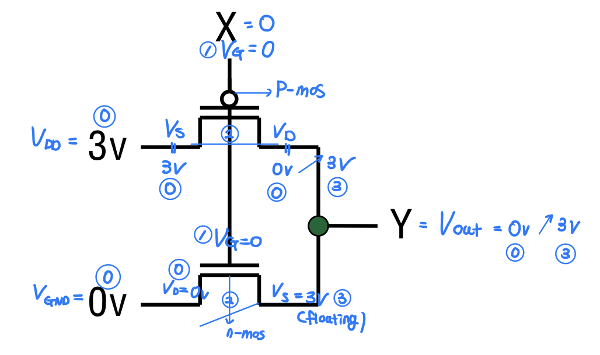

In this post, physical principle that enables the robots to move is summarized.


# From Code to Robots

사용자가 입력한 코드가 어떻게 로봇을 움직이게 하는지 그 사이의 소프트웨어적, 물리적 과정을 알아보자.

## Force, Energy

뉴턴의 제2 법칙을 알아보자. 질량, 가속도의 개념은 정의한 개념이다. 이 때 물체가 가속도를 가지도록 만드는, (동시에 경험적으로도 우리가 느끼는) 물리량을 $\vec F=m \vec a$ 라는 힘으로 정의했다. (**정의**)

양전하와 음전하가 존재하고 쿨롱 법칙에 따라 전하 사이에는 힘이 작용한다. (여기까지는 관측을 통해 알려진 사실, **공리**)

힘의 존재는 유도된 것이 아니라 관측된 것 (가속도를 생기게 하는 무엇인가가 존재한다, 그 무엇을 힘이라 하자)이다.

이렇게 여러가지 힘을 관측해보니 힘을 성질에 따라 두 종류로 구분가능함을 관측했다.

- 이동거리에 대한 힘의 선적분 값이 경로의 시작/끝 점에만 의존하는 경우
  -  $W_{AB} = \int_A^B \vec F \cdot \vec dx$  값이, $A, B$ 만 동일하면 경로와 무관하게 항상 같다.
  - 필요충분조건 : 닫힌 경로에서 위 적분값 = 0
  - 예시 : 중력
- 이동거리에 대한 힘의 선적분 값이 경로에 의존하는 경우
  -  $W_{AB} = \int_A^B \vec F \cdot \vec dx$  값이, 경로에 따라 달라진다.

위의 경우를 보존력, 아래의 경우를 비보존력이라 부르기로 정의했다. (관측을 통한 **정의**)

이제 힘으로부터 일을 이동거리에 대한 힘의 선적분 값으로 다음과 같이 정의한다. (**정의**)

- $W_{AB} = \int_A^B \vec F \cdot \vec dx$

즉, 보존력은 힘이 한 일이 경로에 무관한 힘이라고 할 수 있다. 보존력과 일의 정의로부터 퍼텐셜에너지를 다음과 같이 정의한다. (**정의**)

- $U(x) = -\int_{x_0}^x \vec F \cdot \vec dx$ 
- 정의로부터, 퍼텐셜에너지는 보존력에 대해서만 정의됨을 알 수 있다.
- $x_0$ 는 퍼텐셜에너지가 0이 되는 기준점으로 삼는다.
- 퍼텐셜에너지는 기준점에서 현재 위치까지 힘이 한 일의 음수이다. 

또, 질량, 가속도의 개념으로부터 운동에너지를 다음과 같이 정의한다. (**정의**)

- $E_k = \frac{1}{2}mv^2$  

다음으로, 일과 운동에너지 정리를 알아보자. (**정리**) 

- $W = \frac{1}{2}m\Delta v^2 (=\Delta K_E)$ 
  - 힘이 한 일은, 물체의 운동에너지 변화량과 같다. (적분으로 증명가능)

 일과 운동에너지 정리와, 퍼텐셜에너지의 정의를 이용하면 역학적 에너지 보존법칙을 보일 수 있다. (**정리**)

- 보존력만 일을 할 때, $U+K_E$ = Constant


## Voltage, Battery

퍼텐셜 에너지의 정의에서 양변을 $x$로 미분하면, 다음과 같은 식이 얻어진다. 

- $F = -\frac{dU}{dX}$ 
- 힘의 방향은 가속도의 방향이므로 (뉴턴 제2법칙), 물체는 보존력에 의해, **위치에너지가 감소는 방향으로의 힘을 느낀다** 라는 것을 알 수 있다. (**정의** 로부터 파생된 성질)

$U=0, K_E=0$ 인 상태의 물체를 생각해보자. 보존력인 중력에 역행하여, 물체에 힘을 주어 이동시켜 높은 곳에 물체를 정지시켜 놓으면, $U = C > 0$ , $K_E=0$ 가 된다.  이 때, 물체를 낙하시키면 물체는 보존력만 받으므로, $U=0$ 을 향해 가속되고, $K_E$가 $U$ 만큼 상승하게 된다. 

어떤 위치에 물체를 놓으면 보존력인 중력에 의해 지면을 기준(0)으로 퍼텐셜 에너지 값이 생기듯이, 전기장 속에서 어떤 위치에 전하를 놓으면 보존력인 전기력에 의해 그 위치에 따라 전기 퍼텐셜 에너지 $U$ 가 생긴다. 전기력은 중력과 달리 물체의 전하량에 따라 힘의 크기가 달라지므로, 전기 퍼텐셜 에너지를 전하량으로 나눈 단위 전하당 전기 퍼텐셜 에너지를 전위라 한다. 전위는 해당 위치가 얼마나 에너지적으로 높인 곳인지를 나타내는 척도가 된다. 정리하면 다음과 같다. 

- $\vec E = \frac{\vec F}{q}$ (정의)
- $U(x) = -\int_{x_0}^x \vec F \cdot \vec dx = -\int_{x_0}^x q\vec E \cdot \vec dx$ (정의)
- $V(x) = \frac{U(x)}{q} = -\int_{x_0}^x \vec E \cdot \vec dx $


배터리의 목표는 전위를 만들고, 그곳에 전하를 배치시켜, 전기 퍼텐셜에너지를 갖도록 한다음, 전기력이 작용하여 감소한 전기 퍼텐셜에너지 만큼 운동 에너지가 만들어지도록 하는 것이다. 조금 더 구체적으로 표현하면 다음과 같다. 

배터리는 화학 에너지를 이용해 전하를 분리하여 전위차를 만들고, 그 전위차에 의해 전하가 이동하면서 전기 퍼텐셜 에너지가 감소하고, 그 에너지가 다양한 형태(운동, 열, 빛 등)로 변환된다. 이 각 표현들에 대해 알아보자.

**배터리는 화학 에너지를 이용해 전하를 분리하여 전위차를 만든다.**

물체-중력(힘)-위치 에너지(퍼텐셜 에너지), 전하-전기력(힘)-전기 퍼텐셜 에너지의 관계처럼, 원자들도 원자-강력(힘)-화학 퍼텐셜 에너지의 관계를 가진다. 수소+산소로 분리된 상태에서는 화학 퍼텐셜에너지가 높고, 물 상태에서는 화학 퍼텐셜 에너지가 낮다. 따라서, 이 차이만큼 에너지를 열 등으로 방출하고, 수소+산소는 물이 된다. (이 때, 운동에너지로 가지 않는 이유는 퍼텐셜 에너지의 감소로 순간적으로 가속된 원자들이 곧 바로 충돌 + 진동 + 회전 하면서 에너지가 감소하게 되기 때문이다.)

배터리를 충전할 때, 외부 전원이 전하를 거꾸로 밀어서 화학 상태를 되돌린다. 여기서 화학 상태란, 한 쪽 전극에서는 전자를 잃는 산화 반응이 일어나고, 다른 전극에서는 전자를 얻는 환원 반응이 일어나는 것이다. 그 결과로 전위차가 생겨, 전기 퍼텐셜 에너지와 화학 퍼텐셜에너지가 모두 증가한다. 

배터티를 방전(사용)할 때, 충전을 통해 존재한 전기 퍼텐셜 에너지에 의해 전하가 흐르기 시작한다. 그러나, 전기 퍼텐셜 에너지만 있다면, 전하가 회로를 한 바퀴 돌고 나서 전위가 맞아지면 더 이상 전류가 흐르지 않을 것이다. 이 때, 충전을 통해 존재한 화학 퍼텐셜 에너지가 전기력에 반하는 방향으로 전자를 이동시키는 일을 한다. 그래서 화학 퍼텐셜 에너지가 없어질 때까지 전류가 흐른다. 

**그 에너지가 다양한 형태(운동, 열, 빛 등)로 변환된다.**

전하(전자)는 전기력 때문에 움직이지만 동시에 엄청나게 많이 부딪힌다 (원자와의 충돌, 불순물과 충돌). 이것이 바로 저항이다. 이 때 받는 다른 힘들이 전자의 속도를 감소시킨다. 따라서, 감소한 전기 퍼텐셜 에너지 전체가 운동 에너지로 가지는 않는다. (에너지 보존 법칙에 의해 남는 나머지는 열, 빛 에너지 등의 몫이 된다.)


## Equations

자기력과 자기장은 독립적으로 정의된 것이 아니다. 전류가 흐르면 주변에 이상한 힘이 생기는 것을 관측했고, 이 관측된 힘이 특정 관계를 만족하도록 정의한 것이 자기장이다. 여기서 특정한 관계란 로렌츠 힘 법칙을 만족하도록 하는 것이다. 

**로렌츠 힘 법칙**

- $\vec F = q(\vec E + \vec v \times \vec B)$ (관측된 자기력을 바탕으로 한 자기장의 **정의**)
- 플레밍의 왼손 법칙과 연관

아래부터 나올 4개의 법칙을 맥스웰(Maxwell) 방정식이라 한다. 

**가우스의 전기장 법칙**

- $\nabla \cdot \vec E = \frac{\rho}{\epsilon_0} $
- 전하는 전기장을 만들어낸다. 

**가우스의 자기장 법칙**

- $\nabla \cdot \vec B = 0 $

- 자기 단극자 없다. 시작점, 끝점 없다. 

**패러데이 법칙 (전자기 유도 법칙)**

- $\nabla \times \mathbf{E} = - \frac{\partial \mathbf{B}}{\partial t}$ 
- 변하는 자기장 주변에는 전기장이 생긴다. (전기장이 생긴다고 해서 그 자리에 전하가 있는 것은 아니다)
- Ex. 자석을 움직이면 → 전류 발생 (발전기의 원리) 
  - 자석을 움직인다는 것은 변하는 자기장이 생긴다는 것이므로 전기장이 생기고 이 공간에 도선과 전하가 있었다면 전하가 전기장을 받고 이동하여 전류가 흐르게 된다. 

- 플레밍의 오른손 법칙과 연관

**앙페르-맥스웰 법칙** 

- $\nabla \times \mathbf{B}=\mu_0 \mathbf{J}+\mu_0 \varepsilon_0 \frac{\partial \mathbf{E}}{\partial t}$
- 흐르는 전류 주변 / 변하는 전기장 주변엔 자기장이 생긴다. 


## Electromagnetic Wave

전자기파에 대해 알아보기 앞서, 위 법칙들에서 변하는 전기장, 변하는 자기장의 의미를 먼저 살펴보자.

전기장이 없던 빈 공간에 정전하를 놓는 순간을 생각해보자. 그럼 그 공간에서 정전하의 임의의 거리로부터 전기장의 세기가 존재한다. 그런데 정전하를 놓는 순간과 바로 동시에 매우 멀리 떨어진 거리에 또 다른 전하를 놓는다면 이 전하가 전기장에 의해 힘을 (매우 작은 힘이겠지만) 곧바로 받을까? 

그렇지 않다. 빈 공간에 정전하를 놓는다는 것은 0 → $E(x)$ ($x$ 는 정전하로부터의 거리. 즉 $x$가 고정되면 전기장은 상수임을 의미) 라는 전기장의 변화가 발생한다는 의미이다. 이 때 이 변화는 구면파의 형태로 가까운 곳부터 먼 곳까지 빛의 속도로 전달된다.

- 맥스웰 방정식으로부터 $\nabla^2 E = \frac{1}{c^2} \frac{\partial^2 E}{\partial t^2}$ 을 유도할 수 있다. 이는 전기장이 **파동 방정식**을 따른다는 뜻이다. 그리고 이 파동의 속도가 광속 $c$ 임을 증명할 수 있다. 
- 즉 거리를 $r$ 이라 할 때 $t < r/c$ 이면 거리 $r$ 에서는 아직 전기장이 0이고, $t \geq r/c$ 부터 전기장이 새로운 값을 가지게 되는 것이다. 

그림으로 보면 아래와 같다. 

```scss
t=0        : 변화 시작
t>0        : 반지름 ct 구가 확장

   ●  (전하)

   ↓

   ⭕   ← 변화가 여기까지 도달

   ↓

   ⭕⭕⭕⭕  ← 계속 퍼짐
```

자기장의 변화도 전기장과 마찬가지로 파동의 형태로 전달되며 그 속도는 $c$ 이다. 

❗️여기서 가까운 곳의 E, B가 → 옆 공간의 E, B를 변화시킨다 → 그래서 전달된다고 이해하면 안된다. 전자기 펄스의 전달은 “각 공간에서 맥스웰 방정식이 동시에 성립하면서, 전체적으로 파동 해가 이동하는 것"이다. 

빈 공간에 정전하를 둘 때 특정 위치 $r$ 에서 벌어지는 일을 정리해보자.

- $t < r/c$ : 전기장 0, 자기장 0
- $t = r/c$ : 전기장이 0 → $E(r)$ 로 변화. 변화하는 전기장이므로 자기장이 생성되어 자기장도 0 → $B(r)$ 로 변화.
  - ❗️여기서 자기장도 변화했으므로 또 다시 전기장이 변하는 것 아닌가? 라고 생각할 수 있다. 아니다. '생긴다' 라는 표현에 시간 순서의 의미를 부여하면 안된다. 예를 들어, 앙페르-맥스웰 법칙에서 변하는 전기장이 있으면 자기장이 생긴다는 것은 시간적으로 전기장이 변화하고 난 이후에 자기장이 생긴다는 것이 아니라 전기장의 변화 (1)와 자기장의 생성이 동시에 일어난다는 의미이다. 또, 자기장의 생성은 없던 자기장이 생기는 것이므로 자기장의 변화로 볼 수 있고 패러데이 법칙을 적용하면 동시에 전기장의 변화를 일으킨다. 이 때 말하는 전기장의 변화가 애초에 (1)의 변화를 말하는 것이다. 
- $t > r/c$ : 전기장 $E(r)$, 자기장 $B(r)$ 로 일정하게 유지된다.

따라서, 앞서 전기장이 이동하는 파동을 전기장과 자기장의 묶음으로 생각할 수 있고 이 파동은 특정 거리($r$)에서 시간 $t$를 $x$축, 파동 크기 (파동의 크기는 해당 시간에 자기장, 전기장의 변화량을 의미한다) 를 $y$ 축으로 하는 그래프를 그려보았을 때, 딱 한 번 솟고 다시 0이 되는 그래프가 된다. 이렇게 짧은 시간 동안만 존재하고 지나가는 신호(파동)를 펄스라 하고 이 경우 **전자기 펄스** 라 한다.

```scss
E (또는 B)
↑
│
│        /\
│       /  \
│      /    \
│_____/      \__________
            →
            시간 t
```

이제, 공간에서 전하를 꾸준히 가속시키는(ex. 왕복 운동) 경우를 생각해보자. 특정 거리 $r$ 의 위치에서 고정하여 보면 전기장의 값이 계속 (+)→(-)→(+)→(-) 로 변한다. 전기장이 (+)→(-)로 변할 때 자기장도 (+)→(-) (부호가 중요하지 않다.) 로 변할 것이고, 다시 전기장이 (-)→(+)로 변하면 자기장도 (-)→(+)로 변할 것이다. 이것이 전자기파이다. 특정 거리($r$)에서 시간 $t$를 $x$축, 파동 크기 (파동의 크기는 해당 시간에 자기장, 전기장의 변화량을 의미한다) 를 $y$ 축으로 하는 그래프를 그려보았을 때, 그래프는 아래와 같을 것이다. 

```scss
E (또는 B)
↑
│      / \      / \      / \
│     /   \    /   \    /   \
│____/     \__/     \__/     \____
            →
            시간 t
```

❗전지가파에서 시작 시점에 전하가 있었을 것이다. 즉, 전기장이 존재했다. 이를 정전기장이라 한다. 이후 전하가 가속하면 전기장이 시간에 따라 변한다. 그 "변화"가 맥스웰 방정식에 의해 빛의 속도로 퍼지며 이를 복사장 (전지가파) 라 한다. 즉, 정전기장이 떨어져 나가서 복사장이 되는 것이 아니라 정전기장의 변화가 퍼지는 것이 복사장이다. 

전기장은 실제로 정전기장 + 복사장으로 분해할 수 있다. $E = 정전기장 + 복사장$. 이 때, 정전기장의 크기는 $1/r^2$ 에 비례하고, 복사장의 크기는 $1/r$ 에 비례한다. (❓ 이 부분이 정확히 이해되지 않는다. 전자기파는 정전기장이 아니라 복사장이 이동한 것이라고 하는 것. 복사장이 애초에 정전기장에서 유발된 것 아닌가? 복사장은 $1/r$로 전달되고 ($t=r/c$), 그 이후에 남는 것은 정전기장 $1/r^2$ ($t > r/c$ ) 인 것인가? 그런데 전자기파에선 계속 복사장이 끊임없이 $1/r$ 로 전달되는 것이고?)

파동의 세기는 단위 면적당 단위 시간에 전달되는 에너지인데, 전자기파에서는 특정 지점 $r$에서 전기장의 최대값(진폭)을 $E_0(r)$ 라 할 때, 세기 $I \propto E_0(r) ^2$ 이다. 그런데 전기장의 진폭 (복사장의 크기)는 $E_0(r) \propto 1/r$  이므로, $I \propto 1/r^2$ 이다. 즉, 전자기파의 세기는 거리의 제곱에 비례하여 약해진다. 

흔히 전자기파를 설명할 때 E 변화 → B 생성 → B 변화 → E 생성 → 반복 → 파동 형태로 진행한다는 순차적 생성 설명은 직관용이고 실제 물리는 **E 변화와 B 변화가 동시에 결합된 하나의 파동**이다. 그리고 반복(사인파 형태)은 전하가 계속 가속되어 변화가 계속 공급되기 때문이다.

전자기파는 위치 $x$, 거리 $t$ 에 대해 다음과 같이 사인파로 나타난다. 물론 $x >ct$ 인 지점에서 성립할 것이다. 

- $E(x,t)=E_0 sin(kx−\omega t)$ 
- 거리를 고정했을 때 시간에 따라 사인파로 변하는건 뿐 아니라 시간을 고정했을 때 왜 거리에 따라서도 사인파로 변해 연속적으로 변한다는 것을 공식을 통해 볼 수 있다. 

전하를 가속시키면 E 변화 → B 생성 → B 변화 → E 생성 → 반복 → 파동 형태로 진행할 것임을 알 수 있다. (전하를 한 번만 가속시키면 이런 방식으로 하나의 펄스가 계속 진행할 것이고, 전하를 계속 가속시키면 계속된 파동이 만들어질 것이다.) 이를 전자기파라 한다. 

❗️파동은 에너지(by 힘이 일을 함)이 공간에 전파되는 물리적 방식이다. 소리는 공기의 압력(힘) 변화 파동이다. 공기 입자는 제자리 진동만 하는데, 이동하는 것은 압력 변화와 에너지. 파동 = 힘 전달이 아니다. 힘은 순간적인 상호작용이고, 에너지는 전달되는 양이다.


## Switch

notation은 다음과 같다. 

- $V_{DD}$ : 회로의 전원 전압
- $V_G, V_S, V_D$ : Gate / Source / Drain 전압
- $V_{GS} = V_G - V_S$
- $V_{out}$ : 회로 출력 노드의 전압
- $V_{th}$ : MOSFET이 켜지기 시작하는 최소 전압


- n-Mos
  - switch 닫힐 조건 : $V_{GS} \geq V_{th}$ 
  - switch 유지 조건 :  $V_{DS} < V_{GS} - \lvert V_{th} \rvert$ 
  - 전류 방향 :  $D$ → $S$ (즉, $V_D \geq V_S$. 전압이 높은 곳을 Drain으로 정의. 전자가 $S$ → $D$ 방향으로 이동한다.)
  - n-mos는 source 쪽에 높은 전압을 연결하여 높은 전압을 전달하는 용도로 써야 한다. 그렇지 않으면 (아래 회로는 그렇지 않지만 어떤 경우에는) $V_D$ 가 낮아져 수행 도중 switch 유지 조건이 더 이상 만족되지 않아 끊길 수 있다. 
- p-Mos
  - switch 닫힐 조건 : $V_{SG} > \lvert V{th} \rvert$
  - switch 유지 조건 : $V_{SD} < V_{SG} - \lvert V_{th} \rvert$ 
  - 전류 방향 :  $S$ → $D$  (즉, $V_S \geq V_D$. 전압이 높은 곳을 Source으로 정의. 양공이 $S$ → $D$ 방향으로 이동한다.)
  - $V_D$ 가 low 이면 noise가 발생하므로 $V_D > V_S$를 만족시켜야 한다. (일반적으로 Source는 GND 이므로 $V$를 high voltage에 연결해야 한다.)
  - p-mos는 drain 쪽에 높은 낮은 전압을 연결하여 낮은 전압을 전달하는 용도로 써야 한다. 




위 그림에서 일어나는 일을 순서대로 설명하면 다음과 같다. 

1. 초기값이 $V_{DD} = 3, V_{GND}=0$ 으로 주어진다. (그림 0번)
2. $V_{Y}$ 의 초기값 (이전 회로 상태에 따라 다름) 도 0으로 준다. (그림 0번)
3. 중간에 저항이 없으므로 p-mos에서 $V_{S} = V_{DD} =3$ , $V_{D}=V_{out}=0$이다. n-mos 에서 $V_{D}=V_{GND}=0, V_{S}=0$ 이다. (그림 0번)
4. $V_G$ 값을 3으로 준다. $V_{th}=1$ 이라고 가정하자. (그림 0번)
5. n-mos의 경우 switch 닫힐 조건이 만족되지 않았으므로 전압이 전달되지 않는다. (그림 2번)
6. p-mos의 경우 switch 닫힐 조건이 만족되었으므로 Source → Drain으로 전류가 흐르며, ($V_{DD}=V_{S}=3$ 은 고정이므로) $V_D=3$ 이 되어 전위차가 없어질 때까지 전류가 흐른다. (그림 3번)
7. 전위차가 맞춰지면 더 이상 전류가 흐르지 않게 되고 $V_{out}=3$ 의 상태로 유지되게 된다. n-mos의 $V_s$ 값은 unknown (floating) 이었는데 최종적으로 3이 된다.

만약, $V_G = 3$ 이었다면 최종적으로 $V_{out}=0$ 이 된다. 즉, 위 회로는 Not Gate의 역할을 수행한다. 

❗️회로간에 전류가 전달되는게 아니라 전압 값이 전달되는 것이다. 이 값을 0/1로 해석하게 된다. 

컴퓨터 내부에서는 충전된 배터리가 $V_{DD}=220V$ 의 역할을 수행할 수 있다. 하지만 CPU는 약 1V 정도의 안정된 전압이 필요하다. 큰 전압 → 필요한 작은 전압으로 변환하는 장치인 전원 공급 장치 (PSU / PMIC)의 레귤레이터가 동작하여 변환을 해준다. CPU 칩에는 전원 핀이 있다. $VDD$ 핀, $GND$ 핀을 통해 칩 내부 전체 회로에 전압이 퍼진다. 칩 내부에는 엄청 많은 트랜지스터들이 존재하며 이들이 $V_{DD}$, $V_{GND}$ 에 연결되어 동작한다.  


## Analog vs Digital Signal

마이크에 대고 말을 했을 때 소리가 스피커로 나오는 과정을 이해하며 아날로그 신호와 디지털 신호를 이해해보자.

1. 센서 → 아날로그 전압

소리는 **공기의 압력 변화**이다. 사람이 “아” 하고 말하면, 성대가 떨리면서 주변 공기를 밀고 당긴다. 그러면 공기 중에 압력이 높은 부분, 압력이 낮은 부분이 번갈아 퍼져나간다. 이것이 음파다. 즉 소리는 어떤 물체가 멀리 날아오는 게 아니라, **공기 압력이 시간에 따라 흔들리는 현상**이다.

마이크 안에는 보통 아주 얇은 막이 있으며 이걸 다이어프램(diaphragm)이라 한다. 공기 압력이 커지면 막을 안쪽으로 밀고,
공기 압력이 작아지면 막이 다시 바깥쪽으로 움직인다. 그래서 음파가 들어오면 다이어프램이 소리의 파형에 맞춰 계속 흔들린다.

- 큰 소리 → 더 크게 흔들림, 작은 소리 → 조금 흔들림
- 높은 음 → 더 빠르게 흔들림, 낮은 음 → 더 천천히 흔들림

이렇게 소리 정보가 먼저 **기계적 진동**으로 바뀐다.

마이크에는 얇은 막과 함께 막에 연결된 코일, 그리고 그 주변의 자석이 있다. 소리가 오면 막이 흔들리고, 막에 붙은 코일도 자석 근처에서 함께 움직이게 된다. 그러면 패러데이 전자기 유도 법칙에 의해 **자기장 속에서 코일이 움직이므로 유도 전압**이 생긴다.

즉 막의 위치가 바뀔 때마다 그에 대응하는 **전압**이 바뀌게 만든다. 그러면 시간에 따라 변하는 전압이 생기고, 이 전압 파형이 원래 소리 파형을 닮게 된다. 즉 큰 소리는 큰 전압 진폭으로, 높은 음은 더 빠르게 변하는 전압 파형으로 나타난다. 이것이 바로 **아날로그 전압 신호**이다. 아날로그 신호는 시간에 따라 전압이 연속적으로 바뀌는 신호이다.

```shell
[현실]
  ↓
(센서)
  ↓
아날로그 전압
  ↓
ADC
  ↓
디지털 데이터
  ↓
(컴퓨터 처리)
  ↓
DAC
  ↓
아날로그 전압
  ↓
(스피커/디스플레이)
  ↓
[현실]
```

2. 아날로그 전압 → ADC → 디지털 데이터

유도전압은 그냥 전선(회로)을 통해 ADC 입력으로 직접 전달된다. 전기장이 전선을 따라 전달되면서 전류/전압 상태가 전달된다.(전자도 이동하지만 전자의 이동 속도는 느리므로 빛의 속도로 이동되는 전기장, 즉, 전압의 크기를 측정한다.) (그 중간에 Amplifier, Low-Pass Filter, Offset 등을 통과하여 전압값을 조정하나 생략한다.) ADC 에서는 ADC는 내부적으로 특정 순간 전압을 “잡아두고” (sample & hold), 기준 전압과 비교해서, 디지털 값으로 변환한다. 이 작업은 Sampling (특정 시간 간격마다 전압 측정) → Quantization (sampling 한 아날로그 전압값을 가까운 정해진 값으로 반올림) → Encoding (양자화된 값을 2진수로 바꿈) 

3. 디지털 데이터 → 컴퓨터 처리 →  DAC

CPU는 수 많은 트랜지스터로 이루어진 회로이다. CPU는 전압을 숫자로 변환하는 게 아니라 전압 자체를 받아들여 0/1 상태로 해석하는 회로이다. 받아들인 전압을 또 다른 트랜지스터 들의 연산 회로로 필터링(노이즈 제거, 특정 주파수 강조), 볼륨 조절(값에 상수 곱함) 등을 하여 이산적인 전압 (나타내야 할 8.8V 같은 연속적인 값의 전압을 0V 1V 들로 조합하여 보냄)을 같는 디지털 신호를 DAC로 전달한다. 

4. DAC → 아날로그 전압

DAC는 매 순간 회로를 통해 받아들인 전압들의 sequence가 이진수로 나타내는 전압을 출력한다. 아날로그 전압이 만들어진다. 

5. 아날로그 전압 → 스피커

아날로그 전압 → 전류 흐름 → 코일에 자기장 생성 (맥스웰 법칙) → 막이 움직임 (로렌츠 힘 법칙) → 공기 진동 → 소리


## Electromagnetic Wave

전자기파를 만들기 위해선 전하를 가속시켜야 함을 알았다. 전하를 가속시키는 예시와 방법은 다음과 같다. 

**안테나**

패러데이 법칙에서 보았듯이, 코일을 자기장 안에서 회전시키면 유도 전압도 사인 형태로 변하고, 도선에 전류가 흐른다. 이것이 교류이다. 또는 LC 회로를 이용해서도 교류를 만들 수 있다. 

금속 막대(도선)에 이렇게 교류를 흘리면, 전하를 가속시키는 셈이 되고 전자기파가 발생한다. 

**원자/전자 전이(빛)**

안테나는 거시적인 금속 도선의 전자 집단이고,
여기는 원자 내부 전자의 상태 변화야.

------

## 옛날식 직관

보통 입문에서는 “전자가 궤도를 바꾸며 가속해서 빛을 낸다”고 설명하곤 해.
직관적으로는 맞는 방향인데, **정확히는 양자역학적 상태 전이**로 보는 게 더 맞아.

------

## 더 정확한 설명

원자 안의 전자는 아무 에너지나 가질 수 있는 게 아니라,
허용된 특정 에너지 상태들만 가질 수 있어.

예를 들어

- 높은 에너지 상태
- 낮은 에너지 상태

가 있을 때, 전자가 높은 상태에서 낮은 상태로 내려오면 에너지 차이만큼 빛이 나간다.

ΔE=hfΔE=hf

- ΔEΔE: 에너지 차이
- hh: 플랑크 상수
- ff: 방출된 빛의 주파수

즉, 어떤 색의 빛이 나올지는 이 에너지 차이로 정해진다.

------

## 왜 전자기파가 나가나

고전적인 언어로 직관화하면, 전자의 전하 분포/쌍극자 모멘트가 시간에 따라 변하기 때문이야.
양자적으로는 그 전이가 전자기장과 결합되어 **광자(photon)***를 방출한다고 본다.

즉 원자도 결국은
**시간에 따라 변하는 전하 분포가 전자기파를 낸다**
는 큰 원리를 공유해.

------

## 빛의 색은 왜 다르나

에너지 차이가 다르면 주파수도 다름.

f=ΔEhf=hΔE

그래서

- 에너지 차이가 작으면 낮은 주파수
- 에너지 차이가 크면 높은 주파수

가 된다.

가시광선에서는 이 주파수 차이가 색 차이로 느껴져:

- 빨강: 상대적으로 낮은 주파수
- 파랑/보라: 상대적으로 높은 주파수


## From Code to Robots

