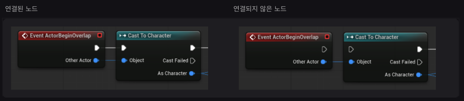

In this post, concepts of Unreal Engine is introduced.


# Unreal Engine

| Blueprint 용어      | 클래스 문법에서 대응                                         |
| ------------------- | ------------------------------------------------------------ |
| Blueprint Class     | `class BP_JumpPad { ... }`                                   |
| Parent Class        | `: public AActor`                                            |
| Component           | 클래스가 가진 부품 객체 (인스턴스랑 다른 것)                 |
| Variable            | 멤버 변수                                                    |
| Function            | 멤버 함수                                                    |
| Event Graph         | 멤버 함수들의 실행 로직 (Event Node의 연결로 구성됨)         |
| Event Node          | 엔진이 호출하는 콜백 함수 (특정 상황이 되면 언리얼 엔진이 다시(call back) 호출하는 함수) |
| Construction Script | 라는 뜻입니다.생성 시 초기화 로직                            |
| Instance            | 클래스로 만든 실제 객체                                      |
| Instance Editable   | 객체마다 바꿀 수 있는 멤버 변수                              |
| Default Value       | 클래스의 기본 멤버값                                         |
| Public 변수         | 외부에서 접근·편집 가능한 변수                               |
| Private 변수        | 클래스 내부에서만 사용하는 변수                              |
| Blueprint Interface | C++ 인터페이스 또는 추상 클래스                              |
| Function Library    | 정적 함수 모음 클래스                                        |
| Level Blueprint     | 특정 레벨 전용 컨트롤러 객체에 가까움                        |

**Construction Script**

블루프린트 액터가 레벨 에디터 뷰포트 또는 게임플레이에서 레벨에 스폰되면 언리얼 엔진은 먼저 컴포넌트를 빌드한 다음 **컨스트럭션 스크립트(Construction Script)**를 실행합니다. 액터 프로퍼티를 변환하거나 변경할 때도 에디터에서 실행되므로 뷰포트에서 결과를 바로 볼 수 있습니다. 이는 블루프린트 액터가 게임플레이를 위해 구성되도록 초기화 액션을 수행하는 데 사용됩니다. 이러한 초기화 액션은 컨텍스트에 따라 다를 수 있습니다. 예를 들어 오브젝트가 배치된 지면 타입에 따라 오브젝트에 다른 머티리얼을 적용할 수 있습니다.

`BP_JumpPad`의 **컨스트럭션 스크립트** 탭을 클릭하면 레벨에 처음 나타날 때, 즉 스폰될 때 일련의 액션을 실행하여 점프 패드의 컬러 및 기타 프로퍼티를 구성하는 **Construction Script** 노드가 표시됩니다.

**Event Graph**

블루프린트의 **이벤트 그래프(Event Graph)**에는 이벤트와 함수 호출을 사용하여 게임플레이 이벤트에 반응하는 동작을 수행하는 노드 그래프가 포함되어 있습니다. 이곳에서 인터랙션과 동적 반응이 구성됩니다. 예를 들어 라이트 블루프린트는 라이트 컴포넌트를 끄고 머티리얼을 변경하는 식으로 대미지 이벤트에 반응할 수 있습니다.

이벤트 그래프의 모든 로직은 플레이어 입력 반응, 애니메이션 트리거, 사운드 재생 등 게임플레이 동안 발생하는 이벤트에 대한 반응이라고 할 수 있습니다. '이런 일이 발생할 때 저런 일을 하고 싶다'면 **이벤트**로 시작해야 합니다.

액션을 실행할 수 있는 노드에는 흰색 삼각형으로 표시되는 **실행** 핀이 있습니다. 노드의 실행 핀이 다른 노드에 연결되지 않은 경우에는 삼각형 흰색 외곽선으로 표시됩니다.



해당 이벤트 노드에는 입력 실행 핀이 없는 것을 알 수 있습니다. 이벤트 노드는 정의된 이벤트가 게임 월드에서 트리거되는 즉시 실행되기 때문입니다. 이 예시에서는 액터가 게임 내에서 `BP_JumpPad`의 액터와 오버랩될 때 이 이벤트가 트리거됩니다.

노드에는 **데이터 핀**도 있을 수 있습니다. 예를 들어 **Event ActorBeginOverlap**에는 **Other Actor** 핀이 있는데, 이는 `BP_JumpPad` 레벨 오브젝트와 오버랩된 레벨 오브젝트(액터)에 대한 레퍼런스입니다. 데이터 핀은 노드 간에 값을 전달하고 실행 핀은 노드가 실행되는 순서를 제어합니다.

**Event ActorBeginOverlap** 노드의 실행 핀이 **Cast To Character** 노드에 연결되어 있습니다. 즉, 플레이어 같은 월드 내 액터가 점프 패드 액터와 오버랩되면 이 블루프린트는 **Cast To Character** 노드를 실행합니다.

**함수**

**함수**는 특정 블루프린트에 속하며, 블루프린트 내 다른 그래프에서 실행 또는 호출할 수 있는 노드 그래프입니다. 함수에는 하나의 엔트리 포인트가 있는데, 실행 출력 핀이 하나 있는 함수 이름으로 된 노드로 표시됩니다. 다른 그래프에서 함수를 호출하면 **함수 엔트리 노드**부터 함수의 로직이 실행됩니다.

다른 블루프린트에 있는 함수를 호출할 때, 함수는 여전히 생성된 블루프린트에서 실행됩니다. 호출을 통해 외부에서 해당 함수에 액세스할 수 있습니다.

함수 자체는 가만히 있는다고 실행되지 않습니다. 이벤트 그래프에서 호출해야 실행됩니다.

**Asset**

**에셋(Asset)**은 언리얼 프로젝트 안에서 사용하는 **재료 파일**입니다.

예를 들면:

- 3D 모델
- 이미지
- 머티리얼
- 소리
- 애니메이션
- 블루프린트 클래스
- 레벨

이런 것들이 전부 에셋입니다.

예를 들어 문을 만든다고 하면:

```scss
SM_Door        → 문 모양의 Static Mesh 에셋
M_Wood         → 나무 표면의 Material 에셋
S_DoorOpen     → 문 여는 Sound 에셋
BP_Door        → 문 동작을 정의한 Blueprint 에셋
```

그리고 `BP_Door` 안의 Static Mesh Component에 `SM_Door` 에셋을 지정합니다.

```scss
BP_Door 인스턴스
└─ Static Mesh Component
   └─ Static Mesh 프로퍼티 = SM_Door 에셋
```

같은 `SM_Chair` 에셋을 의자 인스턴스 100개가 같이 사용할 수도 있습니다. 100개의 메시 파일이 복사되는 것이 아니라, 여러 컴포넌트가 같은 에셋을 참조하는 구조입니다.

**EX**

```scss
BP_Door 인스턴스
├─ Actor 자체 프로퍼티
│  ├─ 위치
│  ├─ 회전
│  ├─ 태그
│  └─ BP 변수: IsOpen, OpenSpeed 등
│
├─ DoorMesh 컴포넌트
│  ├─ Static Mesh (어떤 3D 모델을 사용할지를 정하는 property, SM_Door01 같은 에셋이 올 수 있음)
│  ├─ Material (겉모양을 정하는 property)
│  ├─ Relative Location
│  ├─ Relative Rotation
│  ├─ Collision 설정
│  └─ Visibility
│
├─ BoxCollision 컴포넌트
│  ├─ Box Extent
│  ├─ Collision Preset
│  └─ Generate Overlap Events
│
└─ Audio 컴포넌트
   ├─ Sound
   ├─ Volume
   └─ Auto Activate
```


